# Networking Fundamentals

🟢 **Fundamentals**

---

## Why Networking Matters for DevOps

Your app works locally but fails in production. Why?

- "Connection refused"
- "Timeout after 30 seconds"
- "DNS resolution failed"
- "Port already in use"

Understanding networking means you can **actually debug these issues** instead of guessing.

---

## The OSI Model (Simplified)

Forget memorizing 7 layers. Here's what developers **actually need**:

```mermaid
graph TB
    A["Application Layer<br/>(HTTP, gRPC, DNS)<br/>← Your code"]
    B["Transport Layer<br/>(TCP, UDP)<br/>← Reliability, ports"]
    C["Network Layer<br/>(IP)<br/>← Routing, addresses"]
    D["Link Layer<br/>(Ethernet, WiFi)<br/>← Physical delivery"]
    
    A --> B --> C --> D
    
    style A fill:#bfb,stroke:#333,stroke-width:2px
    style B fill:#ffd,stroke:#333,stroke-width:2px
    style C fill:#bbf,stroke:#333,stroke-width:2px
    style D fill:#fbb,stroke:#333,stroke-width:2px
```



---

## IP Addresses

### IPv4


**Special ranges:**
- `127.0.0.1` → Loopback (localhost)
- `192.168.x.x` → Private (not routable on internet)
- `10.x.x.x` → Private
- `172.16.x.x - 172.31.x.x` → Private
- `0.0.0.0` → "All interfaces" (when binding a server)

---

### IPv6
```
2001:0db8:85a3:0000:0000:8a2e:0370:7334
```

**Why IPv6 exists:**
- IPv4 has ~4 billion addresses (not enough)
- IPv6 has ~340 undecillion addresses

**For DevOps:**
- Most cloud infrastructure supports dual-stack (IPv4 + IPv6)
- Kubernetes prefers IPv4 but can use IPv6

---

## Ports

A **port** is a number (0-65535) that identifies a specific service on a host.


**Port ranges:**
- `0-1023` → **Well-known ports** (require root to bind)
- `1024-49151` → **Registered ports** (assigned to services)
- `49152-65535` → **Ephemeral ports** (temporary, client-side)

**Common ports:**
| Port | Service |
|------|---------|
| 22   | SSH |
| 53   | DNS |
| 80   | HTTP |
| 443  | HTTPS |
| 3306 | MySQL |
| 5432 | PostgreSQL |
| 6379 | Redis |
| 8080 | Common for dev servers |

---

## Sockets

A **socket** is an endpoint for communication.

```
Socket = IP address + Port + Protocol

Example: 192.168.1.100:8080 over TCP
```

**Types:**
1. **TCP socket** — Reliable, connection-oriented
2. **UDP socket** — Unreliable, connectionless
3. **Unix domain socket** — Local IPC (inter-process communication)

---

## TCP: Reliable Delivery

**TCP (Transmission Control Protocol)** guarantees:
- Data arrives in order
- Data is not corrupted
- Lost packets are retransmitted

### Three-Way Handshake (Connection Setup)


**Why this matters:**
- TCP connections have **overhead** (latency from handshake)
- "Connection refused" = server didn't respond to SYN
- "Timeout" = SYN sent but no SYN-ACK received

---

### Four-Way Teardown (Connection Close)


**Why this matters:**
- Connections in `TIME_WAIT` state → can't reuse port immediately
- Too many open connections → can exhaust sockets

---

## UDP: Fast but Unreliable

**UDP (User Datagram Protocol):**
- No handshake (send and forget)
- No delivery guarantee
- No ordering guarantee

**When to use UDP:**
- DNS (speed > reliability)
- Video streaming (dropped frames are OK)
- Gaming (low latency critical)

**When NOT to use UDP:**
- HTTP (use TCP)
- Database connections (use TCP)
- Anything where data loss is unacceptable

---

## DNS (Domain Name System)

DNS translates names → IP addresses.


### How DNS Resolution Works

```
1. Check local cache
2. Check /etc/hosts
3. Query DNS resolver (e.g., 8.8.8.8)
4. If resolver doesn't know, it asks:
   - Root DNS servers
   - TLD DNS servers (.com)
   - Authoritative DNS servers (google.com)
5. Cache the result (TTL = time to live)
```

**Testing DNS:**
```bash
# Query DNS
dig google.com

# Just the IP
dig +short google.com

# Use specific DNS server
dig @8.8.8.8 google.com

# Reverse lookup (IP → name)
dig -x 142.250.80.46
```

---

### DNS in Containers/Kubernetes

**Docker:**
- Containers get DNS from host by default
- Can override with `--dns`

**Kubernetes:**
- Every pod gets DNS via CoreDNS
- Service discovery via DNS: `<service-name>.<namespace>.svc.cluster.local`

**Common issue:**
```bash
# Inside pod
curl http://my-service:8080

# If this fails, check DNS
nslookup my-service
```

---

## NAT (Network Address Translation)

**Why NAT exists:**
- Limited IPv4 addresses
- Private networks (e.g., your home WiFi) need to share one public IP

**How it works:**
```
Your laptop:     192.168.1.100:54321
                     ↓
Router (NAT):    1.2.3.4:12345  (translates)
                     ↓
Internet:        Sees request from 1.2.3.4:12345
```

**Why this matters:**
- **Port forwarding** needed to expose services behind NAT
- Kubernetes NodePort/LoadBalancer handles this for you

---

## Localhost vs 0.0.0.0

```typescript
// Bind to localhost
server.listen(8080, '127.0.0.1');
// Only accessible from THIS machine

// Bind to all interfaces
server.listen(8080, '0.0.0.0');
// Accessible from anywhere (if firewall allows)
```

**Common mistake:**
```typescript
// In Docker container
server.listen(8080, 'localhost');
// ❌ Container's localhost ≠ host's localhost
// External requests can't reach this

// Fix:
server.listen(8080, '0.0.0.0');
// ✅ Accessible from host
```

---

## Firewalls

A **firewall** blocks or allows network traffic based on rules.

**Linux firewall (firewalld on Fedora):**
```bash
# Check status
sudo firewall-cmd --state

# List open ports
sudo firewall-cmd --list-all

# Open port 8080
sudo firewall-cmd --add-port=8080/tcp --permanent
sudo firewall-cmd --reload

# Close port 8080
sudo firewall-cmd --remove-port=8080/tcp --permanent
sudo firewall-cmd --reload
```

**iptables (lower-level):**
```bash
# List rules
sudo iptables -L -n -v

# Allow port 8080
sudo iptables -A INPUT -p tcp --dport 8080 -j ACCEPT
```

**Cloud firewalls:**
- AWS: Security Groups
- GCP: Firewall Rules
- Kubernetes: Network Policies

---

## Common Network Debugging Commands

### Check if a port is open
```bash
# Is port 8080 listening?
netstat -tuln | grep 8080

# Better: ss (socket statistics)
ss -tuln | grep 8080

# Check what's using port 8080
sudo lsof -i :8080
```

---

### Test connectivity
```bash
# Can I reach this host?
ping google.com

# Can I reach this port?
telnet google.com 80
# Better: nc (netcat)
nc -zv google.com 80

# Even better: curl
curl -v http://google.com
```

---

### Trace route
```bash
# See path to destination
traceroute google.com

# With TCP instead of ICMP (more reliable)
sudo traceroute -T -p 443 google.com
```

---

### Capture packets
```bash
# Install tcpdump
sudo dnf install tcpdump

# Capture all traffic on port 8080
sudo tcpdump -i any port 8080

# Save to file
sudo tcpdump -i any port 8080 -w capture.pcap

# Read later with Wireshark
wireshark capture.pcap
```

---

## Network Namespaces (Bridge to Containers)

Linux can isolate network stacks using **network namespaces**.

```bash
# List network namespaces
ip netns list

# Create a namespace
sudo ip netns add test-ns

# Run command in namespace
sudo ip netns exec test-ns ip addr

# Delete namespace
sudo ip netns del test-ns
```

**Why this matters:**
- Docker containers use network namespaces
- Each container has its own network stack (interfaces, routing table, iptables)

---

## How Docker Networking Works (Quick Preview)


**Key points:**
- Containers get IPs in private subnet
- `docker0` bridge connects them
- NAT allows containers to reach internet
- Port mapping (`-p 8080:80`) forwards host port → container port

---

## War Story: The Mysterious Timeout

A developer deployed a TypeScript API to Kubernetes. Health checks passed, but users got timeouts.

**Investigation:**
```bash
kubectl logs <pod>  # App logs looked fine
kubectl exec -it <pod> -- curl localhost:8080  # Worked!
curl http://<service-ip>:8080  # Timeout!
```

**The issue:**
```typescript
// In the code
app.listen(8080, 'localhost');  // ❌ Bound to localhost only
```

**The fix:**
```typescript
app.listen(8080, '0.0.0.0');  // ✅ Accessible from outside
```

**Lesson:** Always bind to `0.0.0.0` in containers.

---

## Key Takeaways

1. **IP + Port + Protocol = Socket** — the fundamental unit of networking
2. **TCP is reliable but slow** — UDP is fast but unreliable
3. **DNS translates names → IPs** — critical for service discovery
4. **Bind to 0.0.0.0 in containers** — not localhost
5. **Firewalls block traffic** — must explicitly allow ports
6. **Network namespaces isolate containers** — gives each container its own network stack
7. **Debugging tools:** `ss`, `lsof`, `nc`, `tcpdump`, `curl`

---

## Exercises

1. **Find listening ports:**
   ```bash
   ss -tuln
   # Identify what service is on each port
   ```

2. **Test DNS resolution:**
   ```bash
   dig +short google.com
   # Compare with:
   dig +short @1.1.1.1 google.com
   ```

3. **Simulate port conflict:**
   - Start two servers on the same port
   - Observe "address already in use" error

4. **Capture HTTP traffic:**
   ```bash
   sudo tcpdump -i any port 80 -A
   # Make a curl request, watch packets
   ```

---

**Next:** [04. cgroups and Namespaces (The Foundation of Containers) →](./04-cgroups-namespaces.md)
