```mermaid
graph TB
    A["Host OS (Linux)<br/>← One kernel shared"]
    B["Container runtime: Docker, etc."]
    
    subgraph Container1
        C1["App A<br/>(cgroups, namespaces)"]
    end
    
    subgraph Container2
        D1["App B<br/>(cgroups, namespaces)"]
    end
    
    A --> B
    B --> C1
    B --> D1
    
    style A fill:#ddf,stroke:#333,stroke-width:2px
    style B fill:#ffd,stroke:#333,stroke-width:2px
    style C1 fill:#bfb,stroke:#333,stroke-width:2px
    style D1 fill:#bfb,stroke:#333,stroke-width:2px
```

# cgroups and Namespaces

🟡 **Intermediate**

---

## The Big Reveal: Containers Are Not Magic

A **container** is not a special kernel feature. It's just:


**That's it.** Docker, Podman, containerd are just **user-friendly wrappers** around these Linux primitives.

---

## Why This Matters

When Kubernetes says "your pod was OOMKilled", you need to understand:
- **cgroups** enforce memory limits
- **Namespaces** create isolated environments
- These are **Linux kernel features**, not Docker magic

Understanding this makes you **dangerous** (in a good way):
- Debug containers that won't start
- Understand why `docker stats` shows what it shows
- Know the difference between VMs and containers

---

## Namespaces: Isolation

Namespaces give each container its **own view** of system resources.

### Types of Namespaces

| Namespace | Isolates | Example |
|-----------|----------|---------|
| **PID** | Process IDs | Container sees its own process tree (PID 1 = its app) |
| **NET** | Network stack | Container has own interfaces, IPs, routing table |
| **MNT** | Filesystem mounts | Container sees its own filesystem |
| **UTS** | Hostname | Container has its own hostname |
| **IPC** | Inter-process communication | Shared memory, semaphores |
| **USER** | User/group IDs | Container can run as "root" without being real root |
| **CGROUP** | cgroup hierarchy | (Rarely used directly) |

---

## PID Namespace (Process Isolation)

Without PID namespaces:
```bash
# Host
ps aux
# Shows EVERY process on the system
```

With PID namespaces:
```bash
# Container
ps aux
# Shows ONLY processes in this container
# PID 1 = container's main process (not systemd)
```

**Why this is powerful:**
- Each container thinks it's the only thing running
- Processes in Container A **cannot see** processes in Container B
- Prevents accidental interference

---

### Hands-On: Create a PID Namespace

```bash
# Run a shell in a new PID namespace
sudo unshare --pid --fork --mount-proc /bin/bash

# Now check processes
ps aux
# You'll see FAR fewer processes!
```

**What just happened:**
- `unshare` created a new namespace
- `--pid` = new PID namespace
- `--fork` = fork a child process in the namespace
- `--mount-proc` = mount a new /proc (so ps works)

---

## Network Namespace (Network Isolation)

Each container gets:
- Its own network interfaces
- Its own IP addresses
- Its own routing table
- Its own iptables rules


---

### Hands-On: Create a Network Namespace

```bash
# Create namespace
sudo ip netns add test-ns

# List interfaces in NEW namespace
sudo ip netns exec test-ns ip addr
# Only shows 'lo' (loopback)

# List interfaces on HOST
ip addr
# Shows eth0, docker0, etc.

# Run shell in namespace
sudo ip netns exec test-ns /bin/bash
ping google.com  # Fails (no network setup yet)
exit

# Delete namespace
sudo ip netns del test-ns
```

---

## Mount Namespace (Filesystem Isolation)

Each container sees its own filesystem tree.


**Why this matters:**
- Container can't accidentally delete host files
- Different containers can have different `/etc/config` files

---

## UTS Namespace (Hostname Isolation)

Each container can have its own hostname.

```bash
# Host
hostname
# fedora-laptop

# Container
docker run --rm -it alpine hostname
# f3a8b2c1e234 (container ID)
```

---

## Putting It Together: How Docker Uses Namespaces

```bash
# Start a container
docker run -d --name test nginx

# Find the process
docker inspect test | jq '.[0].State.Pid'
# Let's say PID is 12345

# Check its namespaces
ls -la /proc/12345/ns/
```

**Output:**
```
lrwxrwxrwx 1 root root 0 Jan 15 10:00 net -> net:[4026532521]
lrwxrwxrwx 1 root root 0 Jan 15 10:00 pid -> pid:[4026532522]
lrwxrwxrwx 1 root root 0 Jan 15 10:00 mnt -> mnt:[4026532520]
...
```

Each symlink points to a namespace ID. Processes sharing the same namespace ID are in the same namespace.

---

## cgroups: Resource Limits

**cgroups (control groups)** limit how much CPU, memory, disk I/O a process can use.

### Why cgroups Exist

Without cgroups:


With cgroups:


---

## cgroup Controllers

| Controller | Limits |
|------------|--------|
| **cpu** | CPU usage (shares, quotas) |
| **memory** | RAM usage |
| **blkio** | Disk I/O bandwidth |
| **devices** | Access to /dev/* (block devices, etc.) |
| **pids** | Max number of processes |

---

## cgroup Versions

**cgroups v1:**
- Older, more complex
- Each controller mounted separately

**cgroups v2:**
- Newer (default in Fedora 31+)
- Unified hierarchy
- Simpler API

**Check which version you have:**
```bash
mount | grep cgroup
# If you see 'cgroup2', you're on v2
# If you see 'cpu,cpuacct', 'memory', etc., you're on v1
```

---

## Hands-On: Create a cgroup (v2)

```bash
# Check if cgroup v2 is mounted
ls /sys/fs/cgroup/

# Create a new cgroup
sudo mkdir /sys/fs/cgroup/demo

# Set memory limit to 100 MB
echo "100M" | sudo tee /sys/fs/cgroup/demo/memory.max

# Set CPU limit to 50% of one core
echo "50000 100000" | sudo tee /sys/fs/cgroup/demo/cpu.max
# Format: [quota] [period] (50ms out of 100ms)

# Run a process in this cgroup
echo $$ | sudo tee /sys/fs/cgroup/demo/cgroup.procs

# This shell now limited to 100 MB RAM, 50% CPU
# Try running a memory hog:
python3 -c "b = bytearray(200*1024*1024)"  # Allocate 200 MB
# Killed (OOM)
```

---

## How Docker Uses cgroups

When you run:
```bash
docker run --memory=512m --cpus=1.5 nginx
```

Docker creates a cgroup with:
- Memory limit: 512 MB
- CPU limit: 1.5 cores

**You can inspect it:**
```bash
# Find container ID
docker ps

# Find cgroup path (depends on Docker version)
sudo find /sys/fs/cgroup -name "*<container-id>*"

# View memory limit
sudo cat /sys/fs/cgroup/.../memory.max
```

---

## Kubernetes Resource Limits = cgroups

In Kubernetes:
```yaml
resources:
  requests:
    memory: "256Mi"
    cpu: "500m"  # 0.5 cores
  limits:
    memory: "512Mi"
    cpu: "1"
```

**What happens:**
- `requests` → Kubernetes uses this for scheduling (guarantees)
- `limits` → Translated to cgroup limits
- If container exceeds `memory.max` → OOMKilled

---

## War Story: The Mysterious OOMKill

A Go service kept getting OOMKilled in Kubernetes.

Checking the manifest:
```yaml
resources:
  limits:
    memory: "512Mi"
```

Checking the code:
```go
var cache = make(map[string][]byte)
// Never evicted, grew unbounded
```

**What happened:**
- Cache grew beyond 512 MB
- cgroup's memory limit hit
- OOM killer killed the process
- Kubernetes restarted the pod

**The fix:**
1. Set a larger memory limit (short-term)
2. Implement LRU cache eviction (long-term)

---

## cgroups vs Quotas

**Common confusion:**

| Feature | Purpose | Enforced by |
|---------|---------|-------------|
| cgroups | Limit resources **per process/container** | Kernel |
| Quotas | Limit disk space **per user/filesystem** | Filesystem |

---

## The Difference Between Containers and VMs

People always ask: "What's the difference?"

### Virtual Machines


**Overhead:**
- Each VM runs a full kernel
- 100 VMs = 100 kernels
- Heavy (GB of RAM per VM)

---

### Containers


**Overhead:**
- All containers share host kernel
- 100 containers = 1 kernel
- Lightweight (MB of RAM per container)

---

## Security Implications

### VMs
- **Strong isolation** — each VM has its own kernel
- VM escape is rare (but possible)

### Containers
- **Weaker isolation** — shared kernel
- Container breakout → can attack host
- Must use seccomp, AppArmor, SELinux for defense

**Rule of thumb:**
- VMs → untrusted workloads (multi-tenant SaaS)
- Containers → trusted workloads (your own apps)

---

## Key Takeaways

1. **Containers = cgroups + namespaces + union FS** — not magic, just Linux features
2. **Namespaces isolate resources** — PID, network, filesystem, hostname, etc.
3. **cgroups limit resources** — CPU, memory, I/O
4. **Docker/Kubernetes use these primitives** — now you understand what's under the hood
5. **VMs isolate kernels, containers share kernels** — VMs are heavier but more secure
6. **OOMKills happen when cgroup memory limit is hit** — check your limits
7. **You can create namespaces/cgroups manually** — `unshare`, `/sys/fs/cgroup`

---

## Exercises

1. **Create a PID namespace:**
   ```bash
   sudo unshare --pid --fork --mount-proc /bin/bash
   ps aux  # Compare with host
   ```

2. **Create a network namespace:**
   ```bash
   sudo ip netns add test
   sudo ip netns exec test ip addr
   ```

3. **Create a cgroup and limit memory:**
   ```bash
   sudo mkdir /sys/fs/cgroup/test
   echo "100M" | sudo tee /sys/fs/cgroup/test/memory.max
   # Try allocating more than 100 MB
   ```

4. **Inspect Docker container's cgroups:**
   ```bash
   docker run -d --name test nginx
   docker inspect test | jq '.[0].State.Pid'
   sudo ls -la /proc/<PID>/ns/
   ```

---

**Next:** [05. systemd and Service Management →](./05-systemd-service-management.md)
