# What Containers Actually Are

🟡 **Intermediate**

---

## The Complete Picture

You've learned that containers use **cgroups** and **namespaces**. Now let's add the third piece:


---

## Layered Filesystems (Union FS)

### The Problem

Without layers:


With layers:

```mermaid
graph TB
    Base["Base layer (Ubuntu): 100 MB ← Shared"]
    Node["Node.js layer: 200 MB ← Shared"]
    A["App A layer: 10 MB"]
    B["App B layer: 15 MB"]
    C["App C layer: 12 MB"]
    Total["Total: 100 + 200 + 10 + 15 + 12 = 337 MB"]
    
    Base --> Node
    Node --> A
    Node --> B
    Node --> C
    A --> Total
    B --> Total
    C --> Total
    
    style Base fill:#bfb,stroke:#333,stroke-width:2px
    style Node fill:#bfb,stroke:#333,stroke-width:2px
    style A fill:#bbf,stroke:#333,stroke-width:2px
    style B fill:#bbf,stroke:#333,stroke-width:2px
    style C fill:#bbf,stroke:#333,stroke-width:2px
    style Total fill:#9f9,stroke:#333,stroke-width:3px
```


---

## How Image Layers Work

An image is a **stack of read-only layers**.


**Key insight:** 
- Layers are **immutable** (read-only)
- Docker uses **copy-on-write**: if a container modifies a file, it copies it to a new layer

---

## Copy-on-Write (CoW)

1. Container starts from image (read-only layers)
2. Docker adds a **writable layer** on top
3. Container reads files normally (from lower layers)
4. If container **writes** to a file:
   - File is copied from lower layer to writable layer
   - Changes happen in writable layer only
   - Original file unchanged


---

## Union Filesystems in Docker

Docker supports multiple filesystems:

| Filesystem | Status | Notes |
|------------|--------|-------|
| **overlay2** | Default (modern) | Fast, efficient |
| **aufs** | Old (deprecated) | Slower |
| **btrfs** | Specialized | CoW built into filesystem |
| **zfs** | Specialized | CoW built into filesystem |

**Check yours:**
```bash
docker info | grep "Storage Driver"
```

---

## Anatomy of a Container

```mermaid
graph TB
    subgraph Container["🐳 Container"]
        subgraph PID["Process tree (PID namespace)"]
            P1["PID 1: /app/server"]
            P2["PID 2: /app/worker"]
        end
        
        subgraph NET["Network (NET namespace)"]
            N1["eth0: 172.17.0.2"]
            N2["lo: 127.0.0.1"]
        end
        
        subgraph MNT["Filesystem (MNT namespace)"]
            F1["Layered image + writable top"]
        end
        
        subgraph UTS["Hostname (UTS namespace)"]
            H1["f3a8b2c1e234"]
        end
        
        subgraph CG["Resource limits (cgroups)"]
            R1["CPU: 1 core"]
            R2["Memory: 512 MB"]
        end
    end
    
    style Container fill:#e6f3ff,stroke:#333,stroke-width:3px,color:#000
    style PID fill:#ffe6e6,stroke:#333,stroke-width:2px,color:#000
    style NET fill:#e6ffe6,stroke:#333,stroke-width:2px,color:#000
    style MNT fill:#fff0e6,stroke:#333,stroke-width:2px,color:#000
    style UTS fill:#f0e6ff,stroke:#333,stroke-width:2px,color:#000
    style CG fill:#ffffcc,stroke:#333,stroke-width:2px,color:#000
```



---

## Container Lifecycle


---

## Images vs Containers

| Image | Container |
|-------|-----------|
| Read-only template | Running instance |
| Stored on disk | Exists in memory |
| Built once | Created many times |
| Defined by Dockerfile | Defined by `docker run` args |
| Immutable | Has writable layer |

**Analogy:**
```
Image = Class
Container = Object instance
```

---

## Docker Architecture

```mermaid
graph TB
    A["Docker CLI<br/>(docker ...)"]
    B["Docker Daemon (dockerd)<br/>• Image Mgmt• Container Lifecycle<br/>• Networking• Volume Mgmt"]
    C["containerd (runtime)<br/>• Manages container lifecycle<br/>• Pulls images<br/>• Low-level container operations"]
    D["runc (OCI runtime)<br/>• Creates namespaces<br/>• Sets up cgroups<br/>• Executes container process"]
    
    A -->|"REST API"| B
    B --> C
    C --> D
    
    style A fill:#bfb,stroke:#333,stroke-width:2px
    style B fill:#ffd,stroke:#333,stroke-width:2px
    style C fill:#bbf,stroke:#333,stroke-width:2px
    style D fill:#fda,stroke:#333,stroke-width:2px
```



**Key components:**
- **Docker CLI** → What you type
- **dockerd** → Docker daemon (background service)
- **containerd** → High-level runtime (pulls images, manages containers)
- **runc** → Low-level runtime (creates namespaces, starts process)

---

## OCI (Open Container Initiative)

**Problem:** Docker was the only game in town (vendor lock-in).

**Solution:** Open Container Initiative standardized:
1. **Image spec** — How to build images
2. **Runtime spec** — How to run containers

**Result:**
- Multiple runtimes: runc, crun, kata (VMs), gVisor (sandboxed)
- Multiple tools: Docker, Podman, containerd, CRI-O
- Interoperability

**Key insight:** Docker is just **one implementation** of OCI standards.

---

## Docker vs Podman

| Feature | Docker | Podman |
|---------|--------|--------|
| Daemon | Yes (dockerd) | No (daemonless) |
| Root required | Yes (by default) | No (rootless mode) |
| CLI compatibility | Docker CLI | Docker-compatible CLI |
| Kubernetes native | No | Yes (generates K8s YAML) |
| Default on Fedora | No | Yes |

**Why Podman exists:**
- No daemon = better security
- Rootless = run as normal user
- Direct systemd integration

**On Fedora:**
```bash
# Podman is preinstalled
podman run hello-world

# Alias for Docker compatibility
alias docker=podman
```

---

## Container Registries

A **registry** stores and distributes images.

```mermaid
graph TD
    subgraph Registry["📦 Registry (e.g., Docker Hub)"]
        I1["user/myapp:latest"]
        I2["user/myapp:v1.0"]
        I3["nginx:alpine"]
        I4["postgres:14"]
    end
    
    subgraph Local["💻 Local Docker Daemon"]
        L1[" "]
    end
    
    Local -->|"docker push"| Registry
    Registry -->|"docker pull"| Local
    
    style Registry fill:#e6f3ff,stroke:#333,stroke-width:2px,color:#000
    style Local fill:#ffe6f0,stroke:#333,stroke-width:2px,color:#000
    style I1 fill:#d4edff,stroke:#333,stroke-width:1px,color:#000
    style I2 fill:#d4edff,stroke:#333,stroke-width:1px,color:#000
    style I3 fill:#d4edff,stroke:#333,stroke-width:1px,color:#000
    style I4 fill:#d4edff,stroke:#333,stroke-width:1px,color:#000
```



**Major registries:**
- **Docker Hub** — Public, free tier limited
- **GitHub Container Registry (ghcr.io)** — Free for public repos
- **AWS ECR** — Private, AWS-integrated
- **Google Artifact Registry** — Private, GCP-integrated
- **Quay.io** — Public/private, by Red Hat

---

## Image Tags


**Special tags:**
- `latest` → **NOT** "newest version", just a default tag
- `alpine` → Minimal base (5 MB vs 100 MB)
- `slim` → Smaller than full, bigger than alpine

**Best practice:**
```bash
# ❌ Bad (unpredictable)
docker pull nginx:latest

# ✅ Good (pinned version)
docker pull nginx:1.25.3-alpine
```

---

## Image Digests (The Real Immutable Identifier)

Tags are **mutable** (can be overwritten). Digests are **immutable**.

```bash
# Pull by tag
docker pull nginx:latest

# See digest
docker images --digests
# nginx  latest  sha256:abc123...  5 MB

# Pull by digest (guarantees exact image)
docker pull nginx@sha256:abc123...
```

**Why this matters:**
- Security: Ensure you're running the exact image you audited
- Reproducibility: CI/CD should use digests, not `latest`

---

## War Story: The Disappearing Bug

A team deployed `myapp:latest` to production. Tests passed, everything worked.

Next day, the same deployment **started failing**.

**What happened:**
1. Another team pushed a new `myapp:latest` (with a breaking change)
2. Kubernetes pulled the new `latest` on a different node
3. Same tag, different image

**The fix:**
```yaml
# Before
image: myapp:latest

# After
image: myapp:v1.2.3
# Or even better:
image: myapp@sha256:abc123...
```

**Lesson:** **Never use `latest` in production.**

---

## Key Takeaways

1. **Containers = cgroups + namespaces + layers** — complete mental model
2. **Layers are read-only, shared, and stacked** — efficiency through deduplication
3. **Copy-on-write** — containers modify files by copying to writable layer
4. **Images are templates, containers are instances** — like classes and objects
5. **Docker is just one implementation** — OCI standardizes the ecosystem
6. **Registries store images, digest ensures immutability** — tags can change
7. **Never use `latest` in production** — pin versions or use digests

---

## Exercises

1. **Inspect image layers:**
   ```bash
   docker history nginx:alpine
   # See each layer and its size
   ```

2. **Compare storage usage:**
   ```bash
   docker system df
   # See how much space images/containers/volumes use
   ```

3. **Pull image by digest:**
   ```bash
   docker pull nginx:alpine
   docker images --digests | grep nginx
   # Copy digest, then pull by digest
   ```

4. **Run Podman (Fedora):**
   ```bash
   podman run --rm -it alpine sh
   # Notice no daemon needed
   ```

---

**Next:** [02. Dockerfile Optimization →](./02-dockerfile-optimization.md)
