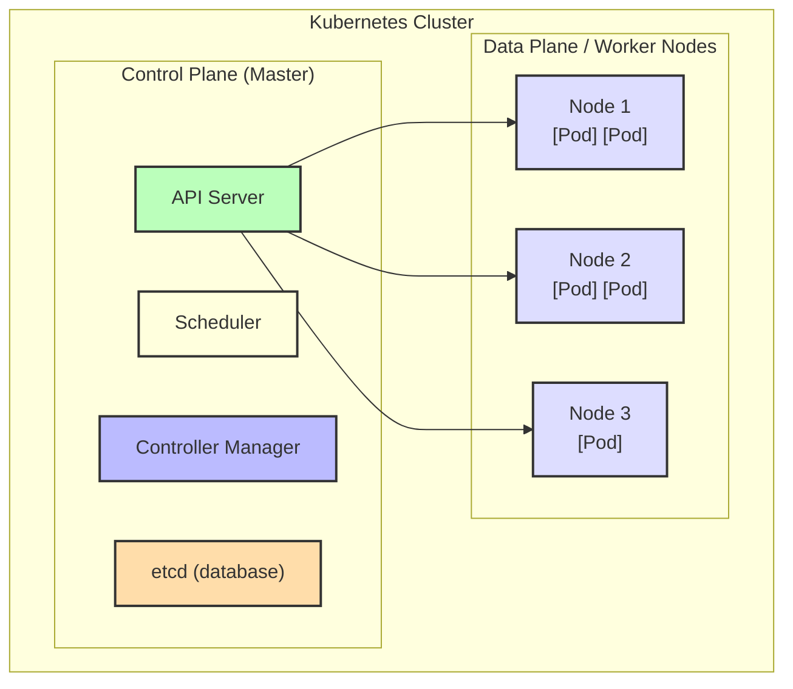

# Why Kubernetes Exists

🟢 **Fundamentals**

---

## The Problem: Running Containers at Scale

You've learned containers. Now imagine:

**Scenario:** You have 100 microservices, each in a container.

**Questions:**
1. Where do these containers run? (Which servers?)
2. What happens when a container crashes?
3. How do containers find each other?
4. How do you deploy a new version without downtime?
5. How do you scale from 10 to 100 instances?
6. What if a server dies?

**Without Kubernetes:** You write scripts. Lots of scripts. They break. You're sad.

**With Kubernetes:** You **declare desired state**, and Kubernetes makes it happen.

---

## The Old Way (Manual Container Orchestration)

```bash
# On server1
ssh server1
docker run -d --name api-v1 myapi:v1

# Server2
ssh server2
docker run -d --name api-v2 myapi:v1

# Server3... you get the idea
```

**Problems:**
- Manual tracking (which container on which server?)
- No auto-restart (container crashes → stays down)
- No load balancing (traffic goes where?)
- Zero-downtime deploys? (Write custom scripts)
- Scaling? (SSH to more servers, run more containers)

**This doesn't scale.**

---

## What Kubernetes Does

Kubernetes is a **container orchestration platform**.

**Translation:** It manages the lifecycle of containers across many machines.

```
You say:  "I want 10 instances of my API running"
K8s says: "Got it, I'll make sure 10 are always running"

Container crashes → K8s restarts it
Server dies → K8s moves containers to healthy servers
Deploy new version → K8s does rolling update
Need 20 instances? → K8s scales up
```

---

## The Kubernetes Mental Model

### Desired State vs Actual State

This is the **core concept** of Kubernetes.

```mermaid
sequenceDiagram
    participant Dev as You (Developer)
    participant CP as Kubernetes Control Plane
    participant Cluster as Cluster (Actual State)
    
    Dev->>CP: "I want 3 replicas of my API"
    Note over Dev,CP: Declare desired state
    
    CP->>CP: Current: 2 replicas<br/>Desired: 3 replicas<br/>Action: Start 1 more
    Note over CP: Reconcile
    
    CP->>Cluster: Start 1 more replica
    Cluster->>CP: 3 replicas running ✓
```



**Key insight:** You don't tell Kubernetes **how** to do things. You tell it **what you want**, and it figures out how.

---

## Control Loop (Reconciliation)

Kubernetes constantly runs **control loops**.

```
loop forever:
    actual_state = observe()
    desired_state = read_from_api_server()
    
    if actual_state != desired_state:
        take_action_to_reconcile()
    
    sleep(interval)
```

**Example:**
```
Desired: 3 pods
Actual: 2 pods (one crashed)

Action: Start 1 new pod

New actual: 3 pods ✓
```

---

## Kubernetes vs Docker

| Docker | Kubernetes |
|--------|------------|
| Runs containers on ONE machine | Runs containers across MANY machines |
| Manual restart (`--restart=always`) | Automatic restart and rescheduling |
| No native load balancing | Built-in load balancing |
| No rolling updates | Rolling updates, rollbacks |
| No health checks (basic) | Liveness, readiness, startup probes |

**Kubernetes uses Docker (or containerd) to actually run containers.**

---

## Kubernetes vs Docker Compose

You might have used `docker-compose.yml` for multi-container apps.

**Docker Compose:**
- Single machine
- Dev environments
- Simple deployments

**Kubernetes:**
- Multi-machine cluster
- Production environments
- Complex deployments (scaling, updates, failover)

**Analogy:**
```
Docker Compose = SQLite
Kubernetes = PostgreSQL cluster
```

---

## The Architecture (High-Level)



**Two parts:**
1. **Control Plane** — Brains (decides what to do)
2. **Data Plane (Nodes)** — Muscle (runs your containers)

---

## Control Plane Components

### 1. **API Server** (kube-apiserver)
- **Front door** to Kubernetes
- All communication goes through it
- RESTful API
- Validates and processes requests
- Stores state in etcd

**You interact with it via `kubectl`:**
```bash
kubectl get pods
# → Sends GET /api/v1/namespaces/default/pods to API server
```

---

### 2. **etcd**
- **Distributed key-value store** (like a database)
- Stores ALL cluster state
  - What pods exist?
  - What nodes exist?
  - What's the desired state?
- **Consistency > Availability** (CP in CAP theorem)
- If etcd is down, Kubernetes is brain-dead

**You NEVER interact with etcd directly.** Only the API server does.

---

### 3. **Scheduler** (kube-scheduler)
- **Decides which node a pod runs on**
- Watches for new pods (with no node assigned)
- Considers:
  - Resource requests (CPU, memory)
  - Node capacity
  - Affinity/anti-affinity rules
  - Taints and tolerations
- **Does NOT start the pod** (just assigns it to a node)

**Analogy:** Scheduler is like an airline dispatcher (assigns flights to gates).

---

### 4. **Controller Manager** (kube-controller-manager)
- **Runs control loops** (reconciliation)
- Multiple controllers:
  - **Deployment Controller** → Ensures desired replicas exist
  - **ReplicaSet Controller** → Ensures pod count matches desired
  - **Node Controller** → Detects dead nodes
  - **EndpointSlice Controller** → Updates service endpoints

**Analogy:** Controller Manager is like a project manager (ensures work gets done).

---

## Data Plane Components (Nodes)

Each **node** (worker machine) runs:

### 1. **kubelet**
- **Agent that runs on every node**
- Talks to API server: "What pods should I run?"
- Starts/stops containers (via containerd)
- Reports node/pod status back to API server
- Runs health checks (liveness, readiness probes)

---

### 2. **Container Runtime** (containerd, CRI-O, Docker)
- **Actually runs the containers**
- kubelet tells it: "Start this container with these settings"
- Container runtime does the cgroups, namespaces, etc.

---

### 3. **kube-proxy**
- **Handles networking**
- Implements Kubernetes Services (load balancing)
- Updates iptables/IPVS rules
- Routes traffic to correct pods

---

## The Full Flow: Deploying a Pod

Let's trace what happens when you run `kubectl apply -f pod.yaml`.

```mermaid
sequenceDiagram
    participant kubectl
    participant API as API Server
    participant etcd
    participant Scheduler
    participant kubelet as kubelet on node2
    
    kubectl->>API: 1. POST pod.yaml
    Note over API: 2. Validates YAML<br/>Authenticates<br/>Authorizes (RBAC)
    API->>etcd: 3. Write pod object
    
    Scheduler->>API: 4. Watching for new pods<br/>Sees: status=Pending, no node assigned
    Note over Scheduler: 5. Evaluates all nodes<br/>Picks best node
    Scheduler->>API: 6. Update pod: node=node2
    API->>etcd: Write update
    
    kubelet->>API: 7. Watching for pods assigned to node2
    Note over kubelet: 8. Sees new pod<br/>assigned to me
   - Sees pod assigned to node2
   - Tells containerd: "Start these containers"
   - containerd pulls image, starts containers

5. kubelet reports back
   - "Pod is Running"
   - API server updates etcd

6. You check
   - kubectl get pods
   - API server reads from etcd
   - Shows: Running ✓
```

**Every step is asynchronous.** No direct RPC between components (except API server ↔ etcd).

---

## Declarative vs Imperative

### Imperative (Tell Me HOW)
```bash
kubectl run nginx --image=nginx
kubectl scale deployment nginx --replicas=3
kubectl expose deployment nginx --port=80
```

**Problem:** Order matters. If you run these out of order, it breaks.

---

### Declarative (Tell Me WHAT)
```yaml
# deployment.yaml
apiVersion: apps/v1
kind: Deployment
metadata:
  name: nginx
spec:
  replicas: 3
  selector:
    matchLabels:
      app: nginx
  template:
    metadata:
      labels:
        app: nginx
    spec:
      containers:
      - name: nginx
        image: nginx:1.25
```

```bash
kubectl apply -f deployment.yaml
# Run it again → idempotent (no errors, just updates if changed)
```

**Kubernetes is designed for declarative config.** Always use YAML files, not `kubectl run`.

---

## Why This Design?

### Self-Healing
- Pod crashes → Controller respawns it
- Node dies → Scheduler moves pods to healthy nodes
- No manual intervention

### Scalability
- Want more replicas? Change one number
- Kubernetes figures out the rest

### Extensibility
- Custom Resource Definitions (CRDs)
- Operators (custom controllers)
- Plugins for networking, storage, etc.

---

## What Kubernetes Does NOT Do

1. **Build your images** → Use Docker, CI/CD
2. **Store your data permanently (by default)** → Use persistent volumes
3. **Give you a database** → You deploy databases in Kubernetes (or use managed DBs)
4. **Solve bad architecture** → Garbage in, garbage out
5. **Make debugging easy** → Distributed systems are inherently complex
6. **Protect against bad YAML** → You can still shoot yourself in the foot

---

## War Story: The Cascading Delete

A developer ran:
```bash
kubectl delete namespace production
```

**What happened:**
- Deleted ALL resources in `production` namespace
- 50+ services down
- API server overwhelmed with deletion events
- etcd under heavy load
- Took 30 minutes to recover from backups

**Lesson:** 
- Kubernetes does EXACTLY what you tell it
- No confirmation prompts (unless you add `--dry-run`)
- Always test destructive commands with `--dry-run=client` first

---

## Key Takeaways

1. **Kubernetes orchestrates containers across many machines** — not just one
2. **Desired state vs actual state** — you declare what you want, K8s makes it happen
3. **Control loops reconcile constantly** — self-healing
4. **Control plane = brains, data plane = muscle** — clear separation
5. **API server is the front door** — everything goes through it
6. **etcd stores all state** — if etcd fails, K8s is down
7. **Scheduler picks nodes, kubelet runs pods** — division of labor
8. **Declarative config (YAML) is the way** — imperative commands are for debugging only
9. **Kubernetes is powerful but not magic** — complexity is real

---

## Exercises

1. **Read the architecture:**
   - Draw the control plane components on paper
   - Trace the flow of `kubectl apply -f pod.yaml`

2. **Understand control loops:**
   - Think of 3 scenarios where K8s auto-heals
   - What's the desired vs actual state in each?

3. **Imperative vs declarative:**
   - Write the imperative commands to create a deployment
   - Write the declarative YAML for the same
   - Which is easier to version control?

---

**Next:** [02. Core Concepts (Pods, Deployments, Services) →](./02-core-concepts-pods-deployments-services.md)
