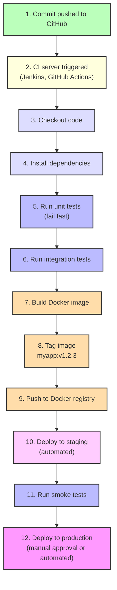
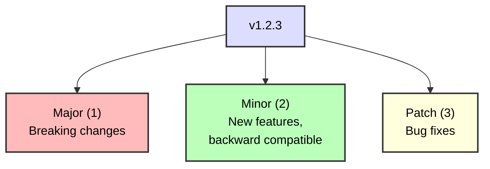

# Module 06: CI/CD from First Principles

> **Continuous Integration and Continuous Delivery explained without the buzzwords**

---

## What Is CI/CD? (Really)

**CI (Continuous Integration):**
- Merge code frequently (multiple times per day)
- Automated tests run on every commit
- Catch bugs early (when they're cheap to fix)

**CD (Continuous Delivery):**
- Code is **always** in a deployable state
- Deployment to production is a **business decision**, not a technical challenge

**CD (Continuous Deployment):**
- Every commit that passes tests **automatically** goes to production
- No human approval gate

---

## Topics Covered

### ✅ [01. Why CI/CD Exists](./01-why-cicd-exists.md)
- The problem: Manual, error-prone releases
- The solution: Automation and fast feedback
- Mental model: Pipeline as assembly line

### ✅ [02. Build vs Test vs Deploy](./02-build-test-deploy.md)
- Build: Compile, bundle, containerize
- Test: Unit, integration, end-to-end
- Deploy: Push to staging, production

### ✅ [03. Immutable Artifacts](./03-immutable-artifacts.md)
- Why you build once, deploy many times
- Docker images as artifacts
- Semantic versioning
- Git tags and releases

### ✅ [04. Pipeline Stages](./04-pipeline-stages.md)
- Checkout code
- Install dependencies
- Run tests
- Build Docker image
- Push to registry
- Deploy to Kubernetes

### ✅ [05. Deployment Strategies](./05-deployment-strategies.md)
- Blue/green deployments
- Canary deployments
- Rolling updates (Kubernetes default)
- Rollbacks vs roll-forwards

### ✅ [06. CI/CD Best Practices](./06-cicd-best-practices.md)
- Keep builds fast (<10 minutes)
- Fail fast (run fast tests first)
- Idempotent pipelines
- Secrets management
- Branch strategies (trunk-based, GitFlow)

---

## Example Pipeline (Conceptual)

---

## Key Concepts

### Trunk-Based Development
- Everyone commits to `main` (or `trunk`)
- Short-lived feature branches (<1 day)
- Feature flags for incomplete features

### GitFlow (Alternative)
- `main` = production
- `develop` = integration
- Feature branches merge to `develop`
- Release branches for production

### Semantic Versioning

---

## Common Mistakes

1. **No tests** → CI is useless without tests
2. **Slow pipelines** → 1 hour builds kill productivity
3. **Manual steps** → "Click here, then SSH and run this" defeats the purpose
4. **Deploying to prod without staging** → Recipe for disaster
5. **No rollback plan** → Hope is not a strategy

---

**Previous:** [05. K9s](../05-k9s/)  
**Next:** [07. Jenkins Deep Dive](../07-jenkins/)
