# Module 08: Infrastructure as Code (IaC)

> **Infrastructure should be versioned, tested, and repeatable — just like application code**

---

## What Is IaC?

**Before IaC:**

**With IaC:**

```mermaid
graph LR
    A["terraform apply"] --> B["✅ Creates 10 identical servers<br/>✅ Config is in Git<br/>✅ Reproducible, auditable, testable"]
    
    style A fill:#bfb,stroke:#333,stroke-width:2px
    style B fill:#9f9,stroke:#333,stroke-width:2px
```

---

## Topics Covered

### 📝 01. Why IaC Exists
- Manual provisioning is error-prone
- Infrastructure drift
- Disaster recovery
- Multi-environment management

### 📝 02. Declarative vs Imperative
- Declarative: "I want 3 servers"
- Imperative: "Create 3 servers"
- Idempotency

### 📝 03. State Management
- What is state?
- Why state is scary
- State locking
- Remote state

### 📝 04. IaC Tools Comparison
- Terraform (multi-cloud)
- CloudFormation (AWS-only)
- Pulumi (code-based)
- CDK (code-based)

---

**Previous:** [07. Jenkins](../07-jenkins/)  
**Next:** [09. Terraform](../09-terraform/)
