# Getting Started with DevOps for Developers

> **Your roadmap to DevOps fluency**

---

## 🎯 What This Curriculum Covers

This is a **complete, production-grade DevOps curriculum** designed for software developers who want to:
- Deploy and manage production systems confidently
- Understand infrastructure, not just use it blindly
- Debug issues when things go wrong
- Collaborate effectively with DevOps/SRE teams

**This is NOT:**
- A pure infrastructure/SRE track
- Vendor-specific certification prep
- A collection of "just run this command" tutorials

**This IS:**
- First-principles explanations
- Real-world patterns and anti-patterns
- Developer-centric perspectives
- Platform-agnostic knowledge

---

## 📋 Prerequisites

### Required Knowledge
- ✅ Comfortable with command line (bash/zsh)
- ✅ Know at least one programming language (TypeScript or Go preferred)
- ✅ Basic Docker knowledge (can write a Dockerfile)
- ✅ Git basics

### Zero Experience Required In
- ❌ Kubernetes
- ❌ CI/CD pipelines
- ❌ Infrastructure as Code (Terraform, Ansible)
- ❌ Production operations

---

## 🛠️ Setup Your Environment

### 1. Operating System
This curriculum assumes **Linux** (Fedora 39+). If you're on Windows or macOS:

**Windows:**
```bash
# Use WSL2 (Windows Subsystem for Linux)
wsl --install -d Fedora
```

**macOS:**
- Most commands work as-is
- Some systemd stuff won't apply (macOS uses launchd)
- Use Homebrew for package management

---

### 2. Essential Tools

```bash
# Update system
sudo dnf update -y

# Install essentials
sudo dnf install -y \
    git \
    curl \
    wget \
    vim \
    htop \
    tmux \
    jq \
    tree

# Docker/Podman (Fedora includes Podman)
podman --version
# If you prefer Docker:
# sudo dnf install docker
# sudo systemctl enable --now docker

# kubectl
sudo dnf install kubernetes-client

# minikube (local Kubernetes)
curl -LO https://storage.googleapis.com/minikube/releases/latest/minikube-linux-amd64
sudo install minikube-linux-amd64 /usr/local/bin/minikube

# k9s (Kubernetes TUI)
sudo dnf install k9s

# Terraform
sudo dnf install terraform

# Ansible
sudo dnf install ansible
```

---

### 3. Verify Installation

```bash
# Docker/Podman
podman run --rm hello-world

# Kubernetes (minikube)
minikube start
kubectl get nodes

# Tools
terraform --version
ansible --version
k9s version
```

---

## 📚 How to Use This Curriculum

### Learning Path

```mermaid
graph TD
    A["Start Here: 00. DevOps Mindset<br/>(1 hour)"] --> B["01. Linux & Systems<br/>(8-10 hours)"]
    B --> C["02. Containers Deep Dive<br/>(4-6 hours)"]
    C --> D["03. Kubernetes Fundamentals<br/>(10-12 hours)"]
    D --> E["04. Kubernetes for Developers<br/>(6-8 hours)"]
    E --> F["05. K9s<br/>(2-3 hours)"]
    F --> G["06. CI/CD Fundamentals<br/>(4-6 hours)"]
    G --> H["07. Jenkins<br/>(6-8 hours)"]
    H --> I["08-09. IaC & Terraform<br/>(8-10 hours)"]
    I --> J["10. Ansible<br/>(4-6 hours)"]
    J --> K["11. Makefile<br/>(2-3 hours)"]
    K --> L["12. Cloud Fundamentals<br/>(4-6 hours)"]
    L --> M["13. Observability<br/>(6-8 hours)"]
    M --> N["14. Security<br/>(4-6 hours)"]
    N --> O["15. Real-World Failures<br/>(2-3 hours)"]
    O --> P["16. Capstone Project<br/>(12-16 hours)<br/><br/>Total: ~80-100 hours"]
    
    style A fill:#bfb,stroke:#333,stroke-width:2px
    style B fill:#ffd,stroke:#333,stroke-width:2px
    style C fill:#ffd,stroke:#333,stroke-width:2px
    style D fill:#bbf,stroke:#333,stroke-width:2px
    style E fill:#bbf,stroke:#333,stroke-width:2px
    style F fill:#ddf,stroke:#333,stroke-width:2px
    style G fill:#fda,stroke:#333,stroke-width:2px
    style H fill:#fda,stroke:#333,stroke-width:2px
    style I fill:#fcf,stroke:#333,stroke-width:2px
    style J fill:#fcf,stroke:#333,stroke-width:2px
    style K fill:#dfd,stroke:#333,stroke-width:2px
    style L fill:#ffd,stroke:#333,stroke-width:2px
    style M fill:#fda,stroke:#333,stroke-width:2px
    style N fill:#fbb,stroke:#333,stroke-width:2px
    style O fill:#f99,stroke:#333,stroke-width:2px
    style P fill:#9f9,stroke:#333,stroke-width:3px
```



---

### Reading Strategy

Each module contains:
- **Concepts** — Why things exist, how they work
- **Commands** — Practical examples you can run
- **War Stories** — Real production failures
- **Exercises** — Hands-on practice

**Recommended approach:**
1. Read the concept
2. Run the commands (in a VM or test cluster!)
3. Do the exercises
4. Break things intentionally (learn faster)
5. Move to next section

**DO NOT:**
- Just read without practicing
- Copy-paste without understanding
- Skip the "boring" foundational stuff
- Rush through to "the cool Kubernetes stuff"

---

## 🎓 Study Schedule Suggestions

### Intensive (2 weeks, full-time)
- 6-8 hours/day
- Complete one major module per day
- Not recommended (burnout risk)

### Moderate (6-8 weeks, part-time)
- 2-3 hours/day, 5 days/week
- Complete one module per week
- **Recommended for most people**

### Relaxed (3-4 months, casual)
- 1 hour/day, 3-4 days/week
- Complete one module every 2 weeks
- Good for busy professionals

---

## 💡 Learning Tips

### 1. Use a Dedicated Lab Environment

**Don't practice on production!**

Options:
- Local VM (VirtualBox, VMware)
- Cloud VM (AWS EC2 t3.micro is cheap)
- Local Kubernetes (minikube, kind)

**Snapshot before experiments:**
```bash
# minikube
minikube stop
# Create VM snapshot manually

# Docker
docker commit <container> my-snapshot
```

---

### 2. Keep a Learning Journal

Document:
- Commands that worked
- Errors you encountered (and how you fixed them)
- "Aha!" moments
- Questions to research later

**Example format:**
```markdown
## 2026-02-21: Kubernetes Pods

### What I learned:
- Pods are ephemeral
- Deployments manage pods
- Never deploy pods directly

### Error I hit:
ImagePullBackOff — wrong image name

### Fixed by:
Checked spelling, updated deployment YAML

### Questions:
- How does Kubernetes actually schedule pods?
  (Answer in next section: Scheduler component)
```

---

### 3. Join Communities

- **Reddit:** r/kubernetes, r/devops
- **Discord:** Kubernetes, DevOps communities
- **Stack Overflow:** Tag: kubernetes, docker, terraform
- **Twitter/X:** Follow #DevOps, #Kubernetes hashtags

**Ask questions when stuck!**

---

### 4. Use the Quick Reference

The [`QUICK_REFERENCE.md`](./QUICK_REFERENCE.md) file contains:
- Common commands
- Syntax patterns
- Debugging workflows

Print it out, keep it open in a tab, whatever works.

---

## 🚨 Common Pitfalls

### 1. Skipping the Fundamentals
**Don't skip Module 01 (Linux & Systems).**

"I just want to learn Kubernetes" → you'll struggle when pods won't start and you don't understand cgroups, namespaces, or process signals.

---

### 2. Not Actually Running Commands
Reading ≠ Learning.

**Bad:**
- Read about `kubectl get pods`
- "Yeah, I get it"
- Move on

**Good:**
- Read about `kubectl get pods`
- Run it in your cluster
- Try `kubectl get pods -o yaml`
- Try `kubectl describe pod <name>`
- Break a pod, see what happens

---

### 3. Using `latest` Tag in Production
(You'll learn why this is bad in Module 02)

---

### 4. Committing Secrets to Git
(You'll learn alternatives in Module 14)

---

## 🔧 Troubleshooting

### "Command not found"
```bash
# Verify installation
which kubectl
which terraform

# Add to PATH if needed
export PATH=$PATH:/usr/local/bin
```

### "Permission denied"
```bash
# Docker/Podman needs sudo (or add user to docker group)
sudo usermod -aG docker $USER
newgrp docker

# Or just use sudo
sudo docker ps
```

### "Kubernetes cluster not reachable"
```bash
# Is minikube running?
minikube status

# Start if needed
minikube start

# Check kubectl config
kubectl config current-context
```

---

## 📖 Supplementary Resources

### Books (Optional)
- "The Phoenix Project" — DevOps culture
- "Kubernetes: Up and Running" — K8s deep dive
- "Site Reliability Engineering" — Google's SRE practices

### Online
- Kubernetes official docs: kubernetes.io/docs
- Docker docs: docs.docker.com
- Terraform docs: terraform.io/docs

### Videos
- KubeCon talks (youtube.com/kubernetescommunity)
- TechWorld with Nana (youtube.com/@TechWorldwithNana)

---

## ✅ Completion Checklist

After finishing the curriculum, you should be able to:

- [ ] Explain what a container actually is (namespaces, cgroups, layers)
- [ ] Deploy a service to Kubernetes with zero downtime updates
- [ ] Write a CI/CD pipeline (Jenkins or GitHub Actions)
- [ ] Provision infrastructure with Terraform
- [ ] Configure servers with Ansible
- [ ] Debug production issues (logs, metrics, traces)
- [ ] Secure containers and pipelines
- [ ] Respond to outages without panicking

If you check all these boxes, **you're DevOps fluent.** 🎉

---

## 🎯 Next Steps After Completion

1. **Build a portfolio project**
   - Deploy a real app to production
   - Use all skills (Docker, K8s, CI/CD, IaC)
   - Document it on GitHub

2. **Get certified (optional)**
   - CKA (Certified Kubernetes Administrator)
   - CKAD (Certified Kubernetes Application Developer)
   - AWS Certified DevOps Engineer

3. **Contribute to open source**
   - Kubernetes ecosystem
   - DevOps tools
   - Infrastructure projects

4. **Teach others**
   - Blog about your learnings
   - Answer Stack Overflow questions
   - Mentor junior developers

---

## 🆘 Need Help?

If you're stuck or have questions about the curriculum itself:

1. **Check the module README** — each module has troubleshooting tips
2. **Review the Quick Reference** — common commands and patterns
3. **Search the module content** — `grep -r "your question" .`
4. **File an issue** — if something's unclear or broken

---

## 🚀 Ready to Start?

**Begin here:** [00. DevOps Mindset for Developers →](./00-devops-mindset/00-what-is-devops-for-developers.md)

---

**Remember:** 
- DevOps is a journey, not a destination
- Everyone struggles at first (especially with Kubernetes)
- Break things in test environments — that's how you learn
- Ask questions — the community is helpful
- Have fun (seriously, this stuff is cool!)

**Good luck!** 🎉
