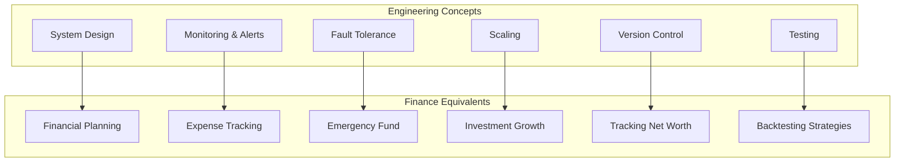
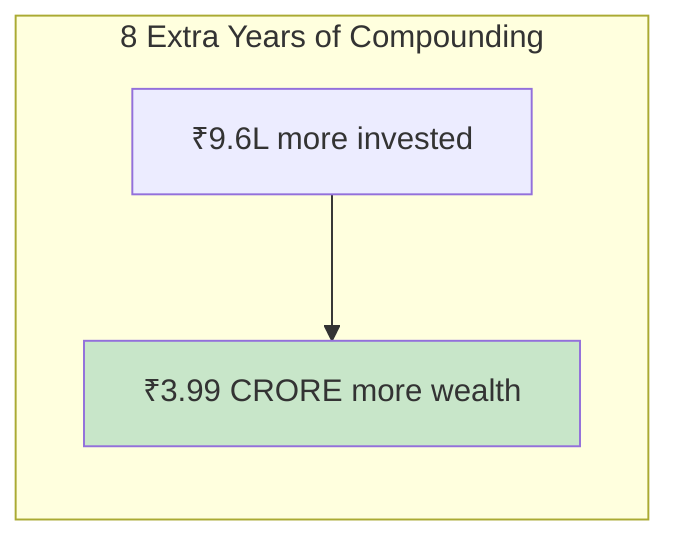

# Section 1 — Financial Literacy for Developers: Why This Matters

> *"We build systems that handle millions of transactions per second, but can't figure out where our own salary goes every month."*

---

## The Irony of the Well-Paid Clueless Engineer

Let me paint you a picture.

You're a software engineer. You cleared DSA rounds that made you question your will to live. You survived system design interviews where you had to explain CAP theorem while sweating through your shirt. You got the offer letter. **15 LPA**. You feel like a god.

Then the first salary hits your bank account.

**₹87,000.**

Wait... ₹87,000 × 12 = ₹10,44,000. That's... 10.4 lakhs. WHERE ARE THE OTHER 4.6 LAKHS?

Welcome to adulting, dev. Welcome to the world of CTC, tax deductions, PF contributions, and professional tax — the `middleware` that intercepts your salary before it reaches your bank account.


And this is just Day 1 of the financial confusion.

---

## Why Engineers Are Particularly Bad at Personal Finance

This might feel counterintuitive. We're supposedly the "smart" ones. We think in systems, optimize for performance, and refactor messy code. So why do we suck at managing money?

### 1. **The "I'll Optimize Later" Syndrome**

You know that tech debt you keep ignoring? "We'll refactor next sprint." You do the same thing with money. "I'll start investing next month." "I'll figure out taxes next year." "I'll read about PF when I'm 30."

Next month becomes next year. Next year becomes a decade of missed compounding.

### 2. **The CTC Delusion**

Engineers love big numbers. We benchmark systems by throughput, and we benchmark ourselves by CTC. LinkedIn is full of posts:

> *"Grateful to share that I've accepted an offer of 45 LPA at [Company]! 🎉"*

Cool, bro. How much of that is base? How much is stocks with a 4-year vesting cliff? How much is a "performance bonus" that requires you to basically save the company from bankruptcy to get the full amount?

**CTC is like a README that hasn't been updated since 2019. It tells you what the project *claims* to do, not what it actually does.**

### 3. **The "High Salary = Rich" Fallacy**

Let me introduce you to Parkinson's Law of Money:

> **Expenses rise to match income.**

Engineer earning ₹50K/month: Lives in a PG, eats at the canteen, watches pirated content.
Same engineer after getting ₹1.5L/month: Lives in a 2BHK in Koramangala, orders Swiggy 3x daily, has 4 streaming subscriptions, bought an iPhone on EMI.

Net savings? About the same. Sometimes less.


### 4. **We Think Finance Is Boring**

You'll spend 6 hours debugging a CSS z-index issue but won't spend 30 minutes understanding your payslip. Because CSS is "interesting" and payslips are "boring."

Bruh. Understanding your payslip is literally understanding where 30-40% of your compensation disappears every month. That's not boring — that's a **critical production bug** in your personal finance system.

### 5. **Analysis Paralysis (The Engineer Special)**

We love researching. We'll read 47 blog posts comparing mutual funds, watch 12 YouTube videos on index funds vs active funds, create a spreadsheet with 15 columns... and then invest in nothing because we're "still evaluating."

Meanwhile, a random uncle who doesn't know what a SIP stands for has been investing ₹5,000/month for 15 years and is sitting on ₹25 lakhs.

**Done > Perfect. Ship it.**

---

## Common Developer Financial Mistakes (The Bug Report)

Let's file some bug reports on the most common financial mistakes engineers make:

### 🐛 Bug #001: `SpendingEntireSalaryException`

**Severity:** Critical
**Description:** Developer receives salary on 1st, Zomato Gold + Swiggy One + Netflix + Spotify + new sneakers + "one last gadget" = account balance ₹2,340 by the 25th.
**Root Cause:** No budget system. No allocation strategy. No awareness of where money goes.
**Fix:** Implement Section 8 (Personal Finance Systems).

### 🐛 Bug #002: `TaxIgnoranceError`

**Severity:** High
**Description:** Developer ignores taxes all year, panics in March, submits random investment proofs, overpays tax, leaves ₹30,000-₹50,000 on the table every year.
**Root Cause:** Treating taxes as "someone else's problem." Treating HR's tax-saving reminders like spam emails.
**Fix:** Read Section 5. Actually file your returns properly.

### 🐛 Bug #003: `CTCvsInHandMismatch`

**Severity:** Medium (but feels critical)
**Description:** Developer accepts job based on CTC number, doesn't understand comp structure, feels betrayed when in-hand is 30-40% lower.
**Root Cause:** Not reading the "Terms & Conditions" (offer letter breakdown).
**Fix:** Section 4 will teach you to decode this.

### 🐛 Bug #004: `BlindHighSalaryChasing`

**Severity:** Medium
**Description:** Developer job-hops purely for CTC hike, doesn't consider equity, vesting, team quality, or learning. Chases numbers on paper.
**Root Cause:** Optimizing for a single metric (CTC) instead of overall career NPV.
**Fix:** Sections 4 and 7 cover this.

### 🐛 Bug #005: `ZeroInvestmentNullPointer`

**Severity:** Critical (over time)
**Description:** Developer has been working for 5 years, earns ₹25 LPA, total investments: ₹1.2 lakhs in a savings account earning 3.5%.
**Root Cause:** "I'll start investing when I earn more / understand more / after my next appraisal / when the market is right."
**Fix:** Section 6. Start today. Literally today.

---

## The Engineering Mindset Applied to Finance

Here's the good news: **your engineering brain is actually perfect for personal finance.** You just need to apply the same mental models.



| Engineering Concept | Financial Equivalent |
|---|---|
| **Microservices architecture** | Separate accounts for needs, wants, investments |
| **Load balancing** | Diversifying investments |
| **Caching** | Emergency fund (quick-access money) |
| **Monitoring and alerts** | Expense tracking apps |
| **CI/CD pipeline** | Automated SIPs and bill payments |
| **Disaster recovery** | Insurance policies |
| **Scaling horizontally** | Growing income through skills |
| **Technical debt** | Financial debt (credit cards, loans) |
| **Code review** | Annual financial review |

---

## 🇯🇵 Japan Comparison: A Quick Note

In Japan, financial literacy is taught differently. Japanese salaried employees (サラリーマン, *salaryman*) often have their taxes handled almost entirely by their employer through a year-end adjustment called **nenmatsu chōsei** (年末調整). Most Japanese workers never even file a tax return.

In India? You're mostly on your own, buddy. HR will send you a mail saying "submit your tax-saving proofs" and you'll panic-buy a random insurance policy your uncle recommended.

Japanese workers also tend to be extremely conservative with investments — the majority keep savings in bank accounts with near-zero interest rates (Japan literally had negative interest rates for years). Indian engineers have access to much better investment options like mutual funds yielding 12-15% historical returns.

The lesson? **India's system is more complex, but the opportunities for wealth building are significantly better — IF you learn the system.**

---

## What Happens If You Don't Learn This

Let's be brutally honest:

```
Age 22: "I just started earning, I'll figure out finance later."
Age 25: "My salary is okay, but where does it all go?"
Age 28: "I should probably start investing but the market seems scary."
Age 30: "Okay I need to save for a house. Wait, I have no savings."
Age 35: "Why does my colleague who earns less than me own a flat?"
Age 40: "I make 50 LPA but my net worth is painfully low."
Age 50: "Retirement? What retirement?"
```

vs.

```
Age 22: Starts SIP of ₹10,000/month. Learns tax basics.
Age 25: Emergency fund in place. Investing 30% of income.
Age 28: Portfolio worth ₹15 lakhs. Tax-optimized.
Age 30: Down payment ready. Zero bad debt.
Age 35: Portfolio worth ₹80 lakhs. Career growing.
Age 40: Portfolio crosses ₹2 crores. Options open.
Age 50: Financially independent. Works by choice, not necessity.
```

Same starting salary. Different financial literacy. Wildly different outcomes.

---

## The Cost of Waiting

Here's a real example that should terrify you:

**Aarav** starts investing ₹10,000/month at age 22.
**Priya** starts investing ₹10,000/month at age 30.

Both invest in the same index fund returning ~12% annually. Both invest until age 55.

| | Aarav (starts at 22) | Priya (starts at 30) |
|---|---|---|
| **Years of investing** | 33 years | 25 years |
| **Total invested** | ₹39,60,000 | ₹30,00,000 |
| **Portfolio value at 55** | **₹5.89 crores** | **₹1.90 crores** |

Aarav invested just ₹9.6 lakhs more than Priya. But he ends up with **₹3.99 crores MORE**.

That's not magic. That's **compounding** — and we'll deep-dive into it in Section 2.



---

## Your 5-Minute Action Items After Reading This Section

Before you move to Section 2, do these right now:

1. **Open your last payslip** — Can you explain every line item? If not, Section 4 is crucial for you.
2. **Check your savings account balance** — Is all your money sitting there earning 3.5%? You're losing money to inflation.
3. **Find your PAN card** — You'll need it for investments and tax filing. If you've lost it, reapply on the NSDL website.
4. **Download an expense tracker** — Even if you don't start using it today, having it ready reduces activation energy.
5. **Commit to reading this guide** — All of it. Your future self will mass-produce gratitude.

---

## Key Takeaways

```
✅ High salary ≠ financial security
✅ CTC ≠ real salary (not even close)
✅ Lifestyle inflation is the silent killer
✅ Starting early matters exponentially (compounding!)
✅ Your engineering mindset is PERFECT for finance
✅ India has better investment opportunities than most realize
✅ The best time to start was yesterday. The second best is now.
```

---

**Next up:** [Section 2 — Understanding Money Basics](../02-money-basics/README.md) — where we explain what money actually is, why your savings account is secretly losing money, and how compounding turns ₹10K/month into crores.
