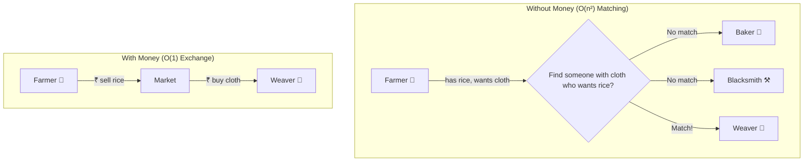
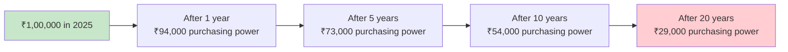
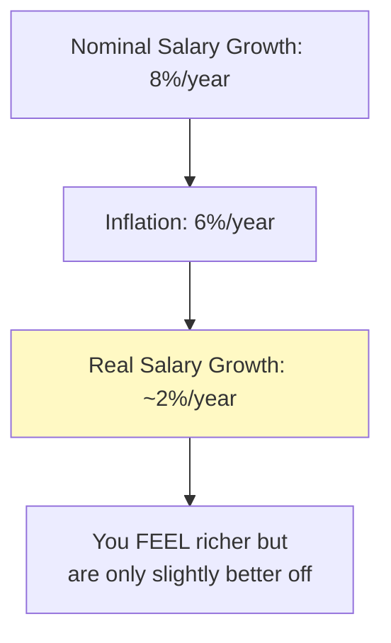
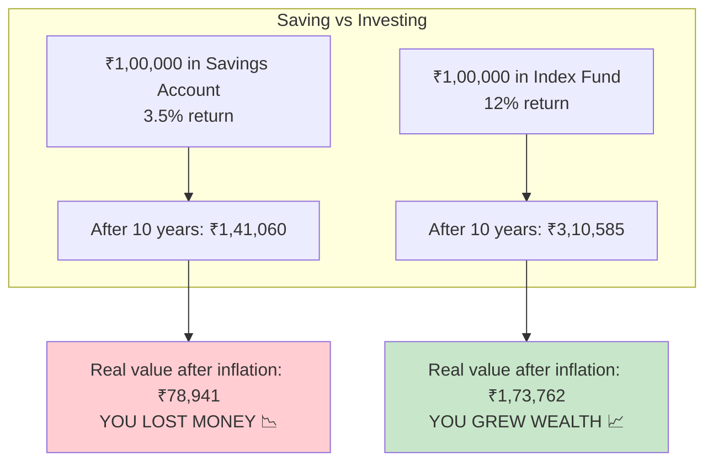
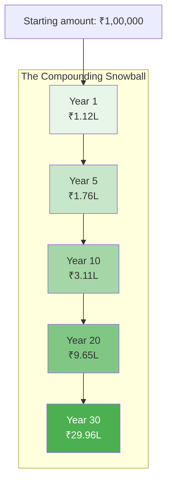
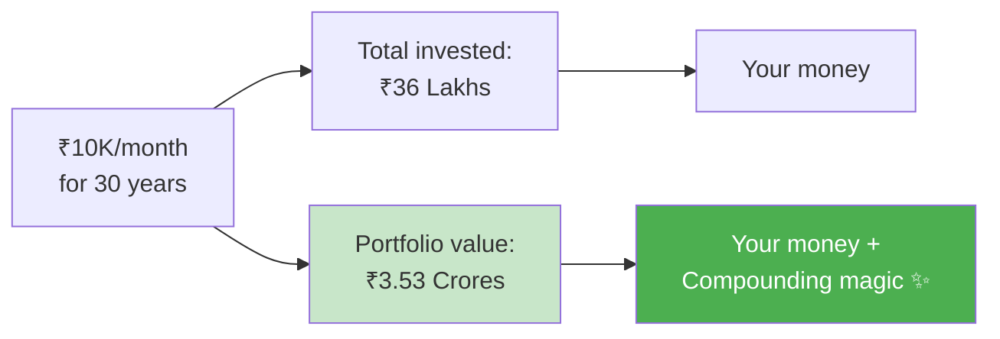
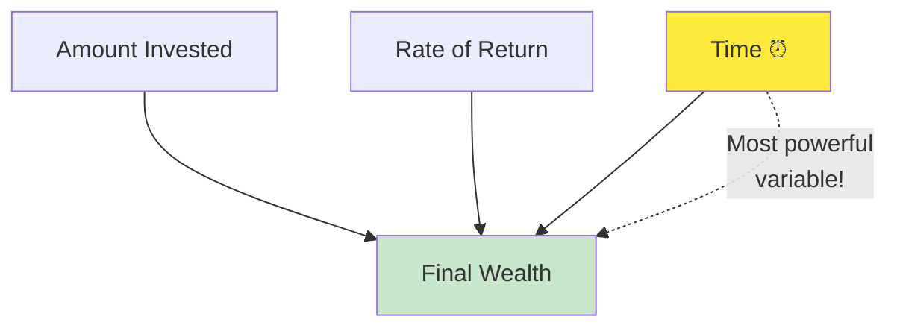
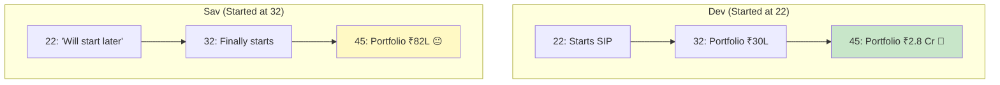
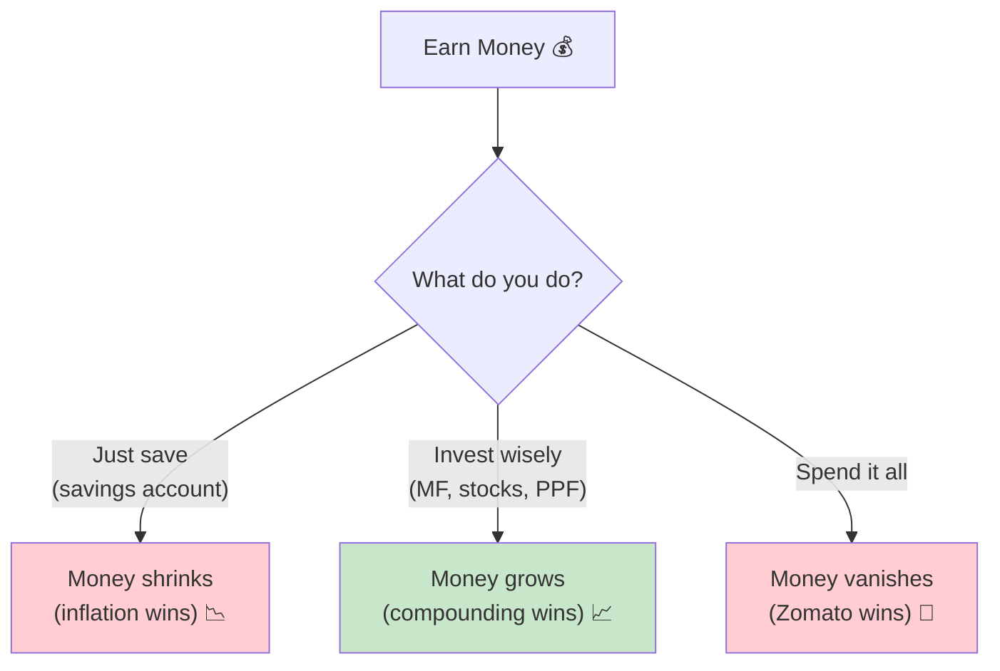

# Section 2 — Understanding Money Basics

> *"Money is like memory allocation. If you don't manage it properly, you'll run out when you need it most."*

---

## What Money Actually Represents

Let's start from absolute zero. What even IS money?

Money isn't wealth. Money is a **protocol**. Think of it like HTTP — it's an agreed-upon standard that allows two parties to exchange value without bartering goats.

Before money existed, if you were a farmer with rice and needed cloth, you had to find someone with cloth who also wanted rice. This is the **double coincidence of wants** problem — basically the world's worst matching algorithm with O(n²) complexity.

Money solved this by creating a universal medium of exchange. Instead of searching for a match, everyone agrees on a common token of value.



So money is:
- **A medium of exchange** (you can buy stuff with it)
- **A store of value** (you can save it for later)
- **A unit of account** (you can compare prices)

But here's the thing that nobody tells you in school: **money as a "store of value" is leaky.** Like a cache with an expiration policy. Enter: inflation.

---

## Inflation — The Silent `cron` Job Eating Your Wallet

Inflation is the rate at which prices increase over time. India's average inflation rate has been around **5-7% per year** historically.

What does this mean practically?

```
A Masala Dosa in 2015: ₹40
A Masala Dosa in 2020: ₹60
A Masala Dosa in 2025: ₹80-90

That's roughly 6-7% food inflation, running silently in the background.
```

Think of inflation as a **background cron job that runs every second**, silently stealing tiny bits of value from every rupee you own. You can't see it. You can't stop it. It never crashes. It just... runs.



**₹1 lakh today will buy you the equivalent of only ₹29,000 worth of stuff in 20 years** (at 6% inflation).

That's not a bug — that's a feature of how economies work. Central banks (like RBI) actually want some inflation because it encourages spending and investment. Deflation (prices dropping) is way scarier for economies.

### India vs Japan: Inflation Edition

Here's a wild comparison:

| | India | Japan |
|---|---|---|
| **Average inflation** | ~5-7% per year | ~0-2% per year |
| **Savings account interest** | ~3-4% per year | ~0.001-0.1% per year |
| **Real return on savings** | **Negative** (-2 to -3%) | **Roughly zero** (but prices barely rise) |

Japan has had near-zero or even negative inflation for decades (they call it the "Lost Decades"). Prices barely move. A bowl of ramen costs roughly the same as it did 20 years ago. Sounds great? Not really — it meant the economy was stagnant, wages didn't grow much, and the whole country was stuck in a low-growth loop.

India is the opposite: prices rise aggressively, but opportunities for growth and returns are also much higher.

**The takeaway: In India, your money is constantly losing value if it sits idle. You MUST make it grow faster than inflation.**

---

## Purchasing Power — What Your Money Can Actually Buy

Purchasing power is the real-world value of your money. It's what matters. Not the number in your bank account.

Here's a relatable example:

```
Your grandparents' wedding cost: ₹5,000 (in 1975)
Your parents' wedding cost: ₹2,00,000 (in 2000)  
Your wedding might cost: ₹15,00,000+ (in 2025)

Same event. Same dosas served. The number got bigger, but the VALUE required went up.
```

An engineer earning ₹8 LPA in 2010 had roughly similar purchasing power to an engineer earning ₹15-18 LPA in 2025. Salaries nominally went up, but so did rent, food, and EMIs.

**If your salary grows at 5% per year but inflation is 6%, you're actually getting a pay cut every year in real terms.**



This is why salary hikes of 5-8% feel... meaningless. Because they basically are. They're keeping you roughly in the same place.

---

## Why Saving Alone Is Not Enough

Most Indian parents taught us one thing about money: **SAVE IT.**

"Beta, paisa bacha ke rakho." (Son, keep saving money.)

And so we do. We put ₹50,000 in a savings account earning 3.5% interest. Inflation is 6%. We're LOSING 2.5% per year in real terms.

```
Savings Account Reality Check:
━━━━━━━━━━━━━━━━━━━━━━━━━━━━━
Your savings account interest:     +3.5%
Inflation:                         -6.0%
━━━━━━━━━━━━━━━━━━━━━━━━━━━━━
Real return:                       -2.5% per year 😰

Your money is SHRINKING in a savings account.
```

Think of your savings account as **uncompressed storage**. It works, it's simple, but it's incredibly inefficient. You need a better compression algorithm — that's investing.



**Saving money in a bank account is better than spending it all, but it's NOT a financial strategy. It's a financial waiting room.**

---

## Saving vs Investing — The Key Difference

Let's make this crystal clear:

| | Saving | Investing |
|---|---|---|
| **What it is** | Putting money aside for later | Putting money to work to grow |
| **Where** | Savings account, FD, under mattress | Mutual funds, stocks, PPF, real estate |
| **Risk** | Almost zero | Low to high (depends on instrument) |
| **Return** | 3.5-7% (barely beats or loses to inflation) | 8-15%+ (beats inflation over time) |
| **Liquidity** | Very high (instant access) | Medium to low (depends) |
| **Analogy** | Parking your car | Renting out your car to earn money |
| **Engineering analogy** | Cold storage (S3 Glacier) | Running compute instances (EC2) |

**Saving = Preserving money.**
**Investing = Growing money.**

You need both. Savings for short-term needs and emergencies. Investments for long-term wealth building.

**Rule of thumb:** Keep 6 months of expenses as emergency savings. Everything beyond that should be invested.

---

## How Compounding Works — The Eighth Wonder of the World

Albert Einstein (allegedly) called compound interest the eighth wonder of the world:

> *"He who understands it, earns it. He who doesn't, pays it."*

Compounding is simple: **you earn returns on your returns.**

### Simple Interest vs Compound Interest

**Simple Interest:** You earn interest only on your original amount.
**Compound Interest:** You earn interest on your original amount PLUS previously earned interest.

Let's say you invest ₹1,00,000 at 12% per year:

**With Simple Interest:**
```
Year 1: ₹1,00,000 + ₹12,000 = ₹1,12,000
Year 2: ₹1,12,000 + ₹12,000 = ₹1,24,000   (interest only on original ₹1L)
Year 3: ₹1,24,000 + ₹12,000 = ₹1,36,000
...
Year 10: ₹2,20,000
```

**With Compound Interest:**
```
Year 1:  ₹1,00,000 + ₹12,000           = ₹1,12,000
Year 2:  ₹1,12,000 + ₹13,440           = ₹1,25,440   (interest on ₹1,12,000!)
Year 3:  ₹1,25,440 + ₹15,053           = ₹1,40,493
...
Year 10: ₹3,10,585  (vs ₹2,20,000 with simple)
Year 20: ₹9,64,629
Year 30: ₹29,95,992  (almost 30x your original!)  
```



### Compounding with Monthly SIP (More Realistic)

Most engineers don't invest a lump sum — they invest monthly via SIP (Systematic Investment Plan). Let's see what happens:

**₹10,000/month SIP at 12% annual return:**

| Duration | Total Invested | Portfolio Value | Wealth Created |
|----------|---------------|-----------------|----------------|
| 5 years | ₹6,00,000 | ₹8,25,000 | ₹2,25,000 |
| 10 years | ₹12,00,000 | ₹23,23,000 | ₹11,23,000 |
| 15 years | ₹18,00,000 | ₹50,46,000 | ₹32,46,000 |
| 20 years | ₹24,00,000 | ₹99,92,000 | ₹75,92,000 |
| 25 years | ₹30,00,000 | ₹1,89,76,000 | ₹1,59,76,000 |
| 30 years | ₹36,00,000 | ₹3,52,99,000 | ₹3,16,99,000 |

Read that last row again. You invested ₹36 lakhs over 30 years. Your portfolio is worth **₹3.53 CRORES**. The market gave you ₹3.17 crores for free. That's compounding.



### The 3 Variables of Compounding

Compounding has three inputs:



1. **Amount** — How much you invest (increase this as salary grows)
2. **Rate** — What return your investments generate (12% for equity, 7% for debt)
3. **Time** — How long you let it compound (**THIS IS THE MOST IMPORTANT ONE**)

You can't control the market. You can somewhat control how much you invest. But time? **Time is the one variable you absolutely control — and you're burning it every day you don't start.**

### The Rule of 72

Quick mental math hack: To figure out how long it takes to double your money, divide 72 by the interest rate.

```
At 6% return:   72 / 6  = 12 years to double
At 8% return:   72 / 8  = 9 years to double
At 12% return:  72 / 12 = 6 years to double
At 15% return:  72 / 15 = ~5 years to double

Savings account (3.5%):  72 / 3.5 = ~20 years to double 💀
Index fund (12%):        72 / 12  = 6 years to double 🚀
```

In a savings account, your money doubles in 20 years. In an index fund, it doubles every 6 years. Over 30 years, that's:

- Savings account: 1 doubling (₹1L → ₹2L)
- Index fund: 5 doublings (₹1L → ₹2L → ₹4L → ₹8L → ₹16L → ₹32L)

That's a **16x difference** just from choosing a better vehicle.

---

## Practical Example: The Two Engineers

Meet **Dev** and **Sav**.

Both are 22-year-old engineers. Both earn ₹8 LPA starting salary. Both get 10% annual raises.

**Dev** (the smart one):
- Invests 20% of in-hand salary via SIP from Day 1
- Increases SIP by 10% every year (step-up SIP)
- Invests in index funds (12% average return)

**Sav** (the "I'll start later" one):
- Keeps everything in savings account for 10 years
- Starts investing the same 20% only at age 32
- Same funds, same returns after starting

At age 45:

| | Dev (started at 22) | Sav (started at 32) |
|---|---|---|
| **Total invested** | ₹52 lakhs | ₹38 lakhs |
| **Portfolio value** | **₹2.8 crores** | **₹82 lakhs** |
| **Difference** | +₹14L invested | **₹1.98 crores less wealth** |

Dev invested ₹14 lakhs more but ended up with **₹1.98 CRORES more**. That's the price of 10 years of procrastination.



---

## Money Has a Time Value

There's a concept in finance called **Time Value of Money (TVM)**.

₹1,00,000 today is worth MORE than ₹1,00,000 ten years from now. Why? Because:

1. **Inflation** will make it worth less
2. **Opportunity cost** — you could have invested it and earned returns
3. **Certainty** — money now is guaranteed, money later isn't

This is why companies pay you monthly, not annually (well, also because you'd quit). It's why a ₹10L joining bonus now is worth more than ₹12L spread over 2 years.

**In programming terms:** TVM is like the difference between sync and async. A synchronous return now is more valuable than a promise that resolves later (because the promise might reject!).

---

## Summary: The Money Basics Cheat Sheet

```
💡 Money is a protocol for exchanging value
💡 Inflation erodes your money at ~6% per year in India
💡 Savings account return (3.5%) < Inflation (6%) = YOU'RE LOSING MONEY
💡 Investing = Making your money work for you
💡 Compounding = Earning returns on your returns (snowball effect)
💡 Time is the most powerful variable in compounding
💡 Rule of 72: Divide 72 by return rate = years to double
💡 Starting early dwarfs everything else
💡 India has better investment return opportunities than Japan
💡 Don't just save. INVEST.
```



---

**Next up:** [Section 3 — Understanding the Indian Financial System](../03-indian-financial-system/README.md) — where we explain why April is actually January (for taxes), what FY and AY mean, and why your company panics every March.
