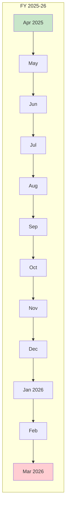
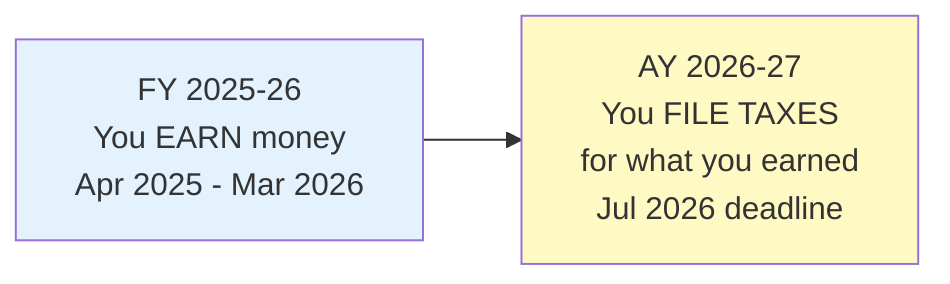
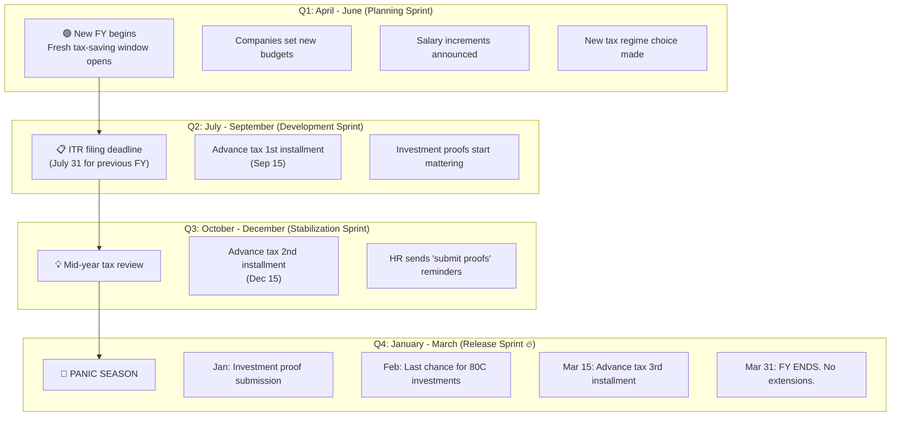
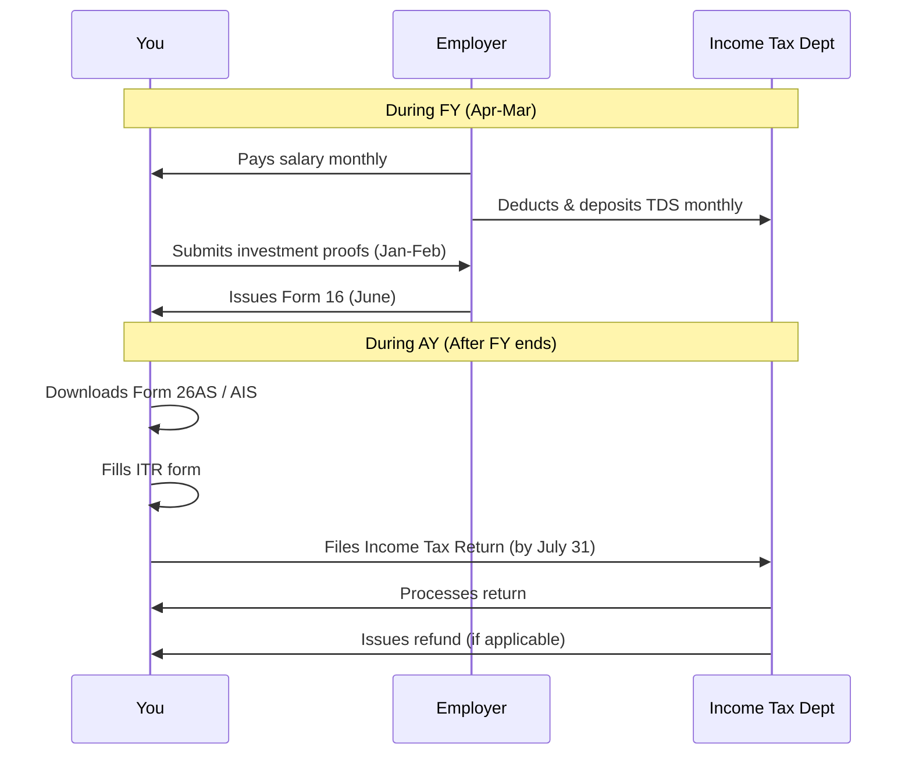
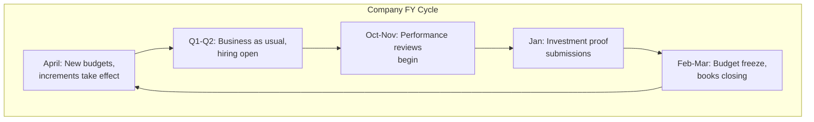
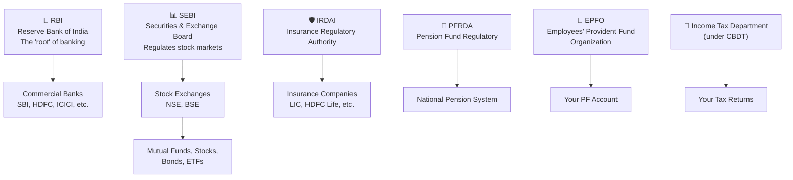

# Section 3 — Understanding the Indian Financial System

> *"India's financial year is like a software release cycle. Once you understand the timeline, everything else clicks."*

---

## Why You Need to Understand This

Before we talk about salaries, taxes, and investments, you need to understand the **operating system** your money runs on. In India, the financial system has its own calendar, its own terminology, and its own deadlines. Ignore them and you'll get hit with penalties, missed deductions, and that sinking "oh no" feeling in March every year.

Think of this section as understanding the Linux kernel before writing system-level code. You don't need to know every detail, but you need the mental model.

---

## What Is a Financial Year (FY)?

A **Financial Year (FY)** in India runs from **April 1 to March 31** of the following year.

```
FY 2025-26:  April 1, 2025 → March 31, 2026
FY 2026-27:  April 1, 2026 → March 31, 2027
```

This is the 12-month period during which your income is earned, taxes are calculated, and financial statements are prepared.

**Everything** — your salary statements, company financials, tax calculations, investment proofs — follows this cycle.



### Why April to March? (And Not January to December?)

This is one of those "legacy system" things. There are a few theories:

1. **British colonial inheritance** — The British fiscal year also starts in April (inherited from when the new year was in March under the Julian calendar). When they colonized India, they brought their accounting system along.

2. **Agricultural cycle** — India was historically an agrarian economy. The harvest season (kharif) runs from June-October, and rabi harvest from February-April. Starting the fiscal year after the main harvest made sense for tax collection.

3. **Nobody bothered to change it** — Classic legacy code behavior. It works, everybody's used to it, migration cost is high, so it stays.

Most countries use **January-December** as their fiscal year (USA, Japan, France, Germany). Some use **July-June** (Australia). India uses **April-March**. It's just a convention — an arbitrary `FISCAL_YEAR_START = 4` constant somewhere in the government's codebase.

### 🇯🇵 Japan Comparison

Japan also uses **April 1 - March 31** as its fiscal year! Japanese companies, schools, and government all follow this cycle. So if you ever work for a Japanese company, the FY concepts map directly.

The reason? Japan adopted this from the Meiji government reforms in the 1880s, partly influenced by British fiscal practices.

---

## Assessment Year (AY) vs Financial Year (FY)

This confuses approximately 100% of first-time tax filers. Let me clear it up.

| | Financial Year (FY) | Assessment Year (AY) |
|---|---|---|
| **What it means** | The year you **earn** income | The year you **file taxes** for that income |
| **Relationship** | FY = AY - 1 | AY = FY + 1 |
| **Example** | FY 2025-26 (Apr 2025 – Mar 2026) | AY 2026-27 |



**In programming terms:**
- **FY** is the `production` environment where things happen in real-time
- **AY** is the `audit/logging` phase where you report what happened

So when you hear "file your ITR for AY 2026-27," it means: file your tax return for the income you earned during FY 2025-26 (April 2025 to March 2026).

**Why does this exist?** Because you can't assess (calculate taxes on) your income until the year is complete. You need the full picture before you can file. It's like running tests after the sprint is done, not while it's ongoing.

---

## The Financial Year Lifecycle — Like a Software Release

Let's map the financial year to a software release cycle that every engineer can relate to:



### Month-by-Month Breakdown

| Month | What Happens | Priority |
|-------|-------------|----------|
| **April** | New FY starts. Reset TDS, PF counters. New tax-saving window. | 🟢 Plan |
| **May** | Companies announce increments. Update your SIP amounts. | 🟢 Optimize |
| **June** | Q1 advance tax due (June 15). Most engineers skip this. | 🟡 Note |
| **July** | **ITR filing deadline** for previous FY (July 31). Don't miss this! | 🔴 Critical |
| **August** | Chill month financially. Good time to review investments. | 🟢 Review |
| **September** | Q2 advance tax (Sep 15). HR may start asking about tax declarations. | 🟡 Note |
| **October** | Festive bonuses hit. Don't spend it all. | 🟡 Be smart |
| **November** | Mid-year investment review. Rebalance if needed. | 🟢 Review |
| **December** | Q3 advance tax (Dec 15). Start gathering investment proofs. | 🟡 Prepare |
| **January** | HR says "SUBMIT YOUR PROOFS." Do it early. | 🔴 Urgent |
| **February** | Last chance to make 80C investments (PPF, ELSS, etc.) | 🔴 Critical |
| **March** | **FY ends March 31.** Last advance tax (Mar 15). Year-end rush. | 🔴 Critical |

### Engineering Translation

```
April      = Sprint 1 kickoff (plan your financial year)
July       = Previous sprint retrospective (file ITR for last FY)
October    = Mid-sprint review (check if your plan is on track)  
January    = Code freeze approaching (submit proofs, last investments)
March 31   = Release deadline (FY ends, no hotfixes possible)
```

---

## What Happens During Tax Filing Season

Tax filing season is the financial equivalent of a **production deployment with a hard deadline**.



### Key Documents You'll Encounter

| Document | What It Is | Engineering Analogy |
|----------|-----------|---------------------|
| **Form 16** | Certificate from employer showing your salary and TDS deducted | Server access logs |
| **Form 26AS** | Government's record of all TDS deducted against your PAN | Git commit history |
| **AIS (Annual Information Statement)** | Comprehensive record of your financial transactions | Full audit trail |
| **ITR (Income Tax Return)** | Your tax filing form | Annual production report |

### The Filing Flow

```
1. FY 2025-26 ends on March 31, 2026
2. Employer issues Form 16 by June 15, 2026
3. You download Form 26AS / AIS from income tax portal
4. You fill ITR form (ITR-1 for most salaried employees)  
5. Verify all numbers match
6. Submit on income-tax portal by July 31, 2026
7. e-Verify within 30 days (Aadhaar OTP is easiest)
8. Wait for processing (usually 1-6 months)
9. Get refund if applicable (credited to bank account)
```

**Pro tip:** File in the first week of July. The portal is usually less buggy (fewer concurrent users), and you get refunds faster. Filing on July 31 is like deploying on a Friday — technically possible, but why would you?

---

## Why Companies Care About Financial Year Cycles

Companies are **deeply** tied to the FY cycle. Here's why it matters to you:

### 1. **Appraisals and Increments (April-June)**

Most Indian companies run **annual appraisals in Q4 (Jan-Mar)** and implement salary changes from **April**. This is because:
- Financial year budgets reset in April
- Companies need new budgets before committing to raises
- Performance is evaluated for the FY just ended

**Why this matters to you:** Negotiate your raise BEFORE April. Once budgets are locked, it's much harder to change.

### 2. **Bonus Cycles**

Many companies pay annual bonuses in Q1 (April-June) based on previous FY performance. Some pay them quarterly. Structure knowledge:
- **Variable pay** usually ties to FY performance
- **Joining bonus** may have clawback clauses tied to FY completion
- **Retention bonuses** often vest at FY boundaries

### 3. **Tax-Related Panic (January-March)**

Between January and March, your HR will bombard you with:
- "Submit your investment proofs by [date]"
- "Choose old vs new tax regime"
- "Last date for 80C declarations"

Ignore these emails at your own peril. If you miss the deadline, your employer will deduct maximum TDS, and you'll have to claim a refund when filing ITR — which means your money is stuck with the government for months.

### 4. **Budget Freezes (March)**

Many companies freeze spending and hiring in late March to close their books cleanly. This is why:
- You see fewer job postings in March
- Vendor payments may get delayed
- Purchase approvals are harder to get



---

## Key Financial Institutions You Should Know

Here's your quick reference to the major players in India's financial system:



| Institution | What They Do | Analogy |
|---|---|---|
| **RBI** | Central bank. Controls monetary policy, interest rates, banking regulation. | Linux kernel — everything runs on top of it |
| **SEBI** | Regulates stock markets, mutual funds, brokers. Protects investors. | The security layer (WAF/firewall) |
| **EPFO** | Manages your Provident Fund (PF) contributions. | A managed service (like AWS RDS) for retirement |
| **Income Tax Department** | Collects taxes, processes returns, issues refunds. | The billing system (AWS billing 😰) |
| **IRDAI** | Regulates insurance companies. | Quality assurance for insurance products |
| **PFRDA** | Manages the National Pension System (NPS). | Another managed retirement service |

---

## Key Financial Concepts Cheat Sheet

| Term | Meaning | Engineering Analogy |
|---|---|---|
| **FY (Financial Year)** | April 1 - March 31 | Sprint/Release cycle |
| **AY (Assessment Year)** | FY + 1, when you file taxes | Post-deployment monitoring |
| **PAN** | Permanent Account Number (tax ID) | Primary key in the tax database |
| **TAN** | Tax Deduction Account Number (employer's) | Foreign key linking employer deductions |
| **TDS** | Tax Deducted at Source | Pre-payment interceptor middleware |
| **ITR** | Income Tax Return | Annual audit report |
| **Form 16** | Salary & TDS certificate from employer | Employee performance summary |
| **Form 26AS** | All TDS records against your PAN | Government's git log of your taxes |
| **Advance Tax** | Pay-as-you-earn tax for non-salary income | Installment billing |
| **Cess** | Additional 4% health & education surcharge on tax | Service charge on top of GST |

---

## 🇯🇵 Japan Comparison: Tax Filing

| Aspect | India | Japan |
|--------|-------|-------|
| **FY** | April – March | April – March (same!) |
| **Tax filing deadline** | July 31 | March 15 (for previous calendar year) |
| **Who files taxes?** | Every salaried person should file | Most salaried employees DON'T file — employer handles it via **nenmatsu chōsei** (year-end adjustment) |
| **Complexity** | High (two regimes, many deductions) | Moderate (standardized deductions, fewer choices) |
| **Online portal** | Functional but sometimes buggy | eTax portal — generally smoother |
| **Tax culture** | "I'll figure it out in March" | Mostly handled automatically |

In Japan, if you're a standard salaryman (salaried employee) with one employer, your company does a year-end tax adjustment and you're done. No filing needed. Only people with side income, freelancers, or high earners need to file individually.

In India? Even if you're a straightforward salaried employee, you should file your ITR. It's useful for loan applications, visa applications, and ensuring you don't overpay taxes.

---

## Action Items After Reading This Section

1. **Know your current FY** — Right now it's FY 2025-26 (April 2025 to March 2026).
2. **Set calendar reminders:**
   - January: Submit investment proofs to HR
   - February: Make any remaining 80C investments
   - June: Collect Form 16 from employer
   - July: File ITR (aim for first week)
3. **Find your PAN** — You'll need it for everything.
4. **Bookmark** the Income Tax e-filing portal: [https://www.incometax.gov.in](https://www.incometax.gov.in)
5. **Download AIS/Form 26AS** to see what the government already knows about your finances (spoiler: a lot).

---

## Key Takeaways

```
✅ India's Financial Year runs April 1 to March 31
✅ Assessment Year = FY + 1 (when you file taxes)
✅ Don't panic in March — plan in April
✅ Set calendar reminders for tax deadlines
✅ Form 16 + Form 26AS = your tax bible
✅ File ITR even if TDS covers everything
✅ Japan shares the same Apr-Mar FY cycle
✅ India requires YOU to file; Japan mostly doesn't
✅ Understand the system = play the game better
```

---

**Next up:** [Section 4 — Corporate Salary Breakdown (The Great CTC Illusion)](../04-salary-breakdown/README.md) — where we dissect your offer letter like reverse-engineering a legacy codebase and show you why that "15 LPA" is the biggest lie in Indian corporate life.
