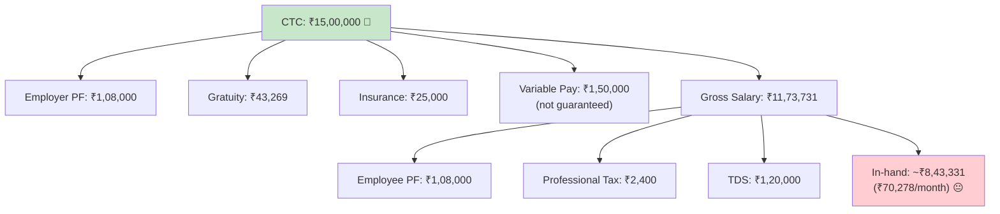
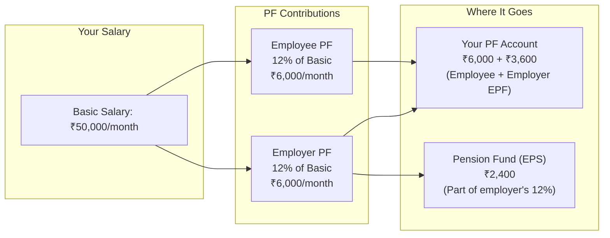
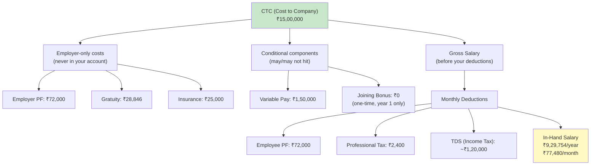
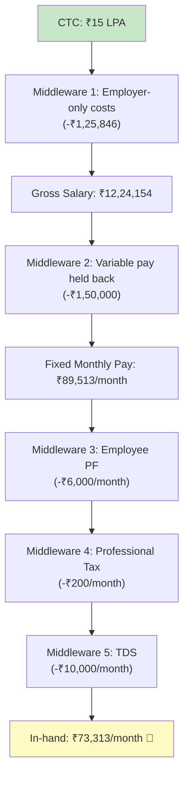
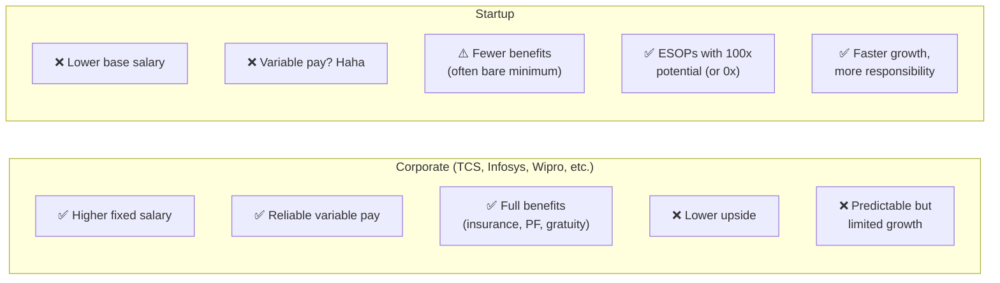

# Section 4 — Corporate Salary Breakdown (The Great CTC Illusion)

> *"Reading your CTC breakdown is like reading a legacy codebase — everything looks intentional, but half of it is there to confuse you."*

---

## The CTC Lie

Let's start with the hard truth:

**Your CTC is NOT your salary. It's not even close.**

CTC stands for **Cost to Company** — it's the total amount your employer spends on you per year. This includes your salary, yes, but also money that:
- Goes to the government (PF contributions, gratuity)
- Goes to insurance companies (health insurance premiums)
- You might never see (variable pay, ESOPs at unknown valuations)
- Comes with strings attached (joining bonus clawbacks, retention clauses)

**CTC is the sticker price. In-hand salary is the road price.**

Like buying a car in India — the showroom price (ex-showroom) looks great until you add registration, insurance, road tax, and that mysterious "handling charge." Your ₹8 lakh car suddenly costs ₹10.5 lakhs.



---

## The Full CTC Anatomy — Component by Component

Let's dissect a **₹15 LPA CTC** offer letter. Every component. No mercy.

### 1. Basic Salary

**What it is:** The foundation of your compensation. Everything else is calculated as a percentage of this.

**Typical range:** 40-50% of CTC

**Why it matters MORE than you think:**
- PF is calculated on basic salary
- Gratuity is calculated on basic salary
- HRA exemption depends on basic salary
- Higher basic = higher PF = more retirement savings = less in-hand now

**Why companies keep it LOW:**
- Lower basic = lower employer PF contribution = company saves money
- Lower basic = lower gratuity liability = company saves money

```
In our ₹15 LPA example:
Basic Salary = 40% of CTC = ₹6,00,000/year = ₹50,000/month
```

**Engineering analogy:** Basic salary is like your `base` class. Everything else `extends` it.

---

### 2. HRA (House Rent Allowance)

**What it is:** An allowance to cover housing expenses. Part of your salary, but can get tax exemption if you actually pay rent.

**Typical range:** 40-50% of Basic Salary

**Tax exemption:** If you pay rent and live in a rented house, you can claim HRA exemption. The exemption is the **minimum** of:
1. Actual HRA received
2. Rent paid minus 10% of basic salary
3. 50% of basic salary (metro cities) or 40% (non-metro)

```
In our example:
HRA = 50% of Basic = ₹3,00,000/year = ₹25,000/month

If you pay ₹20,000/month rent in Bangalore:
- Actual HRA: ₹25,000/month
- Rent - 10% of basic: ₹20,000 - ₹5,000 = ₹15,000/month
- 50% of basic (metro): ₹25,000/month

Exemption = min(25000, 15000, 25000) = ₹15,000/month = ₹1,80,000/year
```

**Pro tip:** Even if you live with parents, you can pay them rent (they should declare it as rental income) and claim HRA exemption. Legal and smart.

> **Note:** HRA exemption is available only under the **Old Tax Regime**. The New Tax Regime doesn't allow it.

---

### 3. Special Allowance

**What it is:** A catch-all component that's fully taxable. Companies use this to fill the gap between basic, HRA, and your total fixed pay.

**Typical range:** Whatever is left after allocating basic and HRA.

```
In our example:
Special Allowance = Fixed Pay - Basic - HRA
= ₹9,00,000 - ₹6,00,000 - ₹3,00,000
= ₹0 (or adjusted differently)

Often: ₹1,50,000 - ₹3,00,000/year
```

**Tax status:** Fully taxable. No exemptions. It's the `else` branch in your salary's `if-else` chain — everything that doesn't fit elsewhere goes here.

---

### 4. Bonus / Performance Bonus

**What it is:** A lump sum paid based on individual and/or company performance.

**Typical range:** 5-20% of CTC

**The catch:**
- It's usually NOT guaranteed
- It depends on performance ratings AND company targets
- You might get 0%, 50%, 100%, or 120% of the "target" bonus
- Companies include 100% of target bonus in CTC (optimistic much?)

```
In our example:
Target Bonus = 10% of CTC = ₹1,50,000
Reality: You might get ₹75,000 - ₹1,50,000 depending on rating

Some companies pay quarterly, some annually.
```

**Engineering analogy:** Variable pay is like an SLA promise. The contract says "99.99% uptime" but reality might be... different.

---

### 5. Variable Pay

**What it is:** Similar to bonus, sometimes used as a separate component or interchangeably.

In many companies, variable pay is split:
- **Individual performance** component (your rating)
- **Company performance** component (did the company hit targets?)
- **Team performance** (sometimes)

**The hard truth:** In 2023-2024, many tech companies paid 0% variable pay despite having it in CTC. When times are tough, this is the first thing that gets cut.

---

### 6. PF (Provident Fund)

**What it is:** A mandatory retirement savings scheme. Both you AND your employer contribute.

**How it works:**



**The split:**
- **Employee contribution:** 12% of basic salary → goes to your EPF account
- **Employer contribution:** 12% of basic salary, but split:
  - 8.33% goes to **EPS (Employees' Pension Scheme)** — capped at ₹1,250/month
  - 3.67% goes to **EPF** — your account

**For basic salary ≤ ₹15,000/month:** PF is mandatory.
**For basic salary > ₹15,000/month:** PF contribution is typically capped at 12% of ₹15,000 = ₹1,800/month, BUT many companies contribute on actual basic.

```
In our example (if PF on full basic):
Employee PF: 12% × ₹50,000 = ₹6,000/month = ₹72,000/year
Employer PF: 12% × ₹50,000 = ₹6,000/month = ₹72,000/year

Total going to PF: ₹1,44,000/year
Your in-hand reduces by: ₹72,000/year (employee share)
Employer PF is PART of your CTC: ₹72,000/year
```

**Important:** Employer PF is money the company pays on your behalf. It's in your CTC but never shows up in your bank account — it goes directly to your PF account.

**Current PF interest rate:** ~8.25% per annum (tax-free up to ₹2.5L annual contribution). That's actually a decent return for a virtually risk-free investment.

---

### 7. Gratuity

**What it is:** A lump sum payment you receive when you leave the company, but ONLY if you've worked for at least **5 years**.

**Formula:**
```
Gratuity = (Last drawn basic salary × 15 × years of service) / 26
```

**Example:**
```
Basic at time of leaving: ₹80,000/month
Years of service: 6 years

Gratuity = (80,000 × 15 × 6) / 26 = ₹2,76,923
```

**The CTC trick:** Companies include the annual gratuity provision in your CTC even though:
1. You only get it if you complete 5 years
2. Most engineers in India switch jobs every 2-3 years
3. If you leave before 5 years, this component is **phantom money** — it was never really yours

```
In our ₹15 LPA example:
Annual gratuity provision = (50,000 × 15) / 26 = ₹28,846/year
This is in your CTC but you won't see it unless you stay 5+ years.
```

**Engineering analogy:** Gratuity is like a retention bonus with a 5-year cliff — it exists in the code but that particular function never gets called if you `exit(0)` early.

---

### 8. Insurance (Health/Life)

**What it is:** Group health insurance and sometimes group life insurance that the company pays for.

**Typical coverage:** ₹3-10 lakhs health insurance for employee + family.

**Cost included in CTC:** ₹10,000 - ₹30,000/year

**Key points:**
- This is a GROUP policy — premiums are lower than individual policies
- Coverage varies wildly between companies
- Some companies include spouse, children, and parents; others don't
- **This coverage ENDS when you leave the company**
- You should have your OWN health insurance too (see Section 8)

```
In our example:
Insurance component in CTC: ₹25,000/year
This pays for your group mediclaim. Not in your bank account.
```

---

### 9. Joining Bonus

**What it is:** A one-time payment to sweeten the deal and compensate you for the bonus/variable pay you're leaving behind at your current company.

**Typical range:** ₹50,000 - ₹5,00,000+ (depends on level and negotiation)

**THE TRAP:** Almost always comes with a **clawback clause**:
- If you leave within 12-24 months, you must return the joining bonus (sometimes pro-rated, sometimes full)
- Read the fine print. Seriously.

```
CTC breakdown might show: ₹15 LPA
But if ₹2 LPA of that is joining bonus:
  Year 1 total: ₹15 LPA (including bonus)
  Year 2 total: ₹13 LPA (bonus was one-time)

Your "real" recurring CTC is ₹13 LPA.
```

**Pro tip:** Always ask "What's my fixed CTC *excluding* joining bonus?" to get the real number.

---

### 10. Retention Bonus

**What it is:** A bonus promised for staying at the company for a specific period.

**How it works:** "Stay for 2 years and get ₹3,00,000." It's the company's way of reducing attrition by creating golden handcuffs.

**Key considerations:**
- Usually paid at the END of the retention period
- Fully taxable
- May or may not be part of CTC
- If you leave early, you get ₹0

---

### 11. ESOPs / RSUs

Covered in detail in Section 7. For now:

- **ESOPs** = Options to buy company shares at a fixed price (common in startups)
- **RSUs** = Restricted Stock Units — actual shares given to you that vest over time (common in large companies)
- These CAN be worth a lot (if the company does well) or ₹0 (if it doesn't)
- Companies love including high ESOP valuations in CTC to inflate the number

---

## CTC vs Gross Salary vs In-Hand: The Complete Picture



Here's the actual math:

```
CTC:                                    ₹15,00,000

MINUS Employer-only costs:
  - Employer PF contribution             -₹72,000
  - Gratuity provision                   -₹28,846
  - Insurance premium                    -₹25,000
                                        ──────────
GROSS SALARY:                           ₹12,24,154

MINUS Variable/Conditional:
  - Variable Pay (may or may not come)   -₹1,50,000
                                        ──────────
FIXED GROSS SALARY:                     ₹10,74,154

MINUS Employee Deductions:
  - Employee PF                          -₹72,000
  - Professional Tax                     -₹2,400
  - Income Tax (TDS)                     ~₹1,20,000 *
                                        ──────────
APPROXIMATE IN-HAND:                    ₹8,79,754/year
                                        ≈ ₹73,313/month

* Tax depends on regime chosen and deductions claimed.
  This is a rough estimate under New Tax Regime.
```

**Your ₹15 LPA CTC becomes ₹73,000/month in your bank account.**

That's a **41% gap** between CTC and in-hand. This is completely normal for Indian salary structures.

---

## The Deduction Waterfall

Your salary goes through multiple layers of deductions, like HTTP requests going through middleware:



---

## Payslip Decoded: What Each Line Means

Here's what a typical monthly payslip looks like:

```
╔══════════════════════════════════════════════════════╗
║                SALARY SLIP - MARCH 2026              ║
╠══════════════════════════════════════════════════════╣
║ EARNINGS                        │ DEDUCTIONS         ║
║─────────────────────────────────│────────────────────║
║ Basic Salary      ₹50,000      │ Employee PF  ₹6,000║
║ HRA               ₹25,000      │ Prof. Tax    ₹200  ║
║ Special Allowance  ₹14,513      │ TDS         ₹10,000║
║ Conveyance          ₹1,600      │                    ║
║                                 │                    ║
║─────────────────────────────────│────────────────────║
║ GROSS EARNINGS     ₹91,113      │ TOTAL DED.  ₹16,200║
╠══════════════════════════════════════════════════════╣
║ NET PAY (IN-HAND):                      ₹74,913     ║
╚══════════════════════════════════════════════════════╝

  Not shown here but part of CTC:
  • Employer PF:    ₹6,000/month
  • Gratuity:       ₹2,404/month (provision)
  • Insurance:      ₹2,083/month (premium)
  • Variable Pay:   ₹12,500/month (paid quarterly/annually IF earned)
```

---

## Why Companies Structure Salaries This Way

You might wonder — why not just pay ₹10 LPA straight into my account? Why this complex breakdown?

### 1. **Tax Optimization (Theirs AND Yours)**

- Lower basic salary = lower employer PF burden (saves the company money)
- HRA as a separate component = tax exemption opportunity for employees
- Splitting into allowances = legal tax optimization structures

### 2. **Legal Compliance**

Indian labor laws REQUIRE:
- PF contributions on basic salary
- Gratuity provisions
- Professional tax deduction
- Minimum basic salary percentages in some states

### 3. **Variable Pay as a Leash**

Variable pay lets companies:
- Link compensation to performance (fair argument)
- Retain flexibility to pay less in bad years (the real reason)
- Inflate CTC on offer letters (the dirty secret)

### 4. **Cost Control**

If the company has 10,000 employees and moves basic salary up 5%, their PF liability increases proportionally. Even small structural changes cascade massively at scale — like a poorly optimized database query that's fine with 100 rows but kills production with 10 million.

---

## Startup Compensation vs Corporate Compensation



| Aspect | Corporate | Startup |
|--------|-----------|---------|
| **Base salary** | Higher (80-90% of comp is fixed) | Lower (60-70% of comp is fixed) |
| **Variable pay** | 10-20%, usually paid | "Performance bonus" = vibes-based |
| **ESOPs/RSUs** | RSUs in large companies, meaningful value | ESOPs everywhere, value often ₹0 |
| **Insurance** | Comprehensive group policy | Basic or DIY |
| **PF** | Proper compliance | Sometimes "minimum PF" to maximize in-hand |
| **Salary on time** | Like clockwork | "It's a few days late because runway" |
| **CTC inflation** | 20-30% inflated | 50-100%+ inflated (ESOP paper value) |

### The Startup CTC Deception

A startup might offer "₹25 LPA CTC" that looks like:

```
Base Salary:     ₹10,00,000
Variable Pay:    ₹2,00,000 (LOL)
ESOP Value:      ₹13,00,000 (based on "latest valuation of ₹500 Cr")

Total CTC:       ₹25,00,000

In-hand reality: ₹7,50,000/year = ₹62,500/month
ESOP reality:    Might be ₹0 if startup fails (and most do)
```

**Always negotiate based on fixed cash compensation.** ESOPs are lottery tickets, not salary.

---

## How to Negotiate Salary (The CTC Game)

Now that you understand the breakdown, here's how to play the game:

### 1. **Always Ask for the Breakup**

When you get an offer, don't just accept the CTC number. Ask:
- "Can you share the detailed compensation breakup?"
- "What's the fixed vs variable split?"
- "What's the in-hand monthly salary?"
- "Are there any clawback clauses on the joining bonus?"

### 2. **Negotiate Base, Not CTC**

Increasing CTC by ₹1 lakh through ESOP paper value is meaningless. Increasing base by ₹1 lakh means ₹8,000+ more in your bank account every month.

### 3. **Compare In-Hand, Not CTC**

When comparing two offers:

```
Offer A: CTC ₹18 LPA, In-hand ₹90K/month
Offer B: CTC ₹20 LPA, In-hand ₹85K/month (rest is ESOPs + variable)

Offer A pays you MORE actual money despite lower CTC.
```

### 4. **Understand the Variable Pay History**

Ask: "What percentage of variable pay was actually paid out last year?" If the answer is 60%, mentally calculate your real variable at 60%.

---

## 🇯🇵 Japan Comparison: Salary Structure

Japanese salary structure is hilariously different:

| Aspect | India | Japan |
|--------|-------|-------|
| **Base salary** | 40-50% of CTC | 70-80% of total (called 基本給, *kihon-kyū*) |
| **Bonus** | Variable, 5-20% of CTC | Two large bonuses/year (summer & winter), often 2-6 months of base salary! |
| **Structure complexity** | Very complex (10+ components) | Relatively simple |
| **ESOP culture** | Strong in startups | Rare outside tech companies |
| **Salary negotiation** | Expected and normal | Uncommon and culturally awkward |
| **Annual increment** | 5-15% (performance-based) | 2-5% (seniority-based, "年功序列") |

Japanese companies are famous for **seniority-based pay (年功序列/nenkō joretsu)** — you get paid more simply for being at the company longer. This is slowly changing, especially in tech, but it's still prevalent.

The bonus culture is interesting too: Japanese engineers expect two large bonuses (夏のボーナス in summer and 冬のボーナス in winter), each worth 1-3 months of base salary. These are considered part of annual compensation and are more reliably paid than Indian variable pay.

---

## The Full CTC Comparison Table

Here's how a ₹15 LPA CTC typically breaks down across different company types:

| Component | Big IT (TCS/Infosys) | Product Co (Flipkart/Google) | Startup |
|-----------|---------------------|------------------------------|---------|
| Basic | ₹6,00,000 | ₹7,50,000 | ₹5,00,000 |
| HRA | ₹3,00,000 | ₹3,00,000 | ₹2,50,000 |
| Special Allow. | ₹1,50,000 | ₹50,000 | ₹2,00,000 |
| Variable Pay | ₹1,00,000 | ₹1,50,000 | ₹50,000 |
| Employer PF | ₹72,000 | ₹90,000 | ₹21,600* |
| Gratuity | ₹28,846 | ₹36,058 | ₹24,038 |
| Insurance | ₹20,000 | ₹40,000 | ₹10,000 |
| ESOPs/RSUs | ₹0 | ₹1,00,000 | ₹4,00,000** |
| Other benefits | ₹29,154 | ₹83,942 | ₹44,362 |
| **Monthly In-hand** | **~₹72,000** | **~₹75,000** | **~₹65,000** |

*Startups often restrict PF to statutory minimum (12% of ₹15,000)
**ESOP paper value — could be worth anything

---

## Action Items

1. **Download your latest payslip** and identify every component
2. **Calculate your actual in-hand** as a percentage of CTC
3. **If you're job hunting**, always ask for a detailed breakup before comparing offers
4. **Negotiate base salary**, not CTC
5. **Don't count non-guaranteed components** (variable, ESOPs) when budgeting monthly expenses

---

## Key Takeaways

```
✅ CTC ≠ Salary. In-hand is typically 60-70% of CTC.
✅ Basic Salary is the most important component — everything depends on it
✅ Variable pay is NOT guaranteed. Budget without it.
✅ Employer PF, gratuity, insurance are "invisible" benefits in CTC
✅ Joining bonus usually has clawback clauses — read the fine print
✅ ESOPs in startups are lottery tickets, not salary
✅ Always compare in-hand salary, not CTC, when evaluating offers
✅ Japan's salary structure is simpler with reliable large bonuses
✅ The CTC game rewards those who understand the rules
```

---

**Next up:** [Section 5 — Taxes for Software Engineers in India](../05-taxes/README.md) — where we explain why the government takes a chunk of your salary, how to minimize it legally, and why choosing the right tax regime can save you lakhs.
