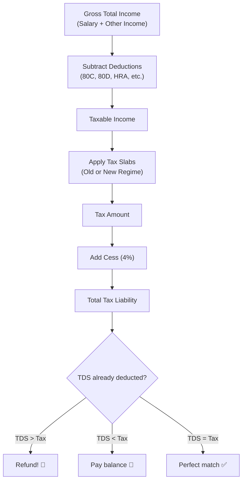
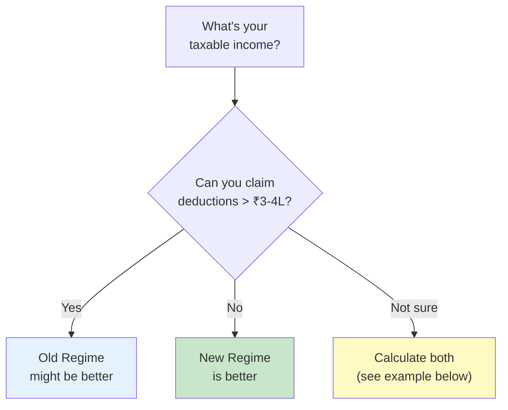
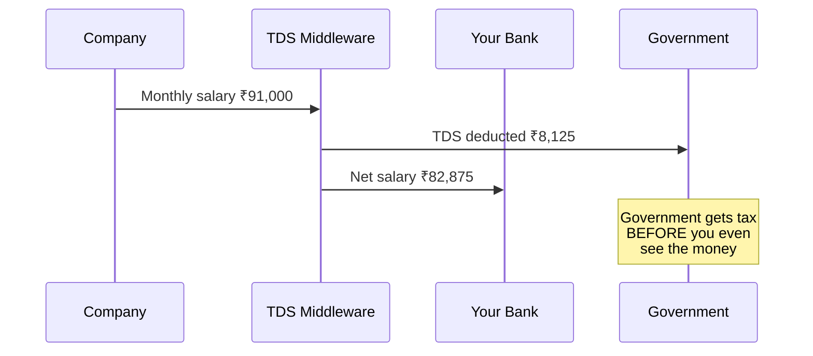
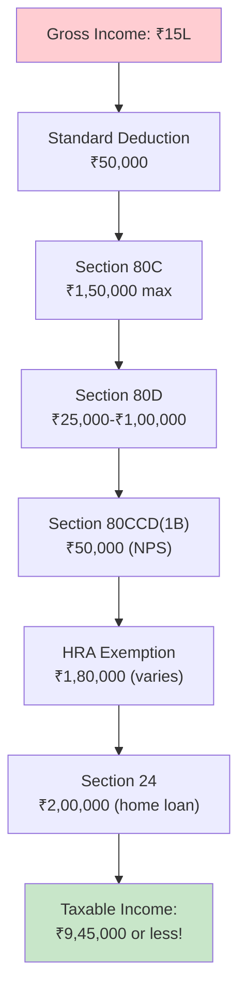
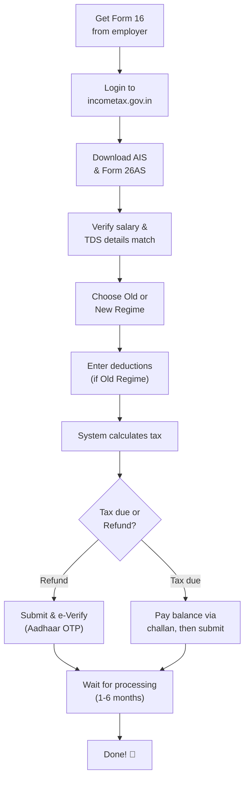

# Section 5 — Taxes for Software Engineers in India

> *"Taxes are like background cron jobs stealing your CPU cycles. You can't kill them, but you can definitely optimize them."*

---

## Why Taxes Matter (Even If They Bore You)

Here's a reality check: **income tax is the single largest expense in most engineers' lives.**

Not rent. Not food. Not EMIs. **Taxes.**

An engineer earning ₹20 LPA pays roughly ₹2.5-3.5 lakhs in tax every year. Over a 30-year career, that's ₹75 lakhs to ₹1 crore+ in taxes. Understanding how to legally minimize this isn't optional — it's literally worth crores.

Think of tax optimization as **performance tuning**. You're not breaking the law. You're reading the documentation and using the features the system provides.

---

## How Income Tax Works in India — The Basics



### The Tax Calculation Pipeline

```
Step 1: Calculate Gross Total Income
        (All your income sources added up)

Step 2: Subtract exemptions & deductions
        (HRA, 80C, 80D, NPS, etc. — OLD REGIME ONLY)

Step 3: Arrive at Taxable Income

Step 4: Apply tax slab rates

Step 5: Add 4% Health & Education Cess

Step 6: Compare with TDS already paid
        → Overpaid? Get refund
        → Underpaid? Pay the difference
```

---

## Old Tax Regime vs New Tax Regime

India currently has TWO tax regimes, and you have to choose one. Think of it as `v1` (Old) vs `v2` (New) of the tax API.

### New Tax Regime (Default from FY 2023-24 onwards)

This is now the **default regime**. It has lower tax rates but almost NO deductions allowed.

**Tax Slabs (New Regime — FY 2025-26):**

| Income Range | Tax Rate |
|-------------|----------|
| Up to ₹4,00,000 | 0% (Nil) |
| ₹4,00,001 – ₹8,00,000 | 5% |
| ₹8,00,001 – ₹12,00,000 | 10% |
| ₹12,00,001 – ₹16,00,000 | 15% |
| ₹16,00,001 – ₹20,00,000 | 20% |
| ₹20,00,001 – ₹24,00,000 | 25% |
| Above ₹24,00,000 | 30% |

**Standard deduction:** ₹75,000 (automatically applied).

**Key feature:** Rebate under Section 87A — No tax if taxable income ≤ ₹12,00,000. After standard deduction, this means salaried individuals with income up to **₹12,75,000** effectively pay **zero tax**.

### Old Tax Regime

Higher rates, but you get to claim deductions.

**Tax Slabs (Old Regime):**

| Income Range | Tax Rate |
|-------------|----------|
| Up to ₹2,50,000 | 0% (Nil) |
| ₹2,50,001 – ₹5,00,000 | 5% |
| ₹5,00,001 – ₹10,00,000 | 20% |
| Above ₹10,00,000 | 30% |

**Standard deduction:** ₹50,000

**Available deductions (not available in New Regime):**
- Section 80C (up to ₹1.5L)
- Section 80D (health insurance up to ₹25K-₹1L)
- HRA exemption
- Section 80CCD(1B) – NPS (additional ₹50K)
- Home loan interest (Section 24)
- And many more...

### Which One Should YOU Choose?



**General rule of thumb:**
- **Salary < ₹12.75 LPA** → New Regime (zero tax with rebate!)
- **Salary ₹12-20 LPA, minimal deductions** → New Regime
- **Salary > ₹15 LPA with home loan + HRA + 80C + NPS** → Calculate both. Old regime MAY win
- **Very high salary (₹30L+) with full deductions** → Usually Old Regime

---

## Real-World Tax Calculation Example

Let's calculate for an engineer earning **₹18 LPA (CTC)** with a gross salary of ₹15 LPA:

### Scenario: New Tax Regime

```
Gross Salary:                    ₹15,00,000
Less: Standard Deduction         -₹75,000
Less: Employer NPS (if any)      -₹0
                                ──────────
Taxable Income:                  ₹14,25,000

Tax Calculation:
₹0 – ₹4,00,000:      0%  =  ₹0
₹4L – ₹8,00,000:      5%  =  ₹20,000
₹8L – ₹12,00,000:    10%  =  ₹40,000
₹12L – ₹14,25,000:   15%  =  ₹33,750
                              ──────────
Tax before cess:               ₹93,750
Health & Education Cess (4%):   ₹3,750
                              ──────────
Total Tax:                     ₹97,500

Monthly TDS:                   ₹8,125
```

### Scenario: Old Tax Regime (With Deductions)

```
Gross Salary:                    ₹15,00,000
Less: Standard Deduction         -₹50,000
Less: HRA Exemption              -₹1,80,000  (paying ₹20K rent in metro)
Less: 80C (PPF + ELSS + EPF)    -₹1,50,000  (maxed out)
Less: 80D (Health Insurance)     -₹25,000    (self)
Less: 80CCD(1B) NPS             -₹50,000    (additional NPS)
                                ──────────
Taxable Income:                  ₹10,45,000

Tax Calculation:
₹0 – ₹2,50,000:       0%  =  ₹0
₹2.5L – ₹5,00,000:    5%  =  ₹12,500
₹5L – ₹10,00,000:    20%  =  ₹1,00,000
₹10L – ₹10,45,000:   30%  =  ₹13,500
                              ──────────
Tax before cess:               ₹1,26,000
Health & Education Cess (4%):   ₹5,040
                              ──────────
Total Tax:                     ₹1,31,040

Monthly TDS:                   ₹10,920
```

### Comparison:

| | New Regime | Old Regime |
|---|---|---|
| **Taxable income** | ₹14,25,000 | ₹10,45,000 |
| **Total deductions claimed** | ₹75,000 | ₹4,55,000 |
| **Total tax** | **₹97,500** | **₹1,31,040** |
| **Winner** | ✅ New Regime wins! | |

In this case, **New Regime saves ₹33,540** in tax. The New Regime wins because the lower slab rates overpower the deduction advantage.

But wait — if this person had a **home loan with ₹2L interest** (Section 24), the Old Regime taxable income drops to ₹8,45,000, making Old Regime tax about ₹82,000 — beating the New Regime.

**Moral: Always calculate both. Use an online tax calculator or a simple spreadsheet.**

---

## TDS — Tax Deducted at Source

TDS is the government's way of ensuring they get paid first. It's like a **pre-payment interceptor**.



### How TDS Works for Salaried Employees:

1. At the start of FY, you declare your expected investments/deductions to HR
2. HR calculates your estimated annual tax
3. Divides it by 12 (or remaining months)
4. Deducts that amount every month as TDS
5. Deposits it with the government

**If you forget to submit investment proofs:**
- HR assumes you have NO deductions
- TDS is maximum → less in-hand
- You can claim refund when filing ITR, but your money is stuck with the government for months

**Pro tip:** Submit your investment declarations (not proofs) to HR in April itself. This ensures your TDS is calculated correctly from Day 1, giving you more in-hand throughout the year.

---

## Key Tax-Saving Sections (Old Regime)

### Section 80C — The MVP (₹1,50,000 limit)

This is the most popular deduction. You can invest up to ₹1.5 lakhs in qualifying instruments:

| Instrument | Lock-in | Returns | Recommended? |
|-----------|---------|---------|--------------|
| **ELSS Mutual Funds** | 3 years | 12-15% (market-linked) | ✅ Best option |
| **PPF** | 15 years | 7.1% (tax-free) | ✅ Good for long-term |
| **EPF** (employer PF) | Till retirement | 8.25% (tax-free) | ✅ Already deducted |
| **NPS** (under 80C) | Till 60 | 8-12% (market-linked) | ✅ Good |
| **Life Insurance Premium** | Varies | 4-6% (low returns) | ❌ Bad investment |
| **ULIP** | 5 years | Variable | ❌ Bad investment |
| **Tax-saving FD** | 5 years | 6-7% | ⚠️ Okay if conservative |
| **NSC** | 5 years | 7.7% | ⚠️ Okay |
| **Tuition fees** | N/A | N/A | ✅ If applicable |
| **Home loan principal** | N/A | N/A | ✅ If applicable |

**The optimal 80C strategy for most engineers:**
```
EPF contribution:       ~₹72,000 (already deducted, counts toward 80C)
ELSS mutual fund SIP:    ₹78,000 (₹6,500/month)
                        ──────────
Total 80C:              ₹1,50,000 ✅
```

### Section 80D — Health Insurance (₹25,000 - ₹1,00,000)

| For | Deduction Limit |
|-----|----------------|
| Self & family (< 60 years) | ₹25,000 |
| Parents (< 60 years) | ₹25,000 |
| Parents (≥ 60 years) | ₹50,000 |
| **Max total deduction** | **₹1,00,000** |

Buy health insurance for yourself AND your parents. It's a double win:
1. ₹25K-50K tax deduction  
2. Actual coverage when you need it (hospital bills are brutal in India)

### Section 80CCD(1B) — NPS Additional Deduction (₹50,000)

Over and above the ₹1.5L under 80C, you can get an **additional ₹50,000** deduction by contributing to the National Pension System (NPS).

```
This single deduction saves you:
- 30% slab: ₹50,000 × 30% × 1.04 = ₹15,600 in tax
- 20% slab: ₹50,000 × 20% × 1.04 = ₹10,400 in tax
```

### Section 24 — Home Loan Interest (₹2,00,000)

If you have a home loan, you can deduct up to ₹2L of interest paid per year. This is one of the biggest deductions available and often tips the scale toward Old Regime.

---

## Common Tax Deduction Summary (Old Regime)



**Maximum deductions for a salaried engineer (no home loan):**
```
Standard deduction:    ₹50,000
80C:                   ₹1,50,000
80D (self + parents):  ₹50,000
80CCD(1B) NPS:         ₹50,000
HRA:                   ₹1,80,000 (varies)
                       ──────────
Total possible:        ₹4,80,000

That's ₹4.8 lakhs shaved off your taxable income.
At 30% slab: saves ~₹1,44,000 in tax + cess.
```

---

## Form 16 — Your Tax Report Card

Form 16 is a certificate your employer issues after each FY. It has two parts:

**Part A:** Details of TDS deducted and deposited (matches Form 26AS)
**Part B:** Detailed salary breakup, deductions claimed, and tax calculated

```
Form 16 is basically your employer saying:
"Hey Government, here's what we paid this employee and here's the
tax we already took from them. ~kthxbye"
```

**You need Form 16 to file your ITR.** If your company doesn't give it by June 15, chase them. Hard.

---

## Filing Your Income Tax Return (ITR)

### Which ITR Form?

| Form | Who Uses It |
|------|-------------|
| **ITR-1 (SAHAJ)** | Salary ≤ ₹50L, one house property, interest income. **Most salaried engineers use this.** |
| **ITR-2** | Salary > ₹50L, capital gains from stocks/MF, multiple houses, foreign income |
| **ITR-3** | Business or profession income |
| **ITR-4** | Presumptive business income |

If you only have salary + some interest + maybe capital gains from mutual funds → **ITR-1 or ITR-2**.

### How to File (Step by Step)



### Filing Timeline

```
April 1:          New FY starts
June 15:          Employer issues Form 16
July 1-31:        File ITR (aim for first week of July)
                  → Portal is less buggy
                  → Refunds processed faster
July 31:          DEADLINE for filing without penalty
Dec 31:           Belated return deadline (₹5,000 penalty)
```

### e-Verification (Required within 30 days of filing)

After filing, you MUST verify your return. Options:
1. **Aadhaar OTP** — Fastest and easiest ✅
2. **Net banking** — Login through your bank
3. **DSC** — Digital Signature Certificate (overkill for most)
4. **Physical** — Send signed ITR-V to CPC Bangalore (slow, avoid)

---

## Common Tax Mistakes Engineers Make

### ❌ Mistake 1: Not filing ITR because "TDS covers everything"

Even if your TDS perfectly matches your tax, **file your ITR**. It's useful for:
- Loan applications (banks ask for 2-3 years of ITR)
- Visa applications (embassies verify tax compliance)
- Claiming refund of excess TDS
- Carry-forward of losses (capital gains losses)
- Proof of income for renting a house

### ❌ Mistake 2: Buying insurance as an "investment"

That insurance policy your uncle/advisor pushed for "tax saving under 80C"? The returns are 4-6%. You'd be better off with ELSS mutual funds (12-15% returns, same 80C benefit, only 3-year lock-in vs. 15-20 years for insurance).

**Insurance is for protection. Investment is for growth. Don't mix them.**

### ❌ Mistake 3: Panic-buying investments in March

Every March, engineers rush to make 80C investments. This leads to:
- Buying random ULIP/insurance policies
- Not comparing options
- Lump sum investing in ELSS instead of spreading SIP through the year

**Fix:** Set up monthly SIPs in ELSS in April. By January, your 80C is done automatically.

### ❌ Mistake 4: Not claiming HRA when living with parents

If you live in your parents' house AND pay them rent, you can claim HRA exemption. Requirements:
- You actually transfer rent to a parent's account
- Parent declares this rental income in their ITR
- You have rent receipts/agreement
- The parent should be the owner of the property

### ❌ Mistake 5: Ignoring capital gains tax

When you sell mutual funds, stocks, or property, you owe capital gains tax:

| Asset | Holding Period | Type | Tax Rate |
|-------|---------------|------|----------|
| Equity MF/Stocks | < 12 months | STCG | 20% |
| Equity MF/Stocks | ≥ 12 months | LTCG | 12.5% (above ₹1.25L exempt) |
| Debt MF | Any | Slab rate | As per income slab |
| Property | < 24 months | STCG | Slab rate |
| Property | ≥ 24 months | LTCG | 12.5% (with indexation benefit on purchase before July 2024) |

**LTCG on equity:** First ₹1.25 lakh of long-term capital gain per year is TAX-FREE. Plan your redemptions accordingly.

### ❌ Mistake 6: Not tracking TDS on FD interest

Banks deduct 10% TDS on FD interest above ₹40,000/year. But if you're in the 30% slab, you owe an additional 20% + cess when filing ITR. Many engineers forget this and get a surprise tax demand.

---

## 🇯🇵 Japan Comparison: Taxation

| Aspect | India | Japan |
|--------|-------|-------|
| **Income tax rate (max)** | 30% + 4% cess = 31.2% | 45% + 2.1% reconstruction tax (national) + ~10% resident tax = ~55% |
| **Tax-free threshold** | ₹4L (new) / ₹2.5L (old) | ¥480,000 (~₹2.7L) basic exemption |
| **Who files?** | Everyone should | Most salaried workers don't need to |
| **Bonus taxation** | Taxed as salary (slab rate) | Taxed at a flat rate (~20%+) |
| **Consumption tax (GST/VAT)** | GST: 5-28% | Consumption tax: 10% flat |
| **Filing complexity** | High | Moderate (mostly automated) |

Japan's tax rates are significantly higher at the top end (~55% effective), but the system is more automated for salaried workers. Indian engineers have lower tax rates but more complexity in claiming deductions and filing returns.

---

## Tax Optimization Strategies for Engineers

### Strategy 1: The Monthly Auto-Pilot

```
April: Set up these monthly SIPs for tax-saving
─────────────────────────────────────────────
ELSS fund SIP:  ₹6,500/month  (₹78,000 + EPF ≈ ₹1.5L for 80C)
NPS SIP:        ₹4,200/month  (₹50,000 for 80CCD(1B))
Health insurance: Pay annual premium in April (₹25,000 for 80D)

→ By December, your tax-saving is DONE automatically.
→ No March panic. No bad decisions.
```

### Strategy 2: HRA Optimization

If you pay rent:
- Get rent receipts (or a rental agreement)
- Claim HRA exemption under Old Regime
- If rent > ₹1L/year, landlord's PAN is required on declaration

If you don't pay rent (own house):
- Skip HRA (can't claim what you don't pay)
- But home loan interest under Section 24 may help instead

### Strategy 3: Salary Restructuring

Some companies allow you to restructure your salary components:
- Increase HRA → more exempt, less taxed
- Add food coupons (Sodexo/Zeta) → up to ₹2,200/month exempt
- Add NPS employer contribution → up to 14% of basic (deductible)
- Add leave travel allowance (LTA) → exemption for travel within India

> Not all companies offer this flexibility, but it doesn't hurt to ask HR.

---

## The Complete Tax Calendar

| When | What | Action |
|------|------|--------|
| **April** | New FY begins | Declare investments to HR, start SIPs |
| **June 15** | Advance tax Q1 due | Only for freelancers/side income |
| **June 15** | Form 16 issued | Collect from employer |
| **July 1-31** | ITR filing window | File early for faster refund |
| **September 15** | Advance tax Q2 due | Freelancers/additional income |
| **December 15** | Advance tax Q3 due | Same |
| **January** | Investment proof submission | Submit to HR with receipts |
| **February** | Last month for 80C investments | Top up if short |
| **March 15** | Advance tax Q4 due | Final installment |
| **March 31** | FY ENDS | No more investments for this FY |

---

## Key Takeaways

```
✅ Income tax is your biggest expense — optimize it legally
✅ New Regime is default (lower rates, no deductions)
✅ Old Regime can be better if you claim ₹4L+ in deductions
✅ Always calculate BOTH regimes before choosing
✅ Set up tax-saving SIPs in April — no March panic
✅ File ITR even if TDS covers your tax
✅ Form 16 + AIS = your filing toolkit
✅ Capital gains tax applies when you sell investments
✅ Don't buy insurance for tax saving (use ELSS instead)
✅ Japan's taxes are higher but more automated
✅ The govternment WANTS you to invest — use the deductions they offer
```

---

**Next up:** [Section 6 — Understanding Investments](../06-investments/README.md) — where we finally talk about making your money GROW. FDs, mutual funds, SIPs, stocks, gold, and why index funds are the default choice for lazy (smart) engineers.
