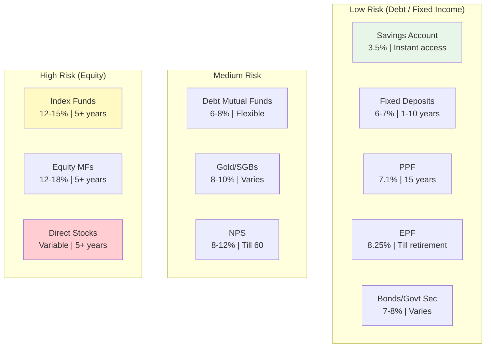
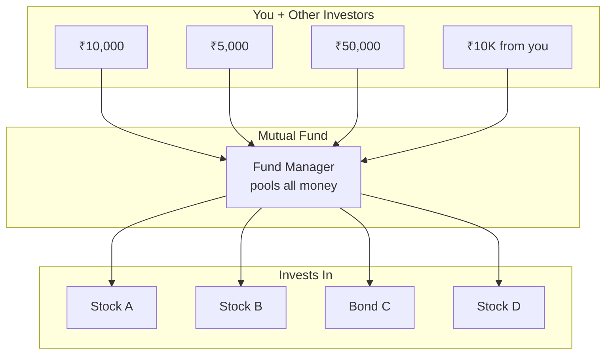
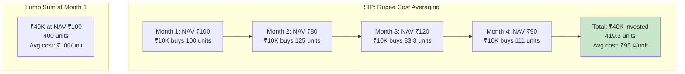
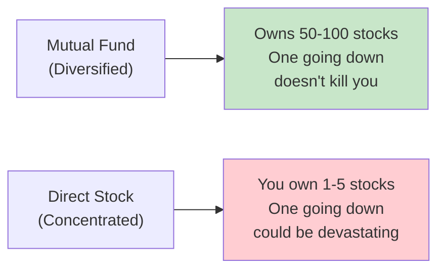
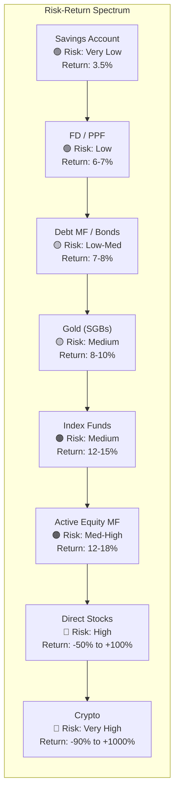
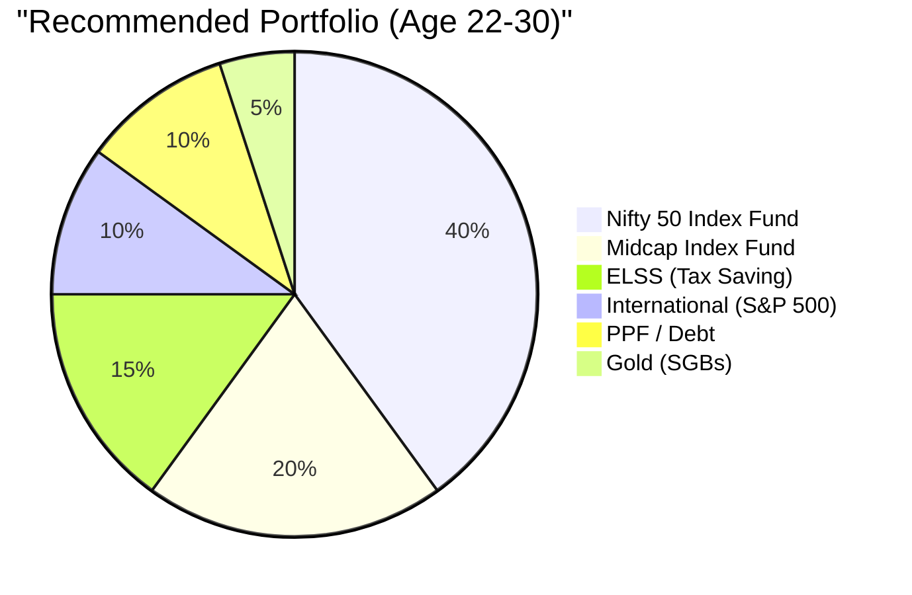
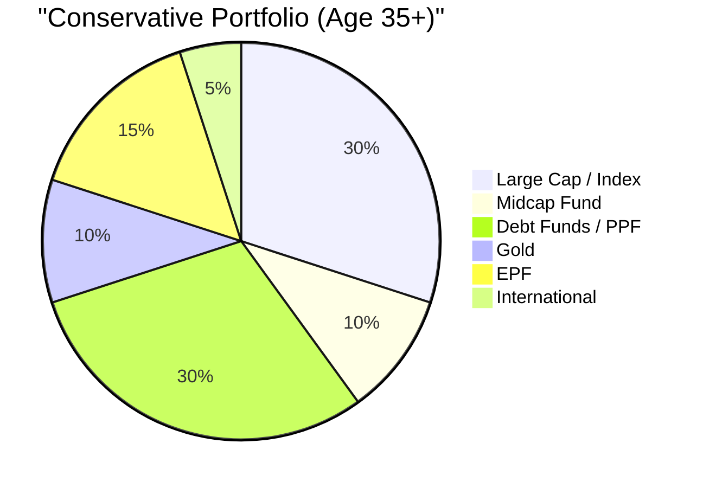
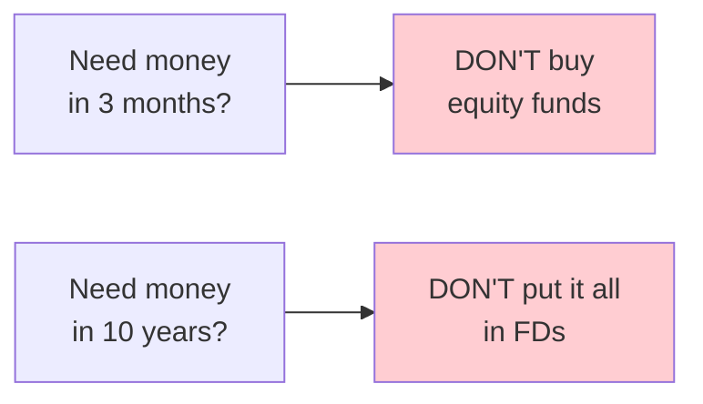

# Section 6 — Understanding Investments

> *"Investing is like system scaling. You start with a single instance, auto-scale over time, and eventually your system handles load you never could have managed manually."*

---

## Why You Need to Invest (Not Just Save)

We covered this in Section 2, but it bears repeating:

```
Savings account interest:  3.5% per year
Inflation in India:        6% per year
───────────────────────────────────────
Real return:              -2.5% per year

Your savings account is a DEPRECIATING ASSET.
```

Investing is the process of putting your money into instruments that grow faster than inflation. The goal is to make your money work as hard as you do — ideally harder, since money doesn't need sleep, coffee breaks, or standup meetings.

---

## The Investment Menu — Every Option Explained



---

### 1. Fixed Deposits (FDs)

**What:** You give money to a bank for a fixed period, bank pays you fixed interest.

**Returns:** 6-7.5% per year (depends on bank and tenure)

**Lock-in:** 7 days to 10 years (penalty for premature withdrawal)

**Taxation:** Interest is fully taxable at your slab rate. TDS of 10% if interest > ₹40,000/year.

**Verdict:**

```
Pros: Safe, guaranteed returns, simple
Cons: Returns barely match inflation after tax
      6.5% FD - 30% tax = ~4.5% effective return
      4.5% - 6% inflation = NEGATIVE real return

Rating: ⭐⭐ (use for emergency fund parking, not wealth building)
```

**Engineering analogy:** FDs are like using a local file system — safe, reliable, zero risk, but doesn't scale at all.

---

### 2. PPF (Public Provident Fund)

**What:** Government-backed savings scheme with tax benefits under Section 80C.

**Returns:** 7.1% per year (set by government quarterly, tax-free)

**Lock-in:** 15 years (partial withdrawals allowed from year 7)

**Taxation:** EEE (Exempt-Exempt-Exempt) — contribution is deductible, interest is tax-free, maturity is tax-free. The holy trinity.

**Investment limit:** ₹500 to ₹1,50,000 per year

**Verdict:**
```
Pros: Tax-free returns, government-backed (zero risk),
      great for long-term
Cons: 15-year lock-in is LONG, returns only decent not great
      Not flexible at all

Rating: ⭐⭐⭐⭐ (great for conservative long-term allocation)
```

**Pro tip:** PPF is ideal for the "safe" portion of your portfolio. Max it out (₹1.5L/year) if you're using Old Regime, since it also gives 80C benefit.

---

### 3. EPF (Employee Provident Fund)

**What:** Your mandatory retirement fund (covered in Section 4).

**Returns:** 8.25% per year (tax-free up to certain limits)

**Lock-in:** Until retirement (can withdraw on job change, but better not to)

**Taxation:** Tax-free up to ₹2.5L annual contribution. Interest on amount above ₹2.5L is taxable.

**Verdict:**
```
Pros: High interest for a risk-free instrument, forced savings,
      employer matches your contribution
Cons: Locked till retirement (ideally), withdrawal process can be slow

Rating: ⭐⭐⭐⭐ (treat it as your rock-solid retirement base)
```

**Critical advice:** When you change jobs, **TRANSFER your PF** to the new employer's account. Don't withdraw it. Every rupee you withdraw loses decades of compounding.

---

### 4. Mutual Funds — The Main Course

**What:** A pool of money collected from many investors, managed by a professional fund manager, invested in stocks/bonds/both.

Think of it like a **managed Kubernetes cluster** — you don't pick individual pods (stocks), you let the manager handle orchestration.



#### Types of Mutual Funds

| Type | What It Invests In | Risk | Expected Return | Best For |
|------|-------------------|------|-----------------|----------|
| **Equity (Large Cap)** | Top 100 companies by market cap | Medium | 10-13% | Stable growth |
| **Equity (Mid Cap)** | 101st-250th companies | Medium-High | 12-16% | Higher growth, more volatility |
| **Equity (Small Cap)** | 250th+ companies | High | 14-20% | Aggressive growth |
| **Equity (Flexi Cap)** | Mix of large, mid, small | Medium | 12-15% | All-weather fund |
| **Index Fund** | Tracks an index (Nifty 50, Sensex) | Medium | 12-15% | Lazy investors ✅ |
| **ELSS** | Tax-saving equity fund | Medium | 12-15% | 80C deduction + growth |
| **Debt** | Bonds, govt securities | Low | 6-8% | Safety, short-term |
| **Hybrid** | Mix of equity + debt | Low-Medium | 8-11% | Balanced approach |
| **Liquid** | Short-term money market | Very Low | 4-6% | Parking emergency fund |

---

### 5. SIP (Systematic Investment Plan) — The Autopilot

**What:** Instead of investing a lump sum, you invest a fixed amount every month automatically.

**Why it's genius:**

1. **Rupee Cost Averaging** — When markets are down, your ₹10,000 buys more units. When markets are up, it buys fewer. Over time, you average out at a good price.

2. **Discipline** — Automated. No decisions. No procrastination. Like a `cron job` that builds wealth.

3. **No timing the market** — Nobody can consistently predict market tops and bottoms. SIP removes that need entirely.



SIP outperforms lump sum in volatile markets because you buy MORE when prices DROP.

**How to start a SIP:**
1. Open a demat account (Zerodha, Groww, Kuvera — any works)
2. Complete KYC (PAN, Aadhaar, selfie — 10 minutes)
3. Choose a fund (see recommendations below)
4. Set SIP amount and date (usually 1st or 5th of month)
5. Forget about it. Check quarterly at most.

---

### 6. Index Funds — The Engineer's Best Friend

**What:** A mutual fund that simply tracks a market index (like Nifty 50 or Sensex) instead of trying to "beat" the market.

**Why engineers love them:**

```
Index Fund Philosophy:
"Don't try to pick the winning stocks.
 Just buy ALL the stocks in the index.
 If the Indian economy grows, you grow."

It's the financial equivalent of:
"Don't micro-optimize. Use the standard library."
```

**Key advantages:**
- **Low expense ratio** (0.1-0.5% vs 1-2% for active funds)
- **No fund manager risk** (the index is the strategy)
- **Historically, 80%+ of active fund managers FAIL to beat the index** over 10+ years
- **Simple, boring, effective** — the holy trinity of engineering

**Popular index funds in India:**
| Fund | Tracks | Expense Ratio |
|------|--------|---------------|
| UTI Nifty 50 Index Fund | Nifty 50 | ~0.18% |
| HDFC Nifty 50 Index Fund | Nifty 50 | ~0.20% |
| Motilal Oswal Nifty Midcap 150 | Nifty Midcap 150 | ~0.30% |
| Motilal Oswal S&P 500 | US S&P 500 | ~0.50% |
| Navi Nifty 50 Index Fund | Nifty 50 | ~0.06% |

**The all-weather beginner portfolio:**
```
70% — Nifty 50 Index Fund (large cap, India)
20% — Nifty Midcap 150 Index Fund (mid cap, India)
10% — S&P 500 Index Fund (international diversification)
```

That's it. Seriously. Start SIPs in these three funds and you're ahead of 90% of people.

---

### 7. Direct Stocks

**What:** Buying shares of individual companies directly.

**Risk:** HIGH. Individual stocks can drop 50-90% or go to zero.

**Returns:** Varies wildly. Could be -80% or +500%.



**When to invest in direct stocks:**
- You understand fundamentals (P/E ratio, revenue growth, moats)
- You can handle a 30-50% drawdown without panic-selling
- You're investing money you won't need for 5+ years
- This is **extra** money beyond your core MF portfolio

**When NOT to invest in direct stocks:**
- You heard about it on Twitter/Reddit
- Your friend said "bro, buy XYZ stock, it'll moon"
- You don't understand what the company does
- You're using money you need in the next 1-2 years

**Engineering analogy:** Direct stocks are like running bare metal servers. More control, more potential performance, but also more things that can go catastrophically wrong. Mutual funds are managed cloud instances.

---

### 8. Bonds

**What:** You lend money to a government or corporation. They pay you fixed interest and return your principal.

**Types in India:**
- **Government bonds (G-Secs):** Very safe, 7-8% returns
- **Corporate bonds:** Higher returns (8-10%), but some risk
- **Sovereign Gold Bonds:** 2.5% interest + gold price appreciation
- **RBI Floating Rate Bonds:** Interest linked to NSC rate

**Use case:** The "safe" allocation of your portfolio. When you're 22, you probably don't need much in bonds. When you're 40, you want more stability.

### 9. Gold

**What:** The OG asset. Indians love gold. We own more gold than the central banks of most countries.

**Ways to invest in gold:**

| Method | Pros | Cons |
|--------|------|------|
| **Physical gold** | Tangible, emotional value | Making charges, storage, theft risk |
| **Gold ETFs** | Low cost, no storage | Demat account needed |
| **Sovereign Gold Bonds (SGBs)** | 2.5% extra interest, no capital gains tax if held to maturity | 8-year lock-in |
| **Digital gold** | Easy to buy via apps | Higher spreads, no regulatory framework |

**SGBs are the BEST way to invest in gold:**
- You get 2.5% interest per year PLUS gold price appreciation
- No capital gains tax if held to maturity (8 years)
- Government-backed
- Issued by RBI periodically

**Historical gold returns in INR:** ~10-11% per year over 20 years

**How much gold should you have?** 5-10% of your portfolio. Not more.

---

## Risk vs Return — The Fundamental Tradeoff



**The Golden Rule:**
> Higher potential returns = Higher risk. Always. No exceptions. Anyone promising high returns with low risk is either lying or setting up a Ponzi scheme.

---

## Diversification — Don't Put All Eggs in One Basket

Diversification is like **load balancing** your portfolio across multiple servers. If one goes down, the others keep serving requests.



**For a more conservative investor (Age 35+):**


### Asset Allocation Rule of Thumb

```
Equity percentage = 100 - Your Age

Age 25: 75% equity, 25% debt/gold
Age 35: 65% equity, 35% debt/gold
Age 45: 55% equity, 45% debt/gold
Age 55: 45% equity, 55% debt/gold
```

This is a rough guide, not gospel. Aggressive investors may hold more equity longer.

---

## Time Horizon — The Missing Context

The same investment can be great or terrible depending on when you need the money:

| Need Money In | Suitable Instruments | Why |
|---------------|---------------------|-----|
| < 6 months | Savings account, liquid MF | Need zero risk, instant access |
| 6 months – 2 years | Short-duration debt MF, FD | Low risk, predictable returns |
| 2-5 years | Hybrid MF, large cap MF, debt MF | Some risk okay, time to recover |
| 5-10 years | Equity MF, index funds | Equity volatility smooths out |
| 10+ years | Equity heavy, index funds, PPF | Maximum compounding, max equity |



**Critical insight:** Equity (stocks/MF) can fall 30-50% in any given year. But over 10+ years, it has NEVER given negative returns in India's history. Time transforms risk into returns.

---

## What Most Salaried Engineers Actually Do (And Should Do)

### Starter Portfolio (Just Started Working)

```
Monthly SIP:
├── ₹5,000 → Nifty 50 Index Fund
├── ₹3,000 → ELSS (tax saving under 80C)
├── ₹2,000 → Nifty Midcap 150 Index Fund
└── ₹5,000 → Emergency fund (liquid MF or savings account until 6 months built)

Total: ₹15,000/month
```

### Intermediate Portfolio (2-5 Years of Working)

```
Monthly SIP:
├── ₹10,000 → Nifty 50 Index Fund
├── ₹6,500 → ELSS (maxes out 80C when combined with EPF)
├── ₹5,000 → Nifty Midcap 150 Index Fund
├── ₹3,000 → S&P 500 Index Fund (international)
├── ₹4,200 → NPS (for 80CCD(1B) deduction)
└── ₹1,50,000/year → PPF (annually or monthly)

Total: ₹28,700/month + PPF
```

### Advanced Portfolio (5+ Years, Higher Salary)

All of above, plus:
- Direct stocks (5-10% of portfolio, only if interested)
- Sovereign Gold Bonds (5% of portfolio)  
- Real estate (if it makes financial sense in your city)
- International funds beyond S&P 500

---

## Where to Invest — Platforms

| Platform | Best For | Fees |
|----------|----------|------|
| **Zerodha (Coin)** | Direct MF investing, stocks | Free for MF, ₹20/trade for stocks |
| **Groww** | Beginners, clean UI | Free for MF |
| **Kuvera** | Goal-based investing, family accounts | Free |
| **MF Utilities** | No-frills, government-backed | Free |
| **ET Money** | Tax filing + MF combo | Free MF, paid tax features |
| **INDmoney** | US stocks + Indian MF | Some fees for US stocks |

**Important:** Always invest in **Direct plans**, NOT Regular plans. The difference:

```
Regular Plan expense ratio:  1.5-2.0%
Direct Plan expense ratio:   0.3-0.5%

Difference over 20 years on ₹50L portfolio:
Regular: ₹50L → ₹1.3 Cr
Direct:  ₹50L → ₹1.7 Cr

That 1% fee difference = ₹40 LAKHS lost to commissions.
```

**Any platform that says "free mutual fund investment" while pushing Regular plans is stealing from you. Always choose Direct Growth plans.**

---

## 🇯🇵 Japan Comparison: Investment Culture

| Aspect | India | Japan |
|--------|-------|-------|
| **Popular investments** | MF, FD, Gold, Real Estate | Bank savings (sadly), NISA/iDeCo (growing) |
| **Equity participation** | ~3-4% of population | ~18% (growing fast due to NISA) |
| **Index fund culture** | Growing rapidly | Very strong (S&P 500 is most popular fund!) |
| **Gold obsession** | Massive | Moderate |
| **Real estate** | Considered essential investment | Depreciating asset (homes LOSE value) |
| **Government incentive** | 80C, ELSS, NPS | NISA (tax-free investment account, similar to ELSS but better) |

Interesting fact: Japan's most popular mutual fund is the **eMAXIS Slim S&P 500** — a US stock index fund. Japanese investors are investing in AMERICAN stocks because Japanese stocks were stagnant for decades. India's market, by contrast, has been one of the best-performing in the world.

Japan recently reformed its NISA (Nippon Individual Savings Account) program, allowing up to ¥18 million (₹1 crore!) in lifetime tax-free investments. India's equivalent is ELSS, but the tax benefit is capped at ₹1.5L under 80C — far less generous.

---

## Key Takeaways

```
✅ Savings account ≠ Investment. Period.
✅ Start with SIPs in index funds — the simplest and most effective strategy
✅ Index funds beat 80%+ of active fund managers over time
✅ SIP = automated discipline. Set it and forget it.
✅ Diversify across equity, debt, and gold
✅ Time in the market > Timing the market
✅ Always choose Direct plans over Regular plans
✅ ELSS = Tax saving + Equity growth (best of both worlds)
✅ Risk tolerance changes with age — adjust accordingly
✅ Gold: 5-10% max. Buy SGBs, not jewelry for investment.
✅ Don't invest money you need in < 3 years in equity
```

---

**Next up:** [Section 7 — Startup Compensation and ESOPs](../07-esops-startup-comp/README.md) — where we explain why that "₹50 LPA" startup offer might actually be worth ₹8 LPA in reality, and when ESOPs actually make you rich.
