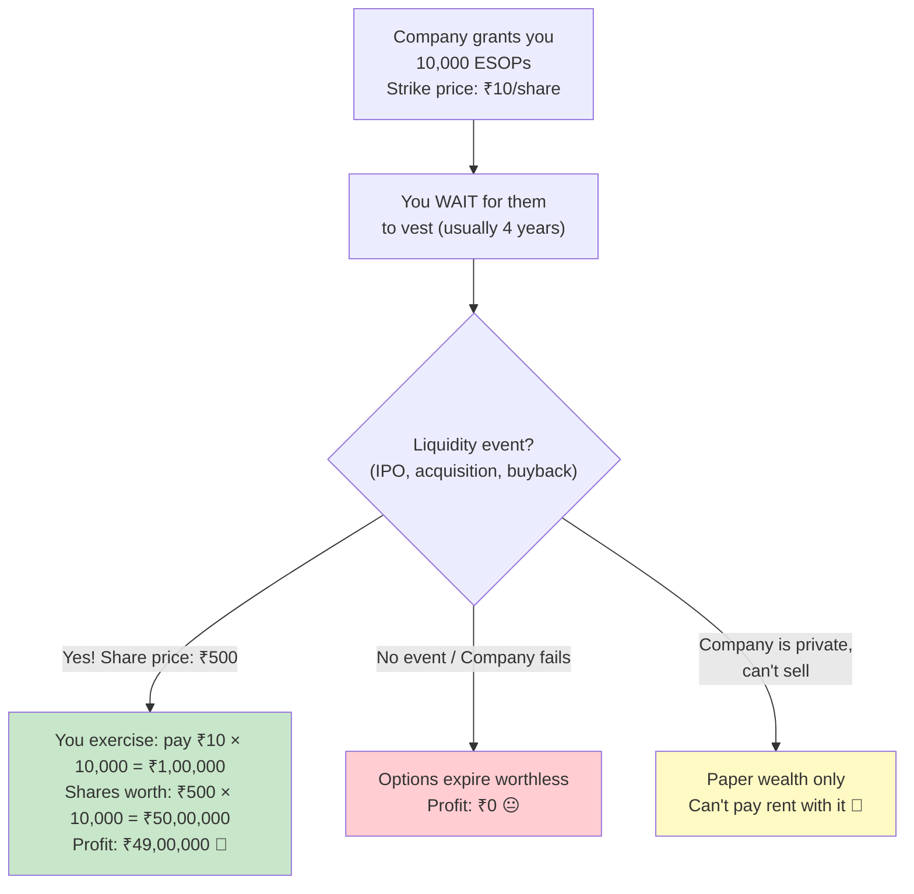
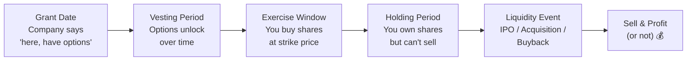
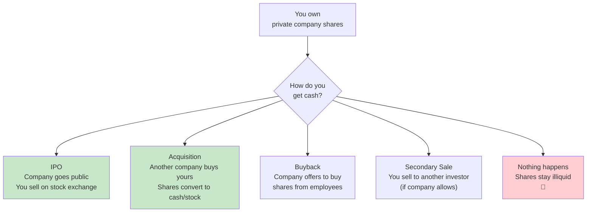
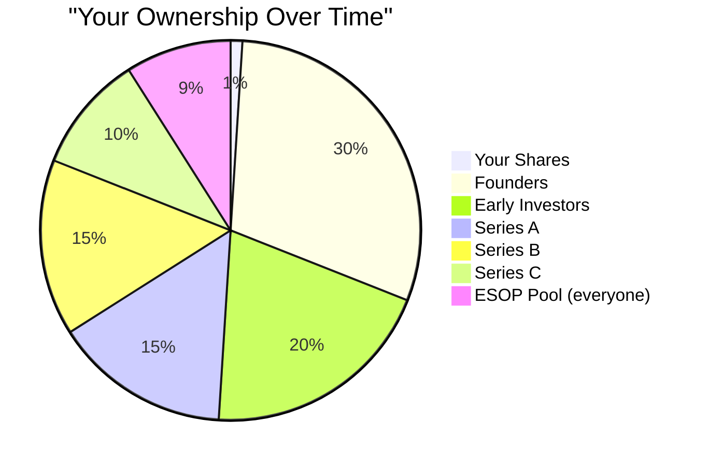
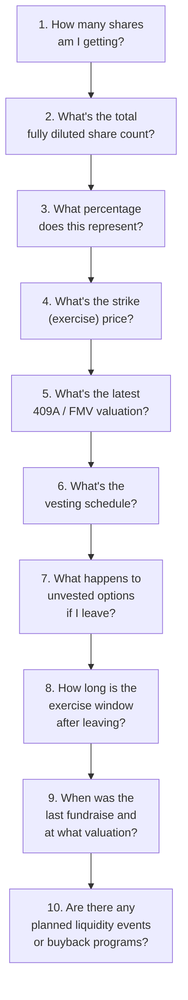
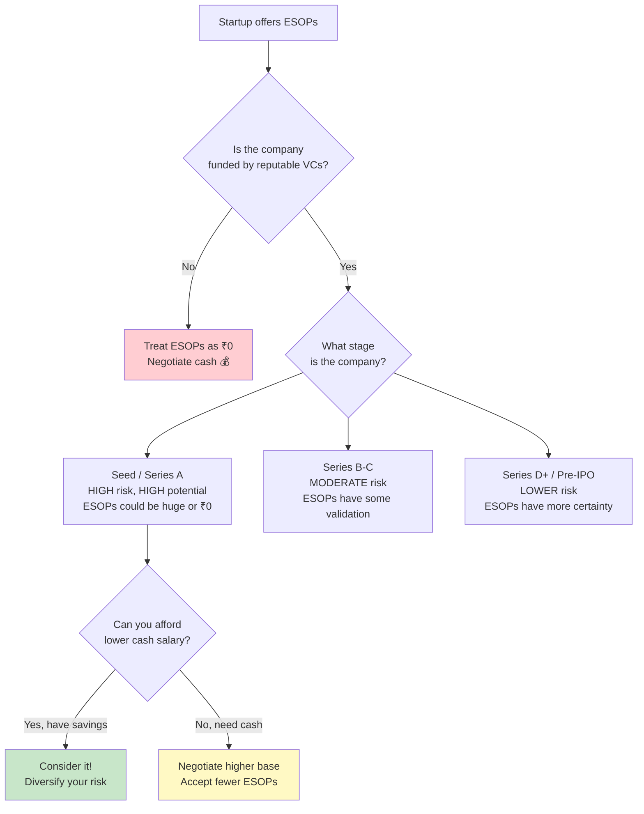

# Section 7 — Startup Compensation and ESOPs

> *"ESOPs are like Schrödinger's money — simultaneously worth millions and worth nothing until a liquidity event opens the box."*

---

## The Startup Compensation Game

If you've ever received a startup offer letter, you've probably seen something like this:

```
Total CTC: ₹30 LPA
├── Base Salary:     ₹12,00,000
├── Variable Pay:    ₹3,00,000
└── ESOPs:           ₹15,00,000 (valued at last funding round)

Translation: "We'll pay you ₹12L but tell everyone it's ₹30L" 🎭
```

Startups use ESOPs to bridge the gap between what they CAN pay (limited cash) and what they WANT to offer (competitive CTC). It's a clever mechanism that aligns your incentives with the company's success — but it's also the most misunderstood component of any compensation package.

Let's demystify it.

---

## What Are ESOPs?

**ESOP = Employee Stock Option Plan**

An ESOP gives you the **option** (not obligation) to buy shares in your company at a predetermined price (called the **exercise/strike price**) at some point in the future.



**Key insight:** ESOPs are **options**, not shares. You don't own anything until you exercise (buy) them. And even after exercising, you might not be able to sell them.

---

## The ESOP Lifecycle



### Stage 1: Grant

When you join, the company grants you N options at a strike price.

```
Example:
Grant: 10,000 options
Strike price: ₹10/share
Current company valuation: ₹500 Cr
Total shares: 1,00,00,000

Your share of the company: 10,000 / 1,00,00,000 = 0.01%
At current valuation: 0.01% of ₹500 Cr = ₹5,00,000
```

But this is **paper value**. You can't spend paper value at Swiggy.

### Stage 2: Vesting

Options don't become yours instantly. They **vest** over time according to a vesting schedule.

**The standard vesting schedule: 4 years with a 1-year cliff**


**The cliff explained:**

The 1-year cliff means: if you leave before completing 1 year, you get **zero options**. Not 1/12th, not pro-rated. ZERO. After the cliff, vesting is typically monthly or quarterly.

```
Month 1-11:  0% vested. Leave = 0 options.
Month 12:    25% vested. 2,500 options unlock.
Month 13-48: Additional options vest monthly/quarterly
Month 48:    100% vested. All 10,000 options are yours.
```

**Variations you'll encounter:**
| Schedule | How It Works | Common In |
|----------|-------------|-----------|
| **4yr/1yr cliff** | 25% at year 1, then monthly | Most startups |
| **4yr/no cliff** | Monthly from day 1 | Employee-friendly startups |
| **3yr/1yr cliff** | 33% at year 1, then monthly | Some late-stage startups |
| **Back-loaded** | 10%, 20%, 30%, 40% | Some large companies |
| **Performance-based** | Vests based on milestones | Rare but exists |

### Stage 3: Exercise

Once options vest, you have the right to **exercise** them — meaning you pay the strike price and receive actual shares.

```
Exercised = You pay ₹10/share × 2,500 shares = ₹25,000
You now OWN 2,500 shares of the company
```

**The exercise window catch:** Most companies give you a limited window (30-90 days) to exercise options **after you leave**. Miss this window? Options expire. Some progressive companies offer extended exercise windows (2-5 years or even 10 years).

### Stage 4: Liquidity

Owning shares in a private company is like having a concert ticket for a show with no announced date. You have something valuable (maybe), but you can't use it until the event happens.

**Liquidity events:**



---

## ESOPs vs RSUs

Large public companies (Google, Microsoft, Amazon India, Flipkart post-IPO) typically offer **RSUs (Restricted Stock Units)** instead of ESOPs.

| | ESOPs | RSUs |
|---|---|---|
| **What you get** | Right to BUY shares at a price | Actual shares given to you |
| **Cost to you** | Pay the strike price | ₹0 (just taxed as income) |
| **Risk** | If share price < strike price, worthless | Always has some value (unless company = ₹0) |
| **Typical in** | Startups | Large/public companies |
| **Tax treatment** | Taxed at exercise + sale | Taxed on vest as income |
| **Value certainty** | Uncertain | More certain (publicly traded) |

**RSUs are better for employees** — you get actual value without paying anything. ESOPs require you to bet your own money (exercise price) and hope the company goes up.

---

## Why Many ESOPs End Up Worthless

Here's the uncomfortable truth that no startup recruiter will tell you:

### Reason 1: Most Startups Fail

```
100 startups are founded
├── 90 fail within 5 years → ESOPs worthless
├── 8 survive but remain small → ESOPs worth little, no liquidity
└── 2 become successful → ESOPs potentially valuable
```

Your ESOPs are a bet on the company being in that top 2-10%. Not impossible, but not probable.

### Reason 2: Dilution

Every funding round, the company issues MORE shares. Your percentage shrinks.

```
Joined at Seed round:    You own 0.1% of the company
After Series A:          Diluted to 0.07%
After Series B:          Diluted to 0.04%
After Series C:          Diluted to 0.02%
After Series D:          Diluted to 0.01%

Your share count stayed the same, but the pie got bigger
and your SLICE got smaller.
```



### Reason 3: Liquidation Preference

Investors have **liquidation preference** — in an exit, they get paid FIRST.

```
Company raised ₹100 Cr from investors
Company gets acquired for ₹120 Cr

Investors get their ₹100 Cr back first (or 1x-2x return)
Remaining ₹20 Cr split among founders + ESOP holders

Your 0.01% of ₹20 Cr = ₹2,00,000
Not the ₹12,00,000 your ESOP grant suggested
```

### Reason 4: No Liquidity Event

The company does well but doesn't IPO, doesn't get acquired, and doesn't do buybacks. Your shares sit there, illiquid, for years. You can look at them. Maybe frame them.

### Reason 5: Tax on Exercise

If you exercise your options, you owe tax IMMEDIATELY — even if you can't sell the shares.

```
Strike price: ₹10
Fair Market Value at exercise: ₹500
Perquisite value: ₹490 × 10,000 options = ₹49,00,000

Tax on ₹49L at 30%+ = ₹15,28,800

You owe ₹15.28 LAKHS in tax on shares you can't even sell.
This is called a "tax on phantom income" and it's brutal.
```

**Note:** India now allows deferral of ESOP taxation for eligible startups (up to 5 years or a liquidity event, whichever is earlier) under certain conditions.

---

## How to Evaluate ESOP Offers

When a startup offers you ESOPs, ask these questions:

### The 10 Questions Framework



**Red flags to watch for:**
- ❌ "We can't disclose the total share count" (then how do you know what % you own?)
- ❌ "The shares are worth ₹X at our last valuation" (that valuation includes all preference shares — your common shares are worth less)
- ❌ 30-90 day exercise window after leaving (forces you to make expensive decisions quickly)
- ❌ No buyback program or IPO timeline ("5-7 year horizon, maybe")
- ❌ High strike price close to current FMV (minimal upside)

**Green flags:**
- ✅ Transparent share count and ownership percentage
- ✅ Low strike price (means more upside)
- ✅ Extended exercise window (2+ years)
- ✅ Regular buyback programs for employees
- ✅ Company is profitable or has a clear path to IPO
- ✅ Existing employees have actually made money from ESOPs

---

## The ESOP Math You Should Do

Let's say you're comparing two offers:

### Offer A: Corporate Company
```
CTC: ₹25 LPA
Base: ₹20 LPA
Bonus: ₹3 LPA
Benefits: ₹2 LPA
In-hand: ~₹16 LPA

ESOPs: ₹0
```

### Offer B: Startup
```
CTC: ₹35 LPA (on paper)
Base: ₹15 LPA
Bonus: ₹2 LPA (if they feel like it)
Benefits: ₹1 LPA
In-hand: ~₹12 LPA

ESOPs: ₹17 LPA (at last round valuation)
```

**Expected value calculation:**

```
Probability startup exits successfully: ~20% (being generous)
Probability your ESOPs survive dilution at good value: ~50%
Expected ESOP value = ₹17L × 20% × 50% = ₹1.7 LPA

Real expected CTC of Startup: ₹15 + ₹2 + ₹1 + ₹1.7 = ₹19.7 LPA
Real expected CTC of Corporate: ₹25 LPA

The corporate offer is BETTER in expected value.
The startup offer is better ONLY if the startup is a huge success.
```

This doesn't mean never join a startup! It means **price the risk correctly** and don't treat ESOP paper value as guaranteed income.

---

## 🇯🇵 Japan Comparison: Startup Ecosystem & ESOPs

| Aspect | India | Japan |
|--------|-------|-------|
| **Startup culture** | Very active, large VC ecosystem | Growing but historically conservative |
| **ESOP usage** | Standard in startups | Less common, growing slowly |
| **Tax on exercise** | Immediate (unless startup exemption) | Taxed at exercise as income |
| **Liquidity options** | IPO, M&A, secondary markets | IPO (Tokyo Stock Exchange), M&A |
| **IPO timeline** | 7-10 years typical | 5-7 years (smaller IPOs more common) |
| **Average startup salary vs corporate** | 30-50% lower base | 20-30% lower base |
| **Startup success rate** | Similar to global (~10%) | Slightly lower (risk-averse culture) |

Japan's startup ecosystem is smaller but growing. The Japanese government has been actively promoting entrepreneurship through programs like J-Startup. However, the culture of lifetime employment (終身雇用, *shūshin koyō*) at large corporations still dominates, making startup careers less common.

Interestingly, Japan's stock option taxation was reformed in 2024 to make it more favorable for startup employees — allowing taxation to be deferred until the shares are actually sold, not at exercise. India started a similar (limited) deferral for eligible startups.

---

## When ESOPs DO Make You Rich

Despite all the warnings, ESOPs can be life-changing. Some examples from Indian tech:

```
Flipkart employees before Walmart acquisition (2018):
  → Some engineers with early ESOPs made ₹5-50 Crore

Freshworks IPO (2021):
  → 500+ employees became crorepatis
  → Some early employees made ₹100+ Crore

Zomato IPO (2021):
  → Early employees saw massive returns

The common thread:
  ✅ Early employees (employee #1-100)
  ✅ Large grants at low strike prices  
  ✅ Company reached IPO/major acquisition
  ✅ Patient — held through the vesting period
```

**The bitter truth:** These stories are survivorship bias. For every Flipkart, there are 100 startups where ESOPs ended up worth nothing. The press doesn't write stories about those.

---

## ESOP Decision Framework



---

## Key Takeaways

```
✅ ESOPs are OPTIONS, not money. Treat them as lottery tickets.
✅ Standard vesting: 4 years, 1-year cliff
✅ Most startup ESOPs end up worthless — and that's okay if you know the risk
✅ Always ask: "What percentage of the company do I own?"
✅ Dilution reduces your ownership with every funding round
✅ Liquidation preference means investors get paid before you
✅ Tax on exercise can be brutal — plan for it
✅ Compare offers on CASH compensation, treat ESOPs as bonus upside
✅ ESOPs CAN make you rich (Flipkart, Freshworks) — but rarely
✅ Extended exercise windows (2+ years) are a green flag
✅ Japan is slowly adopting startup culture and ESOP-friendly policies
✅ Never join a startup ONLY for ESOPs unless you can afford to lose
```

---

**Next up:** [Section 8 — Personal Finance Systems for Engineers](../08-personal-finance-systems/README.md) — where we design a financial system architecture for your life, complete with fault tolerance, monitoring, and auto-scaling.
