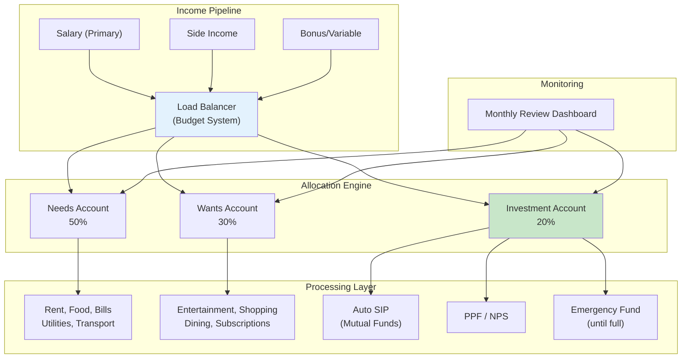
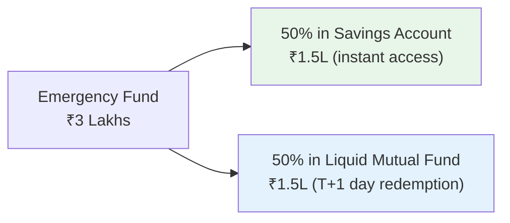
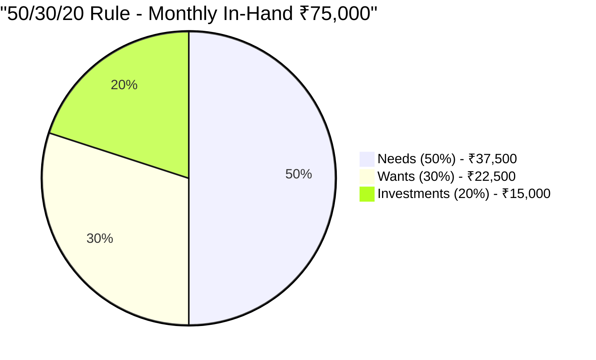
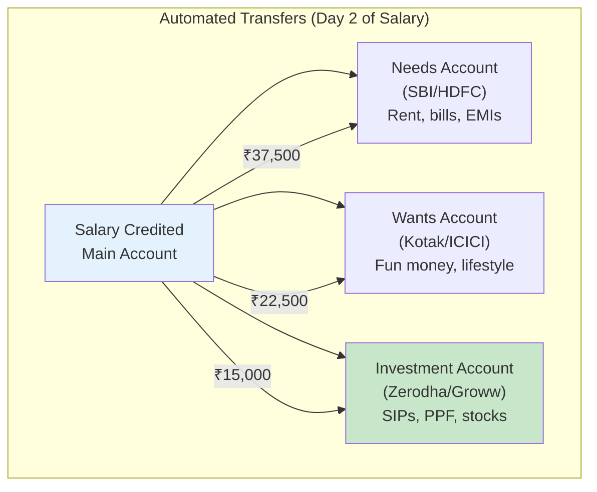
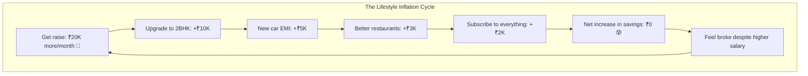
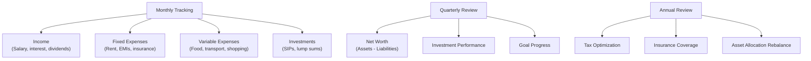
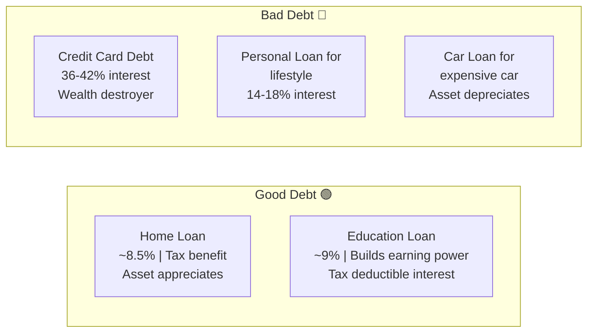
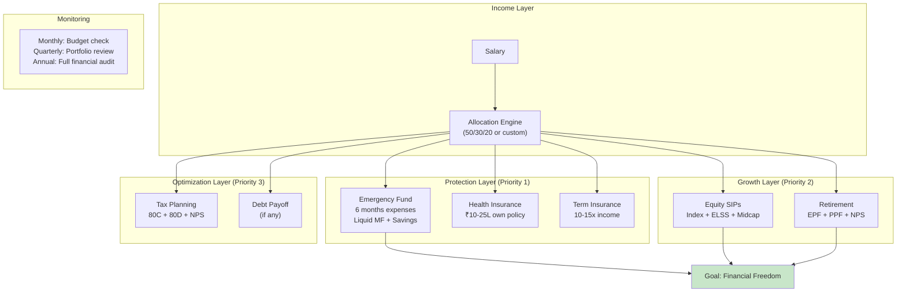

# Section 8 — Personal Finance Systems for Engineers

> *"Your financial system needs fault tolerance, load balancing, and auto-scaling. Right now, most of you are running a single-server setup with no backups and no monitoring."*

---

## Finance as System Design

You wouldn't deploy an application without:
- Multiple servers (redundancy)
- Health checks (monitoring)
- Auto-scaling (growth)
- Disaster recovery (backups)
- Rate limiting (spending controls)

So why is your financial life running on a single savings account with zero automation and no dashboard?

Let's design a **production-grade personal finance system**.



---

## Step 1: The Emergency Fund (Disaster Recovery)

Before ANYTHING else — before SIPs, before stocks, before that new PS5 — **build an emergency fund.**

### What Is It?

A pool of money that covers 6 months of essential expenses, sitting in a highly liquid, easily accessible place.

### Why You ABSOLUTELY Need It

```
Without Emergency Fund:
  Job loss → Panic → Break FDs → Sell investments at loss
           → Borrow from friends → Credit card debt spiral

With Emergency Fund:
  Job loss → Use emergency fund → 6 months of runway
           → Find new job calmly → Career continues normally
```

Tech layoffs are real. 2023-2024 saw massive layoffs across companies. Engineers who had emergency funds navigated it. Those who didn't? Nightmare mode.

### How Much?

```
Calculate your ESSENTIAL monthly expenses:
━━━━━━━━━━━━━━━━━━━━━━━━━━━━━━━━━━━
Rent:                ₹20,000
Food & groceries:    ₹8,000
Utilities & bills:   ₹3,000
Transport:           ₹3,000
Insurance premiums:  ₹2,000
Loan EMIs:           ₹5,000 (if any)
━━━━━━━━━━━━━━━━━━━━━━━━━━━━━━━━━━━
Monthly essential:   ₹41,000

Emergency Fund Target: ₹41,000 × 6 = ₹2,46,000

Round up: ₹2.5 - 3 Lakhs
```

### Where to Keep It



- **NOT in FDs** (penalty for premature withdrawal, slow access)
- **NOT in stocks/equity MF** (can be down 30% when you need it)
- **NOT under your mattress** (inflation + theft + your mom might find it)

**Savings account** for instant access + **Liquid mutual fund** for slightly better returns while maintaining liquidity.

### How to Build It

If you can save ₹15,000/month, your emergency fund takes **5-6 months** to build. Make it your #1 priority.

```
Month 1-6: Build emergency fund (₹15K/month)
Month 7+:  Emergency fund DONE. Redirect ₹15K to investments.
```

---

## Step 2: The Budget System (Rate Limiting)

Budgeting sounds boring. Think of it as **rate limiting** — you're setting boundaries on how fast money flows out of your system.

### The 50/30/20 Rule

The simplest, most effective budgeting framework:



| Category | % | What Goes Here | Monthly (₹75K) |
|----------|---|---------------|-----------------|
| **Needs** | 50% | Rent, food, utilities, transport, EMIs, insurance | ₹37,500 |
| **Wants** | 30% | Entertainment, dining out, shopping, subscriptions, hobbies | ₹22,500 |
| **Investments** | 20% | SIPs, PPF, NPS, emergency fund top-up | ₹15,000 |

### The Engineer's Enhanced Rules

The 50/30/20 is a starting point. As your salary grows, evolve it:

**Fresh graduate (₹40K in-hand):**
```
Needs:        60% (₹24,000) — rent is expensive when you're starting
Wants:        20% (₹8,000)  — sorry, limited Swiggy budget
Investments:  20% (₹8,000)  — non-negotiable minimum
```

**2-3 years experience (₹80K in-hand):**
```
Needs:        45% (₹36,000)
Wants:        25% (₹20,000)
Investments:  30% (₹24,000)  — scale up investment %
```

**5+ years experience (₹1.5L in-hand):**
```
Needs:        35% (₹52,500)  — needs don't scale linearly with salary
Wants:        25% (₹37,500)
Investments:  40% (₹60,000)  — this is where wealth happens
```

**The key insight:** As your salary grows, your needs shouldn't grow proportionally. Your rent might go from ₹15K to ₹25K (1.7x), but your salary might go from ₹50K to ₹1.5L (3x). The difference should flow to investments, not lifestyle inflation.

---

## Step 3: The Multi-Account Architecture

Don't run your entire financial life from one savings account. That's like running your database, cache, and web server on the same machine.

### The 3-Account System



**How it works:**

1. **Day 1:** Salary hits main account
2. **Day 2:** Auto-transfers fire:
   - Investment SIPs deduct automatically
   - Transfer fun money to wants account
   - Remaining stays for needs
3. **Day 3-30:** Spend from needs and wants only
4. **End of month:** Wants account has ₹0? No more shopping. Simple.

**The "Wants" account acts as a natural spending limit.** When it's empty, you stop spending on non-essentials. No willpower required — just math.

### Implementation Guide

1. Open a second savings account (any bank, zero balance accounts are fine)
2. Set up standing instructions for auto-transfer on salary date + 1
3. Set up SIPs to deduct from main account on salary date + 2
4. Use the second account card for all discretionary spending
5. Delete UPI app from the wants-account to reduce impulse spending

---

## Step 4: Avoiding Lifestyle Inflation (Memory Leaks)

Lifestyle inflation is the financial equivalent of a **memory leak** — you don't notice it happening, but over time it consumes all your resources.



### The Rule: Invest the Raise First

When you get a raise:

```
Raise: ₹20,000/month increase

WRONG approach:
  "Now I can afford a nicer apartment!" → All ₹20K absorbed

RIGHT approach:
  50% of raise → Increase SIP (₹10,000 more/month)
  25% of raise → Upgrade one thing (₹5,000)
  25% of raise → Increased needs buffer (₹5,000)
```

If you invest 50% of every raise, your investment portfolio grows at an accelerating rate while you still enjoy some lifestyle upgrades. This is **step-up SIP** — most platforms support automatically increasing your SIP amount annually.

---

## Step 5: The Salary Day Automation Script

Here's the exact sequence that should run on EVERY salary day:

```
SALARY_DAY_AUTOMATION:
━━━━━━━━━━━━━━━━━━━━━━━━━━━━━━━━━━━━━━━━━━━━━━━━

Day 1: Salary credited to Account A

Day 2 (Automated):
  ├── SIP #1: ₹5,000 → Nifty 50 Index Fund       ← AUTO
  ├── SIP #2: ₹3,000 → ELSS Fund                  ← AUTO
  ├── SIP #3: ₹3,000 → Midcap Index Fund           ← AUTO
  ├── SIP #4: ₹4,000 → NPS (80CCD)                ← AUTO
  ├── Transfer: ₹12,500 → PPF                      ← AUTO (monthly)
  └── Transfer: ₹20,000 → Wants Account            ← AUTO

Day 3: Standing Instructions
  ├── Rent: ₹20,000 → Landlord                    ← AUTO
  ├── Insurance: ₹2,000 → Policy                  ← AUTO
  └── Utilities: ₹3,000 → Bills                   ← AUTO

Day 4-30: 
  ├── Spend from Needs account for essentials
  └── Spend from Wants account for fun

Day 30: Review
  ├── Check: Wants account balance? (Should be near ₹0)
  ├── Check: Any unexpected expenses?
  └── Note: Anything to adjust next month?
```

**The beauty of this system:** You invest BEFORE you spend. Most people spend first, then "save what's left" (which is usually nothing). Invert the order.

> **"Pay yourself first"** — the single most important rule in personal finance.

---

## Step 6: Expense Tracking (Monitoring & Observability)

You can't optimize what you can't measure. Set up monitoring for your finances.

### Tools

| Tool | Best For | Cost |
|------|----------|------|
| **Walnut / MoneyView** | Auto-tracking SMS-based expenses | Free |
| **YNAB** | Zero-based budgeting (gold standard) | ₹1,000/month |
| **Google Sheets** | Custom tracking, full control | Free |
| **Excel template** | Offline, private | Free |
| **Notion** | Visual dashboards, notes | Free tier works |

### What to Track



### The Minimum Viable Tracking

If you don't want to track every chai:

```
Monthly check (5 minutes):
1. How much was credited? (Salary + any other income)
2. How much was invested? (SIPs + PPF + NPS)
3. What's my bank balance? (Should be reasonable, not zero)
4. Any unexpected large expenses?

That's it. 4 data points. 5 minutes. Monthly.
```

---

## Step 7: Debt Management (Avoiding System Crashes)

Not all debt is bad, but unmanaged debt is a guaranteed system crash.

### Good Debt vs Bad Debt



### The Debt Payoff Priority

If you have multiple debts, pay them off in this order:

```
Priority 1: Credit card debt (36-42% interest) ← EMERGENCY
Priority 2: Personal loans (14-18% interest)
Priority 3: Car loans (9-12% interest)
Priority 4: Education loans (9-10%, but tax deductible)
Priority 5: Home loans (8-9%, tax deductible, asset backed)
```

**The math is simple:** Why invest at 12% returns while paying 36% on credit card debt? Pay off high-interest debt FIRST. Then invest.

---

## Step 8: Insurance (Disaster Recovery Plans)

Insurance isn't an investment. It's a **disaster recovery plan**. You hope you never need it, but when you do, it saves everything.

### Must-Have Insurance

| Type | What It Covers | Recommended Coverage | Monthly Cost |
|------|---------------|---------------------|--------------|
| **Health Insurance** | Hospitalization, surgery, critical illness | ₹10-25 lakhs (individual, beyond company's group policy) | ₹500-₹1,500 |
| **Term Life Insurance** | Death benefit to family | 10-15x annual income | ₹500-₹1,000 |

### Must-NOT-Have "Insurance"

| Type | Why Avoid |
|------|-----------|
| **Endowment policies** | Returns of 4-6%, worst of both worlds |
| **ULIPs** | High charges, complicated, poor returns |
| **Money-back policies** | Terrible returns, false sense of security |
| **Insurance as investment** | NEVER mix insurance and investing |

```
Insurance: Protection product. Buy term insurance.
Investment: Growth product. Buy mutual funds.
NEVER combine them. Never.

It's like combining your database and your web server.
They have different jobs. Keep them separate.
```

### Health Insurance: Why Your Company's Isn't Enough

```
Company group health insurance:
  ✅ Active while you're employed
  ❌ Ends the day you resign/get laid off
  ❌ Coverage may be ₹3-5L (one surgery can exceed this)
  ❌ May not cover parents
  ❌ No claim bonus (your loyalty doesn't count)

YOUR OWN health insurance:
  ✅ Stays with you for life
  ✅ You choose coverage amount
  ✅ Can cover parents
  ✅ Builds no-claim bonus over years
  ✅ Tax deduction under 80D
```

**Get your own health insurance policy by age 25, latest.** Premiums are lowest when you're young and healthy. A ₹10L policy for a 25-year-old costs ₹500-700/month. At 35, the same policy costs double. At 40 with pre-existing conditions? Good luck.

---

## The Complete System Architecture



---

## Priority Order: What to Set Up First

```
Week 1:  Open a second bank account. Set up auto-transfers.
Week 2:  Start building emergency fund (even ₹5K/month)
Week 3:  Buy health insurance (your own policy)
Week 4:  Start 1 SIP — Nifty 50 Index Fund (even ₹1,000)

Month 2: Add ELSS SIP for tax saving
Month 3: Start PPF contributions
Month 4: Review and increase SIP amounts
Month 6: Emergency fund should be partially built

Year 1:  Full system operational. All automation running.
         Emergency fund complete. Multiple SIPs active.
         You're ahead of 90% of engineers your age.
```

---

## Key Takeaways

```
✅ Build emergency fund FIRST — 6 months of expenses
✅ Use the 50/30/20 rule as a starting framework
✅ Set up multiple bank accounts for needs/wants/invest
✅ AUTOMATE everything — SIPs, transfers, bills
✅ Pay yourself first — invest before you spend
✅ Track expenses monthly (even minimally)
✅ Pay off high-interest debt before investing
✅ Buy your OWN health insurance — company's isn't enough
✅ Insurance = protection, Investment = growth. Never mix.
✅ Invest 50% of every raise before upgrading lifestyle
✅ Review finances monthly (5 min), quarterly (30 min), annually (2 hours)
```

---

**Next up:** [Section 9 — Retirement Planning (Even If You're 22)](../09-retirement-planning/README.md) — where we prove that starting to invest at 22 vs 32 is the difference between ₹5 crores and ₹82 lakhs, and why your 22-year-old self should send a thank-you note to future you.
