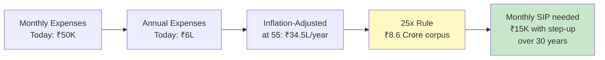
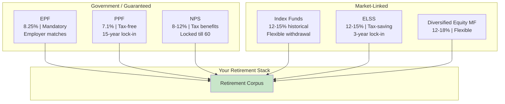
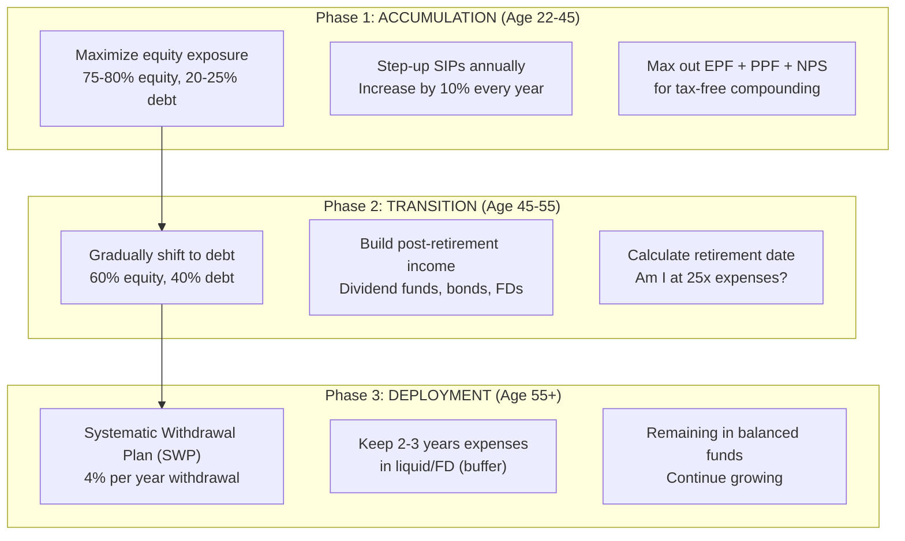

# Section 9 — Retirement Planning (Even If You're 22)

> *"Retirement planning at 22 feels like writing tests for a feature that hasn't shipped yet. But when production breaks at 55, you'll be glad you wrote them."*

---

## Why You Should Care About Retirement NOW

"Bro, I'm 23. I just started working. Retirement is literally 35-40 years away. Why would I think about it now?"

Because of one word: **compounding**.

Remember the Rule of 72 from Section 2? Money doubles every 6 years at 12% returns. That means:

```
₹1 lakh invested at age 22 becomes:
  Age 28: ₹2 lakhs    (1 doubling)
  Age 34: ₹4 lakhs    (2 doublings)
  Age 40: ₹8 lakhs    (3 doublings)
  Age 46: ₹16 lakhs   (4 doublings)
  Age 52: ₹32 lakhs   (5 doublings)
  Age 58: ₹64 lakhs   (6 doublings)

₹1 lakh invested at age 32 becomes:
  Age 58: ₹16 lakhs   (only 4 doublings)

DIFFERENCE: ₹48 LAKHS. Just from starting 10 years earlier.
With the SAME investment. In the SAME fund.
```

Time is the exploit. Compounding is the hack. Starting early is the cheat code.

---

## The Tale of Two Engineers

Let's watch this play out with a realistic scenario:

### Riya: Starts at 22

```
Age 22-55: Invests ₹15,000/month (increases 10% annually)
Total invested over 33 years: ₹1,07,30,400 (~₹1.07 crore)
```

### Arjun: Starts at 30

```
Age 30-55: Invests ₹15,000/month (increases 10% annually)
Total invested over 25 years: ₹63,52,956 (~₹63.5 lakhs)
```

Both invest in index funds averaging 12% per year.

```mermaid
graph TD
    subgraph "Riya (Started at 22)"
        R1["Age 22: Starts ₹15K/month"] --> R2["Age 30: Portfolio ₹30L"]
        R2 --> R3["Age 40: Portfolio ₹1.8 Cr"]
        R3 --> R4["Age 50: Portfolio ₹7.5 Cr"]
        R4 --> R5["Age 55: Portfolio ₹14.8 Cr 🎉"]
    end
    
    subgraph "Arjun (Started at 30)"
        A1["Age 22-29: 'I'll start later'"] --> A2["Age 30: Starts ₹15K/month"]
        A2 --> A3["Age 40: Portfolio ₹52L"]
        A3 --> A4["Age 50: Portfolio ₹2.8 Cr"]
        A4 --> A5["Age 55: Portfolio ₹5.8 Cr 😐"]
    end
    
    style R5 fill:#c8e6c9
    style A5 fill:#fff9c4
```



| | Riya (22 start) | Arjun (30 start) |
|---|---|---|
| **Total invested** | ₹1.07 Cr | ₹63.5 L |
| **Portfolio at 55** | **₹14.8 Cr** | **₹5.8 Cr** |
| **Extra invested** | ₹43.8 L | — |
| **Extra wealth** | **₹9 Crores** | — |

Riya invested ₹43.8 lakhs more (over 8 extra years), but gained **₹9 CRORES** more. That's a **20x return** on the extra investment, purely from time.

This is not hypothetical. This is math. This is what compounding does over decades.

---

## How Much Do You Need for Retirement?

### The 25x Rule

A common retirement rule: **You need 25 times your annual expenses to retire.**

Why 25x? Because if you withdraw 4% per year from your portfolio (the "4% rule"), and your investments grow at 7-8% after inflation, your money lasts indefinitely.

```
Current monthly expenses: ₹50,000
Annual expenses: ₹6,00,000
Inflation-adjusted expenses at 55 (30 years, 6% inflation): ₹34,47,000/year

Retirement corpus needed: ₹34,47,000 × 25 = ₹8.6 Crores
```

Wait — ₹8.6 crores? That sounds insane!

It's not as scary as it looks, because compounding works in your favor. A ₹15,000/month SIP (with 10% annual step-up) over 30 years at 12% return gives you ₹10+ crores. Totally achievable.



### Are Your Existing Retirement Instruments Enough?

Let's check:

```
EPF (assuming ₹50K basic, 30-year career):
├── Your contribution: ₹6,000/month
├── Employer contribution: ₹6,000/month
├── Growth rate: 8.25%
└── Value at 55: ~₹2.0 Crores ✅

PPF (₹1.5L/year for 30 years):
├── Contribution: ₹12,500/month
├── Growth rate: 7.1% (tax-free)
└── Value at 55: ~₹1.5 Crores ✅

Just EPF + PPF: ~₹3.5 Crores
Target: ₹8.6 Crores
Gap: ₹5.1 Crores ← Need EQUITY investments for this
```

EPF and PPF alone get you less than halfway. You NEED equity investments (mutual funds, index funds) to bridge the gap.

---

## Retirement Investment Vehicles in India



### NPS (National Pension System) — Deep Dive

NPS is often overlooked by engineers. Here's why you should consider it:

**What it is:** A government-backed pension scheme that invests in equity, government bonds, and corporate bonds.

**Two types of accounts:**
- **Tier 1:** Retirement account (locked till 60, tax benefits)
- **Tier 2:** Voluntary savings (no lock-in, no extra tax benefits)

**Tax benefits:**
- ₹1.5L under 80C (shared with other 80C instruments)
- ₹50,000 ADDITIONAL under 80CCD(1B) — **exclusive to NPS**
- Employer contribution up to 14% of basic (deductible under 80CCD(2))

**Returns:** 8-12% depending on allocation (you choose equity vs debt %)

**The catch:** 60% of corpus can be withdrawn lump-sum at 60 (tax-free). Remaining 40% MUST be used to buy an annuity (regular pension income) — which has mediocre returns.

**Verdict:** NPS is great for the **₹50,000 additional tax deduction** under 80CCD(1B) in the Old Regime. Beyond that, index funds offer better flexibility and similar/better returns.

```
NPS Strategy:
Invest ₹50,000/year (₹4,200/month) in NPS Tier 1
Choose "Aggressive" allocation (75% equity)
Claim 80CCD(1B) deduction

Tax saved (30% slab): ₹50,000 × 30% × 1.04 = ₹15,600/year
Over 30 years: ₹4.68 lakhs saved in taxes alone
```

---

## The Retirement Timeline



### The FIRE Movement for Indian Engineers

**FIRE = Financial Independence, Retire Early**

Some engineers aim to retire at 40-45 instead of 55-60. The math:

```
If your annual expenses are ₹12L (₹1L/month):
  FIRE corpus needed: 25 × ₹12L = ₹3 Crore

If you earn ₹25 LPA in-hand and save 50%:
  Annual savings: ₹12.5L
  With 12% returns: ~₹3 Crore in 12-13 years

Start at 23 → FIRE at 35-36!
```

FIRE is aggressive and requires:
- Very high savings rate (40-60%)
- Disciplined lifestyle
- Consistent investment
- Low-cost lifestyle or location independence

It's not for everyone, but knowing the math is empowering.

---

## Common Retirement Planning Mistakes

### Mistake 1: "My EPF Is Enough"

EPF alone, assuming ₹50K basic salary growing at 10% annually over 30 years ≈ ₹2 Cr. Your inflation-adjusted expenses at 55? ₹30-40L per year. EPF covers 5-7 years of retirement. You need 25-30 years of coverage.

### Mistake 2: "I'll Figure It Out When I'm 40"

Starting at 40 vs 22 = needing 3-4x the monthly investment for the same corpus.

```
To reach ₹5 Crore by age 55 at 12% returns:
  Start at 22: ₹8,000/month  (33 years)
  Start at 30: ₹18,000/month (25 years)
  Start at 35: ₹32,000/month (20 years)
  Start at 40: ₹60,000/month (15 years)

The ₹8,000/month at 22 = ₹60,000/month at 40.
Procrastination is obscenely expensive.
```

### Mistake 3: "Real Estate Is My Retirement Plan"

Buying a house to live in is not an investment — it's an expense. You can't sell your primary residence to fund retirement.

Investment property? The math often doesn't work in Indian metros:
- Property cost: ₹80L-₹1.5Cr
- Rental yield: 2-3% per year (₹1.6L-₹4.5L/year)
- Index fund returns: 12-15% per year on the same capital

₹1 Crore in property → ₹2.5L/year rent.
₹1 Crore in index fund → ₹12-15L/year growth.

Real estate makes sense sometimes, but it's rarely the optimal retirement strategy.

### Mistake 4: Withdrawing PF on Job Change

Every time you change jobs, you get the option to withdraw PF. **DON'T.**

```
Withdrawing ₹5 lakh PF at age 28:
  → You get ₹5 lakh now (minus ~₹1.5L tax = ₹3.5L real value)
  
Keeping ₹5 lakh in PF at 8.25% till age 55:
  → Grows to ₹45 lakhs (tax-free!)

You're giving up ₹41.5 LAKHS for ₹3.5 LAKHS.
That's a 12x trade in the wrong direction.
```

Transfer your PF to the new employer. Always. No exceptions.

---

## 🇯🇵 Japan Comparison: Retirement

| Aspect | India | Japan |
|--------|-------|-------|
| **Retirement age** | 58-60 (typical for private-sector) | 60-65 (being raised to 70) |
| **Government pension** | EPF/EPS (limited pension) | Comprehensive national pension (国民年金) + employee pension (厚生年金) |
| **Pension adequacy** | Low — need significant self-planning | Moderate — government pension covers 40-50% of pre-retirement income |
| **Post-retirement work** | Common due to financial need | Very common, often as part-time or contract |
| **Healthcare in retirement** | Out of pocket unless insured | Universal healthcare (covers everyone) |
| **Cultural expectation** | Children expected to support parents | Less expectation, but elderly care is a major concern |
| **Retirement savings vehicles** | EPF, PPF, NPS, MF | iDeCo (defined contribution pension), NISA |

Japan's **iDeCo** (individual-type Defined Contribution pension plan) is similar to India's NPS — you get tax deductions on contributions, and the money is locked until retirement (age 60). Japan's system provides a more comprehensive safety net, but the declining population and aging society put enormous pressure on the system.

In India, the government pension covers very little for private-sector employees. **You are essentially your own pension manager.** This is both scary and empowering — scary because there's no safety net, empowering because you have access to investment vehicles that can generate 12%+ returns (Japan's options typically yield 5-7%).

---

## Your Retirement Planning Action Items

### If You're 22-25:

```
☐ Ensure EPF is set up and don't withdraw on job changes
☐ Start a ₹5,000-₹10,000/month SIP in index funds
☐ Open a PPF account and start contributing
☐ Set up step-up SIP (10% annual increase)
☐ Forget about these investments for 30 years
```

### If You're 26-30:

```
☐ All of above, plus:
☐ Calculate your current net worth
☐ Increase SIP amounts to 20-30% of in-hand
☐ Consider NPS for additional tax benefits
☐ Start thinking about term insurance (especially if married)
```

### If You're 30+:

```
☐ All of above, plus:
☐ Calculate your retirement corpus target (25x expenses)
☐ Check if you're on track (use an SIP calculator)
☐ Increase SIP aggressively to make up for lost time
☐ Seriously evaluate your asset allocation
☐ Don't panic — starting now is still WAY better than starting at 40
```

---

## Key Takeaways

```
✅ Starting at 22 vs 32 can mean 3-5x more wealth at retirement
✅ EPF + PPF alone won't fund your retirement — add equity SIPs
✅ You need 25x your annual expenses (inflation-adjusted) to retire
✅ NEVER withdraw PF on job change — always transfer
✅ NPS gives an extra ₹50K tax deduction (80CCD)
✅ Increase SIP by 10% every year (step-up SIP)
✅ Real estate is NOT a retirement plan (it's where you live)
✅ The FIRE path is possible for high-earning engineers (retire by 35-45)
✅ Japan has better government pension; India has better investment returns
✅ The best time to start retirement planning was yesterday
✅ Procrastination is the most expensive habit in finance
```

---

**Next up:** [Section 10 — Financial Red Flags Developers Should Avoid](../10-financial-red-flags/README.md) — where we explain why that crypto influencer, your aunt's insurance advisor, and the guy selling "guaranteed 20% returns" are all trying to take your money.
