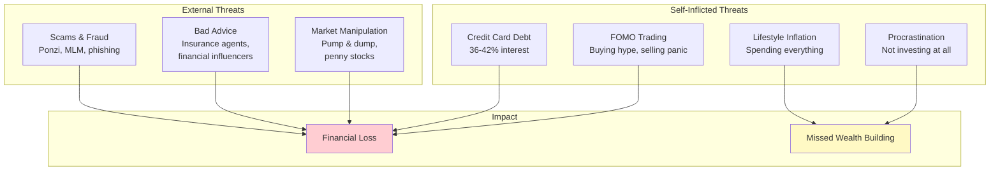
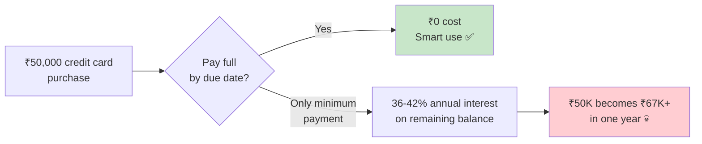
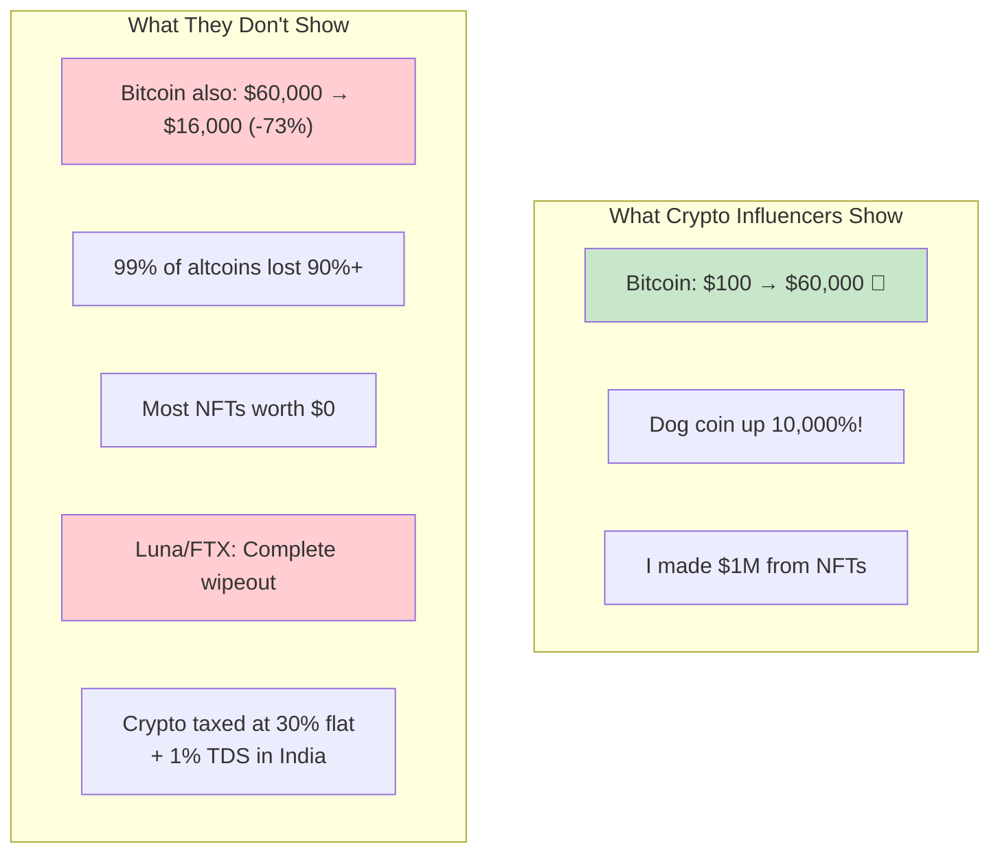
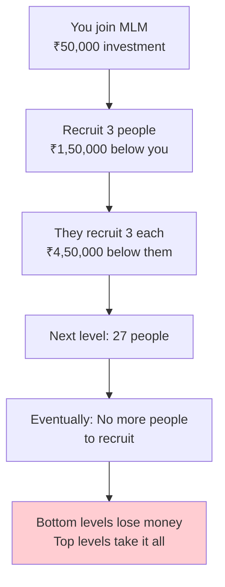
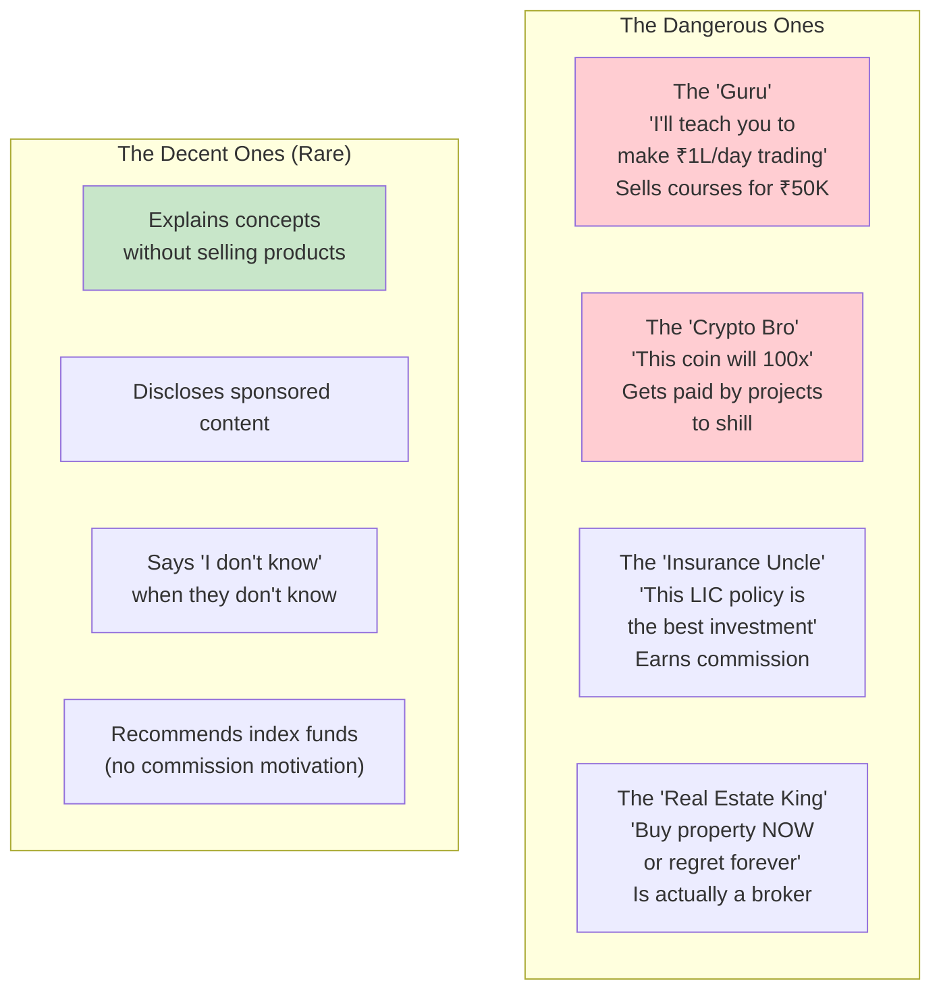
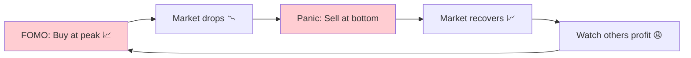

# Section 10 — Financial Red Flags Developers Should Avoid

> *"In software, we have antivirus and firewalls. In finance, your only protection is knowledge and skepticism."*

---

## The Financial Threat Model

Engineers deal with threat modeling in security. Let's apply the same concept to your finances.



Let's examine each threat in detail.

---

## 🔴 Red Flag #1: Credit Card Debt

Credit cards are the **SQL injection of personal finance** — they seem harmless, but one moment of carelessness can wreck everything.

### How Credit Cards Work

```
Purchase: ₹50,000 on credit card
Payment due: 45 days later (billing cycle + grace period)

If you pay FULL amount by due date:
  → Cost: ₹0 (free credit for 45 days ✅)

If you pay MINIMUM amount (5%):
  → You pay ₹2,500
  → Remaining ₹47,500 accrues interest at 36-42% PER YEAR
  → That's 3-3.5% PER MONTH
  → After 1 month: ₹47,500 + ₹1,425 = ₹48,925 owed
  → After 6 months: ₹57,000+ owed
  → After 1 year: ₹67,000+ owed (on a ₹50,000 purchase!)
```



### The Credit Card Rules

```
✅ DO: Use credit cards for cashback/rewards
✅ DO: Pay FULL balance every month (set up autopay)
✅ DO: Track spending (card statements are great expense records)

❌ DON'T: Carry a balance EVER
❌ DON'T: Use credit cards for EMI purchases (unless 0% EMI)
❌ DON'T: Have more than 2-3 cards (tracking gets messy)
❌ DON'T: See credit limit as "available money" (it's debt capacity)
```

**If you currently have credit card debt:** STOP everything else. Don't invest. Don't buy things. Pay off the credit card first. No investment gives 36%+ guaranteed returns, but credit card debt COSTS you 36%+.

---

## 🔴 Red Flag #2: Blindly Trading Stocks

There's a difference between **investing** and **trading**:

| | Investing | Trading |
|---|---|---|
| **Timeframe** | Years to decades | Minutes to weeks |
| **Research** | Company fundamentals | Charts, patterns, "tips" |
| **Goal** | Wealth building | Quick profit |
| **Who wins** | Patient people | Mostly brokers (from commissions) |
| **Success rate** | ~12-15% average annual returns | 90% of traders LOSE money |

```
SEBI (2023 study) found that:
• 93% of F&O traders made NET LOSSES
• The average individual trader LOST ₹1.1 lakhs per year
• Only ~1% of traders consistently made profits

Meanwhile, a boring SIP in Nifty 50 returned 12-15% annually.
```

### The Trading Red Flags

```
🚩 "I got a hot tip about XYZ stock" (insider info is illegal, random tips are garbage)
🚩 "This stock will double in 3 months" (nobody knows this)
🚩 "I made ₹2L last week from trading!" (they won't mention the ₹5L they lost last month)
🚩 "Day trading is my side hustle" (day trading is a full-time job that usually pays negative)
🚩 "F&O is easy money" (easiest way to lose your shirt)
```

### The Zerodha/Angel One Warning Pop-Ups Exist for a Reason

When you open a trading app and see warnings like:

> *"9 out of 10 individual traders incur net losses in derivatives"*

That's not decoration. That's a legally mandated warning because **real data** shows most traders lose money.

Think of options trading like this: you're playing poker against professional hedge fund algorithms running on GPUs. You're the fish at the table. The house always wins.

---

## 🔴 Red Flag #3: Crypto Hype Cycles

Crypto is the ultimate FOMO trap for tech engineers because:
1. It sounds technical (blockchain! decentralization! web3!)
2. It appeals to our contrarian tendencies ("banks are outdated")
3. The gains can be insane (and so can the losses)
4. Everyone on Twitter seems to be getting rich from it

### The Crypto Reality Check



### Crypto in India: The Tax Reality

From FY 2022-23, India taxes crypto profits at:
- **30% flat tax** (no deductions, no set-off against losses)
- **1% TDS** on every transaction
- **Losses can't be offset** against other gains

```
Buy crypto for ₹1,00,000
Sell for ₹1,50,000
Profit: ₹50,000

Tax: 30% of ₹50,000 = ₹15,000
TDS: 1% of ₹1,50,000 = ₹1,500
Net profit after tax: ₹33,500

But if crypto goes DOWN:
Buy for ₹1,00,000
Sell for ₹60,000
Loss: ₹40,000

Can you set off this loss against stock gains? NO.
Can you carry forward this loss? NO.
Still paid 1% TDS: ₹600

The tax structure makes it VERY unfriendly for casual crypto traders.
```

### The Sensible Crypto Position

**If you want crypto exposure:**
- Limit to 2-5% of total portfolio. Not more.
- Only Bitcoin and Ethereum (the "large caps" of crypto)
- Treat it as HIGH RISK speculation, not investment
- Only use money you can 100% afford to lose
- Don't chase altcoins, meme coins, or NFTs

**If crypto goes to zero, your financial plan should still work perfectly.** If that's not true, you have too much in crypto.

---

## 🔴 Red Flag #4: MLM / Network Marketing Schemes

"Hey bro, I have an amazing business opportunity. It's not a pyramid scheme, it's a *reverse funnel system*."

```
MLM Pitch:
"Invest ₹50,000, recruit 3 people, each recruits 3 more,
 and you'll earn ₹5,00,000 passive income!"

Math check:
Level 1: 3 people
Level 2: 9 people  
Level 3: 27 people
Level 4: 81 people
...
Level 13: 1,594,323 people
Level 20: 3.5 BILLION people (half the world's population)

It's mathematically impossible for everyone to profit.
The bottom 90% subsidize the top 10%.
That's a pyramid. With extra steps.
```



### MLM Red Flags Checklist

```
🚩 You need to "invest" money to join
🚩 Income comes from recruiting, not selling products
🚩 Products are overpriced (nobody buys them without the "opportunity")
🚩 "Passive income" is mentioned repeatedly
🚩 Meetings use high-pressure, emotional tactics
🚩 They target friends and family for recruitment
🚩 The person pitching drives a rented BMW to the meeting
🚩 "It's not MLM, it's direct selling / network marketing / social commerce"
    (It's MLM. With better branding.)
```

If someone from your college batch suddenly messages you after 3 years with "Hey! Long time! I have an exciting opportunity..." — RUN.

---

## 🔴 Red Flag #5: Financial Influencers Selling Dreams

The rise of FinFluencers (financial influencers) on YouTube, Instagram, and Twitter has created a new category of financial misinformation.

### Types of Dangerous FinFluencers



### How to Identify Bad Financial Advice

| Red Flag | What It Means |
|----------|---------------|
| "Guaranteed returns of X%" | Nothing is guaranteed in investing (except FD/PPF rates) |
| "I made ₹X lakhs in Y days" | Survivorship bias. What about their losses? |
| "Limited time offer!" | Urgency = manipulation |
| "Everyone is making money from this" | FOMO bait |
| "This course will change your life" | Their revenue model IS the course, not investing |
| "Secret strategy / hidden technique" | There are no secrets. Finance is well-documented. |
| No disclosure of conflicts of interest | They're probably getting paid to promote |

### The Influencer Business Model

```
The FinFluencer Funnel:
1. Post "I made ₹10L from trading!" reels (cherry-picked results)
2. Build audience of aspiring traders (millions of views)
3. Sell "masterclass" course for ₹5,000-₹50,000
4. 1000 people buy = ₹50L-₹5Cr revenue
5. Students lose money trading, but the influencer already got paid

The influencer's real income: Courses and sponsorships
NOT from actual trading.
```

**If someone is truly great at trading/investing, why would they sell a ₹5,000 course?**

Warren Buffett doesn't sell courses. He just invests.

---

## 🔴 Red Flag #6: "Guaranteed High Returns" Schemes

Any time you hear "guaranteed" and "high returns" in the same sentence, your scam radar should be at maximum.

```
Legitimate Returns:
  FD:          6-7%  (guaranteed by bank)
  PPF:         7.1%  (guaranteed by government)
  G-Sec bonds: 7-8%  (guaranteed by government)

Typical Market Returns (not guaranteed):
  Index funds: 12-15% (historical average, can be negative in some years)
  Equity MF:   12-18% (historical, varies widely)

SCAM Returns:
  "Invest ₹1L, get ₹2L in 6 months!" (100% return = SCAM)
  "Guaranteed 2% monthly returns!" (24% guaranteed? SCAM)
  "Our AI trading bot makes 30% per year guaranteed!" (SCAM)
```

### Famous Indian Financial Scams

| Scam | What Happened | Victims |
|------|--------------|---------|
| **Saradha Group** | Ponzi scheme promising high returns on "chit funds" | Millions in West Bengal |
| **Rose Valley** | Real estate ponzi, ₹17,520 Cr collected | 17 million investors |
| **Sahara India** | Sold bonds to 30 million people, couldn't repay | 30 million |
| **PACL (Pearls)** | Promised agricultural land, was a ponzi | 5.5 crore investors |

These weren't small-time scams. They affected MILLIONS. All promised "high guaranteed returns."

---

## 🔴 Red Flag #7: FOMO Investing

Fear Of Missing Out is the engineer's kryptonite.

```
The FOMO Cycle:
━━━━━━━━━━━━━━━━━━━━━━━━━━━━
1. Asset is doing well for months (stocks, crypto, gold)
2. Social media is full of "I made X from Y" posts
3. You feel left out. Everyone is getting rich except you.
4. You invest a large amount at the PEAK
5. Market corrects. You're now at a loss.
6. You panic and sell at the bottom.
7. Market recovers. You missed the recovery.
8. Repeat with the next hype cycle.
```



**The antidote:** Monthly SIPs. You invest the same amount regardless of market conditions. When markets are high, you buy less. When markets are low, you buy more. Over time, you average out at a great price. No FOMO needed. No timing needed.

---

## 🔴 Red Flag #8: EMI Culture for Depreciating Assets

"No-cost EMI" is marketing genius. It makes expensive purchases feel affordable.

```
"₹1,500/month for 18 months? That's nothing!"

But ₹1,500 × 18 = ₹27,000 for a phone that'll be worth ₹10,000 in 2 years.

If you invested ₹1,500/month instead: ₹27,000 + returns.
And you didn't buy something that depreciates to zero.
```

### What's Okay on EMI:
- ✅ Education (increases earning potential)
- ✅ Home loan (asset that may appreciate)
- ⚠️ Car (necessary in some cities, but it ALWAYS depreciates)

### What's NOT Okay on EMI:
- ❌ Latest iPhone (it's worth 40% less in 1 year)
- ❌ Expensive watch (it's not an "investment" unless you're buying a Patek Philippe)
- ❌ Furniture/appliances on personal loan (the interest is brutal)
- ❌ Vacation (you're literally paying interest on memories)

---

## The Financial Security Checklist

Run this checklist annually. If any item is a "No," fix it:

```
□ Emergency fund = 6 months expenses?
□ Zero credit card debt?
□ Own health insurance (not just company's)?
□ No active MLM/ponzi involvement?
□ SIPs running automatically every month?
□ Not trading with more than 5% of portfolio?
□ Crypto < 5% of total investments?
□ Not buying insurance as investment?
□ Not making financial decisions based on social media?
□ Filing ITR every year?
□ Know exactly where every ₹ of investment is?
□ No high-interest personal loans?
```

---

## Key Takeaways

```
✅ Credit card debt at 36-42% is a financial emergency — pay it off NOW
✅ 93% of F&O traders lose money. Don't be the 93%.
✅ Crypto: Max 2-5% of portfolio. Treat as speculation, not investment.
✅ If it sounds too good to be true, it's a scam. Always.
✅ MLM/network marketing is a pyramid scheme with better PR.
✅ FinFluencers make money from courses, not from investing.
✅ "Guaranteed high returns" = guaranteed scam.
✅ FOMO is the enemy. SIPs are the cure.
✅ EMI on depreciating assets = paying more for things worth less.
✅ Your brain is your best financial firewall.
✅ When in doubt, do the boring thing (index fund SIP).
```

---

**Next up:** [Section 11 — Building Long-Term Wealth](../11-building-wealth/README.md) — the final section where we bring everything together and talk about the endgame: financial freedom, making money work for you, and building wealth that outlasts your career.
