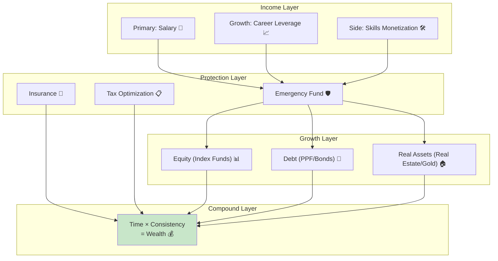
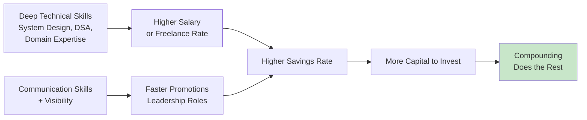
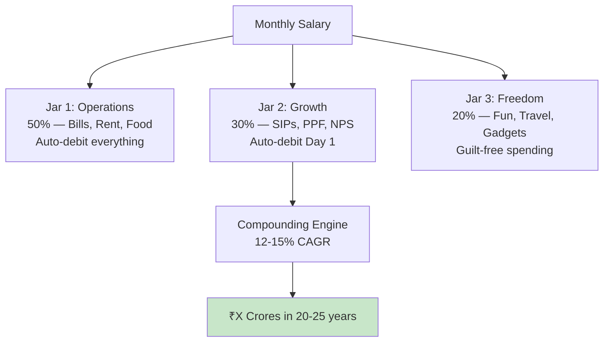
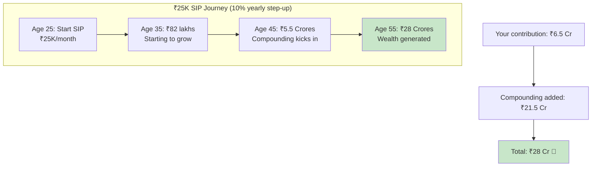
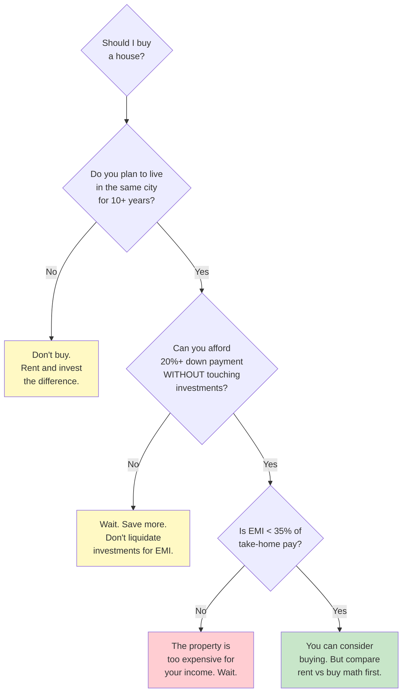
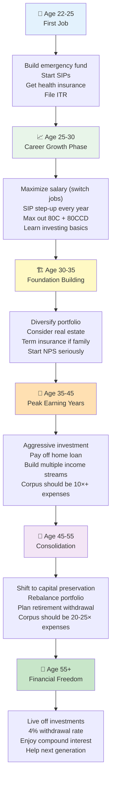

# Section 11 — Building Long-Term Wealth

> *"The best time to plant a tree was 20 years ago. The second best time is now. The same applies to your SIP."*

---

## The Wealth Architecture

Building wealth isn't about one big trade or one lucky stock pick. It's about **building systems that compound over decades**. Think of it as infrastructure engineering, not a hackathon.



---

## Phase 1: Income Maximization (The Foundation)

Before you can invest, you need income to invest. And for software engineers in India, your **salary is your greatest asset in the first decade**.

### Career Leverage: The Highest ROI Investment

```
Year 1-3 in tech: ₹6-15 LPA
Year 4-7 in tech: ₹15-40 LPA
Year 8-12 in tech: ₹30-80 LPA
Senior/Staff at FAANG: ₹60L-2Cr

The difference between a ₹15L and ₹40L salary:
That's ₹25L/year MORE to invest.
Over 10 years with compounding: ₹50L+ in wealth difference.

No SIP trick or tax hack gives you that kind of delta.
```

### The Skill-to-Income Pipeline



### How to Maximize Income as an Indian Engineer

| Strategy | Impact | Effort |
|----------|--------|--------|
| **Switch jobs every 2-3 years** | 30-60% salary hike on switch vs 8-12% annual increment | Medium |
| **Get good at System Design interviews** | Unlocks ₹30L+ roles | High |
| **Learn a high-demand niche** (ML, Platform, Infra) | Premium salaries | High |
| **Build public presence** (blog, open source, talks) | Career optionality, opportunities come to you | Medium |
| **Negotiate aggressively** | ₹2-5L+ on every offer | Low |
| **Consider remote roles for global companies** | 2-3× Indian market salaries | Medium |

**The software engineering career in India is the most powerful wealth-building tool available to middle-class Indians.** Respect it. Invest in it. Don't coast.

---

## Phase 2: The Savings Engine (Automate & Forget)

Once income is flowing, build a system that automatically routes money to the right places — just like a load balancer distributes traffic.

### The Automated Wealth Pipeline

```
Salary Day (auto-triggers):
━━━━━━━━━━━━━━━━━━━━━━━━━━━━━━━━━━━
│
├─→ Rent / Essentials (50%)        → Bills account (auto-debit)
│
├─→ SIP: Index Fund (15-20%)       → Auto-debit Day 1
│   ├─→ Nifty 50 Index Fund
│   ├─→ Nifty Next 50 Index Fund
│   └─→ International Fund (S&P 500)
│
├─→ PPF (₹12,500/month)           → Auto-transfer Day 5
│
├─→ NPS (₹4,167/month for 80CCD)  → Auto-transfer Day 5
│
├─→ Emergency Fund Top-up          → Until 6 months covered
│
└─→ Discretionary (remaining)      → Separate account
    (Travel, gadgets, lifestyle)
```

### The Three-Jar System (Advanced)



The key: **automate everything on Day 1 of salary credit**. If the money never hits your discretionary account, you never feel the pinch. You adapt to spending what's left, not what you earn.

---

## Phase 3: The Investment Strategy (By Career Stage)

### Stage 1: Early Career (22-30 years old)

```
Salary: ₹5-25 LPA
Risk: HIGH (you have time to recover)
Priority: GROWTH

Portfolio:
┌────────────────────────────────────┐
│  Equity Index Funds      : 60-70%  │  ← Nifty 50 + Nifty Next 50
│  International Equity    : 10-15%  │  ← S&P 500 / Nasdaq
│  PPF                     : 10-15%  │  ← Tax saving + guaranteed
│  Emergency Fund (Liquid) : 10%     │  ← Until 6 months built
│  Crypto/Speculation      : 0-5%    │  ← Only if you understand it
└────────────────────────────────────┘

Monthly SIP target: 20-30% of take-home pay
```

### Stage 2: Mid Career (30-40 years old)

```
Salary: ₹25-80 LPA
Risk: MEDIUM-HIGH (family responsibilities growing)
Priority: GROWTH + PROTECTION

Portfolio:
┌────────────────────────────────────┐
│  Equity Index Funds      : 50-60%  │
│  International Equity    : 10%     │
│  Debt Funds / PPF        : 15-20%  │
│  NPS                     : 10%     │
│  Real Estate             : 0-15%   │  ← Only if buying to live
│  Gold (SGB)              : 5%      │
└────────────────────────────────────┘

Monthly SIP target: 25-35% of take-home pay
Extra: Max out 80C (₹1.5L PPF) + 80CCD (₹50K NPS)
```

### Stage 3: Peak Career (40-50 years old)

```
Salary: ₹50L-2Cr+
Risk: MEDIUM (significant corpus to protect)
Priority: PROTECTION + GROWTH

Portfolio:
┌────────────────────────────────────┐
│  Equity Index Funds      : 40-50%  │
│  International Equity    : 10%     │
│  Debt/Bonds/PPF          : 20-25%  │
│  NPS                     : 10%     │
│  Real Estate (if owned)  : —       │
│  Gold/SGBs               : 5-10%   │
└────────────────────────────────────┘

Focus: Top-up existing investments + reduce debt exposure
Target: Retirement corpus should be 15-20× annual expenses
```

### Stage 4: Pre-Retirement (50-60 years old)

```
Priority: CAPITAL PRESERVATION

Portfolio:
┌────────────────────────────────────┐
│  Equity Index Funds      : 30-40%  │  ← Still need growth!
│  Debt/Bonds/FD           : 30-40%  │  ← Stability
│  PPF/EPF Accumulation    : —       │  ← Already built up
│  Gold/SGBs               : 10%     │
│  Cash/Liquid Funds       : 10-15%  │
└────────────────────────────────────┘

Critical: DO NOT go 100% debt/FD. You still need 30yrs of retirement.
Inflation will destroy pure FD portfolios.
```

---

## Phase 4: The Power of Consistency (Math That Should Change Your Life)

### Scenario: ₹25,000 SIP from Age 25

```
Monthly SIP: ₹25,000
Annual step-up: 10% (increase SIP as salary grows)
Expected return: 12% CAGR (Nifty long-term average)

Age 30:  ₹21.8 lakhs invested  →  ₹25 lakhs (↑14%)
Age 35:  ₹59 lakhs invested    →  ₹82 lakhs (↑39%)
Age 40:  ₹1.23 Cr invested     →  ₹2.25 Cr (↑83%)
Age 45:  ₹2.26 Cr invested     →  ₹5.5 Cr (↑143%)
Age 50:  ₹3.9 Cr invested      →  ₹12.5 Cr (↑220%)
Age 55:  ₹6.5 Cr invested      →  ₹28 Cr (↑330%)

Your invested amount: ₹6.5 Cr
Compounding did: ₹21.5 Cr of the work

That's the magic. Compounding is a background process
that does 3× your work while you sleep.
```



### What If You Start at 30 Instead of 25?

```
Same ₹25K SIP with 10% step-up, retiring at 55:

Start at 25: ₹28 Cr
Start at 30: ₹15 Cr

5 years of delay cost you: ₹13 CRORES

That's not ₹13 lakhs. That's ₹13 CRORES.
Those 5 years of "I'll start investing next year" cost
more than what most Indians earn in a lifetime.
```

---

## Phase 5: Asset Building Beyond Investments

Wealth isn't just financial assets. It's also:

### 1. Career Capital

```
Skills → Higher income → More to invest → Wealth

The highest ROI investment in your 20s and 30s:
- ₹50K on a Udemy/course → ₹5-15L salary hike
- 200 hours of DSA practice → ₹20-30L salary jump
- Building a public portfolio → ₹10L+ in opportunities

No mutual fund gives 10-50× returns in 1 year.
Investing in skills does.
```

### 2. Network Capital

```
Your network IS net worth (unironically):
- Referrals → Skip the job queue
- Mentors → Make fewer expensive mistakes
- Co-founders → Business opportunities
- Industry knowledge → Better investment decisions

One good referral to a FAANG company can be worth ₹10-30L in salary increase.
That's better than most investment returns.
```

### 3. Health Capital

```
The most overlooked investment:

Medical emergency without insurance: ₹10-50L
Good health insurance premium: ₹15-25K/year

One hospital stay can wipe out YEARS of investment returns.
Health IS a financial asset.

Plus: Healthy people work longer, earn more, spend less on medical bills.
The ROI on exercise and good food is literally infinite.
```

### 4. Real Estate (The Indian Obsession)



**The Rent vs Buy Math for Indian Cities:**

```
Scenario: ₹1 Cr flat in Bangalore

Buy:
  Down payment: ₹20L
  Home loan: ₹80L at 8.5% for 20 years
  EMI: ₹69,000/month
  Total paid over 20 years: ₹1.66 Cr (just interest: ₹86L!)
  Maintenance + property tax: ₹5-10K/month
  Total monthly outflow: ~₹75,000

Rent the same flat:
  Rent: ₹25,000-30,000/month
  Invest difference (₹45,000/month SIP):
  After 20 years at 12%: ₹4.5 Cr

  Even if property value doubles to ₹2 Cr in 20 years,
  you'd have ₹4.5 Cr from investing the difference.

  Renting wins by ₹2.5 CRORES in this example.
```

**Caveat:** Real estate has emotional value, stability, and forced savings. The math alone doesn't capture everything. But understand the math before making the decision.

---

## Phase 6: The Financial Independence Number

Financial independence means: **Your investments generate enough passive income to cover your expenses forever, without needing to work.**

### The 25× Rule (Recap)

```
Annual expenses × 25 = Your FI Number

Example:
Monthly expenses: ₹1,00,000
Annual expenses: ₹12,00,000
FI Number: ₹12,00,000 × 25 = ₹3 Crores

At 4% withdrawal rate (adjusted for India: 3-3.5%):
₹3 Cr × 3.5% = ₹10.5L/year = ₹87,500/month

That covers your expenses without ever touching
the principal. The principal keeps growing.
```

### Timeline to Financial Independence

```
SIP: ₹50,000/month with 10% yearly step-up at 12% CAGR

Year 5:   ₹42L   (still early days)
Year 10:  ₹1.5Cr  (starting to feel real)
Year 15:  ₹4.2Cr  (compounding is SCREAMING)
Year 20:  ₹10Cr   (financial independence for most)
Year 25:  ₹22Cr   (generational wealth territory)
```

### FIRE for Indian Engineers

| FIRE Type | Description | Annual Spend | FI Number (25×) |
|-----------|-------------|-------------|-----------------|
| **Lean FIRE** | Minimalist living in tier-2 city | ₹6L | ₹1.5 Cr |
| **Regular FIRE** | Comfortable urban living | ₹12-15L | ₹3-3.75 Cr |
| **Fat FIRE** | Premium lifestyle, travel, luxury | ₹24-36L | ₹6-9 Cr |
| **Coast FIRE** | Enough invested, just cover expenses | Varies | Already invested enough |

Most software engineers in India can achieve **Regular FIRE by 40-45** if they start investing 25-30% of income from their mid-20s. That's not a dream — it's math.

---

## Phase 7: The Japan Comparison — Wealth Building

| Aspect | India | Japan |
|--------|-------|-------|
| **Savings culture** | Shifting from FDs to mutual funds | Extremely high savings rate (but in cash/bank deposits = low returns) |
| **Investment culture** | Growing. SIP revolution post-2016 | Historically low — "lost decade" made people risk-averse |
| **Real estate** | "Log kya kahenge" if you don't buy | Depreciating asset (houses lose value, land retains some) |
| **Retirement system** | EPF + PPF + NPS (self-managed mostly) | Robust national pension (kōsei nenkin) |
| **Financial literacy** | Low but improving rapidly | Government actively pushing NISA (tax-free investment accounts) |
| **Cost of living** | Lower, but rising fast in metros | High, especially Tokyo |
| **Wealth building approach** | Income growth + market investing | Lifetime employment + savings + pension |

**Interesting fact:** Japan introduced "NISA" (Nippon Individual Savings Account) in 2014 to encourage people to invest in the stock market instead of hoarding cash in bank accounts earning near-0% interest. India's mutual fund industry is going through a similar transformation — moving people from FDs to SIPs.

---

## The Complete Financial Life Roadmap



---

## The 10 Commandments of Wealth Building

```
1. PAY YOURSELF FIRST
   → Invest before you spend, not after.

2. AUTOMATE EVERYTHING
   → SIPs, bill payments, transfers. Remove human weakness from the equation.

3. INCREASE SIPs EVERY YEAR
   → 10% step-up minimum. Match your lifestyle inflation to investment inflation.

4. DON'T TIME THE MARKET
   → Time IN the market > Timing the market. Always.

5. KEEP IT BORING
   → Index funds, SIPs, PPF. Boring makes you rich. Exciting makes you poor.

6. INVEST IN YOUR CAREER
   → Your salary is the engine. Skills are the fuel. Never stop learning.

7. PROTECT YOUR DOWNSIDE
   → Emergency fund, health insurance, term insurance. Non-negotiable.

8. IGNORE THE NOISE
   → Twitter, Instagram, WhatsApp groups — all noise. Stick to your plan.

9. THINK IN DECADES
   → Wealth is built in 20-30 year timeframes. Not 1 quarter.

10. STARTED > PERFECT
    → A ₹5,000 SIP started today beats a ₹50,000 SIP that you'll
       "definitely start next month" (but never do).
```

---

## Final Words: The Engineer's Edge

You're a software engineer. You have a **massive** advantage in building wealth:

```
1. You earn well (top 1-5% of Indian income)
2. You understand systems (apply it to finances)
3. You can automate (SIPs, budgets, tracking)
4. You can calculate (compound interest, tax optimization)
5. You can learn fast (financial literacy isn't that hard)
6. You can build tools (spreadsheets, scripts, dashboards)
7. Your career has exponential growth potential
8. You have access to global opportunities (remote work)
```

The only thing stopping most engineers from building serious wealth is **not starting.**

Not ignorance (you can learn).
Not income (you earn enough).
Not complexity (index fund + SIP = 90% of the job).

Just **inertia**.

So close this guide, open your brokerage app, and start a SIP. Today. Right now. Even ₹500. The amount doesn't matter. The **habit** matters.

Your 55-year-old self will thank you more than you can imagine.

---

## Key Takeaways

```
✅ Your career is your #1 investment in your 20s-30s
✅ Automate savings: SIP on Day 1 of salary credit
✅ Portfolio should evolve with age (equity-heavy → balanced → conservative)
✅ ₹25K SIP with 10% step-up from age 25 → ₹28 Cr by 55
✅ 5 years of delay costs ₹13+ Crores (time is everything)
✅ Rent vs Buy math usually favors renting in Indian metros
✅ Financial Independence = 25× annual expenses
✅ Most Indian engineers can FIRE by 40-45
✅ Boring investing > Exciting trading (ALWAYS)
✅ Start today. ₹500 SIP > ₹0 SIP. Always.
```

---

**Congratulations! You've completed the entire Finance Guide.** 🎉

Go back to [Finance README](../README.md) for the full guide map, or check out the [Quick Reference](../QUICK_REFERENCE.md) for a one-page cheat sheet of everything.
