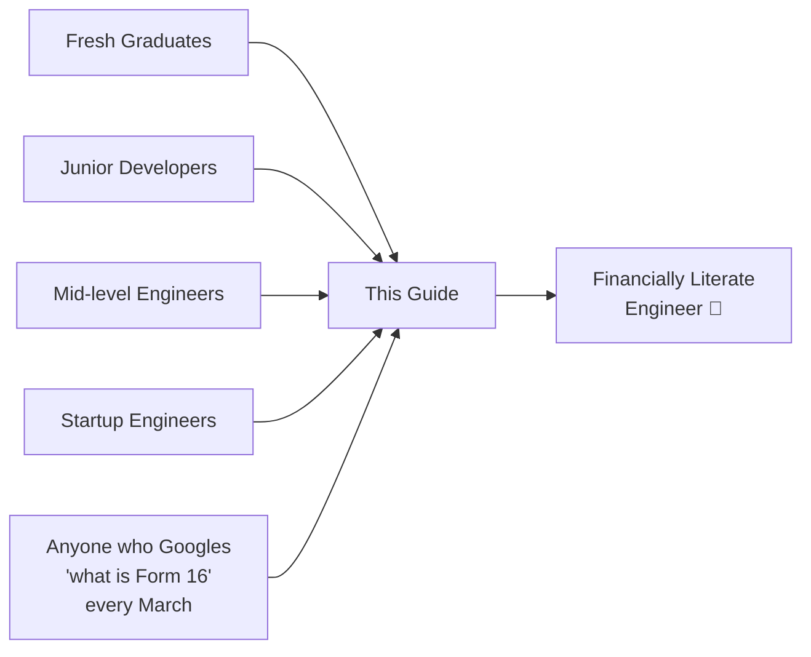
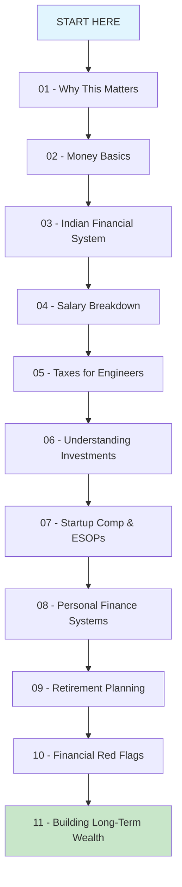
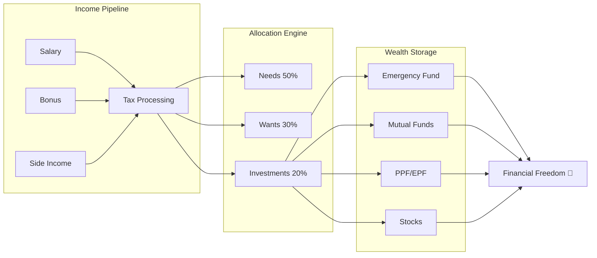

# 💰 Financial Literacy for Software Engineers — The Missing Manual

> *"You can mass-produce software, but you can't mass-produce financial sense."*

```
 ┌──────────────────────────────────────────────────────┐
 │  FINANCIAL LITERACY FOR ENGINEERS                    │
 │  ════════════════════════════════                    │
 │                                                      │
 │  Version:  2.0.0-stable                             │
 │  Runtime:  Your Career (20-40 years)                │
 │  License:  Open Source Knowledge                    │
 │  Status:   CRITICAL — Deploy Immediately            │
 │                                                      │
 │  WARNING: Running your career without this module   │
 │  may result in unexpected poverty exceptions.       │
 └──────────────────────────────────────────────────────┘
```

## What Is This?

This is a **comprehensive, no-BS guide to personal finance** written specifically for Software Engineers in India. It assumes you know what a `HashMap` is but have no idea what a Form 16 looks like.

If you've ever:
- Confused your CTC with your actual salary (spoiler: they're very different)
- Let your savings sit in a savings account earning 3.5% while inflation eats 6%
- Said "I'll figure out taxes later" every single year
- Bought crypto because a YouTuber told you to
- Had no idea what your payslip components mean

...then this guide is your `git pull origin financial-literacy`.

## Who Is This For?



## Guide Map



| # | Section | What You'll Learn |
|---|---------|-------------------|
| 📖 | [START HERE](START_HERE.md) | How to use this guide |
| 01 | [Why This Matters](01-why-this-matters/README.md) | Why smart engineers stay financially dumb |
| 02 | [Money Basics](02-money-basics/README.md) | Inflation, compounding, saving vs investing |
| 03 | [Indian Financial System](03-indian-financial-system/README.md) | FY, AY, tax seasons, and the system |
| 04 | [Salary Breakdown](04-salary-breakdown/README.md) | CTC vs Gross vs In-hand — the great illusion |
| 05 | [Taxes for Engineers](05-taxes/README.md) | Slabs, TDS, deductions, filing returns |
| 06 | [Understanding Investments](06-investments/README.md) | FDs, MFs, SIPs, stocks, gold, and more |
| 07 | [Startup Comp & ESOPs](07-esops-startup-comp/README.md) | When paper money becomes real (or doesn't) |
| 08 | [Personal Finance Systems](08-personal-finance-systems/README.md) | Budgeting, emergency funds, allocation |
| 09 | [Retirement Planning](09-retirement-planning/README.md) | Start at 22, retire like a king |
| 10 | [Financial Red Flags](10-financial-red-flags/README.md) | Traps, scams, and dumb mistakes to avoid |
| 11 | [Building Long-Term Wealth](11-building-wealth/README.md) | The endgame — money working for you |
| 📋 | [Quick Reference](QUICK_REFERENCE.md) | Cheat sheet for everything |

## The Core Philosophy

```
Your code runs on servers.
Your life runs on money.
Neither works well without proper architecture.
```

This guide treats personal finance as a **system design problem**:

- **Inputs**: Salary, bonuses, side income
- **Processing**: Tax optimization, budgeting, allocation
- **Storage**: Savings, investments, emergency funds
- **Output**: Financial freedom, retirement, peace of mind
- **Monitoring**: Regular reviews, rebalancing



## How to Use This Guide

1. **Read sequentially** if you're a complete beginner
2. **Jump to specific sections** if you know basics but need clarity on something
3. **Use the Quick Reference** as a cheat sheet
4. **Actually implement** — reading without action is like writing code without committing

## A Note on Accuracy

While this guide uses humor and analogies, **all financial information is accurate** as of FY 2025-26. Tax laws, investment rules, and regulations change — always verify current numbers before making financial decisions.

> *This is educational content, not financial advice. For personalized advice, consult a SEBI-registered financial advisor.*

---

**Ready?** → [Start Here](START_HERE.md)
