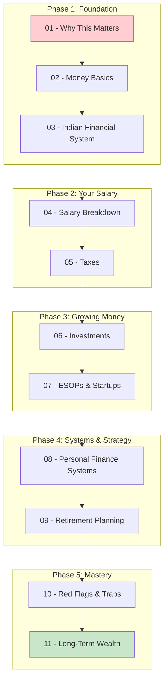

# 🚀 START HERE — Your Financial Onboarding

> *Think of this as your Day 1 at a new job, except the codebase is your bank account and nobody wrote documentation.*

## Prerequisites

Before diving into this guide, you should have:

- [ ] A bank account (seriously, that's the minimum bar)
- [ ] A PAN card (your unique ID in India's tax system — like a primary key)
- [ ] Basic math skills (addition, subtraction, percentages)
- [ ] The willingness to accept that your CTC is a lie
- [ ] Coffee ☕

## How This Guide Is Structured



## The 30-Second Summary

If you read absolutely nothing else (shame on you), here's the TL;DR:

```
1. Your CTC ≠ Your salary. You'll get ~60-70% of it in hand.
2. Inflation is silently killing your savings account at ~6% per year.
3. Start a SIP in an index fund. Even ₹5,000/month. Today.
4. Build an emergency fund of 6 months' expenses.
5. File your taxes properly. Don't leave money on the table.
6. Your ESOPs are probably worth ₹0 until proven otherwise.
7. Avoid credit card debt like you avoid production bugs on Friday.
```

But seriously — read the full guide. Your future self will mass-produce thank-you notes.

## Quick Self-Assessment

Answer these questions honestly:

| Question | If Yes | If No |
|----------|--------|-------|
| Do you know your in-hand salary vs CTC? | Good start | Read Section 4 |
| Do you understand income tax slabs? | Nice | Read Section 5 |
| Are you investing beyond a savings account? | Smart | Read Section 6 |
| Do you have an emergency fund? | Excellent | Read Section 8 |
| Do you know what your ESOPs are worth? | Rare | Read Section 7 |
| Can you explain what SIP stands for? | Great | Read Section 6 |
| Do you have a budget system? | Chef's kiss | Read Section 8 |

If you answered "No" to 3 or more: Start from Section 1.
If you answered "No" to 1-2: Jump to those sections.
If you answered "Yes" to all: Why are you here? Go build something.

---

**Let's begin** → [Section 1: Why This Matters](01-why-this-matters/README.md)
