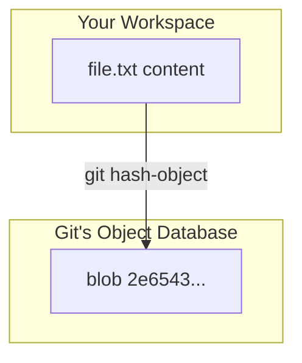
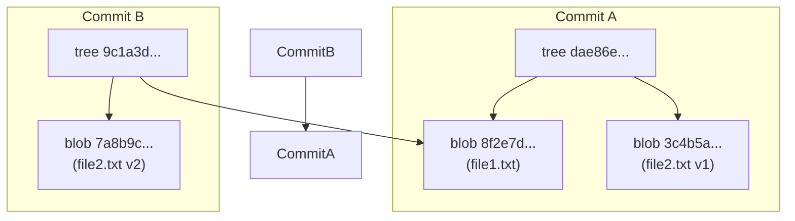
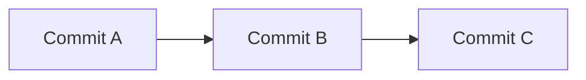
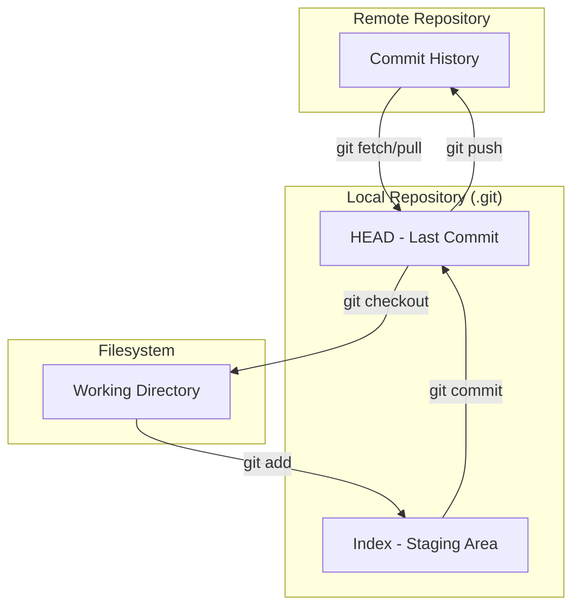

# Mental Models for Git Mastery

- **Purpose**: To establish the foundational mental models for understanding Git as a system.
- **Estimated Difficulty**: 2/5
- **Estimated Reading Time**: 45 minutes
- **Prerequisites**: `00-how-to-use-this-course.md`

---

### 1. Git is a Content-Addressable Filesystem

At its core, Git is a key-value data store. The "value" is any piece of content (a file, a directory structure), and the "key" is the SHA-1 hash of that content. This is the most important concept in Git.

- **Content-Addressable**: The content determines the address (the hash). If the content changes, even by a single bit, the hash changes completely.
- **Immutability**: You don't *change* data in Git; you *add* new data. This is why history is so robust.

**Diagram: The Hashing Mechanism**

### 2. Git is a Filesystem Snapshot Engine

Git doesn't store deltas (differences between files) at its core level. Instead, it takes snapshots of your entire project directory at a moment in time.

- **Commit**: A commit is a snapshot of your entire working directory, plus some metadata (author, message, parent commit(s)).
- **Efficiency**: You might think this is inefficient, but Git is clever. If a file hasn't changed between snapshots, Git simply stores a pointer to the existing, identical blob.

**Diagram: Two Commits with an Unchanged File**

*Notice how `Commit B` re-uses `Blob1` for the unchanged `file1.txt`.*

### 3. Git is a Directed Acyclic Graph (DAG)

Every commit in Git points to one or more parent commits (except the very first one). This creates a graph of history that flows in one direction (from child to parent) and has no cycles.

- **Directed**: The pointers have a direction (child -> parent).
- **Acyclic**: You can never get back to a commit by following its parent pointers.

Understanding the commit graph is the key to understanding branches, merges, and rebases.

**Diagram: A Simple Commit Graph**

### 4. The Three Trees

Git's workflow can be understood as managing three different "trees" or collections of files.

1.  **Working Directory**: The actual files on your filesystem that you can see and edit.
2.  **Index (Staging Area)**: A single, large, binary file in `.git/index` that lists all the files in the current branch, their SHA-1s, and timestamps. This is your *proposed next commit*.
3.  **HEAD**: A pointer to the last commit in the currently checked-out branch. This represents the state of your project from the last snapshot.

**Diagram: The Three-Tree Architecture**

### Exercises

1.  **Hash an object**:
    - Create a new file: `echo 'hello git' > test.txt`
    - Use the plumbing command to hash it: `git hash-object test.txt`
    - What happens if you run it again? What if you change the file content?
2.  **Explore the trees**:
    - Make a change to a file in a repository.
    - Run `git status`. How does the output relate to the three trees?
    - `git add` the file. Run `git status` again. What changed?
    - Run `git diff --staged`. What two trees is this command comparing?
    - Run `git diff`. What two trees is *this* command comparing?

### Interview Notes

- **Question**: "Explain Git's data model. How does it store history?"
- **Answer**: Start by explaining the content-addressable object store (blobs, trees, commits). Describe how commits are immutable snapshots that form a DAG. Mention the three-tree architecture (Working Directory, Index, HEAD) as the mechanism for constructing new commits. This demonstrates a deep, systemic understanding.
