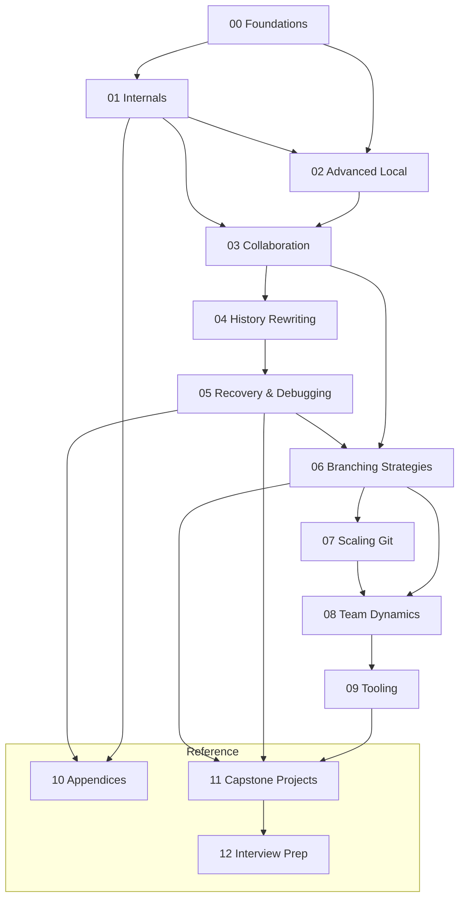

# Course Roadmap and Skill Progression

- **Purpose**: To provide a clear roadmap of the skills learned in this course and how they map to different levels of developer seniority.
- **Estimated Difficulty**: 1/5
- **Estimated Reading Time**: 15 minutes
- **Prerequisites**: `00-how-to-use-this-course.md`

---

### The Path to Git Mastery

This curriculum is structured to take you from a competent daily user to a true Git expert. Here's how the skills you'll learn map to professional development.

### Level 1: Confident Junior / Mid-Level Developer

This is the baseline for any professional developer working on a team. You are comfortable with the core mechanics of collaboration.

**Core Skills:**
- Flawless `add`, `commit`, `push`, `pull`.
- Understanding the "why" behind a branching workflow (e.g., GitFlow, GitHub Flow).
- Resolving simple merge conflicts without fear.
- Using `git log` effectively to understand history.
- Basic interactive rebase for cleaning up local commits (`squash`, `reword`, `edit`).
- Understanding the difference between `git fetch` and `git pull`.

**Modules to Master:**
- **00-Foundations**: Core mental models.
- **02-Advanced-Local-Workflows**: `stash`, `reset`, `checkout`.
- **03-Collaboration-and-Remotes**: The fundamentals of teamwork.

### Level 2: Senior Developer / Team Lead

You are the go-to person for most Git issues on your team. You can handle complex scenarios and guide others.

**Core Skills:**
- Deep understanding of `rebase` vs. `merge` and their strategic trade-offs.
- Using `reflog` to recover from common mistakes (e.g., a bad rebase, a deleted branch).
- Advanced interactive rebase (`drop`, `reorder`).
- Using `git bisect` to find regressions.
- Writing clear, concise, and atomic commits.
- Understanding and using `cherry-pick` safely.
- Architecting and enforcing a team's branching strategy.
- Confidently navigating a `detached HEAD` state.

**Modules to Master:**
- **01-Git-Internals**: You understand the object model.
- **04-History-Rewriting**: You can manipulate the DAG with precision.
- **05-Recovery-and-Debugging**: You are a Git firefighter.
- **06-Branching-Strategies**: You are a workflow architect.

### Level 3: Staff+ Engineer / Repository Maintainer

You have a systems-level understanding of Git. You can solve the hairiest problems, manage large-scale repositories, and teach anyone on your team.

**Core Skills:**
- Deep knowledge of Git's internal object model (blobs, trees, commits).
- Using plumbing commands (`cat-file`, `hash-object`, `commit-tree`) for forensics and recovery.
- Diagnosing and fixing repository performance issues.
- Understanding and managing monorepos (`sparse-checkout`, `partial-clone`).
- Advanced history surgery (e.g., `filter-branch`/`filter-repo`, splitting commits).
- Setting up and managing Git hooks for automation and policy enforcement.
- Understanding the security implications of Git (signed commits, etc.).
- Deep understanding of advanced tools like `rerere`, `worktree`, and submodules.

**Modules to Master:**
- **07-Scaling-Git**: You can handle enterprise-level challenges.
- **08-Team-Dynamics**: You understand the human element.
- **09-Tooling**: You have a highly optimized, personal workflow.
- **10-Appendices**: You can speak the language of the plumbing layer.

### Course Dependency Graph

This graph shows the recommended path through the course. While you can jump around, the modules are designed to be sequential.

