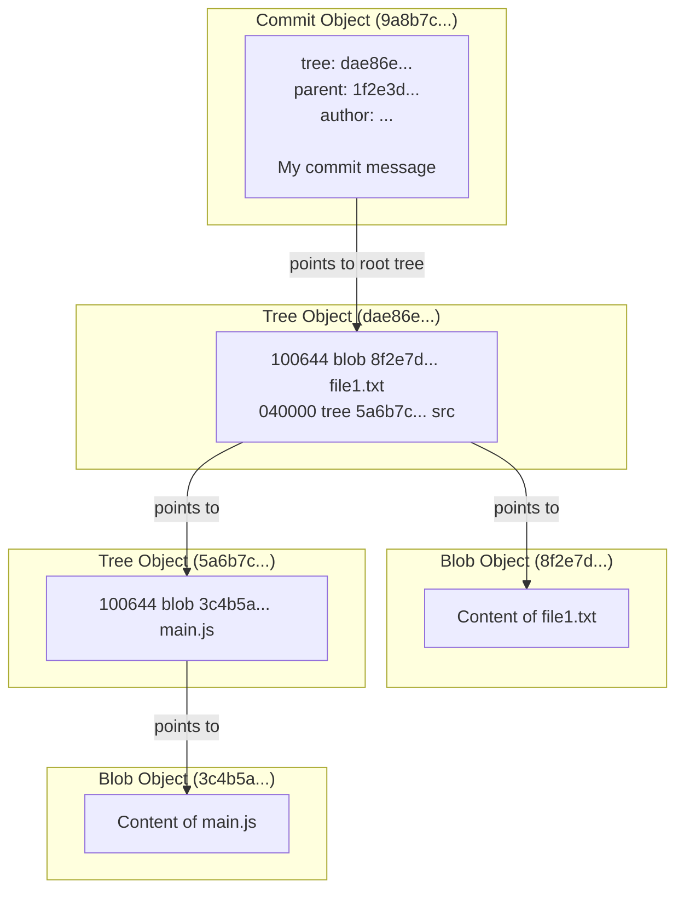

# 00-the-object-database.md

- **Purpose**: To provide an overview of Git's core data model: the object database.
- **Estimated Difficulty**: 3/5
- **Estimated Reading Time**: 20 minutes
- **Prerequisites**: `00-foundations/01-mental-models.md`

---

### The Core of Git

Everything in Git is stored in its object database, which lives in the `.git/objects` directory. This is the source of truth. Every object is content-addressed by a unique 40-character SHA-1 hash.

There are only four types of objects in Git. Understanding them is the key to understanding everything else.

### The Four Object Types

1.  **Blob (Binary Large Object)**
    - **Purpose**: Stores the raw content of a file.
    - **Details**: A blob is just a chunk of binary data. It has no metadata, not even a filename. It is pure content. Git doesn't care if it's text, a JPEG, or a compiled binary.
    - **Analogy**: The "inode" in a filesystem, containing the data itself.

2.  **Tree**
    - **Purpose**: Represents a directory or folder.
    - **Details**: A tree is a list of pointers. Each pointer contains the file mode, object type (blob or another tree), the object's SHA-1 hash, and the filename. It maps filenames to content (blobs) or other directories (trees).
    - **Analogy**: The "directory entry" in a filesystem.

3.  **Commit**
    - **Purpose**: Represents a snapshot of the entire project at a single point in time.
    - **Details**: A commit object contains:
        - A pointer (SHA-1) to the top-level **tree** object representing the project's root directory for that snapshot.
        - A pointer (SHA-1) to one or more **parent commits**. This is what forms the history graph. A normal commit has one parent. A merge commit has two or more. The initial commit has zero.
        - **Author** and **Committer** metadata (name, email, timestamp).
        - The **commit message**.

4.  **Tag**
    - **Purpose**: A stable, human-readable pointer to a specific commit.
    - **Details**: An annotated tag is its own object in the database. It contains:
        - A pointer (SHA-1) to a **commit** object.
        - A tagger's name, email, and timestamp.
        - A tagging message.
    - **Note**: There are also "lightweight" tags, which are not objects but simple refs (pointers), which we'll cover next.

### How They Fit Together

- A **commit** points to the top-level **tree**.
- That **tree** points to **blobs** (files) and other **trees** (subdirectories).
- This structure recursively represents the entire state of your project for that commit.

### Next Steps

In the following lessons, we will dissect each of these object types using low-level "plumbing" commands to see them in their raw form. This hands-on exploration is critical to building a durable mental model of Git's internals.
