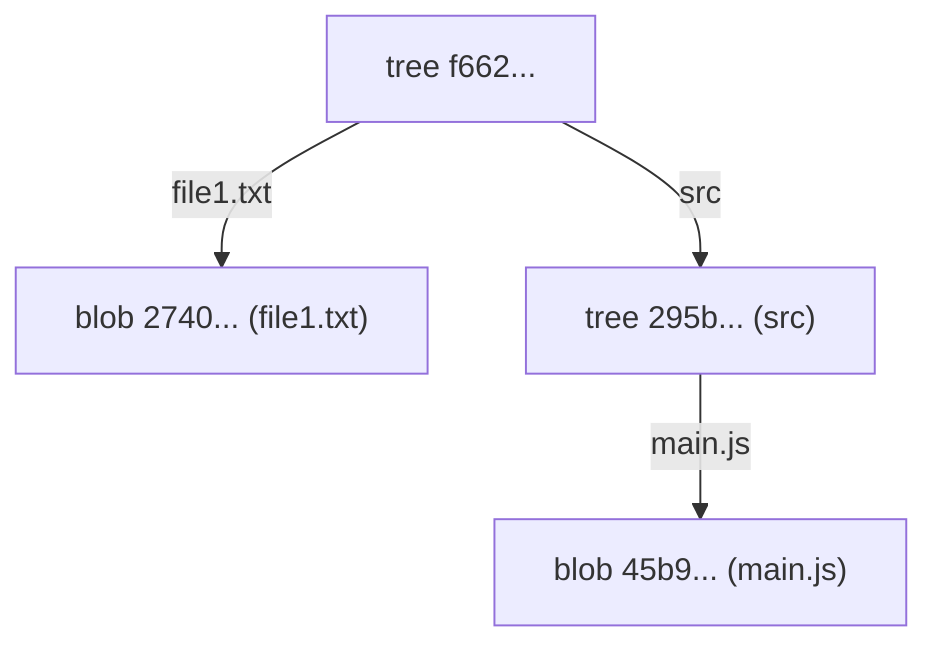

# 02-dissecting-a-tree-object.md

- **Purpose**: To use plumbing commands to create and inspect a raw tree object.
- **Estimated Difficulty**: 4/5
- **Estimated Reading Time**: 40 minutes
- **Prerequisites**: `01-dissecting-a-blob-object.md`

---

### What is a Tree?

If a blob is a file's content, a **tree** is a directory. It maps names to other objects. A tree object contains a list of entries, each consisting of:

- A file mode (e.g., `100644` for a normal file, `100755` for an executable, `040000` for a subdirectory/tree).
- The object type (`blob` or `tree`).
- The object's SHA-1 hash.
- The filename or directory name.

### Lab: Building a Tree from the Index

The most common way to create a tree is by using the staging area (the index). The `git add` command updates the index, and `git write-tree` creates a tree object from the current state of the index.

**1. Setup**
Continuing in our `git-internals-lab` repository:

```bash
# Ensure the repo is clean
$ git status
On branch master
nothing to commit, working tree clean

# Create and add a file
$ echo 'version 1' > file1.txt
$ git add file1.txt

# Create and add another file in a subdirectory
$ mkdir src
$ echo 'console.log("hello");' > src/main.js
$ git add src/main.js
```

**2. Inspect the Index**
The index is now populated. We can inspect it with `git ls-files --stage`.

```bash
$ git ls-files --stage
100644 274068545048727790031d6035943aABc91d371c 0       file1.txt
100644 45b983be36b73c0788dc9cbcb76cbb80fc7bb057 0       src/main.js
```
This shows the mode, the blob hash, the stage number (0 for normal), and the filename for each entry we've staged.

**3. Write the Tree**
Now, let's create a tree object that represents this staged snapshot.

```bash
$ git write-tree
f6621c2ab78345553439973338c68334d2598913
```
This command took the state of the index, created the necessary tree objects, and returned the SHA-1 of the top-level tree.

**4. Inspect the Tree Objects**
Let's inspect this new tree object.

```bash
$ git cat-file -p f6621c2ab78345553439973338c68334d2598913
100644 blob 274068545048727790031d6035943aABc91d371c    file1.txt
040000 tree 295b82d1433a4d3c99842d315b5f2734b6e6a42c    src
```
This is the root tree. It contains two entries:
- A `blob` for `file1.txt`.
- A `tree` for the `src` directory.

Now let's inspect the `src` tree:

```bash
$ git cat-file -p 295b82d1433a4d3c99842d315b5f2734b6e6a42c
100644 blob 45b983be36b73c0788dc9cbcb76cbb80fc7bb057    main.js
```
This sub-tree contains the entry for `main.js`.

**Diagram: The Tree Structure**


### Key Takeaways

- A tree represents a directory snapshot.
- It maps names to blobs (files) and other trees (subdirectories).
- The `git add` command populates the index.
- The `git write-tree` command creates a tree object from the index.
- A project's file hierarchy is represented by a graph of tree objects.

### Exercises

1.  **Add an executable file**:
    - Create a shell script: `echo '#!/bin/sh' > script.sh`
    - Make it executable: `chmod +x script.sh`
    - `git add` it and run `git ls-files --stage`. What is the mode? How does it differ from a normal file?
2.  **Manual Tree Creation (Advanced)**:
    - Use `git ls-files --stage` to get the current index state.
    - Use this information with `git mktree` to manually construct a tree object. This is a more primitive way to do what `write-tree` does.

### Interview Notes

- **Question**: "How does Git represent a directory structure?"
- **Answer**: "Git uses tree objects. A tree object is like a directory listing, mapping filenames to SHA-1 hashes. These hashes can point to blobs, which are file contents, or to other tree objects, which are subdirectories. This allows Git to represent the entire project hierarchy recursively starting from a single top-level tree for any given snapshot."
