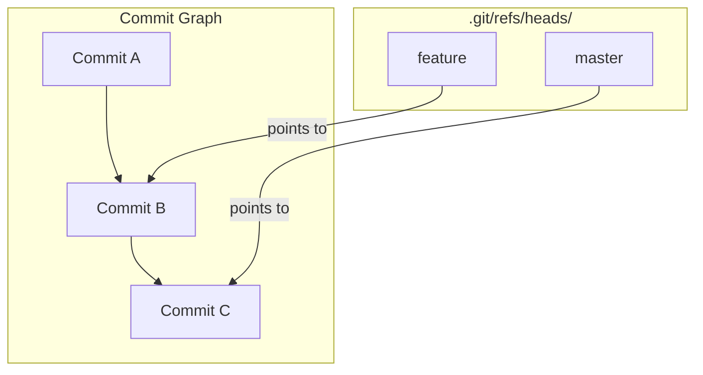
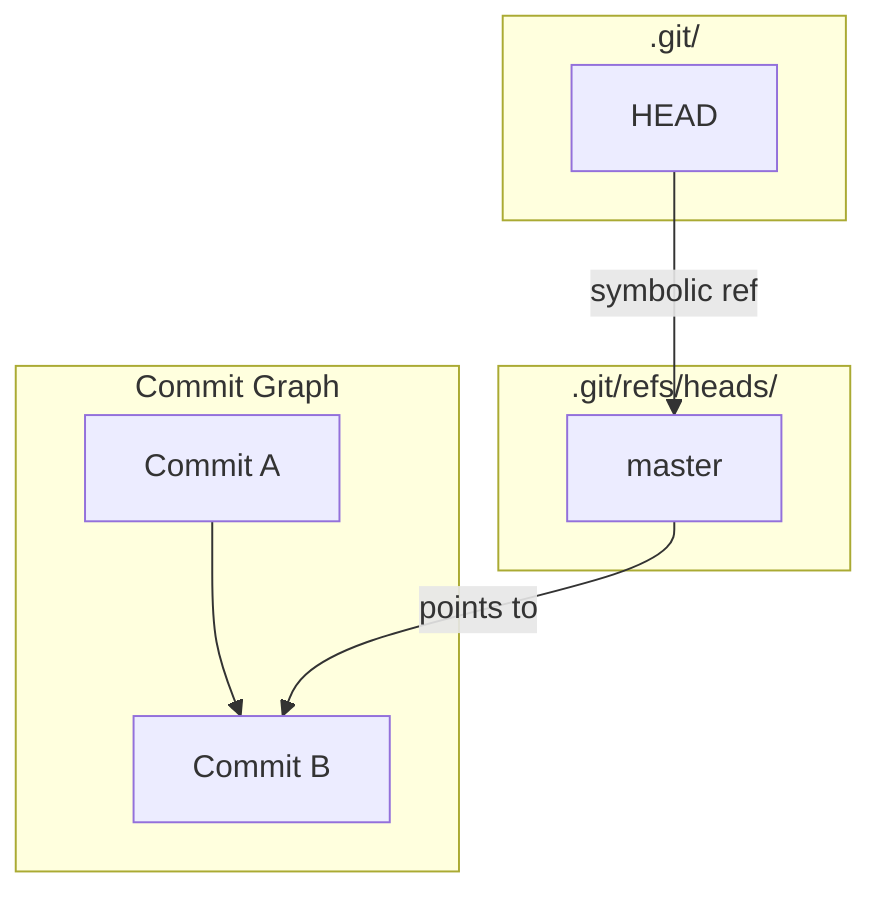

# 04-refs-branches-and-head.md

- **Purpose**: To explain how Git uses refs (references) to manage branches, tags, and the HEAD pointer.
- **Estimated Difficulty**: 3/5
- **Estimated Reading Time**: 30 minutes
- **Prerequisites**: `03-dissecting-a-commit-object.md`

---

### What is a Ref?

You've seen that Git objects are identified by long, unwieldy SHA-1 hashes. Humans are not good at remembering `a8a5e4a9c2...`. This is where refs come in.

A **ref** is simply a file in the `.git` directory that contains a SHA-1 hash. They are human-readable pointers to commits.

The main places you find refs are:
- `.git/refs/heads/`: This is where your local branches live.
- `.git/refs/tags/`: This is where your tags live.
- `.git/refs/remotes/`: This is where your remote-tracking branches live.

### Branches are Just Refs

Let's look inside our `git-internals-lab` repository.

```bash
$ ls .git/refs/heads/
master

$ cat .git/refs/heads/master
a8a5e4a9c29e136edc5f8789f6d3f80833c45334
```
A branch is nothing more than a file whose name is the branch name, located in `.git/refs/heads`, containing the SHA-1 of the commit at the tip of that branch.

When you make a new commit on a branch, all Git does is update this one file with the new commit's SHA-1. It's that simple and that fast.

**Diagram: Branches as Pointers**


### What is HEAD?

So if branches are pointers to commits, how does Git know which branch you're currently on? That's the job of `HEAD`.

`HEAD` is a special pointer that usually points to the branch you have checked out. It's a **symbolic ref**.

Let's look at it:
```bash
$ cat .git/HEAD
ref: refs/heads/master
```
`HEAD` is a file that, instead of containing a SHA-1 directly, contains the *path* to another ref. It's a pointer to a pointer.

- `HEAD` points to `master`.
- `master` points to commit `a8a5e4a...`.
- Therefore, your current state is commit `a8a5e4a...`.

When you `git checkout my-feature`, all Git does is change the content of the `.git/HEAD` file to `ref: refs/heads/my-feature`.

**Diagram: The Role of HEAD**


### Detached HEAD State

What happens if `HEAD` points directly to a commit SHA instead of a branch ref? This is called a **detached HEAD**.

You can enter this state by checking out a commit directly:
```bash
$ git checkout a8a5e4a
Note: switching to 'a8a5e4a'.
...
You are in 'detached HEAD' state.
```

Now look at the `HEAD` file:
```bash
$ cat .git/HEAD
a8a5e4a9c29e136edc5f8789f6d3f80833c45334
```
It now contains a raw SHA-1. You are no longer "on" a branch. If you make a new commit now, it will be created, and `HEAD` will be updated to point to it. However, no branch will be updated. This new commit will be "unreachable" as soon as you check out a different branch, and it will eventually be garbage collected.

This state is useful for inspecting old commits, but it's important to create a new branch (`git switch -c new-branch-name`) if you want to save any work you do while detached.

### Key Takeaways

- A **ref** is a human-readable name for a commit SHA.
- A **branch** is just a ref in `.git/refs/heads`.
- **HEAD** is a symbolic ref that points to your current branch.
- A **detached HEAD** occurs when `HEAD` points directly to a commit SHA instead of a branch.

### Exercises

1.  **Create a new branch**: Run `git branch feature`. Look in `.git/refs/heads`. What do you see? What is the content of the new `feature` file?
2.  **Switch branches**: Run `git switch feature`. What is the content of `.git/HEAD` now?
3.  **Create a tag**: Run `git tag v1.0`. Look in `.git/refs/tags`. What do you see? How is it similar to or different from a branch?

### Interview Notes

- **Question**: "What is the difference between a branch and a tag?"
- **Answer**: "Both are refs, meaning they are pointers to commit SHAs. The key difference is that a branch is a *moving* pointer - it is automatically updated to point to the newest commit when you run `git commit`. A tag is a *stable* pointer - it is designed to permanently mark a specific commit, like a release version (`v1.0`), and it does not move automatically."
