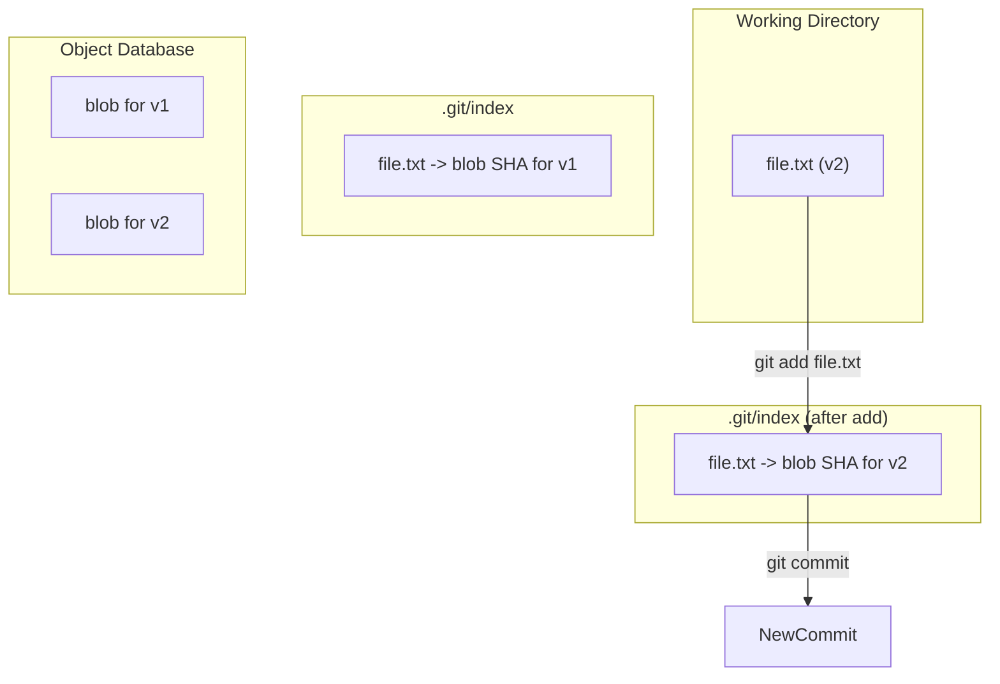

# 05-the-index-or-staging-area.md

- **Purpose**: To demystify the index, explaining its role, structure, and importance in Git's three-tree architecture.
- **Estimated Difficulty**: 4/5
- **Estimated Reading Time**: 45 minutes
- **Prerequisites**: `04-refs-branches-and-head.md`

---

### The Mysterious Middle Ground

The index, also known as the "staging area," is one of the most powerful but least understood parts of Git. It's the crucial link between your working directory and your commit history.

**It is not:**
- A cache.
- A temporary area for your changes.
- A list of changed files.

**It is:**
- A binary file located at `.git/index`.
- A manifest of your **entire project** as it should appear in the **next commit**.
- A virtual working directory.

### The Index as a Manifest

The index contains a sorted list of every single file in your project (at least, every file known to Git). For each file, it stores:
- The file's path.
- The SHA-1 of the corresponding blob object.
- File mode and other metadata.

When you run `git add <file>`, you are telling Git: "For the next commit, use the content of *this* version of the file." Git does two things:
1.  It creates a blob object from the file's current content.
2.  It updates the index, replacing the old entry for that file with the new blob's SHA-1.

When you run `git commit`, Git doesn't look at your working directory at all. It builds a new commit exclusively from the state of the index.

**Diagram: The Role of the Index**


### Why is this useful? Crafting Atomic Commits

The index allows you to decouple what's in your working directory from what will be in your next commit. This lets you build up a commit piece by piece, resulting in clean, "atomic" commits that represent a single logical change.

**Scenario:**
You've made two different logical changes in the same file, `api.js`.
1.  You fixed a bug in the `getUser` function.
2.  You started adding a new feature, `updateUser`, but it's not finished.

Without the index, you'd have to commit both changes together. With the index, you can be precise:

```bash
# Stage only the bug fix, not the new feature
$ git add --patch api.js
# (In the interactive prompt, choose to stage only the hunk related to getUser)

# Now the index contains the bug fix, but your working directory still has the unfinished feature.
$ git status
Changes to be committed:
  (use "git restore --staged <file>..." to unstage)
        modified:   api.js

Changes not staged for commit:
  (use "git add <file>..." to update what will be committed)
  (use "git restore <file>..." to discard changes in working directory)
        modified:   api.js

# Create a commit with ONLY the bug fix
$ git commit -m "Fix: Correctly handle null user in getUser"

# Now your history is clean, and the unfinished feature remains safely in your working directory.
```

### Inspecting the Index

The best tool for viewing the index's contents is `git ls-files --stage`.

```bash
# In our lab repo
$ git ls-files --stage
100644 274068545048727790031d6035943aABc91d371c 0       file1.txt
100644 45b983be36b73c0788dc9cbcb76cbb80fc7bb057 0       src/main.js
```
This gives you a raw look at the manifest: `mode`, `blob SHA`, `stage number`, and `path`.

### The Three Trees Revisited

The index is the key to understanding Git's core comparison commands:

- `git diff`: Compares the **Index** and the **Working Directory**. It shows changes you've made that you *haven't* staged yet.
- `git diff --staged` (or `--cached`): Compares **HEAD** (the last commit) and the **Index**. It shows the changes you *have* staged and are about to commit.
- `git diff HEAD`: Compares **HEAD** and the **Working Directory**. It shows all your local changes, both staged and unstaged.

### Key Takeaways

- The index is a manifest for the next commit.
- `git add` updates the index, not just "marks a file".
- `git commit` builds a commit from the index, not the working directory.
- The index is what enables the crafting of precise, atomic commits, which is a cornerstone of professional Git usage.

### Interview Notes

- **Question**: "Explain the 'staging area' in Git. Why does it exist?"
- **Answer**: "The staging area, or index, is one of Git's three trees, alongside the working directory and the commit history. It's essentially a manifest that describes the exact state of the next commit. Its purpose is to decouple the working directory from the commit history. This allows a developer to carefully construct a commit piece by piece, staging only the changes that belong to a single logical unit of work. This promotes the creation of atomic commits, which makes the project history much cleaner, easier to read, and easier to debug with tools like `git bisect`."
