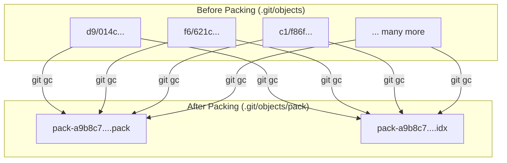

# 06-packfiles-and-garbage-collection.md

- **Purpose**: To explain how Git stores objects efficiently using packfiles and how it cleans up unreachable objects.
- **Estimated Difficulty**: 4/5
- **Estimated Reading Time**: 40 minutes
- **Prerequisites**: `05-the-index-or-staging-area.md`

---

### The Problem of Loose Objects

So far, we've seen that every time you create an object (a blob, a tree, a commit), Git creates a new file in `.git/objects`. These are called "loose" objects.

This is fine for a while, but it has two problems for large, long-lived projects:
1.  **Inefficiency**: It uses a lot of disk space. A tiny one-line change to a 10MB file creates a whole new 10MB blob object.
2.  **Performance**: Many operating systems don't handle directories with hundreds of thousands of small files very well.

Git's solution to this is **packfiles**.

### What is a Packfile?

A packfile is a single, highly compressed binary file that contains multiple Git objects. Git periodically (or manually, via `git gc`) "packs" loose objects into a packfile to save space and improve performance.

The process involves several key steps:
1.  **Finding objects**: Git identifies all objects it's going to pack.
2.  **Delta Compression**: This is the magic. Instead of storing the full content of every object, Git finds objects that are similar (e.g., two versions of the same file). It stores one version as a whole (the "base") and the other as just the difference, or "delta," from the base.
3.  **Compression**: The resulting data (a mix of whole objects and deltas) is then compressed using standard libraries like zlib.
4.  **Indexing**: Git creates a corresponding `.idx` file that acts as an index, allowing it to quickly find and retrieve a specific object from within the large packfile.

**Diagram: Loose Objects vs. Packfile**


### Garbage Collection (`git gc`)

What about objects that are no longer needed? For example:
- A commit you made on a detached HEAD and then abandoned.
- Objects from a branch you deleted.
- Objects from a rebase that were replaced by new commits.

These are called "unreachable" objects because no ref (branch, tag) or the reflog can trace a path to them.

The `git gc` (garbage collection) command is responsible for cleaning these up.
1.  It identifies all "reachable" objects by starting from all refs (branches, tags, etc.) and traversing the commit graph.
2.  It packs all reachable loose objects into a new packfile.
3.  It **deletes** any loose objects that were not found in the "reachable" set and are older than a grace period (typically 2 weeks, configurable via `gc.pruneExpire`). This grace period is a safety net, giving you time to recover objects from the reflog if needed.

### Lab: Manually Packing Objects

Let's see this in action.

**1. Create some loose objects**
In our `git-internals-lab`, we have a few commits. Let's create some more loose objects by making a change without committing it.

```bash
$ echo "some new content" > new-file.txt
$ git add new-file.txt
# This creates a new blob object
```

Now, let's run `git gc` manually.

```bash
$ git gc
Enumerating objects: 8, done.
Counting objects: 100% (8/8), done.
Delta compression using up to 8 threads
Compressing objects: 100% (4/4), done.
Writing objects: 100% (8/8), done.
Total 8 (delta 1), reused 0 (delta 0), pack-reused 0
```

**2. Inspect the results**
Now look at your `.git/objects` directory.

```bash
$ ls .git/objects
info/ pack/
```
The loose object directories (`d9/`, `f6/`, etc.) are gone! They have all been consolidated into a packfile inside `.git/objects/pack/`.

You can use `git verify-pack` to inspect the contents of the packfile.

```bash
$ git verify-pack -v .git/objects/pack/pack-....idx
# The output will list all the objects in the pack, their types, sizes, and delta information.
```

### Key Takeaways

- Git uses **packfiles** to store objects efficiently.
- **Delta compression** is used to save space by storing similar objects as differences from each other.
- `git gc` is the command that packs loose objects and removes old, unreachable objects.
- There is a grace period before unreachable objects are deleted, which provides a safety window for recovery.

### Interview Notes

- **Question**: "My Git repository is getting very large. What are some of the reasons this might happen, and how does Git manage disk space?"
- **Answer**: "Large repositories can be caused by large binary assets, long history, or many branches. Git manages disk space primarily through packfiles. Periodically, it runs a garbage collection process (`git gc`) that bundles many 'loose' objects into a single, compressed file called a packfile. The key optimization here is delta compression, where instead of storing multiple full versions of a file, Git stores a base version and then just the 'deltas' or differences for subsequent versions. This is highly effective for text files. The `gc` process also prunes old, unreachable objects, reclaiming space from deleted branches or abandoned work."
