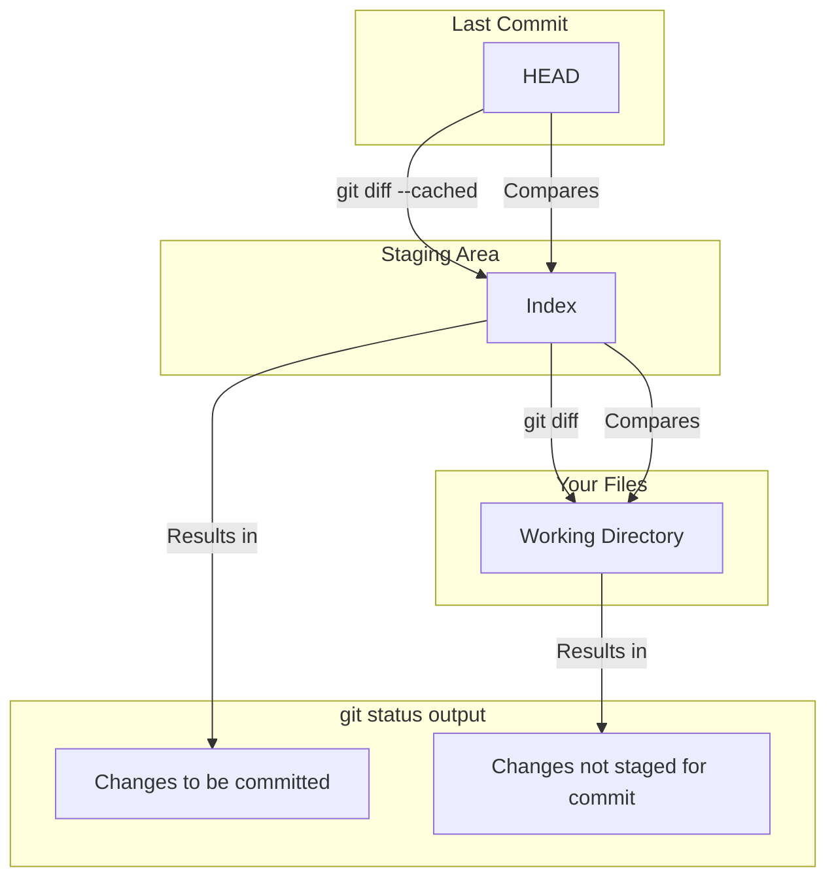

# 00-mastering-git-status-and-git-diff.md

- **Purpose**: To go beyond a surface-level understanding of `git status` and `git diff`, connecting them directly to the three-tree architecture.
- **Estimated Difficulty**: 2/5
- **Estimated Reading Time**: 30 minutes
- **Prerequisites**: `01-git-internals` module.

---

### `git status` is a `diff` command

`git status` is the command you run most often, but few users stop to think about what it's actually *doing*. It's not magic; it's simply running two `diff` operations.

When you run `git status`, Git performs:
1.  A `diff` between `HEAD` and the `Index`. The results are the "Changes to be committed" (staged changes).
2.  A `diff` between the `Index` and the `Working Directory`. The results are the "Changes not staged for commit" (unstaged changes).

**Diagram: `git status` and the Three Trees**


### Advanced `git diff`

Understanding the three trees unlocks the full power of `git diff`.

- `git diff`: Shows changes between the **Index** and the **Working Directory**.
    - *Use Case*: "What have I changed that I haven't staged yet?"

- `git diff --staged` (or `--cached`): Shows changes between **HEAD** and the **Index**.
    - *Use Case*: "What have I staged for the next commit? Let me review my commit before I finalize it." This is a critical step for crafting good commits.

- `git diff HEAD`: Shows changes between **HEAD** and the **Working Directory**.
    - *Use Case*: "Show me all the changes I've made in my working directory since the last commit, both staged and unstaged."

### Practical Scenarios

**Scenario 1: Reviewing a commit before finalizing**
You've used `git add .` but want to be sure you haven't staged any accidental changes (like a `console.log`).

```bash
$ git add .
$ git diff --staged # This is your final review window.
# You see a console.log you don't want.
$ git restore --staged path/to/file.js
# Now the console.log is unstaged.
$ git diff --staged # Review again. Looks good.
$ git commit -m "My clean commit"
```

**Scenario 2: Comparing with an older commit**
You can use `diff` to compare your current state against any commit in history.

```bash
# Compare your working directory with the commit from two steps ago
$ git diff HEAD~2

# Compare what's staged with the master branch
$ git diff --staged master
```

### Diffing for Words, Not Lines

Sometimes a line-based diff is too coarse. You changed one word in a long line, but the whole line is marked. Use `--word-diff`.

```bash
$ git diff --word-diff
```
This will highlight only the changed words, which is incredibly useful for prose or configuration files.

### Key Takeaways

- `git status` is not a magical state command; it's a summary of two `diff`s.
- Mastering `git diff` with its variants (`--staged`, `HEAD`) gives you precise control over understanding your repository's state.
- Use `git diff --staged` as a final "proofread" before every commit.
- Use `--word-diff` for more granular comparisons.

### Exercises

1.  Modify a file. Stage it. Then modify it again.
    - Run `git status`. You should see the file listed in both "staged" and "unstaged" sections.
    - Run `git diff`. What does it show? (The second modification).
    - Run `git diff --staged`. What does it show? (The first modification).
    - Run `git diff HEAD`. What does it show? (Both modifications).
2.  Find a commit from several steps back in your history (`git log`). Use `git diff <commit_sha>` to see everything that has changed since that old commit.
