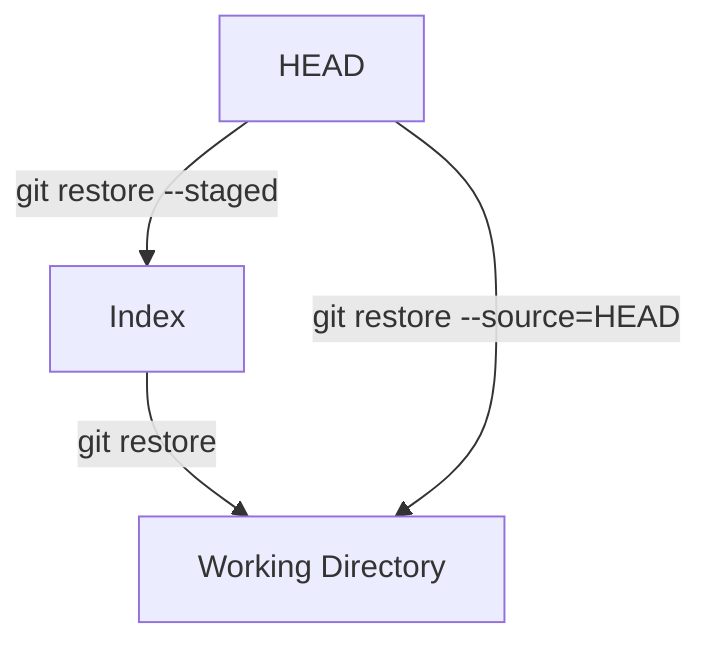

# 01-the-many-faces-of-git-checkout.md

- **Purpose**: To clarify the overloaded nature of `git checkout` and introduce its modern replacements, `git switch` and `git restore`.
- **Estimated Difficulty**: 3/5
- **Estimated Reading Time**: 35 minutes
- **Prerequisites**: `00-mastering-git-status-and-git-diff.md`

---

### The Problem with `git checkout`

For years, `git checkout` was one of the most confusing commands for new and intermediate users. This is because it's "overloaded" - it does several fundamentally different things depending on the arguments you provide.

`git checkout` can be used to:
1.  **Switch branches**: `git checkout my-feature-branch`
2.  **Restore files** from the index to the working directory: `git checkout -- my-file.txt`
3.  **Restore files** from a specific commit to the working directory *and* the index: `git checkout <commit-sha> -- my-file.txt`

This is confusing because it mixes operations that change `HEAD` (switching branches) with operations that change files in the working directory. This violates the principle of a command doing one thing well.

### The Modern Solution: `switch` and `restore`

In Git 2.23 (released in August 2019), two new commands were introduced to provide a clearer separation of concerns: `git switch` and `git restore`.

- `git switch`: This command is exclusively for changing `HEAD`. Use it to switch branches or create new ones.
- `git restore`: This command is exclusively for changing the state of files in the working directory and the index.

**It is highly recommended to use `switch` and `restore` in all modern Git workflows.** They make your intent clearer and reduce the risk of accidental, destructive operations.

### `git switch`: For All Your Branch-Switching Needs

`git switch` handles all operations that change which commit `HEAD` is pointing to.

| Old Command (`checkout`)             | New Command (`switch`)                | Purpose                               |
| ------------------------------------ | ------------------------------------- | ------------------------------------- |
| `git checkout my-branch`             | `git switch my-branch`                | Switch to an existing branch.         |
| `git checkout -b new-branch`         | `git switch -c new-branch`            | Create and switch to a new branch.    |
| `git checkout --track origin/main`   | `git switch --track origin/main`      | Create a local tracking branch.       |
| `git checkout <commit-sha>`          | `git switch --detach <commit-sha>`    | Detach HEAD at a specific commit.     |

### `git restore`: For All Your File-Restoring Needs

`git restore` handles all operations that copy files from one of the three trees to another.

The `--source` option specifies where to get the file from (defaults to `HEAD` if not specified for the working tree, and the index if specified for `--staged`). The command's arguments specify where to put it.

| Command                               | Purpose                                                                                             |
| ------------------------------------- | --------------------------------------------------------------------------------------------------- |
| `git restore my-file.txt`             | Discard unstaged changes in `my-file.txt`. (Copies from Index to Working Directory).                |
| `git restore --staged my-file.txt`    | Unstage changes in `my-file.txt`. (Copies from HEAD to Index).                                      |
| `git restore --source=HEAD~1 my-file.txt` | Restore `my-file.txt` to its state from the previous commit. (Copies from `HEAD~1` to both Index and Working Directory). |

**Diagram: `restore` and the Three Trees**


### Why This Matters: Safety and Clarity

Consider the command `git checkout -- file.txt`. This discards your local changes in `file.txt`. It's a destructive operation. Using `git restore file.txt` makes the intent much clearer: "I want to restore this file to its last staged state."

Similarly, `git switch my-branch` is unambiguous. It will never accidentally discard your file changes. It will only ever switch branches. If you have uncommitted changes that would conflict, it will safely abort.

### Gotchas

- **Old Habits**: The biggest gotcha is muscle memory. You've probably typed `git checkout` thousands of times. It takes conscious effort to switch to the new commands.
- **Old Tutorials**: The vast majority of Git tutorials and Stack Overflow answers on the internet still use `git checkout`. You need to be able to mentally translate them to the modern commands.

### Recommended Aliases

To help break the habit, you can create aliases that shadow the old command.

```bash
# In your .gitconfig
[alias]
    co = "!echo 'Use git switch or git restore instead of checkout'; false"
    # Or, if you must:
    # co = switch
```

### Key Takeaways

- `git checkout` is an overloaded, legacy command.
- `git switch` is for changing branches (changing `HEAD`).
- `git restore` is for changing files (copying between the three trees).
- Adopting `switch` and `restore` makes your Git usage safer, clearer, and more intentional.

### Exercises

1.  Create a new branch and switch to it using `git switch -c`.
2.  Modify a file. Use `git restore` to discard the changes.
3.  Modify a file and stage it (`git add`). Use `git restore --staged` to unstage it.
4.  Modify a file, stage it, and commit it. Then, use `git restore --source=HEAD~1 <file>` to revert that file back to its state before the last commit. Check your `git status` and `git diff`. What happened in the index and working directory?
