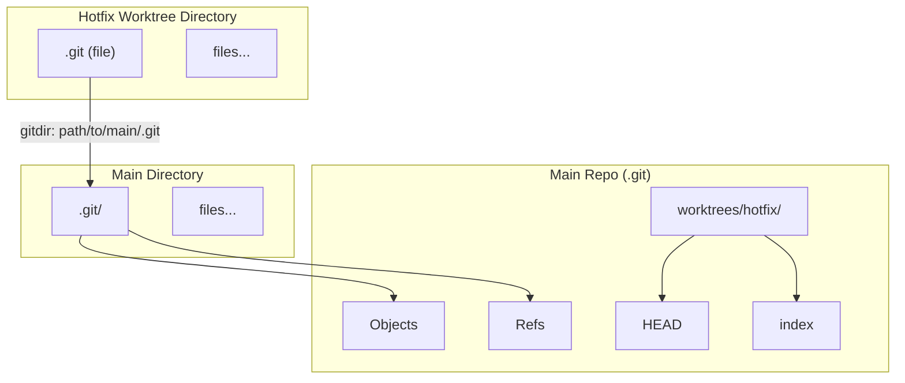

# 04-git-worktree-for-parallel-workflows.md

- **Purpose**: To introduce `git worktree` as a powerful alternative to stashing or branch switching for managing multiple tasks in parallel.
- **Estimated Difficulty**: 4/5
- **Estimated Reading Time**: 30 minutes
- **Prerequisites**: `03-advanced-git-stash.md`

---

### The Problem with a Single Working Directory

As a developer, you are constantly context-switching.
- You're in the middle of a long-running feature (`feature-A`).
- A high-priority bug report comes in (`hotfix-123`).
- A teammate asks you to review their pull request (`pr-review-456`).

The traditional workflow involves a lot of `git stash` and `git switch`:
1.  `git stash` your work on `feature-A`.
2.  `git switch hotfix-123`.
3.  Fix the bug, commit, push.
4.  `git switch main`.
5.  `git switch feature-A`.
6.  `git stash pop` and hope for no conflicts.

This is slow, error-prone, and you lose your context (e.g., running dev server, `node_modules` for a specific branch). What if you could have multiple branches checked out at the same time?

### Enter `git worktree`

`git worktree` allows you to have multiple working directories (worktrees) attached to a single Git repository. Each worktree can have a different branch checked out.

This means you can have:
- `/path/to/my-repo` (main worktree, on `main` branch)
- `/path/to/my-repo-hotfix` (linked worktree, on `hotfix-123` branch)
- `/path/to/my-repo-feature` (linked worktree, on `feature-A` branch)

All three directories share the same `.git` database, but have their own separate `HEAD`, `index`, and working files.

### How to Use `git worktree`

**1. Create a new worktree**
You're on `main` and need to work on `hotfix-123`.

```bash
# Format: git worktree add <path> <branch>
$ git worktree add ../my-repo-hotfix hotfix-123
```
Git will create a new directory `my-repo-hotfix` one level up from your current location, and check out the `hotfix-123` branch inside it. You can now `cd ../my-repo-hotfix`, run `npm install`, and start working without touching your original directory.

**2. List existing worktrees**

```bash
$ git worktree list
/path/to/my-repo         a1b2c3d [main]
/path/to/my-repo-hotfix  e4f5g6h [hotfix-123]
```

**3. Clean up a worktree**
Once you're done with the hotfix and have merged the branch, you can remove the worktree.

```bash
# From any worktree
$ git worktree remove my-repo-hotfix
```
This will fail safely if the worktree has uncommitted changes. You can force it with `-f`. After removing the worktree directory, you may need to prune the administrative files:

```bash
$ git worktree prune
```

### Use Cases and Advantages

1.  **Hotfixes**: The canonical example. Keep your main feature work untouched while you quickly fix a bug in a separate, clean directory.
2.  **Pull Request Reviews**: Checking out a PR locally often means stashing your work. With worktrees, you can do `git worktree add ../pr-reviews/456 pr-branch-name` and run the code in a completely isolated environment.
3.  **Long-Running Tests**: Need to run a test suite that takes 30 minutes? Start it in one worktree while you continue coding in another.
4.  **Comparing Branches**: You can have two different branches open side-by-side in your editor, each in its own directory, making it easy to compare code or run them simultaneously.

### Internals: How it Works

When you create a new worktree, Git:
1.  Creates the new directory.
2.  Inside that directory, it creates a `.git` file (not a directory!). This file contains a `gitdir:` pointer to the main repository's `.git` directory.
3.  It creates worktree-specific refs and files (like `HEAD` and `index`) inside the main `.git/worktrees/` directory.

This allows the worktrees to be linked to the same object database while maintaining their own independent state (current branch, staged changes).

**Diagram: Worktree Structure**


### Key Takeaways

- `git worktree` lets you check out multiple branches at the same time in different directories.
- It's a powerful alternative to stashing for context switching.
- Ideal for hotfixes, PR reviews, and any parallel task.
- All worktrees share the same object database but have separate working directories and indexes.

### Exercises

1.  From your main project directory, create a new worktree for a new feature branch.
2.  `cd` into the new worktree. Run `git status` and `git branch`. Confirm you are on the new branch.
3.  In the main worktree, make a commit.
4.  In the feature worktree, run `git log`. Do you see the commit you just made on the other branch? (You should see it if you do `git log main`).
5.  Clean up by removing the worktree and running `git worktree prune`.
