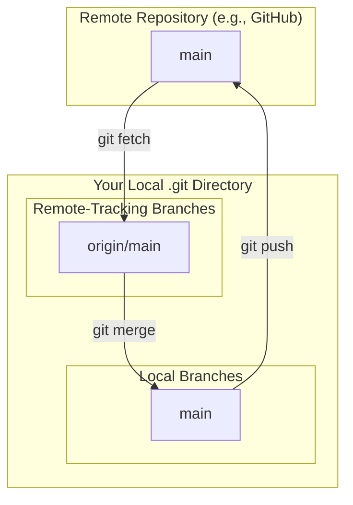

# 00-understanding-remotes-and-tracking-branches.md

- **Purpose**: To explain the relationship between local branches, remote repositories, and remote-tracking branches.
- **Estimated Difficulty**: 3/5
- **Estimated Reading Time**: 35 minutes
- **Prerequisites**: `01-git-internals/04-refs-branches-and-head.md`

---

### What is a Remote?

A "remote" is simply a named pointer to another Git repository. It's a bookmark. When you clone a repository, Git automatically creates a remote named `origin` that points back to the URL you cloned from.

You can view your remotes with `git remote -v`.

```bash
$ git remote -v
origin  https://github.com/some-user/some-repo.git (fetch)
origin  https://github.com/some-user/some-repo.git (push)
```

A remote has two key pieces of information:
1.  A name (`origin`).
2.  A URL.

### The Role of `git fetch`

When you run `git fetch <remote-name>` (e.g., `git fetch origin`), Git does two things:
1.  It connects to the remote repository at the specified URL.
2.  It downloads any objects (commits, trees, blobs) that you don't have in your local object database.
3.  It updates your **remote-tracking branches** under `.git/refs/remotes/<remote-name>/`.

**Crucially, `git fetch` does not touch your local branches or your working directory.** It is a safe, read-only operation to synchronize your local database with the remote's state.

### Remote-Tracking Branches

A remote-tracking branch is a local, read-only pointer to the state of a branch in a remote repository. Its purpose is to be a bookmark of the last known state of the remote.

- They live in `.git/refs/remotes/`.
- You can't commit to them directly.
- They are moved only by `git fetch`.

Common examples are `origin/main`, `origin/feature-A`, etc.

**Diagram: The Three Branch Types**


### The `origin/main` vs `main` Relationship

- `origin/main` is your local copy of `main` *on the remote*. It only moves when you `fetch`.
- `main` is your own, local `main` branch. You can do whatever you want with it.

When you run `git status` and see "Your branch is behind 'origin/main' by 3 commits," Git is simply comparing the commit your local `main` points to with the commit `origin/main` points to.

### `git pull` = `git fetch` + `git merge`

The `git pull` command is a convenient shortcut, but it's important to know what it does. By default, `git pull` is equivalent to:

1.  `git fetch origin`
2.  `git merge origin/main` (assuming you're on the `main` branch)

This fetches the latest changes and then immediately tries to merge them into your current local branch. For experienced developers, it's often better to run `fetch` and `merge` (or `rebase`) separately. This gives you a chance to inspect the incoming changes before integrating them into your work.

**Workflow: The Professional Pull**
1.  `git fetch origin` - Safely download all new data.
2.  `git log HEAD..origin/main` - Inspect the commits that have arrived on the remote's `main` branch since you last updated. The `..` syntax is a range selector meaning "show commits reachable from `origin/main` but not from `HEAD`".
3.  Decide how to integrate:
    - `git merge origin/main` - If you want a merge commit.
    - `git rebase origin/main` - If you want to replay your local commits on top of the fetched work.

### Upstream Tracking Configuration

How does Git know to compare your local `main` to `origin/main`? This is configured via the "upstream" or "tracking" setting for a branch.

You can see this with `git branch -vv`.

```bash
$ git branch -vv
* main    a1b2c3d [origin/main] My last commit
  feature 7e8f9g0 [origin/feature] Add new feature
```
The `[origin/main]` part shows that the local `main` branch is "tracking" the remote-tracking `origin/main` branch. When you `git push` or `git pull` from the `main` branch with no other arguments, Git knows to use `origin` as the remote and `main` as the remote branch.

You can set this up manually when pushing a new branch for the first time:
`git push -u origin my-new-branch`

The `-u` (or `--set-upstream`) flag tells Git to create the `my-new-branch` on the `origin` remote and set up the local `my-new-branch` to track `origin/my-new-branch`.

### Key Takeaways

- A **remote** is a named pointer to another repository.
- **Remote-tracking branches** (like `origin/main`) are local, read-only bookmarks of the remote's state.
- `git fetch` updates remote-tracking branches. It is safe and never changes your own work.
- `git pull` is a combination of `git fetch` and `git merge`.
- Professionals often prefer to `fetch` first, then inspect changes, then `merge` or `rebase` manually.

### Interview Notes

- **Question**: "What is the difference between `origin/main` and `main`?"
- **Answer**: "`main` is my local branch. It's a pointer to the latest commit of my local work on that line of development. I can move it, rebase it, and commit to it. `origin/main` is a remote-tracking branch. It's a local, read-only pointer that reflects the state of the `main` branch on the `origin` remote the last time I ran `git fetch`. Its purpose is to be a local reference point for the remote's state, allowing me to see how my local work has diverged without constantly needing to connect to the network."
