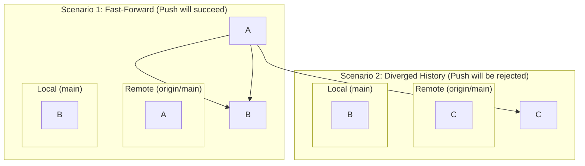
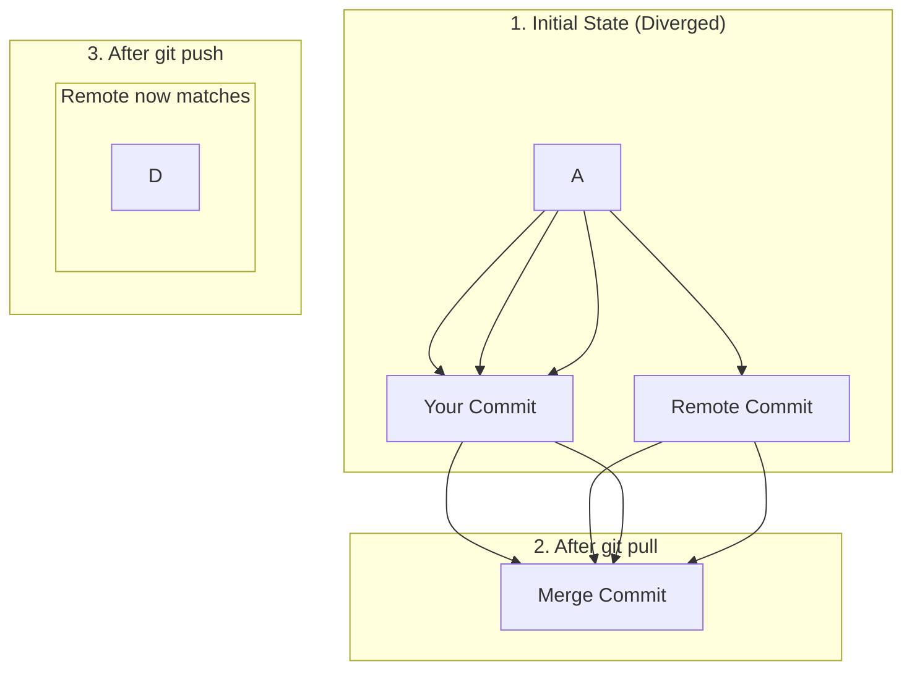
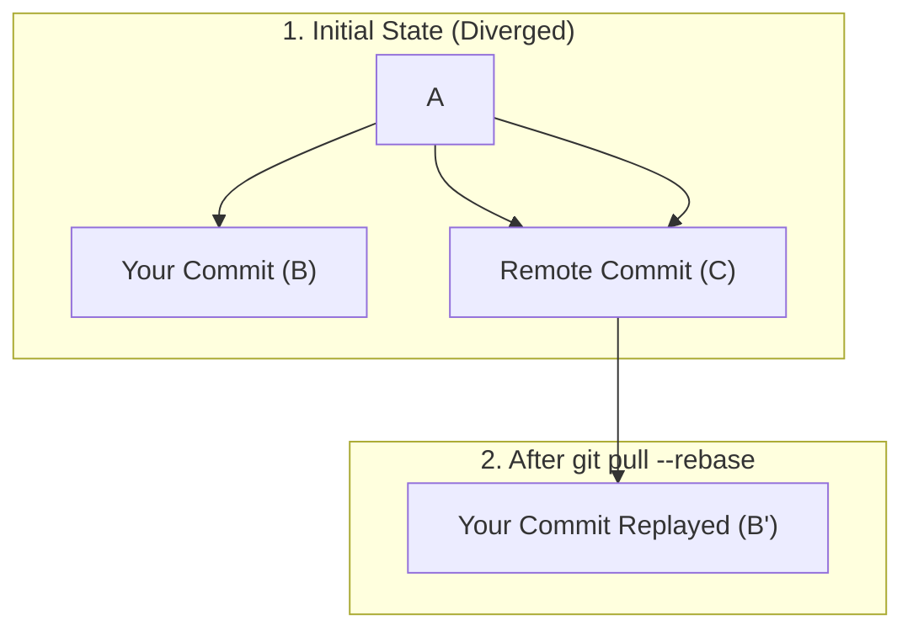

# 01-the-push-and-pull-dance.md

- **Purpose**: To detail the mechanics of `git push` and `git pull`, including common errors and the `--force` and `--rebase` options.
- **Estimated Difficulty**: 3/5
- **Estimated Reading Time**: 40 minutes
- **Prerequisites**: `00-understanding-remotes-and-tracking-branches.md`

---

### `git push`: Sending Your Story

`git push <remote> <branch>` is how you share your work. It attempts to update a branch on the remote repository with the commits from your local branch.

**The Golden Rule of Pushing:**
Git will only allow a push if it is a "fast-forward" update. This means your local branch's history must contain the remote branch's entire history. In other words, your new commits must be direct descendants of the remote's current tip.

**Diagram: Fast-Forward vs. Non-Fast-Forward**


### The "Rejected" Push

If someone else has pushed changes to the remote since you last fetched, your histories will have diverged. When you try to `git push`, you will get the dreaded "rejected" error.

```
! [rejected]        main -> main (non-fast-forward)
error: failed to push some refs to '...'
hint: Updates were rejected because the remote contains work that you do
hint: not have locally. This is usually caused by another repository pushing
hint: to the same ref. You may want to first integrate the remote changes
hint: (e.g., 'git pull ...') before pushing again.
```
This is not an error; it's a safety feature. Git is preventing you from overwriting the commits that someone else has pushed.

The solution is to first integrate the remote changes, which brings us to `pull`.

### `git pull`: Fetching and Merging

As we learned, `git pull` is `git fetch` followed by `git merge`. When your push is rejected, the standard workflow is:
1.  `git pull` (or `git fetch` then `git merge origin/main`).
2.  This will create a merge commit on your local machine, integrating the remote changes with your local commits.
3.  Your history now contains the remote history, so your next `git push` will be a fast-forward and will succeed.

**Diagram: Resolving a Rejected Push**


### `git pull --rebase`: The Cleaner Alternative

A `git pull` creates a merge commit. These are often "spurious" merge commits that clutter the history, just saying "merging remote changes."

A cleaner alternative is `git pull --rebase`. This is equivalent to:
1.  `git fetch origin`
2.  `git rebase origin/main`

Instead of creating a merge commit, it will take your local commits, temporarily set them aside, apply the new commits from the remote, and then "replay" your local commits on top of the updated remote history.

**Diagram: `pull --rebase`**

The result is a clean, linear history. This is the preferred workflow for many professional teams. You can configure Git to do this by default:
`git config --global pull.rebase true`

### The Nuclear Option: `git push --force`

`git push --force` (or `-f`) tells the remote: "I don't care what you have. Overwrite your branch with what I have." This is extremely dangerous on shared branches.

**It will permanently delete commits from the remote if they are not in your local history.**

**When is `--force` acceptable?**
- On your **own feature branch** that nobody else is using. For example, you cleaned up your local history with an interactive rebase and now your local branch has a different history from the remote version. The remote needs to be updated to match your new, cleaner history.

**A Safer Alternative: `git push --force-with-lease`**
This is a much safer version of `--force`. It tells the remote: "I'm going to force push, but **only if** your branch still points to the commit I think it does."

It checks that nobody has pushed new work to the remote branch since you last fetched. If someone has, the `--force-with-lease` will be rejected, preventing you from overwriting their work.

**Workflow: Safe Force Pushing**
1.  `git fetch origin`
2.  Do your local rebase or other history-rewriting.
3.  `git push --force-with-lease`

This should be your default for any force push. Many developers alias `git push -f` to `git push --force-with-lease`.

### Key Takeaways

- `git push` only succeeds on a "fast-forward" basis.
- If a push is rejected, you must first integrate remote changes.
- `git pull` merges remote changes.
- `git pull --rebase` replays your local work on top of remote changes, creating a cleaner history.
- `git push --force` is dangerous and overwrites remote history.
- `git push --force-with-lease` is the safer alternative that prevents you from overwriting work you haven't seen yet.

### Collaboration Pitfalls

- **Never force-push to a shared branch like `main` or `develop`.** The only exception is in a coordinated, "break-glass" emergency recovery scenario, and even then, it requires communication with the entire team.
- **Communicate before rebasing a shared feature branch.** If you and a colleague are both working on `feature-A`, and you decide to rebase it, their history will diverge from yours, causing major problems.
