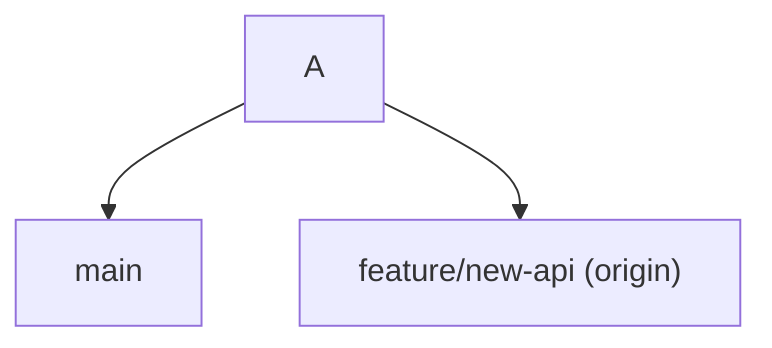
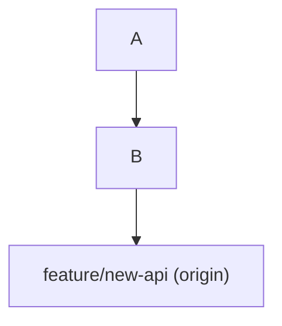
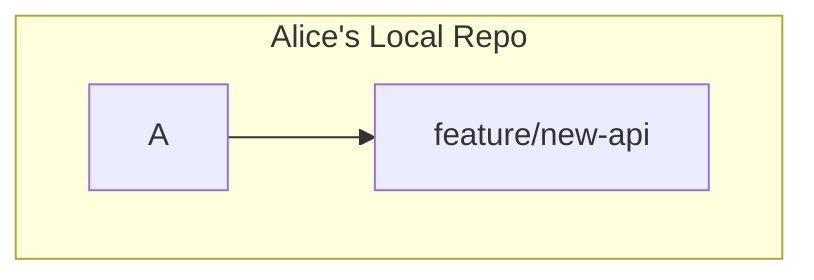
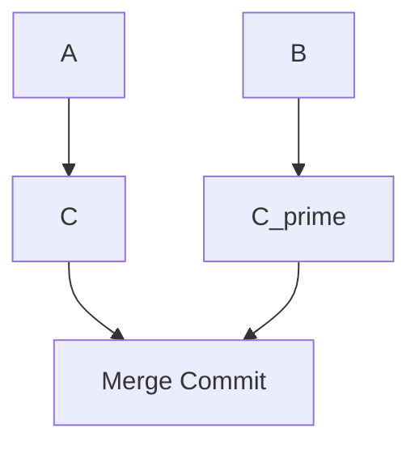

# 03-collaborative-rebasing-and-its-dangers.md

- **Purpose**: To discuss the workflow of collaborative rebasing on a shared feature branch and highlight the necessary communication and potential pitfalls.
- **Estimated Difficulty**: 4/5
- **Estimated Reading Time**: 40 minutes
- **Prerequisites**: `04-history-rewriting-and-archaeology/00-interactive-rebase.md`, `01-the-push-and-pull-dance.md`

---

### The Scenario

You and a colleague, Alice, are both working on a long-running feature branch called `feature/new-api`. The `main` branch is evolving as other teams merge their work. To avoid a massive, complex merge at the end, you decide to keep your feature branch up-to-date by periodically rebasing it on `main`.

This is a **collaborative rebase**, and it's a powerful but advanced workflow that requires discipline and communication.

### The "Happy Path" Workflow

1.  **Designate a "Rebaser"**: One person is responsible for performing the rebase. Let's say it's you.
2.  **Communication**: You announce to Alice: "I am about to rebase `feature/new-api` onto `main`. Please push all your local work to the remote branch and stop working on it for a few minutes."
3.  **Alice Pushes**: Alice runs `git push origin feature/new-api`.
4.  **You Fetch and Rebase**:
    ```bash
    # Ensure your local main is up-to-date
    $ git switch main
    $ git pull origin main

    # Switch to the feature branch and rebase it
    $ git switch feature/new-api
    $ git pull origin feature/new-api # Make sure you have Alice's latest work
    $ git rebase main
    # --- Resolve any conflicts that arise ---
    ```
5.  **Force Push the Rebased Branch**: Since the rebase has rewritten the history of `feature/new-api`, you must force push. Use the safe version.
    ```bash
    $ git push --force-with-lease origin feature/new-api
    ```
6.  **Communicate Again**: You announce: "The rebase is complete. Please update your local branch."
7.  **Alice Updates Her Local Branch**: Alice must now reset her local branch to match the new remote history.
    ```bash
    # From Alice's machine
    $ git switch feature/new-api
    $ git fetch origin

    # This is the crucial step. DO NOT PULL OR MERGE.
    $ git reset --hard origin/feature/new-api
    ```

If this process is followed, everyone is back in sync with a clean, rebased history.

### How It Goes Wrong: The Divergence Nightmare

What happens if Alice doesn't `reset --hard`? What if she tries to `git pull`?

Let's look at the graph.

**1. Before your rebase:**


**2. After your rebase and force push:**
The remote now has a new history. `C` is gone, replaced by `C'`.


**3. Alice's local state is still the old history:**
Alice's local `feature/new-api` still points to `C`.


**4. Alice tries to `git pull`:**
`git pull` means `fetch` + `merge`. Git fetches the new `origin/feature/new-api` (which points to `C'`). It then tries to merge `C'` into Alice's local branch `C`. Since they have a common ancestor (`A`) but different histories, Git creates a merge commit.

**5. Alice pushes her work:**
Alice's history now looks like this:

When Alice pushes, she has successfully **re-introduced the entire old history** that you just spent time cleaning up with the rebase. The commit graph is now a confusing mess of duplicated commits and unnecessary merge commits.

### The Rules of Collaborative Rebasing

This workflow can only succeed with strict adherence to these rules:

1.  **COMMUNICATE**: Over-communicate before, during, and after the rebase. No surprises.
2.  **ONE REBASER**: Only one person should perform the rebase on the shared branch.
3.  **PUSH BEFORE REBASE**: Everyone else must push their work *before* the rebase begins. Any work not pushed will be difficult to recover.
4.  **FORCE-WITH-LEASE**: The rebaser must use `git push --force-with-lease`, never a regular `--force`.
5.  **RESET, DON'T PULL**: Everyone else must update their local branches with `git fetch` and `git reset --hard origin/<branch>`, never `git pull` or `git merge`.

### Is It Worth It?

- **Pros**:
    - Keeps feature branch history linear and clean.
    - Makes the final merge back into `main` a simple fast-forward.
    - Avoids the "merge bubble" commits that can clutter a project's history.

- **Cons**:
    - High risk if the team is not disciplined.
    - Requires active, real-time communication.
    - Can be confusing for less experienced Git users.
    - Rewriting shared history is generally an anti-pattern, and this is a controlled exception.

**Conclusion**: Collaborative rebasing is a high-risk, high-reward strategy. It should only be used by experienced teams who understand the mechanics and are committed to the communication overhead. For most teams, a standard merge workflow (`git pull`) is safer and simpler.

### Interview Notes

- **Question**: "My teammate rebased our shared feature branch and force-pushed. Now I can't push my work. What happened and how do I fix it?"
- **Answer**: "What happened is that your local feature branch and the remote feature branch have diverged histories. Your teammate rewrote the remote's history with the rebase. You should not try to merge the two, as this will re-introduce the old, messy history. The correct procedure is to rebase your local work on top of the new remote history. The steps are: 1. `git fetch origin`. 2. `git rebase origin/<feature-branch>`. This will take your unique local commits and replay them on top of the newly rebased remote branch. 3. After resolving any conflicts, you should be able to push normally. This is essentially a manual version of what `git pull --rebase` does."
