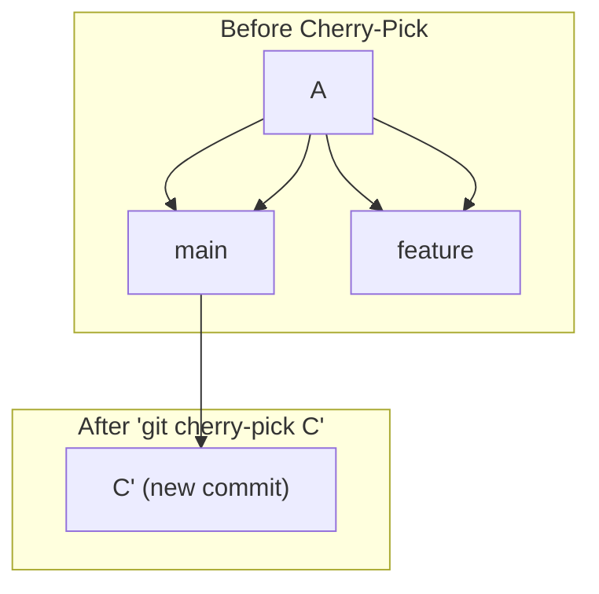

# 01-git-cherry-pick.md

- **Purpose**: To explain the `git cherry-pick` command, its use cases, and the potential dangers of creating duplicate commits.
- **Estimated Difficulty**: 3/5
- **Estimated Reading Time**: 30 minutes
- **Prerequisites**: `00-interactive-rebase.md`

---

### What is Cherry-Picking?

`git cherry-pick <commit-sha>` is a command that takes a single commit from one branch and applies it as a new commit on your current branch.

It's like copying a commit. Git looks at the change introduced by the specified commit and re-applies that same change on top of your current `HEAD`. This creates a **new commit** with the same content and message, but a different SHA-1 (because it has a different parent and timestamp).

**Diagram: The Cherry-Pick Operation**

After running `git cherry-pick C` while on `main`, a new commit `C'` is created. `C'` has the same patch (changes) as `C`, but it is a distinct commit.

### Common Use Cases

**1. The Accidental Commit**
You accidentally made a commit on the `main` branch when you meant to make it on a feature branch.

```bash
# You are on main
$ git commit -m "New feature work" # Oops!

# 1. Create the feature branch where it should have been
$ git switch -c new-feature

# 2. Go back to main and remove the commit
$ git switch main
$ git reset --hard HEAD~1

# 3. Your main branch is now clean, and the commit lives safely on new-feature.
```
But what if you can't just move `main` back? What if other work has happened?

```bash
# You are on main, and you realize commit 'a1b2c3d' should be on a feature branch.
$ git log
# ...
# commit a1b2c3d (HEAD -> main) New feature work
# commit e4f5g6h Some other important commit

# 1. Create the feature branch from the correct starting point
$ git switch -c new-feature e4f5g6h

# 2. "Copy" the accidental commit over
$ git cherry-pick a1b2c3d

# 3. Now, remove the commit from main. This requires a rebase.
$ git switch main
$ git rebase -i HEAD~2 # Go back far enough to see the bad commit
# In the editor, 'drop' the line for commit a1b2c3d.
# This is a history rewrite on main, so it should only be done if you haven't pushed yet!
```

**2. The Hotfix Backport**
You fixed a critical bug on your `main` branch, but you also need to apply this fix to an older `release-v1.0` branch that is still supported. You don't want to merge all of `main` into the release branch, you just want that one specific bug fix.

```bash
# On main, you just committed the fix
$ git log -1
# commit 7k8l9m0 (HEAD -> main) Fix: Critical security vulnerability

# Switch to the release branch
$ git switch release-v1.0

# Cherry-pick the fix commit
$ git cherry-pick 7k8l9m0
# A new commit is created on the release branch with the same fix.
```

### The Dangers of Cherry-Picking: Duplicate Commits

The biggest danger of cherry-picking is that it can be difficult to remember which commits have been picked and where. If you cherry-pick a commit from `feature-A` to `main`, and then later try to `git merge feature-A`, you can run into confusing conflicts.

Git is smart enough to sometimes handle this, but it's not foolproof. When you merge, Git might see the same change being introduced twice (once in the original commit on the feature branch, and once in the cherry-picked commit on `main`) and get confused, flagging a conflict.

**How to Mitigate This:**
- When you cherry-pick, use the `-x` option.
  `git cherry-pick -x 7k8l9m0`
  This will automatically append a line to the new commit's message saying `(cherry picked from commit 7k8l9m0...)`. This leaves a breadcrumb trail, making it much easier for future developers (including yourself) to understand where this commit came from.

- **Prefer merging over cherry-picking.** If you need more than one or two commits from another branch, it's almost always better to merge that branch (or rebase your branch onto it). Cherry-picking is for surgical, single-commit operations.

### Cherry-Picking a Range of Commits

You can cherry-pick a range of commits.
`git cherry-pick A..B`
This will pick all commits *after* `A` up to and including `B`. Note that `A` itself is not included.

### Key Takeaways

- `git cherry-pick` applies the change from a single commit as a new commit on the current branch.
- It's useful for hotfixes, backporting, and correcting commits made on the wrong branch.
- It creates a **new commit**, which can lead to confusion if the original branch is later merged.
- Use `git cherry-pick -x` to add metadata about the original commit, leaving a clear audit trail.
- Prefer `merge` or `rebase` for integrating larger series of commits. Cherry-picking is for targeted, surgical strikes.

### Interview Notes

- **Question**: "When would you use `git cherry-pick` instead of `git merge`?"
- **Answer**: "`git merge` is for integrating the entire history of one branch into another. `git cherry-pick` is for when you only need one or two specific commits from another branch, but not the entire branch. A classic example is backporting a hotfix. You might have a critical bug fix on your `main` branch that also needs to be applied to an older, stable release branch. You wouldn't want to merge all of `main` into the release branch, as that would bring in many other unwanted features. Instead, you would check out the release branch and `cherry-pick` just the single commit containing the bug fix."
