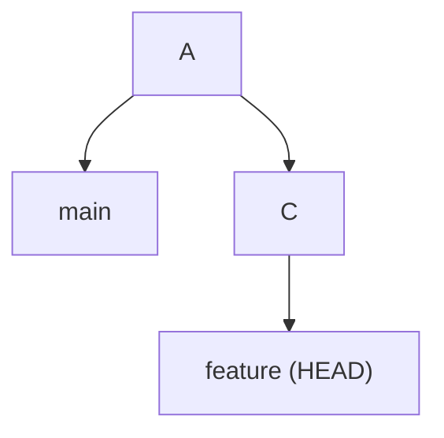
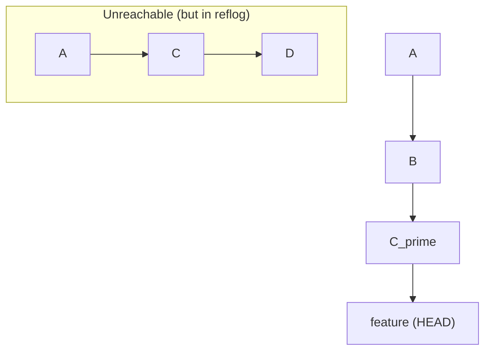
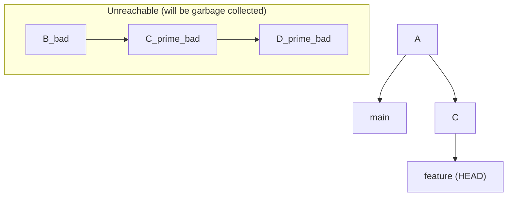

# 01-recovering-from-a-bad-rebase.md

- **Purpose**: To provide a step-by-step guide for recovering from a complex or failed rebase using the reflog and `git reset`.
- **Estimated Difficulty**: 4/5
- **Estimated Reading Time**: 40 minutes
- **Prerequisites**: `00-the-reflog-your-safety-net.md`, `04-history-rewriting-and-archaeology/00-interactive-rebase.md`

---

### The Scenario: The Rebase from Hell

You are working on a feature branch with several commits. You decide to clean it up and update it with the latest changes from `main`.

```bash
$ git rebase -i main
```

You start the rebase, but you make a mess.
- You accidentally `drop` a commit you needed.
- You get a series of horrible merge conflicts that you can't seem to resolve correctly.
- You finally finish the rebase, but your code is broken, and the history looks wrong.

You've run `git rebase --continue` too many times, and `git rebase --abort` is no longer an option. Your branch is a disaster. How do you go back?

### The Solution: `ORIG_HEAD` and the Reflog

Git is smart. Before it starts a dangerous operation like a rebase or a merge, it stores the original location of `HEAD` in a special pointer called `ORIG_HEAD`.

**1. The Easiest Escape Hatch**
If you have *just* finished the rebase and haven't done anything else, you can often recover with a single command:

```bash
$ git reset --hard ORIG_HEAD
```
This will reset your branch and working directory back to the exact state it was in right before you started the rebase. This is the quickest and cleanest way to undo a completed rebase.

**2. The Reflog Method (More Robust)**
Sometimes, `ORIG_HEAD` might have been overwritten by another command. The reflog is the more fundamental and reliable way to recover.

Let's trace the steps in the reflog.

**Your history before the rebase:**
```
$ git lol
* 1a2b3c4 (HEAD -> feature) Feat: Add final touches
* 5d6e7f8 Feat: Add business logic
* 9g8h9i0 Feat: Add data model
* ... (main branch history)
```

You run `git rebase -i main` and it goes horribly wrong. Your history now looks like a mess.

**Consult the reflog:**
```bash
$ git reflog
c5b4a3d (HEAD -> feature) HEAD@{0}: rebase -i (finish): returning to refs/heads/feature
c5b4a3d (HEAD -> feature) HEAD@{1}: rebase -i (squash): ...
... (many rebase steps) ...
1a2b3c4 HEAD@{5}: rebase -i (start): checkout main
...
```
The reflog shows a detailed diary of the rebase. The most important line is the one right before the rebase started. In this example, it's `HEAD@{5}`. At that point, `HEAD` was at `1a2b3c4`, which was the tip of your feature branch before you ruined it.

**The Recovery:**
All you need to do is reset your branch back to that state.

```bash
$ git reset --hard 1a2b3c4
# Or, using the reflog pointer:
$ git reset --hard HEAD@{5}
```
Your branch is now completely restored to its pre-rebase state. All the "new" commits created during the bad rebase are now orphaned and will eventually be garbage collected. You are safe to try the rebase again, this time more carefully.

### Diagram: Rebase and Recovery

**1. Initial State**


**2. After Bad Rebase**
The rebase creates new commits (`C'` and `D'`) on top of `main`. Your `feature` branch now points to `D'`. The old commits `C` and `D` are now "unreachable".


**3. After `git reset --hard D`**
You use the reflog to find the SHA of the original commit `D`. You reset your `feature` branch back to it. The bad rebase commits (`C'` and `D'`) are now the ones that are unreachable.


### Key Takeaways

- Git provides safety nets for dangerous operations.
- `ORIG_HEAD` is a pointer to the state of `HEAD` before a merge or rebase. `git reset --hard ORIG_HEAD` is the first thing to try after a bad merge/rebase.
- The reflog provides a complete history of your branch's movements.
- To recover from a bad rebase, use `git reflog` to find the commit your branch pointed to *before* the rebase started, and use `git reset --hard` to return to that commit.
- This technique makes experimenting with history rewriting much safer. If you know you can always get back, you can be more confident in using powerful tools like `rebase`.

### Recovery Drill

1.  Create a branch with 3-4 commits.
2.  Start an interactive rebase (`git rebase -i HEAD~4`).
3.  In the todo list, `drop` one of the middle commits and `squash` the other two.
4.  Pretend this was a mistake.
5.  Use `git reflog` to find the SHA of the branch tip before you started the rebase.
6.  Use `git reset --hard` to restore your branch to its original state. Verify with `git log`.
