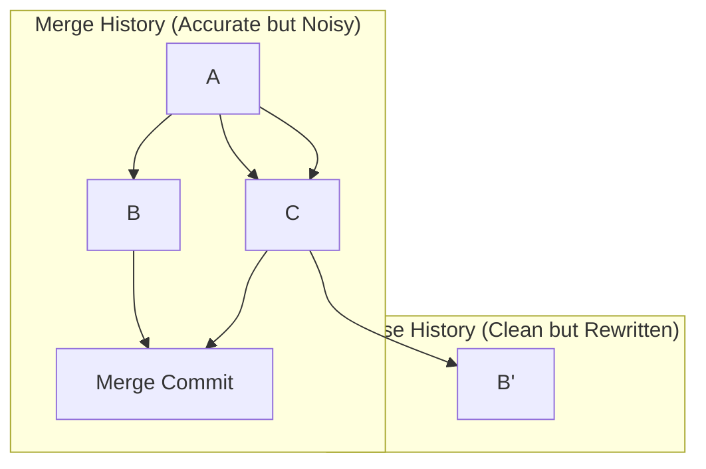

# 00-branching-strategy-overview.md

- **Purpose**: To provide a high-level overview of what a branching strategy is and why it's crucial for team collaboration.
- **Estimated Difficulty**: 2/5
- **Estimated Reading Time**: 20 minutes
- **Prerequisites**: `03-collaboration-and-remotes` module.

---

### What is a Branching Strategy?

A branching strategy (or branching model) is a set of rules and conventions that a software team agrees to follow when using Git. It defines:

- What kinds of branches exist (e.g., feature, release, hotfix).
- What the lifetime of these branches is.
- How and when branches are created.
- How and when branches are merged back together.
- Which branches represent which environments (development, staging, production).

A good branching strategy provides a shared understanding and a common playbook for collaboration, reducing chaos and making the development process more predictable.

### Why Do You Need One?

For a solo developer, branching is simple. For a team, it's complex. Without a strategy, you end up with questions like:
- "Where do I commit my new feature?"
- "How do I fix a bug in production?"
- "Is the `main` branch always stable?"
- "When should I create a new branch?"
- "How do we prepare for a release?"

A branching strategy answers these questions, providing a framework for organized, parallel development.

### The Core Trade-offs

Different branching strategies optimize for different goals. There is no single "best" strategy; it's a series of trade-offs.

**1. Stability vs. Speed**
- **High Stability**: Strategies with many long-lived branches (e.g., `develop`, `release`, `main`) provide a lot of isolation and testing gates, ensuring the `main` branch is always rock-solid. This can slow down the time it takes for a feature to get to production.
- **High Speed**: Strategies with short-lived feature branches that merge directly to `main` (e.g., Trunk-Based Development) get code into production faster but rely heavily on automated testing and feature flags to maintain stability.

**2. History Readability**
- **Merge Commits**: Using `git merge` creates a graph that accurately shows where and when lines of development were merged. Some find this "merge bubble" history noisy.
- **Rebase/Squash**: Using `git rebase` and squashing commits creates a perfectly linear history on the main branch. This is very clean to read but loses the context of how a feature was developed.

**Diagram: Merge vs. Rebase History**

### Common Strategies We Will Discuss

In this module, we will explore three of the most common and influential branching strategies:

1.  **GitFlow**: The classic, highly structured model with multiple long-lived branches. It prioritizes stability and is excellent for projects with scheduled releases.
2.  **GitHub Flow**: A simpler, lightweight model optimized for continuous deployment. It's great for web apps and teams that ship frequently.
3.  **Trunk-Based Development (TBD)**: The most streamlined model, where all developers commit to a single `main` branch (the "trunk"). It maximizes speed and is used by large-scale tech companies but requires a very mature engineering culture.

### Choosing a Strategy

The right strategy for your team depends on:
- **Team Size and Experience**: Larger, more distributed teams may benefit from the structure of GitFlow. Smaller, more experienced teams might thrive with the speed of TBD.
- **Release Cadence**: Do you release every two weeks, or multiple times a day?
- **Project Type**: A desktop application with versioned releases has different needs than a web service that is continuously deployed.
- **Engineering Maturity**: Does your team have robust automated testing, CI/CD, and feature flags? These are prerequisites for faster-moving strategies.

In the following lessons, we will dissect each of these models, analyzing their rules, pros, cons, and ideal use cases.
