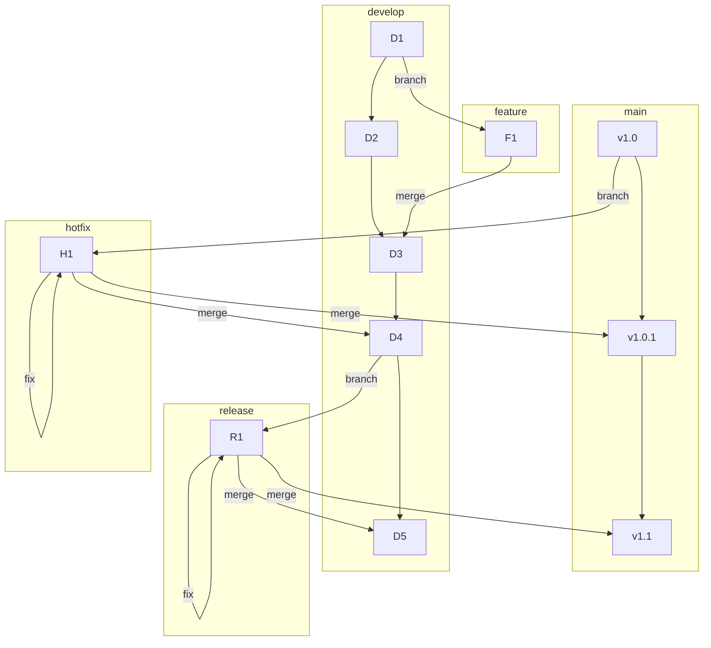

# 01-gitflow-a-structured-approach.md

- **Purpose**: To provide a detailed explanation of the GitFlow branching model, its branches, and its workflows.
- **Estimated Difficulty**: 3/5
- **Estimated Reading Time**: 45 minutes
- **Prerequisites**: `00-branching-strategy-overview.md`

---

### What is GitFlow?

GitFlow is a branching model introduced by Vincent Driessen in 2010. It is a strict, structured model designed to manage large projects with scheduled release cycles. It is defined by the existence of several long-lived branches and a clear set of rules for how other branches interact with them.

GitFlow is optimized for projects that have a distinct concept of a "release" (e.g., version 1.0, version 1.1).

### The Main Branches

GitFlow uses two primary, permanent branches:

1.  **`main` (or `master`)**
    - This branch represents the official, production-ready release history.
    - The code on `main` should always be stable and deployable.
    - It is only ever updated by merging in from `release` branches or `hotfix` branches.
    - Every commit on `main` is a new production release and should be tagged with a version number (e.g., `v1.0.1`).

2.  **`develop`**
    - This is the primary branch for integration and development. It contains the latest delivered development changes for the next release.
    - This is the branch where all `feature` branches are merged back into.
    - Nightly builds or CI builds are often run against `develop`.

### Supporting Branches

GitFlow uses three types of temporary, supporting branches:

1.  **`feature` branches**
    - **Purpose**: To develop new features.
    - **Branched from**: `develop`.
    - **Merged back into**: `develop`.
    - **Naming**: `feature/user-authentication`, `feature/shopping-cart`.
    - **Workflow**: A developer creates a feature branch, works on it, and when the feature is complete, they merge it back into `develop` (usually via a Pull Request). They never interact directly with `main`.

2.  **`release` branches**
    - **Purpose**: To prepare for a new production release. This is where last-minute bug fixes, version number bumps, and other release-specific tasks happen.
    - **Branched from**: `develop`.
    - **Merged back into**: `main` **and** `develop`.
    - **Naming**: `release/v1.1.0`.
    - **Workflow**: When the `develop` branch is deemed feature-complete for the next release, a `release` branch is created. No new features are added to this branch. Once it is stable and ready, it is merged into `main` (and tagged with the version number) and also merged back into `develop` to ensure any bug fixes made in the release branch are incorporated into future development.

3.  **`hotfix` branches**
    - **Purpose**: To fix a critical bug in a production release.
    - **Branched from**: `main`.
    - **Merged back into**: `main` **and** `develop`.
    - **Naming**: `hotfix/fix-login-bug`.
    - **Workflow**: If a bug is found in production (`main`), a `hotfix` branch is created directly from the corresponding tag on `main`. The fix is made and committed. The `hotfix` branch is then merged into `main` (and a new patch version is tagged, e.g., `v1.0.2`) and also merged into `develop` to ensure the fix is included in the next release.

### Diagram: The GitFlow Model

### Pros and Cons of GitFlow

**Pros:**
- **Highly Structured**: Provides a robust framework that is easy to follow.
- **Parallel Development**: `develop` is separate from `main`, so one team can be preparing a release while another is working on features for the next release.
- **Stability**: The `main` branch is always clean and production-ready. Hotfixes are handled in a clean, isolated way.
- **Good for Versioned Software**: It's a natural fit for software that has explicit version numbers and release cycles (e.g., desktop apps, mobile apps, APIs with versioned contracts).

**Cons:**
- **Complexity**: It's the most complex of the common models. The number of branches can be intimidating for new developers or small teams.
- **Slower Cadence**: The path for a feature to get to production is long (feature -> develop -> release -> main). This is not ideal for web apps that practice continuous deployment.
- **`develop` as a Bottleneck**: `develop` can become a source of integration hell if feature branches are too long-lived.
- **The "Merge Back" Problem**: Forgetting to merge a `release` or `hotfix` branch back into `develop` is a common and painful mistake.

### Conclusion

GitFlow is a powerful and mature model, but it is not for everyone. It is an excellent choice for projects with a formal release process. For teams that want to ship faster and more frequently, a simpler model like GitHub Flow or Trunk-Based Development might be a better fit.
