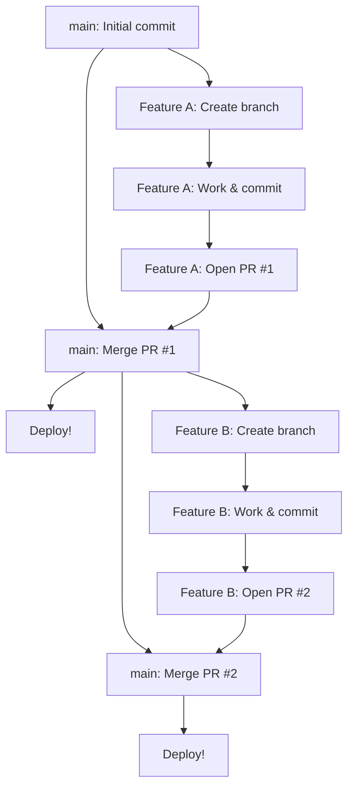

# 02-github-flow-a-lightweight-alternative.md

- **Purpose**: To explain the GitHub Flow model, its simplicity, and its focus on continuous deployment.
- **Estimated Difficulty**: 2/5
- **Estimated Reading Time**: 30 minutes
- **Prerequisites**: `00-branching-strategy-overview.md`

---

### What is GitHub Flow?

GitHub Flow is a lightweight, branch-based workflow that is optimized for teams that practice continuous deployment. It was popularized by GitHub and is used by many web development teams.

The entire model is based on a few simple rules and one primary, long-lived branch: `main`.

### The Rules of GitHub Flow

1.  **Anything in `main` is deployable.**
    - The `main` branch must always be stable and ready to be deployed to production at a moment's notice.

2.  **To work on something new, create a descriptively named branch from `main`.**
    - Example: `feature/add-user-avatars`, `fix/login-page-css`.
    - This isolates your work from the main codebase.

3.  **Commit to that branch locally and regularly push your work to the same named branch on the server.**
    - This keeps your work backed up and visible to others.

4.  **When you need feedback or help, or you think the branch is ready, open a pull request.**
    - This is the central point of the workflow. The pull request (PR) is where code review, discussion, and automated checks happen.

5.  **After your pull request has been reviewed and approved, merge it into `main`.**
    - This is typically done by the feature's author after getting approval.

6.  **Once your changes are merged into `main`, they should be deployed to production immediately.**
    - This is the core principle of continuous deployment. The merge to `main` triggers an automated deployment. If there's a problem in production, it's addressed by reverting the change or opening a new PR with a fix.

### Diagram: The GitHub Flow Model

### How are Hotfixes Handled?

There is no special `hotfix` branch in GitHub Flow. A bug in production is just another issue to be fixed. The process is identical:
1.  Create a new branch from `main`: `fix/critical-login-bug`.
2.  Write a test that reproduces the bug.
3.  Fix the bug.
4.  Open a pull request.
5.  Get it reviewed and approved (this is usually expedited for critical fixes).
6.  Merge it to `main`.
7.  The merge triggers a deployment, pushing the fix to production.

### Pros and Cons of GitHub Flow

**Pros:**
- **Simplicity**: It's extremely easy to learn and follow. There is only one permanent branch to worry about.
- **Speed / Continuous Delivery**: The model is designed to get changes from idea to production as quickly as possible. The cycle time is very short.
- **Clean History**: If you use "Squash and Merge" on your pull requests, the `main` branch history becomes a clean, linear, and easy-to-read list of features and fixes that have been deployed.
- **PR-centric**: It puts code review and collaboration at the heart of the process.

**Cons:**
- **Not Suitable for Versioned Releases**: This model is not a good fit for software that needs to support multiple versions in production (e.g., a mobile app where users might be on v1.2 and v1.3 simultaneously). There are no `release` branches.
- **Potential for a Broken `main`**: The model relies heavily on a robust CI/CD pipeline and a strong testing culture. If a bad PR is merged, production is broken immediately. There is no `develop` branch to act as a buffer.
- **Deployment Overhead**: The assumption that every merge to `main` is deployed might not be feasible for all projects or organizations.

### GitHub Flow vs. GitFlow

| Feature           | GitFlow                                       | GitHub Flow                               |
| ----------------- | --------------------------------------------- | ----------------------------------------- |
| **Primary Branch**| `main` and `develop`                          | `main` only                               |
| **Best For**      | Scheduled, versioned releases                 | Continuous deployment                     |
| **Speed**         | Slower, more deliberate                       | Very fast                                 |
| **Complexity**    | High                                          | Low                                       |
| **Hotfixes**      | Special `hotfix` branches from `main`         | Regular feature branches from `main`      |
| **Release Prep**  | Dedicated `release` branches                  | Does not exist; `main` is always the release |

### Conclusion

GitHub Flow is a simple, clean, and fast model that is an excellent choice for many modern web applications and services. Its focus on continuous delivery and pull-request-driven development has made it a standard for teams that want to move quickly. However, its reliance on a strong testing culture and its unsuitability for versioned releases mean it's not a one-size-fits-all solution.
