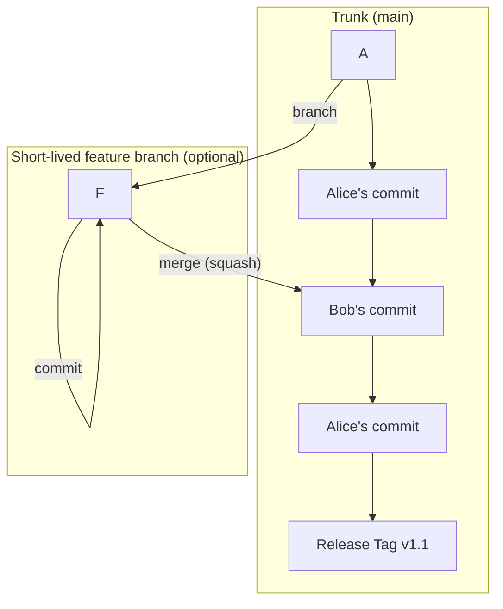
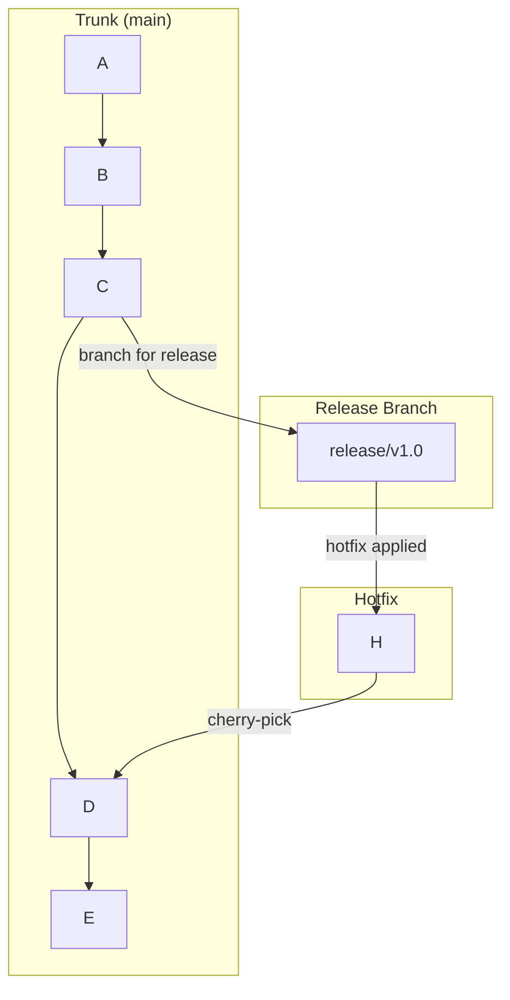

# 03-trunk-based-development-tbd.md

- **Purpose**: To explain the principles and practices of Trunk-Based Development (TBD), its benefits for large teams, and its demanding prerequisites.
- **Estimated Difficulty**: 4/5
- **Estimated Reading Time**: 45 minutes
- **Prerequisites**: `00-branching-strategy-overview.md`

---

### What is Trunk-Based Development?

Trunk-Based Development (TBD) is a branching model where all developers commit their work directly to a single shared branch, called the "trunk" (commonly `main` or `trunk`).

This might sound like chaos, but it's a highly disciplined methodology used by some of the world's largest and most efficient tech companies (like Google and Facebook). The core idea is to avoid the "merge hell" associated with long-lived feature branches by integrating code continuously in small, frequent batches.

### The Core Principles of TBD

1.  **One Source of Truth**: The trunk is the single source of truth for the entire codebase.
2.  **Short-Lived Branches (or No Branches)**:
    - **For small changes**: Developers commit directly to the trunk.
    - **For larger features**: Developers create very short-lived feature branches (often lasting less than a day) and merge them back into the trunk quickly. The goal is to never let a branch diverge significantly.
3.  **Feature Flags (or Toggles)**: How do you commit unfinished features to the trunk without breaking production? The answer is feature flags. All new, incomplete code is wrapped in a conditional block that is disabled by default in production.
    ```javascript
    if (featureIsEnabled('new-profile-page')) {
      // Render the new, unfinished profile page
    } else {
      // Render the old, stable profile page
    }
    ```
    This decouples code deployment from feature release. The code can go to production safely, and the feature can be turned on for testers or a percentage of users when it's ready.
4.  **Comprehensive Automated Testing**: Since code is being integrated continuously, a fast and extremely robust suite of automated tests is non-negotiable. Commits that break the build or fail tests must be fixed or reverted immediately. The trunk must *always* be in a releasable state.
5.  **Continuous Integration (CI)**: Every commit to the trunk should trigger a full build and test run. A broken build is a "stop the world" event that must be fixed immediately.

### Diagram: Trunk-Based Development Model


The history on the trunk is a clean, linear sequence of small, integrated changes.

### Release Strategy in TBD

Since the trunk is always releasable, creating a release is simple.
- You create a **release branch** from a specific commit on the trunk.
- This release branch is for stabilization only. Only critical bug fixes are cherry-picked onto it. No new features are developed on it.
- The trunk, meanwhile, continues to move forward with new development.

**Diagram: TBD Release Branching**


### Pros and Cons of TBD

**Pros:**
- **Eliminates Merge Hell**: By integrating continuously, you avoid the large, painful merges that come from long-lived feature branches.
- **Increases Collaboration and Code Visibility**: Everyone is working on the same codebase. You see changes from other developers immediately.
- **Enables Continuous Code Review**: Code reviews are done on small, incremental commits, which is much easier and faster than reviewing a massive feature branch.
- **Maximizes Development Speed**: It is the fastest path from idea to integrated code.

**Cons:**
- **Requires Extreme Discipline**: A broken trunk blocks the entire team. Developers must be diligent about not committing code that breaks the build.
- **Heavy Reliance on Feature Flags**: The entire system depends on a robust feature flagging system. This adds complexity to the code.
- **Requires a Mature Engineering Culture**: TBD is not something you can adopt overnight. It requires a significant investment in automated testing, CI/CD infrastructure, and developer training.
- **Can be Difficult for Beginners**: The idea of committing directly to the main branch can be intimidating and requires a high degree of trust and responsibility.

### TBD vs. GitFlow/GitHub Flow

- **GitFlow** uses long-lived branches to manage releases. **TBD** uses the trunk and feature flags.
- **GitHub Flow** uses pull requests on feature branches as the primary integration and release mechanism. **TBD** integrates directly to the trunk and releases from it.

TBD is, in many ways, the philosophical opposite of GitFlow. GitFlow uses branches to manage risk and complexity. TBD manages risk and complexity through testing, feature flags, and continuous integration.

### Conclusion

Trunk-Based Development is a powerful model for high-velocity, large-scale software development. It is the most efficient way to integrate the work of many developers. However, it is also the most demanding. It should only be adopted by teams with a strong commitment to engineering excellence, a robust testing culture, and the infrastructure to support true continuous integration.
