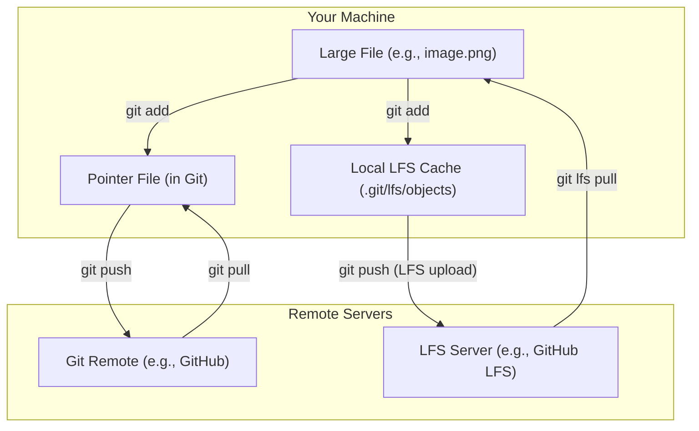

# 03-git-lfs-for-large-file-versioning.md

- **Purpose**: To provide a detailed guide on using Git LFS (Large File Storage) to manage large binary files within a Git repository.
- **Estimated Difficulty**: 3/5
- **Estimated Reading Time**: 40 minutes
- **Prerequisites**: Basic understanding of Git's object model.

---

### The Problem with Large Files in Git

Git is a content-addressable filesystem. The SHA-1 of an object is a hash of its contents. This is fantastic for text files, where a small change results in a new blob that can be efficiently compressed against the old one.

However, for large binary files (videos, audio, 3D models, compiled binaries), this model breaks down:
1.  **No Delta Compression**: A tiny change to a 100MB binary file results in a completely new 100MB blob. Git's delta compression is ineffective on most binary formats.
2.  **Repository Bloat**: Every version of every large file is stored in the `.git` directory forever. A few edits to a large file can make the repository gigabytes in size.
3.  **Slow Operations**: Cloning, pushing, and pulling become painfully slow as you have to transfer these huge files.

Storing large binary files directly in Git is an anti-pattern that leads to unusable repositories.

### The Solution: Git LFS

Git LFS (Large File Storage) is an open-source extension to Git that solves this problem. It works by replacing large files in your Git repository with small text "pointer files." The actual large files are stored on a separate LFS server.

**How it Works:**
1.  You tell Git LFS which files to track (e.g., `*.psd`).
2.  When you `git add` a large file, Git LFS intercepts it.
3.  It calculates the file's SHA-256 hash.
4.  It stores the actual large file in a local LFS cache (`.git/lfs/objects`).
5.  It creates a small pointer file (around 130 bytes) that looks like this:
    ```
    version https://git-lfs.github.com/spec/v1
    oid sha256:4d7a214614ab2935c943f9e0ff69d223...
    size 12345678
    ```
6.  This small pointer file is what gets staged and committed to your Git repository.
7.  When you `git push`, the Git commits (with the pointer files) are pushed to your Git remote. Then, the LFS client uploads the actual large files from your local cache to the LFS server.

**Diagram: The LFS Push/Pull Flow**


### The Git LFS Workflow

**1. Installation (One-time)**
First, you need to install the Git LFS client on your machine. This can be done via package managers like Homebrew, apt, etc.
After installation, you need to install it into your Git configuration:
`git lfs install`

**2. Tracking Files**
In your repository, you need to tell LFS which files to manage.
`git lfs track "*.iso"`
`git lfs track "assets/audio/*"`

This command creates or updates a `.gitattributes` file in your repository. This file is crucial and must be committed. It contains the tracking patterns:
```
*.iso filter=lfs diff=lfs merge=lfs -text
assets/audio/* filter=lfs diff=lfs merge=lfs -text
```

**3. Committing and Pushing**
You work as you normally would.
`git add my-large-file.iso`
`git add .gitattributes`
`git commit -m "Add large ISO file"`
`git push origin main`

The LFS client works automatically in the background during the `push` to upload the large file.

**4. Cloning and Pulling**
When a teammate clones a repository that uses LFS, they need to have the LFS client installed.
- `git clone`: This will clone the Git repository and then automatically download the LFS files needed for the checked-out commit.
- `git pull`: This will pull the Git commits and then automatically download any required LFS files.

If for some reason the LFS files aren't downloaded, you can download them manually with:
`git lfs pull`

### LFS Commands to Know

- `git lfs ls-files`: Lists all the LFS files currently tracked in your repository.
- `git lfs status`: Shows the status of LFS files in your working directory.
- `git lfs prune`: Deletes old files from your local LFS cache (`.git/lfs/objects`) that are no longer referenced by any recent commits. This is useful for freeing up local disk space.

### Pitfalls and Best Practices

- **Install LFS Before Cloning**: If you clone a repo that uses LFS without having the LFS client installed, you will only see the small pointer files in your working directory, not the actual large files. This is a common source of confusion for new users.
- **Commit `.gitattributes`**: The `.gitattributes` file is how Git knows which files to send to LFS. It must be committed to your repository.
- **Cost and Storage**: LFS servers have storage and bandwidth costs. Platforms like GitHub and GitLab offer a free tier, but you may need to pay for additional storage if you have a lot of large files.
- **Don't Track Everything**: Only track file patterns that are actually large and binary. Tracking normal text files (like source code) with LFS is unnecessary and inefficient.
- **Migrating an Existing Repo**: If you have a repository that already has large files committed directly, you need to use a tool like `git-lfs-migrate` or `git filter-repo` to rewrite the history and move those files to LFS. This is a destructive operation that requires coordination with your team.

### Conclusion

Git LFS is the industry-standard solution for versioning large binary files alongside your source code. It keeps your core Git repository small and fast while providing a seamless workflow for developers, who can use the same `add`, `commit`, and `push` commands they are used to.
