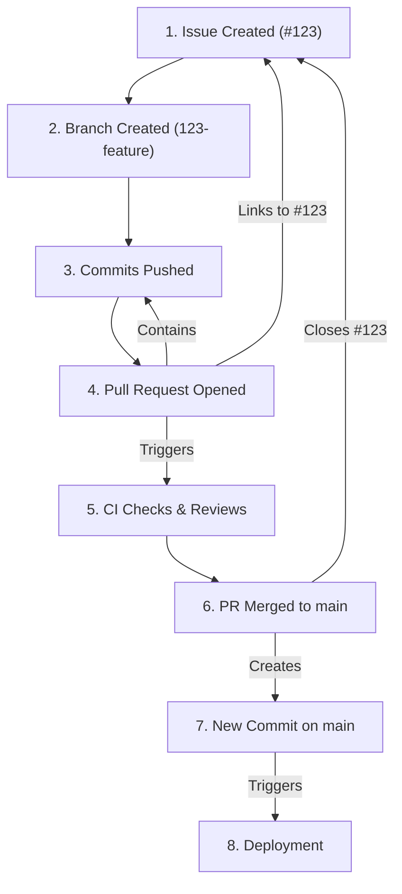

# 03-git-driven-project-management.md

- **Purpose**: To explore how Git and platforms like GitHub/GitLab can be used as the central hub for project management, not just version control.
- **Estimated Difficulty**: 3/5
- **Estimated Reading Time**: 35 minutes
- **Prerequisites**: `03-collaboration-and-remotes/04-pr-and-code-review-workflows.md`

---

### Beyond Version Control

Git is a tool for managing source code. But modern development platforms built around Git (like GitHub, GitLab, and Bitbucket) have evolved into comprehensive project management suites. By integrating your project management workflow directly with your version control, you can create a seamless, transparent, and highly efficient process.

This is "Git-Driven Project Management," where the state of the repository is the state of the project.

### The Core Components

**1. Issues: The Single Source of Truth for Tasks**
- An **Issue** is the atomic unit of work. It can be a bug report, a feature request, a refactoring task, or a question.
- **Good Issues** contain:
    - A clear, descriptive title.
    - A detailed description of the problem or feature.
    - Steps to reproduce (for bugs).
    - Acceptance criteria (what does "done" look like?).
    - Labels for categorization (`bug`, `feature`, `priority:high`, `area:api`).
- All work should start with an Issue. This ensures that every change to the codebase is tied to a documented reason.

**2. Branches: The Embodiment of Work in Progress**
- When a developer decides to work on an Issue, they create a branch.
- **Branch Naming Convention**: The branch name should reference the issue number. This creates an automatic link.
    - `123-add-login-page`
    - `bug/456-fix-pagination-error`
- The branch represents the active development context for that specific task.

**3. Commits: The Narrative of Development**
- As the developer works, they create a series of commits on the branch.
- As discussed in `01-crafting-the-perfect-commit-message.md`, these commit messages should tell the story of how the problem was solved.
- By referencing the issue number in the commit messages (`Refs: #123`), you create even more links between the code and the task.

**4. Pull Requests: The Forum for Collaboration and Quality**
- When the work is ready for review, the developer opens a Pull Request (PR) to merge their branch into `main`.
- The PR is the central hub for the task. It links together:
    - The original **Issue**.
    - The **Branch** containing the code.
    - The **Commits** that make up the change.
    - **Code Reviews** and discussions.
    - **CI/CD Status Checks** (tests, linting, builds).
- A good PR description will link to the issue it resolves (e.g., `Closes #123`). GitHub will then automatically close the issue when the PR is merged.

**5. The `main` Branch: The History of Completed Work**
- The `git log` of the `main` branch is not just a history of code; it's a history of the project.
- Each commit (especially if using "Squash and Merge") corresponds to a completed task. The commit message, with its reference to the original issue, provides a complete audit trail.

### The Virtuous Cycle

This workflow creates a virtuous cycle of transparency and traceability.

- Want to know why a line of code exists? `git blame` gives you the commit. The commit message gives you the PR number. The PR gives you the code review discussion and the original issue with all its context. You can trace any line of code back to the business requirement that created it.
- Want to know the status of a feature? Find the Issue. The Issue will link to the PR. The PR will show you if it's in review, failing tests, or merged.

### Tooling and Automation

- **Project Boards (Kanban)**: Platforms like GitHub Projects can automatically move Issues across a Kanban board (`Todo`, `In Progress`, `In Review`, `Done`) based on Git events.
    - When a developer creates a branch linked to an issue, the issue card moves to `In Progress`.
    - When a PR is opened for that issue, the card moves to `In Review`.
    - When the PR is merged, the card moves to `Done`.
- **Bots (e.g., Dependabot, Renovate)**: Automatically create issues and PRs for dependency updates, integrating security and maintenance directly into the project management workflow.
- **ChatOps**: Integrating Git events with tools like Slack or Microsoft Teams. A message is posted to a channel when a PR is opened, a review is requested, or a deployment fails.

### Key Takeaways

- Modern Git platforms are powerful project management tools.
- The "Git-Driven" approach uses Issues, Branches, Commits, and PRs to create a fully traceable and transparent workflow.
- **Issue**: The *what* and *why*.
- **Branch**: The *work in progress*.
- **Commit**: The *narrative* of the work.
- **Pull Request**: The *review and integration* process.
- This tight integration between the work (code) and the plan (issues) reduces administrative overhead and increases visibility for the entire team.
