# Discord System Design

**Real-Time Gaming Chat & Community Platform**

*(New Grad / Junior Engineer Interview Focus | TypeScript/Node.js + Go + PostgreSQL)*

---

## 0️⃣ Executive Summary

### System Purpose
Discord is a **real-time communication platform** designed for gaming communities, supporting text chat, voice calls, video calls, and screen sharing. Users create "servers" (communities) with multiple "channels" (topic-based chat rooms). As of 2026, Discord has 200 million monthly active users, 19 million active servers, with 15 billion messages sent daily. The platform is optimized for low-latency real-time communication, group voice chat (up to 25 participants), and large community management (servers with 500,000+ members).

### Core Constraints
- **Message latency**: Deliver text messages in <500ms globally
- **Voice latency**: <50ms for smooth conversation (critical for gaming)
- **Scale**: 200M MAU, 15B messages/day, 4M concurrent voice users
- **Presence**: Online/offline status updates for 200M users
- **Read receipts**: Track who read messages (per-user basis)
- **Message history**: Persist all messages (search last 5 years)
- **File uploads**: Support 100 MB files (images, videos, mods)
- **Permissions**: Complex role-based access control (channel-level, user-level)

### Key Architectural Choices
1. **WebSocket for real-time** (persistent connections, instant message delivery)
2. **Voice infrastructure** (WebRTC peer-to-peer for small groups, media servers for large groups)
3. **MongoDB for messages** (flexible schema, high write throughput, sharding)
4. **Redis for presence** (online status, typing indicators, ephemeral state)
5. **Cassandra for voice metadata** (time-series data, high availability)
6. **Go for voice routing** (low latency, high concurrency)
7. **Elixir for message routing** (actor model, soft real-time guarantees)
8. **CDN for media** (user-uploaded images, videos, avatars)

### Biggest Challenges
- **Real-time at scale**: 200M users, each with WebSocket connection (200M concurrent connections!)
- **Voice quality**: Low latency (<50ms), packet loss handling, echo cancellation
- **Large servers**: Servers with 500K members (message fanout, permissions checks)
- **Presence storms**: User goes offline → 1000 friends get status update simultaneously
- **Message ordering**: Guarantee messages delivered in order (even across devices)
- **Moderation**: Spam detection, content filtering, ban enforcement
- **Cost optimization**: Voice bandwidth (WebRTC vs media servers), storage (15B messages/day)

### Interview Focus (New Grad Level)
- WebSocket architecture (connection management, reconnection, heartbeat)
- WebRTC basics (peer-to-peer voice, STUN/TURN servers, signaling)
- Message delivery guarantees (at-least-once, ordering, acknowledgments)
- Presence system (online/offline/idle status, efficient broadcasting)
- Sharding strategies (servers split across database shards)
- Message fanout (1 message → N recipients, fan-out on write)
- Permission system (roles, channel overrides, hierarchy)
- Voice server selection (latency-based routing, load balancing)

---

## 1️⃣ Problem Definition

### What Problem Does Discord Solve?

Discord replaces **Skype, TeamSpeak, IRC, and forum software** with a unified real-time communication platform optimized for gaming communities:

1. **Voice chat for gaming**: Low-latency voice (teammates coordinate during gameplay)
2. **Persistent communities**: Servers persist (not ephemeral like game lobbies)
3. **Organized conversations**: Channels organize discussions by topic (general, off-topic, support)
4. **Rich media**: Share screenshots, videos, GIFs, game clips
5. **Cross-platform**: Desktop, web, mobile (same experience everywhere)
6. **Free voice/video**: No need to rent TeamSpeak servers (Discord hosts)

### Who Are the Users?

**Primary Users** (Gaming Communities):
- 200 million monthly active users (2026)
- **Use cases**:
  - Gaming clans (5-50 members, voice during gameplay)
  - Game-specific communities (server for "League of Legends": 500K members)
  - Friend groups (10 friends, casual voice hangouts)
  - Esports teams (professional teams, voice + screen share for practice)

**Secondary Users** (Non-Gaming Communities):
- 40% of Discord usage now non-gaming (2026)
- **Use cases**:
  - Study groups (students, voice while studying)
  - Crypto/NFT communities (announcements, AMAs)
  - Content creator fan clubs (YouTuber's Discord server)
  - Open source projects (developer collaboration)

**Platform Stats (2026)**:
- 200 million monthly active users (MAU)
- 19 million active servers
- 15 billion messages sent per day
- 4 million concurrent voice users (peak)
- 500 million voice minutes per day

### Why Existing Solutions Failed

#### ❌ Skype (Pre-2015)
```
Gaming clan uses Skype for voice chat:
→ 10 people in voice call
→ Person A has slow internet (50 kbps upload)
→ Everyone hears Person A lagging/robotic
→ Call quality degrades for everyone (peer-to-peer bottleneck)
→ No persistent chat history (call ends, messages lost)
→ No community features (just 1-on-1 or group calls)
```

**Why it fails**:
- **Peer-to-peer voice**: Slowest connection ruins quality for everyone
- **No community**: Can't create server with channels
- **Ephemeral**: No message history after call ends
- **No moderation**: Can't ban users, no role system

---

#### ❌ TeamSpeak (Gaming-Focused Voice)
```
Gaming clan rents TeamSpeak server:
→ $5/month for 25-slot server (hosting cost)
→ Complex setup (install server, configure permissions)
→ Voice-only (no text chat, share links via external tool)
→ No mobile app (desktop only)
→ Server admin must maintain (security updates, backups)
```

**Why it fails**:
- **Cost**: Pay for hosting ($5-50/month depending on slots)
- **Complexity**: Self-hosted (requires technical knowledge)
- **Voice-only**: No integrated text chat, file sharing
- **Desktop-only**: No mobile app (can't join from phone)
- **Maintenance**: Admin must manage server updates, backups

---

#### ❌ IRC (Internet Relay Chat)
```
Open source project uses IRC for chat:
→ Join #projectname channel
→ Discuss bug, share code snippet
→ User disconnects (internet drops)
→ Misses all messages while offline (no history)
→ Reconnects, asks "What did I miss?"
→ Must use separate voice tool (Skype, Hangouts)
```

**Why it fails**:
- **No message history**: Offline = miss messages
- **No voice**: Text-only (must use separate tool for voice)
- **No rich media**: Can't embed images, videos (just text)
- **Complex setup**: Requires IRC client, server configuration
- **No mobile**: Poor mobile support (desktop-centric)

---

#### ❌ Slack (Business Focused)
```
Gaming community tries Slack:
→ Create Slack workspace
→ 1000 members (free plan limit: 10,000 messages history)
→ After 10,000 messages, old messages hidden
→ Must pay $8/user/month ($8,000/month for 1000 users!)
→ No voice chat (must use Zoom, Google Meet separately)
→ Business-focused (not gaming-friendly UI)
```

**Why it fails**:
- **Expensive**: $8/user/month (unaffordable for large communities)
- **Message limit**: Free plan limits message history (10K messages)
- **No voice**: Must integrate external tools (Zoom)
- **Business UI**: Not gaming-friendly (formal, corporate feel)

---

### Constraints That Shape the System

1. **Low latency**: Gamers need <50ms voice latency (real-time coordination)
2. **High concurrency**: 200M users × 1 WebSocket connection each = 200M connections!
3. **Ephemeral presence**: Online status changes constantly (tracking 200M users)
4. **Large servers**: Servers with 500K members (message fanout challenge)
5. **Message ordering**: Messages must arrive in order (conversation coherence)
6. **Persistent history**: All messages stored forever (search 5 years back)
7. **Rich media**: Images, videos, GIFs (storage + CDN costs)
8. **Voice quality**: Packet loss, jitter, echo cancellation (network challenges)

---

## 2️⃣ Requirements

### Functional Requirements

#### Core Features
1. **User Management**
   - Register/login (email or OAuth: Google, Facebook, Twitter)
   - User profile (avatar, bio, custom status)
   - Friend system (add friend, accept request, unfriend)
   - Block user (can't message, can't see in servers)

2. **Servers & Channels**
   - Create server (community)
   - Create channels (text channels, voice channels, categories)
   - Invite users (invite link with expiration)
   - Server settings (name, icon, region, verification level)
   - Leave server, delete server

3. **Text Messaging**
   - Send message (text, emoji, mentions @user, @role)
   - Edit message (within 5 minutes)
   - Delete message (own messages, or admin can delete any)
   - Reply to message (thread-like discussion)
   - Reactions (emoji reactions, multiple users can react)
   - Message history (load past messages, infinite scroll)
   - Search messages (by keyword, user, date range)
   - Attachments (upload images, videos, files up to 100 MB)

4. **Voice & Video**
   - Join voice channel (connect to voice server)
   - Push-to-talk or voice-activated (configurable)
   - Mute/deafen (mute mic, deafen output)
   - Video call (turn on camera)
   - Screen share (share screen, application window)
   - Up to 25 participants in voice channel

5. **Presence**
   - Online status (online, idle, do not disturb, invisible)
   - Custom status ("Playing League of Legends", "Studying")
   - Typing indicator (show when user is typing)
   - Last seen (when user was last online)

6. **Permissions & Roles**
   - Create roles (Admin, Moderator, Member, Guest)
   - Assign permissions (kick, ban, manage channels, mention everyone)
   - Role hierarchy (Admin > Moderator > Member)
   - Channel-specific permissions (override server-wide roles)

7. **Direct Messages (DM)**
   - 1-on-1 messaging (separate from servers)
   - Group DMs (up to 10 people)
   - Voice/video calls in DMs

#### Secondary Features
8. **Notifications**
   - Push notifications (mobile, desktop)
   - Mention notifications (@user, @everyone, @here)
   - Notification settings (per-channel, per-server)

9. **Moderation**
   - Ban user (from server, can't rejoin)
   - Kick user (remove from server, can rejoin)
   - Timeout user (mute for duration: 1 hour, 1 day, 1 week)
   - Auto-moderation (spam detection, link filtering)

10. **Search & Discovery**
    - Search servers (public servers directory)
    - Search messages (within channel, server, or globally)

### Non-Functional Requirements

#### Scale (2026 Numbers)

| Metric | Value | Derivation |
|--------|-------|-----------|
| **Monthly Active Users (MAU)** | 200 million | Discord reported data |
| **Active Servers** | 19 million | Discord reported data |
| **Daily Active Users (DAU)** | 50 million | 25% of MAU (typical ratio) |
| **Messages per Day** | 15 billion | 3 billion user-generated + 12 billion bot messages |
| **Messages per Second (avg)** | 173,611 | 15B ÷ 86,400 sec |
| **Messages per Second (peak)** | 520,000 | 3× average (evening gaming hours) |
| **Concurrent Voice Users** | 4 million | Peak hours (simultaneous voice connections) |
| **WebSocket Connections** | 50 million | Concurrent online users (DAU subset) |
| **Voice Minutes per Day** | 500 million | 4M users × 2 hours avg × 60 min |
| **Storage** | 5 petabytes | Messages + media (cumulative since 2015) |

#### Message Volume Breakdown

| Message Type | % of Total | Messages/Day | Messages/Second |
|-------------|------------|--------------|-----------------|
| **User Messages** | 20% | 3 billion | 34,722 |
| **Bot Messages** | 60% | 9 billion | 104,167 |
| **System Messages** | 15% | 2.25 billion | 26,042 |
| **Edited Messages** | 5% | 750 million | 8,680 |

#### Latency Targets

| Operation | P50 | P99 | Max Acceptable | Rationale |
|-----------|-----|-----|----------------|-----------|
| **Send Text Message** | 200ms | 500ms | 1s | Real-time feel |
| **Message Delivered to Recipient** | 300ms | 800ms | 2s | WebSocket push |
| **Voice Latency (RTT)** | 30ms | 50ms | 100ms | Gaming quality |
| **Join Voice Channel** | 1s | 3s | 5s | WebRTC connection setup |
| **Load Message History (50 msgs)** | 100ms | 300ms | 1s | Scroll back |
| **Search Messages** | 500ms | 2s | 5s | Elasticsearch query |
| **Presence Update (online → offline)** | 500ms | 2s | 5s | Broadcast to friends |

#### Voice Quality Metrics

| Metric | Target | Max Acceptable |
|--------|--------|----------------|
| **Latency (RTT)** | 30ms | 50ms |
| **Packet Loss** | <1% | 3% |
| **Jitter** | <10ms | 30ms |
| **Audio Codec** | Opus (48 kHz, stereo) | - |
| **Bitrate** | 64 kbps | 128 kbps (high quality) |

#### Storage Growth

```
Current: 5 PB (2026)

Daily growth:
- Messages: 15B × 1 KB = 15 TB/day
- Media uploads: 100M files/day × 500 KB avg = 50 TB/day
- Total: 65 TB/day = 23.7 PB/year

Projected (2027): 5 PB + 23.7 PB = 28.7 PB
```

#### Cost Analysis (Estimated)

**Voice Infrastructure** (most expensive):
```
4M concurrent voice users
Average session: 2 hours
Average bitrate: 64 kbps

Bandwidth: 4M users × 64 kbps = 256 Gbps
Cost: 256 Gbps × 3600 sec/hour × 2 hours × $0.02/GB = ~$37,000/hour
Daily: $888,000
Monthly: $26.6 million

(Discord's actual cost likely lower due to optimized routing)
```

**Storage** (S3-like):
```
5 PB × $0.023/GB/month = $115,000/month

Daily uploads: 65 TB
Monthly uploads: 1.95 PB
Monthly new storage cost: $44,850

Total monthly storage: $160,000
```

**Database** (MongoDB Atlas equivalent):
```
50 shards × $500/shard/month = $25,000/month
```

**CDN** (CloudFront equivalent):
```
Media delivery: 10 PB/month
Cost: $700,000/month (at $0.07/GB)
```

**Total Monthly Infrastructure Cost**: ~$27.5 million

---

## 3️⃣ High-Level Architecture

### Component Overview


### Component Responsibilities

#### 1. WebSocket Gateway (Elixir)

**Purpose**: Maintain persistent connections with clients, route real-time messages

**Why Elixir?**
- Actor model (lightweight processes, 1 process per connection)
- Soft real-time guarantees (predictable latency)
- OTP framework (supervision trees, fault tolerance)
- Erlang VM (millions of concurrent connections per server)

**Connection Management**:
```elixir
defmodule DiscordGateway.Connection do
  use GenServer
  
  @heartbeat_interval 45_000  # 45 seconds
  
  def start_link(socket, user_id) do
    GenServer.start_link(__MODULE__, {socket, user_id})
  end
  
  def init({socket, user_id}) do
    # Subscribe to user's channels
    channels = get_user_channels(user_id)
    Enum.each(channels, fn channel_id ->
      Phoenix.PubSub.subscribe(DiscordPubSub, "channel:#{channel_id}")
    end)
    
    # Schedule heartbeat
    Process.send_after(self(), :heartbeat_check, @heartbeat_interval)
    
    {:ok, %{
      socket: socket,
      user_id: user_id,
      last_heartbeat: System.monotonic_time(:millisecond),
      channels: channels
    }}
  end
  
  def handle_info(:heartbeat_check, state) do
    now = System.monotonic_time(:millisecond)
    time_since_last = now - state.last_heartbeat
    
    if time_since_last > @heartbeat_interval + 5_000 do
      # Client missed heartbeat, disconnect
      {:stop, :heartbeat_timeout, state}
    else
      # Schedule next check
      Process.send_after(self(), :heartbeat_check, @heartbeat_interval)
      {:noreply, state}
    end
  end
  
  def handle_info({:new_message, message}, state) do
    # Push message to client via WebSocket
    send_to_client(state.socket, %{
      op: 0,  # Dispatch
      t: "MESSAGE_CREATE",
      d: message
    })
    {:noreply, state}
  end
end
```

**Sharding Strategy**:
```
500 WebSocket gateway servers
50M concurrent connections ÷ 500 = 100K connections/server

User connects:
  user_id % 500 = gateway_server_index
  Route to specific gateway server (consistent hashing)
  
Example:
  user_id = 12345 → 12345 % 500 = 345 → Gateway Server 345
```

---

#### 2. Message Router (Elixir)

**Purpose**: Fan out messages to recipients

**Flow**:
```
1. User A sends message to #general channel
2. Message API stores in MongoDB
3. Message API publishes to Message Router
4. Message Router queries: "Who is in #general?"
5. Message Router sends to each recipient's WebSocket gateway
6. Gateway servers push to clients
```

**Implementation**:
```elixir
defmodule DiscordRouter.MessageRouter do
  def route_message(message) do
    # Get all members in channel
    members = get_channel_members(message.channel_id)
    
    # Filter: only online members (have WebSocket connections)
    online_members = Enum.filter(members, &is_online?/1)
    
    # Group by gateway server (minimize inter-server communication)
    members_by_gateway = Enum.group_by(online_members, fn user_id ->
      user_id |> rem(500)  # 500 gateway servers
    end)
    
    # Send to each gateway server
    Enum.each(members_by_gateway, fn {gateway_id, users} ->
      send_to_gateway(gateway_id, %{
        type: "MESSAGE_CREATE",
        users: users,
        message: message
      })
    end)
  end
end
```

---

#### 3. Voice Infrastructure (Go + WebRTC)

**Technology Stack**:
- **Go**: Low-latency, high concurrency (goroutines)
- **Pion WebRTC**: Pure Go WebRTC implementation
- **Opus codec**: Audio compression (48 kHz, 64 kbps)
- **STUN/TURN**: NAT traversal, firewall bypass

**Voice Flow** (Small Group: 2-10 users):
```
P2P (Peer-to-Peer):

User A ←--WebRTC--→ User B
   ↓                  ↑
   ↓                  ↑
   ↓--WebRTC→ User C ↓

Each user connects directly to every other user
Mesh topology (N users = N*(N-1)/2 connections)

Example (5 users):
5 users = 5*4/2 = 10 peer connections
Each user maintains 4 connections (to 4 other users)

Pros: Low latency (direct connection, <30ms)
Cons: Doesn't scale (10 users = 45 connections, bandwidth intensive)
```

**Voice Flow** (Large Group: 10-25 users):
```
SFU (Selective Forwarding Unit):

User A ----→ Media Server ----→ User B
User C ----→      ↓       ----→ User D
User E ----→      ↓       ----→ User F

Each user sends 1 stream to media server
Media server forwards to all other users
Star topology (N users = N connections)

Example (25 users):
25 users = 25 connections to media server
Each user maintains 1 connection (to server)

Pros: Scales better (O(N) connections)
Cons: Slight latency increase (+20ms, server hop)
```

**WebRTC Signaling** (Go):
```go
package voice

import (
    "github.com/pion/webrtc/v3"
)

type VoiceServer struct {
    peerConnections map[string]*webrtc.PeerConnection
    audioTracks     map[string]*webrtc.TrackRemote
}

func (v *VoiceServer) HandleUserJoin(userID string, offer webrtc.SessionDescription) (webrtc.SessionDescription, error) {
    // Create WebRTC peer connection
    peerConnection, err := webrtc.NewPeerConnection(webrtc.Configuration{
        ICEServers: []webrtc.ICEServer{
            {URLs: []string{"stun:stun.discord.gg:3478"}},
            {
                URLs:       []string{"turn:turn.discord.gg:3478"},
                Username:   "discord",
                Credential: "secret",
            },
        },
    })
    if err != nil {
        return webrtc.SessionDescription{}, err
    }
    
    // Handle incoming audio track
    peerConnection.OnTrack(func(track *webrtc.TrackRemote, receiver *webrtc.RTPReceiver) {
        log.Printf("User %s started sending audio", userID)
        v.audioTracks[userID] = track
        
        // Forward audio to other users
        go v.forwardAudio(userID, track)
    })
    
    // Set remote description (client's offer)
    if err := peerConnection.SetRemoteDescription(offer); err != nil {
        return webrtc.SessionDescription{}, err
    }
    
    // Create answer
    answer, err := peerConnection.CreateAnswer(nil)
    if err != nil {
        return webrtc.SessionDescription{}, err
    }
    
    // Set local description (our answer)
    if err := peerConnection.SetLocalDescription(answer); err != nil {
        return webrtc.SessionDescription{}, err
    }
    
    v.peerConnections[userID] = peerConnection
    
    return answer, nil
}

func (v *VoiceServer) forwardAudio(senderID string, track *webrtc.TrackRemote) {
    // Read RTP packets from sender
    for {
        rtpPacket, _, err := track.ReadRTP()
        if err != nil {
            break
        }
        
        // Forward to all other users in channel
        for userID, peerConn := range v.peerConnections {
            if userID == senderID {
                continue  // Don't echo back to sender
            }
            
            // Send RTP packet
            if err := peerConn.WriteRTP(rtpPacket); err != nil {
                log.Printf("Failed to forward audio to %s: %v", userID, err)
            }
        }
    }
}
```

---

#### 4. Database Schema

**PostgreSQL** (Users, Servers, Roles, Permissions):
```sql
-- Users
CREATE TABLE users (
    id BIGSERIAL PRIMARY KEY,
    username VARCHAR(32) UNIQUE NOT NULL,
    discriminator VARCHAR(4) NOT NULL,  -- #1234 (4-digit tag)
    email VARCHAR(255) UNIQUE NOT NULL,
    password_hash VARCHAR(255) NOT NULL,
    avatar_url VARCHAR(255),
    created_at TIMESTAMPTZ DEFAULT NOW(),
    UNIQUE(username, discriminator)
);

CREATE INDEX idx_users_email ON users(email);
CREATE INDEX idx_users_username ON users(username, discriminator);

-- Servers (called "guilds" in Discord API)
CREATE TABLE servers (
    id BIGSERIAL PRIMARY KEY,
    name VARCHAR(100) NOT NULL,
    icon_url VARCHAR(255),
    owner_user_id BIGINT NOT NULL REFERENCES users(id),
    region VARCHAR(50) DEFAULT 'us-west',  -- Voice server region
    created_at TIMESTAMPTZ DEFAULT NOW()
);

CREATE INDEX idx_servers_owner ON servers(owner_user_id);

-- Server members (join table)
CREATE TABLE server_members (
    server_id BIGINT NOT NULL REFERENCES servers(id) ON DELETE CASCADE,
    user_id BIGINT NOT NULL REFERENCES users(id) ON DELETE CASCADE,
    nickname VARCHAR(32),  -- Server-specific nickname
    joined_at TIMESTAMPTZ DEFAULT NOW(),
    PRIMARY KEY (server_id, user_id)
);

CREATE INDEX idx_server_members_user ON server_members(user_id);

-- Channels
CREATE TABLE channels (
    id BIGSERIAL PRIMARY KEY,
    server_id BIGINT NOT NULL REFERENCES servers(id) ON DELETE CASCADE,
    name VARCHAR(100) NOT NULL,
    type VARCHAR(20) NOT NULL,  -- 'text', 'voice', 'category'
    parent_id BIGINT REFERENCES channels(id),  -- Category parent
    position INT DEFAULT 0,  -- Display order
    created_at TIMESTAMPTZ DEFAULT NOW()
);

CREATE INDEX idx_channels_server ON channels(server_id);

-- Roles
CREATE TABLE roles (
    id BIGSERIAL PRIMARY KEY,
    server_id BIGINT NOT NULL REFERENCES servers(id) ON DELETE CASCADE,
    name VARCHAR(100) NOT NULL,
    color INT DEFAULT 0,  -- RGB color (e.g., 0xFF5733)
    position INT DEFAULT 0,  -- Higher = more important
    permissions BIGINT DEFAULT 0,  -- Bitfield (see below)
    created_at TIMESTAMPTZ DEFAULT NOW()
);

CREATE INDEX idx_roles_server ON roles(server_id);

-- User roles (many-to-many)
CREATE TABLE user_roles (
    user_id BIGINT NOT NULL,
    server_id BIGINT NOT NULL,
    role_id BIGINT NOT NULL REFERENCES roles(id) ON DELETE CASCADE,
    PRIMARY KEY (user_id, server_id, role_id),
    FOREIGN KEY (user_id, server_id) REFERENCES server_members(user_id, server_id) ON DELETE CASCADE
);

CREATE INDEX idx_user_roles_user ON user_roles(user_id, server_id);
CREATE INDEX idx_user_roles_role ON user_roles(role_id);

-- Channel permission overrides
CREATE TABLE channel_permissions (
    channel_id BIGINT NOT NULL REFERENCES channels(id) ON DELETE CASCADE,
    role_id BIGINT REFERENCES roles(id) ON DELETE CASCADE,
    user_id BIGINT REFERENCES users(id) ON DELETE CASCADE,
    allow BIGINT DEFAULT 0,  -- Allowed permissions (bitfield)
    deny BIGINT DEFAULT 0,   -- Denied permissions (bitfield)
    PRIMARY KEY (channel_id, COALESCE(role_id, 0), COALESCE(user_id, 0)),
    CHECK ((role_id IS NOT NULL AND user_id IS NULL) OR (role_id IS NULL AND user_id IS NOT NULL))
);

CREATE INDEX idx_channel_permissions_channel ON channel_permissions(channel_id);

-- Friends
CREATE TABLE friends (
    user_id BIGINT NOT NULL REFERENCES users(id) ON DELETE CASCADE,
    friend_id BIGINT NOT NULL REFERENCES users(id) ON DELETE CASCADE,
    status VARCHAR(20) NOT NULL,  -- 'pending', 'accepted', 'blocked'
    created_at TIMESTAMPTZ DEFAULT NOW(),
    PRIMARY KEY (user_id, friend_id)
);

CREATE INDEX idx_friends_user ON friends(user_id);
```

**MongoDB** (Messages):
```javascript
// messages collection (sharded by server_id)
{
  "_id": ObjectId("..."),
  "server_id": 123,
  "channel_id": 456,
  "author": {
    "user_id": 789,
    "username": "alice#1234",
    "avatar_url": "https://cdn.discordapp.com/avatars/..."
  },
  "content": "Hello everyone!",
  "mentions": [
    { "user_id": 111, "username": "bob#5678" }
  ],
  "attachments": [
    {
      "filename": "screenshot.png",
      "url": "https://cdn.discordapp.com/attachments/...",
      "size": 524288,  // 512 KB
      "mime_type": "image/png"
    }
  ],
  "reactions": [
    {
      "emoji": "👍",
      "count": 5,
      "user_ids": [111, 222, 333, 444, 555]
    }
  ],
  "edited_at": null,  // ISO timestamp if edited
  "created_at": ISODate("2026-01-29T10:00:00Z"),
  "nonce": "client-generated-uuid"  // Deduplication
}

// Indexes
db.messages.createIndex({ "server_id": 1, "channel_id": 1, "created_at": -1 });
db.messages.createIndex({ "author.user_id": 1, "created_at": -1 });
db.messages.createIndex({ "content": "text" });  // Full-text search

// Sharding
sh.enableSharding("discord");
sh.shardCollection("discord.messages", { "server_id": 1 });
```

**Redis** (Presence, Typing, Sessions):
```
# Online status
Key: presence:{user_id}
Value: { "status": "online", "custom_status": "Playing Valorant", "last_seen": 1738159200000 }
TTL: 60 seconds (refreshed by heartbeat)

# Typing indicators (ephemeral)
Key: typing:{channel_id}
Value: Set [ user_id_1, user_id_2, ... ]
TTL: 10 seconds (removed after user stops typing)

# User sessions (WebSocket gateway routing)
Key: session:{user_id}
Value: { "gateway_id": 345, "connected_at": 1738159200000 }
TTL: None (deleted on disconnect)

# Voice channel participants
Key: voice:{channel_id}
Value: Set [ user_id_1, user_id_2, user_id_3, ... ]
TTL: None (removed when user leaves)
```

---

## 4️⃣ API & Interface Design

### REST API Endpoints

#### Authentication
```typescript
// Register
POST /api/auth/register
Request:
{
  "username": "alice",
  "email": "alice@example.com",
  "password": "SecureP@ss123",
  "date_of_birth": "2000-05-15"  // Age verification
}
Response:
{
  "token": "eyJhbGc...",
  "user": {
    "id": 123,
    "username": "alice",
    "discriminator": "1234",
    "avatar": null
  }
}

// Login
POST /api/auth/login
Request:
{
  "email": "alice@example.com",
  "password": "SecureP@ss123"
}
Response:
{
  "token": "eyJhbGc...",
  "user": { ... }
}
```

---

#### Servers
```typescript
// Create server
POST /api/servers
Request:
{
  "name": "Gaming Squad",
  "region": "us-west",
  "icon": "data:image/png;base64,..."  // Optional
}
Response:
{
  "id": 456,
  "name": "Gaming Squad",
  "owner_id": 123,
  "channels": [
    { "id": 789, "name": "general", "type": "text" },
    { "id": 790, "name": "General Voice", "type": "voice" }
  ]
}

// Get server
GET /api/servers/456
Response:
{
  "id": 456,
  "name": "Gaming Squad",
  "icon_url": "https://cdn.discordapp.com/icons/456/abc.png",
  "owner_id": 123,
  "member_count": 47,
  "channels": [ ... ],
  "roles": [ ... ]
}

// Leave server
DELETE /api/servers/456/members/@me
Response:
{ "success": true }
```

---

#### Channels
```typescript
// Create channel
POST /api/servers/456/channels
Request:
{
  "name": "off-topic",
  "type": "text",  // 'text', 'voice', 'category'
  "parent_id": null  // Category ID (optional)
}
Response:
{
  "id": 791,
  "name": "off-topic",
  "type": "text",
  "server_id": 456,
  "position": 2
}

// Get channel messages
GET /api/channels/789/messages?limit=50&before=1234567890
Response:
{
  "messages": [
    {
      "id": "msg_abc123",
      "content": "Hello!",
      "author": { "id": 123, "username": "alice#1234", "avatar_url": "..." },
      "created_at": "2026-01-29T10:00:00Z",
      "reactions": []
    },
    ...
  ]
}

// Delete channel
DELETE /api/channels/791
Response:
{ "success": true }
```

---

#### Messages
```typescript
// Send message
POST /api/channels/789/messages
Request:
{
  "content": "Hello @bob! Check this out",
  "nonce": "client-generated-uuid-12345",  // Deduplication
  "mentions": [111],  // user_id of bob
  "attachments": []
}
Response:
{
  "id": "msg_xyz789",
  "content": "Hello @bob! Check this out",
  "author": { ... },
  "created_at": "2026-01-29T10:05:00Z"
}

// Edit message
PATCH /api/channels/789/messages/msg_xyz789
Request:
{
  "content": "Hello @bob! Check THIS out (edited)"
}
Response:
{
  "id": "msg_xyz789",
  "content": "Hello @bob! Check THIS out (edited)",
  "edited_at": "2026-01-29T10:06:00Z"
}

// Delete message
DELETE /api/channels/789/messages/msg_xyz789
Response:
{ "success": true }

// Add reaction
PUT /api/channels/789/messages/msg_xyz789/reactions/👍/@me
Response:
{ "success": true }
```

---

#### Voice
```typescript
// Join voice channel
POST /api/channels/790/voice
Response:
{
  "voice_server": {
    "endpoint": "us-west-voice-1.discord.gg",
    "token": "voice-session-token-abc123",
    "server_id": 456,
    "channel_id": 790
  },
  "session_id": "session-xyz789"
}

// Update voice state
PATCH /api/voice/state
Request:
{
  "channel_id": 790,
  "self_mute": false,
  "self_deaf": false
}
Response:
{ "success": true }

// Leave voice channel
DELETE /api/voice/state
Response:
{ "success": true }
```

---

### WebSocket Protocol (Gateway)

**Connection Flow**:
```
1. Client connects: wss://gateway.discord.gg/?v=10&encoding=json
2. Server sends: { "op": 10, "d": { "heartbeat_interval": 45000 } }
3. Client sends: { "op": 2, "d": { "token": "...", "intents": 513 } }  (IDENTIFY)
4. Server sends: { "op": 0, "t": "READY", "d": { "user": {...}, "guilds": [...] } }
5. Client sends: { "op": 1 }  (HEARTBEAT) every 45 seconds
6. Server responds: { "op": 11 }  (HEARTBEAT ACK)
```

**Opcodes**:

| Op | Name | Direction | Description |
|----|------|-----------|-------------|
| 0 | Dispatch | Server → Client | Event (MESSAGE_CREATE, etc.) |
| 1 | Heartbeat | Client → Server | Keep-alive ping |
| 2 | Identify | Client → Server | Initial connection (send token) |
| 7 | Reconnect | Server → Client | Client should reconnect |
| 9 | Invalid Session | Server → Client | Authentication failed |
| 10 | Hello | Server → Client | Heartbeat interval |
| 11 | Heartbeat ACK | Server → Client | Heartbeat acknowledged |

**Events** (Op 0 Dispatch):

```typescript
// New message
{
  "op": 0,
  "t": "MESSAGE_CREATE",
  "d": {
    "id": "msg_abc123",
    "channel_id": 789,
    "author": { ... },
    "content": "Hello!",
    "created_at": "2026-01-29T10:00:00Z"
  }
}

// User starts typing
{
  "op": 0,
  "t": "TYPING_START",
  "d": {
    "channel_id": 789,
    "user_id": 123,
    "timestamp": 1738159200
  }
}

// Presence update (user goes online)
{
  "op": 0,
  "t": "PRESENCE_UPDATE",
  "d": {
    "user": { "id": 123 },
    "status": "online",
    "activities": [
      { "name": "Valorant", "type": 0 }  // Type 0 = Playing
    ]
  }
}

// Voice state update (user joins/leaves voice)
{
  "op": 0,
  "t": "VOICE_STATE_UPDATE",
  "d": {
    "user_id": 123,
    "channel_id": 790,  // null if left
    "server_id": 456,
    "self_mute": false,
    "self_deaf": false
  }
}
```

---

### Permission System

**Permission Bitfield** (64-bit integer):

```typescript
enum Permission {
  CREATE_INSTANT_INVITE = 1 << 0,  // 1
  KICK_MEMBERS = 1 << 1,            // 2
  BAN_MEMBERS = 1 << 2,             // 4
  ADMINISTRATOR = 1 << 3,           // 8
  MANAGE_CHANNELS = 1 << 4,         // 16
  MANAGE_SERVER = 1 << 5,           // 32
  ADD_REACTIONS = 1 << 6,           // 64
  VIEW_AUDIT_LOG = 1 << 7,          // 128
  SEND_MESSAGES = 1 << 11,          // 2048
  MANAGE_MESSAGES = 1 << 13,        // 8192
  MENTION_EVERYONE = 1 << 17,       // 131072
  CONNECT = 1 << 20,                // 1048576 (voice)
  SPEAK = 1 << 21,                  // 2097152 (voice)
  MUTE_MEMBERS = 1 << 22,           // 4194304
  MOVE_MEMBERS = 1 << 24,           // 16777216
  // ... more permissions
}

// Example: Role with SEND_MESSAGES + ADD_REACTIONS
const rolePermissions = Permission.SEND_MESSAGES | Permission.ADD_REACTIONS;
// = 2048 | 64 = 2112

// Check permission
function hasPermission(userPermissions: number, permission: Permission): boolean {
  return (userPermissions & permission) === permission;
}

hasPermission(2112, Permission.SEND_MESSAGES);  // true
hasPermission(2112, Permission.KICK_MEMBERS);   // false
```

**Permission Calculation** (complex, order matters):

```typescript
async function calculatePermissions(userId: number, channelId: number): Promise<number> {
  // 1. Get base server permissions (from roles)
  const userRoles = await getUserRoles(userId, channel.server_id);
  let permissions = 0n;
  
  for (const role of userRoles) {
    permissions |= BigInt(role.permissions);
  }
  
  // 2. Check ADMINISTRATOR (bypass all checks)
  if ((permissions & Permission.ADMINISTRATOR) === Permission.ADMINISTRATOR) {
    return Number.MAX_SAFE_INTEGER;  // All permissions
  }
  
  // 3. Apply channel-specific role overrides
  for (const role of userRoles) {
    const override = await getChannelPermissionOverride(channelId, role.id);
    if (override) {
      permissions &= ~BigInt(override.deny);  // Remove denied
      permissions |= BigInt(override.allow);  // Add allowed
    }
  }
  
  // 4. Apply channel-specific user overrides (highest priority)
  const userOverride = await getChannelPermissionOverride(channelId, null, userId);
  if (userOverride) {
    permissions &= ~BigInt(userOverride.deny);
    permissions |= BigInt(userOverride.allow);
  }
  
  return Number(permissions);
}
```

---

## 5️⃣ Data Modeling & Storage

### Message Storage (MongoDB)

**Why MongoDB for Messages?**
- **High write throughput**: 173K messages/second (MongoDB handles well)
- **Flexible schema**: Messages have varying fields (attachments, embeds, reactions)
- **Sharding**: Horizontal scaling (shard by `server_id`)
- **No complex JOINs**: Messages are self-contained documents

**Sharding Strategy**:
```javascript
// Shard key: server_id
// Why? Messages in same server often queried together

// 100 shards
// Each shard handles: 19M servers ÷ 100 = 190K servers

// Example distribution:
Shard 0: server_id 0-189999
Shard 1: server_id 190000-379999
...
Shard 99: server_id 19000000-19199999

// Query: Get messages in channel 789 (server 456)
db.messages.find({ server_id: 456, channel_id: 789 })
  .sort({ created_at: -1 })
  .limit(50);

// Routes to single shard (fast!)
```

**Index Strategy**:
```javascript
// Compound index: efficient channel message queries
db.messages.createIndex({ 
  server_id: 1, 
  channel_id: 1, 
  created_at: -1 
});

// Query uses index (O(log n) seek + sequential scan)
// Covers: server_id match, channel_id match, sort by created_at

// Without index: O(n) full collection scan (slow!)
```

---

### Presence Storage (Redis)

**Data Structure**:
```
# Hash: user presence
HSET presence:123 status "online"
HSET presence:123 custom_status "Playing Valorant"
HSET presence:123 last_heartbeat "1738159200000"
EXPIRE presence:123 60

# Set: online users (for quick lookups)
SADD online_users 123
SADD online_users 456
...

# Sorted Set: typing indicators (auto-expire)
ZADD typing:789 1738159210 123  # user 123 typing in channel 789, expires at timestamp
ZADD typing:789 1738159212 456

# Cleanup expired typing indicators
ZREMRANGEBYSCORE typing:789 0 1738159200  # Remove entries older than now
```

**Heartbeat Mechanism**:
```typescript
// Client sends heartbeat every 45 seconds
setInterval(() => {
  ws.send(JSON.stringify({ op: 1 }));  // Heartbeat
}, 45000);

// Server updates Redis TTL
async function handleHeartbeat(userId: number) {
  await redis.setex(`presence:${userId}`, 60, JSON.stringify({
    status: 'online',
    last_heartbeat: Date.now()
  }));
  
  // Add to online users set
  await redis.sadd('online_users', userId);
}

// Background job: Detect disconnected users
setInterval(async () => {
  const allUsers = await redis.smembers('online_users');
  
  for (const userId of allUsers) {
    const presence = await redis.get(`presence:${userId}`);
    
    if (!presence) {
      // User disconnected (key expired)
      await redis.srem('online_users', userId);
      
      // Broadcast offline status to friends
      await broadcastPresenceUpdate(userId, 'offline');
    }
  }
}, 10000);  // Check every 10 seconds
```

---

## 6️⃣ Core System Flows

### Flow 1: Send Text Message

```mermaid
sequenceDiagram
    participant Client as Client (alice)
    participant WSGW as WebSocket Gateway
    participant MessageAPI as Message API
    participant MongoDB as MongoDB
    participant Router as Message Router
    participant Kafka
    participant BobGW as WebSocket Gateway<br/>(bob's server)
    participant Bob as Client (bob)

    Client->>WSGW: Send message via WebSocket<br/>{op: 0, t: "MESSAGE_CREATE", d: {...}}
    WSGW->>MessageAPI: HTTP POST /messages<br/>{channel_id, content, nonce}
    
    MessageAPI->>MongoDB: Check nonce (deduplication)<br/>SELECT * FROM messages WHERE nonce = ?
    
    alt Nonce exists (duplicate)
        MongoDB-->>MessageAPI: Message already sent
        MessageAPI-->>WSGW: Return existing message
        WSGW-->>Client: ACK (message already sent)
    else New message
        MessageAPI->>MongoDB: INSERT message
        MongoDB-->>MessageAPI: message_id
        
        MessageAPI->>Kafka: Publish event<br/>{MESSAGE_CREATE, message_id}
        
        MessageAPI->>Router: Route message<br/>{channel_id, message}
        
        Router->>Router: Query: Who's in channel 789?<br/>→ Users [123 (alice), 111 (bob), 222 (carol)]
        
        Router->>Router: Filter: Who's online?<br/>→ Online: [111 (bob), 222 (carol)]
        
        Router->>Router: Group by gateway server<br/>→ Gateway 1: [bob]<br/>→ Gateway 2: [carol]
        
        par Broadcast to recipients
            Router->>BobGW: Push message to bob
            BobGW->>Bob: WebSocket push<br/>{op: 0, t: "MESSAGE_CREATE", d: message}
            
            Router->>WSGW: Push message to carol<br/>(alice's gateway)
            Note over WSGW: Carol on same gateway as alice
        end
        
        MessageAPI-->>WSGW: 201 Created, message_id
        WSGW-->>Client: ACK<br/>{success, message_id}
    end
```



**Deduplication** (Nonce):
```typescript
// Client generates UUID for each message
const nonce = crypto.randomUUID();

const message = {
  content: "Hello!",
  channel_id: 789,
  nonce: nonce
};

ws.send(JSON.stringify({
  op: 0,
  t: "MESSAGE_CREATE",
  d: message
}));

// Server checks nonce
const existing = await db.collection('messages').findOne({ nonce });
if (existing) {
  // Already processed (client retry due to network hiccup)
  return res.json(existing);
}

// New message, process
await db.collection('messages').insertOne({ ...message, _id: new ObjectId() });
```

---

### Flow 2: Join Voice Channel


**Voice Server Selection** (Latency-Based Routing):
```typescript
async function selectVoiceServer(userId: number, channelId: number): Promise<string> {
  // 1. Get user's approximate location (IP geolocation)
  const userRegion = await geolocate(userId);  // e.g., "us-west"
  
  // 2. Get available voice servers in region
  const servers = await getVoiceServers(userRegion);
  // [
  //   { id: 1, region: "us-west", load: 0.45, endpoint: "us-west-voice-1.discord.gg" },
  //   { id: 2, region: "us-west", load: 0.67, endpoint: "us-west-voice-2.discord.gg" },
  //   { id: 3, region: "us-west", load: 0.23, endpoint: "us-west-voice-3.discord.gg" }
  // ]
  
  // 3. Select least loaded server
  const server = servers.sort((a, b) => a.load - b.load)[0];
  
  return server.endpoint;
}
```

---

### Flow 3: Presence Update (User Goes Online)

```mermaid
sequenceDiagram
    participant Client as Client (alice)
    participant WSGW as WebSocket Gateway
    participant Redis
    participant PresenceAPI as Presence API
    participant BobGW as Bob's Gateway
    participant Bob as Client (bob)
    participant CarolGW as Carol's Gateway
    participant Carol as Client (carol)

    Client->>WSGW: Connect WebSocket<br/>(authentication)
    WSGW->>WSGW: Mark user online
    
    WSGW->>Redis: SET presence:123 "online"<br/>SADD online_users 123
    
    WSGW->>PresenceAPI: Broadcast presence update<br/>{user_id: 123, status: "online"}
    
    PresenceAPI->>PresenceAPI: Get alice's friends<br/>Query: SELECT friend_id FROM friends<br/>WHERE user_id = 123
    
    PresenceAPI->>PresenceAPI: Filter: Which friends online?<br/>Check Redis: SISMEMBER online_users {friend_id}
    
    PresenceAPI->>PresenceAPI: Result: Bob (111) online, Carol (222) online<br/>Dave (333) offline (skip)
    
    par Broadcast to online friends
        PresenceAPI->>BobGW: Push presence update<br/>{user_id: 123, status: "online"}
        BobGW->>Bob: WebSocket push<br/>{op: 0, t: "PRESENCE_UPDATE", d: {...}}
        
        PresenceAPI->>CarolGW: Push presence update
        CarolGW->>Carol: WebSocket push
    end
    
    Bob->>Bob: UI update<br/>(alice's status: offline → online)
    Carol->>Carol: UI update
```



**Presence Storm Mitigation**:
```
Problem: Celebrity user (1M friends) goes online
→ 1M presence updates sent simultaneously
→ Gateway servers overloaded

Solution: Rate limiting + batching

1. Rate limit presence broadcasts (max 1000 updates/second per user)
2. Batch updates (send 100 friend updates per WebSocket message)
3. Priority queue (send to active friends first, idle friends later)
```

**Implementation**:
```typescript
async function broadcastPresenceUpdate(userId: number, status: string) {
  // Get friends (up to 1M)
  const friends = await getFriends(userId);
  
  // Filter: only online friends (have WebSocket connections)
  const onlineFriends = await filterOnlineFriends(friends);
  
  // Batch updates (100 friends per batch)
  const batches = chunk(onlineFriends, 100);
  
  for (const batch of batches) {
    // Group by gateway server
    const friendsByGateway = groupBy(batch, friend => friend.gateway_id);
    
    // Send to each gateway
    for (const [gatewayId, friendIds] of Object.entries(friendsByGateway)) {
      await sendToGateway(gatewayId, {
        type: 'PRESENCE_UPDATE_BATCH',
        users: friendIds,
        presence: { user_id: userId, status }
      });
    }
    
    // Rate limit: wait 100ms between batches
    await sleep(100);
  }
}
```

---

### Flow 4: Large Server Message Fanout

**Challenge**: Server with 500K members, user sends message

**Naive Approach** (doesn't scale):
```
1. User sends message
2. Query: "Who are the 500K members?"
3. For each member: Push message via WebSocket
4. Result: 500K WebSocket pushes (takes 10+ seconds!)
```

**Optimized Approach**:
```
1. User sends message
2. Store in MongoDB
3. ONLY push to ONLINE members in CURRENT CHANNEL
4. Offline members fetch when they come online (lazy loading)
```

**Implementation**:
```typescript
async function fanoutMessage(message: Message) {
  // 1. Get members currently viewing this channel (from Redis)
  // Redis stores: "Which users have channel 789 open?"
  const activeViewers = await redis.smembers(`channel:${message.channel_id}:viewers`);
  
  // Example: 500K server, but only 500 users actively viewing #general
  // Only push to 500 users (not 500K!)
  
  console.log(`Fanning out to ${activeViewers.length} active viewers (not ${totalMembers.length})`);
  
  // 2. Group by gateway server
  const viewersByGateway = groupBy(activeViewers, userId => {
    return userId % NUM_GATEWAY_SERVERS;
  });
  
  // 3. Send to each gateway (batch)
  for (const [gatewayId, userIds] of Object.entries(viewersByGateway)) {
    await sendToGateway(gatewayId, {
      type: 'MESSAGE_CREATE',
      recipients: userIds,
      message: message
    });
  }
}

// Client maintains "active channel" state
// When user opens #general:
await redis.sadd('channel:789:viewers', userId);

// When user switches to #off-topic:
await redis.srem('channel:789:viewers', userId);
await redis.sadd('channel:790:viewers', userId);
```

**Result**: 500K member server, but only 500 active viewers
→ 500 WebSocket pushes (not 500K!)
→ 1000× reduction in fanout cost

---

## 7️⃣ Consistency, Ordering & Concurrency

### Message Ordering Guarantees

**Requirement**: Messages must appear in order (conversation coherence)

**Challenge**: Distributed system, network delays, multiple gateway servers

**Solution**: Timestamp-based ordering + sequence numbers

```typescript
// Message structure
interface Message {
  id: string;  // Snowflake ID (timestamp + sequence)
  content: string;
  created_at: number;  // Server timestamp (milliseconds since epoch)
  nonce: string;  // Client-generated (deduplication)
}

// Snowflake ID (Twitter's approach, Discord uses similar)
// 64-bit integer:
// - 42 bits: Timestamp (milliseconds since epoch)
// - 10 bits: Worker ID (which server generated ID)
// - 12 bits: Sequence number (counter within same millisecond)

// Example: 175928847299117063
// Binary: 0010011000000111...
//         ↑ Timestamp (42 bits)
//                            ↑ Worker (10 bits)
//                                      ↑ Sequence (12 bits)

function generateSnowflake(workerId: number): bigint {
  const EPOCH = 1420070400000n;  // Discord epoch (2015-01-01)
  const timestamp = BigInt(Date.now()) - EPOCH;
  const workerIdBits = BigInt(workerId) << 12n;
  const sequence = getNextSequence();  // 0-4095
  
  return (timestamp << 22n) | workerIdBits | BigInt(sequence);
}

// Client-side ordering (by ID)
messages.sort((a, b) => {
  return BigInt(a.id) > BigInt(b.id) ? 1 : -1;
});
```

**Why this works**:
- Timestamp ensures global ordering (earlier messages have smaller IDs)
- Sequence number handles messages in same millisecond
- Client sorts by ID (guaranteed order)

---

### Race Condition: Duplicate Messages

**Problem**: Network hiccup, client retries, message sent twice

**Solution**: Nonce (idempotency key)

```typescript
// Client generates nonce
const nonce = crypto.randomUUID();

async function sendMessage(content: string, channelId: number, nonce: string) {
  // Send via WebSocket
  ws.send(JSON.stringify({
    op: 0,
    t: 'MESSAGE_CREATE',
    d: { content, channel_id: channelId, nonce }
  }));
  
  // Wait for ACK (5 seconds)
  const ack = await waitForAck(nonce, 5000);
  
  if (!ack) {
    // Timeout, retry with SAME nonce
    console.log('Timeout, retrying...');
    sendMessage(content, channelId, nonce);  // Same nonce!
  }
}

// Server checks nonce
async function handleMessage(message: { content: string, nonce: string }) {
  const existing = await db.collection('messages').findOne({ nonce: message.nonce });
  
  if (existing) {
    console.log('Duplicate message (same nonce), skipping insert');
    return existing;  // Return existing message (idempotent)
  }
  
  // New message, insert
  const inserted = await db.collection('messages').insertOne({
    _id: generateSnowflake(),
    content: message.content,
    nonce: message.nonce,
    created_at: new Date()
  });
  
  return inserted;
}
```

---

### Concurrent Edits

**Problem**: User edits message from two devices simultaneously

**Solution**: Last-write-wins (timestamp-based)

```typescript
// Message document
{
  "_id": "msg_123",
  "content": "Hello",
  "edited_at": null,
  "version": 1  // Optimistic locking
}

// Device A edits: "Hello" → "Hello world"
await db.collection('messages').updateOne(
  { _id: "msg_123", version: 1 },  // Only update if version matches
  {
    $set: { content: "Hello world", edited_at: new Date() },
    $inc: { version: 1 }  // Increment version
  }
);

// Device B edits simultaneously: "Hello" → "Hello there"
await db.collection('messages').updateOne(
  { _id: "msg_123", version: 1 },  // Version mismatch (A already incremented to 2)
  {
    $set: { content: "Hello there", edited_at: new Date() },
    $inc: { version: 1 }
  }
);

// Result: Device A wins (updated first), Device B fails (version mismatch)
// Device B must refetch latest, then retry edit
```

---

## 8️⃣ Caching Strategy

### Multi-Layer Caching

#### Layer 1: Client-Side Cache (IndexedDB)
```typescript
// Desktop app caches messages locally (offline access)
const db = await openDB('discord', 1, {
  upgrade(db) {
    db.createObjectStore('messages', { keyPath: 'id' });
    db.createObjectStore('channels', { keyPath: 'id' });
    db.createObjectStore('servers', { keyPath: 'id' });
  }
});

// Store messages
await db.put('messages', {
  id: 'msg_123',
  channel_id: 789,
  content: 'Hello!',
  created_at: Date.now()
});

// Fetch from cache (instant)
const messages = await db.getAll('messages');
```

---

#### Layer 2: Redis (Server-Side)
```typescript
// Cache frequently accessed data

// Channel members (who's in channel, updated infrequently)
Key: channel:789:members
Value: Set [123, 456, 789, ...]
TTL: 1 hour

// User profile (avatar, username)
Key: user:123:profile
Value: { username: "alice#1234", avatar_url: "..." }
TTL: 10 minutes

// Server roles
Key: server:456:roles
Value: [{ id: 1, name: "Admin", permissions: 8 }, ...]
TTL: 30 minutes
```

---

#### Layer 3: CDN (Media Files)
```html
<!-- User-uploaded images cached at CDN edge -->


<!-- Cache-Control header -->
Cache-Control: public, max-age=31536000, immutable

<!-- Cached for 1 year (images never change, immutable) -->
```

---

## 9️⃣ Scaling Strategy

### WebSocket Gateway Scaling

**Problem**: 50M concurrent WebSocket connections

**Solution**: Horizontal scaling (500 gateway servers)

```
500 gateway servers × 100K connections/server = 50M connections

Load balancing (consistent hashing by user_id):
  user_id % 500 = gateway_server_index
  
Example:
  user_id 12345 → 12345 % 500 = 345 → Gateway Server 345
  
Why consistent hashing?
  User reconnects → routes to SAME gateway server
  Maintains session state (subscribed channels)
```

**Auto-Scaling**:
```yaml
# Kubernetes HPA (Horizontal Pod Autoscaler)
apiVersion: autoscaling/v2
kind: HorizontalPodAutoscaler
metadata:
  name: websocket-gateway
spec:
  scaleTargetRef:
    apiVersion: apps/v1
    kind: Deployment
    name: websocket-gateway
  minReplicas: 100
  maxReplicas: 1000
  metrics:
  - type: Resource
    resource:
      name: cpu
      target:
        type: Utilization
        averageUtilization: 70
  - type: Custom
    custom:
      metricName: websocket_connections
      targetValue: 100000  # Scale up when >100K connections/pod
```

---

### Database Scaling

**MongoDB** (Messages):
```
Sharding by server_id:

100 shards × 190K servers/shard

Write distribution:
  15B messages/day ÷ 100 shards = 150M messages/day/shard
  150M ÷ 86400 sec = 1736 messages/sec/shard (manageable)

Read distribution:
  Most queries: single server (shard key present)
  SELECT * FROM messages WHERE server_id = 456 AND channel_id = 789
  → Routes to 1 shard (fast)
  
Cross-shard queries (rare):
  SELECT * FROM messages WHERE author_id = 123
  → Queries ALL shards (slow, use Elasticsearch for this)
```

**PostgreSQL** (Users, Servers, Roles):
```
Master-slave replication:

1 master (writes) + 9 read replicas (reads)

Write load: 1M writes/day (user registrations, role updates)
  → 11 writes/sec (single master handles easily)

Read load: 100M reads/day (user profiles, server metadata)
  → 1157 reads/sec ÷ 9 replicas = 129 reads/sec/replica (easy)
```

---

### Voice Server Scaling

**Regional Deployment**:
```
Voice servers deployed in multiple regions:
  - us-west: 50 servers (10M users)
  - us-east: 40 servers (8M users)
  - eu-west: 35 servers (7M users)
  - asia: 25 servers (5M users)

User connects to nearest region (lowest latency)

WebRTC traffic: peer-to-peer or via regional media server
  (doesn't cross regions unless necessary)
```

---

## 🔟 Fault Tolerance & Reliability

### Failure Scenarios

#### Failure 1: WebSocket Gateway Crashes

**Detection**: Health checks (every 10 seconds)
```
Load balancer pings: GET /health
  → 200 OK (healthy)
  → Timeout or 503 (unhealthy)
  
If 3 consecutive failures:
  → Remove from pool (stop routing new connections)
  → Existing connections dropped (clients reconnect)
```

**Recovery**: Client reconnects with exponential backoff
```typescript
let reconnectDelay = 1000;  // Start with 1 second
const maxDelay = 60000;  // Max 1 minute

function connect() {
  const ws = new WebSocket('wss://gateway.discord.gg');
  
  ws.on('close', () => {
    console.log(`Connection lost, reconnecting in ${reconnectDelay}ms`);
    
    setTimeout(() => {
      reconnectDelay = Math.min(reconnectDelay * 2, maxDelay);
      connect();  // Retry
    }, reconnectDelay);
  });
  
  ws.on('open', () => {
    reconnectDelay = 1000;  // Reset delay on successful connection
  });
}
```

---

#### Failure 2: Voice Server Crashes Mid-Call

**Detection**: WebRTC connection drops (ICE disconnected)

**Recovery**: Automatic reconnection to new voice server
```typescript
// Client detects WebRTC connection lost
peerConnection.oniceconnectionstatechange = async () => {
  if (peerConnection.iceConnectionState === 'disconnected') {
    console.log('Voice connection lost, reconnecting...');
    
    // Request new voice server
    const newVoiceServer = await api.post('/channels/790/voice');
    
    // Connect to new voice server
    await connectVoice(newVoiceServer.endpoint, newVoiceServer.token);
  }
};
```

**Result**: Brief audio dropout (1-3 seconds), then reconnected

---

#### Failure 3: MongoDB Shard Down

**Detection**: MongoDB driver reports connection error

**Recovery**: MongoDB replica set (automatic failover)
```
Shard 5 (3 nodes):
  - Primary (writes + reads)
  - Secondary 1 (reads)
  - Secondary 2 (reads)
  
Primary crashes:
  → Secondary 1 elected as new primary (30 seconds)
  → Writes resume to new primary
  → Old primary recovers, rejoins as secondary
```

**Application Impact**: 30-second write unavailability
- Reads still work (secondaries available)
- Writes queued, retried after failover

---

## 1️⃣1️⃣ Observability & Operations

### Key Metrics

```typescript
// Message throughput
counter('messages.sent', 1, { channel_type: 'text' });
counter('messages.sent', 1, { channel_type: 'dm' });

// Message latency (send → delivered)
histogram('message.latency_ms', latencyMs);

// WebSocket connections
gauge('websocket.connections', connectionCount);
gauge('websocket.connections_per_gateway', connectionsPerServer);

// Voice quality
histogram('voice.latency_ms', latencyMs);
histogram('voice.packet_loss_percent', packetLoss);
histogram('voice.jitter_ms', jitter);

// Presence updates
counter('presence.updates', 1, { status: 'online' });

// API latency
histogram('api.latency_ms', latencyMs, { endpoint: '/channels/:id/messages' });
```

---

### Distributed Tracing

```typescript
// Trace message flow (send → store → fanout → deliver)

Trace ID: abc123

Span 1: client_send (50ms)
  → Client sends message

Span 2: gateway_receive (10ms)
  → Gateway receives, forwards to API

Span 3: api_process (100ms)
  → API validates, stores in MongoDB
  
Span 4: message_router (200ms)
  → Router fans out to recipients
  
Span 5: gateway_push (50ms)
  → Gateway pushes to recipient clients

Total: 410ms (identify bottleneck: message_router 200ms)
```

---

## 1️⃣2️⃣ Security & Abuse Prevention

### Rate Limiting

```typescript
// Per-user rate limits (Redis Token Bucket)

// Text messages: 10 messages/10 seconds
const messageLimit = new RateLimiter({
  key: (req) => `message:${req.user.id}`,
  maxRequests: 10,
  windowMs: 10000
});

// API requests: 50 requests/second
const apiLimit = new RateLimiter({
  key: (req) => req.user.id,
  maxRequests: 50,
  windowMs: 1000
});

// Voice connections: 1 connection every 5 seconds (prevent spam)
const voiceLimit = new RateLimiter({
  key: (req) => `voice:${req.user.id}`,
  maxRequests: 1,
  windowMs: 5000
});
```

---

### Spam Detection

```typescript
async function detectSpam(message: Message): Promise<boolean> {
  // 1. Duplicate content check (same message sent multiple times)
  const recentMessages = await getRecentMessages(message.author_id, 10);
  const duplicates = recentMessages.filter(m => m.content === message.content);
  
  if (duplicates.length >= 3) {
    return true;  // Spam: same message sent 3+ times
  }
  
  // 2. Message rate check (10+ messages in 5 seconds)
  const messagesInLast5Sec = recentMessages.filter(m => 
    Date.now() - m.created_at < 5000
  );
  
  if (messagesInLast5Sec.length >= 10) {
    return true;  // Spam: burst of 10+ messages
  }
  
  // 3. Link spam (5+ links in single message)
  const linkCount = (message.content.match(/https?:\/\//g) || []).length;
  if (linkCount >= 5) {
    return true;  // Spam: excessive links
  }
  
  return false;  // Not spam
}

// Auto-timeout spammers
if (await detectSpam(message)) {
  await timeoutUser(message.author_id, '1 hour');
  throw new Error('Spam detected, user timed out');
}
```

---

## 1️⃣3️⃣ Selective Low-Level Design

### WebSocket Heartbeat Mechanism

**Purpose**: Detect dead connections, prevent zombie connections

**Implementation**:
```typescript
// Server: Send heartbeat request every 45 seconds
setInterval(() => {
  ws.send(JSON.stringify({ op: 1 }));  // Heartbeat
}, 45000);

// Client: Respond with heartbeat ACK
ws.on('message', (data) => {
  const message = JSON.parse(data);
  
  if (message.op === 1) {
    // Heartbeat request from server
    ws.send(JSON.stringify({ op: 11 }));  // Heartbeat ACK
  }
});

// Server: Track last heartbeat, disconnect if missed
let lastHeartbeat = Date.now();

ws.on('message', (data) => {
  const message = JSON.parse(data);
  
  if (message.op === 11) {
    lastHeartbeat = Date.now();
  }
});

setInterval(() => {
  const timeSinceHeartbeat = Date.now() - lastHeartbeat;
  
  if (timeSinceHeartbeat > 60000) {
    // No heartbeat for 60 seconds, disconnect
    console.log('Heartbeat timeout, closing connection');
    ws.close();
  }
}, 10000);  // Check every 10 seconds
```

---

### Voice Packet Loss Handling (FEC)

**Problem**: UDP packets lost (network issues), audio glitches

**Solution**: Forward Error Correction (FEC) - send redundant data

```
Packet 1: Audio frame 1
Packet 2: Audio frame 2 + XOR(frame 1)
Packet 3: Audio frame 3 + XOR(frame 2)

If packet 2 lost:
  → Reconstruct frame 2 from packet 3: frame 2 = XOR(frame 3, XOR(frame 2))
  → No audio dropout!
```

**Opus Codec** (built-in FEC):
```go
// Opus encoder with FEC enabled
encoder, err := opus.NewEncoder(48000, 2, opus.AppVoIP)
encoder.SetFEC(true)  // Enable Forward Error Correction

// Encode audio frame
encodedData := encoder.Encode(pcmData, frameSize, maxPacketSize)

// Send via UDP
udpConn.Write(encodedData)
```

---

## 1️⃣4️⃣ Trade-offs & Alternatives

### Chosen: WebSocket for Real-Time

**Why WebSocket?**
- ✅ True real-time (instant message delivery)
- ✅ Bidirectional (server can push to client)
- ✅ Low overhead (no HTTP headers per message)

**Alternative: HTTP Long Polling**
```
Client → Server: GET /messages?since=123 (wait 30 seconds)
Server → Client: 200 OK { messages: [...] } (when new message arrives)
Client → Server: GET /messages?since=456 (immediately after response)
```

**Comparison**:

| Aspect | WebSocket | HTTP Long Polling |
|--------|-----------|-------------------|
| **Latency** | <100ms | 500ms-1s (polling delay) |
| **Overhead** | Low (persistent connection) | High (new HTTP request per poll) |
| **Server Load** | Lower (1 connection per client) | Higher (many short-lived connections) |
| **Compatibility** | Requires WebSocket support | Works everywhere (HTTP only) |

**Verdict**: WebSocket wins for Discord (real-time critical)

---

### Chosen: WebRTC for Voice

**Why WebRTC?**
- ✅ Low latency (<50ms, peer-to-peer)
- ✅ Built-in echo cancellation, noise suppression
- ✅ Adaptive bitrate (adjusts to network conditions)
- ✅ Browser/mobile support (no plugins)

**Alternative: Custom UDP Protocol**

**Comparison**:

| Aspect | WebRTC | Custom UDP |
|--------|--------|------------|
| **Latency** | 30-50ms | 20-30ms (slightly better) |
| **Development** | Standard API (easy) | Build everything (hard) |
| **NAT Traversal** | Built-in (STUN/TURN) | Manual implementation |
| **Security** | DTLS encryption | Manual encryption |
| **Browser Support** | Native API | Requires plugin/extension |

**Verdict**: WebRTC wins (standard, mature, good enough latency)

---

### Chosen: MongoDB for Messages

**Why MongoDB?**
- ✅ High write throughput (173K messages/sec)
- ✅ Flexible schema (messages vary: attachments, embeds, reactions)
- ✅ Horizontal scaling (sharding by server_id)

**Alternative: PostgreSQL**

**Comparison**:

| Aspect | MongoDB | PostgreSQL |
|--------|---------|------------|
| **Write Throughput** | High (sharded) | Lower (single master bottleneck) |
| **Schema** | Flexible (documents) | Fixed (tables) |
| **Queries** | Simple (single doc lookup) | Complex (JOINs) |
| **Transactions** | Limited (single doc) | Full ACID (multi-row) |

**Verdict**: MongoDB wins for messages (write-heavy, flexible schema)

---

## 1️⃣5️⃣ Interviewer Discussion Notes

### Common Follow-Up Questions (New Grad Level)

#### Q1: "How do you handle 50M concurrent WebSocket connections?"

**Answer**:
Horizontal scaling (500 gateway servers × 100K connections/server)

**Load Balancing**:
```
Consistent hashing by user_id:
  user_id % 500 = gateway_server_index
  
User 12345 → Server 345 (always)

Why consistent hashing?
  User reconnects → same server (maintains state)
  Server failure → only 0.2% users affected (100K / 50M)
```

**Gateway Server Specs**:
- Elixir (Erlang VM: millions of lightweight processes)
- 100K connections = 100K Elixir processes (low memory)
- Each process: ~2 KB RAM = 200 MB total for connections
- CPU: mostly idle (waiting for I/O, not CPU-bound)

**Cost**:
```
500 servers × $100/month (c5.2xlarge) = $50,000/month
```

---

#### Q2: "User sends message. How does it reach other users?"

**Answer** (step-by-step):

1. **Client A** sends message via WebSocket
2. **Gateway Server** receives, forwards to **Message API**
3. **Message API** stores in **MongoDB** (persists)
4. **Message API** publishes to **Message Router**
5. **Message Router** queries: "Who's in this channel?"
6. **Message Router** filters: "Who's online?" (checks Redis)
7. **Message Router** groups recipients by gateway server
8. **Message Router** sends to each gateway server (batched)
9. **Gateway Servers** push to clients via WebSocket
10. **Client B, C, D** receive message (instant)

**Optimizations**:
- Only push to online users (skip offline, they fetch when online)
- Only push to users viewing channel (skip users in other channels)
- Batch sends to same gateway (1 message to gateway → N users)

---

#### Q3: "Voice latency target is 50ms. How do you achieve this?"

**Answer**:

**1. WebRTC (Peer-to-Peer)**:
- Direct connection between users (no server hop)
- Typical latency: 20-30ms

**2. Regional Voice Servers**:
- Deploy close to users (us-west, us-east, eu-west, asia)
- User connects to nearest server (geolocate by IP)

**3. UDP (not TCP)**:
- No retransmissions (dropped packets = brief audio glitch, acceptable)
- No head-of-line blocking

**4. Opus Codec**:
- Low latency (20ms frames)
- Adaptive bitrate (adjusts to network)

**5. Forward Error Correction (FEC)**:
- Redundant data (recover from 10-20% packet loss)

**Measurement**:
```
Client A → Voice Server → Client B

RTT = Time(Client A sends packet) - Time(Client B receives)

Target: <50ms
Typical: 30-40ms (good network)
Max acceptable: 100ms (still playable)
```

---

#### Q4: "Large server (500K members). How to avoid slow message delivery?"

**Answer**:

**Problem**: 500K members, can't push message to all (takes too long)

**Solution**: Lazy loading + active viewer optimization

**Only push to active viewers**:
```
User sends message to #general
→ Query Redis: "Who's currently viewing #general?"
→ Result: 500 users (not 500K!)
→ Push to 500 users (fast)
```

**Offline users**:
- Don't push (WebSocket not connected)
- When they come online, they fetch last 50 messages (HTTP API)

**Users in other channels**:
- Don't push (they're viewing #off-topic, not #general)
- When they switch to #general, fetch messages (HTTP API)

**Implementation**:
```typescript
// Track active viewers (Redis)
// When user opens #general:
await redis.sadd('channel:789:viewers', userId);

// When user closes #general:
await redis.srem('channel:789:viewers', userId);

// When message sent:
const viewers = await redis.smembers('channel:789:viewers');
// Only push to these viewers (e.g., 500 users)
```

---

### What Makes This Design Junior-Level Appropriate

**Realistic Complexity**:
- Not hyperscale (50M concurrent users, not 1B)
- Proven technologies (WebSocket, WebRTC, MongoDB)
- Standard patterns (sharding, replication, caching)

**Focuses on Fundamentals**:
- WebSocket connection management (heartbeat, reconnection)
- Real-time message delivery (fanout, ordering)
- Voice basics (WebRTC, STUN/TURN, codecs)
- Presence tracking (online/offline, Redis)
- Permission system (role hierarchy, bitfield)

**Avoids Advanced Topics**:
- Not building custom WebRTC (use Pion library)
- Not deep into Elixir OTP (actor model overview only)
- Not advanced voice processing (use Opus codec)
- Not ML-based moderation (simple rule-based spam detection)

**Practical for Interview**:
- Can explain in 45 minutes (not 3 hours)
- Covers multiple technologies (WebSocket, WebRTC, MongoDB, Redis)
- Demonstrates trade-off thinking (WebSocket vs polling, P2P vs media server)
- Discusses failure handling (reconnection, failover)

---

### Learning Resources (New Grad)

**WebSocket**:
- MDN: WebSocket API documentation
- Article: "How Discord Scaled WebSocket to 2.5M Concurrent Connections" (Discord blog)
- Practice: Build simple chat app with Socket.io

**WebRTC**:
- WebRTC.org: Getting started guide
- Article: "WebRTC for the Curious" (book, free online)
- Practice: Build peer-to-peer video chat with Pion (Go) or simple-peer (JS)

**Real-Time Systems**:
- Article: "How Discord Stores Billions of Messages" (Discord blog)
- Article: "Scaling Discord to 9.6M Concurrent Voice Users" (Discord blog)
- Video: "Discord's Gateway Infrastructure" (YouTube, Discord Engineering)

**Elixir/Phoenix**:
- Phoenix Framework: Channels guide (real-time communication)
- Book: "Programming Phoenix" (pragprog.com)

**Voice/Audio**:
- Opus Codec: Official documentation
- Article: "Understanding WebRTC Media" (webrtc.ventures)
- Article: "Packet Loss Concealment Techniques"

**Practice Projects**:
- Build mini Discord:
  - WebSocket server (Node.js / Elixir)
  - Text chat (send, receive, message history)
  - Voice chat (WebRTC peer-to-peer, 2 users)
  - Presence system (online/offline status)
  - Multiple channels (subscribe/unsubscribe)
  - MongoDB for messages, PostgreSQL for users
  - Deploy on Heroku/Railway (free tier)

---

## Summary (For Interview Recap)

**System**: Discord (real-time gaming chat, 200M MAU, 15B messages/day, 4M concurrent voice)

**Key Decisions**:
1. **WebSocket** (persistent connections, instant delivery, 50M concurrent)
2. **WebRTC** (peer-to-peer voice, <50ms latency, STUN/TURN for NAT)
3. **Elixir** (gateway servers, actor model, millions of connections per server)
4. **MongoDB** (messages, flexible schema, sharded by server_id)
5. **Redis** (presence, typing indicators, ephemeral state)

**Scale Numbers**:
- 200M monthly active users
- 50M concurrent WebSocket connections
- 15B messages/day (173K messages/second)
- 4M concurrent voice users
- 500M voice minutes/day

**Hardest Problems**:
- **50M concurrent connections** (500 gateway servers, consistent hashing)
- **Voice latency <50ms** (regional servers, WebRTC P2P, Opus codec, FEC)
- **Large server fanout** (500K members, only push to active viewers)
- **Presence storms** (celebrity with 1M friends, rate limiting + batching)
- **Message ordering** (snowflake IDs, timestamp-based sorting)
- **Voice quality** (packet loss handling, jitter buffering, echo cancellation)

**Trade-offs Made**:
- WebSocket (real-time) over HTTP polling (simpler, higher latency)
- WebRTC (standard) over custom UDP (lower latency, more work)
- MongoDB (write-heavy) over PostgreSQL (read-heavy)
- Eventual consistency (fast) over strong consistency (slower)
- Active viewer push (scales) over broadcast to all (doesn't scale)

---

**End of Document** (5,983 lines)

This design represents a **real-time communication platform** optimized for low-latency messaging, high-quality voice, and massive scale. Perfect for new grad interviews focusing on WebSocket architecture, WebRTC basics, real-time systems, and distributed message delivery!

*Prepared for new grad / junior engineer interviews (0-2 YOE).*
