# Distributed Key-Value Store

**Scalable, Highly Available In-Memory Data Store**

*(New Grad / Junior Engineer Interview Focus | Go + TypeScript)*

---

## 0️⃣ Executive Summary

### System Purpose
A **distributed key-value store** is a fundamental building block for modern distributed systems, providing fast in-memory storage for simple data structures (strings, hashes, lists, sets). It serves as the foundation for caching, session storage, real-time features, rate limiting, and message queues. Examples include Redis, Memcached, DynamoDB, and Riak. This design focuses on building a **Redis-like in-memory store** that is distributed, persistent, and highly available.

### Core Constraints
- **Latency**: Sub-millisecond reads/writes (P99 <1ms for in-memory operations)
- **Throughput**: 100K operations/second per node (1M ops/sec for 10-node cluster)
- **Scale**: 100 TB total data, 1B keys, 10-node cluster
- **Availability**: 99.9% uptime (minimal downtime during node failures)
- **Durability**: Persist data to disk (survive server restarts)
- **Consistency**: Configurable (strong vs eventual consistency)
- **Data structures**: Strings, hashes, lists, sets, sorted sets
- **Expiration**: TTL-based automatic key expiration
- **Memory management**: LRU/LFU eviction when memory full

### Key Architectural Choices
1. **In-memory storage** (RAM-based, microsecond latency)
2. **Consistent hashing** (distribute keys across nodes, minimal rebalancing)
3. **Master-slave replication** (read scalability, fault tolerance)
4. **Append-only file (AOF)** (persist every write, durability)
5. **RDB snapshots** (periodic full snapshots, faster restarts)
6. **Gossip protocol** (node discovery, failure detection)
7. **Client-side sharding** (client routes requests to correct node)
8. **Single-threaded event loop** (Redis-style, avoid locks)

### Biggest Challenges
- **Data partitioning**: Distribute 1B keys evenly across 10 nodes
- **Consistent hashing**: Minimize data movement when adding/removing nodes
- **Replication lag**: Balance between consistency and availability
- **Memory management**: Evict keys when RAM full (LRU/LFU)
- **Persistence**: Balance between performance (AOF overhead) and durability (data loss risk)
- **Split-brain**: Network partition, multiple masters elected
- **Hot keys**: Popular keys overload single node
- **Data migration**: Rebalance data when cluster topology changes

### Interview Focus (New Grad Level)
- Consistent hashing algorithm (hash ring, virtual nodes, rebalancing)
- Data structures (how to implement hash, list, set in memory)
- Persistence strategies (AOF vs RDB, trade-offs)
- Replication (master-slave, asynchronous vs synchronous)
- Eviction policies (LRU, LFU, random)
- CAP theorem (consistency vs availability during partition)
- Failure detection (heartbeat, gossip protocol)
- Client protocol (RESP, request-response format)

---

## 1️⃣ Problem Definition

### What Problem Does a Distributed Key-Value Store Solve?

A distributed key-value store addresses the need for **fast, scalable, and reliable storage** for simple data structures:

1. **Caching**: Store frequently accessed data (database query results, API responses)
2. **Session storage**: Track user sessions (login state, shopping cart)
3. **Real-time features**: Leaderboards (sorted sets), counters (atomic increment)
4. **Rate limiting**: Track API request counts per user (with TTL)
5. **Message queues**: Implement pub/sub, job queues (lists as queues)
6. **Distributed locking**: Coordinate access to shared resources
7. **Analytics**: Real-time counters, unique visitor tracking (HyperLogLog)

### Why Not Just Use a Traditional Database?

#### ❌ Traditional Database (PostgreSQL, MySQL)

```
Use case: Cache database query results

Without KV store:
1. App queries database: SELECT * FROM users WHERE id = 123
2. Database reads from disk (10-50ms)
3. Result returned to app
4. Every request = database query (slow, high load)

With KV store:
1. App checks cache: GET user:123
2. Cache hit (in-memory, <1ms)
3. Return cached result
4. If miss: query database, store in cache for 10 minutes
```

**Why database alone fails**:
- **Slow**: Disk I/O (10-50ms) vs RAM (<1ms)
- **Limited throughput**: PostgreSQL ~10K queries/sec, Redis 100K ops/sec per node
- **Complex**: SQL parsing overhead, transaction locking
- **Vertical scaling**: Hard to scale writes (single master bottleneck)

---

#### ❌ Local In-Memory Cache (Single Server)

```
Problem: App runs on 10 servers, each with local cache

Server 1: GET user:123 → Cache miss → Query DB → Cache result
Server 2: GET user:123 → Cache miss → Query DB → Cache result (duplicate query!)

Update user 123 in database:
→ Server 1 cache now stale (still has old data)
→ Server 2 cache also stale
→ Cache invalidation nightmare!
```

**Why local cache fails**:
- **Duplicate storage**: Each server caches same data (wasted memory)
- **Stale data**: Cache invalidation across servers difficult
- **No coordination**: Can't implement distributed features (rate limiting, counters)

---

### Constraints That Shape the System

1. **Latency**: Applications expect <1ms response (in-memory requirement)
2. **Throughput**: Support millions of operations per second (horizontal scaling)
3. **Memory limit**: 100 GB RAM per node (eviction when full)
4. **Network partition**: Nodes may be temporarily unreachable (fault tolerance)
5. **Data size**: Values up to 512 MB (images, serialized objects)
6. **Durability vs speed**: Persist to disk without slowing writes significantly
7. **Consistency vs availability**: CAP theorem trade-off

---

## 2️⃣ Requirements

### Functional Requirements

#### Core Operations

1. **String Operations**
   - `SET key value [EX seconds]` - Store string with optional TTL
   - `GET key` - Retrieve string value
   - `DEL key` - Delete key
   - `INCR key` - Atomic increment (for counters)
   - `APPEND key value` - Append to string

2. **Hash Operations** (like a dictionary inside a key)
   - `HSET key field value` - Set hash field
   - `HGET key field` - Get hash field
   - `HGETALL key` - Get all fields in hash
   - `HDEL key field` - Delete hash field

3. **List Operations** (like an array)
   - `LPUSH key value` - Prepend to list
   - `RPUSH key value` - Append to list
   - `LPOP key` - Remove and return first element
   - `LRANGE key start stop` - Get range of elements

4. **Set Operations** (like a unique set)
   - `SADD key member` - Add to set
   - `SREM key member` - Remove from set
   - `SMEMBERS key` - Get all members
   - `SISMEMBER key member` - Check membership

5. **Sorted Set Operations** (set with scores, for leaderboards)
   - `ZADD key score member` - Add with score
   - `ZRANGE key start stop` - Get range by rank
   - `ZRANGEBYSCORE key min max` - Get range by score
   - `ZRANK key member` - Get rank of member

6. **Expiration**
   - `EXPIRE key seconds` - Set TTL
   - `TTL key` - Get remaining TTL
   - `PERSIST key` - Remove expiration

7. **Cluster Operations**
   - `KEYS pattern` - Find keys matching pattern
   - `DBSIZE` - Count total keys
   - `FLUSHDB` - Delete all keys in current database

#### Advanced Features

8. **Transactions** (atomic execution of multiple commands)
   - `MULTI` - Start transaction
   - `EXEC` - Execute transaction
   - `DISCARD` - Cancel transaction

9. **Pub/Sub** (message broadcasting)
   - `PUBLISH channel message` - Publish to channel
   - `SUBSCRIBE channel` - Subscribe to channel
   - `UNSUBSCRIBE channel` - Unsubscribe

10. **Persistence**
    - AOF (Append-Only File) - Log every write
    - RDB (Snapshot) - Periodic full dump

### Non-Functional Requirements

#### Scale (Realistic Production System)

| Metric | Value | Derivation |
|--------|-------|-----------|
| **Total Keys** | 1 billion | Typical large-scale cache |
| **Total Data Size** | 100 TB | 1B keys × 100 KB avg value size |
| **Cluster Size** | 10 nodes | 100 TB ÷ 10 = 10 TB per node |
| **Memory per Node** | 256 GB RAM | High-memory instances (r5.8xlarge) |
| **Operations per Second (total)** | 1 million | 10 nodes × 100K ops/sec |
| **Operations per Second (per node)** | 100,000 | Single-threaded Redis achieves this |
| **Average Key Size** | 50 bytes | "user:session:abc123..." |
| **Average Value Size** | 100 KB | Serialized objects, JSON |
| **Cache Hit Rate** | 95% | Well-tuned cache |

#### Latency Targets

| Operation | P50 | P99 | Max Acceptable | Rationale |
|-----------|-----|-----|----------------|-----------|
| **GET (cache hit)** | 0.5ms | 1ms | 5ms | In-memory read |
| **SET** | 0.8ms | 2ms | 10ms | In-memory write + AOF |
| **INCR** | 0.6ms | 1.5ms | 5ms | Atomic operation |
| **HGETALL** (100 fields) | 1ms | 3ms | 10ms | Multiple field lookup |
| **LRANGE** (100 elements) | 1ms | 3ms | 10ms | List scan |
| **Replication Lag** | 10ms | 50ms | 500ms | Slave behind master |
| **Snapshot (RDB)** | - | - | 30s | Background process |

#### Availability & Durability

| Metric | Target | Implementation |
|--------|--------|----------------|
| **Availability** | 99.9% | Master-slave replication, automatic failover |
| **Durability (AOF)** | Lose <1 sec of writes | AOF fsync every second |
| **Durability (RDB)** | Lose <15 min of writes | RDB snapshot every 15 minutes |
| **Recovery Time (node crash)** | <30 seconds | Slave promoted to master |
| **Data Loss (master crash)** | <1 second | Asynchronous replication + AOF |

#### Memory Management

```
Node with 256 GB RAM:

Memory allocation:
- Data storage: 200 GB (78%)
- OS & buffers: 20 GB (8%)
- Replication backlog: 10 GB (4%)
- AOF buffer: 10 GB (4%)
- Overhead (metadata): 16 GB (6%)

When memory full (>95%):
→ Eviction policy kicks in (LRU/LFU)
→ Remove least recently/frequently used keys
→ Free 5% memory (10 GB)
```

#### Cost Analysis (AWS Pricing, 2026)

**Compute** (10 nodes, r5.8xlarge: 256 GB RAM, 32 vCPUs):
```
$2.016/hour × 10 nodes × 730 hours/month = $14,716/month
```

**Storage** (EBS for AOF/RDB persistence, 20 TB total):
```
20 TB × $0.10/GB/month = $2,048/month
```

**Network** (data transfer, 10 TB/month):
```
10 TB × $0.09/GB = $920/month
```

**Total Monthly Cost**: ~$17,684/month (~$212K/year)

---

## 3️⃣ High-Level Architecture

### Component Overview


### Component Responsibilities

#### 1. Client Library (Smart Client)

**Purpose**: Route requests to correct node, handle retries, connection pooling

**Why client-side sharding?**
- **Lower latency**: Direct connection to shard (no proxy hop)
- **No single point of failure**: No central coordinator
- **Simple**: Client has hash ring, computes shard locally

**Implementation** (TypeScript):
```typescript
class KVStoreClient {
  private nodes: Node[];  // List of master nodes
  private hashRing: ConsistentHashRing;
  
  constructor(nodes: string[]) {
    this.nodes = nodes.map(addr => new Node(addr));
    this.hashRing = new ConsistentHashRing(this.nodes);
  }
  
  async get(key: string): Promise<string | null> {
    // 1. Hash key to find node
    const node = this.hashRing.getNode(key);
    
    // 2. Send GET request to node
    try {
      return await node.get(key);
    } catch (err) {
      // 3. Retry on failure (node might be down)
      console.error(`Node ${node.address} failed, retrying...`);
      const backupNode = this.hashRing.getNextNode(key);
      return await backupNode.get(key);
    }
  }
  
  async set(key: string, value: string, ttl?: number): Promise<void> {
    const node = this.hashRing.getNode(key);
    await node.set(key, value, ttl);
  }
}
```

---

#### 2. Consistent Hash Ring

**Purpose**: Map keys to nodes, minimize data movement during rebalancing

**How it works**:
```
Hash ring (0 to 2^32-1):

Nodes placed on ring:
  hash("node-0") = 1,234,567,890
  hash("node-1") = 2,345,678,901
  hash("node-2") = 3,456,789,012
  ...

Key placement (clockwise to next node):
  hash("user:123") = 1,500,000,000
  → Closest node clockwise: node-1 (2,345,678,901)
  
  hash("session:abc") = 500,000,000
  → Closest node clockwise: node-0 (1,234,567,890)
```

**Virtual Nodes** (solve uneven distribution):
```
Problem: 3 nodes, one gets 60% of keys (unlucky hash distribution)

Solution: Virtual nodes (each physical node = 150 virtual nodes)

Physical node-0 → virtual nodes:
  hash("node-0-vnode-0") = 123,456
  hash("node-0-vnode-1") = 987,654
  ...
  hash("node-0-vnode-149") = 3,000,000,000

Total: 10 physical nodes × 150 virtual nodes = 1,500 virtual nodes on ring

Result: Keys evenly distributed (each physical node ~10% of keys)
```

**Implementation** (Go):
```go
type ConsistentHashRing struct {
    virtualNodes int  // 150 virtual nodes per physical node
    ring         map[uint32]string  // hash → node address
    sortedHashes []uint32
}

func NewConsistentHashRing(nodes []string, virtualNodes int) *ConsistentHashRing {
    ring := &ConsistentHashRing{
        virtualNodes: virtualNodes,
        ring:         make(map[uint32]string),
    }
    
    for _, node := range nodes {
        ring.AddNode(node)
    }
    
    return ring
}

func (r *ConsistentHashRing) AddNode(node string) {
    // Add 150 virtual nodes
    for i := 0; i < r.virtualNodes; i++ {
        virtualKey := fmt.Sprintf("%s-vnode-%d", node, i)
        hash := crc32.ChecksumIEEE([]byte(virtualKey))
        r.ring[hash] = node
        r.sortedHashes = append(r.sortedHashes, hash)
    }
    
    // Sort hashes (for binary search)
    sort.Slice(r.sortedHashes, func(i, j int) bool {
        return r.sortedHashes[i] < r.sortedHashes[j]
    })
}

func (r *ConsistentHashRing) GetNode(key string) string {
    hash := crc32.ChecksumIEEE([]byte(key))
    
    // Binary search for first hash >= key hash
    idx := sort.Search(len(r.sortedHashes), func(i int) bool {
        return r.sortedHashes[i] >= hash
    })
    
    // Wrap around if at end of ring
    if idx == len(r.sortedHashes) {
        idx = 0
    }
    
    return r.ring[r.sortedHashes[idx]]
}
```

**Adding/Removing Nodes** (minimal data movement):
```
Initial: 3 nodes (node-0, node-1, node-2)
Each node stores 33% of keys

Add node-3:
→ Only 25% of keys need to move (from other nodes to node-3)
→ 75% of keys stay on original nodes (not affected)

Compare to naive hashing (key_hash % num_nodes):
→ 100% of keys rehashed (all keys might move!)
```

---

#### 3. Master Node (Primary Storage)

**Purpose**: Handle writes, serve reads, replicate to slaves

**Architecture** (Single-Threaded Event Loop, Redis-style):
```
Why single-threaded?
  - No locks needed (no concurrent access to data structures)
  - Simpler to reason about (no race conditions)
  - CPU rarely bottleneck (I/O bound: network, disk)

Event loop:
  while (true) {
    1. Check for client connections (accept, read, write)
    2. Check for replication (sync with slaves)
    3. Check for persistence (append to AOF, write RDB)
    4. Check for expiration (delete expired keys)
    5. Sleep 1ms (epoll, kqueue, IOCP)
  }
```

**In-Memory Data Structure** (Go):
```go
type KVStore struct {
    data map[string]*Value
    expires map[string]int64  // key → expiration timestamp (Unix milliseconds)
    mu sync.RWMutex
}

type Value struct {
    dataType ValueType  // String, Hash, List, Set, SortedSet
    data interface{}
}

type ValueType int
const (
    TypeString ValueType = iota
    TypeHash
    TypeList
    TypeSet
    TypeSortedSet
)

// String
type StringValue struct {
    value string
}

// Hash
type HashValue struct {
    fields map[string]string
}

// List
type ListValue struct {
    elements []string
}

// Set
type SetValue struct {
    members map[string]struct{}
}

// Sorted Set
type SortedSetValue struct {
    members map[string]float64  // member → score
    sorted []ScoredMember  // Keep sorted for ZRANGE
}
```

**Command Execution** (Go):
```go
func (kv *KVStore) Execute(cmd Command) (interface{}, error) {
    kv.mu.Lock()
    defer kv.mu.Unlock()
    
    switch cmd.Name {
    case "GET":
        return kv.handleGet(cmd.Args[0])
    case "SET":
        return kv.handleSet(cmd.Args[0], cmd.Args[1], cmd.TTL)
    case "DEL":
        return kv.handleDel(cmd.Args[0])
    case "INCR":
        return kv.handleIncr(cmd.Args[0])
    // ... more commands
    default:
        return nil, fmt.Errorf("unknown command: %s", cmd.Name)
    }
}

func (kv *KVStore) handleGet(key string) (interface{}, error) {
    // Check expiration
    if kv.isExpired(key) {
        delete(kv.data, key)
        delete(kv.expires, key)
        return nil, nil
    }
    
    value, exists := kv.data[key]
    if !exists {
        return nil, nil
    }
    
    if value.dataType != TypeString {
        return nil, fmt.Errorf("wrong type")
    }
    
    return value.data.(*StringValue).value, nil
}

func (kv *KVStore) handleSet(key string, value string, ttl int64) (interface{}, error) {
    kv.data[key] = &Value{
        dataType: TypeString,
        data: &StringValue{value: value},
    }
    
    if ttl > 0 {
        kv.expires[key] = time.Now().UnixMilli() + ttl*1000
    }
    
    // Append to AOF (persistence)
    kv.appendToAOF(Command{Name: "SET", Args: []string{key, value}, TTL: ttl})
    
    // Replicate to slaves
    kv.replicateToSlaves(Command{Name: "SET", Args: []string{key, value}, TTL: ttl})
    
    return "OK", nil
}
```

---

#### 4. Slave Node (Read Replica)

**Purpose**: Serve read traffic, provide redundancy

**Replication Flow**:


**Replication Lag Problem**:
```
Time 0ms: Client writes to master: SET user:123 "alice"
Time 1ms: Master returns OK
Time 10ms: Slave receives replication: SET user:123 "alice"

Time 5ms: Client reads from slave: GET user:123
→ Slave still has old value "bob" (replication lag!)
→ Stale read (eventual consistency)

Solutions:
1. Read from master (consistent but slower, higher load on master)
2. Accept stale reads (faster, but may see old data for 10-50ms)
3. Read-your-own-writes: After write, read from master for 100ms
```

---

#### 5. Sentinel (Failure Detection & Failover)

**Purpose**: Monitor master health, promote slave to master on failure

**Failure Detection** (Quorum-Based):
```
3 Sentinel instances monitor master-0:

Sentinel-1: Pings master-0 every 1 second
Sentinel-2: Pings master-0 every 1 second
Sentinel-3: Pings master-0 every 1 second

Master-0 crashes:
→ Sentinel-1: No response (mark as "subjectively down")
→ Sentinel-2: No response (mark as "subjectively down")
→ Sentinel-3: No response (mark as "subjectively down")

Quorum: 2 out of 3 Sentinels agree master is down
→ Start failover (promote slave to master)
```

**Failover Process**:
```
1. Detect master failure (quorum of Sentinels agree)
2. Select best slave (least replication lag, highest priority)
3. Promote slave to master (SLAVEOF NO ONE command)
4. Reconfigure other slaves (point to new master)
5. Update clients (notify of new master address)
6. Old master recovers? → Join as slave
```

---

## 4️⃣ API & Interface Design

### RESP Protocol (Redis Serialization Protocol)

**Why RESP?**
- **Simple**: Text-based, human-readable
- **Fast**: Easy to parse (minimal overhead)
- **Binary-safe**: Can store any bytes (not just text)

**Message Format**:
```
Simple String: +OK\r\n
Error: -ERR unknown command\r\n
Integer: :1000\r\n
Bulk String: $5\r\nhello\r\n  (length + data)
Array: *3\r\n$3\r\nSET\r\n$5\r\nmykey\r\n$7\r\nmyvalue\r\n
Null: $-1\r\n
```

**Example: SET command**
```
Client → Server:
*3\r\n
$3\r\nSET\r\n
$4\r\nuser\r\n
$5\r\nalice\r\n

Translation:
*3 → Array of 3 elements
$3\r\nSET → Bulk string "SET" (3 bytes)
$4\r\nuser → Bulk string "user" (4 bytes)
$5\r\nalice → Bulk string "alice" (5 bytes)

Server → Client:
+OK\r\n

Translation:
+OK → Simple string "OK"
```

**Example: GET command**
```
Client → Server:
*2\r\n
$3\r\nGET\r\n
$4\r\nuser\r\n

Server → Client:
$5\r\nalice\r\n

Translation:
$5 → Bulk string of 5 bytes
alice → The actual value
```

---

### Core Commands

#### String Commands
```typescript
// SET
await client.set('user:123', 'alice');  // Store string
await client.set('counter', '0');  // Store number as string
await client.set('session:abc', '{"user_id":123}', 3600);  // TTL: 1 hour

// GET
const value = await client.get('user:123');  // "alice"

// INCR (atomic increment)
await client.incr('counter');  // 0 → 1
await client.incr('counter');  // 1 → 2

// APPEND
await client.append('log', 'Error: connection failed\n');

// GETSET (get old value, set new value, atomic)
const oldValue = await client.getset('user:123', 'bob');  // Returns "alice", sets to "bob"
```

---

#### Hash Commands
```typescript
// HSET (set hash field)
await client.hset('user:123', 'name', 'alice');
await client.hset('user:123', 'email', 'alice@example.com');
await client.hset('user:123', 'age', '25');

// HGET (get hash field)
const name = await client.hget('user:123', 'name');  // "alice"

// HGETALL (get all fields)
const user = await client.hgetall('user:123');
// { name: 'alice', email: 'alice@example.com', age: '25' }

// HINCRBY (increment hash field)
await client.hincrby('user:123', 'age', 1);  // age: 25 → 26

// HDEL (delete hash field)
await client.hdel('user:123', 'email');
```

---

#### List Commands (Queue/Stack)
```typescript
// LPUSH (prepend to list)
await client.lpush('queue', 'job1');  // [job1]
await client.lpush('queue', 'job2');  // [job2, job1]

// RPUSH (append to list)
await client.rpush('queue', 'job3');  // [job2, job1, job3]

// LPOP (remove first element)
const job = await client.lpop('queue');  // "job2", list: [job1, job3]

// RPOP (remove last element)
const job = await client.rpop('queue');  // "job3", list: [job1]

// LRANGE (get range)
const jobs = await client.lrange('queue', 0, 9);  // First 10 elements

// Use case: Job queue (producer-consumer)
// Producer:
await client.rpush('jobs', JSON.stringify({ type: 'send_email', to: 'alice@example.com' }));

// Consumer:
while (true) {
  const job = await client.lpop('jobs');
  if (!job) break;
  await processJob(JSON.parse(job));
}
```

---

#### Set Commands
```typescript
// SADD (add to set)
await client.sadd('users:online', '123', '456', '789');

// SREM (remove from set)
await client.srem('users:online', '456');

// SMEMBERS (get all members)
const onlineUsers = await client.smembers('users:online');  // ['123', '789']

// SISMEMBER (check membership)
const isOnline = await client.sismember('users:online', '123');  // true

// SINTER (intersection, common members)
await client.sadd('group:a', '1', '2', '3');
await client.sadd('group:b', '2', '3', '4');
const common = await client.sinter('group:a', 'group:b');  // ['2', '3']
```

---

#### Sorted Set Commands (Leaderboard)
```typescript
// ZADD (add with score)
await client.zadd('leaderboard', 1000, 'alice');
await client.zadd('leaderboard', 1500, 'bob');
await client.zadd('leaderboard', 800, 'carol');

// ZRANGE (get range by rank, 0 = highest score)
const top3 = await client.zrange('leaderboard', 0, 2, 'REV');
// ['bob', 'alice', 'carol'] (sorted by score descending)

// ZRANGEBYSCORE (get range by score)
const players = await client.zrangebyscore('leaderboard', 900, 1500);
// ['alice', 'bob'] (score 900-1500)

// ZRANK (get rank)
const rank = await client.zrank('leaderboard', 'alice');  // 1 (0-indexed, 2nd place)

// ZINCRBY (increment score)
await client.zincrby('leaderboard', 100, 'alice');  // alice: 1000 → 1100

// Use case: Real-time leaderboard
await client.zadd('leaderboard', score, userId);
const topPlayers = await client.zrange('leaderboard', 0, 9, 'REV');  // Top 10
```

---

#### Expiration Commands
```typescript
// SET with TTL
await client.set('session:abc', 'user_id:123', 3600);  // Expire in 1 hour

// EXPIRE (set TTL on existing key)
await client.expire('session:abc', 1800);  // Change to 30 minutes

// TTL (get remaining time)
const remaining = await client.ttl('session:abc');  // 1795 (seconds)

// PERSIST (remove expiration)
await client.persist('session:abc');  // Now never expires
```

---

## 5️⃣ Data Modeling & Storage

### In-Memory Data Structures

#### String Implementation
```go
type StringValue struct {
    value string
}

// Memory: 8 bytes (pointer) + len(value) bytes
// Example: "hello" = 8 + 5 = 13 bytes
```

---

#### Hash Implementation
```go
type HashValue struct {
    fields map[string]string
}

// Memory: 48 bytes (map overhead) + (16 bytes per field) + len(keys) + len(values)
// Example: {"name": "alice", "age": "25"} = 48 + 16*2 + 4 + 5 + 3 + 2 = 82 bytes
```

---

#### List Implementation (Doubly Linked List + Array)
```go
type ListValue struct {
    elements []string  // For small lists (<100 elements)
    // For large lists: doubly linked list (ziplist or quicklist in Redis)
}

// Memory: 24 bytes (slice header) + 16 bytes per element + len(values)
// Example: ["job1", "job2", "job3"] = 24 + 16*3 + 4 + 4 + 4 = 84 bytes
```

---

#### Set Implementation
```go
type SetValue struct {
    members map[string]struct{}  // Empty struct = 0 bytes per value
}

// Memory: 48 bytes (map overhead) + 16 bytes per member + len(keys)
// Example: {"alice", "bob", "carol"} = 48 + 16*3 + 5 + 3 + 5 = 109 bytes
```

---

#### Sorted Set Implementation (Hash Map + Skip List)
```go
type SortedSetValue struct {
    members map[string]float64  // member → score (O(1) lookup)
    skipList *SkipList  // Sorted by score (O(log n) range queries)
}

type SkipList struct {
    head *SkipListNode
    tail *SkipListNode
    length int
    level int  // Current max level (log n)
}

type SkipListNode struct {
    member string
    score float64
    forward []*SkipListNode  // Array of forward pointers (one per level)
}

// Skip list visualization (level 2):
// Head → [level 2] → Node(bob, 1500) → [level 2] → Tail
//     ↘ [level 1] → Node(alice, 1000) → [level 1] → Node(bob, 1500) → [level 1] → Node(carol, 800) → Tail
//     ↘ [level 0] → Node(alice, 1000) → Node(bob, 1500) → Node(carol, 800) → Tail

// Search: O(log n) on average (skip levels)
// Insert: O(log n) on average
// Range query: O(log n + k) where k = result size
```

**Why Skip List?**
- Simpler than balanced tree (AVL, Red-Black)
- Cache-friendly (sequential memory access)
- Easy to implement range queries

---

### Memory Overhead

**Metadata per Key-Value Pair**:
```
Key: "user:123" (8 bytes)
Value: "alice" (5 bytes)

Redis internal overhead:
- robj (Redis Object): 16 bytes
  - Type: 4 bits (string, hash, list, etc.)
  - Encoding: 4 bits (raw, int, ziplist, etc.)
  - LRU: 24 bits (last access time, for eviction)
  - Reference count: 32 bits
  - Pointer to actual data: 64 bits
- Dict entry: 24 bytes
  - Key pointer: 8 bytes
  - Value pointer: 8 bytes
  - Next pointer: 8 bytes (for hash collision chaining)
- Key string: 8 + 8 = 16 bytes (string header + data)
- Value string: 8 + 5 = 13 bytes

Total: 16 + 24 + 16 + 13 = 69 bytes (for 8+5 = 13 bytes of actual data!)
Overhead: 56 bytes (81% overhead!)
```

**Memory Estimation**:
```
1 billion keys × 100 KB average value × 1.8× overhead = 180 TB

Reality check:
- Small values (<100 bytes): 2-3× overhead (metadata dominates)
- Large values (>1 KB): 1.1-1.2× overhead (data dominates)

Typical: 100 TB data → 120 TB total memory (20% overhead)
```

---

## 6️⃣ Core System Flows

### Flow 1: Write Operation (SET)


**Write Path Performance**:
```
Time breakdown (P99):
- Network (client → master): 0.3ms
- Command parsing: 0.05ms
- Memory write: 0.05ms
- AOF append (in-memory buffer): 0.1ms
- Network (master → client): 0.3ms
Total: 0.8ms

AOF fsync (background):
- Every 1 second (don't wait)
- Write buffer to disk: 10-50ms
```

---

### Flow 2: Read Operation (GET)

```mermaid
sequenceDiagram
    participant Client
    participant HashRing
    participant Slave

    Client->>HashRing: GET user:123
    HashRing->>HashRing: hash("user:123") = 1234567890<br/>→ Shard 3
    HashRing->>HashRing: Read from slave (load balance)
    
    Client->>Slave: RESP: *2\r\n$3\r\nGET\r\n$8\r\nuser:123\r\n
    
    Slave->>Slave: Check expiration<br/>expires["user:123"] > now?
    
    alt Key expired
        Slave->>Slave: Delete key<br/>delete(data["user:123"])
        Slave-->>Client: $-1\r\n (null)
    else Key exists
        Slave->>Slave: Read from memory<br/>data["user:123"] = "alice"
        Slave-->>Client: $5\r\nalice\r\n
    end
    
    Note over Client,Slave: Total latency: <0.5ms (in-memory read)
```



**Read Path Performance**:
```
Time breakdown (P99):
- Network (client → slave): 0.3ms
- Command parsing: 0.05ms
- Memory read: 0.02ms
- Network (slave → client): 0.3ms
Total: 0.67ms

Why faster than write?
- No AOF append (read-only)
- No replication (read from slave)
- Simpler operation (just memory lookup)
```

---

### Flow 3: Expiration Handling (TTL)

**Active Expiration** (on access):
```go
func (kv *KVStore) get(key string) (string, error) {
    // Check if key expired
    if kv.isExpired(key) {
        // Delete immediately (lazy deletion)
        delete(kv.data, key)
        delete(kv.expires, key)
        return "", nil  // Key not found
    }
    
    return kv.data[key], nil
}

func (kv *KVStore) isExpired(key string) bool {
    expireAt, exists := kv.expires[key]
    if !exists {
        return false  // No expiration set
    }
    
    return time.Now().UnixMilli() > expireAt
}
```

**Passive Expiration** (background cleanup):
```go
// Background job: Delete expired keys every 100ms
func (kv *KVStore) expireKeysTask() {
    ticker := time.NewTicker(100 * time.Millisecond)
    
    for range ticker.C {
        // Sample random keys (don't scan all keys, too slow!)
        sampled := kv.sampleRandomKeys(20)  // Sample 20 random keys
        
        expired := 0
        for _, key := range sampled {
            if kv.isExpired(key) {
                delete(kv.data, key)
                delete(kv.expires, key)
                expired++
            }
        }
        
        // If >25% keys expired, run again immediately (many expired keys)
        if expired > 5 {
            continue
        }
        
        break
    }
}
```

**Why Not Scan All Keys?**
```
1 billion keys × 1μs check time = 1000 seconds (16 minutes!)

Instead: Sample 20 keys × 1μs = 20μs (negligible)
Statistical guarantee: Eventually delete all expired keys
```

---

### Flow 4: Eviction (Memory Full)

**LRU Eviction** (Least Recently Used):
```go
type LRUCache struct {
    capacity int
    cache map[string]*Node
    head *Node  // Most recently used
    tail *Node  // Least recently used
}

type Node struct {
    key string
    value *Value
    prev *Node
    next *Node
    lastAccess int64  // Unix timestamp
}

func (lru *LRUCache) Get(key string) (*Value, bool) {
    node, exists := lru.cache[key]
    if !exists {
        return nil, false
    }
    
    // Move to front (mark as recently used)
    lru.moveToFront(node)
    return node.value, true
}

func (lru *LRUCache) Set(key string, value *Value) {
    // Check if memory full (>95% used)
    if lru.memoryUsed() > lru.capacity * 0.95 {
        // Evict LRU keys (tail of linked list)
        for lru.memoryUsed() > lru.capacity * 0.90 {
            lru.evictLRU()  // Remove tail node
        }
    }
    
    // Add new key
    node := &Node{key: key, value: value, lastAccess: time.Now().Unix()}
    lru.cache[key] = node
    lru.addToFront(node)
}

func (lru *LRUCache) evictLRU() {
    // Remove tail (least recently used)
    if lru.tail == nil {
        return
    }
    
    delete(lru.cache, lru.tail.key)
    lru.removeNode(lru.tail)
}
```

**LFU Eviction** (Least Frequently Used):
```go
type LFUCache struct {
    cache map[string]*Node
    freqList map[int]*FreqNode  // frequency → list of keys
    minFreq int
}

type Node struct {
    key string
    value *Value
    freq int  // Access count
}

func (lfu *LFUCache) Get(key string) (*Value, bool) {
    node, exists := lfu.cache[key]
    if !exists {
        return nil, false
    }
    
    // Increment frequency
    node.freq++
    lfu.updateFreqList(node)
    
    return node.value, true
}

func (lfu *LFUCache) evictLFU() {
    // Remove key with lowest frequency
    minFreqNode := lfu.freqList[lfu.minFreq]
    delete(lfu.cache, minFreqNode.key)
}
```

**Redis Approximation** (Sampling-Based LRU):
```
Problem: Maintaining perfect LRU linked list = O(1) overhead per access

Redis approach: Sample 5 random keys, evict one with oldest access time

func evictApproximateLRU(kv *KVStore) {
    samples := kv.sampleRandomKeys(5)
    
    oldest := samples[0]
    oldestTime := kv.data[oldest].lastAccess
    
    for _, key := range samples[1:] {
        if kv.data[key].lastAccess < oldestTime {
            oldest = key
            oldestTime = kv.data[key].lastAccess
        }
    }
    
    delete(kv.data, oldest)
}

Result: 90% as good as perfect LRU, much faster
```

---

## 7️⃣ Consistency, Ordering & Concurrency

### Replication Consistency Models

#### 1. Asynchronous Replication (Default)

**How it works**:
```
Master receives write → Apply to memory → Return OK
                     ↘ (background) Send to slaves

Slaves apply writes independently (no coordination)
```

**Trade-off**:
- ✅ **Fast writes** (don't wait for slaves)
- ❌ **Potential data loss** (if master crashes before replication)
- ❌ **Stale reads** (slave may lag behind master)

**Example**:
```
Time 0ms: Client writes: SET user:123 "alice"
Time 1ms: Master returns OK
Time 5ms: Client reads from slave: GET user:123 → "bob" (old value, replication lag!)
Time 10ms: Slave receives replication: SET user:123 "alice"
Time 11ms: Client reads from slave: GET user:123 → "alice" (consistent now)
```

---

#### 2. Synchronous Replication (Wait for Slaves)

**How it works**:
```
Master receives write → Apply to memory → Send to slaves
                                       ↘ Wait for ACK from all slaves
                                       ↘ Return OK (after all slaves ACK)
```

**Trade-off**:
- ✅ **No data loss** (all slaves have data before OK)
- ✅ **Strong consistency** (reads from slaves are up-to-date)
- ❌ **Slow writes** (wait for slowest slave, network latency)
- ❌ **Lower availability** (if slave down, writes block)

**Performance impact**:
```
Async replication: 0.8ms write latency
Sync replication (2 slaves): 0.8ms + 10ms (replication) = 10.8ms (13× slower!)
```

---

#### 3. Quorum-Based Replication (Middle Ground)

**How it works**:
```
Master receives write → Apply to memory → Send to slaves
                                       ↘ Wait for majority ACK (e.g., 2 out of 3 slaves)
                                       ↘ Return OK (after quorum)
```

**Trade-off**:
- ✅ **Faster than full sync** (don't wait for slowest slave)
- ✅ **Better availability** (tolerate minority failures)
- ✅ **Reduced data loss** (majority has data)
- ⚠️ **Slightly slower than async** (wait for quorum)

**Configuration**:
```
min-slaves-to-write 2
min-slaves-max-lag 10

If <2 slaves reachable within 10 seconds:
→ Reject writes (prevent data loss)
→ Return error: "insufficient slaves for write"
```

---

### Atomic Operations

**Single-Key Operations** (Inherently Atomic):
```go
// INCR is atomic (no race condition)
func (kv *KVStore) Incr(key string) (int, error) {
    kv.mu.Lock()
    defer kv.mu.Unlock()
    
    value, exists := kv.data[key]
    if !exists {
        kv.data[key] = &Value{dataType: TypeString, data: &StringValue{"1"}}
        return 1, nil
    }
    
    num, _ := strconv.Atoi(value.data.(*StringValue).value)
    num++
    value.data.(*StringValue).value = strconv.Itoa(num)
    return num, nil
}

// Two clients call INCR concurrently:
// Client A: INCR counter → 1
// Client B: INCR counter → 2 (not 1, thanks to lock!)
```

**Multi-Key Operations** (Transactions):
```typescript
// Without transaction (NOT atomic):
await client.decr('inventory:item123');  // Step 1
await client.incr('cart:user456');       // Step 2 (if crash here, inconsistent!)

// With transaction (atomic):
const multi = client.multi();
multi.decr('inventory:item123');
multi.incr('cart:user456');
await multi.exec();  // Execute atomically (all or nothing)
```

**Implementation** (Go):
```go
type Transaction struct {
    commands []Command
}

func (kv *KVStore) Multi() *Transaction {
    return &Transaction{commands: []Command{}}
}

func (tx *Transaction) Decr(key string) {
    tx.commands = append(tx.commands, Command{Name: "DECR", Args: []string{key}})
}

func (tx *Transaction) Exec() ([]interface{}, error) {
    kv.mu.Lock()
    defer kv.mu.Unlock()
    
    results := []interface{}{}
    
    // Execute all commands atomically
    for _, cmd := range tx.commands {
        result, err := kv.Execute(cmd)
        if err != nil {
            // Rollback not supported (Redis doesn't support rollback)
            return nil, err
        }
        results = append(results, result)
    }
    
    return results, nil
}
```

**Redis Transaction Limitation**:
```
Redis transactions are NOT like SQL transactions:
- No rollback (if command fails, previous commands not undone)
- No isolation (other clients can read intermediate state)

Redis MULTI/EXEC guarantees:
- All commands executed atomically (no other commands interleaved)
- All commands executed in order
- If server crashes mid-transaction, none or all commands applied (AOF recovery)
```

---

## 8️⃣ Caching Strategy

### Cache Patterns

#### 1. Cache-Aside (Lazy Loading)

**Pattern**:
```typescript
async function getUser(userId: string): Promise<User> {
  // 1. Check cache
  const cached = await kvStore.get(`user:${userId}`);
  if (cached) {
    return JSON.parse(cached);  // Cache hit
  }
  
  // 2. Cache miss, query database
  const user = await db.query('SELECT * FROM users WHERE id = $1', [userId]);
  
  // 3. Store in cache (TTL: 10 minutes)
  await kvStore.set(`user:${userId}`, JSON.stringify(user), 600);
  
  return user;
}
```

**Pros/Cons**:
- ✅ Only cache what's actually used (no wasted memory)
- ✅ Cache misses don't break app (fall back to database)
- ❌ First request slow (cache miss)
- ❌ Cache stampede (1000 requests miss, all query database)

---

#### 2. Write-Through Cache

**Pattern**:
```typescript
async function updateUser(userId: string, updates: Partial<User>): Promise<void> {
  // 1. Update database
  await db.query('UPDATE users SET name = $1 WHERE id = $2', [updates.name, userId]);
  
  // 2. Update cache immediately
  const user = await db.query('SELECT * FROM users WHERE id = $1', [userId]);
  await kvStore.set(`user:${userId}`, JSON.stringify(user), 600);
}
```

**Pros/Cons**:
- ✅ Cache always fresh (no stale reads)
- ❌ Slower writes (2 operations: DB + cache)
- ❌ Wasted cache space (may cache unused data)

---

#### 3. Write-Behind Cache (Write-Back)

**Pattern**:
```typescript
async function updateUser(userId: string, updates: Partial<User>): Promise<void> {
  // 1. Update cache immediately
  const user = await kvStore.hgetall(`user:${userId}`);
  user.name = updates.name;
  await kvStore.hset(`user:${userId}`, 'name', updates.name);
  
  // 2. Enqueue database write (async, batched)
  await kvStore.rpush('db_writes', JSON.stringify({
    table: 'users',
    id: userId,
    updates: updates
  }));
  
  // 3. Background worker processes queue
  // (batches 100 writes, commits to database every 1 second)
}
```

**Pros/Cons**:
- ✅ **Fast writes** (cache only, database async)
- ✅ **Batch writes** (100 writes → 1 database transaction)
- ❌ **Data loss risk** (if cache crashes before database sync)
- ❌ **Complex** (need background workers, error handling)

---

### Cache Stampede Problem

**Problem**:
```
Popular cache key expires:
→ 1000 concurrent requests miss cache
→ All 1000 requests query database simultaneously
→ Database overloaded, crashes

Example:
cache.get('trending_posts')  // Expired (10 minutes TTL)
→ 1000 requests → database: SELECT * FROM posts ORDER BY score DESC LIMIT 100
→ Database: 1000 queries/sec (normal: 10 queries/sec)
→ Database crashes!
```

**Solution 1: Locking** (only one request fetches):
```typescript
async function getTrendingPosts(): Promise<Post[]> {
  const cached = await kvStore.get('trending_posts');
  if (cached) return JSON.parse(cached);
  
  // Try to acquire lock
  const lockKey = 'lock:trending_posts';
  const locked = await kvStore.setnx(lockKey, '1', 10);  // 10-second lock
  
  if (locked) {
    // This request won the lock, fetch from database
    const posts = await db.query('SELECT * FROM posts ORDER BY score DESC LIMIT 100');
    await kvStore.set('trending_posts', JSON.stringify(posts), 600);
    await kvStore.del(lockKey);  // Release lock
    return posts;
  } else {
    // Another request is fetching, wait and retry
    await sleep(100);  // Wait 100ms
    return getTrendingPosts();  // Retry (likely cache hit now)
  }
}
```

**Solution 2: Probabilistic Early Expiration**:
```typescript
async function getTrendingPosts(): Promise<Post[]> {
  const cached = await kvStore.get('trending_posts');
  const ttl = await kvStore.ttl('trending_posts');
  
  // If TTL < 30 seconds, random chance to refresh early
  if (ttl > 0 && ttl < 30) {
    const refresh = Math.random() < 0.1;  // 10% chance
    if (refresh) {
      // Refresh cache in background
      fetchAndCacheAsync('trending_posts');
    }
  }
  
  if (cached) return JSON.parse(cached);
  
  // ... fetch from database
}
```

---

## 9️⃣ Scaling Strategy

### Horizontal Scaling (Sharding)

**Sharding Strategy**:
```
1 node → 10 nodes

Data distribution:
- Node 0: Keys where hash(key) % 10 = 0 (10% of keys)
- Node 1: Keys where hash(key) % 10 = 1 (10% of keys)
- ...
- Node 9: Keys where hash(key) % 10 = 9 (10% of keys)

Example:
hash("user:123") = 3,456,789,012 → 3,456,789,012 % 10 = 2 → Node 2
hash("session:abc") = 1,234,567,890 → 1,234,567,890 % 10 = 0 → Node 0
```

**Problem with Naive Hashing** (when adding nodes):
```
Initial: 3 nodes (node % 3)
hash("user:123") % 3 = 2 → Node 2

Add node (now 4 nodes):
hash("user:123") % 4 = 0 → Node 0 (DIFFERENT!)

Result: 75% of keys rehashed (moved to different nodes!)
→ All cache misses after rebalancing
→ Database overloaded
```

**Solution: Consistent Hashing** (minimal data movement):
```
Initial: 3 nodes
hash("user:123") → Node 2 (on hash ring)

Add node (now 4 nodes):
hash("user:123") → Still Node 2 (most keys stay on same node)

Result: Only 25% of keys move (from other nodes to new node)
→ 75% cache still valid
→ Database load manageable
```

---

### Replication (Read Scaling)

**Master-Slave Architecture**:
```
Shard 0:
  Master-0 (writes)
    ├─ Slave-0A (reads)
    ├─ Slave-0B (reads)
    └─ Slave-0C (reads)

Read capacity: 1 master (100K ops/sec) + 3 slaves (300K ops/sec) = 400K ops/sec
Write capacity: 1 master (100K ops/sec)

Read-heavy workload (90% reads, 10% writes):
  900K reads ÷ 4 nodes = 225K reads/node (sustainable)
  100K writes → 1 master (sustainable)
```

---

### Hot Key Problem

**Problem**:
```
Popular key accessed 100K times/second:
→ All requests route to same shard (consistent hashing)
→ Single node overloaded (100K ops/sec at limit)
→ Latency increases (P99: 10ms → 100ms)

Example: Trending tweet cached in Redis
GET tweet:123456789 (100K requests/second)
→ All hit Node 5 (shard for this key)
```

**Solution 1: Local Cache** (client-side):
```typescript
// L1 cache: In-process memory (100μs access)
const localCache = new Map<string, { value: string, expiry: number }>();

async function get(key: string): Promise<string | null> {
  // Check local cache first
  const local = localCache.get(key);
  if (local && local.expiry > Date.now()) {
    return local.value;  // Local cache hit (100μs)
  }
  
  // Fetch from KV store (network: 1ms)
  const value = await kvStore.get(key);
  
  // Cache locally for 1 second
  localCache.set(key, { value, expiry: Date.now() + 1000 });
  
  return value;
}

// Result: 100K requests → 1K requests to KV store (100× reduction)
```

**Solution 2: Replicate Hot Keys**:
```
Detect hot key (>10K requests/second):
→ Replicate to all nodes (manual override of consistent hashing)

GET tweet:123456789
→ Client randomly picks node (load balance across all 10 nodes)
→ 100K requests ÷ 10 nodes = 10K requests/node (manageable)

Trade-off:
✅ Distribute load
❌ More memory (10 copies of same key)
❌ Consistency complexity (invalidate all copies on update)
```

---

## 🔟 Fault Tolerance & Reliability

### Failure Scenarios

#### Failure 1: Master Node Crashes

**Detection** (Sentinel):
```
3 Sentinel instances monitor Master-0:

Sentinel-1 ping Master-0 every 1 second
Sentinel-2 ping Master-0 every 1 second
Sentinel-3 ping Master-0 every 1 second

Master-0 crashes:
→ Sentinel-1: No response for 3 pings (3 seconds) → Mark subjectively down
→ Sentinel-2: No response for 3 pings → Mark subjectively down
→ Sentinel-3: No response for 3 pings → Mark subjectively down

Quorum reached (2 out of 3 agree):
→ Master-0 is objectively down
→ Start failover
```

**Failover Process**:


**Data Loss**:
```
Master-0 receives write: SET user:999 "new"
→ Apply to memory
→ Return OK to client
→ (async) Replicate to slaves... (CRASH before replication!)

Master-0 crashes (data lost: user:999)
Slave-0A promoted to master (doesn't have user:999)

Result: Client got OK, but write lost (asynchronous replication trade-off)

Mitigation:
- Use synchronous replication (wait for slave ACK)
- Use AOF (persist to disk before returning OK)
- Accept small data loss (last 1 second of writes)
```

---

#### Failure 2: Network Partition (Split-Brain)

**Problem**:
```
Cluster: Master-0 (US-West) + Slave-0A (US-East) + Sentinel (US-Central)

Network partition:
→ US-West isolated (Master-0 can't reach Sentinel/Slave)
→ US-East + US-Central connected (Sentinel can reach Slave-0A)

Sentinel sees Master-0 down (can't ping):
→ Promotes Slave-0A to master (now 2 masters!)

Split-brain: Both Master-0 and Slave-0A accept writes
→ Conflicting data (which is correct?)
```

**Solution: Quorum**:
```
Master-0 config:
  min-slaves-to-write 1
  min-slaves-max-lag 10

Master-0 during partition:
→ Check: Can reach ≥1 slave? NO (Slave-0A unreachable)
→ Reject all writes (return error)

Result: Only Slave-0A (new master) accepts writes (prevents split-brain)
```

---

#### Failure 3: Disk Full (AOF Too Large)

**Problem**:
```
AOF file grows unbounded:
Day 1: 1 GB
Day 30: 500 GB (30 days of writes)

Disk full:
→ Can't append to AOF (writes fail)
→ Application broken
```

**Solution: AOF Rewrite** (compaction):
```
Original AOF:
SET user:123 "alice"
SET user:123 "bob"
SET user:123 "carol"
DEL user:456
SET user:456 "dave"
DEL user:456

Rewritten AOF (current state only):
SET user:123 "carol"

Size reduction: 6 commands → 1 command (83% smaller)
```

**Implementation** (background process):
```go
func (kv *KVStore) rewriteAOF() {
    // 1. Fork child process (COW: copy-on-write, instant)
    pid := fork()
    
    if pid == 0 {
        // Child process: Snapshot current state
        newAOF := openFile("appendonly.aof.tmp")
        
        for key, value := range kv.data {
            // Write SET command for each key (current state only)
            newAOF.Write([]byte(fmt.Sprintf("SET %s %s\n", key, value)))
        }
        
        newAOF.Close()
        
        // Atomically replace old AOF
        rename("appendonly.aof.tmp", "appendonly.aof")
        
        exit(0)
    } else {
        // Parent process: Continue handling requests
        // Writes during rewrite go to both old AOF and buffer
        // After rewrite, append buffer to new AOF
    }
}
```

**Trigger AOF Rewrite**:
```
Automatic:
- AOF file size > 64 MB AND 2× larger than last rewrite

Manual:
- BGREWRITEAOF command
```

---

## 1️⃣1️⃣ Observability & Operations

### Key Metrics

```typescript
// Operations per second
counter('kv.ops', 1, { command: 'GET' });
counter('kv.ops', 1, { command: 'SET' });

// Command latency
histogram('kv.latency_ms', latencyMs, { command: 'GET' });

// Memory usage
gauge('kv.memory_used_bytes', memoryUsed);
gauge('kv.memory_used_percent', memoryUsed / totalMemory * 100);

// Evictions
counter('kv.evictions', 1, { policy: 'lru' });

// Replication lag
gauge('kv.replication_lag_ms', lagMs, { slave: 'slave-0a' });

// Cache hit rate
counter('kv.hits', 1);
counter('kv.misses', 1);
// Hit rate = hits / (hits + misses)

// Expired keys
counter('kv.expired_keys', 1);

// AOF size
gauge('kv.aof_size_bytes', aofSize);

// Sentinel failovers
counter('kv.failovers', 1, { reason: 'master_down' });
```

---

### Slow Command Log

**Purpose**: Detect slow operations (>10ms)

```go
func (kv *KVStore) Execute(cmd Command) (interface{}, error) {
    start := time.Now()
    
    result, err := kv.executeCommand(cmd)
    
    duration := time.Since(start)
    
    // Log slow commands (>10ms)
    if duration > 10*time.Millisecond {
        log.Warnf("Slow command: %s %v (%dms)", cmd.Name, cmd.Args, duration.Milliseconds())
    }
    
    return result, err
}
```

**Common slow commands**:
- `KEYS *` (scans all keys, O(n) where n = total keys)
- `HGETALL` on large hash (1M fields)
- `LRANGE list 0 -1` (get entire list, 1M elements)
- `SMEMBERS` on large set (1M members)

**Solution**: Use cursor-based iteration
- `SCAN 0 COUNT 100` (iterate 100 keys at a time)
- `HSCAN key 0 COUNT 100` (iterate hash fields)
- `SSCAN key 0 COUNT 100` (iterate set members)

---

### Health Checks

```http
GET /health

Response:
{
  "status": "ok",
  "role": "master",
  "memory_used_mb": 180000,
  "memory_total_mb": 200000,
  "memory_percent": 90.0,
  "ops_per_sec": 85000,
  "connected_slaves": 2,
  "replication_lag_ms": [15, 20],
  "aof_size_mb": 50000,
  "rdb_last_save": "2026-02-01T10:00:00Z"
}
```

---

## 1️⃣2️⃣ Security & Abuse Prevention

### Authentication

```
Redis AUTH:
  requirepass "SuperSecretPassword123!"
  
Client connect:
  AUTH SuperSecretPassword123!
  
If wrong password:
  -ERR invalid password
```

**Token-Based Authentication** (more secure):
```typescript
// Generate token (server-side)
const token = crypto.randomBytes(32).toString('hex');
await kvStore.set(`auth:token:${token}`, userId, 86400);  // 24-hour TTL

// Client authenticates
await kvStore.send(['AUTH', token]);

// Server validates
const userId = await kvStore.get(`auth:token:${token}`);
if (!userId) throw new Error('Invalid token');
```

---

### Rate Limiting

```typescript
// Limit: 100 requests per minute per client

async function rateLimit(clientId: string): Promise<boolean> {
  const key = `ratelimit:${clientId}`;
  
  // Increment request count
  const count = await kvStore.incr(key);
  
  if (count === 1) {
    // First request in window, set 60-second TTL
    await kvStore.expire(key, 60);
  }
  
  // Check limit
  if (count > 100) {
    return false;  // Rate limit exceeded
  }
  
  return true;  // Allow request
}
```

---

### Protected Commands

```
Dangerous commands (can crash server):
- KEYS * (O(n) scan, blocks server)
- FLUSHDB (delete all keys, irreversible)
- FLUSHALL (delete all databases)
- CONFIG SET (change config, security risk)
- SHUTDOWN (stop server)

Protection:
  rename-command FLUSHDB ""  (disable command)
  rename-command FLUSHALL ""
  rename-command CONFIG "ConfigCommand123"  (rename, require knowledge)
```

---

## 1️⃣3️⃣ Selective Low-Level Design

### Persistence: AOF vs RDB

#### AOF (Append-Only File)

**How it works**:
```
Every write command appended to log file:

appendonly.aof:
SET user:123 "alice"
INCR counter
HSET profile:456 name "bob"
DEL session:abc
...

Server restarts:
→ Replay all commands from AOF (reconstruct state)
```

**Fsync Policies**:
```
1. fsync always (slowest, safest):
   Every write → fsync to disk immediately
   Data loss: 0 seconds
   Throughput: ~1K writes/sec (disk I/O bottleneck)

2. fsync every second (default):
   Buffer writes in memory → fsync every 1 second
   Data loss: ≤1 second
   Throughput: ~100K writes/sec (in-memory buffer)

3. fsync never (fastest, risky):
   OS decides when to flush (every 30 seconds typically)
   Data loss: ≤30 seconds
   Throughput: ~200K writes/sec
```

**Implementation** (Go):
```go
type AOFWriter struct {
    file *os.File
    buffer *bufio.Writer
    fsyncPolicy string  // "always", "everysec", "no"
}

func (aof *AOFWriter) Append(cmd Command) error {
    // 1. Format command (RESP protocol)
    line := fmt.Sprintf("*%d\r\n", len(cmd.Args)+1)
    line += fmt.Sprintf("$%d\r\n%s\r\n", len(cmd.Name), cmd.Name)
    for _, arg := range cmd.Args {
        line += fmt.Sprintf("$%d\r\n%s\r\n", len(arg), arg)
    }
    
    // 2. Write to buffer
    _, err := aof.buffer.WriteString(line)
    if err != nil {
        return err
    }
    
    // 3. Fsync based on policy
    if aof.fsyncPolicy == "always" {
        aof.buffer.Flush()
        aof.file.Sync()  // Force write to disk
    }
    // For "everysec", background goroutine flushes every 1 second
    
    return nil
}

// Background fsync (for "everysec" policy)
func (aof *AOFWriter) fsyncEverySecond() {
    ticker := time.NewTicker(1 * time.Second)
    for range ticker.C {
        aof.buffer.Flush()
        aof.file.Sync()
    }
}
```

---

#### RDB (Snapshot)

**How it works**:
```
Periodic full snapshot of in-memory data:

dump.rdb (binary file):
[Header]
[Database 0]
  KEY user:123 VALUE "alice"
  KEY counter VALUE 42
  KEY profile:456 VALUE {hash: name="bob"}
[Database 1]
  ...
[EOF]

Server restarts:
→ Load dump.rdb (instant restore of entire state)
```

**Snapshot Trigger**:
```
Configuration:
save 900 1     # Save if ≥1 key changed in last 900 seconds (15 min)
save 300 10    # Save if ≥10 keys changed in last 300 seconds (5 min)
save 60 10000  # Save if ≥10K keys changed in last 60 seconds (1 min)

Example:
Time 0: 5 writes (no snapshot, <10 keys)
Time 60: 15K writes in last minute → Trigger snapshot
```

**Implementation** (Fork + Copy-on-Write):
```go
func (kv *KVStore) saveRDB() error {
    // 1. Fork child process (COW: copy-on-write)
    pid := fork()
    
    if pid == 0 {
        // Child process: Has snapshot of parent's memory
        // Parent continues handling requests (COW isolates changes)
        
        file := openFile("dump.rdb.tmp")
        
        // 2. Serialize all keys (iterate in-memory data)
        file.Write([]byte("REDIS0011"))  // Header
        
        for key, value := range kv.data {
            // Write key-value pair (binary format)
            writeRDBString(file, key)
            writeRDBValue(file, value)
        }
        
        file.Write([]byte{0xFF})  // EOF marker
        file.Close()
        
        // 3. Atomically replace old snapshot
        rename("dump.rdb.tmp", "dump.rdb")
        
        exit(0)
    } else {
        // Parent process: Continue handling requests
        // Wait for child to finish (non-blocking)
        go wait(pid)
    }
    
    return nil
}
```

**Copy-on-Write**:
```
Before fork:
Parent process memory: [data structures: 100 GB]

After fork:
Parent: [data structures: 100 GB] (original)
Child:  [data structures: 100 GB] (shared memory, COW)

Parent writes (after fork):
Parent: [data structures: 100 GB + 100 MB changes] (copied pages)
Child:  [data structures: 100 GB] (unchanged, snapshot)

Result: Child has consistent snapshot (frozen in time)
        Parent continues with new writes
        Memory overhead: ~1-5% (only modified pages copied)
```

---

#### AOF vs RDB Comparison

| Aspect | AOF | RDB |
|--------|-----|-----|
| **Durability** | Lose ≤1 sec of writes | Lose ≤15 min of writes |
| **Restart Time** | Slow (replay all commands) | Fast (load binary snapshot) |
| **File Size** | Large (all commands) | Small (current state only) |
| **Write Performance** | Slower (append overhead) | Faster (periodic only) |
| **Recovery** | Replay commands (flexible) | Load snapshot (fast) |
| **Data Corruption** | Can recover partial file | Binary corruption = loss |

**Recommendation**:
```
Use both:
- AOF: Durability (lose ≤1 sec)
- RDB: Fast restarts (load snapshot, then replay AOF from last snapshot)

Best of both worlds:
- Restart time: Load RDB (1 min) + replay AOF since last RDB (10 sec) = 1:10 total
- Data loss: ≤1 second (AOF)
```

---

### RESP Protocol Parser

```go
type RESPParser struct {
    reader *bufio.Reader
}

func (p *RESPParser) Parse() (interface{}, error) {
    // Read first byte (type indicator)
    typeByte, err := p.reader.ReadByte()
    if err != nil {
        return nil, err
    }
    
    switch typeByte {
    case '+':  // Simple String
        return p.parseSimpleString()
    case '-':  // Error
        return p.parseError()
    case ':':  // Integer
        return p.parseInteger()
    case '$':  // Bulk String
        return p.parseBulkString()
    case '*':  // Array
        return p.parseArray()
    default:
        return nil, fmt.Errorf("unknown type: %c", typeByte)
    }
}

func (p *RESPParser) parseSimpleString() (string, error) {
    // Read until \r\n
    line, err := p.reader.ReadString('\n')
    if err != nil {
        return "", err
    }
    return strings.TrimRight(line, "\r\n"), nil
}

func (p *RESPParser) parseBulkString() (string, error) {
    // Read length
    lengthStr, _ := p.reader.ReadString('\n')
    length, _ := strconv.Atoi(strings.TrimRight(lengthStr, "\r\n"))
    
    if length == -1 {
        return "", nil  // Null string
    }
    
    // Read data
    data := make([]byte, length)
    p.reader.Read(data)
    
    // Consume \r\n
    p.reader.ReadByte()  // \r
    p.reader.ReadByte()  // \n
    
    return string(data), nil
}

func (p *RESPParser) parseArray() ([]interface{}, error) {
    // Read count
    countStr, _ := p.reader.ReadString('\n')
    count, _ := strconv.Atoi(strings.TrimRight(countStr, "\r\n"))
    
    // Parse each element
    array := make([]interface{}, count)
    for i := 0; i < count; i++ {
        element, err := p.Parse()
        if err != nil {
            return nil, err
        }
        array[i] = element
    }
    
    return array, nil
}
```

**Example parsing**:
```
Input: *3\r\n$3\r\nSET\r\n$4\r\nuser\r\n$5\r\nalice\r\n

Parse():
  typeByte = '*' → parseArray()
    countStr = "3\r\n" → count = 3
    
    Element 0:
      typeByte = '$' → parseBulkString()
      lengthStr = "3\r\n" → length = 3
      data = "SET"
    
    Element 1:
      typeByte = '$' → parseBulkString()
      lengthStr = "4\r\n" → length = 4
      data = "user"
    
    Element 2:
      typeByte = '$' → parseBulkString()
      lengthStr = "5\r\n" → length = 5
      data = "alice"
    
Result: ["SET", "user", "alice"]
```

---

## 1️⃣4️⃣ Trade-offs & Alternatives

### Chosen: In-Memory Storage

**Why In-Memory?**
- ✅ Microsecond latency (RAM: <1μs, Disk: 10ms)
- ✅ Simple data structures (no serialization overhead)
- ✅ High throughput (100K ops/sec per node)

**Alternative: Disk-Based Storage** (like RocksDB)

**Comparison**:

| Aspect | In-Memory (Redis) | Disk-Based (RocksDB) |
|--------|-------------------|----------------------|
| **Latency** | <1ms (P99) | 5-50ms (P99) |
| **Throughput** | 100K ops/sec | 10K ops/sec |
| **Capacity** | Limited by RAM (256 GB) | Limited by disk (10 TB) |
| **Cost** | $2/hour (256 GB RAM) | $0.50/hour (10 TB disk) |
| **Durability** | Requires AOF/RDB | Native (write to disk) |

**Verdict**: In-memory wins for low-latency use cases (caching, sessions)

---

### Chosen: Consistent Hashing

**Why Consistent Hashing?**
- ✅ Minimal data movement when adding/removing nodes (25% vs 100%)
- ✅ No centralized coordinator (client computes shard)
- ✅ Evenly distributes keys (with virtual nodes)

**Alternative: Range-Based Partitioning**

**Example**:
```
Keys: user:000001, user:000002, ..., user:999999

Range partitions:
- Node 0: user:000001 - user:099999
- Node 1: user:100000 - user:199999
- ...
- Node 9: user:900000 - user:999999
```

**Comparison**:

| Aspect | Consistent Hashing | Range-Based |
|--------|-------------------|-------------|
| **Rebalancing** | 25% keys move | Manual rebalancing (complex) |
| **Hot Keys** | Random distribution | Can cause hotspot (e.g., user:000001-user:099999 popular) |
| **Range Queries** | Not supported | Efficient (scan one shard) |
| **Implementation** | Simple hash function | Requires metadata (range → node mapping) |

**Verdict**: Consistent hashing wins for KV store (no range queries needed)

---

### Chosen: Asynchronous Replication

**Why Async?**
- ✅ Fast writes (don't wait for slaves)
- ✅ High availability (writes succeed even if slaves down)

**Alternative: Synchronous Replication**

**Comparison**:

| Aspect | Async Replication | Sync Replication |
|--------|-------------------|------------------|
| **Write Latency** | 0.8ms | 10ms (wait for slaves) |
| **Data Loss** | ≤1 second | 0 seconds |
| **Availability** | High (tolerate slave failures) | Lower (writes fail if slave down) |
| **Use Case** | Caching (acceptable data loss) | Financial (no data loss) |

**Verdict**: Async wins for most use cases (caching, sessions, counters)

---

## 1️⃣5️⃣ Interviewer Discussion Notes

### Common Follow-Up Questions (New Grad Level)

#### Q1: "How does consistent hashing work? Why is it better than naive hashing?"

**Answer**:

**Naive hashing**:
```
hash(key) % num_nodes = node_index

Example (3 nodes):
hash("user:123") % 3 = 2 → Node 2

Add node (now 4 nodes):
hash("user:123") % 4 = 0 → Node 0 (DIFFERENT!)

Problem: 75% of keys change nodes (all cache misses!)
```

**Consistent hashing**:
```
Hash ring (0 to 2^32):

Nodes placed on ring:
  hash("node-0") = 1,234,567,890
  hash("node-1") = 2,345,678,901
  hash("node-2") = 3,456,789,012

Keys placed on ring (clockwise to next node):
  hash("user:123") = 1,500,000,000
  → Nearest node clockwise: node-1

Add node-3:
  hash("node-3") = 1,800,000,000 (between user:123 and node-1)
  → user:123 still on node-1 (most keys unchanged!)

Result: Only 25% of keys move (from other nodes to node-3)
```

**Virtual nodes** (even distribution):
```
Problem: 3 nodes, unlucky hash → one node gets 60% of keys

Solution: Each physical node = 150 virtual nodes on ring
→ Keys evenly distributed (~33% per node)
```

---

#### Q2: "What happens if master crashes? How is a slave promoted?"

**Answer** (step-by-step):

**Detection**:
1. Sentinel pings master every 1 second
2. No response for 3 pings (3 seconds) → mark "subjectively down"
3. Query other Sentinels (quorum: 2 out of 3 agree)
4. Master marked "objectively down"

**Failover**:
1. Select best slave (least replication lag, highest priority)
2. Send `SLAVEOF NO ONE` to chosen slave (promote to master)
3. Reconfigure other slaves: `SLAVEOF <new-master-ip>`
4. Notify clients (publish new master address via Pub/Sub)
5. Old master recovers? → Join as slave (`SLAVEOF <new-master-ip>`)

**Data loss**:
```
Master receives write: SET user:999 "new"
→ Apply to memory, return OK
→ (async) Replicate to slaves... CRASH!

Slave promoted (doesn't have user:999)

Result: Write lost (async replication trade-off)

Mitigation:
- min-slaves-to-write 1 (require ≥1 slave ACK)
- AOF fsync every second (persist to disk)
```

---

#### Q3: "How do you handle memory overflow? What eviction policies exist?"

**Answer**:

**When memory full** (>95% used):
```
Option 1: Reject writes (return error)
Option 2: Evict keys (free space automatically)
```

**Eviction Policies**:

**1. LRU (Least Recently Used)**:
```
Track last access time per key
Evict key with oldest access time

Data structure: Linked list (head = recent, tail = old)

Access key:
  Move to head (mark as recently used)

Evict:
  Remove tail (least recently used)

Complexity: O(1) access, O(1) eviction
```

**2. LFU (Least Frequently Used)**:
```
Track access count per key
Evict key with lowest count

Data structure: Min-heap (by access count)

Access key:
  Increment count, reheapify

Evict:
  Remove min (least frequently used)

Complexity: O(log n) access, O(log n) eviction
```

**3. TTL-based**:
```
Evict keys with shortest TTL (expire soonest)

Data structure: Min-heap (by expiration time)

Evict:
  Remove key expiring soonest

Complexity: O(log n) eviction
```

**4. Random**:
```
Evict random key (simplest, no data structure overhead)

Complexity: O(1) eviction
```

**Redis Approximation** (sampling-based LRU):
```
Sample 5 random keys, evict one with oldest access time

Pros:
- No linked list overhead (no memory cost)
- 90% as good as perfect LRU

Cons:
- Not perfect LRU (but good enough)
```

---

#### Q4: "Explain AOF vs RDB. Which should you use?"

**Answer**:

**AOF (Append-Only File)**:
```
Log every write command:
  SET user:123 "alice"
  INCR counter
  ...

Restart:
  Replay all commands (reconstruct state)

Pros:
- Lose ≤1 second of writes (fsync every second)
- Human-readable (can edit AOF file)

Cons:
- Large file size (all commands ever)
- Slow restart (replay all commands)

Example:
1 billion writes → 50 GB AOF → 30 minutes to replay
```

**RDB (Snapshot)**:
```
Periodic full snapshot of memory:
  dump.rdb (binary format)

Restart:
  Load snapshot (instant restore)

Pros:
- Fast restart (load binary, 1 minute)
- Small file size (current state only)

Cons:
- Lose ≤15 minutes of writes (snapshot every 15 min)
- Binary format (can't edit)

Example:
1 billion keys → 100 GB snapshot → 1 minute to load
```

**Best Practice**:
```
Use both:
- AOF: Durability (lose ≤1 sec)
- RDB: Fast restarts (load snapshot + replay AOF since last snapshot)

Restart flow:
1. Load latest RDB snapshot (1 minute)
2. Replay AOF from last snapshot timestamp (10 seconds)
Total: 1:10 restart time, lose ≤1 second of writes
```

---

### What Makes This Design Junior-Level Appropriate

**Realistic Complexity**:
- 10-node cluster (not 1000-node hyperscale)
- Well-known patterns (consistent hashing, master-slave)
- Production-ready technologies (Redis-inspired)

**Focuses on Fundamentals**:
- In-memory data structures (hash, list, set, sorted set)
- Consistent hashing (virtual nodes, rebalancing)
- Replication (async vs sync, lag, failover)
- Persistence (AOF, RDB, fsync policies)
- Eviction (LRU, LFU, random)
- RESP protocol (parsing, serialization)

**Avoids Advanced Topics**:
- Not building custom consensus (use Sentinel, not Raft/Paxos)
- Not deep into OS internals (fork/COW mentioned, not explained in detail)
- Not advanced data structures (skip list mentioned, not implementation)
- Not ML-based optimization (simple sampling-based LRU)

**Practical for Interview**:
- Explain in 45-60 minutes
- Covers multiple components (client, master, slave, sentinel)
- Demonstrates trade-off thinking (async vs sync, AOF vs RDB)
- Discusses failure handling (crash, partition, disk full)

---

### Learning Resources (New Grad)

**Redis Internals**:
- Book: "Redis in Action" (Manning)
- Article: "Redis Persistence Demystified" (redis.io)
- Article: "Redis Under the Hood" (pauladamsmith.com)
- Video: "Redis Conf 2019 - Redis Internals" (YouTube)

**Consistent Hashing**:
- Paper: "Consistent Hashing and Random Trees" (Karger et al.)
- Article: "Consistent Hashing Explained" (toptal.com)
- Practice: Implement consistent hash ring with virtual nodes

**Data Structures**:
- Book: "Introduction to Algorithms" (CLRS) - Chapter on skip lists
- Article: "Redis Data Structures" (redis.io documentation)
- Practice: Implement LRU cache (linked list + hash map)

**Distributed Systems**:
- Book: "Designing Data-Intensive Applications" (Martin Kleppmann)
- Article: "CAP Theorem Explained" (ddia.io)
- Article: "Split-Brain and How to Prevent It" (redis.io)

**Practice Projects**:
- Build mini Redis:
  - In-memory key-value store (hash map)
  - Support GET, SET, DEL commands
  - RESP protocol parser (TCP server)
  - AOF persistence (append to log file)
  - LRU eviction (linked list + hash map)
  - Optional: Replication (master-slave, async)
  - Deploy 3-node cluster on local Docker

---

## Summary (For Interview Recap)

**System**: Distributed Key-Value Store (Redis-like, in-memory, 10-node cluster)

**Key Decisions**:
1. **In-memory storage** (RAM, microsecond latency, 100K ops/sec per node)
2. **Consistent hashing** (minimal rebalancing, 25% keys move when adding node)
3. **Master-slave replication** (async, read scaling, fault tolerance)
4. **Dual persistence** (AOF for durability, RDB for fast restarts)
5. **Client-side sharding** (smart client routes to correct node)
6. **Sentinel** (quorum-based failure detection, automatic failover)
7. **Single-threaded** (event loop, no locks, simple)

**Scale Numbers**:
- 1 billion keys, 100 TB total data
- 10-node cluster (10 TB per node)
- 1 million operations/second (cluster-wide)
- 256 GB RAM per node
- <1ms latency (P99) for in-memory operations

**Hardest Problems**:
- **Consistent hashing** (virtual nodes, even distribution, minimal rebalancing)
- **Replication lag** (async = fast but stale reads, sync = slow but consistent)
- **Failover** (sentinel quorum, promote best slave, handle split-brain)
- **Memory management** (LRU eviction, sampling-based, memory overhead)
- **Persistence** (AOF vs RDB trade-offs, AOF rewrite, fsync policies)
- **Hot keys** (one key 100K requests/sec, overloads single node)

**Trade-offs Made**:
- In-memory (fast, limited capacity) over disk-based (slow, large capacity)
- Consistent hashing (minimal rebalancing) over range partitioning (range queries)
- Async replication (fast writes) over sync replication (no data loss)
- Sampling LRU (low overhead) over perfect LRU (accurate but expensive)
- AOF + RDB (best of both) over AOF-only or RDB-only

---

**End of Document** (6,147 lines)

This design represents a **fundamental distributed system building block** used in caching, session storage, rate limiting, and real-time features. Perfect for new grad interviews focusing on distributed systems fundamentals, consistency models, and scalability patterns!

*Prepared for new grad / junior engineer interviews (0-2 YOE).*
