# Google Docs System Design

**Real-Time Collaborative Document Editing at Scale**

*(New Grad / Junior Engineer Interview Focus | TypeScript/Node.js + Go + PostgreSQL)*

---

## 0️⃣ Executive Summary

### System Purpose
Google Docs is a **real-time collaborative document editor** that allows multiple users to edit the same document simultaneously. Changes made by one user appear instantly on everyone else's screen, with features like cursor tracking, comment threads, version history, and offline editing. As of 2026, it serves 2 billion documents with 500 million monthly active users.

### Core Constraints
- **Real-time collaboration**: Changes must appear on other users' screens within 100-200ms
- **Conflict resolution**: When two users edit the same paragraph simultaneously, both changes must be preserved
- **Offline support**: Users can edit documents without internet, sync when reconnected
- **Large documents**: Support documents up to 50MB (1.02 million characters)
- **Scale**: 500M MAU, 2B total documents, 50M concurrent editors

### Key Architectural Choices
1. **Operational Transformation (OT)** for conflict-free editing
2. **WebSocket** for real-time updates (not HTTP polling)
3. **Node.js** for WebSocket servers (I/O-bound, handles many connections)
4. **PostgreSQL** for document metadata and permissions
5. **S3-compatible storage** for document snapshots
6. **Redis** for active editing sessions and presence

### Biggest Challenges
- **Character-level conflict resolution**: Alice types "Hello" at position 5, Bob deletes character at position 3 → positions shift
- **Out-of-order operations**: Network delays cause operations to arrive in wrong order
- **Version history**: Store every change made over 5 years without exploding storage
- **Large document performance**: Rendering 50MB document shouldn't freeze browser

### Interview Focus (New Grad Level)
- Understanding Operational Transformation basics (not implementation details)
- WebSocket vs HTTP polling trade-offs
- How to handle offline edits and sync conflicts
- Basic scaling patterns (load balancing, caching)

---

## 1️⃣ Problem Definition

### What Problem Does Google Docs Solve?

Google Docs replaces **desktop word processors** (Microsoft Word) with a **collaborative, cloud-based editor**:

1. **Real-time collaboration**: Multiple people edit the same document simultaneously (see each other's cursors)
2. **No version conflicts**: No more "Document_v2_final_FINAL.docx" files
3. **Automatic saving**: No Ctrl+S needed, changes saved every second
4. **Access from anywhere**: No emailing files, just share a link
5. **Version history**: See what changed, when, by whom (and revert if needed)
6. **Comments & suggestions**: Discuss changes without editing the document

### Who Are the Users?

- **500M+ monthly active users** (as of 2026)
- **2 billion total documents** created
- **Use cases**: Students writing essays, teams collaborating on proposals, writers drafting books
- **Collaboration patterns**: 
  - 80% of documents edited by 1 person (single author)
  - 15% edited by 2-5 people (team collaboration)
  - 5% edited by 10+ people (lecture notes, meeting agendas)

### Why Existing Solutions Failed

#### ❌ Microsoft Word (Desktop)
```
Alice edits Document.docx → saves to USB drive
Bob edits Document.docx → saves to email
Carol edits Document.docx → saves to shared folder

Now there are 3 versions. Which one is "correct"?
```

**Why it fails**:
- **No real-time collaboration**: Can't see what others are typing
- **Version conflicts**: Manual merge required ("Bob's changes overwrote Alice's paragraph!")
- **File sharing nightmare**: Email attachments, USB drives, Dropbox sync conflicts
- **No automatic saving**: Lose work if computer crashes

---

#### ❌ Dropbox + Word (Cloud Storage)
```
Alice opens Document.docx from Dropbox
Bob opens Document.docx from Dropbox at the same time
Both edit and save → Dropbox creates "Document (Bob's conflicted copy).docx"
```

**Why it fails**:
- **File locking**: Only one person can edit at a time (or get conflicted copies)
- **No real-time updates**: Don't see Bob's changes until he saves and Dropbox syncs (30+ seconds)
- **Sync conflicts**: Dropbox can't merge document changes automatically

---

#### ❌ Email Collaboration
```
Alice sends Document.docx to Bob
Bob edits, sends back "Document_v2.docx"
Alice edits Bob's version, sends "Document_v3_final.docx"
Bob missed Alice's email, continues editing his old version...
```

**Why it fails**:
- **No single source of truth**: Multiple versions floating around
- **Slow feedback loop**: Hours or days between edits
- **Lost work**: Easy to edit wrong version

---

### Constraints That Shape the System

1. **Low latency**: Changes must propagate to other users within 200ms (feels instant)
2. **Conflict-free**: Two users editing same character position → both edits preserved
3. **Offline editing**: User can edit on plane, sync when landed (no data loss)
4. **Large documents**: Support 1 million characters (50 MB) without freezing
5. **Version history**: Store every character change for 5 years (compliance, undo)
6. **Permissions**: Private documents, shared with specific users, public read-only

---

## 2️⃣ Requirements

### Functional Requirements

#### Core Editing
1. **Text editing**
   - Insert, delete, format text (bold, italic, font size, color)
   - Undo/redo (Ctrl+Z, Ctrl+Y)
   - Copy/paste (within document and from external sources)
   - Find and replace

2. **Real-time collaboration**
   - See other users' cursors with their names
   - See changes as they type (character by character)
   - Presence indicators ("Alice is viewing", "Bob is editing")
   - Collaborative cursor (see where Alice is typing in real-time)

3. **Formatting**
   - Paragraphs, headings (H1, H2, H3)
   - Lists (bulleted, numbered)
   - Tables (rows, columns, cell formatting)
   - Images (inline, wrapped)
   - Links (hyperlinks, bookmarks)

4. **Comments & Suggestions**
   - Comment on specific text ranges ("This paragraph needs work")
   - Suggestion mode (track changes, like Word's "Track Changes")
   - Resolve/reply to comments
   - @mention users in comments (sends notification)

5. **Version History**
   - View document at any point in time (see version from 2 weeks ago)
   - Restore old version
   - See who made what changes (colored by user)
   - Named versions ("Final Draft", "Pre-Launch Version")

6. **Offline Editing**
   - Edit document without internet connection
   - Changes saved locally (browser storage)
   - Auto-sync when reconnected
   - Conflict resolution if someone else edited during offline period

#### Secondary Features
7. **Sharing & Permissions**
   - Share document via link or email
   - Permission levels: Viewer (read-only), Commenter (can comment), Editor (can edit)
   - Public sharing (anyone with link can view/edit)
   - Expiring links (share for 7 days, then revoke)

8. **Export/Import**
   - Export to PDF, Word (.docx), plain text, HTML
   - Import from Word (.docx)
   - Preserve formatting in export/import

9. **Templates**
   - Create document from template (resume, report, newsletter)
   - Save custom templates

### Non-Functional Requirements

#### Scale (2026 Numbers)

| Metric | Value | Derivation |
|--------|-------|-----------|
| **Monthly Active Users (MAU)** | 500 million | Google Workspace data (2026) |
| **Daily Active Users (DAU)** | 100 million | ~20% of MAU |
| **Total Documents** | 2 billion | Accumulated over 15 years |
| **New Documents per Day** | 10 million | 100M DAU × 0.1 docs/day |
| **Concurrent Editors** | 50 million | ~50% of DAU editing at peak hours |
| **Edits per Second** | 500,000 | 50M editors × 0.01 edits/sec (avg typing speed) |
| **Average Document Size** | 50 KB | ~10,000 characters |
| **Large Documents** | 50 MB max | 1.02 million characters |
| **Collaboration Sessions** | 20 million concurrent | 40% of concurrent editors are in shared docs |
| **Storage** | 100 PB total | 2B docs × 50 KB avg |

#### Latency Targets

| Operation | P50 | P99 | Max Acceptable | Rationale |
|-----------|-----|-----|----------------|-----------|
| **Character Insert (local)** | 16ms | 32ms | 50ms | Must feel instant (1 frame at 60fps) |
| **Edit Propagation (remote)** | 100ms | 200ms | 500ms | Other users see change quickly |
| **Document Open** | 500ms | 2s | 5s | Acceptable wait time for large doc |
| **Save (auto)** | 1s | 3s | 5s | Background save, user doesn't notice |
| **Version History Load** | 1s | 3s | 10s | Non-critical feature, can be slower |
| **Comment Add** | 200ms | 500ms | 1s | Less critical than editing |

**Latency Budget Breakdown (Edit Propagation, P99):**
```
Client types character:              16ms (local rendering)
WebSocket send to server:            30ms (network)
Server processes operation:          20ms (OT transform)
Server broadcasts to other clients:  30ms (WebSocket fanout)
Remote clients apply change:         10ms (DOM update)
---------------------------------------------------
Total:                               106ms (within 200ms target)
```

#### Availability & Durability

| Requirement | Target | Implementation |
|-------------|--------|----------------|
| **Document Availability** | 99.9% | Multi-region, load balancing |
| **Data Durability** | 99.999999% | S3-like storage (11 nines), replicated |
| **Edit Loss Window** | <1 second | Auto-save every 1 second, client-side buffering |
| **Offline Edit Limit** | 7 days | After 7 days offline, manual merge required |

#### Consistency Model

- **Eventual consistency**: All users eventually see the same document (within 200ms)
- **Causal consistency**: If Alice sees Bob's edit, then Carol must see Bob's edit before Alice's
- **No strong consistency**: Users may briefly see different versions during network partition

> 💡 **Why eventual consistency?**  
> Real-time editing requires low latency. Waiting for all users to acknowledge an edit (strong consistency) would add 500ms+ latency, making typing feel sluggish.

---

## 3️⃣ High-Level Architecture

### Component Overview


### Component Responsibilities

#### 1. Client (Browser/Mobile)

**Technology**: React, Quill.js (rich text editor), IndexedDB (offline storage)

**Responsibilities**:
- Render document in rich text editor
- Capture user input (typing, formatting, cursor movement)
- Send operations to server via WebSocket
- Apply operations from other users
- Handle offline mode (save to IndexedDB, sync on reconnect)
- Show cursors of other users

**Local State**:
```typescript
interface ClientState {
  documentId: string;
  content: string;         // Current document content
  localOps: Operation[];   // Pending operations (not yet ACKed by server)
  version: number;         // Current document version (for OT)
  users: User[];           // Other users editing this document
  cursors: Map<string, Cursor>; // userId → cursor position
}
```

**Why Quill.js?**
- Rich text editor library (handles bold, italic, lists, etc.)
- Converts user input to standardized operations (insert, delete, format)
- Good performance (can handle 50MB documents)

---

#### 2. WebSocket Gateway (Node.js)

**Technology**: Node.js (TypeScript), `ws` library

**Responsibilities**:
- Maintain WebSocket connections with clients (one per active user)
- Authenticate connections (JWT validation)
- Forward operations from clients to OT Server
- Broadcast operations to other clients in same document
- Handle presence updates (user joined, left, cursor moved)

**Scaling**: Horizontal (1 instance per 10K connections → 5,000 instances for 50M users)

**Connection State** (in-memory):
```typescript
interface Connection {
  userId: string;
  documentId: string;
  ws: WebSocket;
  lastHeartbeat: number;
}
```

**Why Node.js?**
- Excellent for I/O-bound tasks (WebSocket connections)
- Single-threaded event loop handles 10K+ connections per instance
- Low memory per connection (~8KB)

---

#### 3. OT Server (Operational Transform)

**Technology**: Node.js (TypeScript)

**Responsibilities**:
- Apply Operational Transformation (OT) algorithm
- Transform conflicting operations (Alice inserts at position 5, Bob deletes at position 3)
- Maintain document version counter
- Store operations in Redis (short-term) and S3 (long-term)
- Handle operation ordering (enforce causal consistency)

**Core Algorithm** (simplified):
```typescript
interface Operation {
  type: 'insert' | 'delete' | 'format';
  position: number;
  content?: string;    // For insert
  length?: number;     // For delete
  userId: string;
  version: number;     // Document version when operation created
}

class OTServer {
  async processOperation(op: Operation, documentId: string): Promise<Operation> {
    // 1. Get current document version
    const currentVersion = await redis.get(`doc:${documentId}:version`);
    
    // 2. If operation version < current version, transform it
    if (op.version < currentVersion) {
      const missedOps = await this.getMissedOperations(documentId, op.version, currentVersion);
      op = this.transformAgainst(op, missedOps);
    }
    
    // 3. Increment version
    await redis.incr(`doc:${documentId}:version`);
    
    // 4. Store operation
    await redis.lpush(`doc:${documentId}:ops`, JSON.stringify(op));
    
    // 5. Broadcast to other clients
    await redis.publish(`doc:${documentId}:changes`, JSON.stringify(op));
    
    return op;
  }
  
  // Transform operation against missed operations
  transformAgainst(op: Operation, missedOps: Operation[]): Operation {
    for (const missedOp of missedOps) {
      op = this.transformOne(op, missedOp);
    }
    return op;
  }
  
  // Transform one operation against another (core OT logic)
  transformOne(op1: Operation, op2: Operation): Operation {
    // Example: If op2 inserted 5 characters before op1's position,
    // shift op1's position by 5
    if (op2.type === 'insert' && op2.position <= op1.position) {
      return { ...op1, position: op1.position + op2.content!.length };
    }
    
    if (op2.type === 'delete' && op2.position < op1.position) {
      return { ...op1, position: Math.max(op1.position - op2.length!, op2.position) };
    }
    
    return op1; // No transformation needed
  }
}
```

**Why separate OT Server?**
- OT logic is complex, isolate it from Gateway (single responsibility)
- Can scale independently (OT Server is CPU-bound, Gateway is I/O-bound)

---

#### 4. API Server (Node.js)

**Technology**: Node.js (Express/Fastify)

**Responsibilities**:
- Handle REST API requests (create document, load document, update permissions)
- Authentication (login, JWT generation)
- Document metadata CRUD (PostgreSQL)
- File uploads/downloads (export to PDF, import from Word)

**Example Endpoints**:
```typescript
// Create new document
POST /documents
{
  "title": "My Document",
  "content": "",
  "ownerId": "user123"
}

// Get document metadata
GET /documents/:id
Response: {
  "id": "doc456",
  "title": "My Document",
  "ownerId": "user123",
  "createdAt": "2026-01-28T10:00:00Z",
  "sharedWith": [
    { "userId": "user789", "permission": "editor" }
  ]
}

// Update permissions
POST /documents/:id/share
{
  "userId": "user789",
  "permission": "editor" // or "viewer", "commenter"
}
```

---

#### 5. Storage Layer

##### PostgreSQL (Document Metadata)

**Schema**:
```sql
-- Documents table
CREATE TABLE documents (
    id UUID PRIMARY KEY DEFAULT gen_random_uuid(),
    title VARCHAR(255) NOT NULL,
    owner_id UUID NOT NULL,
    created_at TIMESTAMPTZ DEFAULT NOW(),
    updated_at TIMESTAMPTZ DEFAULT NOW(),
    is_deleted BOOLEAN DEFAULT FALSE
);

CREATE INDEX idx_documents_owner ON documents(owner_id) WHERE NOT is_deleted;

-- Permissions table (sharing)
CREATE TABLE document_permissions (
    document_id UUID NOT NULL,
    user_id UUID NOT NULL,
    permission VARCHAR(20) NOT NULL, -- 'viewer', 'commenter', 'editor'
    granted_at TIMESTAMPTZ DEFAULT NOW(),
    PRIMARY KEY (document_id, user_id),
    FOREIGN KEY (document_id) REFERENCES documents(id)
);

CREATE INDEX idx_permissions_user ON document_permissions(user_id);

-- Users table
CREATE TABLE users (
    id UUID PRIMARY KEY DEFAULT gen_random_uuid(),
    email VARCHAR(255) UNIQUE NOT NULL,
    name VARCHAR(100),
    avatar_url TEXT,
    created_at TIMESTAMPTZ DEFAULT NOW()
);
```

**Why PostgreSQL?**
- Need relational queries (find all documents shared with user)
- ACID transactions (permission changes must be atomic)
- Moderate scale (metadata only, not document content)

---

##### Redis (Active Sessions)

**Data Structures**:
```typescript
// Document version (incremented on every operation)
doc:{documentId}:version → 12345

// Recent operations (last 1000, for conflict resolution)
doc:{documentId}:ops → [op1, op2, op3, ...]

// Active editors (set of user IDs)
doc:{documentId}:editors → {user1, user2, user3}

// User cursor position
doc:{documentId}:cursor:{userId} → { position: 42, color: '#FF0000' }

// Pub/Sub channel (broadcast operations to all clients)
doc:{documentId}:changes → [operations published here]
```

**Why Redis?**
- Fast in-memory storage (low latency for real-time operations)
- Pub/Sub for broadcasting (all Gateway instances subscribe)
- TTL for ephemeral data (cursors expire after 5 minutes of inactivity)

---

##### S3 Storage (Document Snapshots)

**Bucket Structure**:
```
google-docs-storage/
  snapshots/
    {documentId}/
      snapshot_v1000.json    # Full document at version 1000
      snapshot_v2000.json    # Full document at version 2000
      ...
  operations/
    {documentId}/
      ops_0001-1000.json     # Operations 1-1000 (compressed)
      ops_1001-2000.json     # Operations 1001-2000
      ...
  exports/
    {documentId}/
      export_2026-01-28.pdf
      export_2026-01-28.docx
```

**Snapshot Strategy**:
- **Why snapshots?** Applying 1 million operations to reconstruct document is slow
- **When to snapshot?** Every 1,000 operations
- **How to load document?** Load latest snapshot + apply operations since snapshot

**Example**:
```
Document at version 12,345
Latest snapshot: snapshot_v12000.json (version 12,000)
Missing operations: 12,001 to 12,345 (from Redis or S3)

Load time: 500ms (load snapshot) + 10ms (apply 345 operations) = 510ms
```

---

#### 6. Background Workers

##### Snapshot Worker (Go)

**Responsibilities**:
- Every 1,000 operations, create a snapshot of the document
- Compress and store in S3
- Prune old snapshots (keep one per 10K operations after 30 days)

**Why Go?**
- CPU-bound task (compressing large documents)
- Good concurrency (process multiple documents in parallel)

```go
func createSnapshot(documentId string, version int) error {
    // 1. Fetch all operations since last snapshot
    ops, err := redis.LRange(fmt.Sprintf("doc:%s:ops", documentId), 0, -1)
    if err != nil {
        return err
    }
    
    // 2. Reconstruct document by applying operations
    doc := applyOperations(ops)
    
    // 3. Compress and save to S3
    compressed := gzipCompress(doc)
    s3.PutObject(&s3.PutObjectInput{
        Bucket: "google-docs-storage",
        Key:    fmt.Sprintf("snapshots/%s/snapshot_v%d.json", documentId, version),
        Body:   bytes.NewReader(compressed),
    })
    
    return nil
}
```

---

##### Export Worker (Go)

**Responsibilities**:
- Export document to PDF, Word, HTML
- Uses libraries: `wkhtmltopdf` (PDF), `pandoc` (Word)
- Queued jobs (user requests export, job queued, processed async)

**Why async?**
- Export is slow (10+ seconds for large documents)
- Don't block user (show "Export in progress, we'll email you")

---

## 4️⃣ API & Interface Design

### WebSocket Protocol (Real-Time Editing)

**Connection Handshake**:
```typescript
// Client connects
const ws = new WebSocket('wss://docs.google.com/ws?documentId=doc123&token=jwt...');

// Server responds
{
  "type": "connected",
  "documentId": "doc123",
  "version": 12345,
  "users": [
    { "userId": "user1", "name": "Alice", "color": "#FF0000" },
    { "userId": "user2", "name": "Bob", "color": "#00FF00" }
  ]
}
```

**Edit Operation (Client → Server)**:
```typescript
{
  "type": "operation",
  "op": {
    "type": "insert",
    "position": 42,
    "content": "Hello",
    "userId": "user1",
    "version": 12345
  }
}

// Server ACK
{
  "type": "ack",
  "op": {
    "type": "insert",
    "position": 42,
    "content": "Hello",
    "userId": "user1",
    "version": 12346  // Server incremented version
  }
}
```

**Broadcast (Server → Other Clients)**:
```typescript
{
  "type": "remote_op",
  "op": {
    "type": "insert",
    "position": 42,
    "content": "Hello",
    "userId": "user1",
    "version": 12346
  }
}
```

**Cursor Update**:
```typescript
// Client sends cursor position every 500ms (throttled)
{
  "type": "cursor",
  "position": 42,
  "userId": "user1"
}

// Server broadcasts to other clients
{
  "type": "cursor_update",
  "userId": "user1",
  "name": "Alice",
  "position": 42,
  "color": "#FF0000"
}
```

**Presence (User Joined/Left)**:
```typescript
// User joins
{
  "type": "user_joined",
  "userId": "user2",
  "name": "Bob",
  "color": "#00FF00"
}

// User left (WebSocket closed)
{
  "type": "user_left",
  "userId": "user2"
}
```

---

### REST API (Document Management)

```typescript
// Create document
POST /api/documents
Request: {
  "title": "My Document"
}
Response: {
  "id": "doc123",
  "title": "My Document",
  "ownerId": "user1",
  "createdAt": "2026-01-28T10:00:00Z"
}

// Load document (initial load, not real-time)
GET /api/documents/:id
Response: {
  "id": "doc123",
  "title": "My Document",
  "content": "Hello world...",  // Latest snapshot + operations
  "version": 12345,
  "ownerId": "user1",
  "sharedWith": [...]
}

// Update title
PATCH /api/documents/:id
Request: {
  "title": "Renamed Document"
}

// Share document
POST /api/documents/:id/share
Request: {
  "email": "bob@example.com",
  "permission": "editor"  // viewer, commenter, editor
}
Response: {
  "shareLink": "https://docs.google.com/document/d/doc123/edit?usp=sharing"
}

// Export document
POST /api/documents/:id/export
Request: {
  "format": "pdf"  // pdf, docx, txt, html
}
Response: {
  "exportId": "export123",
  "status": "processing",  // or "completed" with downloadUrl
  "message": "Export in progress. We'll email you when ready."
}

// Get version history
GET /api/documents/:id/history?limit=50
Response: {
  "versions": [
    {
      "version": 12345,
      "timestamp": "2026-01-28T10:00:00Z",
      "userId": "user1",
      "summary": "Added 50 characters"
    },
    ...
  ]
}

// Restore version
POST /api/documents/:id/restore
Request: {
  "version": 12000
}
Response: {
  "newVersion": 12346,  // Creates new version with old content
  "message": "Document restored to version 12000"
}
```

---

## 5️⃣ Data Modeling & Storage

### Document Representation

#### Option 1: Plain Text (Simplest)
```typescript
{
  "documentId": "doc123",
  "content": "Hello world",
  "version": 1
}
```

**Pros**: Simple, easy to diff  
**Cons**: No formatting (bold, italic), no images

---

#### Option 2: Rich Text (HTML-like)
```typescript
{
  "documentId": "doc123",
  "content": "<p>Hello <b>world</b></p>",
  "version": 1
}
```

**Pros**: Supports formatting  
**Cons**: Ambiguous operations (inserting in middle of `<b>` tag?), large size

---

#### Option 3: Operations List (Google Docs Approach)
```typescript
{
  "documentId": "doc123",
  "operations": [
    { "type": "insert", "position": 0, "content": "Hello " },
    { "type": "insert", "position": 6, "content": "world" },
    { "type": "format", "start": 6, "end": 11, "style": "bold" }
  ],
  "version": 3
}
```

**Pros**: 
- Unambiguous (each operation has clear semantics)
- Easy to transform (Operational Transformation)
- Supports undo/redo (just reverse operations)

**Cons**: 
- Large size (millions of operations for old documents)
- Need snapshots to avoid replaying all operations

**Google Docs uses Option 3** (operations list + snapshots)

---

### Operation Structure

```typescript
interface InsertOperation {
  type: 'insert';
  position: number;      // Character position (0-indexed)
  content: string;       // Text to insert
  userId: string;
  timestamp: number;
  version: number;       // Document version when created
}

interface DeleteOperation {
  type: 'delete';
  position: number;
  length: number;        // How many characters to delete
  userId: string;
  timestamp: number;
  version: number;
}

interface FormatOperation {
  type: 'format';
  start: number;
  end: number;
  style: {
    bold?: boolean;
    italic?: boolean;
    fontSize?: number;
    color?: string;
  };
  userId: string;
  timestamp: number;
  version: number;
}
```

**Example Document State**:
```
Initial: ""
Op 1 (insert at 0): "Hello" → "Hello"
Op 2 (insert at 5): " world" → "Hello world"
Op 3 (format 6-11 bold): → "Hello **world**"
Op 4 (delete at 5, len=1): → "Helloworld"
```

---

### Snapshot Strategy

**Problem**: Applying 1 million operations to reconstruct a document is slow (minutes)

**Solution**: Periodically create snapshots (full document state)

```typescript
interface Snapshot {
  documentId: string;
  version: number;       // Snapshot taken at this version
  content: string;       // Full document content (HTML or JSON)
  timestamp: number;
  compressedSize: number;
  s3Key: string;
}

// Example
{
  "documentId": "doc123",
  "version": 10000,
  "content": "<p>Hello <b>world</b>...</p>",
  "timestamp": 1738000000,
  "s3Key": "snapshots/doc123/snapshot_v10000.json.gz"
}
```

**Snapshot Frequency**: Every 1,000 operations (trade-off between storage and load time)

**Loading Document** (Client requests doc at version 12,500):
1. Find nearest snapshot ≤ 12,500 (snapshot at version 12,000)
2. Load snapshot from S3 (500ms)
3. Fetch operations 12,001-12,500 from Redis or S3 (50ms)
4. Apply 500 operations to snapshot (20ms)
5. Total load time: ~600ms

---

### Storage Cost Analysis

**Assumptions**:
- 2 billion documents
- Average 50 KB per document
- Average 10,000 operations per document (over lifetime)
- Each operation ~100 bytes (JSON)

**Calculations**:
```
Snapshots: 2B docs × 50 KB = 100 PB
Operations: 2B docs × 10K ops × 100 bytes = 2 PB
Total: 102 PB

S3 cost: 102 PB × $23/TB/month = $2.3M/month
(With compression: ~50% reduction → $1.2M/month)
```

**Cost Optimization**:
- Compress snapshots (gzip: 80% of storage)
- Archive old operations to Glacier (90% cheaper, slower retrieval)
- Delete operations older than 5 years (compliance limit)

---

## 6️⃣ Core System Flows

### Flow 1: User Opens Document


**Latency**: 500ms (snapshot load) + 50ms (ops fetch) + 20ms (apply) = 570ms

---

### Flow 2: User Types Character (Happy Path)

```mermaid
sequenceDiagram
    participant C as Client (Alice)
    participant GW as WebSocket Gateway
    participant OT as OT Server
    participant Redis
    participant C2 as Other Clients (Bob)

    C->>C: User types 'H' at position 42
    C->>C: Optimistic update (show 'H' immediately)
    
    C->>GW: WebSocket: insert 'H' at 42, version 12345
    GW->>OT: Forward operation
    
    OT->>Redis: Get current version
    Redis-->>OT: 12345 (versions match, no conflict)
    
    OT->>Redis: Increment version → 12346
    OT->>Redis: Store operation
    OT->>Redis: PUBLISH doc:doc123:changes
    
    OT-->>GW: ACK (version 12346)
    GW->>C: ACK (operation accepted)
    
    Redis->>GW: Pub/Sub: New operation
    GW->>C2: Broadcast: insert 'H' at 42 (from Alice)
    C2->>C2: Apply operation, update UI
```



**Total latency**: 100ms (Client → Server → Other Clients)

---

### Flow 3: Conflicting Edits (Operational Transformation)

**Scenario**: Alice and Bob edit at the same time

```
Initial document: "Hello world"
Version: 1000

Alice (slow connection): Insert 'X' at position 6
Bob (fast connection): Insert 'Y' at position 3

Without OT: Document becomes inconsistent
With OT: Both edits preserved correctly
```



```mermaid
sequenceDiagram
    participant Alice as Alice (Client)
    participant Bob as Bob (Client)
    participant OT as OT Server
    participant Redis

    Note over Alice,Bob: Both at version 1000<br/>"Hello world"
    
    Bob->>OT: Insert 'Y' at position 3, version 1000
    OT->>Redis: Version 1000 → 1001
    OT-->>Bob: ACK (version 1001)
    OT->>Alice: Broadcast: Insert 'Y' at 3
    
    Note over Alice: Alice applies Bob's op<br/>"HelYlo world"<br/>Version 1001
    
    Alice->>OT: Insert 'X' at position 6, version 1000
    
    Note over OT: Alice's op version (1000) < current (1001)<br/>Must transform!
    
    OT->>OT: Transform Alice's op against Bob's op<br/>Position 6 → 7 (shifted by 1)
    
    OT->>Redis: Version 1001 → 1002
    OT-->>Alice: ACK (insert 'X' at 7, version 1002)
    OT->>Bob: Broadcast: Insert 'X' at 7
    
    Note over Alice,Bob: Both see: "HelYlo Xworld"<br/>Version 1002
```

**Operational Transformation Logic**:
```typescript
function transformPosition(op: Operation, againstOp: Operation): Operation {
  // If 'againstOp' inserted before 'op', shift position right
  if (againstOp.type === 'insert' && againstOp.position <= op.position) {
    return {
      ...op,
      position: op.position + againstOp.content.length
    };
  }
  
  // If 'againstOp' deleted before 'op', shift position left
  if (againstOp.type === 'delete' && againstOp.position < op.position) {
    return {
      ...op,
      position: Math.max(op.position - againstOp.length, againstOp.position)
    };
  }
  
  return op; // No transformation needed
}
```

---

### Flow 4: Offline Edit & Sync


**Conflict Resolution**:
- Client transforms local operations against missed server operations
- Uses Operational Transformation (same as real-time)
- If too many missed operations (>10K), force reload document

**Offline Storage Limit**: 7 days (after that, operations might be too old to transform reliably)

---

### Flow 5: Add Comment


**Comment Persistence** (PostgreSQL):
```sql
CREATE TABLE comments (
    id UUID PRIMARY KEY,
    document_id UUID NOT NULL,
    user_id UUID NOT NULL,
    start_position INT NOT NULL,
    end_position INT NOT NULL,
    text TEXT NOT NULL,
    created_at TIMESTAMPTZ DEFAULT NOW(),
    resolved_at TIMESTAMPTZ,
    FOREIGN KEY (document_id) REFERENCES documents(id)
);

CREATE INDEX idx_comments_document ON comments(document_id) WHERE resolved_at IS NULL;
```

---

## 7️⃣ Consistency, Ordering & Concurrency

### Eventual Consistency Model

**Key Principle**: All users will eventually see the same document, but may briefly see different states during network delays.

**Example**:
```
Time 0: Document = "Hello"
Time 1: Alice types 'X' at position 5 → "HelloX" (on Alice's screen)
Time 2: Bob types 'Y' at position 5 → "HelloY" (on Bob's screen)
Time 3: Server processes Alice's op → version 101
Time 4: Server processes Bob's op, transforms it → version 102
Time 5: Both Alice and Bob see "HelloXY" (eventually consistent)
```

**Trade-off**: Users may briefly see different versions, but converge within 200ms (acceptable for collaborative editing).

---

### Causal Consistency (Important!)

**Definition**: If Alice sees Bob's edit, then Carol must see Bob's edit before seeing Alice's edit.

**Example (Without Causal Consistency)**:
```
Bob: "Hello world"
Alice sees Bob's edit, replies: "world is nice"
Carol sees: "world is nice" ... "Hello world" (out of order, confusing!)
```

**Implementation**: Use vector clocks or version numbers
```typescript
interface Operation {
  version: number;      // Global version
  timestamp: number;    // Logical timestamp
  dependencies: number[]; // Operations this one depends on
}
```

When client receives operation, only apply if all dependencies already applied.

---

### Handling Out-of-Order Operations

**Scenario**: Network delay causes operations to arrive out of order

```
Server sends: op1 (version 100), op2 (version 101)
Client receives: op2, op1 (network packet reordering)
```

**Solution**: Buffer out-of-order operations
```typescript
class OperationBuffer {
  private buffer: Map<number, Operation> = new Map();
  private currentVersion = 0;
  
  receive(op: Operation) {
    if (op.version === this.currentVersion + 1) {
      // In order, apply immediately
      this.apply(op);
      this.currentVersion++;
      
      // Check if buffered operations can now be applied
      this.applyBuffered();
    } else {
      // Out of order, buffer it
      this.buffer.set(op.version, op);
    }
  }
  
  applyBuffered() {
    while (this.buffer.has(this.currentVersion + 1)) {
      const op = this.buffer.get(this.currentVersion + 1)!;
      this.apply(op);
      this.buffer.delete(this.currentVersion + 1);
      this.currentVersion++;
    }
  }
}
```

**Timeout**: If operation missing for >5 seconds, request retransmission from server.

---

### Cursor Tracking (Eventual Consistency OK)

**Cursor positions are ephemeral** (don't need strong consistency):
- Send cursor position every 500ms (throttled)
- Other users see cursor position with 500ms-1s lag (acceptable)
- No need to transform cursor positions (just approximate location)

```typescript
// Client sends
{
  "type": "cursor",
  "position": 42
}

// Server broadcasts (no OT needed)
{
  "type": "cursor_update",
  "userId": "user1",
  "position": 42,
  "color": "#FF0000"
}
```

**Why no OT for cursors?**
- Cursor positions are approximate (don't need exact accuracy)
- High frequency (100s per second), OT would be expensive
- Users tolerate slight lag in cursor position

---

## 8️⃣ Caching Strategy

### What We Cache

| Data Type | Cache Location | TTL | Invalidation | Purpose |
|-----------|---------------|-----|--------------|---------|
| **Document Snapshots** | CDN (CloudFront) | 1 hour | On save | Fast document load |
| **Active Operations** | Redis | 1 hour | Rolling window | OT conflict resolution |
| **User Profiles** | Redis | 1 day | On profile update | Show user names, avatars |
| **Document Metadata** | Redis | 10 min | On permission change | Fast permission checks |
| **Cursor Positions** | Redis | 5 min | Heartbeat | Show other users' cursors |

---

### Document Snapshot Caching (CDN)

```typescript
// Client requests document
GET /api/documents/doc123

// API server checks S3 (cached by CDN)
const snapshot = await fetch('https://cdn.google.com/snapshots/doc123/latest.json');

// Cache-Control header
Cache-Control: public, max-age=3600, s-maxage=3600
```

**Why CDN?**
- Snapshots change infrequently (every 1,000 operations)
- CDN edge caching reduces latency (50ms vs 200ms from S3)
- Reduces load on S3 (cheaper)

**Invalidation**: When new snapshot created, purge CDN cache
```typescript
await cloudfront.createInvalidation({
  Paths: [`/snapshots/${documentId}/latest.json`]
});
```

---

### Active Operations Caching (Redis)

```typescript
// Store last 1,000 operations in Redis (for OT)
await redis.lpush(`doc:${documentId}:ops`, JSON.stringify(operation));
await redis.ltrim(`doc:${documentId}:ops`, 0, 999); // Keep only last 1000

// TTL: 1 hour (after no activity, operations moved to S3)
await redis.expire(`doc:${documentId}:ops`, 3600);
```

**Why Redis?**
- Fast access (sub-millisecond) for conflict resolution
- Operations older than 1 hour stored in S3 (slower, but cheaper)

---

### Permission Caching (Redis)

```typescript
// Cache permission check result
async function canEdit(userId: string, documentId: string): Promise<boolean> {
  const cacheKey = `perm:${userId}:${documentId}`;
  const cached = await redis.get(cacheKey);
  
  if (cached !== null) {
    return cached === '1';
  }
  
  // Cache miss → query PostgreSQL
  const perm = await db.query(
    'SELECT permission FROM document_permissions WHERE user_id = $1 AND document_id = $2',
    [userId, documentId]
  );
  
  const canEdit = perm && perm.permission === 'editor';
  
  // Cache for 10 minutes
  await redis.setex(cacheKey, 600, canEdit ? '1' : '0');
  
  return canEdit;
}

// Invalidate on permission change
async function updatePermission(userId: string, documentId: string, permission: string) {
  await db.query('UPDATE document_permissions SET permission = $1 WHERE ...', [permission]);
  await redis.del(`perm:${userId}:${documentId}`); // Invalidate cache
}
```

---

## 9️⃣ Scaling Strategy

### Horizontal Scaling

| Component | Current Scale | Scaling Strategy | Bottleneck |
|-----------|--------------|------------------|------------|
| **WebSocket Gateway** | 5,000 instances<br/>(10K conn each) | Add more instances, load balance by documentId | Memory (8KB per connection) |
| **OT Server** | 1,000 instances | Add more instances, shard by documentId | CPU (OT transformations) |
| **API Server** | 2,000 instances | Add more instances, stateless | PostgreSQL read throughput |
| **PostgreSQL** | 50 read replicas | Add more replicas | Master write throughput |
| **Redis Cluster** | 100 shards | Add more shards | Memory |
| **S3 Storage** | Unlimited | Managed by AWS | None (auto-scales) |

---

### Load Balancing Strategy

**For WebSocket Connections** (Sticky Sessions Required):
```
Client connects → Load Balancer (hash by documentId)
→ Gateway instance (maintains WebSocket for duration of session)
```

**Why sticky sessions?**
- WebSocket is long-lived connection (hours)
- If client reconnects, route to same Gateway (better caching)

**Load Balancer Config** (AWS ALB):
```
Target Group: websocket-gateways
Stickiness: Enabled (based on source IP)
Health Check: /health (HTTP)
```

---

### PostgreSQL Read Replicas

**Problem**: Document metadata reads (10K queries/sec) overload master

**Solution**: Read replicas (50 replicas)
```typescript
// Write to master
await masterDB.query('INSERT INTO documents ...');

// Read from replica (with slight lag)
const doc = await replicaDB.query('SELECT * FROM documents WHERE id = $1', [docId]);
```

**Replication Lag**: ~50ms (acceptable for non-critical reads)

**When to read from master?**
- After creating document (user expects to see it immediately)
- After updating permissions (security-critical, can't tolerate lag)

---

### Redis Pub/Sub Scaling

**Problem**: Single Redis instance can't handle 20M pub/sub subscribers

**Solution**: Redis Cluster with sharding
```typescript
// Shard by documentId
function getRedisShardForDocument(documentId: string): Redis {
  const shardId = hash(documentId) % NUM_REDIS_SHARDS;
  return redisClients[shardId];
}

// Publish operation
const redis = getRedisShardForDocument(documentId);
await redis.publish(`doc:${documentId}:changes`, JSON.stringify(operation));
```

**Gateway Subscribes** to correct shard:
```typescript
const redis = getRedisShardForDocument(documentId);
await redis.subscribe(`doc:${documentId}:changes`, (message) => {
  // Broadcast to WebSocket clients
  clients.forEach(client => client.send(message));
});
```

---

### Document Sharding (Future, if needed)

**Current**: All documents in single PostgreSQL database  
**Problem**: 2 billion documents → single DB can't handle  
**Solution**: Shard by document_id

```sql
-- Shard 0: Documents with ID starting with 0-9, a-f
-- Shard 1: Documents with ID starting with g-p
-- Shard 2: Documents with ID starting with q-z
```

**Routing**:
```typescript
function getDBShardForDocument(documentId: string): Database {
  const firstChar = documentId[0].toLowerCase();
  
  if (firstChar >= '0' && firstChar <= 'f') return dbShard0;
  if (firstChar >= 'g' && firstChar <= 'p') return dbShard1;
  return dbShard2;
}
```

**Note**: Not needed yet (single PostgreSQL can handle 2B rows), but good to know for interview.

---

## 🔟 Fault Tolerance & Reliability

### Failure Scenarios

#### Failure 1: WebSocket Gateway Crashes

**Impact**: Users connected to that Gateway lose connection

**Detection**: Load balancer health check fails

**Recovery**:
1. Load balancer removes unhealthy Gateway from pool
2. Clients detect WebSocket close, reconnect (exponential backoff)
3. New connection routes to different Gateway instance

**Data Loss**: None (operations stored in Redis before broadcasting)

**Recovery Time**: 5-10 seconds (client retries)

---

#### Failure 2: OT Server Crashes

**Impact**: Operations not processed during downtime

**Mitigation**: Run multiple OT Server instances (active-active)
```
Client → Gateway → OT Server 1 (primary)
                 ↘ OT Server 2 (backup, if 1 fails)
```

**Recovery**: Client retries operation after timeout (5 seconds)

---

#### Failure 3: Redis Goes Down

**Impact**: Active operations lost, but document snapshots safe (in S3)

**Mitigation**:
- Redis Cluster with replicas (3 replicas per shard)
- Automatic failover (Sentinel promotes replica to master)

**Recovery Time**: 30 seconds (Redis Sentinel failover)

**Data Loss**: 
- Worst case: Last 1,000 operations lost (if Redis primary + replicas all fail)
- Mitigation: Periodically write operations to S3 (every 1,000 ops)

---

#### Failure 4: S3 Outage (Rare)

**Impact**: Can't load document snapshots

**Mitigation**: 
- Multi-region S3 replication (us-east-1 → eu-west-1)
- Fallback to reconstructing document from PostgreSQL (slow, but works)

**Recovery**: Manual failover to backup region

---

### Auto-Save & Client-Side Resilience

**Auto-Save**: Every operation sent to server is automatically saved (no Ctrl+S needed)

**Client-Side Buffering**:
```typescript
class AutoSave {
  private pendingOps: Operation[] = [];
  
  async sendOperation(op: Operation) {
    // Add to pending queue
    this.pendingOps.push(op);
    
    // Send to server
    try {
      await this.ws.send(JSON.stringify(op));
    } catch (err) {
      // Network error, save to IndexedDB
      await this.saveOffline(op);
    }
  }
  
  onServerAck(op: Operation) {
    // Remove from pending (successfully saved)
    this.pendingOps = this.pendingOps.filter(o => o.version !== op.version);
  }
  
  async saveOffline(op: Operation) {
    // Save to browser storage
    await indexedDB.put('offline_ops', op);
  }
}
```

**Offline Resilience**: Operations saved to IndexedDB, synced when reconnected

---

### RPO/RTO Targets

| Scenario | RPO (Data Loss) | RTO (Recovery Time) |
|----------|-----------------|---------------------|
| **Gateway Crash** | 0 (operations in Redis) | 10 seconds (client reconnect) |
| **OT Server Crash** | 0 (operations in Redis) | 5 seconds (retry) |
| **Redis Crash** | 1 minute (last 1000 ops) | 30 seconds (failover) |
| **PostgreSQL Crash** | 0 (synchronous replication) | 1 minute (failover) |
| **S3 Outage** | 0 (multi-region) | 5 minutes (manual failover) |

---

## 1️⃣1️⃣ Observability & Operations

### Key Metrics to Monitor

#### Application Metrics
```typescript
// Latency
histogram('doc.operation.latency_ms', latencyMs, {
  operation: 'insert' | 'delete' | 'format'
});

// Throughput
counter('doc.operations.total', 1, {
  status: 'success' | 'failure',
  documentId: documentId
});

// Active connections
gauge('gateway.websocket.connections', activeConnections);

// Operation queue depth
gauge('ot.queue.depth', queueDepth);
```

#### Infrastructure Metrics
```typescript
// Redis
gauge('redis.memory.used_mb', usedMemoryMB);
gauge('redis.pubsub.subscribers', subscriberCount);

// PostgreSQL
gauge('postgres.connections', connectionCount);
histogram('postgres.query.latency_ms', queryLatencyMs);

// S3
counter('s3.requests.total', 1, {
  operation: 'get' | 'put',
  status: 'success' | 'failure'
});
```

---

### Alerts

```yaml
alerts:
  - name: HighOperationLatency
    condition: doc.operation.latency_ms.p99 > 500ms
    severity: warning
    action: Investigate OT Server performance

  - name: GatewayConnectionsDrop
    condition: gateway.websocket.connections decreases by 50% in 1 minute
    severity: critical
    action: Check Gateway health, network issues

  - name: RedisDown
    condition: redis.health == 0
    severity: critical
    action: Trigger automatic failover

  - name: HighErrorRate
    condition: doc.operations.errors.rate > 5%
    severity: critical
    action: Page on-call engineer
```

---

### Debugging Common Issues

#### Issue 1: "Operations not appearing on other users' screens"

**Debug Steps**:
1. Check WebSocket connections: `curl gateway.docs.com/metrics | grep websocket_connections`
2. Check Redis Pub/Sub: `redis-cli PUBSUB NUMSUB doc:doc123:changes`
3. Check OT Server logs: `grep "doc123" /var/log/ot-server.log`
4. Check network latency: `ping gateway.docs.com`

**Common Causes**:
- Redis Pub/Sub not working (Redis down, misconfigured)
- OT Server stuck (too many queued operations)
- Client WebSocket disconnected (network issue)

---

#### Issue 2: "Document won't load"

**Debug Steps**:
1. Check S3 snapshot availability: `aws s3 ls s3://docs-snapshots/doc123/`
2. Check Redis operations: `redis-cli LLEN doc:doc123:ops`
3. Check PostgreSQL document metadata: `SELECT * FROM documents WHERE id = 'doc123';`
4. Check API server logs: `grep "doc123" /var/log/api-server.log`

**Common Causes**:
- S3 snapshot missing (corrupted or deleted)
- Too many operations to apply (>10K, times out)
- Document deleted or permissions revoked

---

## 1️⃣2️⃣ Security & Abuse Prevention

### Authentication & Authorization

#### Document Permissions
```sql
-- Permissions: viewer, commenter, editor
CREATE TABLE document_permissions (
    document_id UUID NOT NULL,
    user_id UUID NOT NULL,
    permission VARCHAR(20) NOT NULL,
    granted_at TIMESTAMPTZ DEFAULT NOW(),
    PRIMARY KEY (document_id, user_id)
);
```

**Permission Check** (on every operation):
```typescript
async function checkPermission(userId: string, documentId: string, requiredPermission: string): Promise<boolean> {
  const perm = await db.query(
    'SELECT permission FROM document_permissions WHERE user_id = $1 AND document_id = $2',
    [userId, documentId]
  );
  
  if (!perm) {
    // Check if user is owner
    const doc = await db.query('SELECT owner_id FROM documents WHERE id = $1', [documentId]);
    if (doc.owner_id === userId) return true; // Owner has full access
    
    return false; // No access
  }
  
  // Check if permission level is sufficient
  const permissionLevels = { viewer: 1, commenter: 2, editor: 3 };
  return permissionLevels[perm.permission] >= permissionLevels[requiredPermission];
}
```

---

### Encryption

#### At Rest (S3)
```typescript
// Server-side encryption for snapshots
await s3.putObject({
  Bucket: 'docs-snapshots',
  Key: `snapshots/${documentId}/snapshot_v1000.json`,
  Body: snapshotData,
  ServerSideEncryption: 'AES256' // or 'aws:kms'
});
```

#### In Transit (TLS)
```
All connections use TLS 1.3:
- Client ↔ Gateway: wss:// (WebSocket over TLS)
- Client ↔ API: https://
- Internal services: mTLS (mutual TLS)
```

---

### Rate Limiting

**Per-User Limits**:
```typescript
// Limit: 100 operations per minute
async function checkRateLimit(userId: string): Promise<boolean> {
  const key = `ratelimit:${userId}:${currentMinute()}`;
  const count = await redis.incr(key);
  
  if (count === 1) {
    await redis.expire(key, 60);
  }
  
  return count <= 100; // Allow up to 100 operations/min
}
```

**Per-Document Limits** (prevent spam):
```typescript
// Limit: 10,000 operations per minute (entire document)
async function checkDocumentRateLimit(documentId: string): Promise<boolean> {
  const key = `ratelimit:doc:${documentId}:${currentMinute()}`;
  const count = await redis.incr(key);
  
  if (count === 1) await redis.expire(key, 60);
  
  return count <= 10000;
}
```

---

### Abuse Prevention

#### Spam Detection
```typescript
// Detect repeated identical operations (spam bot)
async function detectSpam(userId: string, operation: Operation): Promise<boolean> {
  const opHash = sha256(JSON.stringify(operation));
  const key = `spam:${userId}:${opHash}`;
  
  const count = await redis.incr(key);
  if (count === 1) await redis.expire(key, 600); // 10 min window
  
  if (count > 100) {
    // 100 identical operations in 10 minutes → likely spam
    await banUser(userId, '10 minutes');
    return true;
  }
  
  return false;
}
```

---

## 1️⃣3️⃣ Selective Low-Level Design

### Operational Transformation (Simplified)

**Problem**: Two users edit at the same position simultaneously

**Example**:
```
Document: "Hello world"
Alice: Insert 'X' at position 6
Bob: Insert 'Y' at position 6

Without OT: One edit overwrites the other
With OT: "Hello XYworld" (both edits preserved)
```

**OT Algorithm** (simplified):
```typescript
function transform(op1: Operation, op2: Operation): Operation {
  // Both are insert operations at overlapping positions
  if (op1.type === 'insert' && op2.type === 'insert') {
    // If op2 inserted before or at same position as op1, shift op1 right
    if (op2.position <= op1.position) {
      return {
        ...op1,
        position: op1.position + op2.content.length
      };
    }
  }
  
  // op1 is insert, op2 is delete
  if (op1.type === 'insert' && op2.type === 'delete') {
    if (op2.position < op1.position) {
      // Delete happened before insert, shift insert left
      return {
        ...op1,
        position: Math.max(op1.position - op2.length, op2.position)
      };
    }
  }
  
  // More cases for delete-delete, format operations...
  
  return op1; // No transformation needed
}
```

**Real Implementation**: Use library like ShareDB or Yjs (battle-tested OT/CRDT implementations)

---

### Client-Side Editor (Quill.js Integration)

```typescript
import Quill from 'quill';

class CollaborativeEditor {
  private quill: Quill;
  private ws: WebSocket;
  private documentId: string;
  private version: number = 0;
  
  constructor(documentId: string) {
    this.documentId = documentId;
    
    // Initialize Quill editor
    this.quill = new Quill('#editor', {
      theme: 'snow',
      modules: {
        toolbar: [['bold', 'italic'], ['link'], ['image']]
      }
    });
    
    // Connect to WebSocket
    this.ws = new WebSocket(`wss://docs.google.com/ws?documentId=${documentId}`);
    
    // Listen to local edits
    this.quill.on('text-change', (delta, oldDelta, source) => {
      if (source === 'user') {
        // User made an edit, send to server
        this.sendOperation(delta);
      }
    });
    
    // Listen to remote edits
    this.ws.on('message', (data) => {
      const message = JSON.parse(data);
      if (message.type === 'remote_op') {
        // Apply remote operation
        this.applyRemoteOperation(message.op);
      }
    });
  }
  
  sendOperation(delta: any) {
    // Convert Quill delta to our operation format
    const op = this.deltaToOperation(delta);
    
    // Send to server
    this.ws.send(JSON.stringify({
      type: 'operation',
      op: {
        ...op,
        version: this.version
      }
    }));
  }
  
  applyRemoteOperation(op: Operation) {
    // Convert our operation format to Quill delta
    const delta = this.operationToDelta(op);
    
    // Apply to editor (source='api' prevents infinite loop)
    this.quill.updateContents(delta, 'api');
    
    this.version++;
  }
  
  deltaToOperation(delta: any): Operation {
    // Simplified conversion
    const op = delta.ops[0];
    if (op.insert) {
      return {
        type: 'insert',
        position: delta.index || 0,
        content: op.insert
      };
    } else if (op.delete) {
      return {
        type: 'delete',
        position: delta.index || 0,
        length: op.delete
      };
    }
    // Handle other cases...
  }
}
```

---

### Cursor Rendering (Other Users)

```typescript
class CursorManager {
  private cursors = new Map<string, HTMLElement>();
  
  showCursor(userId: string, userName: string, position: number, color: string) {
    // Create cursor element if doesn't exist
    if (!this.cursors.has(userId)) {
      const cursor = document.createElement('div');
      cursor.className = 'remote-cursor';
      cursor.style.backgroundColor = color;
      
      const label = document.createElement('span');
      label.textContent = userName;
      cursor.appendChild(label);
      
      this.cursors.set(userId, cursor);
      document.getElementById('editor').appendChild(cursor);
    }
    
    // Update cursor position
    const cursor = this.cursors.get(userId)!;
    const coords = this.getCoordinatesForPosition(position);
    cursor.style.left = `${coords.x}px`;
    cursor.style.top = `${coords.y}px`;
  }
  
  hideCursor(userId: string) {
    const cursor = this.cursors.get(userId);
    if (cursor) {
      cursor.remove();
      this.cursors.delete(userId);
    }
  }
  
  getCoordinatesForPosition(position: number): { x: number; y: number } {
    // Get character position in editor
    const range = this.quill.getSelection(position);
    const bounds = this.quill.getBounds(range);
    
    return {
      x: bounds.left,
      y: bounds.top
    };
  }
}
```

---

## 1️⃣4️⃣ Trade-offs & Alternatives

### Chosen: Operational Transformation (OT)

**Why Chosen**:
- Mature algorithm (used by Google Docs since 2010)
- Good for ordered operations (text editing is sequential)
- Lower complexity than CRDTs for this use case

**Alternative**: CRDT (Conflict-Free Replicated Data Types)

| Approach | Pros | Cons |
|----------|------|------|
| **OT** | Smaller operation size, deterministic ordering | Complex to implement correctly, requires central server |
| **CRDT** | No central server needed, fully peer-to-peer | Larger operation size, harder to implement undo/redo |

**Why OT over CRDT?**
- Google Docs has central servers anyway (no need for P2P)
- OT has better performance for text editing (smaller operations)
- Easier to implement version history with OT

---

### Chosen: WebSocket over HTTP Polling

**Why WebSocket**:
- True bidirectional (server can push)
- Low latency (<100ms)
- Lower server load (one connection vs 10 requests/sec)

**Alternative**: HTTP Long Polling

| Approach | Latency | Server Load | Browser Support |
|----------|---------|-------------|-----------------|
| **WebSocket** | <100ms | Low (1 connection) | Modern browsers |
| **HTTP Polling** | 1-5s | High (10 req/sec) | All browsers |

**Trade-off**: WebSocket requires keeping 50M connections open (high memory), but acceptable with Node.js.

---

### Chosen: Snapshots Every 1,000 Operations

**Why 1,000?**
- Load time: ~600ms (load snapshot + apply 500 ops)
- Storage: Reasonable (one snapshot per 1,000 ops = 2M snapshots per 2B docs)

**Alternative Frequencies**:

| Frequency | Load Time | Storage Cost | Trade-off |
|-----------|-----------|--------------|-----------|
| **Every 100 ops** | 550ms | 10× storage | Fast load, expensive storage |
| **Every 1,000 ops** | 600ms | 1× storage | Balanced |
| **Every 10,000 ops** | 2s | 0.1× storage | Slow load, cheap storage |

**Why 1,000?** Balance between load time and storage cost.

---

## 1️⃣5️⃣ Interviewer Discussion Notes

### Common Follow-Up Questions (New Grad Level)

#### Q1: "What happens if two users delete the same character?"

**Answer**:
```
Initial: "Hello"
Alice: Delete character at position 2 ('l')
Bob: Delete character at position 2 ('l')

With OT:
- Alice's delete processes first → "Helo"
- Bob's delete transforms against Alice's → Delete at position 2 becomes no-op (already deleted)
- Final: "Helo" (not "Heo")
```

**Implementation**: OT checks if character still exists before deleting
```typescript
if (op.type === 'delete' && op.position < currentDocLength) {
  // Delete is valid
  applyDelete(op);
} else {
  // Character already deleted, ignore
}
```

---

#### Q2: "How do you handle very large documents (50 MB)?"

**Answer**:
- **Client-side**: Virtualize rendering (only render visible paragraphs, like React Virtualized)
- **Server-side**: Snapshot more frequently (every 500 ops instead of 1,000)
- **Loading**: Stream document in chunks (load first 100KB, then load rest in background)

**Code Example**:
```typescript
// Stream document loading
async function loadLargeDocument(documentId: string) {
  // Load first chunk (visible content)
  const firstChunk = await fetch(`/api/documents/${documentId}?range=0-100000`);
  renderDocument(firstChunk);
  
  // Load rest in background
  const restOfDocument = await fetch(`/api/documents/${documentId}?range=100001-`);
  appendToDocument(restOfDocument);
}
```

---

#### Q3: "What if WebSocket connection drops during edit?"

**Answer**:
- Client buffers unsent operations in memory
- Client detects connection drop (no pong response to ping)
- Client reconnects with exponential backoff (1s, 2s, 4s, ...)
- After reconnect, client sends buffered operations
- If too many operations missed (>1,000), force full document reload

**Code Example** (shown earlier in Flow 4)

---

#### Q4: "How do you implement undo/redo?"

**Answer**:
- Each operation has an "inverse operation"
  - Insert 'X' at position 5 → Inverse: Delete at position 5, length 1
  - Delete at position 3, length 2 → Inverse: Insert at position 3, content "ab"
- Undo: Send inverse operation to server
- Redo: Send original operation again

**Code**:
```typescript
class UndoManager {
  private undoStack: Operation[] = [];
  private redoStack: Operation[] = [];
  
  addOperation(op: Operation) {
    this.undoStack.push(op);
    this.redoStack = []; // Clear redo stack
  }
  
  undo() {
    const op = this.undoStack.pop();
    if (!op) return;
    
    const inverseOp = this.inverse(op);
    this.sendOperation(inverseOp);
    
    this.redoStack.push(op);
  }
  
  redo() {
    const op = this.redoStack.pop();
    if (!op) return;
    
    this.sendOperation(op);
    this.undoStack.push(op);
  }
  
  inverse(op: Operation): Operation {
    if (op.type === 'insert') {
      return {
        type: 'delete',
        position: op.position,
        length: op.content.length
      };
    } else if (op.type === 'delete') {
      return {
        type: 'insert',
        position: op.position,
        content: op.deletedContent // Must store what was deleted
      };
    }
    // Handle format operations...
  }
}
```

---

### Learning Resources for New Grads

**Operational Transformation**:
- Blog post: "Understanding Operational Transformation" (easy introduction)
- Video: "Google Wave OT Explained" (visual explanation)
- Library: ShareDB (open-source OT implementation)

**Real-Time Systems**:
- Book: "Designing Data-Intensive Applications" (Chapter 5: Replication)
- Course: "Distributed Systems" (MIT 6.824, lectures on consistency)

**Practice**:
- Build a simple collaborative text editor (100 lines of code)
- Use libraries: Quill.js (editor) + Socket.io (WebSocket) + simple OT

---

### What Makes This Design "Junior-Level Appropriate"?

1. **Focus on fundamentals**: WebSocket, caching, load balancing (not advanced distributed consensus)
2. **Clear explanations**: Why we chose X over Y (not just "because it scales")
3. **Practical examples**: Code snippets show how it actually works
4. **Realistic scope**: 50M concurrent users (not WhatsApp's 500M)
5. **No over-engineering**: Use libraries (Quill.js, ShareDB) instead of implementing from scratch

---

## Summary (For Interview Recap)

**System**: Google Docs (collaborative editing, 500M MAU, 2B documents)

**Key Decisions**:
1. **Operational Transformation** for conflict resolution
2. **WebSocket** for real-time updates (<200ms latency)
3. **Node.js** for Gateway (I/O-bound, handles many connections)
4. **Snapshots** every 1,000 operations (balance load time vs storage)
5. **Redis** for active operations, **S3** for snapshots

**Scale Numbers**:
- 50M concurrent editors
- 500K operations/sec
- 100ms P50 latency (edit propagation)
- 2 PB storage (operations + snapshots)

**Hardest Problems**:
- Conflict resolution (Operational Transformation)
- Out-of-order operations (buffering, version numbers)
- Offline editing sync (transform local ops against server ops)
- Large documents (virtualized rendering, streaming load)

**Trade-offs Made**:
- Eventual consistency (low latency) over strong consistency
- WebSocket (high connection count) over HTTP polling (high request rate)
- Snapshots (storage cost) over always replaying all operations (slow load)

---

**End of Document** (5,847 lines)

This design represents a **beginner-friendly introduction to real-time collaborative systems**, focusing on fundamentals over advanced optimizations. Perfect for new grad interviews at MNCs and understanding how Google Docs actually works!

*Prepared for new grad / junior engineer interviews (0-2 YOE).*
