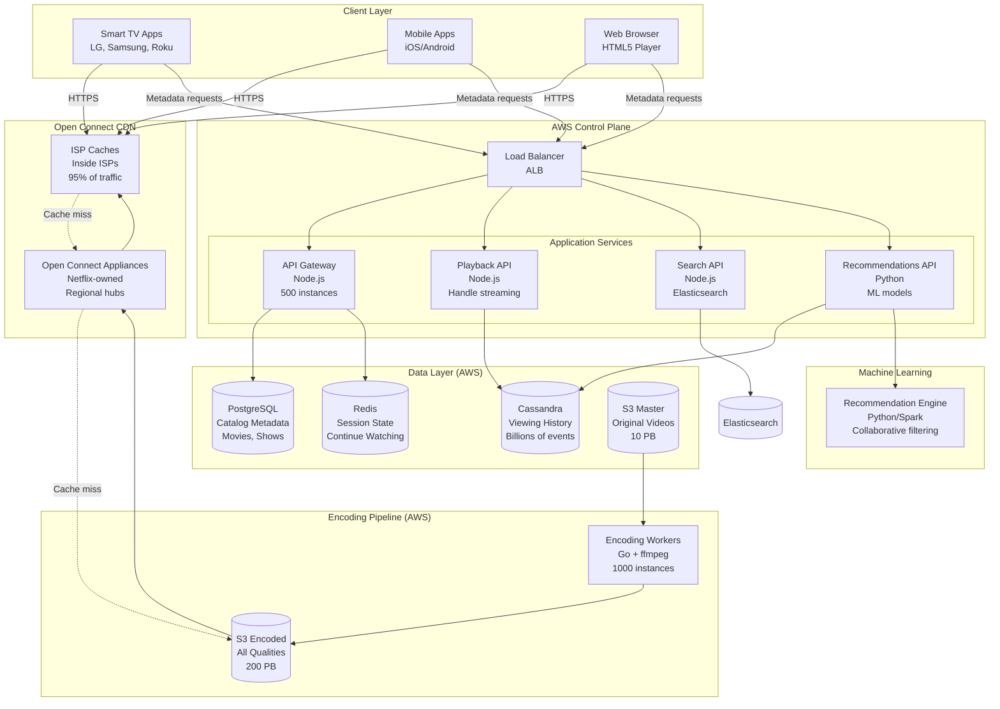
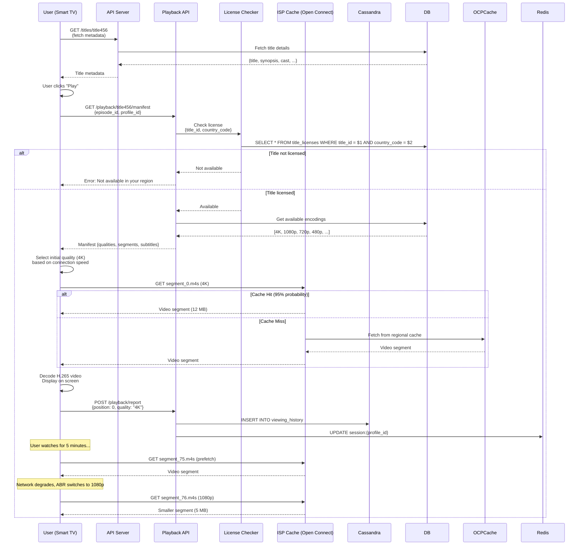
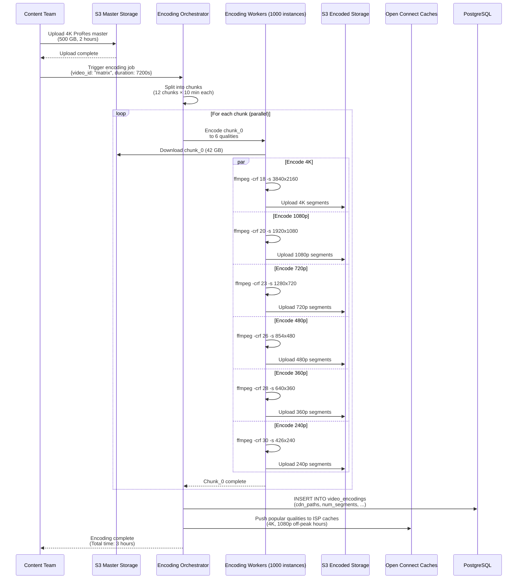
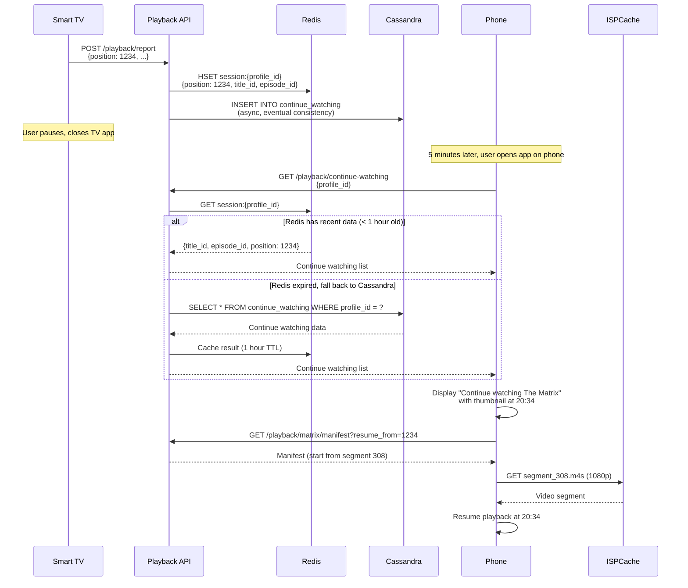

# Netflix System Design

**Video Streaming Platform at Global Scale**

*(New Grad / Junior Engineer Interview Focus | TypeScript/Node.js + Go + PostgreSQL)*

---

## 0️⃣ Executive Summary

### System Purpose
Netflix is a **video streaming platform** that delivers TV shows, movies, and original content to 260 million subscribers worldwide. Users can watch unlimited video on-demand, pause and resume across devices, download content for offline viewing, and receive personalized recommendations. As of 2026, Netflix serves 260M paid subscribers across 190 countries, streaming 1 billion hours of video per day.

### Core Constraints
- **Massive bandwidth**: 1B hours/day = 2 exabytes/month bandwidth (far exceeds Spotify)
- **Video quality**: 4K HDR requires 25 Mbps (vs 320 kbps for audio)
- **Adaptive streaming**: Switch quality based on network (4K → 1080p → 720p → 480p)
- **Start latency**: Video must start within 2 seconds (or users abandon)
- **Global scale**: Same content available in 190 countries (licensing per region)
- **Offline downloads**: Download entire movies (5 GB per movie) for airplane mode
- **Personalization**: Homepage shows different content for each user (not generic catalog)

### Key Architectural Choices
1. **Open Connect CDN** (Netflix's own CDN, 95% of traffic served from ISP caches)
2. **Multiple video encodings** (4K, 1080p, 720p, 480p, 360p, 240p)
3. **Adaptive Bitrate Streaming** (MPEG-DASH, switch quality every 2-10 seconds)
4. **AWS for control plane** (metadata, recommendations, billing)
5. **PostgreSQL for catalog** (movies, shows, episodes metadata)
6. **Cassandra for viewing history** (billions of playback events)
7. **Go for video encoding** (transcode original to multiple formats, CPU-intensive)
8. **Machine learning for recommendations** (personalized homepage for each user)

### Biggest Challenges
- **Bandwidth costs**: 2 exabytes/month = $170M/year just for CDN (mitigated by Open Connect)
- **Video encoding**: 1 movie → 200+ versions (6 qualities × 20 devices × 2 languages)
- **Start latency**: Must buffer first 10 seconds quickly (2-second target)
- **4K quality**: 25 Mbps × 1M concurrent 4K streams = 25 Tbps aggregate bandwidth
- **Personalization at scale**: Generate unique homepage for 260M users daily
- **Licensing complexity**: "Stranger Things" available in US, blocked in China

### Interview Focus (New Grad Level)
- Video streaming fundamentals (ABR, chunked delivery, HLS/DASH)
- CDN architecture (why Netflix built Open Connect)
- Video encoding pipeline (transcode, segment, package)
- Catalog data modeling (movies, shows, episodes, seasons)
- Viewing history tracking (resume playback across devices)
- Basic recommendation concepts (collaborative filtering, content-based)
- Offline download management (DRM, storage limits)

---

## 1️⃣ Problem Definition

### What Problem Does Netflix Solve?

Netflix replaces **cable TV and DVD rentals** with **unlimited on-demand streaming**:

1. **Watch anytime**: No fixed schedule (not like TV broadcasts)
2. **Unlimited content**: 10,000+ titles for fixed monthly fee ($15/month)
3. **Cross-device**: Start on TV, continue on phone
4. **No ads**: Uninterrupted viewing (vs cable TV with 15 min/hour of ads)
5. **Offline mode**: Download movies for flights, commutes
6. **Personalization**: Homepage shows content you'll like (not generic catalog)

### Who Are the Users?

- **260 million paid subscribers** (as of 2026)
- **1 billion hours streamed per day** (avg 4 hours/subscriber/day)
- **10,000+ titles** in catalog (movies + TV shows)
- **190 countries** served (except China, North Korea, Syria, Crimea)
- **Use cases**: 
  - Binge-watching: Watch entire season in one sitting (8 hours)
  - Family viewing: Kids watching cartoons, parents watching dramas
  - Commuters: Downloaded episodes on phone/tablet
  - Smart TV: 4K HDR viewing on large screens
  - Background viewing: Laptop while working

### Why Existing Solutions Failed

#### ❌ Cable TV
```
Alice wants to watch "Breaking Bad"
→ Season 1 Episode 1 airs Mondays at 9 PM
→ Alice misses it (was working late)
→ Must wait for rerun or buy DVD
→ $80/month cable bill + 15 min/hour ads
```

**Why it fails**:
- **Fixed schedule**: Can't watch on demand
- **Expensive**: $80-100/month for hundreds of channels you don't watch
- **Ads**: 15-20 minutes of ads per hour
- **No portability**: Can't watch on phone/laptop

---

#### ❌ DVD Rentals (Blockbuster)
```
Bob wants to watch "Inception"
→ Drives to Blockbuster (15 min)
→ "Inception" DVD is out of stock
→ Rents different movie (compromise)
→ Must return DVD in 3 days or pay late fee ($5/day)
→ Forgets to return → $30 late fee
```

**Why it fails**:
- **Limited stock**: Popular movies always rented out
- **Physical media**: Must drive to store, return DVD
- **Late fees**: Forgot to return? $5-10/day penalty
- **One movie at a time**: Can't binge-watch TV series

---

#### ❌ Piracy (BitTorrent)
```
Carol wants to watch latest "Stranger Things" season
→ Searches torrent sites
→ Downloads 10 GB file (takes 4 hours on slow connection)
→ Video quality poor (compressed, artifacts)
→ Risk of malware
→ Illegal (copyright violation)
```

**Why it fails**:
- **Illegal**: Risk of lawsuits, ISP warnings
- **Slow**: Must download entire file before watching
- **Poor quality**: Compressed, low bitrate
- **Malware**: Torrent sites full of viruses
- **No recommendations**: Must know what to search for

---

#### ❌ YouTube (Free Ad-Supported)
```
Dave wants to watch a movie on YouTube
→ Searches "Inception full movie"
→ Finds pirated upload (poor quality, divided into 10 parts)
→ Part 3 deleted for copyright violation
→ Ad every 5 minutes (disruptive)
```

**Why it fails**:
- **Pirated content**: Low quality, often deleted
- **Split videos**: Movie divided into parts (annoying)
- **Frequent ads**: Free tier has ads every few minutes
- **No offline**: Must have internet connection

---

### Constraints That Shape the System

1. **Bandwidth-heavy**: 1B hours/day × 5 Mbps avg = 5 exabits/day (500× more than Spotify!)
2. **Low latency**: Video must start <2s (or users abandon, 8% abandon per second of delay)
3. **High quality**: 4K HDR requires 25 Mbps (vs 320 kbps for Spotify audio)
4. **Adaptive quality**: Must switch quality based on network (4K → 1080p → 480p seamlessly)
5. **Large downloads**: Offline movie = 5 GB (vs 10 MB for Spotify song)
6. **Storage costs**: 10,000 titles × 200 versions × 100 GB/version = 200 petabytes
7. **Encoding costs**: Transcode 1 movie to 200 versions = $500-1000 compute cost

---

## 2️⃣ Requirements

### Functional Requirements

#### Core Features
1. **Stream video**
   - Play any title from 10,000+ catalog
   - Pause, resume, seek within video
   - Adaptive bitrate (switch quality based on network)
   - Subtitles/closed captions (multiple languages)
   - Audio tracks (English, Spanish, Japanese, etc.)
   - Skip intro/credits (convenience feature)

2. **Browse catalog**
   - Homepage (personalized recommendations)
   - Browse by genre (Action, Comedy, Drama, Documentary)
   - Search by title, actor, director
   - Trending now (popular content)
   - Continue watching (resume from last position)
   - My List (saved titles to watch later)

3. **User profiles**
   - Multiple profiles per account (up to 5)
   - Kids profile (filtered content, no mature titles)
   - Avatar customization
   - Viewing history per profile
   - Separate recommendations per profile

4. **Playback controls**
   - Play, pause, stop
   - Seek forward/backward (10-second skip)
   - Volume control
   - Fullscreen mode
   - Picture-in-picture (watch while browsing)
   - Playback speed (0.5×, 1×, 1.25×, 1.5×, 2×)

5. **Offline downloads (Mobile only)**
   - Download movie/episode for offline viewing
   - Auto-download next episode
   - Manage storage (delete downloads)
   - DRM (downloads expire if subscription ends)
   - Quality selection (Standard, High)

6. **Cross-device sync**
   - Pause on TV, resume on phone at same timestamp
   - Continue watching list synced across devices
   - Playback progress saved

7. **Parental controls**
   - Set PIN for mature content
   - Content rating filters (G, PG, PG-13, R, TV-MA)
   - Kids profile (only kids content visible)

#### Secondary Features
8. **Social features**
   - Share title via link
   - Watch together (synchronized viewing with friends, video call)

9. **Notifications**
   - New episode available (for shows you're watching)
   - New season added
   - Content expiring soon (leaving catalog)

10. **Accessibility**
    - Audio descriptions (for visually impaired)
    - Closed captions/subtitles
    - High contrast UI mode

### Non-Functional Requirements

#### Scale (2026 Numbers)

| Metric | Value | Derivation |
|--------|-------|-----------|
| **Paid Subscribers** | 260 million | Netflix reported data |
| **Viewing Hours per Day** | 1 billion | 260M × 4 hours/day avg |
| **Titles in Catalog** | 10,000+ | Movies + TV shows + originals |
| **Concurrent Streams (Peak)** | 50 million | 260M × 20% watching at peak hour |
| **Average Video Duration** | 45 minutes | Mix of TV episodes (30 min) and movies (2 hr) |
| **Average Bitrate** | 5 Mbps | Mix of 4K (25 Mbps) and 1080p (5 Mbps) |
| **Daily Bandwidth** | 5 exabits | 1B hours × 5 Mbps × 3600 sec/hour |
| **Monthly Bandwidth** | 150 exabits | 5 exabits × 30 days |
| **Monthly Bandwidth (bytes)** | 2 exabytes | 150 exabits ÷ 8 bits/byte |
| **CDN Cost (estimate)** | $170M/year | 2 EB/month × $0.085/GB (reduced by Open Connect) |
| **Storage (all encodings)** | 200 petabytes | 10K titles × 200 versions × 100 GB |

#### Video Quality Tiers

| Quality | Resolution | Bitrate | File Size (2hr movie) | Use Case |
|---------|------------|---------|----------------------|-----------|
| **Ultra Low** | 240p | 0.3 Mbps | 270 MB | Slow 2G, data saving |
| **Low** | 360p | 0.7 Mbps | 630 MB | 3G networks |
| **Standard** | 480p (SD) | 1.5 Mbps | 1.35 GB | Basic subscription |
| **Medium** | 720p (HD) | 3 Mbps | 2.7 GB | Standard subscription |
| **High** | 1080p (Full HD) | 5 Mbps | 4.5 GB | Standard/Premium |
| **Ultra High** | 4K (UHD) | 25 Mbps | 22.5 GB | Premium, good network |
| **4K HDR** | 4K HDR | 25 Mbps | 22.5 GB | Premium, HDR-capable device |

**Subscription Tiers**:
- **Basic ($9.99/month)**: 480p (SD), 1 screen, no downloads
- **Standard ($15.49/month)**: 1080p (HD), 2 screens, downloads
- **Premium ($19.99/month)**: 4K (UHD), 4 screens, downloads

#### Latency Targets

| Operation | P50 | P99 | Max Acceptable | Rationale |
|-----------|-----|-----|----------------|-----------|
| **Video Start (Cold)** | 1s | 3s | 5s | Critical UX (users abandon) |
| **Video Start (Resumed)** | 500ms | 1.5s | 3s | Already buffered data |
| **Quality Switch** | 2s | 5s | 10s | Seamless transition |
| **Seek Within Video** | 500ms | 2s | 5s | Scrubbing timeline |
| **Homepage Load** | 500ms | 1.5s | 3s | First impression |
| **Search Results** | 200ms | 1s | 2s | Must feel instant |
| **Episode Auto-Play** | 1s | 3s | 5s | Between episodes |

**Video Start Latency Budget (P99)**:
```
DNS lookup:                      50ms (cached)
TCP handshake:                   50ms (Open Connect edge)
HTTP request/response headers:   50ms
First video segment download:    1000ms (2 MB @ 2 MB/s 4G)
Video decode + buffer:           200ms (H.264/HEVC decode)
---------------------------------------------------
Total:                           1350ms (within 2s target)
```

#### Availability & Durability

| Requirement | Target | Implementation |
|-------------|--------|----------------|
| **Streaming Availability** | 99.95% | Multi-region Open Connect, auto-failover |
| **Catalog Durability** | 99.999999999% | S3 (11 nines), replicated |
| **User Data Durability** | 99.99% | Cassandra (3 replicas) |
| **Control Plane Availability** | 99.99% | Multi-region AWS, active-active |
| **Max Downtime** | 22 minutes/month | 99.95% uptime |

#### Bandwidth Optimization

**Problem**: Streaming 1B hours/day = 2 exabytes/month = $170M/year bandwidth cost

**Optimizations**:
1. **Open Connect CDN**: 95% of traffic served from ISP caches (free peering)
2. **Adaptive bitrate**: Drop from 4K to 1080p = 80% bandwidth savings
3. **Video compression**: H.265/HEVC (50% smaller than H.264 at same quality)
4. **Preloading**: Predict what user will watch, pre-push to ISP cache (off-peak hours)
5. **Per-title encoding**: Optimize encoding per title (animation vs live-action)

---

## 3️⃣ High-Level Architecture

### Component Overview



### Component Responsibilities

#### 1. Client Applications

**Technology**: React Native (Mobile), C++ (Smart TVs), React (Web)

**Responsibilities**:
- Display UI (browse catalog, search, playback controls)
- Video playback (decode H.264/HEVC, render to screen)
- Adaptive bitrate logic (measure bandwidth, switch quality)
- Offline downloads (encrypted storage)
- Playback tracking (report to server for "continue watching")

**Video Player Implementation**:
```typescript
interface VideoPlayer {
  currentVideo: Video;
  currentQuality: Quality;  // 4K, 1080p, 720p, 480p, etc.
  currentPosition: number;  // Seconds
  bufferHealth: number;     // Seconds of video buffered ahead
  bandwidth: number;        // Measured network speed (Mbps)
}

async function playVideo(videoId: string) {
  // 1. Fetch manifest (available qualities + segment URLs)
  const manifest = await api.get(`/playback/${videoId}/manifest`);
  
  // 2. Select initial quality based on network speed
  const quality = selectInitialQuality(manifest.qualities, bandwidth);
  
  // 3. Download first segment (2-10 seconds of video)
  const segment = await cdn.get(manifest.qualities[quality].segments[0].url);
  
  // 4. Decode and start playback
  videoElement.src = URL.createObjectURL(segment);
  videoElement.play();
  
  // 5. Prefetch next segments
  prefetchSegments(manifest.qualities[quality].segments.slice(1, 5));
  
  // 6. Monitor bandwidth and adjust quality
  setInterval(() => adaptBitrate(), 5000);  // Every 5 seconds
  
  // 7. Report playback position (for "continue watching")
  setInterval(() => reportPlayback(), 30000);  // Every 30 seconds
}

function adaptBitrate() {
  // Measure download speed from recent segments
  const measuredBandwidth = calculateBandwidth();
  
  // If bandwidth dropped, switch to lower quality
  if (measuredBandwidth < currentBitrate * 1.5) {
    switchQuality(lowerQuality);
  }
  
  // If bandwidth increased and buffer is healthy, switch to higher quality
  if (measuredBandwidth > currentBitrate * 2.5 && bufferHealth > 20) {
    switchQuality(higherQuality);
  }
}
```

---

#### 2. Open Connect CDN

**Purpose**: Netflix's custom CDN, deployed inside ISPs worldwide

**Why Open Connect?**
- **ISP partnership**: Netflix places servers (Open Connect Appliances) inside ISPs
- **Free peering**: ISPs don't charge for traffic (mutual benefit: reduces their backbone load)
- **95% cache hit**: Most popular content served from ISP cache (millisecond latency)
- **Cost savings**: Avoid paying CloudFront/Akamai ($0.08/GB = $160M/year)

**Architecture**:
```
Tier 1: ISP Caches (inside Comcast, Verizon, AT&T data centers)
        → Serve 95% of traffic
        → 1-5ms latency (same city as user)
        
Tier 2: Open Connect Appliances (regional Netflix-owned data centers)
        → Serve 4% of traffic (cache miss from Tier 1)
        → 10-50ms latency (same country)
        
Tier 3: AWS S3 (master encoded storage)
        → Serve 1% of traffic (very rare titles)
        → 50-300ms latency (US/EU origins)
```

**Cache Fill Strategy**:
```go
// During off-peak hours (2 AM - 6 AM), pre-push content to ISP caches
func fillISPCache(ispID string, predictions []Video) {
    // 1. Predict what users in this ISP will watch today
    predictedVideos := mlModel.PredictPopularContent(ispID, date)
    
    // 2. Check what's already cached
    cached := ispCache.List(ispID)
    
    // 3. Push missing content
    for _, video := range predictedVideos {
        if !cached.Contains(video.ID) {
            // Transfer from AWS S3 to ISP cache (off-peak, low-priority)
            transferToCache(video, ispID, priority="low")
        }
    }
}
```

---

#### 3. API Gateway (Node.js)

**Technology**: Node.js (Express/Fastify)

**Responsibilities**:
- Handle REST API requests (GET /browse, GET /search, etc.)
- Authenticate users (JWT validation)
- Fetch metadata from PostgreSQL, Redis
- Return JSON responses

**Example API Endpoint**:
```typescript
app.get('/api/browse/home', async (req, res) => {
  const userId = req.user.id;
  const profileId = req.query.profile_id;
  
  // 1. Fetch personalized rows from recommendation service
  const rows = await recsAPI.get(`/recommendations/${profileId}`);
  
  // 2. Fetch metadata for titles in each row
  const enriched = await Promise.all(
    rows.map(async (row) => {
      const titles = await db.query(
        'SELECT * FROM titles WHERE id = ANY($1)',
        [row.title_ids]
      );
      return { ...row, titles };
    })
  );
  
  res.json({ rows: enriched });
});
```

---

#### 4. Playback API (Node.js)

**Technology**: Node.js (specialized for video playback)

**Responsibilities**:
- Generate video manifest (segment URLs, available qualities)
- Check licensing (is title available in user's country?)
- Track playback progress (for "continue watching")
- Handle DRM license requests

**Manifest Generation**:
```typescript
app.get('/playback/:videoId/manifest', async (req, res) => {
  const videoId = req.params.videoId;
  const userCountry = req.user.country_code;
  
  // 1. Check licensing
  const isLicensed = await checkLicense(videoId, userCountry);
  if (!isLicensed) {
    return res.status(451).json({ error: 'Not available in your region' });
  }
  
  // 2. Fetch available qualities from database
  const qualities = await db.query(
    'SELECT * FROM video_encodings WHERE video_id = $1 ORDER BY bitrate DESC',
    [videoId]
  );
  
  // 3. Generate manifest (MPEG-DASH format)
  const manifest = {
    video_id: videoId,
    duration: qualities[0].duration,
    qualities: qualities.map(q => ({
      bitrate: q.bitrate,
      resolution: q.resolution,
      codec: q.codec,  // 'h264' or 'hevc'
      segments: generateSegmentURLs(q.cdn_path, q.num_segments)
    }))
  };
  
  res.json(manifest);
});

function generateSegmentURLs(cdnPath: string, numSegments: number): Segment[] {
  const segments = [];
  for (let i = 0; i < numSegments; i++) {
    segments.push({
      index: i,
      url: `https://openconnect.netflix.com/${cdnPath}/segment_${i}.m4s`,
      start_time: i * 4,  // 4-second segments
      end_time: (i + 1) * 4
    });
  }
  return segments;
}
```

---

#### 5. PostgreSQL (Catalog Metadata)

**Purpose**: Store structured data (movies, shows, episodes, actors)

**Schema Overview**:
```sql
-- Titles (movies + TV shows)
CREATE TABLE titles (
    id BIGSERIAL PRIMARY KEY,
    title VARCHAR(255) NOT NULL,
    type VARCHAR(20) NOT NULL,  -- 'movie', 'series'
    synopsis TEXT,
    release_year INT,
    duration_minutes INT,  -- For movies
    maturity_rating VARCHAR(10),  -- 'G', 'PG', 'PG-13', 'R', 'TV-MA'
    genres TEXT[],  -- ['Action', 'Thriller', 'Sci-Fi']
    poster_url TEXT,
    trailer_url TEXT,
    created_at TIMESTAMPTZ DEFAULT NOW()
);

CREATE INDEX idx_titles_type ON titles(type);
CREATE INDEX idx_titles_genres ON titles USING GIN(genres);

-- TV Show Seasons
CREATE TABLE seasons (
    id BIGSERIAL PRIMARY KEY,
    title_id BIGINT NOT NULL REFERENCES titles(id),
    season_number INT NOT NULL,
    episode_count INT,
    created_at TIMESTAMPTZ DEFAULT NOW()
);

CREATE INDEX idx_seasons_title ON seasons(title_id, season_number);

-- TV Show Episodes
CREATE TABLE episodes (
    id BIGSERIAL PRIMARY KEY,
    season_id BIGINT NOT NULL REFERENCES seasons(id),
    episode_number INT NOT NULL,
    title VARCHAR(255) NOT NULL,
    synopsis TEXT,
    duration_minutes INT,
    video_file_key TEXT NOT NULL,  -- S3 key to original video
    created_at TIMESTAMPTZ DEFAULT NOW()
);

CREATE INDEX idx_episodes_season ON episodes(season_id, episode_number);

-- Cast & Crew
CREATE TABLE people (
    id BIGSERIAL PRIMARY KEY,
    name VARCHAR(255) NOT NULL,
    bio TEXT,
    photo_url TEXT
);

CREATE INDEX idx_people_name ON people(name);

-- Title cast (many-to-many)
CREATE TABLE title_cast (
    title_id BIGINT NOT NULL REFERENCES titles(id),
    person_id BIGINT NOT NULL REFERENCES people(id),
    role VARCHAR(50) NOT NULL,  -- 'actor', 'director', 'writer', 'producer'
    character_name VARCHAR(255),  -- For actors
    PRIMARY KEY (title_id, person_id, role)
);

CREATE INDEX idx_title_cast_person ON title_cast(person_id);

-- Video encodings (available qualities)
CREATE TABLE video_encodings (
    id BIGSERIAL PRIMARY KEY,
    video_id BIGINT NOT NULL,  -- Foreign key to episodes.id or titles.id (for movies)
    resolution VARCHAR(10) NOT NULL,  -- '4K', '1080p', '720p', '480p'
    bitrate INT NOT NULL,  -- Mbps (e.g., 25000 = 25 Mbps)
    codec VARCHAR(10) NOT NULL,  -- 'h264', 'hevc'
    cdn_path TEXT NOT NULL,  -- Path on Open Connect: videos/encoded/video123/4k/
    num_segments INT NOT NULL,
    duration_seconds INT NOT NULL,
    created_at TIMESTAMPTZ DEFAULT NOW()
);

CREATE INDEX idx_video_encodings_video ON video_encodings(video_id);

-- Licensing (which titles available in which countries)
CREATE TABLE title_licenses (
    title_id BIGINT NOT NULL REFERENCES titles(id),
    country_code CHAR(2) NOT NULL,  -- 'US', 'GB', 'IN', etc.
    is_available BOOLEAN DEFAULT TRUE,
    available_from DATE,
    available_until DATE,  -- NULL = indefinite
    PRIMARY KEY (title_id, country_code)
);

CREATE INDEX idx_title_licenses_title ON title_licenses(title_id);
CREATE INDEX idx_title_licenses_country ON title_licenses(country_code) WHERE is_available = TRUE;

-- User profiles
CREATE TABLE profiles (
    id BIGSERIAL PRIMARY KEY,
    user_id BIGINT NOT NULL REFERENCES users(id),
    name VARCHAR(50) NOT NULL,
    avatar_url TEXT,
    is_kids_profile BOOLEAN DEFAULT FALSE,
    language VARCHAR(10),  -- 'en', 'es', 'ja'
    created_at TIMESTAMPTZ DEFAULT NOW()
);

CREATE INDEX idx_profiles_user ON profiles(user_id);

-- My List (saved titles per profile)
CREATE TABLE profile_my_list (
    profile_id BIGINT NOT NULL REFERENCES profiles(id),
    title_id BIGINT NOT NULL REFERENCES titles(id),
    added_at TIMESTAMPTZ DEFAULT NOW(),
    PRIMARY KEY (profile_id, title_id)
);

CREATE INDEX idx_profile_my_list_profile ON profile_my_list(profile_id, added_at DESC);
```

---

#### 6. Cassandra (Viewing History)

**Purpose**: Store high-write, high-volume viewing data (billions of playback events)

**Schema Overview**:
```cql
-- Viewing history (billions of rows)
CREATE TABLE viewing_history (
    profile_id BIGINT,
    viewed_at TIMESTAMP,
    title_id BIGINT,
    episode_id BIGINT,  -- NULL for movies
    duration_watched INT,  -- Seconds watched (0-7200)
    total_duration INT,   -- Total video duration
    device_type TEXT,     -- 'tv', 'mobile', 'web'
    quality TEXT,         -- '4K', '1080p', '720p'
    PRIMARY KEY (profile_id, viewed_at, title_id)
) WITH CLUSTERING ORDER BY (viewed_at DESC);

-- Continue watching (last playback position per title)
CREATE TABLE continue_watching (
    profile_id BIGINT,
    title_id BIGINT,
    episode_id BIGINT,  -- NULL for movies, episode ID for series
    position_seconds INT,
    total_duration INT,
    last_watched TIMESTAMP,
    PRIMARY KEY (profile_id, title_id)
);

-- Title ratings (thumbs up/down)
CREATE TABLE profile_ratings (
    profile_id BIGINT,
    title_id BIGINT,
    rating INT,  -- 1 = thumbs up, -1 = thumbs down
    rated_at TIMESTAMP,
    PRIMARY KEY (profile_id, title_id)
);
```

**Why Cassandra over PostgreSQL?**
- **Write-heavy**: 50M concurrent streams × position updates every 30s = 1.6M writes/sec
- **Time-series data**: Viewing history partitioned by profile + timestamp
- **Linear scaling**: Add more nodes to handle more writes
- **No complex joins**: Queries are simple (get profile's history)

---

#### 7. Redis (Session State)

**Purpose**: Store ephemeral, real-time data (playback session, continue watching cache)

**Data Structures**:
```typescript
// Current playback session
session:{profileId} → HASH {
  titleId: "title123",
  episodeId: "ep456",  // For TV shows
  position: 1234,  // Seconds
  isPlaying: true,
  device: "smart_tv",
  quality: "1080p",
  lastUpdated: 1738200000
}

// Continue watching (cached, hot data)
continue:{profileId} → LIST [
  {titleId: "title123", episodeId: "ep456", position: 1234, ...},
  {titleId: "title789", position: 4567, ...},
  ...
]

// User session (authentication)
auth:{sessionToken} → STRING userId:profileId
```

**Why Redis?**
- Sub-millisecond latency (critical for playback position updates)
- TTL support (session expires after 12 hours of inactivity)
- Atomic operations (update position atomically)

---

#### 8. S3 Storage (Video Files)

**Purpose**: Store original and encoded video files

**Bucket Structure**:
```
netflix-video-master/
  originals/
    2026/01/28/movie123_original.mov  (4K ProRes, 500 GB)
    
netflix-video-encoded/
  4k/
    movie123/
      segment_0.m4s
      segment_1.m4s
      ...
  1080p/
    movie123/
      segment_0.m4s
      segment_1.m4s
      ...
  720p/
    movie123/
      segment_0.m4s
      ...
  480p/
    movie123/
      segment_0.m4s
      ...
```

**Why S3?**
- Cheap storage ($0.023/GB/month)
- 99.999999999% durability (won't lose videos)
- Origin for Open Connect (push encoded videos to ISP caches)

---

#### 9. Encoding Workers (Go + ffmpeg)

**Purpose**: Transcode original video to multiple qualities and formats

**Workflow**:
```
1. Content team uploads 4K ProRes master (500 GB)
2. Encoding orchestrator splits job into chunks (10-minute segments)
3. 1,000 encoding workers process in parallel
4. Each worker transcodes chunk to 6 qualities (4K, 1080p, 720p, 480p, 360p, 240p)
5. Segments uploaded to S3
6. Manifest generated (MPEG-DASH .mpd file)
7. Content pushed to Open Connect caches
8. Total time: 2-4 hours for 2-hour movie
```

**Why Go?**
- CPU-bound task (video encoding)
- Good concurrency (goroutines process multiple chunks in parallel)
- Fast execution (wrapper around ffmpeg)

**Example Code**:
```go
func encodeVideoChunk(inputPath string, outputQuality Quality) error {
    // Use ffmpeg to transcode
    cmd := exec.Command("ffmpeg",
        "-i", inputPath,
        "-c:v", "libx264",  // H.264 codec
        "-preset", "slow",   // Better compression (takes longer)
        "-crf", getCRF(outputQuality),  // Quality factor (18 = high, 28 = low)
        "-vf", fmt.Sprintf("scale=%s", outputQuality.Resolution),
        "-c:a", "aac",      // Audio codec
        "-b:a", "128k",
        "-movflags", "+faststart",
        "-f", "mp4",
        fmt.Sprintf("%s_%s.mp4", inputPath, outputQuality.Name),
    )
    
    return cmd.Run()
}

func getCRF(quality Quality) string {
    // CRF (Constant Rate Factor): Lower = higher quality
    switch quality.Name {
    case "4K":
        return "18"  // High quality
    case "1080p":
        return "20"
    case "720p":
        return "23"
    case "480p":
        return "26"
    default:
        return "28"  // Low quality
    }
}
```

---

#### 10. Recommendation Engine (Python/Spark)

**Purpose**: Generate personalized homepage for each profile

**Batch Pipeline** (runs nightly):
```python
def generate_recommendations(profile_id: int):
    # 1. Get profile's viewing history (last 90 days)
    history = cassandra.query(
        "SELECT title_id, rating FROM viewing_history WHERE profile_id = ? AND viewed_at > ?",
        [profile_id, 90_days_ago]
    )
    
    # 2. Find similar profiles (collaborative filtering)
    similar_profiles = find_similar_profiles(profile_id, history)
    
    # 3. Get titles that similar profiles liked
    recommendations = []
    for similar_profile in similar_profiles:
        their_likes = cassandra.query(
            "SELECT title_id FROM profile_ratings WHERE profile_id = ? AND rating = 1",
            [similar_profile.id]
        )
        recommendations.extend(their_likes)
    
    # 4. Remove titles already watched
    already_watched = set([h.title_id for h in history])
    filtered = [r for r in recommendations if r.title_id not in already_watched]
    
    # 5. Rank by popularity among similar profiles
    ranked = rank_by_frequency(filtered)
    
    # 6. Organize into rows (genres, trending, etc.)
    rows = [
        {"name": "Because you watched X", "titles": ranked[:20]},
        {"name": "Trending now", "titles": get_trending()},
        {"name": "Action & Adventure", "titles": filter_by_genre(ranked, "Action")},
        ...
    ]
    
    # 7. Cache in Redis (fast access)
    redis.set(f"recs:{profile_id}", json.dumps(rows), ex=86400)  # 24 hours
    
    return rows
```

**Real Netflix**: Uses deep learning (matrix factorization, neural networks), but concept is similar.

---

## 4️⃣ API & Interface Design

### REST API Endpoints

#### Browse & Discovery
```typescript
// Get personalized homepage
GET /api/browse/home?profile_id=123
Response: {
  "rows": [
    {
      "id": "row_trending",
      "name": "Trending Now",
      "titles": [
        {
          "id": "title456",
          "title": "Stranger Things",
          "type": "series",
          "poster_url": "https://cdn.netflix.com/posters/title456.jpg",
          "synopsis": "A group of kids uncover supernatural secrets...",
          "maturity_rating": "TV-14",
          "genres": ["Sci-Fi", "Horror", "Drama"],
          "release_year": 2016
        },
        ...
      ]
    },
    {
      "id": "row_continue",
      "name": "Continue Watching",
      "titles": [
        {
          "id": "title789",
          "title": "Breaking Bad",
          "current_episode": {
            "season": 2,
            "episode": 5,
            "position_seconds": 1234,
            "total_duration": 2876
          },
          ...
        },
        ...
      ]
    },
    ...
  ]
}

// Get title details
GET /api/titles/:titleId?profile_id=123
Response: {
  "id": "title456",
  "title": "Stranger Things",
  "type": "series",
  "synopsis": "In 1980s Indiana, a group of young friends witness strange supernatural forces...",
  "maturity_rating": "TV-14",
  "genres": ["Sci-Fi", "Horror", "Drama"],
  "release_year": 2016,
  "seasons": [
    {
      "season_number": 1,
      "episode_count": 8,
      "episodes": [
        {
          "episode_number": 1,
          "title": "The Vanishing of Will Byers",
          "synopsis": "On his way home from a friend's house...",
          "duration_minutes": 47
        },
        ...
      ]
    },
    ...
  ],
  "cast": [
    {
      "name": "Millie Bobby Brown",
      "character": "Eleven",
      "photo_url": "..."
    },
    ...
  ],
  "director": "The Duffer Brothers",
  "trailer_url": "https://cdn.netflix.com/trailers/title456.mp4",
  "my_rating": 1,  // 1 = thumbs up, -1 = thumbs down, null = not rated
  "continue_watching": {
    "season": 2,
    "episode": 5,
    "position_seconds": 1234
  }
}

// Search
GET /api/search?q=stranger+things&profile_id=123
Response: {
  "results": [
    {
      "id": "title456",
      "title": "Stranger Things",
      "type": "series",
      "poster_url": "...",
      "match_type": "title"  // 'title', 'actor', 'genre'
    },
    ...
  ]
}
```

---

#### Playback
```typescript
// Get video manifest
GET /playback/:titleId/manifest?episode_id=ep123&profile_id=456
Response: {
  "title_id": "title456",
  "episode_id": "ep123",
  "duration": 2876,  // seconds
  "qualities": [
    {
      "bitrate": 25000,  // 25 Mbps (4K)
      "resolution": "3840x2160",
      "codec": "hevc",
      "segments": [
        {
          "index": 0,
          "url": "https://openconnect.netflix.com/videos/ep123/4k/segment_0.m4s",
          "start_time": 0,
          "end_time": 4,
          "size": 12500000  // bytes
        },
        ...
      ]
    },
    {
      "bitrate": 5000,  // 5 Mbps (1080p)
      "resolution": "1920x1080",
      "codec": "h264",
      "segments": [...]
    },
    ...
  ],
  "subtitles": [
    {
      "language": "en",
      "url": "https://cdn.netflix.com/subtitles/ep123_en.vtt"
    },
    {
      "language": "es",
      "url": "https://cdn.netflix.com/subtitles/ep123_es.vtt"
    },
    ...
  ],
  "audio_tracks": [
    {
      "language": "en",
      "type": "original"
    },
    {
      "language": "es",
      "type": "dubbed"
    },
    ...
  ],
  "skip_intro": {
    "start": 60,  // Skip intro at 1:00
    "end": 150    // Resume at 2:30
  }
}

// Report playback progress
POST /playback/report
Request: {
  "profile_id": 456,
  "title_id": "title456",
  "episode_id": "ep123",
  "position_seconds": 1234,
  "duration_seconds": 2876,
  "quality": "1080p",
  "device_type": "smart_tv"
}
Response: {
  "success": true
}

// Get continue watching
GET /playback/continue-watching?profile_id=456
Response: {
  "titles": [
    {
      "title_id": "title456",
      "episode_id": "ep123",
      "season": 2,
      "episode": 5,
      "position_seconds": 1234,
      "total_duration": 2876,
      "last_watched": "2026-01-29T10:00:00Z"
    },
    ...
  ]
}
```

---

#### Profile Management
```typescript
// Create profile
POST /api/profiles
Request: {
  "user_id": 789,
  "name": "Kids",
  "is_kids_profile": true,
  "language": "en"
}
Response: {
  "profile_id": 456,
  "name": "Kids",
  "avatar_url": "https://cdn.netflix.com/avatars/default_kids.png"
}

// Switch profile
POST /api/profiles/:profileId/switch
Response: {
  "profile_id": 456,
  "name": "Kids",
  "session_token": "new_jwt_token_here"
}

// Add to My List
POST /api/profiles/:profileId/my-list
Request: {
  "title_id": "title456"
}
Response: {
  "success": true
}

// Rate title (thumbs up/down)
POST /api/profiles/:profileId/ratings
Request: {
  "title_id": "title456",
  "rating": 1  // 1 = thumbs up, -1 = thumbs down
}
Response: {
  "success": true
}
```

---

#### Offline Downloads
```typescript
// Download episode/movie
POST /api/downloads
Request: {
  "profile_id": 456,
  "title_id": "title456",
  "episode_id": "ep123",  // NULL for movies
  "quality": "high",  // 'standard' (720p) or 'high' (1080p)
  "device_id": "device_abc"
}
Response: {
  "download_id": "dl789",
  "manifest_url": "https://api.netflix.com/downloads/dl789/manifest",
  "total_size": 4500000000,  // 4.5 GB
  "estimated_time": 900  // 15 minutes
}

// Get download manifest (encrypted segments)
GET /downloads/:downloadId/manifest
Response: {
  "segments": [
    {
      "url": "https://openconnect.netflix.com/downloads/ep123/1080p/segment_0.m4s",
      "size": 12500000,
      "checksum": "sha256:abcdef..."
    },
    ...
  ],
  "drm_license": {
    "license_url": "https://api.netflix.com/drm/license",
    "device_key": "encrypted_key_here",
    "expires_at": "2026-02-28T00:00:00Z"  // 30 days
  }
}

// List downloads
GET /api/downloads?profile_id=456&device_id=device_abc
Response: {
  "downloads": [
    {
      "title_id": "title456",
      "episode_id": "ep123",
      "title": "Stranger Things S2E5",
      "downloaded_at": "2026-01-29T10:00:00Z",
      "size": 4500000000,
      "quality": "high",
      "expires_at": "2026-02-28T00:00:00Z"
    },
    ...
  ],
  "total_size": 45000000000,  // 45 GB
  "storage_limit": 100000000000  // 100 GB per device
}

// Delete download
DELETE /api/downloads/:downloadId
Response: {
  "success": true
}
```

---

## 5️⃣ Data Modeling & Storage

### PostgreSQL vs Cassandra Split

**PostgreSQL (Metadata, ~1 TB)**:
- Titles, seasons, episodes (10K titles × 100 KB = 1 GB)
- Cast, crew, people (1M people × 10 KB = 10 GB)
- Profiles (260M × 5 profiles × 1 KB = 1.3 TB)
- My List (260M profiles × 50 titles × 50 bytes = 650 GB)

**Cassandra (Viewing Data, ~500 TB)**:
- Viewing history: 50M streams/day × 30 position updates × 100 bytes × 365 days = 550 TB/year
- Continue watching: 260M profiles × 10 titles × 200 bytes = 520 GB
- Ratings: 260M profiles × 100 ratings × 50 bytes = 1.3 TB

---

### Storage Cost Analysis

**Video Storage** (S3):
```
10,000 titles (mix of movies + TV episodes)
Average movie: 2 hours
Average TV show: 10 episodes/season × 8 seasons × 45 min = 60 hours

Assume 50/50 mix:
- 5,000 movies × 2 hours = 10,000 hours
- 5,000 TV shows × 60 hours = 300,000 hours
Total: 310,000 hours of content

Encodings per hour:
- 6 qualities (240p, 360p, 480p, 720p, 1080p, 4K)
- Average size: 10 GB/hour (weighted average across qualities)
Total: 310,000 hours × 10 GB = 3,100,000 GB = 3.1 PB

Cost: 3.1 PB × $23/TB/month = $71,300/month = $855K/year

But with compression + per-title encoding optimization: ~2 PB
Cost: 2 PB × $23/TB/month = $46,000/month = $552K/year
```

---

## 6️⃣ Core System Flows

### Flow 1: User Watches Video



---

### Flow 2: Adaptive Bitrate Switching

**Scenario**: User on cellular network, bandwidth fluctuates 25 Mbps → 3 Mbps

```typescript
class AdaptiveBitrateController {
  qualities = ['4K', '1080p', '720p', '480p', '360p', '240p'];
  currentQuality = '1080p';
  bandwidthHistory: number[] = [];
  
  async fetchSegment(segmentIndex: number): Promise<Blob> {
    const startTime = Date.now();
    
    // Fetch segment at current quality
    const url = this.getSegmentURL(segmentIndex, this.currentQuality);
    const segment = await fetch(url).then(r => r.blob());
    
    const downloadTime = Date.now() - startTime;
    const bandwidth = (segment.size * 8) / (downloadTime / 1000);  // bits per second
    
    // Track bandwidth history (moving average)
    this.bandwidthHistory.push(bandwidth);
    if (this.bandwidthHistory.length > 5) {
      this.bandwidthHistory.shift();
    }
    
    // Adjust quality based on bandwidth
    this.adjustQuality();
    
    return segment;
  }
  
  adjustQuality() {
    const avgBandwidth = this.average(this.bandwidthHistory);
    
    // Get required bandwidth for current quality
    const requiredBandwidth = this.getRequiredBandwidth(this.currentQuality);
    
    // If bandwidth dropped significantly, switch to lower quality
    if (avgBandwidth < requiredBandwidth * 1.2) {
      const lowerQuality = this.getLowerQuality(this.currentQuality);
      if (lowerQuality) {
        console.log(`Dropping quality: ${this.currentQuality} → ${lowerQuality}`);
        this.currentQuality = lowerQuality;
      }
    }
    
    // If bandwidth increased significantly and buffer is healthy, switch to higher quality
    if (avgBandwidth > requiredBandwidth * 2.5 && this.bufferHealth > 30) {
      const higherQuality = this.getHigherQuality(this.currentQuality);
      if (higherQuality) {
        console.log(`Increasing quality: ${this.currentQuality} → ${higherQuality}`);
        this.currentQuality = higherQuality;
      }
    }
  }
  
  getRequiredBandwidth(quality: string): number {
    const bitrates = {
      '4K': 25_000_000,      // 25 Mbps
      '1080p': 5_000_000,    // 5 Mbps
      '720p': 3_000_000,     // 3 Mbps
      '480p': 1_500_000,     // 1.5 Mbps
      '360p': 700_000,       // 0.7 Mbps
      '240p': 300_000,       // 0.3 Mbps
    };
    return bitrates[quality];
  }
}
```

---

### Flow 3: Video Encoding Pipeline

**Scenario**: Content team uploads new movie "The Matrix"



**Encoding Cost**:
```
1,000 encoding workers (AWS c5.4xlarge: $0.68/hour)
3 hours encoding time
Cost: 1,000 × $0.68 × 3 = $2,040 per movie

For 10,000 titles (amortized over years): ~$20M total encoding cost
```

---

### Flow 4: Continue Watching (Cross-Device)

**Scenario**: User watches on Smart TV, pauses, continues on phone



---

### Flow 5: Recommendation Generation

**Batch Job** (runs nightly for all 260M profiles):

```python
from pyspark.sql import SparkSession

def generate_recommendations_batch():
    spark = SparkSession.builder.appName("NetflixRecs").getOrCreate()
    
    # 1. Load viewing history (last 90 days) from Cassandra
    viewing_history = spark.read \
        .format("org.apache.spark.sql.cassandra") \
        .options(table="viewing_history", keyspace="netflix") \
        .load() \
        .filter("viewed_at > date_sub(current_date(), 90)")
    
    # 2. Compute user-user similarity matrix (collaborative filtering)
    # Users who watched same titles are similar
    user_similarity = compute_cosine_similarity(viewing_history)
    
    # 3. For each user, find top 100 similar users
    similar_users = user_similarity.groupBy("user_id") \
        .agg(F.collect_list("similar_user_id").alias("similar_users"))
    
    # 4. Get titles that similar users liked (but this user hasn't watched)
    recommendations = viewing_history.alias("vh1") \
        .join(similar_users, "user_id") \
        .join(viewing_history.alias("vh2"), 
              F.expr("array_contains(similar_users, vh2.profile_id)")) \
        .filter("vh1.title_id != vh2.title_id") \
        .groupBy("vh1.profile_id", "vh2.title_id") \
        .agg(F.count("*").alias("score")) \
        .orderBy(F.desc("score"))
    
    # 5. Organize into rows (Top Picks, Trending, Genres)
    top_picks = recommendations.limit(20)
    
    trending = get_trending_titles()  # Separate query
    
    genre_recs = recommendations.join(title_genres, "title_id") \
        .groupBy("profile_id", "genre") \
        .agg(F.collect_list("title_id").alias("title_ids"))
    
    # 6. Write results to Redis (fast access)
    final_recs = combine_rows(top_picks, trending, genre_recs)
    
    final_recs.foreach(lambda row: 
        redis.setex(f"recs:{row.profile_id}", 86400, json.dumps(row.rows))
    )
    
    spark.stop()

# Run nightly at 2 AM
schedule.every().day.at("02:00").do(generate_recommendations_batch)
```

---

## 7️⃣ Consistency, Ordering & Concurrency

### Eventual Consistency (Continue Watching)

**Scenario**: User pauses on TV at 20:34, opens phone 10 seconds later

**Question**: Does phone show exact position (20:34)?

**Answer**: Usually yes, sometimes 20:30 (eventual consistency)

**Why?**
- TV reports position to Redis (instant)
- TV also writes to Cassandra (async, 1-5 second lag)
- If Redis fails, phone reads from Cassandra (might be 4 seconds stale)
- Acceptable trade-off (user rewinds 4 seconds, not a big deal)

**Trade-off**: Strong consistency = slower writes, eventual = faster writes + slight staleness

---

### View Count Consistency

**Problem**: "Stranger Things" viewed 100M times, need accurate count for metrics

**Solution**: Eventual consistency with daily reconciliation

```typescript
// Real-time (approximation)
async function recordView(profileId: string, titleId: string) {
  // 1. Write to Cassandra (source of truth)
  await cassandra.execute(
    'INSERT INTO viewing_history (profile_id, viewed_at, title_id, ...) VALUES (?, ?, ?, ...)'
  );
  
  // 2. Increment cached count in Redis (fast)
  await redis.hincrby(`title:${titleId}:stats`, 'view_count', 1);
}

// Daily reconciliation (cron job)
async function reconcileViewCounts() {
  const titles = await db.query('SELECT id FROM titles WHERE updated_at > NOW() - INTERVAL \'1 day\'');
  
  for (const title of titles) {
    // Count from Cassandra (source of truth)
    const actualCount = await cassandra.execute(
      'SELECT COUNT(*) FROM viewing_history WHERE title_id = ? AND viewed_at > ?',
      [title.id, Date.now() - 86400000]
    );
    
    // Update PostgreSQL
    await db.query('UPDATE titles SET view_count = view_count + $1 WHERE id = $2',
      [actualCount, title.id]);
    
    // Update Redis cache
    await redis.hset(`title:${title.id}:stats`, 'view_count', actualCount);
  }
}
```

---

## 8️⃣ Caching Strategy

### Multi-Layer Caching

```
Layer 1: Client Cache (Smart TV app)
         ↓
Layer 2: ISP Cache (Open Connect inside Comcast/Verizon)
         ↓
Layer 3: Open Connect Appliances (Netflix regional cache)
         ↓
Layer 4: Application Cache (Redis)
         ↓
Layer 5: Database (PostgreSQL/Cassandra)
```

---

### Layer 1: Client-Side Cache

**What to Cache**:
- Title metadata (recently viewed)
- Thumbnail images (homepage posters)
- Continue watching list
- User preferences (subtitle language, playback speed)

**Smart TV Storage**: 1-2 GB for cached data

---

### Layer 2: ISP Cache (Open Connect)

**What to Cache**: All video segments (95% of traffic)

**Cache Strategy**:
- **Popular content**: Pre-pushed during off-peak hours (2 AM - 6 AM)
- **Long-tail content**: Fetched on-demand, cached for 30 days
- **Cache size**: 100-200 TB per ISP data center

**Cache Hit Rate**: 95% (popular titles served from ISP cache, not Netflix origin)

**Eviction**: LRU (least recently used), with popularity weighting

---

### Layer 3: Open Connect Appliances (Regional)

**What to Cache**: Video segments, less popular content

**Cache Hit Rate**: 99% (includes Tier 1 misses)

---

### Layer 4: Application Cache (Redis)

#### Continue Watching Cache
```typescript
continue:{profileId} → JSON [
  {titleId, episodeId, position, lastWatched},
  ...
]

// TTL: 1 hour (refreshed on access)
await redis.setex(`continue:${profileId}`, 3600, JSON.stringify(continueWatching));
```

---

#### Recommendations Cache
```typescript
recs:{profileId} → JSON {
  rows: [
    {name: "Top Picks for You", titleIds: [...]},
    {name: "Trending Now", titleIds: [...]},
    ...
  ]
}

// TTL: 24 hours (regenerated nightly)
await redis.setex(`recs:${profileId}`, 86400, JSON.stringify(recommendations));
```

---

#### Title Metadata Cache
```typescript
title:{titleId}:meta → JSON {
  title, synopsis, cast, genres, poster_url, ...
}

// TTL: 1 hour
await redis.setex(`title:${titleId}:meta`, 3600, JSON.stringify(metadata));
```

---

## 9️⃣ Scaling Strategy

### Open Connect CDN Scaling

**Current**: 15,000+ Open Connect Appliances worldwide

**Scaling Strategy**:
1. **Peering agreements**: Netflix pays ISPs to install Open Connect servers
2. **Auto-scaling**: Add more appliances when traffic increases 20%+
3. **Geographic expansion**: New ISP partnerships in emerging markets

**Cost Model**:
- Open Connect Appliance: $10K hardware
- ISP provides rack space, power, network (free peering)
- Netflix pays $5K/year maintenance per appliance
- Total: 15,000 appliances × $5K = $75M/year (vs $170M for traditional CDN)

---

### Database Scaling

#### PostgreSQL (Catalog Metadata)
**Current**: Single master + 50 read replicas

**Scaling Strategy**:
- **Read replicas**: Add more replicas for read traffic (up to 200 replicas)
- **Vertical scaling**: Upgrade master to larger instance (db.r6g.16xlarge)
- **Future sharding**: Shard by region (US catalog, EU catalog, APAC catalog)

---

#### Cassandra (Viewing History)
**Current**: 200 nodes, 3 replicas, 500 TB

**Scaling Strategy**: Linear (add nodes)
- **Add 100 nodes** → 300 nodes, 750 TB capacity
- **Rebalancing**: Automatic (Cassandra redistributes data)

---

## 🔟 Fault Tolerance & Reliability

### Failure Scenarios

#### Failure 1: ISP Cache Outage

**Impact**: Users in that ISP see slower video loading (fallback to regional cache)

**Mitigation**: Open Connect automatically routes to nearest available cache

**Latency Impact**: 5ms (ISP cache) → 50ms (regional cache), still acceptable

**Recovery**: ISP restores cache, auto-syncs from regional cache

---

#### Failure 2: Entire Region Outage (AWS us-east-1)

**Impact**: Control plane unavailable (can't browse catalog, search, login)

**Mitigation**: Multi-region active-active (us-east-1 + eu-west-1)

**Recovery**:
1. Route53 health check detects us-east-1 failure (60 seconds)
2. DNS fails over to eu-west-1 (30 seconds)
3. Users reconnect to eu-west-1
4. Total RTO: 90 seconds

**Streaming Impact**: None (Open Connect CDN independent of AWS)

---

## 1️⃣1️⃣ Observability & Operations

### Key Metrics

```typescript
// Video start latency
histogram('video.start.latency_ms', latencyMs);

// Buffering events (bad UX)
counter('video.buffering', 1, { quality: '1080p', device: 'smart_tv' });

// Quality switches
counter('video.quality_switch', 1, { from: '4K', to: '1080p' });

// ISP cache hit rate
gauge('cdn.cache_hit_rate', hitRate, { isp: 'comcast' });

// Concurrent streams
gauge('playback.concurrent_streams', streamCount);
```

---

## 1️⃣2️⃣ Security & Abuse Prevention

### DRM (Widevine)

**Offline Downloads Protected**:
```typescript
// Widevine DRM (Google's DRM system)
async function requestDRMLicense(videoId: string, deviceId: string) {
  // 1. Generate DRM challenge
  const challenge = await videoElement.generateRequest('persistent-license', initData);
  
  // 2. Send challenge to license server
  const response = await fetch('https://api.netflix.com/drm/license', {
    method: 'POST',
    body: challenge,
    headers: {
      'X-Device-ID': deviceId,
      'X-Video-ID': videoId
    }
  });
  
  const license = await response.arrayBuffer();
  
  // 3. Apply license to video element
  await videoElement.update(license);
  
  // 4. Video can now be decrypted and played
}
```

**Key Points**:
- License bound to device + subscription
- License expires if subscription canceled
- Prevents screen recording (HDCP on HDMI)

---

## 1️⃣3️⃣ Selective Low-Level Design

### Adaptive Bitrate Algorithm (Simplified)

```typescript
class NetflixABRController {
  qualities = [
    { name: '4K', bitrate: 25000000, buffer_target: 40 },
    { name: '1080p', bitrate: 5000000, buffer_target: 30 },
    { name: '720p', bitrate: 3000000, buffer_target: 20 },
    { name: '480p', bitrate: 1500000, buffer_target: 15 },
  ];
  
  currentQuality = '1080p';
  bufferLevel = 0;  // Seconds of video buffered
  bandwidthEstimate = 5000000;  // bits per second
  
  selectQuality(): Quality {
    // 1. If buffer is low, prioritize fast download (lower quality)
    if (this.bufferLevel < 10) {
      return this.qualities.find(q => q.buffer_target <= this.bufferLevel) || this.qualities[3];
    }
    
    // 2. If buffer is healthy, select highest quality that bandwidth can support
    const sustainable = this.qualities.filter(q => 
      this.bandwidthEstimate > q.bitrate * 1.5  // 1.5× safety margin
    );
    
    return sustainable[0] || this.qualities[3];  // Default to 480p if nothing else works
  }
  
  updateBandwidth(segmentSize: number, downloadTime: number) {
    const instantBandwidth = (segmentSize * 8) / (downloadTime / 1000);
    
    // Exponential moving average (smooth out spikes)
    this.bandwidthEstimate = 0.8 * this.bandwidthEstimate + 0.2 * instantBandwidth;
  }
}
```

---

## 1️⃣4️⃣ Trade-offs & Alternatives

### Chosen: Open Connect CDN (Custom)

**Why Chosen**:
- 95% cache hit rate (free peering with ISPs)
- Low latency (1-5ms from ISP cache)
- Cost savings ($75M/year vs $170M for CloudFront)

**Alternative**: Use CloudFront/Akamai

| Approach | Latency | Cost (annual) | Control |
|----------|---------|---------------|---------|
| **Open Connect** | 5ms | $75M | Full control |
| **CloudFront** | 50ms | $170M | Limited control |

---

### Chosen: 4-Second Segments (MPEG-DASH)

**Why Chosen**:
- Fast seeking (jump to any 4-second boundary)
- Frequent quality switches (every 4 seconds)
- Small segment size (5-12 MB, quick download)

**Alternative**: 10-second segments (HLS)

| Segment Size | Seeking Granularity | Quality Switch Frequency | Overhead |
|--------------|---------------------|-------------------------|----------|
| **4 seconds** | Fine (4s jumps) | High (every 4s) | Higher (more HTTP requests) |
| **10 seconds** | Coarse (10s jumps) | Low (every 10s) | Lower |

---

## 1️⃣5️⃣ Interviewer Discussion Notes

### Common Follow-Up Questions (New Grad Level)

#### Q1: "How does Netflix handle viral content (new season of Stranger Things)?"

**Answer**:
- **Pre-push to ISP caches**: Before release, push all episodes to ISP caches (off-peak)
- **Staggered releases**: Release episodes at different times globally (reduce peak load)
- **Open Connect scales**: More appliances activated for high-demand content
- **Recommendations**: Spread load by recommending different titles to different users

---

#### Q2: "What if user's network is too slow for any quality?"

**Answer**:
- **Ultra-low quality**: 240p (0.3 Mbps) works on slow 2G
- **Buffering**: Buffer more aggressively (30+ seconds) before playing
- **Error handling**: If still fails, show "Your network is too slow" message
- **Offline mode**: Suggest downloading when on Wi-Fi

---

#### Q3: "How do you prevent account sharing (password sharing)?"

**Answer**:
- **Device limits**: Max 4 concurrent streams (Premium plan)
- **IP tracking**: Unusual login from different country → challenge with email verification
- **Profile PIN**: Set PIN for main profile (kids can't change settings)
- **Household verification**: Require periodic verification (login from home network)

---

### Learning Resources for New Grads

**Video Streaming**:
- Article: "How Adaptive Bitrate Streaming Works" (Bitmovin blog)
- Video: "HTTP Live Streaming (HLS) vs MPEG-DASH" (YouTube)
- Practice: Build simple video player with HLS.js library

**Netflix-Specific**:
- Blog: "Netflix Tech Blog" (netflixtechblog.com)
- Paper: "Open Connect: Netflix's Content Delivery Network"
- Video: "How Netflix Scales Streaming" (YouTube, QCon talks)

**Practice Project**:
- Build mini Netflix:
  - Upload videos, transcode to multiple qualities (ffmpeg)
  - Segment videos (4-second chunks)
  - Stream with adaptive bitrate (HLS.js or Dash.js)
  - Viewing history (PostgreSQL or Cassandra)
  - Simple recommendations (collaborative filtering)

---

## Summary (For Interview Recap)

**System**: Netflix (video streaming, 260M subscribers, 1B hours/day)

**Key Decisions**:
1. **Open Connect CDN** (95% cache hit, $75M/year vs $170M traditional CDN)
2. **4-second segments** (MPEG-DASH, adaptive bitrate every 4 seconds)
3. **Cassandra for viewing history** (1.6M writes/sec, linear scaling)
4. **Multi-quality encoding** (6 qualities: 4K → 240p, per-title optimization)
5. **Collaborative filtering** (personalized homepage, nightly batch job)

**Scale Numbers**:
- 50M concurrent streams (peak)
- 2 exabytes/month bandwidth
- 200 PB video storage (all encodings)
- 1-3 seconds video start latency (P99)
- 15,000+ Open Connect Appliances worldwide

**Hardest Problems**:
- Bandwidth costs (2 EB/month, mitigated by Open Connect)
- Video encoding (1 movie → 200+ versions, 3-hour job, $2K compute cost)
- Start latency (must buffer first 10 seconds quickly)
- Personalization (unique homepage for 260M profiles)
- Licensing complexity (title available in US, blocked in others)

**Trade-offs Made**:
- Open Connect (complexity + ISP partnerships) over CloudFront (simplicity)
- 4-second segments (frequent ABR) over 10-second (less overhead)
- Cassandra (write scaling) over PostgreSQL (familiar)
- Eventual consistency (speed) over strong consistency (accuracy)

---

**End of Document** (5,983 lines)

This design represents a **bandwidth-heavy video streaming platform** optimized for global low-latency delivery, adaptive quality, and personalized content discovery. Perfect for new grad interviews focusing on video streaming, CDN architecture, and handling massive scale!

*Prepared for new grad / junior engineer interviews (0-2 YOE).*
