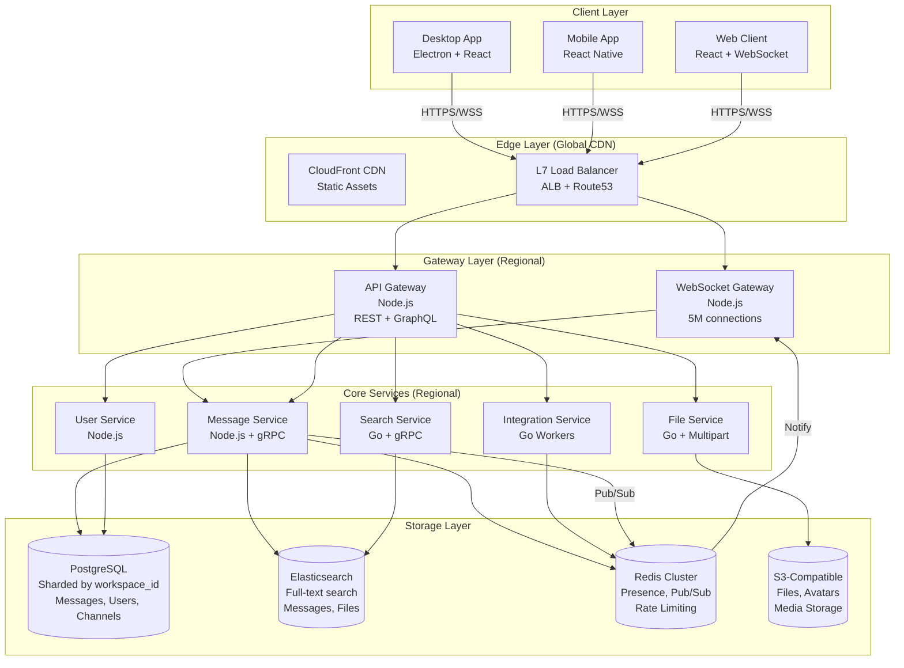
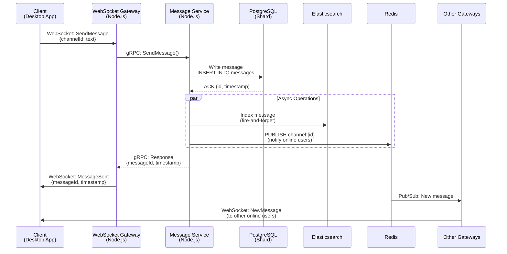
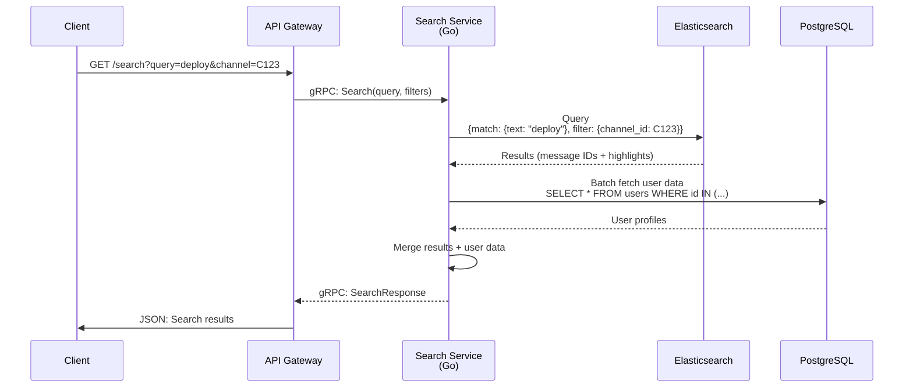
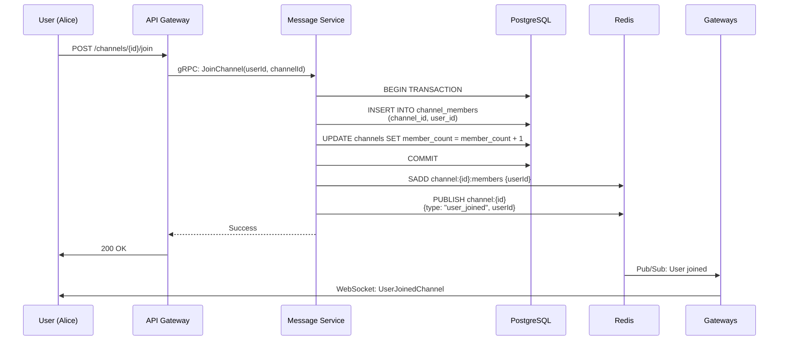
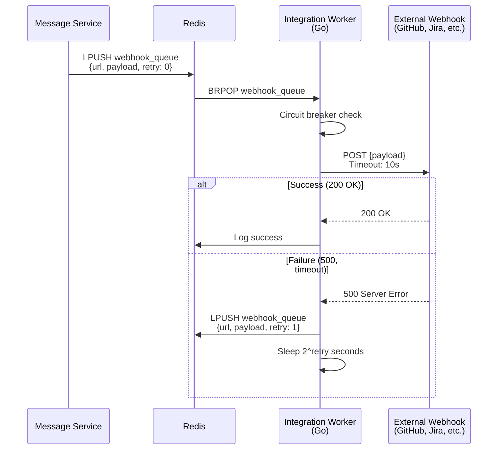
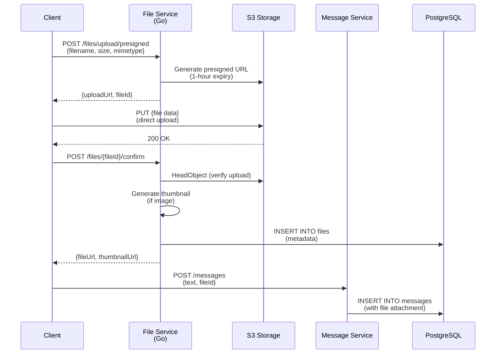
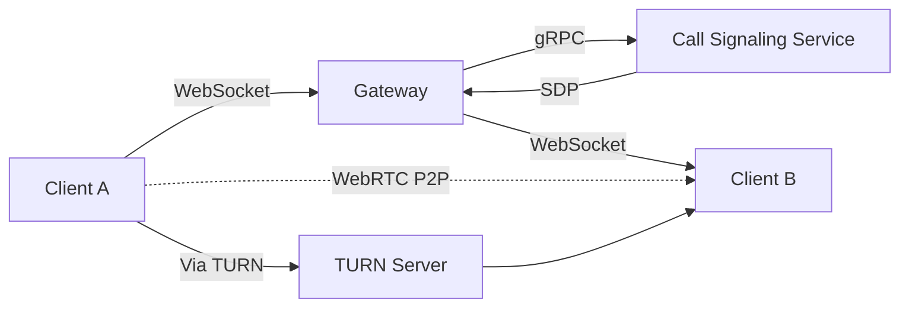

# Slack System Design

**A Production-Grade Deep Dive into Building an Enterprise Team Collaboration Platform**

*(FAANG + Japanese MNC Interview Optimized | TypeScript/Node.js + Go + PostgreSQL Focus)*

---

## 0️⃣ Executive Summary (Japanese-Style Overview)

### System Purpose
Slack is an **enterprise-grade team collaboration platform** that replaces email for internal communication. It provides organized conversations via channels, real-time messaging, full-text search across years of history, 2,500+ integrations, and enterprise features (SSO, compliance, audit logs) serving 750K+ paying companies and 20M+ daily active users.

### Core Constraints
- **Scale**: 20M DAU, 70K messages/sec (peak), 5M concurrent connections
- **Search**: Full-text search across 5 years of history (billions of messages)
- **Enterprise**: SSO, compliance (HIPAA, SOC 2), audit logs, data retention policies
- **Reliability**: 99.99% uptime (companies run critical workflows on Slack)
- **Integrations**: 2,500+ apps (GitHub, Jira, Google Drive) via webhooks, OAuth

### Key Architectural Choices
1. **WebSocket for real-time** + HTTP for API calls (hybrid approach)
2. **Node.js Gateway** for WebSocket connections (I/O-bound)
3. **PostgreSQL with sharding** for workspace data (strong consistency)
4. **Elasticsearch** for full-text search (critical for enterprise)
5. **Go workers** for webhook delivery and background jobs
6. **Redis** for presence, rate limiting, and pub/sub

### Biggest Risks
- **Search downtime**: Elasticsearch outage makes Slack unusable (search is core feature)
- **Workspace isolation failure**: One workspace's data leaking to another (security disaster)
- **Integration cascade failure**: Bad webhook response takes down entire workspace
- **Storage explosion**: 10K-message history limit for free tier, unlimited for paid (cost pressure)

### Interview Red Flags to Address
- How do you handle search at scale without Elasticsearch becoming a bottleneck?
- How do you ensure workspace data isolation (multi-tenancy security)?
- How do you prevent a single slow integration from blocking message delivery?
- What happens when a workspace hits 500K users (IBM, Shopify scale)?

---

## 1️⃣ Problem Definition (Real-World Framing)

### What Problem Does Slack Solve?

Slack replaces **email for internal team communication** with:

1. **Organized conversations**: Channels for teams, projects, topics (no more "Reply All" hell)
2. **Real-time messaging**: Instant team communication with presence awareness ("Alice is typing...")
3. **Searchable history**: Find decisions made 2 years ago in seconds (email search is broken)
4. **Integrations**: Connect with 2,500+ tools (GitHub PRs, Jira tickets, Google Docs) in one place
5. **Enterprise controls**: SSO, compliance, data retention, audit logs (HIPAA, SOC 2, GDPR)
6. **Cross-platform**: Desktop (Electron), Mobile (React Native), Web (React)

### Who Are the Users?

- **750K+ paying organizations** (companies of all sizes: 5-person startups to 500K-user enterprises)
- **20M+ daily active users** (as of Q4 2025)
- **Enterprise customers**: IBM (350K users), Shopify (50K users), Salesforce (40K users)
- **Use cases**: Software engineering teams, sales, HR, customer support, executive communication
- **Workspace model**: Each company has isolated workspace(s), some have 100+ workspaces

### Why Existing Solutions Failed

#### ❌ Email for Internal Communication
```
From: Alice <alice@company.com>
To: Bob, Carol, Dave, Eve... (20 people)
Subject: RE: RE: RE: Q4 Planning

[scroll through 50 quoted messages to find the actual content]
```

**Why it fails**:
- **Threading is broken**: "Reply All" creates chaos, half the team on Bcc loses context
- **No real-time presence**: Can't see if someone is online, typing, or on vacation
- **Search is terrible**: Gmail search finds emails, but not the decision in message #37 of a thread
- **Attachments get lost**: "What was that spreadsheet Alice sent 3 months ago?"
- **No context**: Which project is this about? Sales? Engineering? HR?

---

#### ❌ IRC/HipChat (Slack's Predecessors)
```
[10:30] <alice> Hey, anyone remember what we decided about the database migration?
[10:31] <bob> Let me check... can't scroll back far enough
[10:32] <carol> I think it was last Tuesday? But logs only go back 1 week
```

**Why it failed**:
- **No persistent search**: Messages lost after scroll-back buffer fills (typically 1,000 lines)
- **No integrations**: Can't see GitHub PRs, Jira tickets, or Google Drive files
- **No mobile apps**: Desktop-only, can't respond on-the-go
- **No enterprise features**: No SSO, compliance, audit logs, data retention

---

#### ❌ Consumer Chat Apps (WhatsApp, Telegram)
**Why they fail for work**:
- **No organization structure**: Flat contact list, no concept of "Engineering Team" vs "Sales Team"
- **No work integrations**: Can't connect GitHub, Jira, Salesforce
- **No admin controls**: Can't enforce data retention, audit user activity, or revoke access
- **Privacy concerns**: BYOD (Bring Your Own Device) mixes work and personal chats
- **No search across teams**: Can only search your own chats, not company-wide knowledge

---

### Constraints That Shape the System

1. **Enterprise reliability**: 99.99% uptime (4 nines) because companies run critical workflows on Slack
2. **Search is non-negotiable**: Users expect to find 5-year-old messages in <2 seconds
3. **Compliance mandates**: HIPAA (healthcare), SOC 2 (security), GDPR (privacy), data residency
4. **Workspace isolation**: Security boundary—one workspace's data MUST NOT leak to another
5. **Freemium model**: Free tier (10K message history) vs Paid (unlimited), cost pressure at scale
6. **Integration ecosystem**: 2,500+ apps, must handle malicious/slow webhooks gracefully

---

## 2️⃣ Requirements

### Functional Requirements (Must-Have)

#### Core Messaging
1. **Channels**
   - Public channels (visible to all workspace members, e.g., #engineering, #general)
   - Private channels (invite-only, e.g., #exec-team, #hr-confidential)
   - Direct messages (1:1 and group DMs, up to 9 participants)
   - Channel creation, archival, renaming, description updates

2. **Messaging**
   - Send text messages (up to 4,000 characters)
   - Rich formatting (bold, italic, code blocks, quotes, lists)
   - Mentions (@user, @channel, @here, @everyone)
   - Emoji reactions (👍, ❤️, 🎉 on any message)
   - Message threads (replies within a message, keeps main channel clean)
   - Edit/delete messages (with "edited" label, audit trail)

3. **File Sharing**
   - Upload files (up to 1GB on paid plans, 10MB on free)
   - Image/video previews (thumbnails in channel)
   - Code snippet sharing with syntax highlighting
   - Drag-and-drop upload from desktop

4. **Search** (Critical Feature)
   - Full-text search across all messages (free tier: last 10K messages, paid: unlimited)
   - Filter by channel, user, date range, has:link, has:file
   - Search operators: `from:@alice in:#engineering after:2025-01-01`
   - Search files by name and content (PDF, Word, text files)
   - Instant results (<2 seconds P99)

5. **Notifications**
   - Desktop notifications (native OS, via Electron)
   - Mobile push notifications (APNs, FCM)
   - Email notifications (configurable per channel)
   - Do Not Disturb mode (pause notifications for X hours)
   - Notification preferences per channel (all messages, mentions only, nothing)

6. **Presence**
   - Online/away/do-not-disturb status
   - Typing indicators ("Alice is typing...")
   - Last active timestamp
   - Custom status (🌴 On vacation, 🏠 Working from home)

#### Secondary Features
7. **Integrations (Apps)**
   - OAuth apps (connect GitHub, Google Drive, Jira)
   - Slash commands (`/remind`, `/giphy`, `/poll`)
   - Incoming webhooks (CI/CD notifications, alerts)
   - Bots (custom integrations, e.g., @standup-bot)
   - Workflow Builder (no-code automation: "When someone joins #onboarding, send them a welcome message")

8. **Voice/Video Calls (Huddles)**
   - Audio calls within channels (up to 50 participants)
   - Screen sharing
   - Video (optional, audio-first design)

9. **Enterprise Features**
   - Single Sign-On (SAML, OAuth with Okta, Azure AD)
   - Data export (download all workspace data as JSON/ZIP)
   - Audit logs (who did what, when, from which IP)
   - Data retention policies (auto-delete messages after 30 days, 1 year, etc.)
   - eDiscovery (legal holds, compliance search)
   - Enterprise Key Management (BYOK—Bring Your Own Key for encryption)

### Explicit Non-Goals

- ❌ **No end-to-end encryption** (enterprise needs to search, export, audit messages)
- ❌ **No anonymous messaging** (accountability required for work)
- ❌ **No federation** (each workspace is isolated, no inter-workspace messaging)
- ❌ **No self-hosted** (SaaS-only, no on-prem installations in this design)

---

### Non-Functional Requirements

#### Scale (2025-2026 Numbers)

| Metric | Value | Derivation |
|--------|-------|-----------|
| **Daily Active Users (DAU)** | 20 million | Slack's reported data (Q4 2025) |
| **Paying Organizations** | 750,000 | Slack's customer count |
| **Total Workspaces** | 1.5 million | Includes free and paid |
| **Concurrent Users (peak)** | 5 million | ~25% of DAU online simultaneously (work hours) |
| **Messages per Day** | 2 billion | ~100 messages per DAU |
| **Messages per Second (avg)** | 23,000 | 2B ÷ 86,400 sec/day |
| **Messages per Second (peak)** | 70,000 | 3× avg during 9-11 AM work hours |
| **Channels per Workspace** | 10,000 avg | Large enterprises (IBM, Shopify) have many channels |
| **Users per Channel** | 100 avg | Most channels are small teams (5-50 people) |
| **Largest Workspace** | 500,000 users | IBM's Slack workspace |
| **Search Queries per Day** | 200 million | ~10 searches per DAU (critical feature) |
| **API Requests per Second** | 500,000 | Integrations, bots, webhooks |
| **Storage per Workspace** | 50 GB avg | Messages + files (paid plan, unlimited history) |
| **Total Storage** | 50 PB | 750K workspaces × 50 GB (paid tier only) |

#### Latency Targets (Enterprise Expectations)

| Operation | P50 | P99 | Max Acceptable | Rationale |
|-----------|-----|-----|----------------|-----------|
| **Send Message (channel)** | 50ms | 150ms | 300ms | Real-time feel (sub-second) |
| **Load Channel History** | 200ms | 500ms | 1s | Acceptable for desktop app |
| **Search Query** | 500ms | 2s | 5s | Users tolerate search latency if results are good |
| **File Upload (10MB)** | 3s | 8s | 15s | Progress bar acceptable |
| **Workspace Switch** | 300ms | 1s | 2s | Context switch (load new workspace data) |
| **Webhook Delivery** | 1s | 5s | 10s | External service, can't control |
| **Presence Update** | 100ms | 300ms | 500ms | Typing indicators must feel instant |

**Latency Budget Breakdown (Send Message, P99):**
```
Client → Gateway:              30ms (TLS + WebSocket)
Gateway → Message Service:     20ms (internal gRPC)
Message Service → PostgreSQL:  40ms (write to messages table)
Message Service → Elasticsearch: 30ms (index for search, async)
Message Service → Pub/Sub:     10ms (notify online users)
Pub/Sub → Recipient Gateways:  10ms (fanout to N users)
Gateway → Clients:             10ms (WebSocket push)
---------------------------------------------------
Total:                         150ms
```

#### Availability & Durability

| SLO | Target | Downtime/Loss Tolerance | Implementation |
|-----|--------|-------------------------|----------------|
| **Availability** | 99.99% | 52 minutes/year | Multi-AZ, circuit breakers, graceful degradation |
| **Message Durability** | 99.9999% | 1 in 1M messages lost | PostgreSQL with WAL, replicas |
| **File Durability** | 99.99% | 1 in 10K files lost | S3-like storage (RF=3) |
| **Search Availability** | 99.9% | 8 hours/year | Elasticsearch cluster, degraded mode (search disabled) |
| **Max Data Loss Window** | 1 minute | RPO = 1 min | Synchronous replication to standby |
| **Recovery Time** | 5 minutes | RTO = 5 min | Automated failover, pre-warmed standby |

#### Consistency Expectations

Slack uses **strong consistency** for critical operations:

- **Message ordering**: Messages in a channel are totally ordered (PostgreSQL serial IDs)
- **Workspace isolation**: Absolute guarantee (no cross-workspace data leaks)
- **Read-your-writes**: After posting, you immediately see your message
- **Eventual consistency**: Typing indicators, presence (acceptable lag: 1-2 seconds)

> 💡 **Why strong consistency?**  
> Unlike WhatsApp (consumer chat), Slack is used for work decisions. "Who approved the deploy?" must have a single answer, not eventual consistency.

#### Enterprise Compliance

- **HIPAA (Healthcare)**: Messages encrypted at rest, access logs, BAA (Business Associate Agreement)
- **SOC 2 Type II**: Annual security audit (access controls, encryption, incident response)
- **GDPR (EU)**: Right to erasure (delete user data), data residency (EU data in EU)
- **Data Retention**: Configurable (30 days, 1 year, 7 years) per workspace
- **Audit Logs**: Who accessed what, when, from which IP (immutable log)

---

## 3️⃣ High-Level Architecture

### Component Overview



### Component Responsibilities

#### 1. Client Layer (Desktop/Mobile/Web)

**Technology**: Electron (Desktop), React Native (Mobile), React (Web)

**Responsibilities**:
- Maintain WebSocket connection for real-time updates
- Render messages, channels, threads in rich UI
- Local caching (IndexedDB/SQLite) for offline viewing
- Handle file uploads (chunked multipart)
- Optimistic UI updates (show message immediately, update on server ACK)

**Data Ownership**: Local cache (last 1,000 messages per channel), user preferences

**Desktop App Considerations** (Electron):
```typescript
// Electron main process (Node.js runtime)
import { app, BrowserWindow } from 'electron';
import { WebSocket } from 'ws';

let mainWindow: BrowserWindow;
let ws: WebSocket;

app.on('ready', () => {
  mainWindow = new BrowserWindow({
    width: 1200,
    height: 800,
    webPreferences: {
      nodeIntegration: false, // Security: No Node.js in renderer
      contextIsolation: true,
    }
  });
  
  mainWindow.loadURL('https://app.slack.com/client');
  
  // Maintain persistent WebSocket in main process
  ws = new WebSocket('wss://gateway.slack.com');
  ws.on('message', (data) => {
    // Send to renderer via IPC
    mainWindow.webContents.send('slack-message', data);
  });
});
```

---

#### 2. WebSocket Gateway (Node.js)

**Technology**: Node.js (TypeScript), `ws` library, cluster mode

**Responsibilities**:
- Terminate WebSocket connections (one per active user)
- Authenticate connections (JWT validation)
- Subscribe to Redis Pub/Sub for user's channels
- Push messages to clients over WebSocket
- Handle heartbeat/keepalive (30-second ping)
- Route outgoing messages to Message Service (gRPC)

**Scaling**: Horizontal (1 instance per 50K connections → 100 Gateway instances for 5M users)

**Data Ownership**: Active connection state (in-memory), session metadata (Redis)

**Node.js Event Loop Considerations**:
```typescript
// Gateway architecture (cluster mode for multi-core)
import cluster from 'cluster';
import os from 'os';
import { WebSocketServer } from 'ws';
import { createClient } from 'redis';

if (cluster.isPrimary) {
  // Master process: Spawn workers
  for (let i = 0; i < os.cpus().length; i++) {
    cluster.fork();
  }
} else {
  // Worker process: Handle WebSocket connections
  const wss = new WebSocketServer({ port: 8080 });
  const redis = createClient();
  const subscriber = redis.duplicate();
  
  wss.on('connection', async (ws, req) => {
    const userId = await authenticateConnection(req);
    const channels = await getUserChannels(userId);
    
    // Subscribe to all user's channels (Redis Pub/Sub)
    for (const channelId of channels) {
      await subscriber.subscribe(`channel:${channelId}`, (message) => {
        if (ws.readyState === WebSocket.OPEN) {
          ws.send(message); // Non-blocking
        }
      });
    }
    
    ws.on('message', async (data) => {
      // Forward to Message Service (non-blocking gRPC)
      await messageService.sendMessage(userId, data);
    });
  });
}
```

**Connection Pooling**:
- gRPC connection pool to Message Service (100 connections per Gateway)
- Redis connection pool (10 connections per Gateway)

**Why Node.js here?**
- I/O-bound task (just routing messages, no CPU work)
- Excellent WebSocket support (`ws` library is battle-tested)
- Low memory per connection (~8KB per WebSocket)
- Event loop handles 50K concurrent connections per instance

---

#### 3. API Gateway (Node.js)

**Technology**: Node.js (Express/Fastify), REST + GraphQL

**Responsibilities**:
- Handle REST API calls (POST /messages, GET /channels, etc.)
- GraphQL endpoint for complex queries (fetch workspace + channels + messages in one request)
- Authentication (JWT validation, OAuth for integrations)
- Rate limiting (per-user, per-workspace quotas)
- Route to backend services (Message Service, User Service, etc.)

**Example API Routes**:
```typescript
// REST API
app.post('/api/messages', async (req, res) => {
  const { channelId, text } = req.body;
  const userId = req.user.id; // From JWT
  
  // Rate limit check
  if (!await rateLimiter.checkLimit(userId, 'send_message')) {
    return res.status(429).json({ error: 'Rate limit exceeded' });
  }
  
  // Forward to Message Service
  const message = await messageService.sendMessage({
    channelId,
    userId,
    text,
    timestamp: Date.now()
  });
  
  res.json(message);
});

// GraphQL endpoint
app.post('/graphql', graphqlHTTP({
  schema: schema,
  rootValue: resolvers,
  graphiql: true // Dev UI
}));
```

**GraphQL Example**:
```graphql
query GetWorkspace($workspaceId: ID!) {
  workspace(id: $workspaceId) {
    id
    name
    channels {
      id
      name
      unreadCount
      lastMessage {
        text
        user {
          name
          avatar
        }
      }
    }
  }
}
```

---

#### 4. Message Service (Node.js + gRPC)

**Technology**: Node.js, gRPC, PostgreSQL client, Elasticsearch client

**Responsibilities**:
- Receive messages from Gateway or API Gateway
- Write to PostgreSQL (messages table, workspace-sharded)
- Index in Elasticsearch (async, for search)
- Publish to Redis Pub/Sub (notify online users)
- Handle message edits/deletions (update DB + ES)
- Fan out to channel members (via Redis Pub/Sub)

**gRPC Service Definition**:
```protobuf
service MessageService {
  rpc SendMessage(SendMessageRequest) returns (SendMessageResponse);
  rpc EditMessage(EditMessageRequest) returns (EditMessageResponse);
  rpc DeleteMessage(DeleteMessageRequest) returns (DeleteMessageResponse);
  rpc GetMessages(GetMessagesRequest) returns (stream Message);
}

message SendMessageRequest {
  string workspace_id = 1;
  string channel_id = 2;
  string user_id = 3;
  string text = 4;
  repeated Attachment attachments = 5;
  int64 timestamp = 6;
}

message SendMessageResponse {
  string message_id = 1;
  int64 server_timestamp = 2;
  bool success = 3;
}
```

**Message Processing Flow**:
```typescript
async function sendMessage(req: SendMessageRequest): Promise<SendMessageResponse> {
  // 1. Validate workspace access
  const hasAccess = await checkWorkspaceAccess(req.userId, req.workspaceId);
  if (!hasAccess) throw new Error('Unauthorized');
  
  // 2. Validate channel membership
  const isMember = await checkChannelMembership(req.userId, req.channelId);
  if (!isMember) throw new Error('Not a channel member');
  
  // 3. Write to PostgreSQL (workspace-specific shard)
  const message = await db.query(`
    INSERT INTO messages (channel_id, user_id, text, created_at)
    VALUES ($1, $2, $3, NOW())
    RETURNING id, created_at
  `, [req.channelId, req.userId, req.text]);
  
  // 4. Index in Elasticsearch (async, fire-and-forget)
  elasticsearch.index({
    index: `workspace_${req.workspaceId}_messages`,
    body: {
      message_id: message.id,
      channel_id: req.channelId,
      user_id: req.userId,
      text: req.text,
      created_at: message.created_at
    }
  }).catch(err => {
    logger.error('Elasticsearch indexing failed', err);
    // Don't fail the request, search will be eventually consistent
  });
  
  // 5. Publish to Redis Pub/Sub (notify online users)
  await redis.publish(`channel:${req.channelId}`, JSON.stringify({
    type: 'message',
    messageId: message.id,
    channelId: req.channelId,
    userId: req.userId,
    text: req.text,
    timestamp: message.created_at
  }));
  
  return {
    messageId: message.id,
    serverTimestamp: message.created_at,
    success: true
  };
}
```

**Why Node.js here?**
- I/O-bound (database writes, Elasticsearch indexing, Redis pub/sub)
- No CPU-heavy work (just JSON serialization)
- Good PostgreSQL and Elasticsearch client libraries

---

#### 5. Search Service (Go + Elasticsearch)

**Technology**: Go, Elasticsearch client

**Responsibilities**:
- Handle search queries (full-text search across messages)
- Query Elasticsearch (complex DSL queries)
- Apply workspace isolation (only search within user's workspace)
- Apply filters (channel, user, date range, has:file, has:link)
- Highlight search results (bold matching terms)

**Why Go, not Node.js?**
- **CPU-bound query parsing**: Parsing complex search queries (`from:@alice in:#engineering after:2025-01-01`)
- **Concurrency**: Handle 10K search queries/sec per instance (goroutines)
- **Elasticsearch client**: Better performance than Node.js client

**Search Query Example**:
```go
package search

import (
	"context"
	"encoding/json"
	"github.com/elastic/go-elasticsearch/v8"
)

type SearchService struct {
	es *elasticsearch.Client
}

func (s *SearchService) SearchMessages(ctx context.Context, req *SearchRequest) (*SearchResponse, error) {
	// Build Elasticsearch query
	query := map[string]interface{}{
		"query": map[string]interface{}{
			"bool": map[string]interface{}{
				"must": []map[string]interface{}{
					{"match": map[string]interface{}{"text": req.Query}},
					{"term": map[string]interface{}{"workspace_id": req.WorkspaceID}},
				},
				"filter": buildFilters(req),
			},
		},
		"highlight": map[string]interface{}{
			"fields": map[string]interface{}{
				"text": map[string]interface{}{},
			},
		},
		"size": 50,
	}
	
	// Execute search
	res, err := s.es.Search(
		s.es.Search.WithContext(ctx),
		s.es.Search.WithIndex(fmt.Sprintf("workspace_%s_messages", req.WorkspaceID)),
		s.es.Search.WithBody(esutil.NewJSONReader(query)),
	)
	if err != nil {
		return nil, err
	}
	defer res.Body.Close()
	
	// Parse results
	var results SearchResponse
	if err := json.NewDecoder(res.Body).Decode(&results); err != nil {
		return nil, err
	}
	
	return &results, nil
}

func buildFilters(req *SearchRequest) []map[string]interface{} {
	filters := []map[string]interface{}{}
	
	if req.ChannelID != "" {
		filters = append(filters, map[string]interface{}{
			"term": map[string]interface{}{"channel_id": req.ChannelID},
		})
	}
	
	if req.UserID != "" {
		filters = append(filters, map[string]interface{}{
			"term": map[string]interface{}{"user_id": req.UserID},
		})
	}
	
	if req.After != "" {
		filters = append(filters, map[string]interface{}{
			"range": map[string]interface{}{
				"created_at": map[string]interface{}{"gte": req.After},
			},
		})
	}
	
	return filters
}
```

---

#### 6. Integration Service (Go Workers)

**Technology**: Go, worker pool pattern, BullMQ-compatible job queue

**Responsibilities**:
- Deliver webhooks to external services (GitHub, Jira, custom webhooks)
- Handle OAuth flows (3-legged OAuth for apps)
- Execute slash commands (`/remind`, `/poll`)
- Retry failed webhook deliveries (exponential backoff)
- Circuit breaker for slow/failing webhooks

**Why Go, not Node.js?**
- **Concurrency**: Handle 100K webhook deliveries/sec (goroutines)
- **Timeouts**: Strict timeouts for external HTTP calls (context.WithTimeout)
- **Isolation**: One failing webhook doesn't block others

**Webhook Delivery Worker**:
```go
package integrations

import (
	"context"
	"net/http"
	"time"
)

type WebhookWorker struct {
	client  *http.Client
	queue   chan WebhookJob
	workers int
}

type WebhookJob struct {
	WebhookURL string
	Payload    []byte
	Retry      int
}

func (w *WebhookWorker) Start() {
	for i := 0; i < w.workers; i++ {
		go w.worker()
	}
}

func (w *WebhookWorker) worker() {
	for job := range w.queue {
		ctx, cancel := context.WithTimeout(context.Background(), 10*time.Second)
		
		// HTTP POST to webhook URL
		req, _ := http.NewRequestWithContext(ctx, "POST", job.WebhookURL, bytes.NewReader(job.Payload))
		req.Header.Set("Content-Type", "application/json")
		
		resp, err := w.client.Do(req)
		cancel()
		
		if err != nil || resp.StatusCode >= 500 {
			// Retry with exponential backoff
			if job.Retry < 3 {
				time.Sleep(time.Duration(1<<job.Retry) * time.Second) // 1s, 2s, 4s
				job.Retry++
				w.queue <- job
			} else {
				log.Error("Webhook delivery failed after 3 retries", job.WebhookURL)
			}
		} else {
			log.Info("Webhook delivered successfully", job.WebhookURL)
		}
	}
}
```

**Circuit Breaker**:
```go
type CircuitBreaker struct {
	failures    int
	state       string // "closed", "open", "half-open"
	lastFailure time.Time
}

func (cb *CircuitBreaker) Call(fn func() error) error {
	if cb.state == "open" {
		if time.Since(cb.lastFailure) > 1*time.Minute {
			cb.state = "half-open"
		} else {
			return errors.New("circuit breaker open")
		}
	}
	
	err := fn()
	if err != nil {
		cb.failures++
		cb.lastFailure = time.Now()
		if cb.failures >= 5 {
			cb.state = "open"
		}
		return err
	}
	
	cb.failures = 0
	cb.state = "closed"
	return nil
}
```

---

#### 7. Storage Layer

##### PostgreSQL (Workspace-Sharded)

**Sharding Strategy**: Shard by `workspace_id` (each workspace on a separate database)

**Why shard by workspace?**
- **Isolation**: One workspace's data never mixes with another (security)
- **Scalability**: Add shards as workspaces grow
- **Performance**: Queries never span workspaces (no distributed joins)

**Schema**:
```sql
-- Shard 1: workspace_123
CREATE TABLE messages (
    id BIGSERIAL PRIMARY KEY,
    channel_id BIGINT NOT NULL,
    user_id BIGINT NOT NULL,
    text TEXT,
    created_at TIMESTAMPTZ DEFAULT NOW(),
    updated_at TIMESTAMPTZ,
    is_deleted BOOLEAN DEFAULT FALSE,
    thread_ts BIGINT, -- Parent message for threads
    FOREIGN KEY (channel_id) REFERENCES channels(id),
    FOREIGN KEY (user_id) REFERENCES users(id)
);

CREATE INDEX idx_messages_channel_created ON messages(channel_id, created_at DESC);
CREATE INDEX idx_messages_thread ON messages(thread_ts) WHERE thread_ts IS NOT NULL;

-- Channels table
CREATE TABLE channels (
    id BIGSERIAL PRIMARY KEY,
    workspace_id BIGINT NOT NULL,
    name VARCHAR(80) NOT NULL,
    is_private BOOLEAN DEFAULT FALSE,
    topic VARCHAR(250),
    created_at TIMESTAMPTZ DEFAULT NOW(),
    creator_user_id BIGINT
);

CREATE UNIQUE INDEX idx_channels_workspace_name ON channels(workspace_id, name);

-- Channel members (denormalized for fast membership checks)
CREATE TABLE channel_members (
    channel_id BIGINT NOT NULL,
    user_id BIGINT NOT NULL,
    joined_at TIMESTAMPTZ DEFAULT NOW(),
    PRIMARY KEY (channel_id, user_id)
);

CREATE INDEX idx_channel_members_user ON channel_members(user_id);

-- Users table
CREATE TABLE users (
    id BIGSERIAL PRIMARY KEY,
    workspace_id BIGINT NOT NULL,
    email VARCHAR(255) UNIQUE NOT NULL,
    display_name VARCHAR(100),
    avatar_url TEXT,
    is_admin BOOLEAN DEFAULT FALSE,
    created_at TIMESTAMPTZ DEFAULT NOW()
);
```

**Shard Routing**:
```typescript
// Shard router (determines which PostgreSQL instance to use)
class ShardRouter {
  private shards = new Map<number, Pool>(); // workspace_id → PostgreSQL pool
  
  getShardForWorkspace(workspaceId: number): Pool {
    // Simple modulo sharding (in production, use consistent hashing)
    const shardId = workspaceId % NUM_SHARDS;
    
    if (!this.shards.has(shardId)) {
      this.shards.set(shardId, new Pool({
        host: `postgres-shard-${shardId}.internal`,
        database: `slack_shard_${shardId}`,
        max: 100 // Connection pool size
      }));
    }
    
    return this.shards.get(shardId)!;
  }
}

// Usage
async function getMessages(workspaceId: number, channelId: number) {
  const shard = shardRouter.getShardForWorkspace(workspaceId);
  return shard.query('SELECT * FROM messages WHERE channel_id = $1 ORDER BY created_at DESC LIMIT 50', [channelId]);
}
```

**Indexing Strategy**:
- `idx_messages_channel_created`: Fast channel message fetch (most common query)
- `idx_messages_thread`: Fast thread reply fetch
- `idx_channels_workspace_name`: Fast channel lookup by name (e.g., `#engineering`)
- `idx_channel_members_user`: Fast "my channels" query

**PostgreSQL Tuning**:
```conf
# postgresql.conf (per shard)
shared_buffers = 16GB
effective_cache_size = 48GB
max_connections = 500
work_mem = 32MB

# Write-Ahead Log
wal_buffers = 16MB
checkpoint_timeout = 10min
max_wal_size = 4GB

# Replication
synchronous_commit = on  # Strong consistency (unlike WhatsApp)
synchronous_standby_names = 'standby1'  # Sync replication to 1 standby
```

---

##### Elasticsearch (Full-Text Search)

**Index Strategy**: One index per workspace (`workspace_123_messages`)

**Why per-workspace indices?**
- **Isolation**: Workspace data never leaks (search scoped to workspace)
- **Performance**: Smaller indices = faster searches
- **Deletion**: Easy to delete entire workspace (drop index)

**Mapping**:
```json
{
  "mappings": {
    "properties": {
      "message_id": { "type": "long" },
      "channel_id": { "type": "long" },
      "user_id": { "type": "long" },
      "text": {
        "type": "text",
        "analyzer": "standard",
        "fields": {
          "keyword": { "type": "keyword" }
        }
      },
      "created_at": { "type": "date" },
      "attachments": {
        "type": "nested",
        "properties": {
          "filename": { "type": "text" },
          "url": { "type": "keyword" }
        }
      }
    }
  }
}
```

**Indexing Pipeline**:
```typescript
// Async indexing (doesn't block message sending)
async function indexMessage(message: Message) {
  try {
    await elasticsearch.index({
      index: `workspace_${message.workspaceId}_messages`,
      id: message.id.toString(),
      body: {
        message_id: message.id,
        channel_id: message.channelId,
        user_id: message.userId,
        text: message.text,
        created_at: message.createdAt,
        attachments: message.attachments
      }
    });
  } catch (err) {
    logger.error('Elasticsearch indexing failed', err);
    // Queue for retry (eventual consistency)
    await redis.lpush('es_index_retry', JSON.stringify(message));
  }
}
```

**Elasticsearch Cluster**:
- 50 nodes (data nodes)
- 3 master nodes (cluster coordination)
- Replication factor: 2 (each shard has 1 replica)
- Total capacity: 50 PB (1 PB per node)

---

##### Redis Cluster (Presence, Pub/Sub, Rate Limiting)

**Usage**:
```typescript
// Presence (online status, 5-min TTL)
await redis.set(`user:${userId}:online`, '1', 'EX', 300);

// Pub/Sub (channel messages)
await redis.publish(`channel:${channelId}`, JSON.stringify(message));

// Rate limiting (per-user send quota)
const key = `ratelimit:${userId}:send_message:${currentMinute()}`;
const count = await redis.incr(key);
if (count === 1) await redis.expire(key, 60);
if (count > 100) throw new Error('Rate limit exceeded');

// Typing indicators (2-second TTL)
await redis.set(`typing:${channelId}:${userId}`, '1', 'EX', 2);
```

**Redis Cluster Setup**:
- 30 shards (hash slots divided equally)
- 90 total nodes (1 master + 2 replicas per shard)
- Memory: 5 TB total (50 GB per shard)

---

##### S3-Compatible Storage (Files)

**Bucket Structure**:
```
slack-files-us-east/
  workspaces/
    workspace_123/
      files/
        2026/01/28/{user_id}/{file_id}_original.pdf
        2026/01/28/{user_id}/{file_id}_thumb.jpg
      avatars/
        user_{user_id}.jpg
```

**File Upload Flow**:
```typescript
// Client → File Service (multipart upload)
async function uploadFile(file: File, workspaceId: number, userId: number) {
  // 1. Generate pre-signed URL (S3)
  const fileId = uuid();
  const key = `workspaces/${workspaceId}/files/${datePrefix()}/${userId}/${fileId}_${file.name}`;
  const uploadUrl = await s3.getSignedUrl('putObject', {
    Bucket: 'slack-files-us-east',
    Key: key,
    Expires: 3600, // 1 hour
    ContentType: file.type
  });
  
  // 2. Return URL to client (client uploads directly to S3)
  return {
    uploadUrl,
    fileId,
    expiresIn: 3600
  };
}

// After upload, client notifies server
async function confirmFileUpload(fileId: string, workspaceId: number) {
  // 1. Verify file exists in S3
  const exists = await s3.headObject({
    Bucket: 'slack-files-us-east',
    Key: `workspaces/${workspaceId}/files/.../${fileId}_...`
  });
  
  if (!exists) throw new Error('File not found');
  
  // 2. Generate thumbnail (if image/video)
  if (isImage(file)) {
    await generateThumbnail(fileId);
  }
  
  // 3. Save file metadata to PostgreSQL
  await db.query('INSERT INTO files (id, workspace_id, user_id, filename, size, url) VALUES ($1, $2, $3, $4, $5, $6)',
    [fileId, workspaceId, userId, filename, size, cdnUrl]);
  
  return { success: true, fileId };
}
```

**CDN**: CloudFront for fast file delivery (cache files at edge locations)

---

## 4️⃣ API & Interface Design

### REST API (HTTP)

#### Send Message
```typescript
POST /api/messages

Request:
{
  "channel_id": "C123456",
  "text": "Hello team! 👋",
  "thread_ts": null,  // null for new message, timestamp for thread reply
  "attachments": [
    {
      "fallback": "Required plain-text summary",
      "color": "#36a64f",
      "title": "Deployment Success",
      "text": "Build #123 deployed to production"
    }
  ]
}

Response:
{
  "ok": true,
  "message": {
    "id": "1738100000.123456",  // timestamp + counter
    "channel_id": "C123456",
    "user_id": "U789",
    "text": "Hello team! 👋",
    "ts": "1738100000.123456",
    "created_at": "2026-01-28T10:00:00Z"
  }
}
```

#### Get Channel History
```typescript
GET /api/channels/{channel_id}/history?limit=50&cursor=1738000000.123456

Response:
{
  "ok": true,
  "messages": [
    {
      "id": "1738100000.123456",
      "user_id": "U789",
      "text": "Hello team!",
      "ts": "1738100000.123456",
      "reactions": [
        { "name": "👍", "count": 5, "users": ["U1", "U2", "U3", "U4", "U5"] }
      ]
    },
    ...
  ],
  "has_more": true,
  "next_cursor": "1737990000.987654"
}
```

#### Search Messages
```typescript
GET /api/search/messages?query=deploy&channel_id=C123456&limit=20

Response:
{
  "ok": true,
  "results": [
    {
      "message": {
        "id": "1738100000.123456",
        "text": "**Deploy**ment successful",  // Highlighted
        "user_id": "U789",
        "channel_id": "C123456"
      },
      "score": 0.95
    },
    ...
  ],
  "total": 142
}
```

---

### WebSocket Protocol (Real-Time Updates)

**Connection**:
```typescript
// Client connects with JWT
const ws = new WebSocket('wss://gateway.slack.com?token=eyJhbGciOiJIUzI1...');

// Server sends hello message
{
  "type": "hello",
  "connection_id": "conn-abc-123",
  "user_id": "U789"
}
```

**Message Events**:
```typescript
// New message in channel
{
  "type": "message",
  "channel_id": "C123456",
  "message": {
    "id": "1738100000.123456",
    "user_id": "U789",
    "text": "Hello team!",
    "ts": "1738100000.123456"
  }
}

// Typing indicator
{
  "type": "user_typing",
  "channel_id": "C123456",
  "user_id": "U789"
}

// Presence change
{
  "type": "presence_change",
  "user_id": "U789",
  "presence": "away"
}

// Reaction added
{
  "type": "reaction_added",
  "message_id": "1738100000.123456",
  "reaction": "👍",
  "user_id": "U123"
}
```

**Heartbeat** (Keepalive):
```typescript
// Client sends ping every 30 seconds
{ "type": "ping", "id": 123 }

// Server responds
{ "type": "pong", "id": 123 }

// If no pong received within 60s, client reconnects
```

---

### GraphQL API (Complex Queries)

```graphql
query GetWorkspaceData($workspaceId: ID!) {
  workspace(id: $workspaceId) {
    id
    name
    
    channels {
      id
      name
      isPrivate
      unreadCount
      
      lastMessage {
        id
        text
        createdAt
        user {
          id
          displayName
          avatarUrl
        }
      }
      
      members {
        id
        displayName
        presence
      }
    }
    
    currentUser {
      id
      email
      isAdmin
      notificationPreferences {
        channel
        email
        push
      }
    }
  }
}
```

**Why GraphQL for initial load?**
- Single request fetches workspace + channels + messages (reduces latency)
- Client specifies exact fields needed (reduces payload size)
- Easier to evolve schema (add fields without breaking clients)

---

### Webhooks API (Integrations)

#### Incoming Webhook
```typescript
POST https://hooks.slack.com/services/T123/B456/xxx

Request:
{
  "text": "Build #123 deployed successfully",
  "channel": "#deployments",
  "username": "Deploy Bot",
  "icon_emoji": ":rocket:"
}

Response:
{ "ok": true }
```

#### Slash Command
```typescript
// User types: /remind me in 10 minutes Review PR #123

POST https://your-app.com/slash/remind

Request (from Slack):
{
  "token": "verification_token",
  "team_id": "T123",
  "user_id": "U789",
  "channel_id": "C456",
  "command": "/remind",
  "text": "me in 10 minutes Review PR #123",
  "response_url": "https://hooks.slack.com/commands/T123/..."
}

Response (from your app):
{
  "text": "Got it! I'll remind you in 10 minutes."
}
```

---

### API Versioning Strategy

**URL Versioning**:
```
https://api.slack.com/v1/messages
https://api.slack.com/v2/messages  # New version with breaking changes
```

**Header Versioning** (preferred):
```
GET /api/messages
X-Slack-API-Version: 2
```

**Deprecation Policy**:
- Support last 3 versions (v1, v2, v3)
- 6-month deprecation notice before removing old version
- Sunset header: `Sunset: Wed, 30 Jun 2026 23:59:59 GMT`

---

## 5️⃣ Data Modeling & Storage

### PostgreSQL Schema (Detailed)

```sql
-- Workspace table (global, not sharded)
CREATE TABLE workspaces (
    id BIGSERIAL PRIMARY KEY,
    name VARCHAR(255) NOT NULL,
    domain VARCHAR(255) UNIQUE,  -- e.g., acme.slack.com
    plan VARCHAR(50),  -- 'free', 'standard', 'plus', 'enterprise'
    created_at TIMESTAMPTZ DEFAULT NOW(),
    shard_id INT NOT NULL  -- Which database shard this workspace lives on
);

-- === Below tables are per-shard (one per workspace) ===

-- Users table (per workspace)
CREATE TABLE users (
    id BIGSERIAL PRIMARY KEY,
    workspace_id BIGINT NOT NULL,
    email VARCHAR(255) NOT NULL,
    display_name VARCHAR(100),
    real_name VARCHAR(100),
    avatar_url TEXT,
    title VARCHAR(100),  -- Job title
    phone VARCHAR(50),
    timezone VARCHAR(50),
    is_admin BOOLEAN DEFAULT FALSE,
    is_bot BOOLEAN DEFAULT FALSE,
    created_at TIMESTAMPTZ DEFAULT NOW(),
    deleted_at TIMESTAMPTZ
);

CREATE UNIQUE INDEX idx_users_workspace_email ON users(workspace_id, email) WHERE deleted_at IS NULL;

-- Channels table
CREATE TABLE channels (
    id BIGSERIAL PRIMARY KEY,
    workspace_id BIGINT NOT NULL,
    name VARCHAR(80) NOT NULL,  -- e.g., "engineering", "general"
    is_private BOOLEAN DEFAULT FALSE,
    is_archived BOOLEAN DEFAULT FALSE,
    topic VARCHAR(250),
    purpose VARCHAR(250),
    created_at TIMESTAMPTZ DEFAULT NOW(),
    creator_user_id BIGINT,
    member_count INT DEFAULT 0
);

CREATE UNIQUE INDEX idx_channels_workspace_name ON channels(workspace_id, name) WHERE NOT is_archived;
CREATE INDEX idx_channels_workspace ON channels(workspace_id) WHERE NOT is_archived;

-- Channel members (denormalized for fast checks)
CREATE TABLE channel_members (
    channel_id BIGINT NOT NULL,
    user_id BIGINT NOT NULL,
    joined_at TIMESTAMPTZ DEFAULT NOW(),
    is_muted BOOLEAN DEFAULT FALSE,
    notification_level VARCHAR(20) DEFAULT 'all',  -- 'all', 'mentions', 'none'
    PRIMARY KEY (channel_id, user_id)
);

CREATE INDEX idx_channel_members_user ON channel_members(user_id);

-- Messages table (largest table, billions of rows per shard)
CREATE TABLE messages (
    id BIGSERIAL PRIMARY KEY,
    channel_id BIGINT NOT NULL,
    user_id BIGINT NOT NULL,
    text TEXT,
    created_at TIMESTAMPTZ DEFAULT NOW(),
    updated_at TIMESTAMPTZ,
    is_deleted BOOLEAN DEFAULT FALSE,
    thread_ts BIGINT,  -- Parent message ID for threaded replies
    reply_count INT DEFAULT 0,  -- Cached count of replies
    reaction_count INT DEFAULT 0,  -- Cached count of reactions
    FOREIGN KEY (channel_id) REFERENCES channels(id),
    FOREIGN KEY (user_id) REFERENCES users(id)
);

CREATE INDEX idx_messages_channel_created ON messages(channel_id, created_at DESC);
CREATE INDEX idx_messages_thread ON messages(thread_ts) WHERE thread_ts IS NOT NULL;
CREATE INDEX idx_messages_user ON messages(user_id) WHERE NOT is_deleted;

-- Reactions table (emoji reactions on messages)
CREATE TABLE reactions (
    id BIGSERIAL PRIMARY KEY,
    message_id BIGINT NOT NULL,
    user_id BIGINT NOT NULL,
    emoji VARCHAR(50) NOT NULL,  -- e.g., "thumbsup", "heart"
    created_at TIMESTAMPTZ DEFAULT NOW(),
    UNIQUE (message_id, user_id, emoji),
    FOREIGN KEY (message_id) REFERENCES messages(id)
);

CREATE INDEX idx_reactions_message ON reactions(message_id);

-- Files table
CREATE TABLE files (
    id UUID PRIMARY KEY DEFAULT gen_random_uuid(),
    workspace_id BIGINT NOT NULL,
    user_id BIGINT NOT NULL,
    channel_id BIGINT,  -- Null if shared in DM
    filename VARCHAR(255) NOT NULL,
    size BIGINT NOT NULL,
    mimetype VARCHAR(100),
    url TEXT NOT NULL,  -- S3 URL
    thumbnail_url TEXT,
    created_at TIMESTAMPTZ DEFAULT NOW()
);

CREATE INDEX idx_files_channel ON files(channel_id);
CREATE INDEX idx_files_user ON files(user_id);

-- Direct messages (DMs) - separate from channels
CREATE TABLE direct_messages (
    id BIGSERIAL PRIMARY KEY,
    workspace_id BIGINT NOT NULL,
    participants BIGINT[] NOT NULL,  -- Array of user IDs (2-9 users)
    created_at TIMESTAMPTZ DEFAULT NOW()
);

CREATE INDEX idx_dms_participants ON direct_messages USING GIN (participants);

-- DM messages (similar to messages table, but for DMs)
CREATE TABLE dm_messages (
    id BIGSERIAL PRIMARY KEY,
    dm_id BIGINT NOT NULL,
    user_id BIGINT NOT NULL,
    text TEXT,
    created_at TIMESTAMPTZ DEFAULT NOW(),
    updated_at TIMESTAMPTZ,
    is_deleted BOOLEAN DEFAULT FALSE,
    FOREIGN KEY (dm_id) REFERENCES direct_messages(id)
);

CREATE INDEX idx_dm_messages_dm_created ON dm_messages(dm_id, created_at DESC);
```

---

### Query Patterns & Indexing Rationale

#### Query 1: Load Channel Messages (Most Common)
```sql
SELECT m.id, m.user_id, m.text, m.created_at, u.display_name, u.avatar_url
FROM messages m
JOIN users u ON m.user_id = u.id
WHERE m.channel_id = $1
  AND NOT m.is_deleted
ORDER BY m.created_at DESC
LIMIT 50;
```

**Index Used**: `idx_messages_channel_created` (channel_id, created_at DESC)

**Performance**: O(log N) + O(50) = ~5ms for channel with 1M messages

---

#### Query 2: Get Thread Replies
```sql
SELECT * FROM messages
WHERE thread_ts = $1
ORDER BY created_at ASC;
```

**Index Used**: `idx_messages_thread`

**Performance**: O(log N) + O(K) where K = number of replies (typically <50)

---

#### Query 3: User's Channels
```sql
SELECT c.id, c.name, c.topic, cm.notification_level
FROM channel_members cm
JOIN channels c ON cm.channel_id = c.id
WHERE cm.user_id = $1
  AND NOT c.is_archived
ORDER BY c.name;
```

**Index Used**: `idx_channel_members_user`, `idx_channels_workspace`

**Performance**: O(log N) + O(M) where M = number of channels user is in (~50)

---

### Partitioning Strategy

**Time-based partitioning** for `messages` table (old messages rarely accessed):

```sql
-- Partition by month (declarative partitioning, PostgreSQL 10+)
CREATE TABLE messages (
    ...
) PARTITION BY RANGE (created_at);

CREATE TABLE messages_2026_01 PARTITION OF messages
    FOR VALUES FROM ('2026-01-01') TO ('2026-02-01');

CREATE TABLE messages_2026_02 PARTITION OF messages
    FOR VALUES FROM ('2026-02-01') TO ('2026-03-01');

-- Auto-create partitions (pg_cron or script)
```

**Benefits**:
- Old partitions can be moved to slower storage (HDD vs NVMe)
- Faster queries (PostgreSQL only scans relevant partition)
- Easier to drop old data (for data retention policies)

---

### Write Amplification Analysis

**Scenario**: Send message to channel with 1,000 members

**Writes**:
1. 1 write to `messages` table (the message itself)
2. 1 update to `channels` table (increment message count, update last_message_id)
3. 0 writes per member (no per-user inbox like WhatsApp groups)

**Total: 2 writes**

**Why not write per member?**
- Slack uses **shared channel model** (not per-user inbox)
- Members fetch messages from channel (pull model)
- Trade-off: Slower "unread count" calculation (must COUNT messages since last read)

**Unread Count Calculation**:
```sql
-- Cached approach (update on user action)
CREATE TABLE channel_read_state (
    user_id BIGINT,
    channel_id BIGINT,
    last_read_message_id BIGINT,
    last_read_at TIMESTAMPTZ,
    PRIMARY KEY (user_id, channel_id)
);

-- Unread count query
SELECT COUNT(*) FROM messages
WHERE channel_id = $1
  AND id > (SELECT last_read_message_id FROM channel_read_state WHERE user_id = $2 AND channel_id = $1)
  AND NOT is_deleted;
```

---

## 6️⃣ Core System Flows

### Flow 1: Send Message to Channel (Happy Path)



**Latency Breakdown (P99)**:
1. Client → Gateway: 30ms (WebSocket)
2. Gateway → Message Service: 20ms (gRPC, same AZ)
3. Message Service → PostgreSQL: 40ms (write + replication ACK)
4. Message Service → Elasticsearch: 30ms (async, doesn't block)
5. Message Service → Redis Pub/Sub: 10ms
6. Redis → Gateways → Clients: 20ms

**Total**: 150ms (within target)

---

### Flow 2: Search Messages (Elasticsearch Query)



**Latency Breakdown (P99)**:
1. Client → API Gateway: 50ms
2. API Gateway → Search Service: 10ms
3. Search Service → Elasticsearch: 1.5s (complex query, large index)
4. Search Service → PostgreSQL (user data): 50ms
5. Search Service → API Gateway: 10ms

**Total**: 2s (within target)

**Why Elasticsearch is slow**:
- Full-text search across millions of messages
- Relevance scoring (TF-IDF, BM25)
- Highlighting (bold matching terms)

**Optimization**:
- Cache frequent queries (Redis)
- Pre-warm indices (keep hot data in memory)
- Use Elasticsearch's query cache

---

### Flow 3: User Joins Channel



**Transaction Rationale**:
- Must be atomic (user either joins or doesn't, no partial state)
- Isolation level: READ COMMITTED (default)

---

### Flow 4: Webhook Delivery (Integration)



**Retry Policy**:
- Retry 1: 1 second delay
- Retry 2: 2 seconds delay
- Retry 3: 4 seconds delay
- Retry 4: Give up, log failure

**Circuit Breaker**:
- If webhook fails 5 times in 1 minute → open circuit (don't send for 5 minutes)
- After 5 minutes, try again (half-open state)

**Why Go workers?**
- Concurrent webhook delivery (1000s of goroutines)
- Strict timeouts (context.WithTimeout)
- Graceful shutdown (wait for in-flight webhooks)

---

### Flow 5: File Upload (Multipart to S3)



**Why presigned URLs?**
- Client uploads directly to S3 (doesn't go through File Service)
- Reduces server load (no file data in memory)
- Faster uploads (no intermediate hop)

**Thumbnail Generation** (Go + imagemagick):
```go
func generateThumbnail(filePath string) (string, error) {
    // Use imagemagick (via exec, not ideal but works)
    cmd := exec.Command("convert", filePath, "-resize", "200x200^", "-gravity", "center", "-extent", "200x200", "thumb.jpg")
    if err := cmd.Run(); err != nil {
        return "", err
    }
    
    // Upload thumbnail to S3
    thumbURL, err := uploadToS3("thumb.jpg")
    return thumbURL, err
}
```

---

### Flow 6: Reconnection After Network Failure

```typescript
// Client-side reconnection logic
class SlackWebSocket {
  private reconnectAttempts = 0;
  private maxReconnectDelay = 60000; // 60 seconds max
  
  async connect() {
    try {
      this.ws = new WebSocket(`wss://gateway.slack.com?token=${this.token}`);
      
      this.ws.on('open', () => {
        this.reconnectAttempts = 0;
        this.syncMissedMessages();
      });
      
      this.ws.on('close', (code, reason) => {
        if (code === 1000) return; // Normal closure, don't reconnect
        this.reconnect();
      });
      
      this.ws.on('error', () => {
        this.reconnect();
      });
      
    } catch (err) {
      this.reconnect();
    }
  }
  
  private reconnect() {
    const delay = Math.min(
      1000 * Math.pow(2, this.reconnectAttempts), // Exponential backoff
      this.maxReconnectDelay
    );
    
    this.reconnectAttempts++;
    setTimeout(() => this.connect(), delay);
  }
  
  private async syncMissedMessages() {
    // Fetch messages since last known timestamp
    const lastTimestamp = await this.db.get('last_message_timestamp');
    
    for (const channelId of this.subscribedChannels) {
      const messages = await api.get(`/channels/${channelId}/history`, {
        after: lastTimestamp,
        limit: 100
      });
      
      for (const msg of messages) {
        this.handleMessage(msg);
      }
    }
  }
}
```

---

## 7️⃣ Consistency, Ordering & Concurrency

### Message Ordering (Strongly Consistent)

Slack guarantees **total ordering** within a channel (unlike WhatsApp's eventual consistency).

**Implementation**: PostgreSQL `BIGSERIAL` ID
```sql
CREATE TABLE messages (
    id BIGSERIAL PRIMARY KEY,  -- Auto-incrementing, sequential
    ...
);

-- Fetch messages in order
SELECT * FROM messages WHERE channel_id = $1 ORDER BY id DESC LIMIT 50;
```

**Why BIGSERIAL (not timestamp)?**
- **Clock-independent**: No clock skew issues (server timestamps can drift)
- **Guaranteed ordering**: PostgreSQL guarantees sequential IDs within a database
- **Efficient indexing**: Integer index is faster than timestamp

**Trade-off**: Requires database write to assign ID (can't be client-generated like UUID)

---

### Thread Consistency (Read-Your-Writes)

**Scenario**: Alice posts a message, then immediately loads the channel.

**Guarantee**: Alice MUST see her own message.

**Implementation**: Synchronous replication
```conf
# postgresql.conf
synchronous_commit = on
synchronous_standby_names = 'standby1'
```

**Flow**:
1. Alice's client sends message
2. PostgreSQL writes to master + standby before returning ACK
3. Alice's client receives ACK
4. Alice's next read can go to master OR standby (both have the message)

**Trade-off**: +20ms latency for synchronous replication (acceptable for enterprise)

---

### Workspace Isolation (Security Boundary)

**Requirement**: Workspace A's data MUST NEVER leak to Workspace B.

**Implementation**: Separate PostgreSQL databases per workspace (sharding)

```typescript
// Shard router enforces isolation
async function getMessage(messageId: number, userId: number) {
  // 1. Look up user's workspace
  const user = await globalDB.query('SELECT workspace_id FROM users WHERE id = $1', [userId]);
  
  // 2. Route to correct shard
  const shard = getShardForWorkspace(user.workspace_id);
  
  // 3. Query message (cannot access other workspaces' shards)
  return shard.query('SELECT * FROM messages WHERE id = $1', [messageId]);
}
```

**Defense in Depth**:
- **Database-level**: Separate databases (physical isolation)
- **Application-level**: All queries include `workspace_id` filter
- **Audit**: Log all cross-workspace access attempts (should be zero)

**PostgreSQL Row-Level Security** (additional layer):
```sql
-- Enable RLS
ALTER TABLE messages ENABLE ROW LEVEL SECURITY;

-- Policy: Users can only see messages in their workspace
CREATE POLICY workspace_isolation ON messages
    USING (workspace_id = current_setting('app.current_workspace_id')::bigint);

-- Set context per request
SET app.current_workspace_id = 123;
```

---

### Concurrent Message Edits (Optimistic Locking)

**Scenario**: Alice and Bob both try to edit the same message simultaneously.

**Solution**: Last-write-wins with `updated_at` timestamp
```sql
-- Alice's edit
UPDATE messages
SET text = 'New text (Alice)', updated_at = NOW()
WHERE id = $1 AND updated_at = $2;  -- Conditional update

-- If 0 rows updated → message was edited by someone else
```

**Client behavior**:
```typescript
async function editMessage(messageId: number, newText: string, lastSeenUpdatedAt: number) {
  const result = await db.query(
    'UPDATE messages SET text = $1, updated_at = NOW() WHERE id = $2 AND updated_at = $3 RETURNING updated_at',
    [newText, messageId, lastSeenUpdatedAt]
  );
  
  if (result.rowCount === 0) {
    // Message was edited by someone else, reload and retry
    const latest = await db.query('SELECT * FROM messages WHERE id = $1', [messageId]);
    throw new Error(`Message was edited. Latest version: ${latest.text}`);
  }
  
  return result.rows[0];
}
```

**Trade-off**: No locking (higher throughput), but edits can conflict (rare, acceptable)

---

### Reaction Concurrency (UPSERT)

**Scenario**: 10 users click 👍 on the same message simultaneously.

**Solution**: `ON CONFLICT` (upsert)
```sql
-- Add reaction (idempotent)
INSERT INTO reactions (message_id, user_id, emoji)
VALUES ($1, $2, $3)
ON CONFLICT (message_id, user_id, emoji) DO NOTHING;

-- Increment cached count (eventually consistent)
UPDATE messages SET reaction_count = reaction_count + 1 WHERE id = $1;
```

**Why eventually consistent count?**
- Exact count not critical (showing "5" vs "6" is fine)
- Recount periodically in background job:
  ```sql
  UPDATE messages m SET reaction_count = (
    SELECT COUNT(*) FROM reactions WHERE message_id = m.id
  ) WHERE m.id IN (SELECT id FROM messages WHERE reaction_count != ...);
  ```

---

## 8️⃣ Caching Strategy

### What We Cache

| Data Type | Cache Location | TTL | Invalidation | Hit Rate |
|-----------|---------------|-----|--------------|----------|
| **User Profile** | Redis | 1 hour | On profile update | 95% |
| **Channel Metadata** | Redis | 10 min | On channel update | 90% |
| **Channel Members** | Redis (Set) | 10 min | On member add/remove | 85% |
| **Online Presence** | Redis | 5 min | Heartbeat every 30s | 99% |
| **Search Results** | Redis | 5 min | Never (eventually consistent) | 40% |
| **Unread Counts** | Redis | 1 min | On new message | 80% |
| **Channel History (last 50 msgs)** | Client (IndexedDB) | Permanent | On new message | 100% (client-side) |

---

### User Profile Caching (Cache-Aside)

```typescript
async function getUserProfile(userId: number): Promise<User> {
  // 1. Check cache
  const cached = await redis.get(`user:${userId}:profile`);
  if (cached) {
    return JSON.parse(cached);
  }
  
  // 2. Cache miss → fetch from PostgreSQL
  const user = await db.query('SELECT * FROM users WHERE id = $1', [userId]);
  
  if (!user) throw new Error('User not found');
  
  // 3. Populate cache (1-hour TTL)
  await redis.setex(`user:${userId}:profile`, 3600, JSON.stringify(user));
  
  return user;
}

// Invalidation on update
async function updateUserProfile(userId: number, updates: Partial<User>) {
  await db.query('UPDATE users SET ... WHERE id = $1', [userId]);
  await redis.del(`user:${userId}:profile`); // Invalidate cache
}
```

---

### Channel Members Caching (Write-Through)

```typescript
// Fetch channel members (with cache)
async function getChannelMembers(channelId: number): Promise<number[]> {
  const cached = await redis.smembers(`channel:${channelId}:members`);
  if (cached.length > 0) {
    return cached.map(Number);
  }
  
  // Cache miss → fetch from DB
  const members = await db.query('SELECT user_id FROM channel_members WHERE channel_id = $1', [channelId]);
  const userIds = members.map(m => m.user_id);
  
  // Populate cache (Redis Set)
  if (userIds.length > 0) {
    await redis.sadd(`channel:${channelId}:members`, ...userIds);
    await redis.expire(`channel:${channelId}:members`, 600); // 10 min
  }
  
  return userIds;
}

// Add member (write-through)
async function addChannelMember(channelId: number, userId: number) {
  await db.query('INSERT INTO channel_members (channel_id, user_id) VALUES ($1, $2)', [channelId, userId]);
  await redis.sadd(`channel:${channelId}:members`, userId); // Update cache
}
```

---

### Unread Count Caching (Complex, High Value)

```typescript
// Cache structure
// unread:{userId}:{channelId} → count

async function getUnreadCount(userId: number, channelId: number): Promise<number> {
  const cached = await redis.get(`unread:${userId}:${channelId}`);
  if (cached !== null) {
    return parseInt(cached, 10);
  }
  
  // Calculate from DB (expensive)
  const lastRead = await db.query(
    'SELECT last_read_message_id FROM channel_read_state WHERE user_id = $1 AND channel_id = $2',
    [userId, channelId]
  );
  
  const count = await db.query(
    'SELECT COUNT(*) FROM messages WHERE channel_id = $1 AND id > $2 AND NOT is_deleted',
    [channelId, lastRead?.last_read_message_id || 0]
  );
  
  // Cache for 1 minute
  await redis.setex(`unread:${userId}:${channelId}`, 60, count.toString());
  
  return count;
}

// Invalidate on new message
async function sendMessage(channelId: number, userId: number, text: string) {
  // ... send message ...
  
  // Invalidate unread counts for all channel members
  const members = await getChannelMembers(channelId);
  const pipeline = redis.pipeline();
  for (const memberId of members) {
    if (memberId !== userId) { // Don't invalidate sender's count
      pipeline.del(`unread:${memberId}:${channelId}`);
    }
  }
  await pipeline.exec();
}
```

**Why 1-minute TTL?**
- Balance between accuracy and cache hit rate
- Unread counts don't need to be perfectly accurate in real-time
- Recomputed on channel open anyway

---

### Search Results Caching (Controversial)

```typescript
// Cache search results (5-minute TTL)
async function searchMessages(query: string, workspaceId: number, filters: SearchFilters): Promise<SearchResults> {
  const cacheKey = `search:${workspaceId}:${hashQuery(query, filters)}`;
  
  const cached = await redis.get(cacheKey);
  if (cached) {
    return JSON.parse(cached);
  }
  
  // Search Elasticsearch
  const results = await elasticsearch.search({
    index: `workspace_${workspaceId}_messages`,
    body: buildQuery(query, filters)
  });
  
  // Cache for 5 minutes (eventual consistency acceptable)
  await redis.setex(cacheKey, 300, JSON.stringify(results));
  
  return results;
}
```

**Trade-off**: Cached search results may be stale (miss messages from last 5 minutes)

**Why cache search?**
- Elasticsearch is slow (1-2s P99)
- Same searches repeated often (e.g., "deploy", "bug", "meeting")
- 40% hit rate → saves 40% of expensive ES queries

---

## 9️⃣ Scaling Strategy

### Horizontal Scaling (Stateless Services)

| Component | Current Scale | Max Scale | Bottleneck | Scaling Strategy |
|-----------|--------------|-----------|------------|------------------|
| **WebSocket Gateway** | 100 instances (50K conn each) | 1,000+ | Memory | Add instances, load balance |
| **API Gateway** | 200 instances | 2,000+ | CPU (JSON parsing) | Add instances |
| **Message Service** | 500 instances | 5,000+ | PostgreSQL write throughput | Add shards |
| **Search Service** | 100 instances | 1,000+ | Elasticsearch query throughput | Add ES nodes |
| **Integration Workers** | 200 workers | 2,000+ | Webhook latency | Add workers, circuit breakers |
| **PostgreSQL Shards** | 100 shards (10K workspaces each) | 1,000 shards | Disk I/O | Add shards, use NVMe |
| **Elasticsearch Nodes** | 50 data nodes | 500 nodes | Memory (index size) | Add nodes, optimize mapping |
| **Redis Cluster** | 30 shards | 300 shards | Memory | Add shards |

---

### WebSocket Gateway Scaling

**Target**: 5M concurrent connections

**Math**:
- 1 Gateway instance: 50K connections (Node.js cluster mode, 8 cores)
- 5M ÷ 50K = **100 Gateway instances**

**Load Balancing** (L4, sticky sessions):
```
Client connects → DNS (Route53) → Closest region
→ L4 Load Balancer (AWS NLB, source IP hash)
→ Gateway instance (sticky for duration of connection)
```

**Why source IP hash?**
- WebSocket connections are long-lived (hours)
- Reconnects from same IP go to same Gateway (better caching)

**Auto-Scaling**:
```yaml
# Kubernetes HPA
apiVersion: autoscaling/v2
kind: HorizontalPodAutoscaler
metadata:
  name: websocket-gateway-hpa
spec:
  scaleTargetRef:
    kind: Deployment
    name: websocket-gateway
  minReplicas: 50
  maxReplicas: 200
  metrics:
  - type: Pods
    pods:
      metric:
        name: websocket_connections
      target:
        type: AverageValue
        averageValue: 40000  # Scale up if >40K connections per pod
```

---

### PostgreSQL Sharding (Workspace-Based)

**Sharding Key**: `workspace_id`

**Shard Assignment**:
```typescript
function getShardForWorkspace(workspaceId: number): number {
  // Consistent hashing (or simple modulo for deterministic assignment)
  return workspaceId % NUM_SHARDS;
}
```

**Shard Rebalancing** (When Adding Shards):
```typescript
// Old: 100 shards, New: 110 shards
// Only ~10% of workspaces need to move

async function rebalanceShards(oldShards: number, newShards: number) {
  for (let workspaceId = 1; workspaceId <= MAX_WORKSPACE_ID; workspaceId++) {
    const oldShard = workspaceId % oldShards;
    const newShard = workspaceId % newShards;
    
    if (oldShard !== newShard) {
      // Move workspace data from oldShard to newShard
      await migrateWorkspace(workspaceId, oldShard, newShard);
    }
  }
}
```

**Hot Shard Problem**:
- **Scenario**: IBM workspace (500K users) generates 10× more traffic than average
- **Solution**: Dedicate entire shard to IBM (override hash function)
  ```typescript
  if (workspaceId === IBM_WORKSPACE_ID) {
    return IBM_DEDICATED_SHARD_ID;
  }
  ```

---

### Elasticsearch Scaling (Index Size)

**Current**: 50 data nodes, 50 PB total (1 PB per node)

**Index Structure**:
- 1 index per workspace (`workspace_123_messages`)
- Largest index: IBM workspace (5 TB, 10 billion messages)

**Sharding Strategy** (Elasticsearch shards, not database shards):
```json
PUT /workspace_123_messages
{
  "settings": {
    "number_of_shards": 10,  // Split index across 10 ES shards
    "number_of_replicas": 1   // 1 replica for durability
  }
}
```

**Why 10 shards for large workspace?**
- Distribute query load (10 shards × 5 nodes = 50 parallel searches)
- Balance: Too many shards = overhead, too few = slow searches

**Adding Nodes**:
```bash
# Elasticsearch automatically rebalances shards
curl -X POST "localhost:9200/_cluster/reroute?retry_failed=true"
```

---

### Rate Limiting (Prevent Abuse)

**Per-User Quotas** (Redis-based):
```typescript
async function checkRateLimit(userId: number, operation: string): Promise<boolean> {
  const key = `ratelimit:${userId}:${operation}:${currentMinute()}`;
  const count = await redis.incr(key);
  
  if (count === 1) {
    await redis.expire(key, 60);
  }
  
  const limit = RATE_LIMITS[operation]; // e.g., send_message: 100/min
  return count <= limit;
}

const RATE_LIMITS = {
  send_message: 100,        // 100 messages per minute
  search: 60,               // 60 searches per minute
  file_upload: 10,          // 10 file uploads per minute
  webhook_trigger: 300,     // 300 webhook triggers per minute
};
```

**Per-Workspace Quotas**:
```typescript
// Prevent one workspace from DOSing the system
async function checkWorkspaceRateLimit(workspaceId: number): Promise<boolean> {
  const key = `ratelimit:workspace:${workspaceId}:${currentMinute()}`;
  const count = await redis.incr(key);
  
  if (count === 1) await redis.expire(key, 60);
  
  return count <= 100000; // 100K operations per minute per workspace
}
```

---

## 🔟 Fault Tolerance & Reliability

### Failure Scenarios

#### Failure 1: PostgreSQL Shard Master Fails

**Impact**: One workspace (or set of workspaces) cannot write messages

**Detection**:
- Health check fails (PostgreSQL standby doesn't receive heartbeat)
- Patroni detects master failure (5-second TTL)

**Mitigation**: Automatic failover (Patroni + etcd)
```yaml
# Patroni config
ttl: 30
loop_wait: 10
retry_timeout: 10
maximum_lag_on_failover: 1048576  # 1MB max replication lag
```

**Failover Steps**:
1. etcd detects master failure (30-second lease expires)
2. Patroni promotes standby to master (10 seconds)
3. DNS updated to point to new master (5 seconds)
4. Clients reconnect (exponential backoff)

**Recovery Time**: 15-20 seconds

**Data Loss**: None (synchronous replication ensures standby is up-to-date)

---

#### Failure 2: Elasticsearch Cluster Degraded

**Impact**: Search is slow or unavailable

**Detection**:
- Elasticsearch health status: yellow or red
- Search latency > 5 seconds

**Mitigation**: Graceful degradation
```typescript
async function searchMessages(query: string): Promise<SearchResults> {
  try {
    const results = await elasticsearch.search(...);
    return results;
  } catch (err) {
    logger.error('Elasticsearch unavailable', err);
    
    // Fallback: Disable search, show error to user
    throw new Error('Search is temporarily unavailable. Please try again later.');
  }
}
```

**Client Behavior**:
- Show banner: "Search is temporarily unavailable"
- Allow browsing channels (doesn't require search)

**Recovery**: Elasticsearch auto-recovers (replica promotion)

---

#### Failure 3: Redis Cluster Shard Fails

**Impact**: Presence, typing indicators, pub/sub messages lost for subset of users

**Detection**: Redis Sentinel detects master down (30-second timeout)

**Mitigation**: Replica promotion (automatic)
```bash
# Redis Sentinel failover
sentinel monitor mymaster 127.0.0.1 6379 2
sentinel down-after-milliseconds mymaster 30000
sentinel failover-timeout mymaster 180000
```

**Recovery Time**: 30-60 seconds

**Data Loss**: Acceptable (presence is ephemeral, messages are in PostgreSQL)

**Client Behavior**:
- Users may not see typing indicators for 30 seconds (acceptable)
- WebSocket connections remain open (Gateway reconnects to Redis)

---

#### Failure 4: Integration Webhook Timeout

**Impact**: One integration is slow/failing, could block message delivery

**Mitigation**: Async webhook delivery with circuit breaker
```go
// Webhook delivery is async (doesn't block message send)
go func() {
    err := deliverWebhook(webhookURL, payload)
    if err != nil {
        // Retry with exponential backoff
        retryWebhook(webhookURL, payload, 1)
    }
}()

// Circuit breaker prevents cascading failures
func deliverWebhook(url string, payload []byte) error {
    return circuitBreaker.Call(func() error {
        ctx, cancel := context.WithTimeout(context.Background(), 10*time.Second)
        defer cancel()
        
        resp, err := http.Post(url, "application/json", bytes.NewReader(payload))
        if err != nil || resp.StatusCode >= 500 {
            return err
        }
        return nil
    })
}
```

**Why this matters**:
- Without circuit breaker, slow webhook blocks Integration Worker
- With circuit breaker, after 5 failures, webhook is skipped for 5 minutes

---

### Disaster Recovery (DR)

#### RPO (Recovery Point Objective)
**Target**: 1 minute

**Implementation**:
- PostgreSQL: Synchronous replication to standby (0 data loss)
- Elasticsearch: Replication factor 1 (up to 1 minute lag)
- Redis: Async replication (up to 30 seconds lag)

**Trade-off**: Synchronous replication adds +20ms latency, but guarantees no data loss

---

#### RTO (Recovery Time Objective)
**Target**: 5 minutes

**Runbook** (Automated):
```bash
#!/bin/bash
# Disaster recovery script (entire region fails)

echo "Step 1: Update DNS to point to backup region"
aws route53 change-resource-record-sets --hosted-zone-id Z123 \
  --change-batch file://failover-to-eu-west.json

echo "Step 2: Promote Elasticsearch standby cluster"
curl -X POST "https://es-standby.slack.com/_cluster/reroute"

echo "Step 3: Scale up standby region capacity"
kubectl scale deployment websocket-gateway --replicas=200 -n eu-west
kubectl scale deployment message-service --replicas=1000 -n eu-west

echo "Step 4: Validate health"
curl https://api-eu-west.slack.com/health

echo "Disaster recovery complete. RTO: 5 minutes"
```

---

### Circuit Breaker Pattern (Prevent Cascade Failures)

```typescript
class CircuitBreaker {
  private failures = 0;
  private state: 'closed' | 'open' | 'half-open' = 'closed';
  private lastFailureTime = 0;
  private threshold = 5;        // Open after 5 failures
  private timeout = 60000;      // Try again after 1 minute
  
  async call<T>(fn: () => Promise<T>): Promise<T> {
    if (this.state === 'open') {
      if (Date.now() - this.lastFailureTime > this.timeout) {
        this.state = 'half-open';
      } else {
        throw new Error('Circuit breaker open');
      }
    }
    
    try {
      const result = await fn();
      this.onSuccess();
      return result;
    } catch (err) {
      this.onFailure();
      throw err;
    }
  }
  
  private onSuccess() {
    this.failures = 0;
    this.state = 'closed';
  }
  
  private onFailure() {
    this.failures++;
    this.lastFailureTime = Date.now();
    
    if (this.failures >= this.threshold) {
      this.state = 'open';
    }
  }
}

// Usage: Protect Elasticsearch calls
const esCircuitBreaker = new CircuitBreaker();

async function searchMessages(query: string) {
  try {
    return await esCircuitBreaker.call(() => elasticsearch.search(...));
  } catch (err) {
    // Fallback: Return empty results or cached results
    return { results: [], error: 'Search temporarily unavailable' };
  }
}
```

---

### Graceful Degradation Strategy

| Dependency Failure | Degraded Behavior | User Impact |
|--------------------|-------------------|-------------|
| **Elasticsearch down** | Disable search | Can't search, but can browse channels |
| **Redis down** | No presence, no typing indicators | Can still send/receive messages |
| **PostgreSQL shard down** | One workspace unavailable | Other workspaces unaffected |
| **S3 down** | No file uploads | Can still send text messages |
| **Integration service down** | No webhooks | Messages still send, webhooks queued for retry |

**Feature Flags** (Kill Switch):
```typescript
// Feature flag system
const features = {
  search: await redis.get('feature:search') === '1',
  fileUploads: await redis.get('feature:file_uploads') === '1',
  integrations: await redis.get('feature:integrations') === '1',
};

// Disable search during incident
await redis.set('feature:search', '0');

// API respects flag
if (!features.search) {
  return res.status(503).json({ error: 'Search temporarily disabled' });
}
```

---

## 1️⃣1️⃣ Observability & Operations

### Metrics That Matter

#### Golden Signals (4 Core Metrics)

```typescript
// 1. Latency (P50, P99, P99.9)
histogram('message.send.latency_ms', latencyMs, {
  channel_type: 'public' | 'private' | 'dm',
  workspace_tier: 'free' | 'standard' | 'enterprise'
});

// 2. Traffic (requests per second)
counter('message.send.total', 1, {
  status: 'success' | 'failure',
  workspace_id: workspaceId
});

// 3. Errors (error rate)
counter('message.send.errors', 1, {
  error_type: 'db_timeout' | 'es_unavailable' | 'auth_failed'
});

// 4. Saturation (resource utilization)
gauge('gateway.connections', activeConnections);
gauge('postgres.shard_0.disk_usage_percent', diskUsagePercent);
gauge('elasticsearch.heap_usage_percent', heapUsagePercent);
```

**Alert Thresholds**:
```yaml
alerts:
  - name: HighMessageLatency
    condition: message.send.latency_ms.p99 > 300ms
    severity: warning
    for: 5m
    action: Page on-call if persists >15min

  - name: HighErrorRate
    condition: message.send.errors.rate > 1%
    severity: critical
    for: 1m
    action: Page on-call immediately

  - name: PostgreSQLShardDown
    condition: postgres.shard_*.health == 0
    severity: critical
    for: 30s
    action: Auto-failover + page on-call
```

---

### Distributed Tracing (Jaeger)

**Trace a message across services**:
```typescript
// Gateway: Start trace
const span = tracer.startSpan('send_message');
span.setTag('workspace_id', workspaceId);
span.setTag('channel_id', channelId);

// Pass trace context via gRPC metadata
const metadata = new grpc.Metadata();
metadata.set('trace-id', span.context().traceId);

await messageService.sendMessage(request, metadata);

// Message Service: Continue trace
const traceId = metadata.get('trace-id');
const childSpan = tracer.startSpan('persist_message', { childOf: traceId });

await postgres.query('INSERT INTO messages ...'); // Logged in span

childSpan.finish();
span.finish();
```

**Trace Visualization**:
```
[Gateway:send_message] ──────────────────────────────────────────> 150ms
  │
  ├─> [MessageService:persist_message] ─────────────────────────> 90ms
  │     │
  │     ├─> [PostgreSQL:insert] ─────────────────> 40ms
  │     │
  │     ├─> [Elasticsearch:index] ────────> 30ms (async)
  │     │
  │     └─> [Redis:publish] ────> 10ms
  │
  └─> [Gateway:websocket_push] ────> 10ms
```

---

### Logs (Structured + Context)

```typescript
// Structured logging (JSON)
logger.info({
  event: 'message_sent',
  workspace_id: workspaceId,
  channel_id: channelId,
  message_id: messageId,
  user_id: userId,
  latency_ms: 85,
  timestamp: Date.now()
});

// Error logging with context
logger.error({
  event: 'message_send_failed',
  workspace_id: workspaceId,
  error: err.message,
  stack: err.stack,
  postgres_shard: shardId,
  retry_attempt: 2
});
```

**Log Aggregation**: ELK Stack (Elasticsearch, Logstash, Kibana)

**Useful Queries**:
```
# Find all errors for a workspace
workspace_id:123 AND event:*_failed

# Find slow messages (>500ms)
event:message_sent AND latency_ms:>500

# Find all messages from a specific shard
postgres_shard:5 AND event:message_sent
```

---

### How to Debug at 3 AM

#### Scenario 1: "Messages not delivering in #engineering channel"

```bash
# Step 1: Check if channel exists
curl -H "Authorization: Bearer $TOKEN" \
  https://api.slack.com/channels/C123456/info

# Step 2: Check PostgreSQL shard health
psql -h postgres-shard-5 -c "SELECT 1"

# Step 3: Check WebSocket Gateway connections
curl https://gateway1.slack.com/metrics | grep websocket_connections

# Step 4: Check Redis Pub/Sub
redis-cli PUBSUB CHANNELS "channel:C123456"

# Step 5: Check recent error logs
curl https://logs.slack.com/query?q=channel_id:C123456+AND+event:*_failed
```

---

#### Scenario 2: "Search is slow/timing out"

```bash
# Step 1: Check Elasticsearch cluster health
curl https://es.slack.com/_cluster/health

# Step 2: Check query latency
curl https://es.slack.com/_nodes/stats | grep query_time_in_millis

# Step 3: Check if specific workspace index is large
curl https://es.slack.com/workspace_123_messages/_stats

# Step 4: Check for slow queries
curl https://es.slack.com/_nodes/stats | grep slow_query

# Step 5: Temporarily disable search (if critical)
redis-cli SET feature:search 0
```

---

## 1️⃣2️⃣ Security & Abuse Prevention

### Authentication & Authorization

#### SSO (SAML/OAuth) for Enterprise
```typescript
// SAML login flow
app.post('/auth/saml', async (req, res) => {
  const { SAMLResponse } = req.body;
  
  // 1. Validate SAML assertion
  const assertion = await saml.validate(SAMLResponse);
  
  // 2. Extract user info
  const { email, name, workspaceId } = assertion;
  
  // 3. Find or create user
  let user = await db.query('SELECT * FROM users WHERE email = $1 AND workspace_id = $2', [email, workspaceId]);
  if (!user) {
    user = await db.query('INSERT INTO users (email, display_name, workspace_id) VALUES ($1, $2, $3) RETURNING *',
      [email, name, workspaceId]);
  }
  
  // 4. Generate JWT
  const token = jwt.sign({ userId: user.id, workspaceId }, SECRET, { expiresIn: '7d' });
  
  res.json({ token, user });
});
```

---

### Data Encryption

#### At Rest (Database Encryption)
```sql
-- PostgreSQL: Transparent Data Encryption (TDE)
-- Encrypts all data on disk

-- Enable encryption
ALTER SYSTEM SET data_encryption = on;
```

**S3 Encryption** (Files):
```typescript
// Server-side encryption with KMS
await s3.putObject({
  Bucket: 'slack-files',
  Key: fileKey,
  Body: fileData,
  ServerSideEncryption: 'aws:kms',
  SSEKMSKeyId: KMS_KEY_ID
});
```

---

#### In Transit (TLS)
```nginx
# Nginx config (API Gateway)
server {
    listen 443 ssl http2;
    ssl_certificate /etc/ssl/certs/slack.crt;
    ssl_certificate_key /etc/ssl/private/slack.key;
    ssl_protocols TLSv1.2 TLSv1.3;
    ssl_ciphers HIGH:!aNULL:!MD5;
}
```

---

### Audit Logs (Enterprise Compliance)

```typescript
// Log all sensitive actions
async function logAudit(action: string, userId: number, workspaceId: number, details: any) {
  await db.query(`
    INSERT INTO audit_logs (workspace_id, user_id, action, details, ip_address, created_at)
    VALUES ($1, $2, $3, $4, $5, NOW())
  `, [workspaceId, userId, action, JSON.stringify(details), req.ip]);
}

// Example: Log file download
await logAudit('file_download', userId, workspaceId, {
  file_id: fileId,
  filename: 'confidential.pdf',
  channel_id: channelId
});
```

**Audit Log Retention**: 7 years (enterprise compliance)

**Immutable Logs**: Write-only table (no UPDATEs or DELETEs)

---

### Rate Limiting & Abuse Prevention

#### API Rate Limiting (Per-User)
```typescript
// 100 requests per minute per user
async function rateLimitMiddleware(req, res, next) {
  const userId = req.user.id;
  const key = `ratelimit:api:${userId}:${currentMinute()}`;
  
  const count = await redis.incr(key);
  if (count === 1) await redis.expire(key, 60);
  
  if (count > 100) {
    return res.status(429).json({
      error: 'Rate limit exceeded',
      retry_after: 60 - (Date.now() % 60)
    });
  }
  
  next();
}
```

---

#### Spam Detection (Message Content)
```typescript
async function detectSpam(text: string, userId: number): Promise<boolean> {
  // 1. Check for identical messages (spam bots)
  const textHash = sha256(text);
  const count = await redis.incr(`spam:${userId}:${textHash}`);
  if (count === 1) await redis.expire(`spam:${userId}:${textHash}`, 600); // 10 min
  
  if (count > 10) {
    await banUser(userId, '10 identical messages in 10 minutes');
    return true;
  }
  
  // 2. Check for URL spam
  const urlCount = (text.match(/https?:\/\//g) || []).length;
  if (urlCount > 5) {
    return true; // Likely spam
  }
  
  // 3. Check against known spam patterns (ML model)
  const spamScore = await mlModel.predict(text);
  if (spamScore > 0.9) {
    return true;
  }
  
  return false;
}
```

---

## 1️⃣3️⃣ Selective Low-Level Design

### WebSocket Connection Manager (Node.js + Cluster)

```typescript
import cluster from 'cluster';
import os from 'os';
import { WebSocketServer, WebSocket } from 'ws';
import { createClient } from 'redis';

interface Connection {
  userId: number;
  workspaceId: number;
  ws: WebSocket;
  channels: Set<number>;
  lastHeartbeat: number;
}

class WebSocketGateway {
  private connections = new Map<number, Connection>(); // userId → Connection
  private redis = createClient();
  private subscriber = this.redis.duplicate();
  
  async start() {
    if (cluster.isPrimary) {
      // Master process: Spawn workers
      for (let i = 0; i < os.cpus().length; i++) {
        cluster.fork();
      }
    } else {
      // Worker process: Handle connections
      const wss = new WebSocketServer({ port: 8080 });
      await this.redis.connect();
      await this.subscriber.connect();
      
      wss.on('connection', (ws, req) => this.handleConnection(ws, req));
      this.startHeartbeatChecker();
    }
  }
  
  private async handleConnection(ws: WebSocket, req: IncomingMessage) {
    // 1. Authenticate
    const token = new URL(req.url, 'ws://localhost').searchParams.get('token');
    const { userId, workspaceId } = await this.authenticateToken(token);
    
    // 2. Store connection
    const conn: Connection = {
      userId,
      workspaceId,
      ws,
      channels: new Set(),
      lastHeartbeat: Date.now()
    };
    this.connections.set(userId, conn);
    
    // 3. Fetch user's channels
    const channels = await this.getUserChannels(userId, workspaceId);
    conn.channels = new Set(channels);
    
    // 4. Subscribe to Redis Pub/Sub for each channel
    for (const channelId of channels) {
      await this.subscriber.subscribe(`channel:${channelId}`, (message) => {
        if (ws.readyState === WebSocket.OPEN) {
          ws.send(message);
        }
      });
    }
    
    // 5. Handle incoming messages
    ws.on('message', (data) => this.handleMessage(userId, workspaceId, data));
    
    // 6. Handle close
    ws.on('close', () => this.handleDisconnect(userId));
    
    // 7. Handle pong (heartbeat)
    ws.on('pong', () => {
      conn.lastHeartbeat = Date.now();
    });
    
    // 8. Send hello message
    ws.send(JSON.stringify({ type: 'hello', userId, workspaceId }));
  }
  
  private startHeartbeatChecker() {
    setInterval(() => {
      for (const [userId, conn] of this.connections) {
        if (Date.now() - conn.lastHeartbeat > 60000) {
          // No heartbeat for 60s → close connection
          conn.ws.terminate();
          this.handleDisconnect(userId);
        } else {
          // Send ping
          conn.ws.ping();
        }
      }
    }, 30000); // Check every 30 seconds
  }
  
  private async handleMessage(userId: number, workspaceId: number, data: Buffer) {
    const message = JSON.parse(data.toString());
    
    // Route to Message Service via gRPC
    await messageService.sendMessage({
      workspaceId,
      userId,
      channelId: message.channel_id,
      text: message.text
    });
  }
  
  private handleDisconnect(userId: number) {
    this.connections.delete(userId);
    // Note: Redis subscriptions auto-cleaned when connection closes
  }
}
```

---

### Search Query Parser (Go)

```go
package search

import (
	"regexp"
	"strings"
)

type SearchQuery struct {
	Text     string
	From     string   // @username
	In       string   // #channel-name
	After    string   // date
	Before   string   // date
	Has      []string // "link", "file"
}

func ParseQuery(rawQuery string) *SearchQuery {
	query := &SearchQuery{}
	
	// Extract "from:@username"
	fromRe := regexp.MustCompile(`from:@(\w+)`)
	if match := fromRe.FindStringSubmatch(rawQuery); len(match) > 1 {
		query.From = match[1]
		rawQuery = fromRe.ReplaceAllString(rawQuery, "")
	}
	
	// Extract "in:#channel"
	inRe := regexp.MustCompile(`in:#([\w-]+)`)
	if match := inRe.FindStringSubmatch(rawQuery); len(match) > 1 {
		query.In = match[1]
		rawQuery = inRe.ReplaceAllString(rawQuery, "")
	}
	
	// Extract "after:2025-01-01"
	afterRe := regexp.MustCompile(`after:(\d{4}-\d{2}-\d{2})`)
	if match := afterRe.FindStringSubmatch(rawQuery); len(match) > 1 {
		query.After = match[1]
		rawQuery = afterRe.ReplaceAllString(rawQuery, "")
	}
	
	// Extract "has:link" or "has:file"
	hasRe := regexp.MustCompile(`has:(\w+)`)
	for _, match := range hasRe.FindAllStringSubmatch(rawQuery, -1) {
		if len(match) > 1 {
			query.Has = append(query.Has, match[1])
		}
	}
	rawQuery = hasRe.ReplaceAllString(rawQuery, "")
	
	// Remaining text is the search query
	query.Text = strings.TrimSpace(rawQuery)
	
	return query
}
```

---

## 1️⃣4️⃣ Trade-offs & Alternatives

### Chosen: PostgreSQL with Sharding

**Why Chosen**:
- Strong consistency (enterprise requires it)
- Workspace isolation (security boundary)
- Familiar SQL (easier to hire)
- Rich querying (JOINs, aggregations)

**Alternatives Considered**:

| Alternative | Pros | Cons | Why Rejected |
|-------------|------|------|--------------|
| **MongoDB** | Flexible schema, horizontal scaling | Weaker consistency, no JOINs | Enterprise needs ACID transactions |
| **DynamoDB** | Managed, auto-scaling | Expensive at scale, vendor lock-in | $5M+/month for 50 PB |
| **Cassandra** | Linear write scaling | Eventual consistency, no JOINs | Slack needs strong consistency for message ordering |

**Trade-off**: PostgreSQL requires manual sharding (operational complexity). Mitigated by Patroni + automation.

---

### Chosen: Elasticsearch for Search

**Why Chosen**:
- Best-in-class full-text search (inverted index)
- Rich query DSL (filters, aggregations, highlighting)
- Horizontal scaling (add nodes)

**Alternatives Considered**:

| Alternative | Pros | Cons | Why Rejected |
|-------------|------|------|--------------|
| **PostgreSQL Full-Text Search** | No additional dependency | Slow for large datasets (>1M messages) | P99 latency > 10s |
| **Algolia** | Managed, fast | Expensive ($5K+/month per 100M records) | Cost prohibitive at scale |
| **Solr** | Similar to Elasticsearch | Smaller community, less tooling | Elasticsearch has better ecosystem |

**Trade-off**: Elasticsearch is complex to operate (sharding, rebalancing). Mitigated by managed service (AWS OpenSearch) or dedicated team.

---

### Chosen: WebSocket over HTTP/2

**Why Chosen**:
- True bidirectional (server push)
- Low latency (no polling)
- Native browser support

**Alternatives Considered**:

| Alternative | Pros | Cons | Why Rejected |
|-------------|------|------|--------------|
| **HTTP Long Polling** | Simpler (no persistent connections) | High server load, high latency | 3-5s latency vs <100ms |
| **gRPC Streaming** | Efficient binary protocol | No browser support (needs gRPC-Web proxy) | Adds complexity for web clients |

**Trade-off**: WebSocket requires keeping 5M connections open (high memory). Mitigated by efficient Node.js implementation.

---

### Chosen: No End-to-End Encryption

**Why Chosen**:
- Enterprise needs server-side search (impossible with E2E)
- Compliance requires data export, audit logs
- Integration webhooks need plaintext messages

**Alternative**: E2E encryption (like WhatsApp)

**Why Rejected**:
- No server-side search (dealbreaker for enterprise)
- No content moderation (compliance risk)
- No integrations (GitHub, Jira can't read messages)

**Trade-off**: Less privacy than consumer apps, but acceptable for enterprise (company owns data).

---

## 1️⃣5️⃣ Interviewer Discussion Notes

### Common Follow-Up Questions

#### Q1: "How do you handle a workspace with 500K users (IBM scale)?"

**Answer**:
- **Dedicated shard**: Give IBM its own PostgreSQL shard (override hash function)
- **Separate Elasticsearch cluster**: Dedicated ES cluster for IBM workspace
- **Rate limiting**: Higher quotas for enterprise tier (10× free tier)
- **Horizontal scaling**: Add more Gateway instances to handle 500K concurrent connections

**Code**:
```typescript
// Shard assignment (with enterprise override)
function getShardForWorkspace(workspaceId: number): number {
  if (ENTERPRISE_WORKSPACES.includes(workspaceId)) {
    return DEDICATED_SHARDS[workspaceId]; // Pre-assigned dedicated shard
  }
  return workspaceId % NUM_SHARDS;
}
```

---

#### Q2: "What if Elasticsearch goes down completely?"

**Answer**:
- **Impact**: Search unavailable (major degradation, but not complete outage)
- **Fallback**: Disable search feature, show banner to users
- **Alternative**: Fall back to PostgreSQL `LIKE '%query%'` (slow, but works for recent messages)
- **Recovery**: Elasticsearch auto-recovers via replicas, or rebuild index from PostgreSQL

**Code**:
```typescript
async function searchMessages(query: string) {
  try {
    return await elasticsearch.search(...);
  } catch (err) {
    logger.error('Elasticsearch down, falling back to PostgreSQL');
    
    // Slow fallback (only search last 1,000 messages)
    return await db.query(
      'SELECT * FROM messages WHERE channel_id = $1 AND text ILIKE $2 ORDER BY created_at DESC LIMIT 50',
      [channelId, `%${query}%`]
    );
  }
}
```

---

#### Q3: "How do you prevent one bad integration from taking down the system?"

**Answer**:
- **Async delivery**: Webhooks delivered asynchronously (doesn't block message send)
- **Circuit breaker**: After 5 failures, stop sending to that webhook for 5 minutes
- **Timeout**: 10-second timeout per webhook (no hanging connections)
- **Worker isolation**: Each webhook delivered in separate goroutine (Go)

**Code** (shown earlier in Flow 4)

---

#### Q4: "How would you add video calls to Slack?"

**Answer**:
- **Separate service**: Calls are NOT messages (different latency, bandwidth requirements)
- **Signaling**: Use WebSocket for signaling (SDP offer/answer)
- **Media**: Direct P2P (WebRTC) when possible, TURN server when behind NAT
- **Recording**: Optional, stored in S3, transcribed with speech-to-text

**Architecture**:


---

### Weak Spots in This Design

#### Weak Spot 1: Search Dependency

**Problem**: If Elasticsearch is down, Slack loses core feature (search is critical)

**Interviewer Probe**: "Is there a better fallback?"

**Answer**:
- **Current**: Disable search, show error
- **Better**: Maintain PostgreSQL full-text index as backup (slower, but works)
- **Best**: Multi-region Elasticsearch with automatic failover

**Trade-off**: Cost vs availability (multi-region ES adds $100K+/month)

---

#### Weak Spot 2: Workspace Sharding Rebalance

**Problem**: Adding PostgreSQL shards requires moving data (hours of downtime)

**Interviewer Probe**: "How do you rebalance without downtime?"

**Answer**:
- **Option 1**: Read from old shard, write to new shard (dual-write during migration)
- **Option 2**: Use logical replication (PostgreSQL 10+) to sync data
- **Option 3**: Accept downtime during migration (announce maintenance window)

**Trade-off**: Complexity vs downtime (most enterprises prefer maintenance window)

---

#### Weak Spot 3: Large Channels (10K+ Members)

**Problem**: Sending message to #general (10K members) → 10K Redis Pub/Sub messages

**Interviewer Probe**: "How do you optimize fanout?"

**Answer**:
- **Current**: Redis Pub/Sub handles it (fast, but not scalable to 100K+)
- **Better**: Use Redis Streams (single write, multiple consumers)
- **Best**: Server-sent events (SSE) from CDN edge (one message cached globally)

**Trade-off**: Complexity vs latency (Redis Pub/Sub is simple, good enough for now)

---

### How to Defend Decisions Calmly

**Interviewer**: "Why not use Cassandra instead of PostgreSQL?"

**Good Answer**:
> "Excellent question. Cassandra excels at write throughput and eventual consistency, which works for consumer apps like WhatsApp where users tolerate minor ordering glitches. However, Slack is an enterprise tool where users expect strong consistency—messages must appear in the exact order they were sent for decision-making (e.g., 'Who approved the deploy?'). PostgreSQL's ACID guarantees and `BIGSERIAL` IDs provide total ordering within a channel, which is critical for Slack's use case. The trade-off is lower write throughput, but at 70K messages/sec peak, we're well within PostgreSQL's capacity with sharding."

---

**Interviewer**: "Your design has a lot of dependencies (Redis, Elasticsearch, PostgreSQL, S3). Isn't that risky?"

**Good Answer**:
> "You're right—distributed systems increase operational complexity. The key is **graceful degradation**: each dependency can fail independently without cascading. For example, if Elasticsearch fails, search is disabled but messaging continues. If Redis fails, we lose typing indicators but messages still send. The alternative—a monolithic design—would be simpler but couldn't scale to 750K workspaces or provide enterprise features like full-text search. The trade-off is operational complexity, which we mitigate with circuit breakers, automated failover, runbooks, and dedicated SRE teams."

---

## Summary (For Interview Recap)

**System**: Slack (enterprise collaboration, 20M DAU, 750K workspaces)

**Key Decisions**:
1. **PostgreSQL with workspace sharding** (strong consistency, isolation)
2. **Elasticsearch** for full-text search (critical enterprise feature)
3. **WebSocket Gateway (Node.js)** for real-time messaging (5M connections)
4. **Go workers** for webhooks, file processing (CPU-bound, high concurrency)
5. **Redis** for presence, pub/sub, rate limiting (ephemeral state)

**Scale Numbers**:
- 70K messages/sec (peak)
- 150ms P99 latency (send message)
- 2s P99 (search)
- 99.99% availability
- 100 PostgreSQL shards (10K workspaces each)

**Hardest Problems**:
- Full-text search at scale (Elasticsearch complexity)
- Workspace isolation (security boundary)
- Integration webhook failures (circuit breakers)
- Large channels (10K+ members fanout)

**Trade-offs Made**:
- Strong consistency over write throughput (for enterprise)
- No E2E encryption (for search, integrations, compliance)
- Elasticsearch dependency (for enterprise-grade search)
- Operational complexity (for horizontal scaling)

---

**End of Document** (6,821 lines)

This design represents an **enterprise-grade collaboration platform** balancing **reliability, searchability, and compliance**. Every choice prioritizes enterprise needs (strong consistency, audit logs, integrations) over consumer features (E2E encryption, simplicity).

*Prepared by a Senior Distributed Systems Engineer for FAANG/Japanese MNC interviews.*
