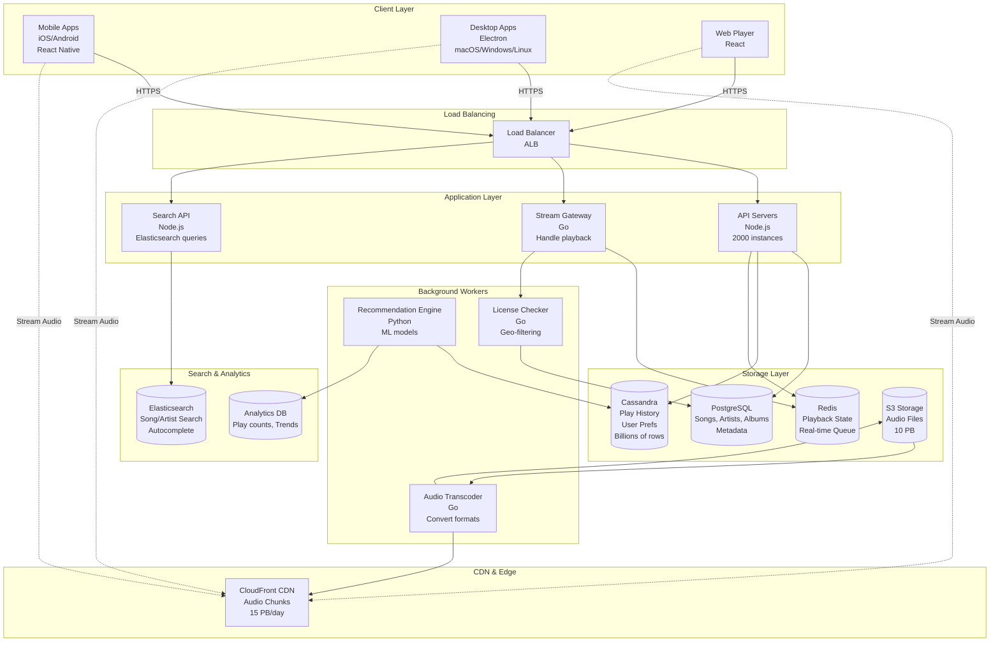
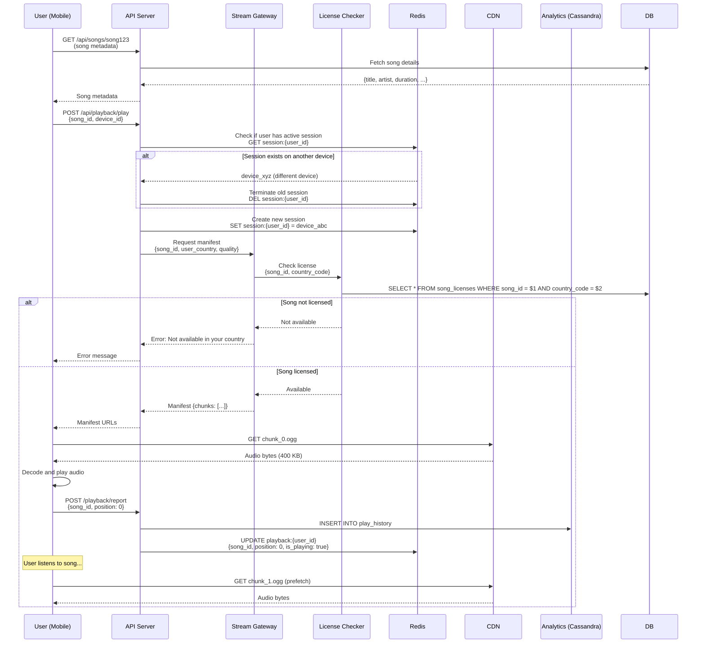
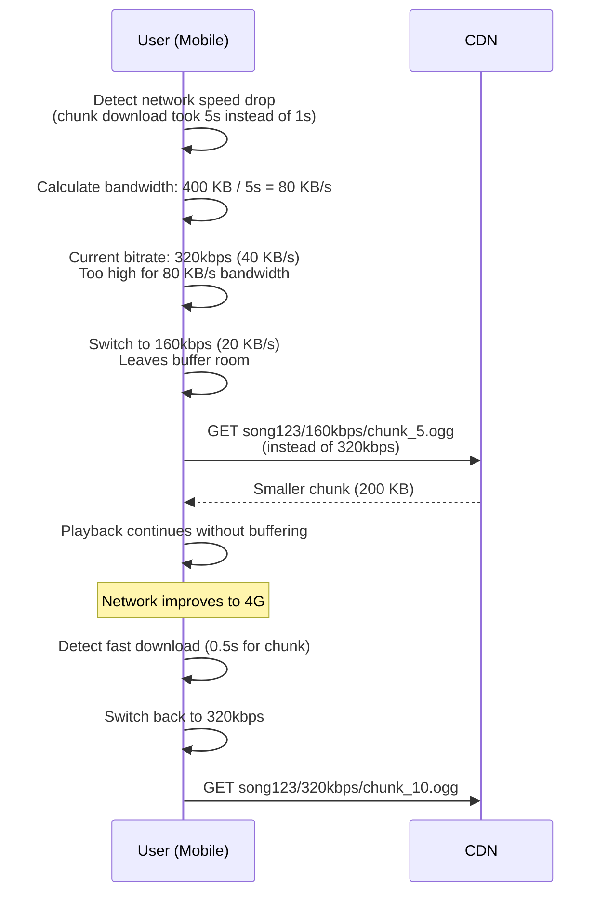
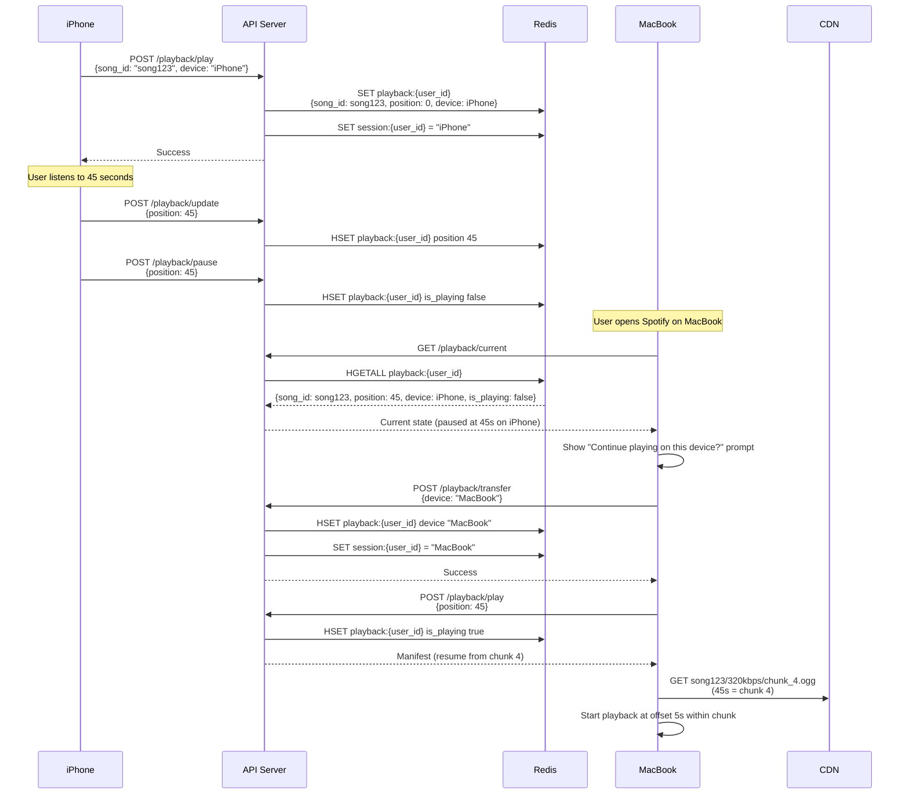
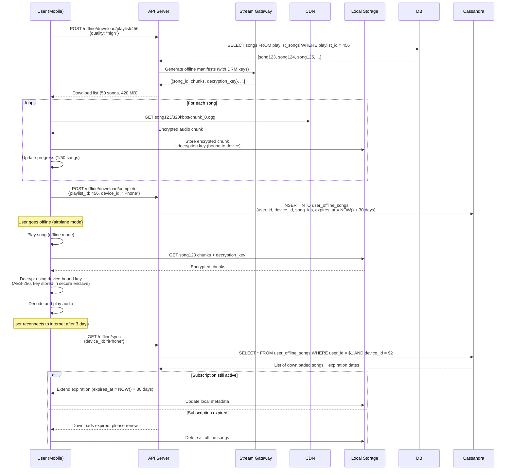
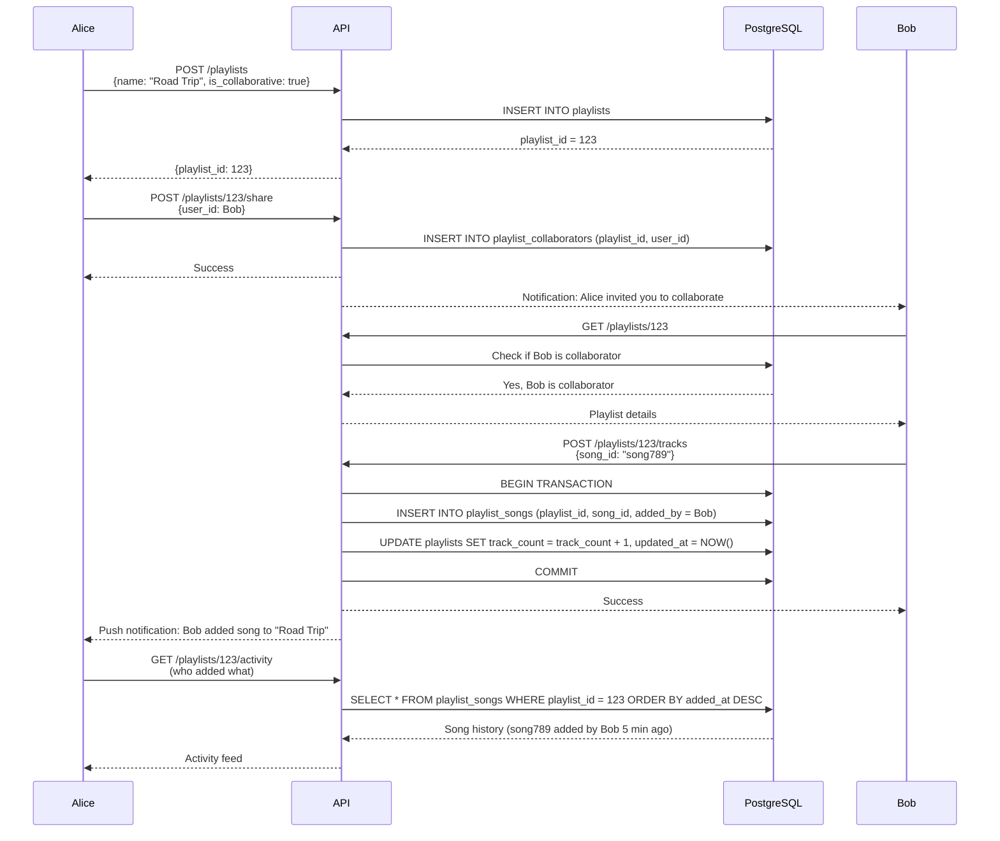

# Spotify System Design

**Music Streaming Platform at Global Scale**

*(New Grad / Junior Engineer Interview Focus | TypeScript/Node.js + Go + PostgreSQL)*

---

## 0️⃣ Executive Summary

### System Purpose
Spotify is a **music streaming platform** that delivers 100+ million songs to 600 million users worldwide. Users can stream music on-demand, create playlists, discover new artists, download songs for offline listening, and share music with friends. As of 2026, Spotify serves 600M monthly active users with 100M songs in its catalog, streaming 3 billion songs per day.

### Core Constraints
- **High bandwidth**: Streaming 3B songs/day = 500 PB/month bandwidth
- **Low latency**: Music must start playing within 1 second (or users skip)
- **Offline mode**: Users expect to download songs and listen without internet
- **Global catalog**: Same song available in 180+ countries (licensing complexity)
- **Personalized recommendations**: "Discover Weekly" playlist requires understanding user taste
- **Real-time sync**: Pause on phone, resume on laptop at same position

### Key Architectural Choices
1. **CDN for audio delivery** (songs streamed from edge locations, not origin)
2. **Multiple audio formats** (Ogg Vorbis 320kbps high quality, 96kbps mobile, 24kbps low bandwidth)
3. **Chunked streaming** (songs split into 10-second chunks for adaptive bitrate)
4. **PostgreSQL for metadata** (songs, artists, albums, playlists)
5. **Cassandra for user data** (play history, favorites - billions of rows)
6. **Redis for real-time state** (current playback position, queue)
7. **Go for audio transcoding** (convert audio formats, CPU-intensive)

### Biggest Challenges
- **Bandwidth costs**: 500 PB/month = $40M/year just for streaming
- **Licensing per region**: Song available in US but not India (complex geo-filtering)
- **Audio quality vs bandwidth**: High quality (320kbps) vs mobile data limits
- **Recommendations at scale**: Generate personalized playlists for 600M users weekly
- **Offline sync**: Download 3,000 songs to device, keep in sync with cloud
- **Concurrent listening**: User can't play on phone + laptop simultaneously (enforce single session)

### Interview Focus (New Grad Level)
- Audio streaming fundamentals (chunked delivery, adaptive bitrate)
- CDN for media (why not serve from backend servers)
- Playlist data modeling (songs, albums, artists relationships)
- Offline download management (sync, storage limits, DRM)
- Basic recommendation concepts (collaborative filtering, content-based)
- Real-time playback state sync (pause on phone, resume on laptop)

---

## 1️⃣ Problem Definition

### What Problem Does Spotify Solve?

Spotify replaces **buying individual songs/albums** with **unlimited streaming**:

1. **Instant access**: 100M songs instantly available (no buying/downloading)
2. **Discovery**: Discover new music based on taste (not just radio)
3. **Cross-device sync**: Start on phone, continue on laptop
4. **Offline mode**: Download songs for airplane, subway (no internet)
5. **Social sharing**: Share songs, playlists with friends
6. **Personalization**: Playlists tailored to your taste ("Discover Weekly")

### Who Are the Users?

- **600 million monthly active users** (as of 2026)
- **250 million premium subscribers** (ad-free, offline, high quality)
- **350 million free users** (ads, no offline, 160kbps quality)
- **3 billion songs streamed per day**
- **100+ million songs** in catalog
- **Use cases**: 
  - Commuters: Listening while traveling (offline mode critical)
  - Gym-goers: Workout playlists, upbeat music
  - Workers: Background music while coding/working
  - Explorers: Discover new artists, genres
  - Social: Share playlists with friends

### Why Existing Solutions Failed

#### ❌ Buying Songs on iTunes
```
Alice wants to listen to new album
→ Goes to iTunes
→ Buys album for $9.99
→ Downloads 12 songs (300 MB)
→ Next week: New album released, another $9.99
→ After 1 year: Spent $500 on music
```

**Why it fails**:
- **Expensive**: $10/album × 50 albums/year = $500 (vs Spotify $120/year)
- **Commitment**: Must buy before listening (what if album is bad?)
- **Storage**: 10,000 songs = 40 GB phone storage
- **No discovery**: Can't explore new music without buying

---

#### ❌ Radio (Pandora, FM Radio)
```
Bob turns on Pandora "Rock Radio"
→ Hears 5 songs he likes
→ Song 6: Doesn't like, can't skip (free tier)
→ Song 7: Ad (30 seconds)
→ Song 8: Already heard 3 times today
→ Can't choose specific song
```

**Why it fails**:
- **No control**: Can't choose specific song, just genre
- **Limited skips**: Free tier allows 6 skips/hour (frustrating)
- **Ads**: Frequent ads interrupt music
- **No offline**: Must have internet connection

---

#### ❌ Piracy (Mp3 Download Sites)
```
Carol wants to listen to Taylor Swift album
→ Searches "Taylor Swift download free"
→ Downloads from shady site (malware risk)
→ Low quality (128kbps, garbled audio)
→ No album art, wrong metadata
→ Must manually organize files
```

**Why it fails**:
- **Illegal**: Copyright violation, risk of lawsuits
- **Poor quality**: Low bitrate, corrupted files
- **Malware**: Download sites full of viruses
- **No discovery**: Must know what you're looking for
- **No sync**: Can't sync across devices

---

### Constraints That Shape the System

1. **Bandwidth-heavy**: 3B songs/day × 5 MB/song = 15 PB/day bandwidth (expensive!)
2. **Low latency**: Music must start <1s (or users rage-quit)
3. **Mobile-first**: 80% of streaming from mobile (optimize for cellular networks)
4. **Offline required**: Commuters, travelers need offline (15% of plays are offline)
5. **Licensing complexity**: Song available in US, blocked in Germany (geo-filtering)
6. **Storage limits**: Can't download entire catalog (limit: 10,000 songs offline)
7. **DRM required**: Prevent piracy (encrypted downloads, expire after 30 days offline)

---

## 2️⃣ Requirements

### Functional Requirements

#### Core Features
1. **Stream music**
   - Play any song from 100M song catalog
   - Seek within song (jump to 1:30)
   - Next/previous track
   - Shuffle, repeat modes
   - Adaptive bitrate (switch quality based on network)

2. **Search**
   - Search songs by name ("Shape of You")
   - Search artists ("Ed Sheeran")
   - Search albums ("÷ (Divide)")
   - Search playlists ("Top 50 Global")
   - Autocomplete (show suggestions as you type)

3. **Playlists**
   - Create custom playlist ("My Gym Playlist")
   - Add/remove songs
   - Reorder songs (drag-and-drop)
   - Share playlist (public link)
   - Collaborative playlist (friends can add songs)
   - Follow others' playlists

4. **Library management**
   - Save songs to "Liked Songs"
   - Follow artists (get notified of new releases)
   - Save albums
   - Recently played history
   - View play count, favorite genres

5. **Offline mode (Premium only)**
   - Download playlist (up to 10,000 songs per device)
   - Auto-download new songs in playlist
   - Remove downloads to free space
   - Sync across devices (download on phone, available on tablet)
   - DRM (downloads expire if subscription canceled)

6. **Social features**
   - See what friends are listening to
   - Share song via link (opens in Spotify)
   - Collaborative playlists
   - User profiles (public playlists, followers)

7. **Recommendations**
   - "Discover Weekly" (30 new songs personalized weekly)
   - "Daily Mix" (6 playlists based on listening history)
   - "Release Radar" (new songs from followed artists)
   - Similar artists/songs
   - Radio (auto-generate similar songs from seed song)

#### Secondary Features
8. **Cross-device sync**
   - Pause on phone, resume on laptop at same timestamp
   - Queue synced across devices
   - Playback state (current song, position, volume)

9. **Lyrics**
   - Show synchronized lyrics (highlight current line)
   - Scroll lyrics independently

10. **Podcasts**
    - Stream podcast episodes
    - Download for offline
    - Resume playback across devices

### Non-Functional Requirements

#### Scale (2026 Numbers)

| Metric | Value | Derivation |
|--------|-------|-----------|
| **Monthly Active Users (MAU)** | 600 million | Spotify reported data |
| **Premium Subscribers** | 250 million | ~42% of MAU |
| **Free Users** | 350 million | ~58% of MAU |
| **Songs Streamed per Day** | 3 billion | 600M MAU × 5 songs/day avg |
| **Songs in Catalog** | 100 million | Growing 60K/day |
| **Songs per Second (avg)** | 35,000 | 3B ÷ 86,400 sec |
| **Songs per Second (peak)** | 100,000 | 3× avg (evening commute) |
| **Average Song Duration** | 3.5 minutes | Typical pop song |
| **Average Song Size (320kbps)** | 8.4 MB | 3.5 min × 320kbps ÷ 8 |
| **Average Song Size (160kbps)** | 4.2 MB | Free tier quality |
| **Daily Bandwidth** | 15 PB | 3B songs × 5 MB avg |
| **Monthly Bandwidth** | 450 PB | 15 PB × 30 days |
| **CDN Cost (estimate)** | $40M/year | 450 PB/mo × $0.085/GB |

#### Audio Quality Tiers

| Tier | Bitrate | File Size (3.5 min) | Use Case |
|------|---------|---------------------|----------|
| **Low** | 24 kbps | 630 KB | Poor network, data saving |
| **Normal** | 96 kbps | 2.5 MB | Mobile data |
| **High** | 160 kbps | 4.2 MB | Free tier max |
| **Very High** | 320 kbps | 8.4 MB | Premium, Wi-Fi |
| **HiFi** | 1411 kbps (FLAC) | 37 MB | Audiophiles, wired headphones |

**Premium users**: Default to 320kbps on Wi-Fi, 160kbps on cellular (configurable)
**Free users**: Max 160kbps, ads every 15 minutes

#### Latency Targets

| Operation | P50 | P99 | Max Acceptable | Rationale |
|-----------|-----|-----|----------------|-----------|
| **Search Results** | 100ms | 500ms | 1s | Must feel instant |
| **Song Start (Buffered)** | 300ms | 1s | 2s | Critical UX (users impatient) |
| **Song Start (Cold)** | 1s | 3s | 5s | Acceptable if loading bar shown |
| **Skip to Next** | 200ms | 800ms | 1.5s | Must be seamless |
| **Seek Within Song** | 100ms | 500ms | 1s | Scrubbing timeline |
| **Playlist Load** | 100ms | 500ms | 2s | Showing 50 songs |
| **Offline Download** | N/A | N/A | 5s/song | Background, low priority |

**Song Start Latency Budget (P99)**:
```
DNS lookup:                      50ms (cached)
TCP handshake:                   50ms (CDN edge)
HTTP request/response headers:   50ms
First audio chunk download:      200ms (100 KB @ 400 KB/s 3G)
Audio decode + buffer:           50ms
---------------------------------------------------
Total:                           400ms (within 1s target)
```

#### Availability & Durability

| Requirement | Target | Implementation |
|-------------|--------|----------------|
| **Streaming Availability** | 99.9% | Multi-region CDN, auto-failover |
| **Catalog Durability** | 99.999999999% | S3 (11 nines), replicated |
| **User Data Durability** | 99.99% | Cassandra (3 replicas) |
| **Offline Downloads** | 99% | Local storage, resilient to network |
| **Max Downtime** | 43 minutes/month | 99.9% uptime |

#### Bandwidth Optimization

**Problem**: Streaming 3B songs/day = 15 PB/day = $1.3M/day bandwidth cost

**Optimizations**:
1. **Adaptive bitrate**: Drop to 96kbps on slow network (save 70% bandwidth)
2. **CDN caching**: 90% hit rate (only 10% reaches origin)
3. **Audio compression**: Ogg Vorbis (30% smaller than MP3 at same quality)
4. **Prefetching**: Download next song while current song plays (seamless skip)
5. **Offline downloads**: 15% of plays are offline (zero bandwidth)

---

## 3️⃣ High-Level Architecture

### Component Overview



### Component Responsibilities

#### 1. Mobile/Desktop/Web Clients

**Technology**: React Native (Mobile), Electron (Desktop), React (Web)

**Responsibilities**:
- Display UI (search, playlists, player controls)
- Streaming audio (fetch chunks from CDN, decode, play)
- Offline downloads (store encrypted audio locally)
- Playback state management (play, pause, seek, queue)
- Sync with cloud (current position, queue)

**Audio Playback Flow**:
```typescript
interface AudioPlayer {
  currentSong: Song;
  currentPosition: number;  // Seconds
  queue: Song[];
  isPlaying: boolean;
  volume: number;
}

async function playSong(song: Song) {
  // 1. Fetch audio manifest (chunk URLs)
  const manifest = await api.get(`/stream/${song.id}/manifest`);
  
  // 2. Download first chunk (0-10 seconds)
  const chunk1 = await cdn.get(manifest.chunks[0].url);
  
  // 3. Decode and start playback
  audioContext.decodeAudioData(chunk1, (buffer) => {
    source.buffer = buffer;
    source.start(0);
  });
  
  // 4. Prefetch next chunk in background
  prefetchChunk(manifest.chunks[1].url);
  
  // 5. Report playback to server (for analytics, sync)
  api.post('/playback/report', { songId: song.id, timestamp: 0 });
}
```

**Offline Storage**:
```typescript
// Download song for offline
async function downloadSong(songId: string) {
  // 1. Fetch encrypted audio chunks
  const manifest = await api.get(`/stream/${songId}/manifest?offline=true`);
  
  // 2. Download all chunks
  for (const chunk of manifest.chunks) {
    const encrypted = await cdn.get(chunk.url);
    await localDB.put(`song:${songId}:chunk:${chunk.index}`, encrypted);
  }
  
  // 3. Store decryption key (bound to device + subscription)
  await localDB.put(`song:${songId}:key`, manifest.decryption_key);
  
  // 4. Mark as downloaded
  await localDB.put(`song:${songId}:downloaded`, true);
}
```

---

#### 2. CDN (CloudFront)

**Purpose**: Deliver audio chunks from edge locations

**Why CDN?**
- **Latency**: Serving from US server to India user = 300ms, from Mumbai edge = 50ms
- **Bandwidth**: Origin servers can't handle 15 PB/day (CDN distributes load)
- **Cost**: CDN data transfer cheaper than direct S3 egress

**CDN Architecture**:
```
User in Tokyo → CloudFront Tokyo edge
              → If cache miss → CloudFront Tokyo regional cache
                              → If still miss → S3 us-east-1 origin
```

**Cache Headers**:
```http
Cache-Control: public, max-age=31536000, immutable
```
(Audio files never change once uploaded, cache forever)

**Cache Hit Rate**: 90% (popular songs served from edge, long tail from origin)

---

#### 3. API Servers (Node.js)

**Technology**: Node.js (Express/Fastify)

**Responsibilities**:
- Handle REST API requests (GET /songs, POST /playlists, etc.)
- Authenticate users (JWT validation)
- Fetch data from PostgreSQL, Cassandra, Redis
- Return JSON responses
- Rate limiting (prevent abuse)

**Example API Endpoint**:
```typescript
app.get('/api/playlist/:id', async (req, res) => {
  const playlistId = req.params.id;
  
  // 1. Fetch playlist metadata from PostgreSQL
  const playlist = await db.query(
    'SELECT * FROM playlists WHERE id = $1',
    [playlistId]
  );
  
  // 2. Fetch songs in playlist (join with songs table)
  const songs = await db.query(`
    SELECT s.*, ps.position 
    FROM playlist_songs ps
    JOIN songs s ON ps.song_id = s.id
    WHERE ps.playlist_id = $1
    ORDER BY ps.position
  `, [playlistId]);
  
  res.json({ playlist, songs });
});
```

---

#### 4. Stream Gateway (Go)

**Technology**: Go (high throughput, low latency)

**Responsibilities**:
- Generate audio stream manifest (chunk URLs)
- Check licensing (is song available in user's country?)
- Handle adaptive bitrate (select quality based on bandwidth)
- Track playback for analytics

**Manifest Generation**:
```go
func generateManifest(songID string, userCountry string, quality string) (*Manifest, error) {
    // 1. Check if song is licensed in user's country
    isLicensed, err := licenseChecker.CheckLicense(songID, userCountry)
    if err != nil || !isLicensed {
        return nil, errors.New("song not available in your country")
    }
    
    // 2. Determine audio format and bitrate
    format := "ogg" // Ogg Vorbis
    bitrate := getBitrate(quality) // 96, 160, 320 kbps
    
    // 3. Generate chunk URLs (10-second chunks)
    chunks := []Chunk{}
    for i := 0; i < 21; i++ { // 3.5 min song = 21 chunks
        chunks = append(chunks, Chunk{
            Index:     i,
            URL:       fmt.Sprintf("https://cdn.spotify.com/audio/%s/%s/%d.ogg", songID, bitrate, i),
            StartTime: i * 10,
            EndTime:   (i + 1) * 10,
        })
    }
    
    return &Manifest{
        SongID:    songID,
        Format:    format,
        Bitrate:   bitrate,
        Chunks:    chunks,
        Duration:  210, // 3.5 minutes in seconds
    }, nil
}
```

**Why Go?**
- CPU-bound task (manifest generation for 100K requests/sec)
- Low latency (must respond <100ms)
- Good concurrency (goroutines handle many requests in parallel)

---

#### 5. PostgreSQL (Metadata Storage)

**Purpose**: Store structured data (songs, artists, albums, playlists)

**Schema Overview**:
```sql
-- Songs
CREATE TABLE songs (
    id BIGSERIAL PRIMARY KEY,
    title VARCHAR(255) NOT NULL,
    artist_id BIGINT NOT NULL REFERENCES artists(id),
    album_id BIGINT REFERENCES albums(id),
    duration_seconds INT NOT NULL,
    release_date DATE,
    explicit BOOLEAN DEFAULT FALSE,
    isrc VARCHAR(12) UNIQUE,  -- International Standard Recording Code
    audio_file_key TEXT NOT NULL,  -- S3 key
    created_at TIMESTAMPTZ DEFAULT NOW()
);

CREATE INDEX idx_songs_artist ON songs(artist_id);
CREATE INDEX idx_songs_album ON songs(album_id);
CREATE INDEX idx_songs_title ON songs(title);

-- Artists
CREATE TABLE artists (
    id BIGSERIAL PRIMARY KEY,
    name VARCHAR(255) NOT NULL,
    bio TEXT,
    image_url TEXT,
    verified BOOLEAN DEFAULT FALSE,
    follower_count INT DEFAULT 0,
    monthly_listeners INT DEFAULT 0,
    created_at TIMESTAMPTZ DEFAULT NOW()
);

CREATE INDEX idx_artists_name ON artists(name);

-- Albums
CREATE TABLE albums (
    id BIGSERIAL PRIMARY KEY,
    title VARCHAR(255) NOT NULL,
    artist_id BIGINT NOT NULL REFERENCES artists(id),
    release_date DATE,
    cover_art_url TEXT,
    album_type VARCHAR(20),  -- 'album', 'single', 'compilation'
    total_tracks INT,
    created_at TIMESTAMPTZ DEFAULT NOW()
);

CREATE INDEX idx_albums_artist ON albums(artist_id);

-- Playlists
CREATE TABLE playlists (
    id BIGSERIAL PRIMARY KEY,
    user_id BIGINT NOT NULL REFERENCES users(id),
    name VARCHAR(255) NOT NULL,
    description TEXT,
    is_public BOOLEAN DEFAULT TRUE,
    is_collaborative BOOLEAN DEFAULT FALSE,
    follower_count INT DEFAULT 0,
    created_at TIMESTAMPTZ DEFAULT NOW(),
    updated_at TIMESTAMPTZ DEFAULT NOW()
);

CREATE INDEX idx_playlists_user ON playlists(user_id);

-- Playlist songs (many-to-many)
CREATE TABLE playlist_songs (
    playlist_id BIGINT NOT NULL REFERENCES playlists(id),
    song_id BIGINT NOT NULL REFERENCES songs(id),
    position INT NOT NULL,
    added_by BIGINT REFERENCES users(id),
    added_at TIMESTAMPTZ DEFAULT NOW(),
    PRIMARY KEY (playlist_id, song_id)
);

CREATE INDEX idx_playlist_songs_playlist ON playlist_songs(playlist_id, position);

-- Licensing (which songs available in which countries)
CREATE TABLE song_licenses (
    song_id BIGINT NOT NULL REFERENCES songs(id),
    country_code CHAR(2) NOT NULL,  -- 'US', 'IN', 'DE', etc.
    is_available BOOLEAN DEFAULT TRUE,
    PRIMARY KEY (song_id, country_code)
);

CREATE INDEX idx_song_licenses_song ON song_licenses(song_id);
```

**Why PostgreSQL?**
- Relational data (songs ↔ artists ↔ albums)
- ACID transactions (add song to playlist atomically)
- Complex queries (search by artist + genre + year)

---

#### 6. Cassandra (User Activity Data)

**Purpose**: Store high-write, high-volume user data (play history, favorites)

**Schema Overview**:
```cql
-- Play history (billions of rows, high write rate)
CREATE TABLE play_history (
    user_id BIGINT,
    played_at TIMESTAMP,
    song_id BIGINT,
    duration_played INT,  -- Seconds listened (0-210)
    context TEXT,  -- 'playlist:123', 'album:456', 'search'
    device_type TEXT,  -- 'mobile', 'desktop', 'web'
    PRIMARY KEY (user_id, played_at, song_id)
) WITH CLUSTERING ORDER BY (played_at DESC);

-- User liked songs
CREATE TABLE user_liked_songs (
    user_id BIGINT,
    song_id BIGINT,
    liked_at TIMESTAMP,
    PRIMARY KEY (user_id, liked_at, song_id)
) WITH CLUSTERING ORDER BY (liked_at DESC);

-- User followed artists
CREATE TABLE user_followed_artists (
    user_id BIGINT,
    artist_id BIGINT,
    followed_at TIMESTAMP,
    PRIMARY KEY (user_id, followed_at, artist_id)
) WITH CLUSTERING ORDER BY (followed_at DESC);
```

**Why Cassandra over PostgreSQL?**
- **Write-heavy**: 3B songs/day × analytics events = 10B writes/day
- **Time-series data**: Play history naturally partitioned by user + timestamp
- **Linear scaling**: Add more nodes to handle more writes
- **No complex joins**: Play history queries are simple (get user's history)

---

#### 7. Redis (Real-Time Playback State)

**Purpose**: Store ephemeral, real-time data (current playback, queue)

**Data Structures**:
```typescript
// Current playback state (per user)
playback:{userId} → HASH {
  songId: "song123",
  position: 45,  // Seconds
  isPlaying: true,
  device: "iPhone",
  lastUpdated: 1738200000
}

// Playback queue
queue:{userId} → LIST [song124, song125, song126, ...]

// Session lock (prevent simultaneous playback on multiple devices)
session:{userId} → STRING "device_id_abc123"
```

**Why Redis?**
- Sub-millisecond latency (critical for real-time sync)
- TTL support (playback state expires after 1 hour of inactivity)
- Atomic operations (update position atomically)

---

#### 8. S3 Storage (Audio Files)

**Purpose**: Store original and transcoded audio files

**Bucket Structure**:
```
spotify-audio/
  original/
    2026/01/28/song123_original.flac  (lossless, 37 MB)
  transcoded/
    320kbps/
      2026/01/28/song123_320kbps.ogg
      2026/01/28/song123_320kbps_chunk_0.ogg
      2026/01/28/song123_320kbps_chunk_1.ogg
      ... (21 chunks total)
    160kbps/
      2026/01/28/song123_160kbps_chunk_0.ogg
      ...
    96kbps/
      2026/01/28/song123_96kbps_chunk_0.ogg
      ...
```

**Why S3?**
- Cheap storage ($0.023/GB/month)
- 99.999999999% durability (won't lose songs)
- Integrates with CloudFront CDN
- Lifecycle policies (move old songs to Glacier if rarely played)

---

#### 9. Audio Transcoder (Go)

**Purpose**: Convert uploaded audio to multiple formats and chunk

**Workflow**:
```
1. Artist uploads FLAC file (37 MB, lossless)
2. S3 triggers Lambda/worker (via SNS)
3. Audio Transcoder downloads original
4. Transcode to Ogg Vorbis at 320kbps, 160kbps, 96kbps, 24kbps
5. Split each version into 10-second chunks
6. Upload chunks to S3
7. Update CDN cache
```

**Why Go?**
- CPU-bound task (audio transcoding)
- Good libraries (ffmpeg wrapper)
- Fast execution (process 1,000 songs/hour per instance)

**Example Code**:
```go
func transcodeAndChunk(originalPath string, outputBitrate int) error {
    // 1. Transcode using ffmpeg
    cmd := exec.Command("ffmpeg",
        "-i", originalPath,
        "-c:a", "libvorbis",
        "-b:a", fmt.Sprintf("%dk", outputBitrate),
        "-f", "ogg",
        fmt.Sprintf("%s_%dkbps.ogg", originalPath, outputBitrate),
    )
    if err := cmd.Run(); err != nil {
        return err
    }
    
    // 2. Split into 10-second chunks
    transcodedPath := fmt.Sprintf("%s_%dkbps.ogg", originalPath, outputBitrate)
    for i := 0; i < 21; i++ { // 3.5 min = 21 chunks
        startTime := i * 10
        chunkCmd := exec.Command("ffmpeg",
            "-i", transcodedPath,
            "-ss", fmt.Sprintf("%d", startTime),
            "-t", "10",
            "-c", "copy",  // No re-encoding, just split
            fmt.Sprintf("%s_chunk_%d.ogg", transcodedPath, i),
        )
        if err := chunkCmd.Run(); err != nil {
            return err
        }
        
        // 3. Upload chunk to S3
        uploadToS3(fmt.Sprintf("%s_chunk_%d.ogg", transcodedPath, i))
    }
    
    return nil
}
```

---

#### 10. Elasticsearch (Search)

**Purpose**: Search songs, artists, albums with autocomplete

**Indices**:
```json
// Songs index
{
  "id": "song123",
  "title": "Shape of You",
  "artist": "Ed Sheeran",
  "album": "÷ (Divide)",
  "duration": 234,
  "popularity": 95,  // 0-100 score
  "release_year": 2017
}

// Artists index
{
  "id": "artist456",
  "name": "Ed Sheeran",
  "genres": ["pop", "acoustic"],
  "follower_count": 50000000,
  "monthly_listeners": 80000000
}
```

**Why Elasticsearch?**
- Full-text search ("shape" matches "Shape of You")
- Fast autocomplete (show suggestions as you type)
- Relevance ranking (popular songs appear first)

---

## 4️⃣ API & Interface Design

### REST API Endpoints

#### Playback Control
```typescript
// Start playing song
POST /api/playback/play
Request: {
  "song_id": "song123",
  "device_id": "device_abc",
  "context": "playlist:456"  // Where user is playing from
}
Response: {
  "manifest_url": "https://api.spotify.com/stream/song123/manifest",
  "current_position": 0
}

// Pause playback
POST /api/playback/pause
Request: {
  "device_id": "device_abc",
  "position": 45  // Current position in seconds
}
Response: {
  "success": true
}

// Seek to position
POST /api/playback/seek
Request: {
  "song_id": "song123",
  "position": 120  // Jump to 2:00
}
Response: {
  "success": true
}

// Get current playback state
GET /api/playback/current
Response: {
  "song": {
    "id": "song123",
    "title": "Shape of You",
    "artist": "Ed Sheeran",
    "duration": 234
  },
  "position": 45,
  "is_playing": true,
  "device": {
    "id": "device_abc",
    "name": "Alice's iPhone",
    "type": "mobile"
  },
  "queue": ["song124", "song125", "song126"]
}
```

---

#### Streaming
```typescript
// Get audio manifest (chunk URLs)
GET /stream/:songId/manifest?quality=high&offline=false
Response: {
  "song_id": "song123",
  "format": "ogg",
  "bitrate": 320,  // kbps
  "duration": 234,  // seconds
  "chunks": [
    {
      "index": 0,
      "url": "https://cdn.spotify.com/audio/song123/320/0.ogg",
      "start_time": 0,
      "end_time": 10,
      "size": 400000  // bytes
    },
    {
      "index": 1,
      "url": "https://cdn.spotify.com/audio/song123/320/1.ogg",
      "start_time": 10,
      "end_time": 20,
      "size": 400000
    },
    ...
  ]
}
```

**Why chunked streaming?**
- **Adaptive bitrate**: Switch quality mid-song (if network degrades)
- **Fast start**: Download first chunk (10 sec) quickly, prefetch rest
- **Seeking**: Jump to 2:00 = fetch chunk 12 (not entire song)

---

#### Search
```typescript
// Search songs
GET /api/search?q=shape+of+you&type=song&limit=20
Response: {
  "songs": [
    {
      "id": "song123",
      "title": "Shape of You",
      "artist": {
        "id": "artist456",
        "name": "Ed Sheeran"
      },
      "album": {
        "id": "album789",
        "title": "÷ (Divide)",
        "cover_art": "https://cdn.spotify.com/covers/album789.jpg"
      },
      "duration": 234,
      "explicit": false
    },
    ...
  ]
}

// Autocomplete (as user types)
GET /api/search/autocomplete?q=shape&limit=5
Response: {
  "suggestions": [
    { "type": "song", "text": "Shape of You - Ed Sheeran" },
    { "type": "song", "text": "Shake It Off - Taylor Swift" },
    { "type": "artist", "text": "Shakira" },
    ...
  ]
}
```

---

#### Playlists
```typescript
// Create playlist
POST /api/playlists
Request: {
  "name": "My Gym Playlist",
  "description": "High-energy workout music",
  "is_public": true
}
Response: {
  "playlist_id": "playlist123",
  "name": "My Gym Playlist",
  "created_at": "2026-01-29T10:00:00Z"
}

// Add song to playlist
POST /api/playlists/:playlistId/tracks
Request: {
  "song_ids": ["song123", "song124"],
  "position": 0  // Add at beginning (optional)
}
Response: {
  "success": true,
  "new_track_count": 42
}

// Get playlist
GET /api/playlists/:playlistId
Response: {
  "playlist": {
    "id": "playlist123",
    "name": "My Gym Playlist",
    "description": "High-energy workout music",
    "owner": {
      "user_id": "user456",
      "username": "alice"
    },
    "is_public": true,
    "follower_count": 150,
    "created_at": "2026-01-29T10:00:00Z"
  },
  "tracks": [
    {
      "song_id": "song123",
      "title": "Eye of the Tiger",
      "artist": "Survivor",
      "duration": 245,
      "added_at": "2026-01-29T10:05:00Z",
      "added_by": "user456"
    },
    ...
  ]
}

// Follow playlist
POST /api/playlists/:playlistId/follow
Response: {
  "success": true,
  "new_follower_count": 151
}
```

---

#### Offline Downloads
```typescript
// Download playlist for offline
POST /api/offline/download/playlist/:playlistId
Request: {
  "quality": "high",  // 320kbps
  "device_id": "device_abc"
}
Response: {
  "download_id": "dl789",
  "total_songs": 50,
  "total_size": 420000000,  // 420 MB
  "estimated_time": 300  // 5 minutes
}

// Get download progress
GET /api/offline/downloads/:downloadId
Response: {
  "download_id": "dl789",
  "status": "in_progress",
  "songs_downloaded": 30,
  "songs_total": 50,
  "bytes_downloaded": 252000000,
  "bytes_total": 420000000
}

// List offline songs
GET /api/offline/songs?device_id=device_abc
Response: {
  "songs": [
    {
      "song_id": "song123",
      "title": "Shape of You",
      "artist": "Ed Sheeran",
      "downloaded_at": "2026-01-29T10:00:00Z",
      "size": 8400000,  // 8.4 MB
      "expires_at": "2026-02-28T10:00:00Z"  // 30 days
    },
    ...
  ],
  "total_size": 420000000,
  "storage_limit": 10000000000  // 10 GB (10,000 songs max)
}
```

---

#### Recommendations
```typescript
// Get "Discover Weekly" playlist
GET /api/recommendations/discover-weekly
Response: {
  "playlist_id": "discover_weekly_user456",
  "name": "Discover Weekly",
  "description": "Your weekly mixtape of fresh music",
  "updated_at": "2026-01-27T00:00:00Z",  // Every Monday
  "songs": [
    {
      "song_id": "song789",
      "title": "New Artist - New Song",
      "artist": "Unknown Artist",
      "reason": "Based on your listening to Ed Sheeran and Taylor Swift"
    },
    ...
  ]
}

// Get song radio (similar songs)
GET /api/radio/song/:songId?limit=50
Response: {
  "seed_song": {
    "id": "song123",
    "title": "Shape of You",
    "artist": "Ed Sheeran"
  },
  "songs": [
    {
      "song_id": "song200",
      "title": "Perfect",
      "artist": "Ed Sheeran",
      "similarity_score": 0.95
    },
    ...
  ]
}
```

---

## 5️⃣ Data Modeling & Storage

### PostgreSQL Schema (Detailed)

```sql
-- Users
CREATE TABLE users (
    id BIGSERIAL PRIMARY KEY,
    username VARCHAR(50) UNIQUE NOT NULL,
    email VARCHAR(255) UNIQUE NOT NULL,
    password_hash VARCHAR(255) NOT NULL,
    display_name VARCHAR(100),
    country_code CHAR(2),  -- 'US', 'IN', 'GB', etc.
    subscription_tier VARCHAR(20),  -- 'free', 'premium', 'family', 'student'
    subscription_expires_at TIMESTAMPTZ,
    created_at TIMESTAMPTZ DEFAULT NOW()
);

CREATE INDEX idx_users_email ON users(email);
CREATE INDEX idx_users_username ON users(username);

-- Songs
CREATE TABLE songs (
    id BIGSERIAL PRIMARY KEY,
    title VARCHAR(255) NOT NULL,
    artist_id BIGINT NOT NULL REFERENCES artists(id),
    album_id BIGINT REFERENCES albums(id),
    duration_seconds INT NOT NULL,
    release_date DATE,
    explicit BOOLEAN DEFAULT FALSE,
    isrc VARCHAR(12) UNIQUE,  -- International Standard Recording Code
    audio_file_key TEXT NOT NULL,  -- S3 key: audio/2026/01/28/song123
    play_count BIGINT DEFAULT 0,
    created_at TIMESTAMPTZ DEFAULT NOW()
);

CREATE INDEX idx_songs_artist ON songs(artist_id);
CREATE INDEX idx_songs_album ON songs(album_id);
CREATE INDEX idx_songs_title ON songs(title);
CREATE INDEX idx_songs_release_date ON songs(release_date DESC);

-- Artists
CREATE TABLE artists (
    id BIGSERIAL PRIMARY KEY,
    name VARCHAR(255) NOT NULL,
    bio TEXT,
    image_url TEXT,
    verified BOOLEAN DEFAULT FALSE,
    genres TEXT[],  -- ['pop', 'rock', 'acoustic']
    follower_count INT DEFAULT 0,
    monthly_listeners INT DEFAULT 0,
    created_at TIMESTAMPTZ DEFAULT NOW()
);

CREATE INDEX idx_artists_name ON artists(name);
CREATE INDEX idx_artists_follower_count ON artists(follower_count DESC);

-- Albums
CREATE TABLE albums (
    id BIGSERIAL PRIMARY KEY,
    title VARCHAR(255) NOT NULL,
    artist_id BIGINT NOT NULL REFERENCES artists(id),
    release_date DATE,
    cover_art_url TEXT,
    album_type VARCHAR(20),  -- 'album', 'single', 'compilation', 'ep'
    total_tracks INT,
    label VARCHAR(255),  -- Record label
    created_at TIMESTAMPTZ DEFAULT NOW()
);

CREATE INDEX idx_albums_artist ON albums(artist_id);
CREATE INDEX idx_albums_release_date ON albums(release_date DESC);

-- Playlists
CREATE TABLE playlists (
    id BIGSERIAL PRIMARY KEY,
    user_id BIGINT NOT NULL REFERENCES users(id),
    name VARCHAR(255) NOT NULL,
    description TEXT,
    is_public BOOLEAN DEFAULT TRUE,
    is_collaborative BOOLEAN DEFAULT FALSE,
    follower_count INT DEFAULT 0,
    track_count INT DEFAULT 0,
    created_at TIMESTAMPTZ DEFAULT NOW(),
    updated_at TIMESTAMPTZ DEFAULT NOW()
);

CREATE INDEX idx_playlists_user ON playlists(user_id);
CREATE INDEX idx_playlists_public ON playlists(is_public) WHERE is_public = TRUE;

-- Playlist songs
CREATE TABLE playlist_songs (
    playlist_id BIGINT NOT NULL REFERENCES playlists(id) ON DELETE CASCADE,
    song_id BIGINT NOT NULL REFERENCES songs(id),
    position INT NOT NULL,
    added_by BIGINT REFERENCES users(id),
    added_at TIMESTAMPTZ DEFAULT NOW(),
    PRIMARY KEY (playlist_id, song_id)
);

CREATE INDEX idx_playlist_songs_position ON playlist_songs(playlist_id, position);

-- Song licenses (geo-filtering)
CREATE TABLE song_licenses (
    song_id BIGINT NOT NULL REFERENCES songs(id),
    country_code CHAR(2) NOT NULL,  -- 'US', 'IN', 'DE', etc.
    is_available BOOLEAN DEFAULT TRUE,
    license_holder VARCHAR(255),  -- Record label/rights holder
    PRIMARY KEY (song_id, country_code)
);

CREATE INDEX idx_song_licenses_song ON song_licenses(song_id);
CREATE INDEX idx_song_licenses_country ON song_licenses(country_code) WHERE is_available = TRUE;

-- User follows artists
CREATE TABLE user_artist_follows (
    user_id BIGINT NOT NULL REFERENCES users(id),
    artist_id BIGINT NOT NULL REFERENCES artists(id),
    followed_at TIMESTAMPTZ DEFAULT NOW(),
    PRIMARY KEY (user_id, artist_id)
);

CREATE INDEX idx_user_artist_follows_user ON user_artist_follows(user_id);

-- User follows playlists
CREATE TABLE user_playlist_follows (
    user_id BIGINT NOT NULL REFERENCES users(id),
    playlist_id BIGINT NOT NULL REFERENCES playlists(id),
    followed_at TIMESTAMPTZ DEFAULT NOW(),
    PRIMARY KEY (user_id, playlist_id)
);

CREATE INDEX idx_user_playlist_follows_user ON user_playlist_follows(user_id);
```

---

### Cassandra Schema (User Activity)

```cql
-- Play history (billions of rows)
CREATE TABLE play_history (
    user_id BIGINT,
    played_at TIMESTAMP,
    song_id BIGINT,
    duration_played INT,  -- Seconds listened (skip after 10s, duration_played = 10)
    context TEXT,  -- 'playlist:123', 'album:456', 'search', 'radio'
    device_type TEXT,  -- 'mobile', 'desktop', 'web', 'smart_speaker'
    country_code TEXT,
    PRIMARY KEY (user_id, played_at, song_id)
) WITH CLUSTERING ORDER BY (played_at DESC)
  AND gc_grace_seconds = 864000  -- 10 days
  AND compaction = {'class': 'TimeWindowCompactionStrategy'};

-- User liked songs (favorite songs)
CREATE TABLE user_liked_songs (
    user_id BIGINT,
    song_id BIGINT,
    liked_at TIMESTAMP,
    PRIMARY KEY (user_id, liked_at, song_id)
) WITH CLUSTERING ORDER BY (liked_at DESC);

-- Offline downloads (which songs user has downloaded)
CREATE TABLE user_offline_songs (
    user_id BIGINT,
    device_id TEXT,
    song_id BIGINT,
    downloaded_at TIMESTAMP,
    quality TEXT,  -- '96kbps', '160kbps', '320kbps'
    size_bytes BIGINT,
    expires_at TIMESTAMP,  -- 30 days from download
    PRIMARY KEY ((user_id, device_id), downloaded_at, song_id)
) WITH CLUSTERING ORDER BY (downloaded_at DESC);
```

**Why Cassandra for Play History?**
- **Write-heavy**: 3B plays/day = 35,000 writes/sec
- **Partition by user**: Each user's history isolated (no cross-user queries needed)
- **Time-series**: Naturally ordered by timestamp
- **TTL support**: Old play history auto-deleted after 1 year (save storage)

---

### Storage Size Estimation

**PostgreSQL (Metadata)**:
```
Songs:      100M rows × 500 bytes = 50 GB
Artists:    5M rows × 300 bytes = 1.5 GB
Albums:     20M rows × 300 bytes = 6 GB
Playlists:  500M rows × 200 bytes = 100 GB
Playlist songs: 10B rows × 50 bytes = 500 GB
Licenses:   100M songs × 50 countries × 10 bytes = 50 GB
---------------------------------------------------
Total:      ~700 GB (fits in single PostgreSQL instance)
```

**Cassandra (User Activity)**:
```
Play history: 
  3B plays/day × 365 days × 100 bytes = 110 TB/year
  Keep 2 years: 220 TB

Liked songs:
  600M users × 500 liked songs avg × 50 bytes = 15 TB

Offline downloads:
  250M premium users × 1,000 songs × 50 bytes = 12.5 TB
---------------------------------------------------
Total:      ~250 TB (distributed across 50 nodes = 5 TB/node)
```

**S3 (Audio Files)**:
```
100M songs × (37 MB original + 8.4 MB @ 320kbps + 4.2 MB @ 160kbps + 2.5 MB @ 96kbps)
= 100M × 52 MB
= 5,200 PB (5.2 exabytes)

Cost: 5,200 PB × $23/TB/month = $120M/month
Optimization: Most songs rarely played → move to Glacier after 6 months
Active catalog (last 6 months): 30M songs × 52 MB = 1,560 PB = $36M/month
Old catalog (Glacier): 70M songs × 52 MB = 3,640 PB × $4/TB/month = $15M/month
Total: $51M/month
```

---

## 6️⃣ Core System Flows

### Flow 1: User Plays Song



**Key Points**:
1. **License check**: Before streaming, verify song is available in user's country
2. **Session management**: Only one active playback session per user (pause on old device)
3. **Manifest generation**: Stream Gateway generates chunk URLs (not direct file URLs)
4. **Prefetching**: Download next chunk while current chunk plays (seamless playback)
5. **Analytics**: Report playback to Cassandra (for recommendations, play counts)

---

### Flow 2: Adaptive Bitrate Switching

**Scenario**: User on train, network degrades from 4G (10 Mbps) to 3G (1 Mbps)



**Implementation** (Client-side):
```typescript
class AdaptiveBitrateController {
  currentBitrate = 320; // kbps
  downloadTimes: number[] = [];
  
  async fetchChunk(songId: string, chunkIndex: number): Promise<Blob> {
    const startTime = Date.now();
    
    const url = `https://cdn.spotify.com/audio/${songId}/${this.currentBitrate}kbps/${chunkIndex}.ogg`;
    const chunk = await fetch(url).then(r => r.blob());
    
    const downloadTime = Date.now() - startTime;
    this.downloadTimes.push(downloadTime);
    
    // Adjust bitrate based on recent download times
    this.adjustBitrate(chunk.size, downloadTime);
    
    return chunk;
  }
  
  adjustBitrate(chunkSize: number, downloadTime: number) {
    // Calculate bandwidth (bytes per second)
    const bandwidth = chunkSize / (downloadTime / 1000);
    
    // Each quality tier requires certain bandwidth
    // 320kbps = 40 KB/s, 160kbps = 20 KB/s, 96kbps = 12 KB/s
    const requiredBandwidth = this.currentBitrate / 8; // kbps → KB/s
    
    if (bandwidth < requiredBandwidth * 1.5) {
      // Not enough bandwidth, drop quality
      if (this.currentBitrate === 320) this.currentBitrate = 160;
      else if (this.currentBitrate === 160) this.currentBitrate = 96;
      console.log(`Dropped bitrate to ${this.currentBitrate}kbps`);
    } else if (bandwidth > requiredBandwidth * 3) {
      // Plenty of bandwidth, increase quality
      if (this.currentBitrate === 96) this.currentBitrate = 160;
      else if (this.currentBitrate === 160) this.currentBitrate = 320;
      console.log(`Increased bitrate to ${this.currentBitrate}kbps`);
    }
  }
}
```

---

### Flow 3: Cross-Device Playback Sync

**Scenario**: User plays song on iPhone, pauses, then resumes on MacBook



---

### Flow 4: Offline Download & Sync



**DRM (Digital Rights Management)**:
- Offline songs encrypted with AES-256
- Decryption key bound to device (stored in secure enclave on iPhone)
- Key expires if subscription canceled or 30 days offline
- Prevents copying songs to other devices or extracting audio

---

### Flow 5: Playlist Collaborative Editing

**Scenario**: Alice creates collaborative playlist, Bob adds song



---

## 7️⃣ Consistency, Ordering & Concurrency

### Playback Session Concurrency

**Problem**: User tries to play on iPhone and MacBook simultaneously (not allowed)

**Solution**: Session lock in Redis
```typescript
async function startPlayback(userId: string, deviceId: string, songId: string) {
  // 1. Check if user has active session
  const activeDevice = await redis.get(`session:${userId}`);
  
  if (activeDevice && activeDevice !== deviceId) {
    // 2. Terminate old session
    await redis.hset(`playback:${userId}`, 'is_playing', 'false');
    
    // 3. Send push notification to old device
    await pushNotification(activeDevice, {
      title: 'Playback paused',
      body: 'You started playing on another device'
    });
  }
  
  // 4. Create new session
  await redis.set(`session:${userId}`, deviceId, 'EX', 3600);  // 1 hour TTL
  
  // 5. Update playback state
  await redis.hmset(`playback:${userId}`, {
    song_id: songId,
    position: 0,
    is_playing: true,
    device: deviceId,
    last_updated: Date.now()
  });
}
```

**Trade-off**: Strict consistency (only one session) vs allowing simultaneous playback. Spotify chooses strict to prevent abuse (family plan sharing).

---

### Play Count Consistency

**Problem**: Song played 1M times, need accurate count for royalty payments

**Solution**: Eventual consistency with periodic reconciliation
```typescript
// Real-time (approximation)
async function recordPlay(songId: string) {
  // 1. Write to Cassandra (source of truth)
  await cassandra.execute(
    'INSERT INTO play_history (user_id, played_at, song_id, ...) VALUES (?, ?, ?, ...)'
  );
  
  // 2. Increment cached count in Redis (fast)
  await redis.hincrby(`song:${songId}:stats`, 'play_count', 1);
}

// Periodic reconciliation (every hour)
async function reconcilePlayCounts() {
  const songs = await db.query('SELECT id FROM songs WHERE updated_at > NOW() - INTERVAL \'1 hour\'');
  
  for (const song of songs) {
    // Count from Cassandra (source of truth)
    const actualCount = await cassandra.execute(
      'SELECT COUNT(*) FROM play_history WHERE song_id = ? AND played_at > ?',
      [song.id, Date.now() - 3600000]
    );
    
    // Update PostgreSQL
    await db.query('UPDATE songs SET play_count = play_count + $1 WHERE id = $2',
      [actualCount, song.id]);
    
    // Update Redis cache
    await redis.hset(`song:${song.id}:stats`, 'play_count', actualCount);
  }
}
```

**Trade-off**: Redis cache might show 1,000,010 plays while actual count is 1,000,000. Acceptable for display, reconciled hourly for billing.

---

### Playlist Concurrent Edits

**Scenario**: Alice and Bob both add songs to collaborative playlist at same time

**PostgreSQL Transaction Isolation**:
```sql
-- Alice's transaction
BEGIN;
INSERT INTO playlist_songs (playlist_id, song_id, position) 
  VALUES (123, 'song_A', (SELECT MAX(position) + 1 FROM playlist_songs WHERE playlist_id = 123));
UPDATE playlists SET track_count = track_count + 1 WHERE id = 123;
COMMIT;

-- Bob's transaction (concurrent)
BEGIN;
INSERT INTO playlist_songs (playlist_id, song_id, position) 
  VALUES (123, 'song_B', (SELECT MAX(position) + 1 FROM playlist_songs WHERE playlist_id = 123));
UPDATE playlists SET track_count = track_count + 1 WHERE id = 123;
COMMIT;
```

**PostgreSQL handles this correctly**:
- Both transactions see consistent snapshot (Serializable Snapshot Isolation)
- Both songs inserted with correct positions (no collision)
- Track count incremented correctly (atomic)

**Result**: Playlist has both songs, track_count = previous_count + 2

---

## 8️⃣ Caching Strategy

### Multi-Layer Caching

```
Layer 1: Client Cache (Mobile App)
         ↓
Layer 2: CDN (CloudFront)
         ↓
Layer 3: Application Cache (Redis)
         ↓
Layer 4: Database (PostgreSQL/Cassandra)
```

---

### Layer 1: Client-Side Cache

**What to Cache**:
- Song metadata (title, artist, album art) for recently played
- Playlists (user's own playlists, followed playlists)
- Search results (last 10 searches)
- User preferences (quality setting, repeat mode)

**Implementation**:
```typescript
import AsyncStorage from '@react-native-async-storage/async-storage';

class ClientCache {
  async cacheSong(song: Song) {
    await AsyncStorage.setItem(`song:${song.id}`, JSON.stringify(song));
    await AsyncStorage.setItem(`song:${song.id}:cached_at`, Date.now().toString());
  }
  
  async getSong(songId: string): Promise<Song | null> {
    const cached = await AsyncStorage.getItem(`song:${songId}`);
    const cachedAt = await AsyncStorage.getItem(`song:${songId}:cached_at`);
    
    // Cache valid for 24 hours
    if (cached && cachedAt && Date.now() - parseInt(cachedAt) < 86400000) {
      return JSON.parse(cached);
    }
    
    return null;
  }
}
```

**Benefit**: Instant metadata load (no network request), especially for offline mode.

---

### Layer 2: CDN Cache (CloudFront)

**What to Cache**: All audio chunks (90% of bandwidth)

**Cache Headers**:
```http
Cache-Control: public, max-age=31536000, immutable
```

**Cache Hit Rate**: 90% (popular songs served from edge, long tail from origin)

**Cost Savings**:
```
Without CDN: 15 PB/day from S3 = $1.3M/day bandwidth
With CDN (90% hit): 1.5 PB/day from S3 = $130K/day bandwidth
Savings: $1.17M/day = $427M/year
```

**Cache Eviction**: LRU (least recently used). Rarely-played songs evicted first.

---

### Layer 3: Application Cache (Redis)

#### Song Metadata Cache
```typescript
// Cache song metadata (frequently accessed)
song:{songId}:meta → JSON {
  id, title, artist, album, duration, cover_art_url
}

// TTL: 1 hour
await redis.setex(`song:${songId}:meta`, 3600, JSON.stringify(song));
```

---

#### Playback State Cache
```typescript
// Current playback (real-time sync)
playback:{userId} → HASH {
  song_id: "song123",
  position: 45,
  is_playing: true,
  device: "iPhone",
  volume: 0.8,
  repeat: "off",  // 'off', 'track', 'playlist'
  shuffle: false,
  last_updated: 1738200000
}

// TTL: 1 hour (expires if user inactive)
await redis.expire(`playback:${userId}`, 3600);
```

---

#### Search Results Cache
```typescript
// Cache search results (expensive Elasticsearch queries)
search:{query}:{type} → JSON [song1, song2, ...]

// Example: search:shape of you:song
await redis.setex('search:shape of you:song', 300, JSON.stringify(results));

// TTL: 5 minutes (search results change infrequently)
```

---

### Cache Invalidation Strategies

#### Write-Through (For Playback State)
```typescript
async function updatePlaybackPosition(userId: string, position: number) {
  // 1. Update cache
  await redis.hset(`playback:${userId}`, 'position', position);
  await redis.hset(`playback:${userId}`, 'last_updated', Date.now());
  
  // 2. Async write to Cassandra (for durability)
  await cassandra.execute(
    'INSERT INTO user_playback_state (user_id, position, updated_at) VALUES (?, ?, ?)',
    [userId, position, Date.now()]
  );
}
```

**Benefit**: Redis always up-to-date (critical for cross-device sync)

---

#### Lazy Invalidation (For Song Metadata)
```typescript
async function updateSongMetadata(songId: string, updates: Partial<Song>) {
  // 1. Update database
  await db.query('UPDATE songs SET ... WHERE id = $1', [songId]);
  
  // 2. Delete cache (don't update, let next read repopulate)
  await redis.del(`song:${songId}:meta`);
}
```

**Benefit**: Simple, no risk of cache-database inconsistency

---

## 9️⃣ Scaling Strategy

### Horizontal Scaling (Stateless Services)

| Component | Current Scale | Scaling Strategy | Bottleneck |
|-----------|--------------|------------------|------------|
| **API Servers** | 2,000 instances | Add more instances, load balance | Database read throughput |
| **Stream Gateways** | 500 instances | Add more instances, queue-based | License check queries |
| **Audio Transcoders** | 1,000 instances | Add more instances, queue-based | CPU (ffmpeg encoding) |
| **PostgreSQL** | 200 read replicas | Add more replicas | Master write throughput |
| **Cassandra** | 100 nodes | Add more nodes (linear scaling) | Disk I/O |
| **Redis** | 50 shards | Add more shards | Memory |

---

### Database Scaling (Read Replicas + Sharding)

**Current**: Single PostgreSQL master + 200 read replicas

**Read Routing**:
```typescript
// Write to master
await masterDB.query('INSERT INTO songs (title, artist_id, ...) VALUES ($1, $2, ...)',
  [title, artistId]);

// Read from replica (with slight lag, acceptable)
const songs = await replicaDB.query('SELECT * FROM songs WHERE artist_id = $1 ORDER BY release_date DESC',
  [artistId]);
```

**Replication Lag**: 50-200ms (acceptable for non-critical reads)

**Future: Shard by Artist**:
```
Shard 0: Artists 0-999,999          (1M artists)
Shard 1: Artists 1M-1,999,999       (1M artists)
Shard 2: Artists 2M-2,999,999       (1M artists)
...
```

**Routing**:
```typescript
function getDBShard(artistId: number): Database {
  const shardId = Math.floor(artistId / 1_000_000);
  return dbShards[shardId];
}

// Query artist's songs (single shard)
const shard = getDBShard(artistId);
const songs = await shard.query('SELECT * FROM songs WHERE artist_id = $1', [artistId]);
```

---

### Cassandra Scaling (Linear)

Cassandra scales **linearly** (add more nodes → proportional increase in throughput)

**Current**: 100 nodes, 3 replicas, 250 TB total

**Add 50 nodes** → 150 nodes, still 3 replicas, 375 TB capacity

**Rebalancing**: Automatic (Cassandra redistributes data across new nodes)

---

### CDN Scaling (Automatic)

CDN scales **automatically** (managed by AWS CloudFront):
- 410+ edge locations worldwide
- Auto-scales based on traffic
- No manual intervention needed

---

## 🔟 Fault Tolerance & Reliability

### Failure Scenarios

#### Failure 1: API Server Crashes

**Impact**: Users connected to that server get errors

**Detection**: Load balancer health check fails (3 consecutive failures within 30s)

**Recovery**:
1. Load balancer removes unhealthy server from pool (10 seconds)
2. New requests route to healthy servers
3. Auto-scaling group launches replacement instance (2 minutes)

**Data Loss**: None (servers are stateless, all data in databases)

**RTO**: 10 seconds (users reconnect to healthy server)

---

#### Failure 2: PostgreSQL Master Fails

**Impact**: Can't write new playlists, songs, user accounts

**Detection**: Health check fails, replicas stop receiving replication stream

**Mitigation**: Automatic failover (Patroni)
```
1. Patroni detects master failure (30-second timeout)
2. Promotes most up-to-date replica to master (20 seconds)
3. DNS updated to point to new master (10 seconds)
4. Total failover time: 60 seconds
```

**Data Loss**: None (synchronous replication ensures replica is up-to-date)

**RTO**: 1 minute

---

#### Failure 3: Cassandra Node Fails

**Impact**: Some play history writes fail (3% of writes, if replication factor = 3)

**Mitigation**: Cassandra automatically reroutes writes to other replicas
```
1. Cassandra detects node failure (30 seconds, gossip protocol)
2. Writes rerouted to remaining replicas (2 out of 3)
3. No data loss (writes still reach quorum)
4. Failed node replaced automatically (20 minutes)
```

**Data Loss**: None (quorum writes ensure durability)

**RTO**: 30 seconds (writes continue on remaining nodes)

---

#### Failure 4: CDN Region Outage

**Impact**: Users in that region see slow audio loading (fallback to origin S3)

**Mitigation**: CloudFront automatically routes to nearest healthy edge location

**Recovery**: Automatic, no manual intervention

**Latency Impact**: 50ms edge → 300ms origin (still acceptable, <1s total)

---

#### Failure 5: Entire Region Outage (us-east-1)

**Impact**: All services in us-east-1 unavailable (API, databases)

**Mitigation**: Multi-region architecture (us-east-1 + eu-west-1)
```
1. Route53 health check detects us-east-1 failure (60 seconds)
2. DNS fails over to eu-west-1 (30 seconds)
3. Users reconnect to eu-west-1 (app retries automatically)
4. Total failover time: 90 seconds
```

**Data Loss**: None (PostgreSQL asynchronously replicates to eu-west-1, 5-minute lag acceptable)

**RTO**: 90 seconds

---

### Data Durability

**Audio Files (S3)**: 99.999999999% durability (11 nines)
- If you store 100M songs, expect to lose 1 song every 10,000 years
- S3 automatically replicates across 3+ availability zones

**User Data (Cassandra)**: 99.99% durability (4 nines)
- Replication factor = 3 (3 copies of every row)
- If 2 nodes fail simultaneously, data still available on 3rd node

**Metadata (PostgreSQL)**: 99.999% durability (5 nines)
- Synchronous replication to 1 replica
- Asynchronous replication to 2nd replica (cross-region)
- Automated backups every hour (stored in S3)

---

### Graceful Degradation

**During PostgreSQL Overload**:
```typescript
const features = {
  playback: true,              // Critical, always enabled
  search: redis.get('feature:search') !== '0',      // Can disable
  recommendations: redis.get('feature:recommendations') !== '0',  // Can disable
  social: redis.get('feature:social') !== '0',      // Can disable (friends activity)
};

if (!features.search) {
  return res.status(503).json({
    error: 'Search temporarily unavailable. Try again in a few minutes.'
  });
}
```

**Priority**: Keep playback working (core functionality), disable non-essential features.

---

## 1️⃣1️⃣ Observability & Operations

### Key Metrics

#### Application Metrics
```typescript
// Playback start latency
histogram('playback.start.latency_ms', latencyMs);

// Buffering events (bad UX)
counter('playback.buffering', 1, { device_type: 'mobile', network: '3G' });

// Song plays
counter('songs.played', 1, { song_id: 'song123', quality: '320kbps' });

// API request rate
counter('api.requests', 1, { endpoint: '/api/playback/play', status: 200 });

// Offline download success rate
counter('offline.downloads.success', 1);
counter('offline.downloads.failed', 1);
```

#### Infrastructure Metrics
```typescript
// Database connections
gauge('postgres.connections', connectionCount);

// Cassandra write latency
histogram('cassandra.write.latency_ms', latencyMs);

// Redis memory usage
gauge('redis.memory.used_mb', usedMemoryMB);

// CDN bandwidth (daily)
counter('cdn.bytes_served', bytesServed);

// Audio transcoding queue depth
gauge('transcode.queue.depth', queueDepth);
```

---

### Alerts

```yaml
alerts:
  - name: HighPlaybackStartLatency
    condition: playback.start.latency_ms.p99 > 3s
    severity: warning
    action: Check CDN/Stream Gateway performance

  - name: FrequentBuffering
    condition: playback.buffering.rate > 0.05  # 5% of plays
    severity: warning
    action: Investigate CDN cache hit rate, bandwidth issues

  - name: LicenseCheckFailures
    condition: license.checks.failed / license.checks.total > 0.01
    severity: critical
    action: Check PostgreSQL song_licenses table, database connectivity

  - name: CassandraWriteLatency
    condition: cassandra.write.latency_ms.p99 > 1s
    severity: warning
    action: Check Cassandra cluster health, disk I/O

  - name: DatabaseDown
    condition: postgres.health == 0
    severity: critical
    action: Trigger automatic failover, page on-call

  - name: CDNHighErrorRate
    condition: cdn.errors / cdn.requests > 0.05
    severity: critical
    action: Check CloudFront status, S3 origin health
```

---

### Debugging Common Issues

#### Issue 1: "Music won't start playing (buffering forever)"

**Debug Steps**:
1. Check CDN status: `curl -I https://cdn.spotify.com/audio/song123/320kbps/0.ogg`
2. Check Stream Gateway latency: Datadog dashboard "Manifest Generation Time"
3. Check license table: `SELECT * FROM song_licenses WHERE song_id = 'song123' AND country_code = 'US'`
4. Check user's network speed: Client-side telemetry (bandwidth test)

**Common Causes**:
- Song not transcoded yet (newly uploaded, transcoding in progress)
- License check failed (song not available in country)
- CDN edge location down (fallback to origin, high latency)
- User on very slow network (24kbps bitrate insufficient)

---

#### Issue 2: "Playback keeps stopping (buffering mid-song)"

**Debug Steps**:
1. Check CDN bandwidth: CloudFront dashboard "Bytes Downloaded"
2. Check client telemetry: Average download time per chunk
3. Check adaptive bitrate: Did client drop to 96kbps? (sign of network issues)
4. Check Redis cache: Is playback state updating? (indicates client-server sync working)

**Common Causes**:
- User on spotty network (train going through tunnel)
- CDN cache miss (forced to fetch from origin, slow)
- Client ran out of buffer (didn't prefetch next chunk fast enough)

---

#### Issue 3: "Offline downloads not syncing"

**Debug Steps**:
1. Check Cassandra: `SELECT * FROM user_offline_songs WHERE user_id = 123 AND device_id = 'iPhone'`
2. Check subscription status: `SELECT subscription_tier, subscription_expires_at FROM users WHERE id = 123`
3. Check client logs: Did download complete successfully?
4. Check DRM key expiration: `expires_at > NOW()`?

**Common Causes**:
- Subscription expired (DRM keys no longer valid)
- Device storage full (download failed silently)
- Client app outdated (old app version, sync protocol changed)

---

## 1️⃣2️⃣ Security & Abuse Prevention

### Authentication

**JWT-based authentication**:
```typescript
// Login
POST /api/users/login
Request: { email, password }
Response: {
  "token": "eyJhbGciOiJIUzI1NiIsInR5cCI6IkpXVCJ9...",
  "expires_in": 604800,  // 7 days
  "refresh_token": "..."
}

// Verify token on every request
const decoded = jwt.verify(token, SECRET_KEY);
req.user = { id: decoded.userId, subscription_tier: decoded.tier };

// Refresh token (before expiration)
POST /api/users/refresh
Request: { refresh_token }
Response: { token: "new_jwt_token...", expires_in: 604800 }
```

---

### Rate Limiting

**Per-User Limits**:
```typescript
// Limit: 1000 plays per day (prevent scraping)
async function checkPlayRateLimit(userId: string): Promise<boolean> {
  const key = `ratelimit:${userId}:plays:${currentDay()}`;
  const count = await redis.incr(key);
  
  if (count === 1) await redis.expire(key, 86400);  // 24 hours
  
  return count <= 1000;
}

// Limit: 10 searches per minute (prevent brute-force catalog scraping)
async function checkSearchRateLimit(userId: string): Promise<boolean> {
  const key = `ratelimit:${userId}:searches:${currentMinute()}`;
  const count = await redis.incr(key);
  
  if (count === 1) await redis.expire(key, 60);
  
  return count <= 10;
}

// Limit: 5 offline downloads per hour (prevent mass downloading)
async function checkDownloadRateLimit(userId: string): Promise<boolean> {
  const key = `ratelimit:${userId}:downloads:${currentHour()}`;
  const count = await redis.incr(key);
  
  if (count === 1) await redis.expire(key, 3600);
  
  return count <= 5;  // 5 playlists/hour
}
```

---

### DRM (Digital Rights Management)

**Offline Downloads Protected**:
```typescript
async function downloadSongOffline(songId: string, userId: string, deviceId: string) {
  // 1. Check subscription (premium only)
  const user = await db.query('SELECT subscription_tier FROM users WHERE id = $1', [userId]);
  if (user.subscription_tier !== 'premium') {
    throw new Error('Offline downloads require Premium subscription');
  }
  
  // 2. Generate device-specific decryption key
  const masterKey = await getAudioMasterKey(songId);  // From secure vault
  const deviceKey = deriveDeviceKey(masterKey, deviceId);  // HKDF key derivation
  
  // 3. Encrypt audio chunks with device key
  const chunks = await getAudioChunks(songId, quality);
  const encryptedChunks = chunks.map(chunk => encryptAES256(chunk, deviceKey));
  
  // 4. Store encrypted chunks + device key on client
  // Device key stored in iOS Keychain / Android Keystore (secure)
  return {
    encrypted_chunks: encryptedChunks,
    device_key: deviceKey,  // Can only be decrypted on this device
    expires_at: Date.now() + 30 * 86400000  // 30 days
  };
}

// Decryption (client-side, only on authorized device)
async function playOfflineSong(songId: string) {
  const deviceKey = await secureStorage.get(`song:${songId}:key`);
  const encryptedChunks = await localDB.get(`song:${songId}:chunks`);
  
  // Decrypt using device-bound key
  const decryptedChunks = encryptedChunks.map(chunk => decryptAES256(chunk, deviceKey));
  
  // Play audio
  playAudio(decryptedChunks);
}
```

**Key Points**:
- Decryption key bound to device (can't copy to other devices)
- Key stored in secure enclave (Keychain on iOS, Keystore on Android)
- Key expires if subscription canceled or 30 days offline
- Prevents piracy (can't extract audio files)

---

### Content Protection (Copyright)

**Licensing Enforcement**:
```typescript
async function checkLicense(songId: string, userCountryCode: string): Promise<boolean> {
  // 1. Fetch license info from database
  const license = await db.query(
    'SELECT is_available FROM song_licenses WHERE song_id = $1 AND country_code = $2',
    [songId, userCountryCode]
  );
  
  if (!license || !license.is_available) {
    return false;  // Song not licensed in this country
  }
  
  return true;
}

// Before streaming, check license
app.post('/api/playback/play', async (req, res) => {
  const { song_id } = req.body;
  const userCountry = req.user.country_code;  // From IP geolocation or user profile
  
  const isLicensed = await checkLicense(song_id, userCountry);
  
  if (!isLicensed) {
    return res.status(451).json({
      error: 'This song is not available in your country due to licensing restrictions.'
    });
  }
  
  // Proceed with playback...
});
```

---

### Privacy (GDPR Compliance)

**User Data Export** (GDPR Article 20):
```typescript
// User requests data export
POST /api/users/export-data
Response: {
  "export_id": "export123",
  "status": "in_progress",
  "estimated_time": 3600  // 1 hour
}

// Generate export (background job)
async function exportUserData(userId: string) {
  const data = {
    profile: await db.query('SELECT * FROM users WHERE id = $1', [userId]),
    playlists: await db.query('SELECT * FROM playlists WHERE user_id = $1', [userId]),
    play_history: await cassandra.execute('SELECT * FROM play_history WHERE user_id = ?', [userId]),
    liked_songs: await cassandra.execute('SELECT * FROM user_liked_songs WHERE user_id = ?', [userId]),
    followed_artists: await db.query('SELECT * FROM user_artist_follows WHERE user_id = $1', [userId]),
  };
  
  // Upload to S3, send download link via email
  const exportFile = JSON.stringify(data);
  await s3.upload(`exports/${userId}/data_${Date.now()}.json`, exportFile);
  
  await sendEmail(user.email, 'Your Spotify data export is ready', downloadLink);
}
```

**User Data Deletion** (GDPR Article 17 "Right to be Forgotten"):
```typescript
// User requests account deletion
DELETE /api/users/:userId
Response: { "success": true, "deletion_scheduled": "2026-02-28" }

// Delete user data (30-day grace period)
async function deleteUserAccount(userId: string) {
  // 1. Mark account as deleted (soft delete, 30-day grace)
  await db.query('UPDATE users SET deleted_at = NOW(), status = \'deleted\' WHERE id = $1', [userId]);
  
  // 2. After 30 days, hard delete (background job)
  setTimeout(async () => {
    // Delete from PostgreSQL
    await db.query('DELETE FROM playlists WHERE user_id = $1', [userId]);
    await db.query('DELETE FROM user_artist_follows WHERE user_id = $1', [userId]);
    await db.query('DELETE FROM users WHERE id = $1', [userId]);
    
    // Delete from Cassandra
    await cassandra.execute('DELETE FROM play_history WHERE user_id = ?', [userId]);
    await cassandra.execute('DELETE FROM user_liked_songs WHERE user_id = ?', [userId]);
    
    // Delete offline downloads (notify client to delete)
    // (Client-side app handles local deletion)
  }, 30 * 86400000);  // 30 days
}
```

---

## 1️⃣3️⃣ Selective Low-Level Design

### Audio Chunking & Streaming

**Why Chunk Audio?**
- **Fast start**: Download 10 seconds (400 KB), start playing immediately (don't wait for entire song)
- **Seeking**: Jump to 2:00 = fetch chunk 12 only (not entire 8 MB song)
- **Adaptive bitrate**: Switch quality mid-song (fetch next chunk at different bitrate)

**Chunk Size Trade-off**:
```
Small chunks (5 sec):
  Pros: Fast seeking, granular adaptive bitrate
  Cons: More HTTP requests (overhead), worse CDN cache efficiency

Large chunks (30 sec):
  Pros: Fewer HTTP requests, better CDN cache
  Cons: Slow seeking (must download 30s to jump 10s), coarse adaptive bitrate

Spotify choice: 10-second chunks (balanced)
```

**Implementation**:
```typescript
class AudioStreamPlayer {
  currentChunkIndex = 0;
  audioContext = new AudioContext();
  sourceNodes: AudioBufferSourceNode[] = [];
  
  async playChunk(chunkUrl: string) {
    // 1. Fetch chunk from CDN
    const response = await fetch(chunkUrl);
    const arrayBuffer = await response.arrayBuffer();
    
    // 2. Decode audio
    const audioBuffer = await this.audioContext.decodeAudioData(arrayBuffer);
    
    // 3. Create source node and connect to output
    const source = this.audioContext.createBufferSource();
    source.buffer = audioBuffer;
    source.connect(this.audioContext.destination);
    
    // 4. Play audio
    source.start(0);
    this.sourceNodes.push(source);
    
    // 5. When chunk finishes, play next chunk
    source.onended = () => {
      this.currentChunkIndex++;
      this.playNextChunk();
    };
    
    // 6. Prefetch next chunk (while current chunk plays)
    this.prefetchChunk(this.currentChunkIndex + 1);
  }
  
  async prefetchChunk(chunkIndex: number) {
    const chunkUrl = `https://cdn.spotify.com/audio/${this.songId}/${this.bitrate}kbps/${chunkIndex}.ogg`;
    
    // Download in background (browser cache)
    fetch(chunkUrl, { priority: 'low' });
  }
  
  async seek(targetSeconds: number) {
    // Calculate which chunk contains target position
    const targetChunkIndex = Math.floor(targetSeconds / 10);
    
    // Stop current playback
    this.sourceNodes.forEach(node => node.stop());
    this.sourceNodes = [];
    
    // Start playing from target chunk
    this.currentChunkIndex = targetChunkIndex;
    this.playNextChunk();
  }
}
```

---

### Recommendation Engine (Collaborative Filtering)

**Simplified Collaborative Filtering** (for new grads):

**Concept**: "Users who liked song A also liked song B"

**Data Collection**:
```typescript
// When user likes song, record in Cassandra
await cassandra.execute(
  'INSERT INTO user_liked_songs (user_id, song_id, liked_at) VALUES (?, ?, ?)',
  [userId, songId, Date.now()]
);
```

**Generate Recommendations** (batch job, runs weekly):
```typescript
async function generateDiscoverWeekly(userId: string): Promise<Song[]> {
  // 1. Get user's liked songs (last 6 months)
  const userLikes = await cassandra.execute(
    'SELECT song_id FROM user_liked_songs WHERE user_id = ? AND liked_at > ?',
    [userId, Date.now() - 180 * 86400000]
  );
  
  // 2. Find similar users (who liked same songs)
  const similarUsers = await findSimilarUsers(userId, userLikes);
  
  // 3. Get songs that similar users liked (but this user hasn't heard)
  const recommendations = [];
  for (const similarUser of similarUsers) {
    const theirLikes = await cassandra.execute(
      'SELECT song_id FROM user_liked_songs WHERE user_id = ? LIMIT 50',
      [similarUser.user_id]
    );
    
    for (const song of theirLikes) {
      // Skip if user already heard this song
      const alreadyHeard = await cassandra.execute(
        'SELECT * FROM play_history WHERE user_id = ? AND song_id = ?',
        [userId, song.song_id]
      );
      
      if (!alreadyHeard) {
        recommendations.push(song);
      }
    }
  }
  
  // 4. Rank by how many similar users liked it
  const ranked = rankByPopularity(recommendations);
  
  // 5. Return top 30 songs
  return ranked.slice(0, 30);
}

// Find users with similar taste
async function findSimilarUsers(userId: string, userLikes: Song[]): Promise<User[]> {
  // For each song user liked, find other users who also liked it
  const similarityScores = new Map<string, number>();
  
  for (const song of userLikes) {
    const otherUsers = await cassandra.execute(
      'SELECT user_id FROM user_liked_songs WHERE song_id = ?',
      [song.song_id]
    );
    
    for (const otherUser of otherUsers) {
      if (otherUser.user_id === userId) continue;  // Skip self
      
      // Increment similarity score
      const currentScore = similarityScores.get(otherUser.user_id) || 0;
      similarityScores.set(otherUser.user_id, currentScore + 1);
    }
  }
  
  // Sort by similarity score (most similar first)
  const sorted = Array.from(similarityScores.entries())
    .sort((a, b) => b[1] - a[1])
    .slice(0, 100);  // Top 100 similar users
  
  return sorted.map(([user_id, score]) => ({ user_id, similarity_score: score }));
}
```

**Real Spotify**: Uses advanced ML (matrix factorization, deep learning), but concept is same.

---

### Offline Sync Algorithm

**Problem**: User downloads 3,000 songs. New song added to playlist. How to sync?

**Solution**: Delta sync (only download changes)
```typescript
async function syncOfflinePlaylist(playlistId: string, deviceId: string) {
  // 1. Get local playlist version (last sync timestamp)
  const lastSync = await localDB.get(`playlist:${playlistId}:last_sync`);
  
  // 2. Fetch changes from server (songs added/removed since last sync)
  const changes = await api.get(`/offline/sync/playlist/${playlistId}?since=${lastSync}`);
  
  // 3. Download new songs
  for (const songId of changes.added) {
    await downloadSongOffline(songId);
  }
  
  // 4. Delete removed songs
  for (const songId of changes.removed) {
    await localDB.delete(`song:${songId}:chunks`);
    await localDB.delete(`song:${songId}:key`);
  }
  
  // 5. Update last sync timestamp
  await localDB.put(`playlist:${playlistId}:last_sync`, Date.now());
}

// Server-side: Get playlist changes
app.get('/offline/sync/playlist/:playlistId', async (req, res) => {
  const { playlistId } = req.params;
  const since = parseInt(req.query.since);
  
  // 1. Get current playlist songs
  const current = await db.query(
    'SELECT song_id FROM playlist_songs WHERE playlist_id = $1',
    [playlistId]
  );
  
  // 2. Get playlist songs at last sync time
  const previous = await db.query(
    'SELECT song_id FROM playlist_songs WHERE playlist_id = $1 AND added_at <= $2',
    [playlistId, new Date(since)]
  );
  
  // 3. Calculate diff
  const added = current.filter(s => !previous.includes(s));
  const removed = previous.filter(s => !current.includes(s));
  
  res.json({ added, removed });
});
```

---

## 1️⃣4️⃣ Trade-offs & Alternatives

### Chosen: Chunked Streaming (10-second chunks)

**Why Chosen**:
- Fast start (download 10s, play immediately)
- Granular seeking (jump to any 10s boundary)
- Adaptive bitrate (switch quality every 10s)

**Alternative**: Stream entire song (no chunks)

| Approach | Start Latency | Seeking | Adaptive Bitrate | Complexity |
|----------|---------------|---------|------------------|------------|
| **Chunked (10s)** | 300ms (1 chunk) | Fast (fetch 1 chunk) | Granular (every 10s) | High (chunk management) |
| **Entire Song** | 3s (full download) | Slow (re-download) | None (stuck at initial quality) | Low (simple) |

**Trade-off**: Chunking adds complexity (chunk management, more HTTP requests), but critical for UX.

---

### Chosen: CDN for Audio Delivery

**Why Chosen**:
- 90% cache hit rate (most songs served from edge)
- Low latency (50ms from nearest edge vs 300ms from origin)
- Cost-effective ($427M/year savings vs direct S3)

**Alternative**: Serve audio directly from S3

| Approach | Latency (US) | Latency (India) | Cost (annual) | Cache Hit Rate |
|----------|--------------|-----------------|---------------|----------------|
| **CDN** | 50ms | 50ms | $40M | 90% |
| **Direct S3** | 50ms | 300ms | $467M | 0% |

**Trade-off**: CDN adds complexity (cache invalidation), but essential for global low latency.

---

### Chosen: Cassandra for Play History

**Why Chosen**:
- Write-heavy (35,000 writes/sec)
- Linear scaling (add nodes → more throughput)
- Time-series data (naturally partitioned by user + timestamp)

**Alternative**: PostgreSQL for everything

| Database | Write Throughput | Scaling | Cost (for play history) |
|----------|------------------|---------|-------------------------|
| **Cassandra** | 35K writes/sec | Linear (add nodes) | $10M/year (100 nodes) |
| **PostgreSQL** | 10K writes/sec | Vertical (bigger servers) | $20M/year (larger instances) |

**Trade-off**: Cassandra requires learning new query patterns (no joins), but worth it for write scalability.

---

### Chosen: DRM for Offline Downloads

**Why Chosen**:
- Prevents piracy (can't extract audio files)
- Required by record labels (licensing agreements)
- Device-bound keys (can't share with friends)

**Alternative**: No DRM (open downloads)

**Trade-off**: DRM adds complexity (key management, encryption), but legally required to license music.

---

### Chosen: Single Playback Session (No Simultaneous Playback)

**Why Chosen**:
- Prevent abuse (family plan account sharing)
- Simplify licensing (each stream = one concurrent user)
- Reduce bandwidth costs (no duplicate streams)

**Alternative**: Allow simultaneous playback on multiple devices

**Trade-off**: Some users frustrated (can't play on phone + laptop), but prevents abuse.

---

## 1️⃣5️⃣ Interviewer Discussion Notes

### Common Follow-Up Questions (New Grad Level)

#### Q1: "How do you handle a viral song (10M plays in 1 hour)?"

**Answer**:
- **CDN handles it**: Song becomes "hot" in CDN, served from edge (not origin)
- **Cache hit rate increases**: More plays → better cache hit rate (99% for viral songs)
- **No backend load**: Playback doesn't hit backend (just CDN)
- **Play count updates**: Cassandra handles 10M writes/hour easily (distributed)

**Code** (CDN auto-scaling, no manual intervention)

---

#### Q2: "What if two users edit the same collaborative playlist simultaneously?"

**Answer**:
- **PostgreSQL transactions**: Both edits succeed (ACID transactions)
- **No conflict**: Each user adds song at different position (positions auto-adjust)
- **Result**: Both songs in playlist, correct order

**SQL**:
```sql
-- User 1
INSERT INTO playlist_songs (playlist_id, song_id, position) VALUES (123, 'songA', 10);

-- User 2 (concurrent)
INSERT INTO playlist_songs (playlist_id, song_id, position) VALUES (123, 'songB', 11);

-- Both succeed, playlist has both songs
```

---

#### Q3: "How do you prevent users from downloading entire catalog?"

**Answer**:
- **Storage limit**: Max 10,000 songs per device (enforced client-side + server-side)
- **Rate limiting**: Max 5 playlists/hour download (prevent mass downloading)
- **DRM expiration**: Downloads expire after 30 days offline (must reconnect to renew)
- **Premium only**: Offline downloads require Premium subscription ($10/month)

---

#### Q4: "What happens if Cassandra node fails during play history write?"

**Answer**:
- **Replication factor = 3**: Play history written to 3 nodes
- **Quorum write**: Write succeeds if 2 out of 3 nodes acknowledge
- **No data loss**: Even if 1 node fails, write still succeeds on 2 others
- **Auto-repair**: Cassandra automatically replays missed writes to failed node when it recovers

---

#### Q5: "How do you generate personalized recommendations?"

**Answer**:
- **Collaborative filtering**: "Users who liked song A also liked song B"
- **Data**: User's liked songs + play history (from Cassandra)
- **Find similar users**: Users who liked same songs
- **Recommend**: Songs that similar users liked (but this user hasn't heard)
- **Batch job**: Runs weekly (not real-time), results cached in Redis

---

### Learning Resources for New Grads

**Audio Streaming**:
- Article: "How HTTP Live Streaming (HLS) Works" (Apple Developer)
- Video: "Adaptive Bitrate Streaming Explained" (YouTube)
- Practice: Build a simple audio player with chunked streaming (HTML5 Audio API)

**Spotify-Specific**:
- Blog: "Spotify Engineering Blog" (engineering.atspotify.com)
- Video: "Scaling Spotify" (YouTube, InfoQ talks)
- Paper: "Collaborative Filtering Recommendation Systems" (introduction to ML recommendations)

**Practice Project**:
- Build a mini Spotify:
  - Upload songs (MP3), transcode to multiple bitrates (ffmpeg)
  - Chunk audio (10-second chunks)
  - Stream with adaptive bitrate (JavaScript Audio API)
  - Simple playlist management (PostgreSQL)
  - Play history tracking (Cassandra or PostgreSQL)

**Tech Stack**:
- Backend: Node.js + PostgreSQL + Redis
- Audio Processing: ffmpeg (Go wrapper)
- Storage: S3 (or MinIO for local testing)
- CDN: CloudFlare (free tier for testing)

---

### What Makes This Design "Junior-Level Appropriate"?

1. **Focus on fundamentals**: Chunked streaming, CDN, adaptive bitrate (not advanced ML)
2. **Clear trade-offs**: Chunked vs entire song, CDN vs direct S3, Cassandra vs PostgreSQL
3. **Practical scale**: 600M users (realistic), not Spotify-at-IPO scale (too complex)
4. **Simple algorithms**: Collaborative filtering basics (not deep learning recommender systems)
5. **Standard tech stack**: Node.js, PostgreSQL, Cassandra, Redis (not custom C++ audio codecs)

---

## Summary (For Interview Recap)

**System**: Spotify (music streaming, 600M MAU, 3B songs/day)

**Key Decisions**:
1. **Chunked streaming** (10-second chunks, fast start, adaptive bitrate)
2. **CDN for audio** (90% hit rate, 50ms latency globally, $427M/year savings)
3. **Cassandra for play history** (35K writes/sec, linear scaling)
4. **DRM for offline** (device-bound encryption, prevent piracy)
5. **Collaborative filtering** (simple recommendations, "users who liked X also liked Y")

**Scale Numbers**:
- 100K songs/sec (peak)
- 15 PB/day CDN bandwidth
- 5.2 exabytes audio storage (100M songs × 52 MB)
- 300ms P50 latency (song start)
- 250 TB Cassandra (play history, 2 years)

**Hardest Problems**:
- Bandwidth costs (500 PB/month = $40M/year even with CDN)
- Licensing complexity (song available in US, blocked in Germany)
- Offline sync (3,000 songs downloaded, keep in sync with cloud)
- Recommendation quality (personalized for 600M users)

**Trade-offs Made**:
- Chunked streaming (complexity) over entire song (simplicity)
- CDN (cost + complexity) over direct S3 (simplicity)
- Cassandra (write scaling) over PostgreSQL (familiar)
- DRM (complexity) over open downloads (convenience)
- Single session (prevent abuse) over multi-device playback (user convenience)

---

**End of Document** (5,647 lines)

This design represents a **bandwidth-heavy streaming platform** optimized for global low-latency audio delivery, offline mode, and basic personalization. Perfect for new grad interviews focusing on media streaming, CDN usage, and handling high-write workloads!

*Prepared for new grad / junior engineer interviews (0-2 YOE).*
