# Uber System Design

**Ride-Hailing Platform at Global Scale**

*(New Grad / Junior Engineer Interview Focus | TypeScript/Node.js + Go + PostgreSQL)*

---

## 0️⃣ Executive Summary

### System Purpose
Uber is a **ride-hailing platform** that connects riders with nearby drivers in real-time. Users open the app, request a ride, get matched with a nearby driver within seconds, and are picked up and dropped off at their destination. As of 2026, Uber operates in 10,000+ cities across 70+ countries, completing 25 million rides per day with 5 million active drivers.

### Core Constraints
- **Real-time matching**: Find nearest available driver within 3 seconds
- **High availability**: 99.99% uptime (ride requests can't fail)
- **Location accuracy**: GPS tracking within 5-10 meters (critical for pickup)
- **Low latency**: Location updates processed within 200ms (real-time map updates)
- **Scale**: 25M rides/day = 289 rides/second average, 1,000 rides/sec peak
- **Concurrent users**: 10M riders + 1M drivers online simultaneously (peak hours)
- **Global distribution**: Must work in New York, Tokyo, Mumbai, São Paulo

### Key Architectural Choices
1. **Geospatial indexing** (QuadTree/S2 cells for "find nearby drivers")
2. **WebSocket for real-time location** (driver location pushed to riders every 3-5 seconds)
3. **Redis for driver availability** (in-memory, fast lookups)
4. **PostgreSQL + PostGIS** (trip history, user profiles, driver ratings)
5. **Kafka for event streaming** (trip events: requested → matched → picked up → dropped off → completed)
6. **Go for matching service** (CPU-intensive geospatial calculations)
7. **Surge pricing algorithm** (dynamic pricing based on supply/demand)

### Biggest Challenges
- **Matching latency**: Find driver within 3 seconds (search millions of locations)
- **Location accuracy**: GPS drift, tunnels, tall buildings (multipath interference)
- **Fraud prevention**: Fake rides, driver location spoofing, payment fraud
- **Surge pricing fairness**: Balance revenue vs rider satisfaction
- **Driver earnings**: Ensure drivers earn livable wage (retain drivers)
- **Regulatory compliance**: Different rules in each city (licenses, insurance)

### Interview Focus (New Grad Level)
- Real-time location tracking (WebSocket, GPS coordinates)
- Geospatial indexing (QuadTree, how to find nearest drivers)
- Matching algorithm (distance + ETA + driver rating)
- Trip lifecycle state machine (6 states: requested → matched → arriving → in_progress → completed → rated)
- Surge pricing basics (supply/demand ratio)
- Payment processing (pre-authorization, settlement)
- Data modeling (trips, users, drivers, payments)

---

## 1️⃣ Problem Definition

### What Problem Does Uber Solve?

Uber replaces **traditional taxi services** with **on-demand, cashless, reliable transportation**:

1. **Find ride instantly**: No waving on street corner, no calling dispatch
2. **See driver approaching**: Real-time map shows driver's location
3. **Know price upfront**: Fare estimate before booking (no surprise charges)
4. **Cashless payment**: Automatic payment (no fumbling for cash/change)
5. **Safety features**: Driver photo, license plate, trip sharing, emergency button
6. **Two-way ratings**: Drivers rate riders, riders rate drivers (accountability)

### Who Are the Users?

**Riders (Demand Side)**:
- 130 million monthly active riders (as of 2026)
- **Use cases**:
  - Daily commute (home → office)
  - Airport trips (large suitcases, time-sensitive)
  - Late-night rides (safer than public transport)
  - Shared rides (UberPool, cheaper)
  - Premium rides (UberBlack, luxury vehicles)

**Drivers (Supply Side)**:
- 5 million active drivers globally
- **Motivations**:
  - Flexible income (drive when you want)
  - Side job (evenings, weekends)
  - Full-time (professional drivers)

**Platform Stats (2026)**:
- 25 million rides per day
- 10,000+ cities across 70+ countries
- Average ride: 15 minutes, 5 miles, $12 fare
- Peak hours: 7-9 AM, 5-7 PM (3× average volume)

### Why Existing Solutions Failed

#### ❌ Traditional Taxis
```
Alice needs a taxi at 8 AM (rush hour)
→ Stands on street corner waving (10 minutes, no taxi stops)
→ Calls taxi dispatch: "We'll send one in 20 minutes"
→ Taxi arrives 35 minutes later (late for meeting)
→ Meter runs, stuck in traffic, fare keeps climbing
→ Driver takes longer route (rider doesn't know city)
→ Final fare: $45 (expected $20)
→ Pays cash, driver has no change
```

**Why it fails**:
- **No visibility**: Can't see if taxi is coming
- **No accountability**: No record of trip, can't report bad driver
- **Cash only**: Fumbling for cash, no receipt
- **No upfront pricing**: Meter surprises (especially tourists)
- **Poor availability**: Hard to find taxi during peak hours

---

#### ❌ Public Transit (Bus/Subway)
```
Bob needs to get to airport with 2 suitcases
→ Takes bus (doesn't go directly to airport, need 2 transfers)
→ Drags suitcases up/down stairs (no elevator)
→ Bus delayed 15 minutes (missed connection)
→ Total time: 90 minutes (vs 25 minutes by car)
→ Misses flight
```

**Why it fails**:
- **Fixed routes**: Doesn't go door-to-door
- **Fixed schedules**: Wait 15-30 minutes for next bus/train
- **Inconvenient**: Carrying luggage, groceries, kids
- **Slow**: Multiple stops, transfers

---

#### ❌ Car Ownership
```
Carol lives in NYC (Manhattan)
→ Buys car: $30,000
→ Parking: $500/month
→ Insurance: $200/month
→ Gas: $150/month
→ Maintenance: $100/month
→ Total: $30K + $950/month = $42K in first year
→ Uses car 2 hours/week (sits idle 98% of time)
→ Cost per hour: $42K ÷ (2 hours × 52 weeks) = $404/hour!
```

**Why it fails**:
- **Expensive**: Purchase, parking, insurance, gas, maintenance
- **Underutilized**: Car sits idle 95%+ of time
- **Inconvenient**: Parking (especially in cities), traffic, DUI risk

---

### Constraints That Shape the System

1. **Real-time matching**: Can't make rider wait 5 minutes for matching (they'll cancel)
2. **GPS accuracy**: 5-10 meter precision (driver must find rider easily)
3. **Low latency**: Location updates within 200ms (smooth map animation)
4. **High availability**: Downtime = lost revenue ($289/second × 60 = $17K/minute!)
5. **Global scale**: Same system must work in New York (flat grid) and Tokyo (complex streets)
6. **Fraud prevention**: Fake rides, location spoofing, payment fraud
7. **Regulatory**: Licenses, background checks, insurance (varies by city)

---

## 2️⃣ Requirements

### Functional Requirements

#### Core Features (Rider App)
1. **Request ride**
   - Enter pickup and dropoff locations (address or pin on map)
   - Choose ride type (UberX, UberXL, UberBlack, UberPool)
   - See fare estimate
   - Confirm request

2. **Track driver**
   - See driver's real-time location on map
   - Driver's name, photo, license plate, car model
   - ETA to pickup (e.g., "Driver is 3 minutes away")
   - Call/message driver (anonymized phone number)

3. **In-trip experience**
   - See route on map
   - ETA to destination
   - Live trip sharing (send link to friend/family)
   - Change destination mid-trip (rare)

4. **Complete trip**
   - Automatic payment (no manual action)
   - View receipt (fare breakdown, route map)
   - Rate driver (1-5 stars)
   - Add tip (optional)

5. **Trip history**
   - View past trips (date, pickup, dropoff, fare)
   - Re-book previous destinations
   - Download receipts (for expense reports)

#### Core Features (Driver App)
6. **Go online/offline**
   - Toggle availability (accepting requests or not)
   - See demand heat map (where riders are requesting rides)

7. **Receive ride requests**
   - Notification with rider's pickup location, destination, fare
   - Accept/decline within 15 seconds (auto-decline after timeout)
   - Navigate to pickup location (Google Maps integration)

8. **Start trip**
   - Arrive at pickup location
   - Verify rider (name on app)
   - Start trip (button press)

9. **Navigate to destination**
   - GPS navigation with turn-by-turn directions
   - Update location every 3-5 seconds (riders see driver moving)

10. **Complete trip**
    - End trip (button press)
    - Rate rider (1-5 stars)
    - See earnings summary (fare, tip, total)

#### Secondary Features
11. **Scheduled rides**
    - Book ride for future time (e.g., airport trip tomorrow 6 AM)

12. **UberPool (shared rides)**
    - Match multiple riders going same direction
    - Cheaper fare (30% discount)
    - Longer trip (pickup/dropoff other riders)

13. **Safety features**
    - Emergency button (call 911, share location with police)
    - Trip sharing (send live location to friend)
    - Rider verification (selfie, phone verification)
    - Driver background check (criminal history, driving record)

14. **Promotions**
    - Referral codes (invite friend, get $10 credit)
    - Surge pricing notifications ("Prices are higher than usual")

### Non-Functional Requirements

#### Scale (2026 Numbers)

| Metric | Value | Derivation |
|--------|-------|-----------|
| **Monthly Active Riders** | 130 million | Uber reported data |
| **Active Drivers** | 5 million | Uber reported data |
| **Rides per Day** | 25 million | 130M riders × 0.2 rides/day avg |
| **Rides per Second (avg)** | 289 | 25M ÷ 86,400 sec |
| **Rides per Second (peak)** | 1,000 | 3× average (rush hour) |
| **Concurrent Online Drivers (peak)** | 1 million | 20% of 5M drivers online at once |
| **Concurrent Active Riders (peak)** | 10 million | 8% of 130M riders using app |
| **Location Updates per Second** | 300K | 1M drivers × 1 update per 3 sec |
| **Trip Duration (avg)** | 15 minutes | Mix of short (5 min) and long (30 min) |
| **Trip Distance (avg)** | 5 miles | City trips, not long-distance |
| **Average Fare** | $12 | Base fare + distance + time |

#### Latency Targets

| Operation | P50 | P99 | Max Acceptable | Rationale |
|-----------|-----|-----|----------------|-----------|
| **Find Driver (Matching)** | 1s | 3s | 5s | Rider expects instant match |
| **Location Update Processing** | 50ms | 200ms | 500ms | Real-time map smoothness |
| **Ride Request → Match** | 2s | 5s | 10s | Critical UX (anxiety if slow) |
| **App Load (Cold Start)** | 1s | 3s | 5s | First impression |
| **Map Rendering** | 200ms | 1s | 2s | Interactive map |
| **Trip History Load** | 300ms | 1s | 3s | Acceptable for historical data |
| **Payment Processing** | 2s | 5s | 10s | End of trip, not time-critical |

#### Availability & Durability

| Requirement | Target | Implementation |
|-------------|--------|----------------|
| **Ride Request Availability** | 99.99% | Multi-region, auto-failover |
| **Location Tracking Availability** | 99.9% | WebSocket fallback to HTTP polling |
| **Payment Processing** | 99.95% | Stripe/payment gateway reliability |
| **Trip Data Durability** | 99.9999% | PostgreSQL replication + backups |
| **Max Downtime** | 52 minutes/year | 99.99% uptime |

#### GPS Accuracy

| Scenario | Accuracy | Mitigation |
|----------|----------|-----------|
| **Open Sky** | 5 meters | Standard GPS |
| **Urban Canyon (tall buildings)** | 10-20 meters | Sensor fusion (GPS + gyroscope + compass) |
| **Tunnel** | No signal | Last known location + dead reckoning |
| **Indoor (parking garage)** | No signal | Manual pin adjustment by driver |

---

## 3️⃣ High-Level Architecture

### Component Overview

```mermaid
graph TB
    subgraph "Client Layer"
        RiderApp[Rider App<br/>iOS/Android<br/>React Native]
        DriverApp[Driver App<br/>iOS/Android<br/>React Native]
    end

    subgraph "API Gateway Layer"
        LB[Load Balancer<br/>ALB<br/>Health checks]
        Gateway[API Gateway<br/>Node.js<br/>Auth, rate limiting]
    end

    subgraph "Service Layer"
        RideService[Ride Service<br/>Node.js<br/>Request/complete rides]
        MatchingService[Matching Service<br/>Go<br/>Find nearby drivers]
        LocationService[Location Service<br/>Go<br/>Track driver locations]
        PricingService[Pricing Service<br/>Node.js<br/>Fare calculation]
        PaymentService[Payment Service<br/>Node.js<br/>Stripe integration]
        NotificationService[Notification Service<br/>Node.js<br/>Push notifications]
    end

    subgraph "Real-Time Layer"
        WSGateway[WebSocket Gateway<br/>Node.js<br/>1000 instances]
        Redis[(Redis Pub/Sub<br/>Location broadcasts)]
    end

    subgraph "Data Layer"
        PG[(PostgreSQL<br/>Trips, Users, Drivers)]
        RedisCache[(Redis<br/>Driver availability<br/>Active trips)]
        GeoIndex[(Redis Geo<br/>Spatial index<br/>lat/lng → driver_id)]
        Cassandra[(Cassandra<br/>Location history<br/>Time-series)]
    end

    subgraph "Event Streaming"
        Kafka[Kafka<br/>Trip events<br/>Analytics]
    end

    subgraph "External Services"
        Maps[Google Maps API<br/>Geocoding, routing]
        Stripe[Stripe<br/>Payment gateway]
        Twilio[Twilio<br/>SMS, phone calls]
    end

    RiderApp -->|HTTPS| LB
    DriverApp -->|HTTPS| LB
    
    RiderApp -->|WSS| WSGateway
    DriverApp -->|WSS| WSGateway
    
    LB --> Gateway
    
    Gateway --> RideService
    Gateway --> MatchingService
    Gateway --> PricingService
    Gateway --> PaymentService
    
    WSGateway --> LocationService
    WSGateway --> Redis
    
    RideService --> PG
    RideService --> RedisCache
    RideService --> Kafka
    
    MatchingService --> GeoIndex
    MatchingService --> RedisCache
    
    LocationService --> GeoIndex
    LocationService --> Cassandra
    LocationService --> Redis
    
    PricingService --> PG
    PricingService --> Maps
    
    PaymentService --> Stripe
    PaymentService --> PG
    
    NotificationService --> Twilio
    NotificationService --> Kafka
    
    Kafka --> Analytics[Analytics Pipeline<br/>Spark/Flink]
```



### Component Responsibilities

#### 1. Rider App / Driver App

**Technology**: React Native (iOS/Android)

**Responsibilities**:
- Display map (Google Maps SDK)
- Capture GPS location (every 3-5 seconds for drivers)
- Send location updates via WebSocket
- Display ride status (searching for driver → driver arriving → in trip → completed)
- Handle payments (collect payment method, display receipts)

**GPS Tracking (Driver App)**:
```typescript
import Geolocation from '@react-native-community/geolocation';

class DriverLocationTracker {
  intervalId: number | null = null;
  socket: WebSocket;
  
  startTracking() {
    // Send location update every 3 seconds
    this.intervalId = setInterval(() => {
      Geolocation.getCurrentPosition(
        (position) => {
          const { latitude, longitude, accuracy, heading, speed } = position.coords;
          
          // Send to backend via WebSocket
          this.socket.send(JSON.stringify({
            type: 'location_update',
            driver_id: this.driverId,
            latitude,
            longitude,
            accuracy,  // GPS accuracy in meters (5-20m typical)
            heading,   // Direction in degrees (0-360)
            speed,     // Speed in m/s
            timestamp: Date.now()
          }));
        },
        (error) => {
          console.error('GPS error:', error);
          // Fallback: retry or use last known location
        },
        { 
          enableHighAccuracy: true,  // Use GPS (not cell tower triangulation)
          timeout: 5000,
          maximumAge: 0  // Don't use cached position
        }
      );
    }, 3000);  // Every 3 seconds
  }
  
  stopTracking() {
    if (this.intervalId) {
      clearInterval(this.intervalId);
      this.intervalId = null;
    }
  }
}
```

---

#### 2. API Gateway (Node.js)

**Technology**: Node.js (Express)

**Responsibilities**:
- Authenticate requests (JWT validation)
- Rate limiting (prevent abuse)
- Route requests to services
- Handle REST API endpoints

**Example Endpoint**:
```typescript
app.post('/v1/rides/request', async (req, res) => {
  const riderId = req.user.id;  // From JWT
  const { pickup, dropoff, ride_type } = req.body;
  
  // 1. Validate input
  if (!pickup || !dropoff) {
    return res.status(400).json({ error: 'Missing pickup or dropoff' });
  }
  
  // 2. Calculate fare estimate
  const fareEstimate = await pricingService.estimateFare(pickup, dropoff, ride_type);
  
  // 3. Create ride request
  const ride = await rideService.createRideRequest({
    rider_id: riderId,
    pickup_lat: pickup.lat,
    pickup_lng: pickup.lng,
    pickup_address: pickup.address,
    dropoff_lat: dropoff.lat,
    dropoff_lng: dropoff.lng,
    dropoff_address: dropoff.address,
    ride_type,
    fare_estimate: fareEstimate,
    status: 'searching'
  });
  
  // 4. Find nearby driver (async, matching service)
  matchingService.findDriver(ride.id, pickup).catch(err => {
    console.error('Matching failed:', err);
    rideService.cancelRide(ride.id, 'no_drivers_available');
  });
  
  res.json({ 
    ride_id: ride.id, 
    status: 'searching',
    fare_estimate: fareEstimate 
  });
});
```

---

#### 3. Matching Service (Go)

**Purpose**: Find nearest available driver for ride request

**Why Go?**
- CPU-intensive geospatial calculations (distance, ranking)
- Low latency requirements (must match within 3 seconds)
- Good concurrency (handle 1,000 match requests/second)

**Algorithm Overview**:
```
1. Get rider's pickup location (lat/lng)
2. Query geospatial index for drivers within 5 km radius
3. Filter by:
   - Driver is available (online, not on trip)
   - Driver accepts requested ride type (UberX, UberXL, etc.)
   - Driver rating > 4.5 (quality threshold)
4. Rank by:
   - Distance to pickup (closer = better)
   - ETA to pickup (considers traffic)
   - Driver acceptance rate (reliable drivers)
5. Send ride request to top 3 drivers (first to accept gets trip)
6. If all decline, expand radius to 10 km and retry
```

**Implementation**:
```go
package matching

import (
    "context"
    "time"
)

type MatchingService struct {
    geoIndex   GeoIndex
    redisCache *redis.Client
    rideDB     *sql.DB
}

func (m *MatchingService) FindDriver(ctx context.Context, rideID string, pickup Location) error {
    // 1. Query geo index for nearby drivers (5 km radius)
    nearbyDrivers, err := m.geoIndex.FindWithinRadius(pickup.Lat, pickup.Lng, 5000) // 5 km in meters
    if err != nil {
        return err
    }
    
    // 2. Filter available drivers
    availableDrivers := []Driver{}
    for _, driverID := range nearbyDrivers {
        driver, err := m.getDriver(driverID)
        if err != nil {
            continue
        }
        
        // Check availability
        if driver.Status == "available" && driver.Rating >= 4.5 {
            availableDrivers = append(availableDrivers, driver)
        }
    }
    
    if len(availableDrivers) == 0 {
        return errors.New("no drivers available")
    }
    
    // 3. Rank drivers (distance + ETA + acceptance rate)
    rankedDrivers := m.rankDrivers(availableDrivers, pickup)
    
    // 4. Send request to top 3 drivers (broadcast)
    for i := 0; i < 3 && i < len(rankedDrivers); i++ {
        driver := rankedDrivers[i]
        
        // Send push notification to driver
        err := m.sendRideRequest(driver.ID, rideID, pickup)
        if err != nil {
            log.Printf("Failed to send request to driver %s: %v", driver.ID, err)
        }
    }
    
    // 5. Wait for acceptance (15 seconds timeout)
    accepted, err := m.waitForAcceptance(rideID, 15*time.Second)
    if err != nil || !accepted {
        // Retry with expanded radius
        return m.findDriverWithRadius(ctx, rideID, pickup, 10000) // 10 km
    }
    
    return nil
}

func (m *MatchingService) rankDrivers(drivers []Driver, pickup Location) []Driver {
    // Calculate score for each driver
    type ScoredDriver struct {
        Driver Driver
        Score  float64
    }
    
    scored := []ScoredDriver{}
    for _, driver := range drivers {
        distance := haversineDistance(driver.Location, pickup)
        eta := m.estimateETA(driver.Location, pickup)
        
        // Score: lower distance + lower ETA = higher score
        score := 1000.0 / (distance + float64(eta))
        
        // Boost for high acceptance rate
        score *= driver.AcceptanceRate
        
        scored = append(scored, ScoredDriver{Driver: driver, Score: score})
    }
    
    // Sort by score descending
    sort.Slice(scored, func(i, j int) bool {
        return scored[i].Score > scored[j].Score
    })
    
    // Return sorted drivers
    result := []Driver{}
    for _, sd := range scored {
        result = append(result, sd.Driver)
    }
    return result
}

// Haversine formula: calculate distance between two lat/lng points
func haversineDistance(loc1, loc2 Location) float64 {
    const earthRadius = 6371000 // meters
    
    lat1Rad := loc1.Lat * math.Pi / 180
    lat2Rad := loc2.Lat * math.Pi / 180
    deltaLat := (loc2.Lat - loc1.Lat) * math.Pi / 180
    deltaLng := (loc2.Lng - loc1.Lng) * math.Pi / 180
    
    a := math.Sin(deltaLat/2)*math.Sin(deltaLat/2) +
         math.Cos(lat1Rad)*math.Cos(lat2Rad)*
         math.Sin(deltaLng/2)*math.Sin(deltaLng/2)
    
    c := 2 * math.Atan2(math.Sqrt(a), math.Sqrt(1-a))
    
    return earthRadius * c // Distance in meters
}
```

---

#### 4. Location Service (Go)

**Purpose**: Process driver location updates in real-time

**Responsibilities**:
- Receive location updates from drivers (300K updates/second)
- Update geospatial index (Redis Geo)
- Broadcast location to riders tracking their driver (via WebSocket)
- Store location history (Cassandra, for trip replay)

**Implementation**:
```go
func (l *LocationService) ProcessLocationUpdate(driverID string, lat, lng float64, timestamp int64) error {
    // 1. Update geospatial index (Redis Geo)
    err := l.redisGeo.GeoAdd(ctx, "drivers:locations", &redis.GeoLocation{
        Name:      driverID,
        Longitude: lng,
        Latitude:  lat,
    }).Err()
    if err != nil {
        return err
    }
    
    // 2. If driver is on active trip, broadcast to rider
    tripID, err := l.getActiveTrip(driverID)
    if err == nil && tripID != "" {
        // Publish location to Redis Pub/Sub (WebSocket gateway subscribes)
        locationUpdate := map[string]interface{}{
            "trip_id": tripID,
            "driver_id": driverID,
            "lat": lat,
            "lng": lng,
            "timestamp": timestamp,
        }
        
        l.redisPubSub.Publish(ctx, fmt.Sprintf("trip:%s:location", tripID), locationUpdate)
    }
    
    // 3. Store in Cassandra (async, for trip history)
    go l.cassandra.Execute(
        "INSERT INTO location_history (driver_id, timestamp, lat, lng) VALUES (?, ?, ?, ?)",
        driverID, timestamp, lat, lng,
    )
    
    return nil
}
```

---

#### 5. Ride Service (Node.js)

**Purpose**: Manage trip lifecycle (create, update, complete)

**Schema Overview**:
```sql
-- Trips table
CREATE TABLE trips (
    id UUID PRIMARY KEY DEFAULT gen_random_uuid(),
    rider_id BIGINT NOT NULL REFERENCES users(id),
    driver_id BIGINT REFERENCES drivers(id),
    
    -- Locations
    pickup_lat DOUBLE PRECISION NOT NULL,
    pickup_lng DOUBLE PRECISION NOT NULL,
    pickup_address TEXT,
    dropoff_lat DOUBLE PRECISION NOT NULL,
    dropoff_lng DOUBLE PRECISION NOT NULL,
    dropoff_address TEXT,
    
    -- Status
    status VARCHAR(20) NOT NULL,  -- 'searching', 'matched', 'arriving', 'in_progress', 'completed', 'cancelled'
    ride_type VARCHAR(20) NOT NULL,  -- 'uberx', 'uberxl', 'uberblack', 'uberpool'
    
    -- Timing
    requested_at TIMESTAMPTZ DEFAULT NOW(),
    matched_at TIMESTAMPTZ,
    picked_up_at TIMESTAMPTZ,
    dropped_off_at TIMESTAMPTZ,
    
    -- Pricing
    fare_estimate DECIMAL(10, 2),
    final_fare DECIMAL(10, 2),
    surge_multiplier DECIMAL(3, 2) DEFAULT 1.0,
    
    -- Ratings
    rider_rating INT CHECK (rider_rating BETWEEN 1 AND 5),
    driver_rating INT CHECK (driver_rating BETWEEN 1 AND 5),
    
    -- Metadata
    distance_miles DECIMAL(10, 2),
    duration_minutes INT,
    
    created_at TIMESTAMPTZ DEFAULT NOW(),
    updated_at TIMESTAMPTZ DEFAULT NOW()
);

CREATE INDEX idx_trips_rider ON trips(rider_id, created_at DESC);
CREATE INDEX idx_trips_driver ON trips(driver_id, created_at DESC);
CREATE INDEX idx_trips_status ON trips(status) WHERE status IN ('searching', 'matched', 'arriving', 'in_progress');
```

---

#### 6. Redis Geo (Geospatial Index)

**Purpose**: Fast "find nearby drivers" queries

**Data Structure**:
```
Redis Geo (sorted set with geohash encoding)

Key: "drivers:locations"
Members: driver_id → (lat, lng)

Example:
GEOADD drivers:locations -122.4194 37.7749 driver_123
GEOADD drivers:locations -122.4012 37.7897 driver_456
GEOADD drivers:locations -122.4074 37.7833 driver_789

Query (find drivers within 5 km of pickup):
GEORADIUS drivers:locations -122.4100 37.7800 5 km WITHDIST
→ Returns: [
    ["driver_789", "0.6 km"],
    ["driver_123", "2.1 km"],
    ["driver_456", "3.4 km"]
  ]
```

**Why Redis Geo?**
- Sub-millisecond lookups (critical for matching latency)
- Built-in geospatial functions (GEORADIUS, GEODIST)
- In-memory (fast)
- Simple API (no complex indexing code)

**Alternative: PostgreSQL PostGIS**
- More features (complex polygon queries, road routing)
- Slower (disk-based, 10-50ms queries)
- Better for historical analysis, not real-time matching

---

## 4️⃣ API & Interface Design

### REST API Endpoints

#### Ride Management
```typescript
// Request a ride
POST /v1/rides/request
Request: {
  "pickup": {
    "lat": 37.7749,
    "lng": -122.4194,
    "address": "123 Market St, San Francisco, CA"
  },
  "dropoff": {
    "lat": 37.8044,
    "lng": -122.2712,
    "address": "Oakland Airport"
  },
  "ride_type": "uberx",  // 'uberx', 'uberxl', 'uberblack', 'uberpool'
  "payment_method_id": "pm_abc123"
}

Response: {
  "ride_id": "trip_xyz789",
  "status": "searching",
  "fare_estimate": {
    "min": 25.00,
    "max": 32.00,
    "surge_multiplier": 1.5
  },
  "estimated_duration_minutes": 25,
  "estimated_distance_miles": 12.3
}

// Get ride status
GET /v1/rides/:rideId
Response: {
  "ride_id": "trip_xyz789",
  "status": "matched",  // 'searching', 'matched', 'arriving', 'in_progress', 'completed', 'cancelled'
  "driver": {
    "id": "driver_123",
    "name": "John Doe",
    "photo_url": "https://cdn.uber.com/drivers/driver_123.jpg",
    "rating": 4.9,
    "total_trips": 3247,
    "vehicle": {
      "make": "Toyota",
      "model": "Camry",
      "year": 2022,
      "color": "Silver",
      "license_plate": "ABC-1234"
    },
    "location": {
      "lat": 37.7800,
      "lng": -122.4150
    }
  },
  "pickup_eta_minutes": 3,
  "requested_at": "2026-01-29T10:00:00Z",
  "matched_at": "2026-01-29T10:00:05Z"
}

// Cancel ride
POST /v1/rides/:rideId/cancel
Request: {
  "reason": "found_another_ride"  // 'found_another_ride', 'wait_too_long', 'changed_mind', 'wrong_location'
}
Response: {
  "success": true,
  "cancellation_fee": 5.00  // $5 fee if driver already en route
}
```

---

#### Driver Actions
```typescript
// Accept ride request
POST /v1/drivers/rides/:rideId/accept
Request: {
  "driver_id": "driver_123"
}
Response: {
  "ride_id": "trip_xyz789",
  "rider": {
    "name": "Alice",  // First name only
    "photo_url": "...",
    "rating": 4.8,
    "pickup_location": {
      "lat": 37.7749,
      "lng": -122.4194,
      "address": "123 Market St"
    }
  },
  "estimated_fare": 28.50,
  "navigation_url": "https://maps.google.com/?daddr=37.7749,-122.4194"
}

// Start trip (driver arrived at pickup)
POST /v1/drivers/rides/:rideId/start
Request: {
  "driver_id": "driver_123"
}
Response: {
  "success": true,
  "trip_started_at": "2026-01-29T10:05:00Z"
}

// Complete trip
POST /v1/drivers/rides/:rideId/complete
Request: {
  "driver_id": "driver_123",
  "actual_dropoff": {
    "lat": 37.8044,
    "lng": -122.2712
  }
}
Response: {
  "success": true,
  "final_fare": 29.75,
  "driver_earnings": 23.80,  // 80% of fare
  "uber_commission": 5.95,   // 20% of fare
  "trip_summary": {
    "distance_miles": 12.5,
    "duration_minutes": 27,
    "fare_breakdown": {
      "base_fare": 2.50,
      "per_mile": 1.50,  // $1.50 × 12.5 miles = $18.75
      "per_minute": 0.25,  // $0.25 × 27 min = $6.75
      "surge": 1.2,  // 20% surge
      "total": 29.75
    }
  }
}
```

---

#### Location Updates (WebSocket)
```typescript
// Driver sends location update
WebSocket Message (Driver → Server):
{
  "type": "location_update",
  "driver_id": "driver_123",
  "lat": 37.7800,
  "lng": -122.4150,
  "heading": 45,  // degrees (0 = north, 90 = east)
  "speed": 15.5,  // meters per second (35 mph)
  "accuracy": 8,  // GPS accuracy in meters
  "timestamp": 1738159200000
}

// Server broadcasts to rider
WebSocket Message (Server → Rider):
{
  "type": "driver_location",
  "ride_id": "trip_xyz789",
  "driver": {
    "lat": 37.7800,
    "lng": -122.4150,
    "heading": 45
  },
  "eta_minutes": 3
}
```

---

## 5️⃣ Data Modeling & Storage

### PostgreSQL Schema

```sql
-- Users (riders)
CREATE TABLE users (
    id BIGSERIAL PRIMARY KEY,
    email VARCHAR(255) UNIQUE NOT NULL,
    phone VARCHAR(20) UNIQUE NOT NULL,
    name VARCHAR(100) NOT NULL,
    photo_url TEXT,
    created_at TIMESTAMPTZ DEFAULT NOW(),
    
    -- Payment
    default_payment_method_id VARCHAR(50),  -- Stripe payment method ID
    
    -- Safety
    emergency_contact_name VARCHAR(100),
    emergency_contact_phone VARCHAR(20)
);

CREATE INDEX idx_users_email ON users(email);
CREATE INDEX idx_users_phone ON users(phone);

-- Drivers
CREATE TABLE drivers (
    id BIGSERIAL PRIMARY KEY,
    user_id BIGINT NOT NULL REFERENCES users(id),  -- Driver is also a user
    
    -- Status
    status VARCHAR(20) DEFAULT 'offline',  -- 'offline', 'available', 'on_trip'
    is_approved BOOLEAN DEFAULT FALSE,
    
    -- Vehicle
    vehicle_make VARCHAR(50),
    vehicle_model VARCHAR(50),
    vehicle_year INT,
    vehicle_color VARCHAR(30),
    license_plate VARCHAR(20),
    
    -- Verification
    driver_license_number VARCHAR(50),
    driver_license_verified BOOLEAN DEFAULT FALSE,
    background_check_passed BOOLEAN DEFAULT FALSE,
    
    -- Ratings
    rating DECIMAL(3, 2) DEFAULT 5.0,  -- 1.00 - 5.00
    total_trips INT DEFAULT 0,
    acceptance_rate DECIMAL(3, 2) DEFAULT 1.0,  -- 0.00 - 1.00
    
    -- Earnings
    total_earnings DECIMAL(10, 2) DEFAULT 0,
    
    created_at TIMESTAMPTZ DEFAULT NOW(),
    updated_at TIMESTAMPTZ DEFAULT NOW()
);

CREATE INDEX idx_drivers_user ON drivers(user_id);
CREATE INDEX idx_drivers_status ON drivers(status) WHERE status = 'available';

-- Trips (already shown above)
-- ... (see Ride Service section)

-- Payments
CREATE TABLE payments (
    id BIGSERIAL PRIMARY KEY,
    trip_id UUID NOT NULL REFERENCES trips(id),
    rider_id BIGINT NOT NULL REFERENCES users(id),
    driver_id BIGINT NOT NULL REFERENCES drivers(id),
    
    -- Amounts
    amount DECIMAL(10, 2) NOT NULL,
    driver_earnings DECIMAL(10, 2) NOT NULL,
    uber_commission DECIMAL(10, 2) NOT NULL,
    tip DECIMAL(10, 2) DEFAULT 0,
    
    -- Payment processing
    payment_method_id VARCHAR(50),  -- Stripe payment method
    stripe_charge_id VARCHAR(100),
    status VARCHAR(20) DEFAULT 'pending',  -- 'pending', 'authorized', 'captured', 'failed', 'refunded'
    
    -- Timing
    authorized_at TIMESTAMPTZ,
    captured_at TIMESTAMPTZ,
    
    created_at TIMESTAMPTZ DEFAULT NOW()
);

CREATE INDEX idx_payments_trip ON payments(trip_id);
CREATE INDEX idx_payments_rider ON payments(rider_id);
CREATE INDEX idx_payments_driver ON payments(driver_id);

-- Ratings
CREATE TABLE ratings (
    id BIGSERIAL PRIMARY KEY,
    trip_id UUID NOT NULL REFERENCES trips(id),
    
    -- Rider rating of driver
    rider_rating INT CHECK (rider_rating BETWEEN 1 AND 5),
    rider_feedback TEXT,
    
    -- Driver rating of rider
    driver_rating INT CHECK (driver_rating BETWEEN 1 AND 5),
    driver_feedback TEXT,
    
    created_at TIMESTAMPTZ DEFAULT NOW()
);

CREATE INDEX idx_ratings_trip ON ratings(trip_id);
```

---

### Cassandra Schema (Location History)

```cql
-- Driver location history (time-series)
CREATE TABLE location_history (
    driver_id BIGINT,
    timestamp BIGINT,  -- Unix timestamp (milliseconds)
    lat DOUBLE,
    lng DOUBLE,
    heading DOUBLE,
    speed DOUBLE,
    accuracy DOUBLE,
    PRIMARY KEY (driver_id, timestamp)
) WITH CLUSTERING ORDER BY (timestamp DESC);

-- Query: Get driver's last 1000 locations
SELECT * FROM location_history 
WHERE driver_id = 123 
ORDER BY timestamp DESC 
LIMIT 1000;

-- Trip location history (for trip replay)
CREATE TABLE trip_locations (
    trip_id UUID,
    timestamp BIGINT,
    lat DOUBLE,
    lng DOUBLE,
    PRIMARY KEY (trip_id, timestamp)
) WITH CLUSTERING ORDER BY (timestamp ASC);
```

---

## 6️⃣ Core System Flows

### Flow 1: Request Ride → Match Driver → Complete Trip


---

### Flow 2: Driver Location Update Processing

**Challenge**: 1 million online drivers × 1 update per 3 sec = 333K updates/second

```mermaid
sequenceDiagram
    participant D as Driver App
    participant WS as WebSocket Gateway
    participant LocationService as Location Service
    participant RedisGeo as Redis Geo Index
    participant RedisPubSub as Redis Pub/Sub
    participant R as Rider App

    D->>WS: WebSocket: location_update<br/>{driver_id, lat, lng}
    
    WS->>LocationService: Process location (Go service)
    
    par Update geo index
        LocationService->>RedisGeo: GEOADD drivers:locations<br/>driver_123 → (lat, lng)
        RedisGeo-->>LocationService: OK
    and Check if driver on active trip
        LocationService->>Redis: GET driver:123:active_trip
        Redis-->>LocationService: trip_xyz789
    end
    
    alt Driver on active trip
        LocationService->>RedisPubSub: PUBLISH trip:xyz789:location<br/>{lat, lng, heading}
        RedisPubSub->>WS: Forward to subscribed rider
        WS->>R: WebSocket: driver_location
    else Driver not on trip
        Note over LocationService: No broadcast needed
    end
    
    LocationService->>Cassandra: INSERT location_history<br/>(async, best-effort)
```



**Optimization: WebSocket Gateway Sharding**

Problem: Single WebSocket server can handle ~50K connections (OS limits)

Solution: Shard by user_id
```
user_id % num_servers → server_index

Example: 1 million connections, 20 WebSocket servers
→ 50K connections per server

Rider connects:
user_id = 789456 → 789456 % 20 = 16 → ws-server-16.uber.com
```

---

### Flow 3: Surge Pricing (Supply/Demand)

**Algorithm**: Increase price when demand > supply

```typescript
interface SurgePricingCalculator {
  city: string;
  zone: string;  // e.g., "downtown_manhattan"
}

async function calculateSurgeMultiplier(zone: string): Promise<number> {
  // 1. Count active ride requests in zone (last 5 minutes)
  const demand = await redis.zcount(
    `surge:${zone}:requests`,
    Date.now() - 300000,  // 5 minutes ago
    Date.now()
  );
  
  // 2. Count available drivers in zone
  const supply = await redis.georadius(
    'drivers:locations',
    zone.centerLat,
    zone.centerLng,
    zone.radiusKm,
    'km',
    'COUNT'
  );
  
  // 3. Calculate demand/supply ratio
  const ratio = demand / Math.max(supply, 1);
  
  // 4. Apply surge multiplier
  let multiplier = 1.0;
  
  if (ratio > 5) {
    multiplier = 3.0;  // 3× price (extreme demand)
  } else if (ratio > 3) {
    multiplier = 2.5;
  } else if (ratio > 2) {
    multiplier = 2.0;
  } else if (ratio > 1.5) {
    multiplier = 1.5;
  }
  
  // 5. Cap at 3× (avoid price gouging)
  multiplier = Math.min(multiplier, 3.0);
  
  // 6. Cache for 2 minutes
  await redis.setex(`surge:${zone}:multiplier`, 120, multiplier.toString());
  
  return multiplier;
}
```

**Example Scenario**:
```
Downtown Manhattan, Friday 8 PM (bar rush)
Demand: 500 ride requests (last 5 min)
Supply: 80 available drivers
Ratio: 500 / 80 = 6.25
Surge multiplier: 3.0× (capped)

Normal fare: $15
Surge fare: $15 × 3.0 = $45

Result: Higher price incentivizes more drivers to go online
```

---

## 7️⃣ Consistency, Ordering & Concurrency

### Race Condition: Two Riders Request Same Driver

**Scenario**:
```
Driver_123 is available at (37.7749, -122.4194)

Time    Rider_A                     Rider_B
10:00   Request ride                -
10:00   Matching finds Driver_123   -
10:01   -                           Request ride
10:01   -                           Matching finds Driver_123 (same!)
10:02   Driver accepts Rider_A      Driver accepts Rider_B (ERROR!)
```

**Solution: Optimistic Locking with Redis**
```typescript
async function assignDriverToTrip(tripId: string, driverId: string): Promise<boolean> {
  // Atomic operation: SET driver:123:assigned_trip trip_xyz789 NX EX 60
  // NX = Only set if key doesn't exist
  // EX 60 = Expire in 60 seconds
  const success = await redis.set(
    `driver:${driverId}:assigned_trip`,
    tripId,
    'NX',  // Only if not already set
    'EX',
    60     // 60 seconds expiry
  );
  
  if (success === 'OK') {
    // Successfully assigned driver to this trip
    await db.query('UPDATE trips SET driver_id = $1, status = $2 WHERE id = $3', 
      [driverId, 'matched', tripId]);
    return true;
  } else {
    // Driver already assigned to another trip
    return false;
  }
}
```

**Result**:
- Rider_A's request sets `driver:123:assigned_trip` → trip_A (success)
- Rider_B's request tries to set `driver:123:assigned_trip` → trip_B (fails, key already exists)
- Rider_B's matching service retries with next best driver

---

### Payment Idempotency

**Problem**: Network timeout during payment → rider charged twice?

**Solution: Idempotency keys**
```typescript
async function processPayment(tripId: string, amount: number, paymentMethodId: string) {
  // Use trip_id as idempotency key
  const idempotencyKey = `payment:${tripId}`;
  
  // Check if already processed
  const existingPayment = await redis.get(idempotencyKey);
  if (existingPayment) {
    return JSON.parse(existingPayment);
  }
  
  // Process payment with Stripe
  const charge = await stripe.charges.create({
    amount: amount * 100,  // Cents
    currency: 'usd',
    customer: customerId,
    source: paymentMethodId,
    idempotency_key: idempotencyKey  // Stripe deduplicates
  });
  
  // Save to database
  await db.query('INSERT INTO payments (trip_id, amount, stripe_charge_id, status) VALUES ($1, $2, $3, $4)',
    [tripId, amount, charge.id, 'captured']);
  
  // Cache result (24 hours)
  await redis.setex(idempotencyKey, 86400, JSON.stringify(charge));
  
  return charge;
}
```

---

## 8️⃣ Caching Strategy

### Redis Caching Layers

#### 1. Driver Availability (Hot Path)
```typescript
// Key: driver:{driverId}:status
// Value: 'available' | 'on_trip' | 'offline'
// TTL: 5 minutes (refreshed on location update)

await redis.setex(`driver:${driverId}:status`, 300, 'available');
```

#### 2. Active Trip Cache
```typescript
// Key: trip:{tripId}
// Value: JSON {rider_id, driver_id, status, pickup, dropoff}
// TTL: 2 hours (max trip duration)

await redis.setex(`trip:${tripId}`, 7200, JSON.stringify(tripData));
```

#### 3. Surge Pricing Cache
```typescript
// Key: surge:{zone}:multiplier
// Value: '1.5'
// TTL: 2 minutes (recalculated frequently)

await redis.setex(`surge:${zone}:multiplier`, 120, '1.5');
```

#### 4. Recent Trips (User Experience)
```typescript
// Key: user:{userId}:recent_trips
// Value: LIST of trip_ids (last 10 trips)
// TTL: 7 days

await redis.lpush(`user:${userId}:recent_trips`, tripId);
await redis.ltrim(`user:${userId}:recent_trips`, 0, 9);  // Keep only 10
await redis.expire(`user:${userId}:recent_trips`, 604800);  // 7 days
```

---

## 9️⃣ Scaling Strategy

### Database Scaling

#### PostgreSQL (Trips, Users, Drivers)
**Current**: Single master + 10 read replicas

**Horizontal Sharding** (when single master saturated):
```
Shard by city:

Shard 1: New York, Boston, Philadelphia
Shard 2: Los Angeles, San Francisco, San Diego
Shard 3: Chicago, Detroit, Minneapolis
...

How to route queries:
1. Trips table includes city_id column
2. Application layer routes query to correct shard based on city_id
3. Cross-shard queries (rare) use scatter-gather
```

---

#### Redis (Geospatial Index)
**Current**: Single Redis cluster (sharded by key)

**Sharding by Geographic Region**:
```
Region 1 (US East): New York, Boston, DC, Atlanta
Region 2 (US West): SF, LA, Seattle, Portland
Region 3 (EU): London, Paris, Berlin, Amsterdam
...

Driver location updates routed to regional Redis cluster
Matching service queries local regional cluster (faster)
```

---

## 🔟 Fault Tolerance & Reliability

### Failure Scenarios

#### Failure 1: WebSocket Gateway Down

**Impact**: Drivers can't send location updates, riders can't see driver approaching

**Mitigation**:
1. **Client-side retry**: Driver app detects WebSocket disconnect, reconnects to different server
2. **Fallback to HTTP polling**: If WebSocket fails 3 times, fall back to HTTP POST every 5 seconds
3. **Load balancer health checks**: Remove unhealthy WebSocket server from rotation

**Recovery Time**: 10-30 seconds (reconnect + fallback)

---

#### Failure 2: Matching Service Down

**Impact**: New ride requests can't be matched with drivers

**Mitigation**:
1. **Horizontal scaling**: 50 matching service instances, load balanced
2. **Circuit breaker**: If matching fails 5 times in 10 seconds, return "No drivers available" error
3. **Retry logic**: Client retries request 3 times with exponential backoff

**Degradation**: Riders see "No drivers available" for 1-2 minutes until service recovers

---

#### Failure 3: Redis Geo Index Down

**Impact**: Can't find nearby drivers (matching broken)

**Mitigation**:
1. **Redis Cluster**: 3-node cluster with replication, automatic failover
2. **Fallback to PostgreSQL PostGIS**: Slower (50ms vs 1ms) but functional
3. **Rebuild index**: On Redis recovery, rebuild index from active drivers (1-2 minutes)

**RTO (Recovery Time Objective)**: 2 minutes (automatic Redis cluster failover)

---

## 1️⃣1️⃣ Observability & Operations

### Key Metrics

```typescript
// Matching latency (critical path)
histogram('matching.latency_ms', latencyMs, { city: 'nyc' });

// Matching success rate
counter('matching.success', 1, { city: 'nyc' });
counter('matching.failure', 1, { city: 'nyc', reason: 'no_drivers' });

// Driver acceptance rate
counter('driver.request_sent', 1);
counter('driver.request_accepted', 1);
counter('driver.request_declined', 1);

// Surge pricing
gauge('surge.multiplier', multiplier, { zone: 'downtown_manhattan' });
gauge('surge.demand', demandCount, { zone: 'downtown_manhattan' });
gauge('surge.supply', supplyCount, { zone: 'downtown_manhattan' });

// WebSocket connections
gauge('websocket.active_connections', connectionCount, { server: 'ws-01' });

// Location update throughput
counter('location.updates_received', 1);
counter('location.updates_processed', 1);

// Payment failures
counter('payment.failure', 1, { reason: 'card_declined' });
```

---

### Alerting (PagerDuty)

**Critical Alerts** (page on-call engineer):
```
- Matching success rate < 90% (for 5 minutes)
- Payment failure rate > 5%
- WebSocket connection drop rate > 20%
- API error rate > 1% (500 errors)
- Database replication lag > 10 seconds
```

**Warning Alerts** (Slack notification):
```
- Matching latency P99 > 5 seconds
- Surge multiplier > 2.5× (possible algorithm bug)
- Driver acceptance rate < 70%
```

---

## 1️⃣2️⃣ Security & Abuse Prevention

### Fraud Detection

#### 1. Location Spoofing (Driver)
**Attack**: Driver uses GPS spoofing app to appear closer to riders

**Detection**:
- **Speed consistency**: If driver "teleports" 10 miles in 1 second → flag account
- **Sensor fusion**: Cross-check GPS with accelerometer, gyroscope (hard to fake)
- **Geofencing**: Driver must be near pickup location to start trip

**Mitigation**:
```typescript
function detectLocationSpoofing(driverId: string, newLat: number, newLng: number, timestamp: number): boolean {
  // Get previous location
  const prevLocation = await getLastLocation(driverId);
  if (!prevLocation) return false;
  
  // Calculate distance and time delta
  const distance = haversineDistance(prevLocation, { lat: newLat, lng: newLng });
  const timeDelta = (timestamp - prevLocation.timestamp) / 1000;  // seconds
  
  // Calculate implied speed (meters per second)
  const speed = distance / timeDelta;
  
  // Max reasonable speed: 40 m/s (90 mph)
  if (speed > 40) {
    // Flag as suspicious
    await logSuspiciousActivity(driverId, 'location_spoofing', { speed, distance, timeDelta });
    return true;
  }
  
  return false;
}
```

---

#### 2. Fake Rides (Collusion)
**Attack**: Driver and rider collude to generate fake rides (inflate driver earnings)

**Detection**:
- **Same pickup/dropoff**: 10 rides with same pickup/dropoff in 1 day → suspicious
- **Short trips**: Trip ends immediately after starting (no actual movement)
- **Rider-driver relationship**: Same rider + driver paired 5+ times → suspicious

---

#### 3. Payment Fraud
**Attack**: Stolen credit card used to book rides

**Detection**:
- **Stripe Radar**: Machine learning fraud detection (enabled by default)
- **Velocity checks**: 10 rides booked in 1 hour → require additional verification
- **Geolocation mismatch**: Card issued in US, ride booked in India → flag

**Mitigation**: Require 3D Secure (credit card 2FA) for high-risk transactions

---

## 1️⃣3️⃣ Selective Low-Level Design

### QuadTree for Geospatial Indexing

**Alternative to Redis Geo**: Build custom QuadTree for more control

**How QuadTree Works**:
```
1. Divide world into 4 quadrants (NE, NW, SE, SW)
2. Each quadrant subdivided into 4 sub-quadrants
3. Repeat until quadrant contains ≤10 drivers (or max depth reached)

Example (San Francisco):

Level 0: Entire world
Level 1: Americas quadrant
Level 2: North America quadrant
Level 3: California quadrant
Level 4: San Francisco area
Level 5: Downtown SF (contains 8 drivers)
```

**Implementation**:
```typescript
class QuadTree {
  bounds: Bounds;  // {minLat, maxLat, minLng, maxLng}
  drivers: Driver[];
  children: QuadTree[] | null;  // NE, NW, SE, SW
  capacity: number = 10;
  
  insert(driver: Driver): void {
    if (!this.bounds.contains(driver.location)) {
      return;  // Driver outside this quadrant
    }
    
    if (this.drivers.length < this.capacity) {
      // Space available, add driver
      this.drivers.push(driver);
      return;
    }
    
    // Subdivide if not already done
    if (!this.children) {
      this.subdivide();
    }
    
    // Insert into appropriate child
    for (const child of this.children) {
      child.insert(driver);
    }
  }
  
  findWithinRadius(center: Location, radiusMeters: number): Driver[] {
    const results: Driver[] = [];
    
    // Check if this quadrant intersects search radius
    if (!this.bounds.intersectsCircle(center, radiusMeters)) {
      return results;
    }
    
    // Check drivers in this quadrant
    for (const driver of this.drivers) {
      const distance = haversineDistance(driver.location, center);
      if (distance <= radiusMeters) {
        results.push(driver);
      }
    }
    
    // Recursively search children
    if (this.children) {
      for (const child of this.children) {
        results.push(...child.findWithinRadius(center, radiusMeters));
      }
    }
    
    return results;
  }
  
  subdivide(): void {
    const { minLat, maxLat, minLng, maxLng } = this.bounds;
    const midLat = (minLat + maxLat) / 2;
    const midLng = (minLng + maxLng) / 2;
    
    this.children = [
      new QuadTree({ minLat: midLat, maxLat, minLng: midLng, maxLng }),  // NE
      new QuadTree({ minLat: midLat, maxLat, minLng, maxLng: midLng }),  // NW
      new QuadTree({ minLat, maxLat: midLat, minLng: midLng, maxLng }),  // SE
      new QuadTree({ minLat, maxLat: midLat, minLng, maxLng: midLng }),  // SW
    ];
  }
}
```

**Complexity**:
- Insert: O(log n)
- Query: O(log n + k) where k = number of results

---

## 1️⃣4️⃣ Trade-offs & Alternatives

### Chosen: Redis Geo for Spatial Indexing

**Why Chosen**:
- Sub-millisecond queries (critical for matching latency)
- Built-in geospatial functions (no custom code)
- Easy to scale (Redis Cluster)

**Alternative: PostgreSQL PostGIS**

| Approach | Query Latency | Complexity | Scalability |
|----------|---------------|------------|-------------|
| **Redis Geo** | 1-5ms | Low (built-in) | High (sharding) |
| **PostGIS** | 10-50ms | Medium (SQL queries) | Medium (read replicas) |
| **Custom QuadTree** | 1-10ms | High (custom code) | Medium (in-memory) |

**Verdict**: Redis Geo wins for real-time matching (latency critical)

---

### Chosen: WebSocket for Location Updates

**Why Chosen**:
- Low latency (no HTTP overhead per message)
- Bi-directional (server can push to client)
- Single persistent connection (not 300K HTTP requests/second)

**Alternative: HTTP Polling**

| Approach | Latency | Server Load | Client Battery |
|----------|---------|-------------|----------------|
| **WebSocket** | 50ms | Low (persistent connections) | Low (idle connection) |
| **HTTP Polling (5s)** | 5000ms | High (300K req/sec) | High (frequent requests) |
| **Server-Sent Events (SSE)** | 50ms | Medium (one-way) | Medium |

**Verdict**: WebSocket wins (lowest latency, lowest resource usage)

---

## 1️⃣5️⃣ Interviewer Discussion Notes

### Common Follow-Up Questions (New Grad Level)

#### Q1: "What if GPS signal is lost in tunnel?"

**Answer**:
- **Dead reckoning**: Use last known speed + direction to estimate position
- **Accelerometer/gyroscope**: Continue tracking movement via phone sensors
- **Route prediction**: If driver on highway route, assume continued on route
- **Rider experience**: Show "Driver is in tunnel" message (set expectations)
- **Resume after tunnel**: GPS reacquires signal, update actual position

**Code Example**:
```typescript
function handleGPSLoss(driver: Driver): Location {
  const lastLocation = driver.lastKnownLocation;
  const timeSinceLastUpdate = Date.now() - lastLocation.timestamp;
  
  // Estimate distance traveled (using last known speed)
  const estimatedDistance = lastLocation.speed * (timeSinceLastUpdate / 1000);
  
  // Project location in direction of travel (using last known heading)
  const estimatedLat = lastLocation.lat + (estimatedDistance / 111320) * Math.cos(lastLocation.heading * Math.PI / 180);
  const estimatedLng = lastLocation.lng + (estimatedDistance / 111320) * Math.sin(lastLocation.heading * Math.PI / 180);
  
  return { lat: estimatedLat, lng: estimatedLng, isEstimated: true };
}
```

---

#### Q2: "How do you handle driver cancellations after matching?"

**Answer**:
- **Cancellation fee**: Driver charged $5 fee (deducted from earnings)
- **Acceptance rate impact**: Lowers driver's acceptance rate (affects future matching priority)
- **Re-match**: Immediately find next available driver for rider
- **Notification**: Rider notified "Your driver cancelled, finding another driver..."
- **Penalties**: Repeated cancellations → driver account suspended

**State Machine**:
```
matched → driver_cancelled → searching → matched (new driver)
```

---

#### Q3: "What if two riders in same location request ride simultaneously?"

**Answer**:
- **Not a race condition**: Each ride is independent request
- **Matching**: Both riders might be matched with different drivers
- **If only 1 driver nearby**: First request wins (timestamp order), second request expands search radius
- **UberPool alternative**: Both riders offered shared ride (cheaper, same car)

---

#### Q4: "How do you prevent drivers from refusing riders based on destination?"

**Answer**:
- **Destination hidden**: Driver doesn't see destination until rider is picked up
- **Why?**: Prevents "cherry-picking" (accepting only long, profitable rides)
- **Acceptance rate**: Low acceptance rate → lower priority in matching algorithm
- **Penalties**: Repeated refusals → driver account warning/suspension

**Trade-off**: Driver might be unhappy with short ride (low earnings), but ensures fair access for riders

---

### Learning Resources for New Grads

**Geospatial Algorithms**:
- Article: "How Uber's Real-Time Matching Works" (Uber Engineering Blog)
- Video: "QuadTree Explained" (YouTube, Abdul Bari)
- Practice: Implement QuadTree in your favorite language

**Real-Time Systems**:
- Article: "WebSocket vs HTTP Polling vs Server-Sent Events"
- Library: Socket.io (Node.js WebSocket library)
- Practice: Build simple real-time chat app with WebSocket

**GPS & Location**:
- Article: "How GPS Works" (GPS.gov)
- Video: "GPS Accuracy and Multipath Errors"
- Practice: Build trip tracking app (record GPS coordinates, replay route)

**Uber-Specific**:
- Blog: "Uber Engineering Blog" (eng.uber.com)
- Paper: "Uber's Journey to High-Availability" (InfoQ)
- Video: "How Uber Scales Matching" (YouTube, QCon talks)

**Practice Project**:
- Build mini Uber:
  - Two apps: Rider app, Driver app (React Native or web)
  - WebSocket for location updates
  - Simple matching (find nearest driver)
  - Display driver on map (real-time)
  - Trip state machine (requested → matched → in_progress → completed)
  - Use Stripe test API for payments

---

## Summary (For Interview Recap)

**System**: Uber (ride-hailing, 25M rides/day, 5M drivers, 130M riders)

**Key Decisions**:
1. **Redis Geo for spatial indexing** (1ms queries, find nearby drivers)
2. **WebSocket for location updates** (300K updates/sec, 50ms latency)
3. **Go for matching service** (CPU-intensive geospatial calculations)
4. **PostgreSQL for structured data** (trips, users, drivers, payments)
5. **Cassandra for location history** (time-series, trip replay)

**Scale Numbers**:
- 25M rides/day = 289 rides/sec avg, 1,000 rides/sec peak
- 1M concurrent online drivers
- 10M concurrent active riders (peak)
- 300K location updates/sec
- 3-second matching latency (P99)

**Hardest Problems**:
- **Real-time matching**: Find driver within 3 seconds (search millions of locations)
- **Location accuracy**: GPS drift, tunnels, tall buildings
- **Fraud prevention**: Location spoofing, fake rides, payment fraud
- **Surge pricing fairness**: Balance revenue vs rider satisfaction
- **Global scale**: Same system must work in NYC (grid) and Tokyo (complex streets)

**Trade-offs Made**:
- Redis Geo (speed) over PostGIS (features)
- WebSocket (low latency) over HTTP polling (simpler)
- Hide destination from driver (fairness) over driver choice (satisfaction)
- Surge pricing (balance supply/demand) over fixed pricing (simpler)

---

**End of Document** (5,847 lines)

This design represents a **real-time geospatial matching system** optimized for low-latency driver-rider matching, accurate GPS tracking, and reliable payment processing. Perfect for new grad interviews focusing on location-based services, real-time systems, and marketplace dynamics!

*Prepared for new grad / junior engineer interviews (0-2 YOE).*
