# WhatsApp System Design

**A Production-Grade Deep Dive into Building a Global-Scale Messaging Platform**

*(FAANG + Japanese MNC Interview Optimized | TypeScript/Node.js + Go + PostgreSQL Focus)*

---

## 0️⃣ Executive Summary (Japanese-Style Overview)

### System Purpose
WhatsApp is a **real-time, E2E encrypted messaging platform** serving 2+ billion users with 100 billion messages/day. It provides instant 1:1 and group messaging, media sharing, and offline message queuing across iOS, Android, Web, and Desktop platforms.

### Core Constraints
- **Scale**: 2B MAU, 3.5M messages/sec (peak), 500M concurrent connections
- **Latency**: <100ms P99 for message delivery globally
- **Privacy**: End-to-end encryption (Signal Protocol) non-negotiable
- **Mobile-First**: Battery-efficient, works on 2G/3G networks
- **Durability**: 99.9999% (1-in-million message loss tolerance)

### Key Architectural Choices
1. **WebSocket mesh** for persistent connections (not HTTP polling)
2. **Erlang-based message routing** for soft real-time guarantees
3. **Cassandra** for message storage (partition by conversation_id)
4. **PostgreSQL** for user metadata (profile, contacts, settings)
5. **Go workers** for media processing pipeline
6. **Client-side SQLite** for offline-first UX

### Biggest Risks
- **Thundering herd on reconnects**: 500M devices reconnecting after network partition
- **Group fanout amplification**: 1024-member group = 1024 writes per message
- **Cross-region consistency**: India user texting US user with 250ms baseline latency
- **E2E encryption limits**: No server-side search, content moderation, or ML features

### Interview Red Flags to Address
- How does ordering work in groups with concurrent senders?
- What happens when a user has 10K undelivered messages?
- How do you handle a viral message forwarded to 1M users in 10 seconds?

---

## 1️⃣ Problem Definition (Real-World Framing)

### What Problem Does WhatsApp Solve?

WhatsApp enables **reliable, real-time, global messaging** for 2+ billion users. It solves:

1. **Cross-platform communication**: Seamless messaging between iOS, Android, Web, Desktop
2. **Low-latency delivery**: Messages arrive in <100ms (P99) globally, feeling instant
3. **Offline resilience**: Messages queued server-side, delivered when recipient reconnects
4. **Group coordination**: Support groups with up to 1024 members with delivery guarantees
5. **Media sharing**: Photos (16MB), videos (up to 2GB), documents, voice notes with compression
6. **End-to-end privacy**: Signal Protocol ensures no one (including WhatsApp) can read messages

### Who Are the Users?

- **2+ billion monthly active users** (Meta's 2025 data)
- **100+ billion messages per day** (1.15M messages/sec average)
- **Global distribution**: Heavy usage in India (487M users), Brazil (147M), Europe
- **Network constraints**: 40% of users on 2G/3G networks with <1 Mbps bandwidth
- **Always-on expectation**: Users leave app running 24/7, expect instant notifications

### Why Naïve Solutions Fail

#### ❌ HTTP Long Polling
```typescript
// Naive polling approach
setInterval(async () => {
  const messages = await fetch('/messages/new');
  // Process messages
}, 5000); // Poll every 5 seconds
```

**Why it fails:**
- At 2B users polling every 5s = **400M requests/sec** just to hear "no new messages"
- Average latency floor of 2.5 seconds (5s interval / 2)
- Battery drain: Mobile radios stay active, kills phone battery in 4 hours
- Server load: 99% of polls return empty responses (wasted CPU/bandwidth)

#### ❌ Single WebSocket Server
```typescript
// Simple WebSocket server
const server = new WebSocketServer({ port: 8080 });
server.on('connection', (ws) => {
  connections.add(ws);
  ws.on('message', (msg) => broadcast(msg));
});
```

**Why it fails:**
- **C10K problem**: Single Node.js process handles ~10K concurrent connections max
- 2B users ÷ 10K = **200,000 servers** minimum (impossible to coordinate)
- Single point of failure: Server restart drops all connections
- No geographic distribution: User in Mumbai connecting to Virginia = 300ms+ RTT baseline

#### ❌ Database-per-Message Write
```typescript
async function sendMessage(msg: Message) {
  // Write to PostgreSQL immediately
  await db.query(
    'INSERT INTO messages (id, from, to, content) VALUES ($1, $2, $3, $4)',
    [msg.id, msg.from, msg.to, msg.content]
  );
}
```

**Why it fails:**
- 100B messages/day = **1.15M writes/sec** sustained, 3.5M writes/sec at peak
- PostgreSQL primary tops out at ~10K writes/sec (even with tuning)
- Write amplification: Group of 1024 members = 1024 DB writes per message
- Cross-region replication lag creates split-brain scenarios

### Constraints That Shape the System

1. **Mobile-first constraint**: Battery life is sacred (users blame the app, not their usage)
2. **Real-time expectation**: Users expect <1 second delivery (trained by iMessage/WhatsApp itself)
3. **Scale reality**: 2B users, 100B messages/day, 65M QPS at peak across all operations
4. **Privacy mandate**: E2E encryption is non-negotiable (legal, competitive, brand promise)
5. **Cost pressure**: Message storage at 100B/day × 1KB avg = **100TB/day** ($3M/month in S3)
6. **Legal/compliance**: GDPR right to erasure, data residency (EU data stays in EU)

---

## 2️⃣ Requirements

### Functional Requirements (Must-Have)

#### Core Messaging
1. **1:1 Chat**
   - Send text messages (up to 65KB, ~32K characters)
   - Delivery status tracking (sent → delivered → read)
   - Online/offline presence indicators
   - Typing indicators ("Alice is typing...")

2. **Group Chat**
   - Create groups (2-1024 members, sweet spot: 256 members)
   - Send messages to all members with fanout
   - Add/remove members (with permission checks)
   - Admin roles (creator, admin, member)
   - Group info updates (name, icon, description)

3. **Media Sharing**
   - Photos (up to 16MB, auto-compressed if larger)
   - Videos (up to 2GB, streamed upload/download)
   - Documents (PDFs, Office files, up to 2GB)
   - Voice notes (recorded in-app, compressed with Opus codec)
   - Thumbnails for previews (generated server-side)

4. **Message Status & Delivery**
   - ✓ Single gray checkmark: Sent to server
   - ✓✓ Double gray checkmarks: Delivered to recipient device
   - ✓✓ Double blue checkmarks: Read by recipient (if enabled)
   - Timestamp (sender's local time, adjusted for timezone)

5. **Offline Message Queue**
   - Store messages server-side when recipient offline (up to 30 days)
   - Deliver in-order when recipient reconnects
   - Batch delivery (send 100 messages at once, not 1-by-1)

6. **Push Notifications**
   - Wake device via APNs (iOS) or FCM (Android)
   - Show preview: "Alice: Hey, are you free?" (encrypted until device unlock)
   - Badge counts (unread message count)

#### Secondary Features
7. **Message Editing** (within 15 minutes, shows "edited" label)
8. **Message Deletion** ("Delete for everyone" within 48 hours)
9. **Reactions** (emoji reactions to messages, limit 20 unique reactions per message)
10. **Reply Threading** (quoted messages with context)
11. **Forwarding** (forward to max 5 chats at once to prevent spam)
12. **Starred Messages** (bookmark important messages, stored client-side)

### Explicit Non-Goals

- ❌ **No server-side search**: E2E encryption makes it impossible (search is client-side only)
- ❌ **No message history beyond 90 days on server**: Clients store locally, server purges old messages
- ❌ **No AI features** (on-device only, e.g., photo filters, voice transcription)
- ❌ **No ads or monetization** (business model: out of scope for this design)
- ❌ **No federation**: WhatsApp is a closed system (no interop with Signal, Telegram)

---

### Non-Functional Requirements

#### Scale (2025-2026 Numbers)

| Metric | Value | Derivation |
|--------|-------|-----------|
| **Monthly Active Users (MAU)** | 2 billion | Meta's Q4 2025 report |
| **Daily Active Users (DAU)** | 1.5 billion | 75% engagement (industry standard) |
| **Concurrent Users (peak)** | 500 million | ~33% of DAU online during peak hours (9-11 AM IST, 8-10 PM BRT) |
| **Messages per Day** | 100 billion | Meta's published data (2024-2025) |
| **Messages per Second (avg)** | 1.15 million | 100B ÷ 86,400 sec/day |
| **Messages per Second (peak)** | 3.5 million | 3× avg (New Year's Eve, World Cup goals) |
| **Message Size (avg)** | 1 KB | Text messages are tiny (200 chars × 4 bytes/char UTF-8) |
| **Media Messages per Day** | 10 billion | ~10% of messages contain media |
| **Storage Growth (messages)** | 100 TB/day | 100B messages × 1KB (includes metadata) |
| **Storage Growth (media)** | 5 PB/day | 10B media × 500KB avg |
| **WebSocket Connections** | 500 million | One persistent connection per active user |
| **Group Messages** | 20% of total | 20B messages/day in groups |
| **Largest Groups** | 1024 members | Hard limit enforced client-side |

#### Latency Targets (Critical for Real-Time Feel)

| Operation | P50 | P99 | Max Acceptable | Rationale |
|-----------|-----|-----|----------------|-----------|
| **1:1 Message Delivery** | 50ms | 100ms | 200ms | Feels instant (human perception threshold) |
| **Group Message Fanout** | 100ms | 200ms | 500ms | Acceptable for groups (not expected to be instant) |
| **Media Upload (1MB photo)** | 2s | 5s | 10s | User can wait while progress bar moves |
| **Offline Message Sync (100 msgs)** | 500ms | 1s | 2s | Batch delivered on reconnect |
| **Online Status Update** | 100ms | 200ms | 300ms | Drives typing indicators |
| **Connection Establishment** | 200ms | 500ms | 1s | WebSocket handshake + TLS + auth |

**Latency Budget Breakdown (1:1 message, P99):**
```
Client A → Gateway:           20ms (WiFi + TLS handshake)
Gateway → Message Router:     10ms (internal network)
Router → Message Store:       30ms (Cassandra write, quorum ack)
Router → Recipient Gateway:   10ms (internal routing)
Gateway → Client B:           20ms (push over existing WebSocket)
Status Ack (B → A):           10ms (reverse path)
---------------------------------------------------
Total:                        100ms
```

#### Availability & Durability

| SLO | Target | Downtime/Loss Tolerance | Implementation |
|-----|--------|-------------------------|----------------|
| **Availability** | 99.99% | 52 minutes/year | Multi-region, no SPOF, circuit breakers |
| **Message Durability** | 99.9999% | 1 in 1M messages lost | Cassandra RF=3, PostgreSQL replicas, WAL |
| **Media Durability** | 99.99% | 1 in 10K files lost | S3-like object storage (RF=3) |
| **Max Message Loss Window** | 5 minutes | Data loss in 5-min window acceptable during disaster | RPO = 5 min (async replication lag) |
| **Recovery Time** | 15 minutes | Service restored within 15 min of major outage | RTO = 15 min (automated failover) |

#### Consistency Expectations

WhatsApp uses **causal consistency** (not linearizability):

- **Message ordering guarantee**: Messages from User A to User B are delivered in send order
- **No global ordering**: Messages sent concurrently from A→C and B→C may arrive in different orders to C
- **Group messages**: Best-effort ordering (clients use timestamp + vector clocks for conflict resolution)
- **Read receipts**: Eventually consistent (may see "delivered" before you see the message due to network delays)

> ⚠️ **Why not strong consistency?**  
> Linearizability requires synchronous cross-region coordination (Paxos/Raft), adding 100-300ms latency. WhatsApp prioritizes availability (AP in CAP theorem) over consistency. Users tolerate minor ordering glitches in groups.

#### Data Residency & Compliance

- **GDPR (EU)**: User data stored in Frankfurt/Dublin data centers, not replicated to US
- **Data retention**: Messages deleted after 30 days on server (clients store locally)
- **Right to erasure**: User can delete account, all messages purged within 90 days
- **Law enforcement**: Only metadata (phone number, last online time) provided, not message content (E2E encrypted)

---

## 3️⃣ High-Level Architecture

### Component Overview


### Component Responsibilities

#### 1. Client Layer (iOS/Android/Web)
**Technology**: Swift/Kotlin/React, SQLite (local storage), libsignal (E2E crypto)

**Responsibilities**:
- Maintain persistent WebSocket connection to Gateway
- Encrypt/decrypt messages client-side (Signal Protocol)
- Store message history locally (SQLite, up to 2 years)
- Handle offline queue (send messages when reconnected)
- Render UI, handle user interactions

**Data Ownership**: Local message history, encryption keys, user preferences

> 💡 **Node.js Consideration**: Clients are native apps, not Electron. Web client uses React + WebSocket API, not Node.js.

---

#### 2. Gateway Cluster (Node.js + WebSocket)
**Technology**: Node.js (TypeScript), `ws` library, TLS 1.3

**Responsibilities**:
- Terminate WebSocket connections (one per active user)
- Authenticate connections (JWT validation)
- Route incoming messages to Message Router (via internal gRPC)
- Subscribe to Redis Pub/Sub for messages destined to connected users
- Push messages to clients over WebSocket
- Handle connection lifecycle (connect, disconnect, heartbeat)

**Scaling**: Horizontal (1 Gateway instance per 50K connections → 10K Gateway instances globally)

**Data Ownership**: Active connection state (in-memory), session metadata (Redis)

**Node.js Event Loop Considerations**:
```typescript
// Gateway uses non-blocking I/O throughout
import WebSocket from 'ws';
import { Router } from './grpc-client';

const wss = new WebSocket.Server({ port: 8080 });

wss.on('connection', async (ws, req) => {
  const userId = await authenticateConnection(req); // Non-blocking
  connections.set(userId, ws);
  
  // Subscribe to user's message channel (Redis Pub/Sub)
  const subscription = redis.subscribe(`user:${userId}:messages`);
  subscription.on('message', (msg) => {
    ws.send(msg); // Non-blocking send (backpressure handled by ws library)
  });
  
  ws.on('message', async (data) => {
    // Forward to Message Router (non-blocking gRPC call)
    await router.routeMessage(userId, data);
  });
});
```

**Connection Pooling**: gRPC client maintains connection pool to Message Router (100 connections per Gateway instance)

**Why Node.js here?**  
- I/O-bound task (just shuttling messages, no CPU work)
- Excellent WebSocket library support
- Low memory per connection (~4KB per WebSocket)
- Event loop handles 50K concurrent connections on single instance

---

#### 3. Message Router (Erlang/OTP)
**Technology**: Erlang/OTP (soft real-time VM), custom binary protocol

**Responsibilities**:
- Route messages to recipient Gateway (lookup userId → Gateway IP in Redis)
- Fanout group messages (1 message → N recipients)
- Write messages to Cassandra (asynchronously, fire-and-forget)
- Update delivery status (sent → delivered → read)
- Handle offline queueing (write to Redis Streams if recipient offline)
- Rate limiting (per-user send quotas)

**Why Erlang, not Node.js?**  
- **Soft real-time guarantees**: Erlang's preemptive scheduler ensures no message starves (Node.js event loop can block)
- **Fault isolation**: One crashed message handler doesn't take down the process (Erlang's "let it crash" philosophy)
- **Hot code reloading**: Deploy updates without dropping connections
- **Proven at scale**: WhatsApp's original tech choice (acquired by Meta, kept Erlang)

**Data Ownership**: Routing logic (no persistent state, all state in Redis/Cassandra)

**Scaling**: Sharded by `conversationId` hash (consistent hashing)

---

#### 4. Message Queue (Redis Streams)
**Technology**: Redis Cluster (5.0+), Streams API

**Responsibilities**:
- Buffer messages for offline users (`XADD user:{userId}:queue`)
- Pub/Sub for online users (`PUBLISH user:{userId}:messages`)
- Deliver messages in order when user reconnects (`XREAD`)
- TTL management (auto-delete messages after 30 days)

**Why Redis Streams, not Kafka?**  
- Lower latency (sub-millisecond P99 vs Kafka's 10ms+)
- Simpler ops (no ZooKeeper, no topic management)
- Built-in Pub/Sub for online users

**Data Ownership**: Transient message queue (TTL = 30 days)

---

#### 5. Media Service (Go + FFmpeg)
**Technology**: Go 1.22, FFmpeg (video transcoding), libwebp (image compression)

**Responsibilities**:
- Accept media uploads (multipart HTTP)
- Generate thumbnails (150×150 JPEG for images, first frame for videos)
- Transcode videos (H.264 → H.265 for bandwidth savings)
- Upload to S3 (with retry logic)
- Return CDN URL to client

**Why Go, not Node.js?**  
- **CPU-bound work**: Video transcoding, image compression (Node.js event loop would block)
- **Concurrency**: Go routines handle 10K uploads concurrently per instance
- **FFmpeg bindings**: Better C interop than Node.js (cgo vs N-API)

**Worker Pool Pattern**:
```go
// Media service worker pool
type MediaService struct {
    uploadQueue chan *UploadJob
    workers     int
}

func (s *MediaService) Start() {
    for i := 0; i < s.workers; i++ {
        go s.worker() // Spawn goroutine
    }
}

func (s *MediaService) worker() {
    for job := range s.uploadQueue {
        // CPU-heavy work
        thumbnail := generateThumbnail(job.File)
        compressed := compressImage(job.File)
        
        // Upload to S3
        s3.Upload(compressed, job.S3Key)
    }
}
```

**Data Ownership**: Transient (uploads deleted after 24 hours, clients re-upload if failed)

---

#### 6. Storage Layer

##### PostgreSQL (User Metadata)
**Schema**:
```sql
CREATE TABLE users (
    id BIGSERIAL PRIMARY KEY,
    phone_number VARCHAR(15) UNIQUE NOT NULL,
    display_name VARCHAR(100),
    profile_photo_url TEXT,
    status_message VARCHAR(500),
    created_at TIMESTAMPTZ DEFAULT NOW(),
    last_seen TIMESTAMPTZ
);

CREATE INDEX idx_users_phone ON users(phone_number);

CREATE TABLE contacts (
    user_id BIGINT REFERENCES users(id),
    contact_user_id BIGINT REFERENCES users(id),
    nickname VARCHAR(100),
    added_at TIMESTAMPTZ DEFAULT NOW(),
    PRIMARY KEY (user_id, contact_user_id)
);
```

**Scaling**: Master-replica setup (1 master, 3 read replicas per region)

**Data Ownership**: User profiles, contact lists, settings

---

##### Cassandra (Message Store)
**Schema**:
```cql
CREATE TABLE messages (
    conversation_id UUID,
    message_id TIMEUUID,
    sender_id BIGINT,
    content BLOB,  -- Encrypted payload
    media_url TEXT,
    status TEXT,  -- 'sent', 'delivered', 'read'
    created_at TIMESTAMP,
    PRIMARY KEY (conversation_id, message_id)
) WITH CLUSTERING ORDER BY (message_id DESC);

-- For 1:1 chats, conversation_id = HASH(min(user1, user2), max(user1, user2))
-- For groups, conversation_id = group_id
```

**Partitioning**: By `conversation_id` (each chat is a partition)

**Why Cassandra, not PostgreSQL?**  
- **Write throughput**: 1M+ writes/sec across cluster (Postgres: ~10K/sec)
- **Linear scaling**: Add nodes, get proportional write capacity
- **No single master**: All nodes accept writes (eventually consistent)

**Data Ownership**: Message history, delivery status

---

##### Redis Cluster (Cache + Sessions)
**Usage**:
```typescript
// Online status cache
await redis.set(`user:${userId}:online`, '1', 'EX', 300); // 5-min TTL

// Session mapping (userId → Gateway IP)
await redis.hset('user_sessions', userId, gatewayIP);

// Offline message queue
await redis.xadd(`user:${userId}:queue`, '*', 'message', encryptedPayload);
```

**Data Ownership**: Ephemeral state (online status, sessions, short-lived queues)

---

##### S3-Compatible Storage (Media)
**Structure**:
```
media/
  photos/
    2026/01/28/{userId}/{messageId}_thumbnail.jpg
    2026/01/28/{userId}/{messageId}_full.jpg
  videos/
    2026/01/28/{userId}/{messageId}_720p.mp4
```

**CDN**: CloudFront (or equivalent) for fast media delivery

**Data Ownership**: Photos, videos, voice notes, documents

---

### Data Flow Summary

**1:1 Message (Happy Path)**:
1. Client A → Gateway A (WebSocket send)
2. Gateway A → Message Router (gRPC)
3. Router → Cassandra (write message, async)
4. Router → Redis (lookup User B's Gateway)
5. Router → Gateway B (internal push)
6. Gateway B → Client B (WebSocket send)
7. Client B → Gateway B (ack received)
8. Gateway B → Router → Cassandra (update status to "delivered")

**Total latency**: 50-100ms (P50-P99)

---

## 4️⃣ API & Interface Design

### Client-Gateway Protocol (WebSocket)

WhatsApp uses a **custom binary protocol over WebSocket** (not JSON for efficiency).

**Conceptual JSON representation** (actual protocol is Protocol Buffers):

#### Send Message (Client → Server)
```typescript
interface SendMessageRequest {
  type: 'send_message';
  messageId: string;        // Client-generated UUID
  conversationId: string;   // Chat or group ID
  recipientIds: string[];   // [userId] for 1:1, [user1, user2, ...] for group
  encryptedContent: string; // Base64-encoded Signal Protocol ciphertext
  mediaUrl?: string;        // S3 URL if media was uploaded first
  timestamp: number;        // Client's local timestamp (ms since epoch)
}
```

#### Message Delivery (Server → Client)
```typescript
interface MessageDelivered {
  type: 'message';
  messageId: string;
  conversationId: string;
  senderId: string;
  encryptedContent: string;
  mediaUrl?: string;
  timestamp: number;
  serverTimestamp: number;  // Server's timestamp (used for ordering)
}
```

#### Status Update (Bidirectional)
```typescript
interface StatusUpdate {
  type: 'status_update';
  messageId: string;
  status: 'sent' | 'delivered' | 'read';
  timestamp: number;
}
```

#### Presence Update (Client → Server)
```typescript
interface PresenceUpdate {
  type: 'presence';
  status: 'online' | 'offline' | 'away';
}
```

---

### Gateway-Router API (Internal gRPC)

```protobuf
service MessageRouter {
  rpc RouteMessage(RouteRequest) returns (RouteResponse);
  rpc UpdateStatus(StatusRequest) returns (StatusResponse);
  rpc FetchOfflineMessages(FetchRequest) returns (stream MessageBatch);
}

message RouteRequest {
  string message_id = 1;
  string conversation_id = 2;
  repeated string recipient_ids = 3;
  bytes encrypted_content = 4;
  string media_url = 5;
  int64 timestamp = 6;
}

message RouteResponse {
  bool success = 1;
  int32 delivered_count = 2;  // How many recipients received immediately
  int32 queued_count = 3;     // How many are offline
}
```

---

### Media Upload API (REST)

```typescript
// POST /media/upload
interface MediaUploadRequest {
  userId: string;
  fileType: 'image' | 'video' | 'document' | 'audio';
  file: Blob;  // Multipart form data
  conversationId: string;
}

interface MediaUploadResponse {
  mediaId: string;
  thumbnailUrl: string;  // CDN URL for thumbnail
  mediaUrl: string;      // CDN URL for full media
  expiresAt: number;     // Unix timestamp (24 hours)
}
```

**Idempotency**: Client includes `X-Idempotency-Key` header (hash of file + userId + conversationId). Server deduplicates uploads.

```typescript
// Media service idempotency check
const idempotencyKey = req.headers['x-idempotency-key'];
const existing = await redis.get(`upload:${idempotencyKey}`);

if (existing) {
  // Return cached response
  return res.json(JSON.parse(existing));
}

// Process upload...
const result = await processUpload(req.file);

// Cache result for 24 hours
await redis.set(`upload:${idempotencyKey}`, JSON.stringify(result), 'EX', 86400);
return res.json(result);
```

---

### Versioning Strategy

**Protocol Version Negotiation**:
```typescript
// WebSocket handshake
GET /ws HTTP/1.1
Upgrade: websocket
X-WhatsApp-Protocol-Version: 3.2
```

Server responds with supported version:
```typescript
HTTP/1.1 101 Switching Protocols
X-WhatsApp-Protocol-Version: 3.2
```

**Backward Compatibility**:
- Server supports last 3 protocol versions (3.0, 3.1, 3.2)
- New fields are optional (use Protocol Buffers' `optional` keyword)
- Clients gracefully degrade if server doesn't support new features

**Client Updates**:
- iOS/Android: Force update if protocol version < 3.0 (hard cutoff)
- Web: Auto-reload when new version detected (service worker cache invalidation)

---

## 5️⃣ Data Modeling & Storage

### User Metadata (PostgreSQL)

```sql
-- Users table (2B rows, ~200GB)
CREATE TABLE users (
    id BIGSERIAL PRIMARY KEY,
    phone_number VARCHAR(15) UNIQUE NOT NULL,
    phone_country_code VARCHAR(5) NOT NULL,
    display_name VARCHAR(100),
    profile_photo_url TEXT,
    status_message VARCHAR(500),
    public_key BYTEA NOT NULL,  -- Signal Protocol identity key
    created_at TIMESTAMPTZ DEFAULT NOW(),
    last_seen TIMESTAMPTZ,
    language VARCHAR(10) DEFAULT 'en',
    is_deleted BOOLEAN DEFAULT FALSE
);

CREATE INDEX idx_users_phone ON users(phone_number);
CREATE INDEX idx_users_last_seen ON users(last_seen) WHERE is_deleted = FALSE;

-- Contacts table (denormalized, ~100B rows)
CREATE TABLE contacts (
    user_id BIGINT NOT NULL,
    contact_user_id BIGINT NOT NULL,
    nickname VARCHAR(100),
    added_at TIMESTAMPTZ DEFAULT NOW(),
    is_blocked BOOLEAN DEFAULT FALSE,
    PRIMARY KEY (user_id, contact_user_id)
);

CREATE INDEX idx_contacts_user ON contacts(user_id);

-- Groups table (billions of rows)
CREATE TABLE groups (
    id UUID PRIMARY KEY DEFAULT gen_random_uuid(),
    name VARCHAR(256) NOT NULL,
    creator_user_id BIGINT NOT NULL,
    icon_url TEXT,
    description VARCHAR(512),
    created_at TIMESTAMPTZ DEFAULT NOW(),
    member_count INT DEFAULT 0
);

-- Group members (denormalized for fast membership checks)
CREATE TABLE group_members (
    group_id UUID NOT NULL,
    user_id BIGINT NOT NULL,
    role VARCHAR(20) DEFAULT 'member',  -- 'creator', 'admin', 'member'
    joined_at TIMESTAMPTZ DEFAULT NOW(),
    PRIMARY KEY (group_id, user_id)
);

CREATE INDEX idx_group_members_user ON group_members(user_id);
```

**Partitioning Strategy**:
- `users` table: Range partition by `id` (1B rows per partition)
- `contacts` table: Hash partition by `user_id` (avoids hotspots)
- No partitioning for `groups` (relatively small, ~5% of users create groups)

**Indexing Rationale**:
- `idx_users_phone`: Fast phone number lookup during login (unique index)
- `idx_contacts_user`: Fast contact list fetch (`SELECT * FROM contacts WHERE user_id = ?`)
- `idx_group_members_user`: Fast "my groups" query

**PostgreSQL Tuning**:
```conf
# postgresql.conf (for metadata DB)
shared_buffers = 64GB
effective_cache_size = 192GB
max_connections = 500
work_mem = 64MB
maintenance_work_mem = 2GB

# Write-Ahead Log
wal_buffers = 16MB
checkpoint_timeout = 15min
max_wal_size = 10GB

# Replication
synchronous_commit = off  # Trade-off: Faster writes, risk 1-2 sec data loss on crash
```

---

### Message Storage (Cassandra)

```cql
-- Messages table (100 PB total, trillions of rows)
CREATE TABLE messages (
    conversation_id UUID,       -- Partition key (1:1 chat or group ID)
    message_id TIMEUUID,        -- Clustering key (time-ordered UUID)
    sender_id BIGINT,
    encrypted_content BLOB,     -- Signal Protocol ciphertext
    media_url TEXT,
    media_type TEXT,            -- 'image', 'video', 'document', 'audio'
    status TEXT,                -- 'sent', 'delivered', 'read'
    created_at TIMESTAMP,
    expires_at TIMESTAMP,       -- TTL for auto-deletion (30 days)
    PRIMARY KEY (conversation_id, message_id)
) WITH CLUSTERING ORDER BY (message_id DESC)
  AND compaction = {'class': 'TimeWindowCompactionStrategy', 'compaction_window_unit': 'DAYS', 'compaction_window_size': 1}
  AND default_time_to_live = 2592000;  -- 30 days in seconds

-- Message status tracking (for read receipts)
CREATE TABLE message_status (
    message_id TIMEUUID,
    recipient_id BIGINT,
    status TEXT,  -- 'sent', 'delivered', 'read'
    updated_at TIMESTAMP,
    PRIMARY KEY (message_id, recipient_id)
);

-- Conversation metadata (last message for chat list)
CREATE TABLE conversation_metadata (
    conversation_id UUID PRIMARY KEY,
    last_message_id TIMEUUID,
    last_message_preview TEXT,  -- First 100 chars (encrypted)
    unread_count INT,
    updated_at TIMESTAMP
);
```

**Partition Design**:
- **Partition key**: `conversation_id` (ensures all messages in a chat are on same node)
- **Clustering key**: `message_id` (TIMEUUID ensures time-ordered retrieval)
- **Hot partition risk**: 1024-member group = all messages on one node (mitigated by Cassandra's eventual consistency, multiple replicas)

**Query Patterns**:
```cql
-- Fetch last 50 messages in a chat
SELECT * FROM messages 
WHERE conversation_id = ? 
ORDER BY message_id DESC 
LIMIT 50;

-- Fetch messages after a specific message (pagination)
SELECT * FROM messages 
WHERE conversation_id = ? 
  AND message_id > ?
ORDER BY message_id DESC 
LIMIT 50;

-- Update message status
UPDATE message_status 
SET status = 'read', updated_at = ?
WHERE message_id = ? AND recipient_id = ?;
```

**Cassandra Tuning**:
```yaml
# cassandra.yaml
num_tokens: 256
replication_factor: 3  # RF=3 for durability
consistency_level: QUORUM  # Write to 2/3 nodes, read from 2/3

# Compaction strategy
compaction_strategy: TimeWindowCompactionStrategy
compaction_window_unit: DAYS
compaction_window_size: 1  # Compact daily (old messages rarely accessed)

# TTL
default_time_to_live: 2592000  # 30 days (auto-delete old messages)
```

**Write Amplification Analysis**:
- **1:1 message**: 1 write to Cassandra (conversation partition)
- **Group message (100 members)**: 1 write to Cassandra (group partition), but 100 writes to `message_status` table (for tracking delivery per recipient)
- **Mitigation**: Use batching for status updates (`INSERT INTO message_status ... VALUES (...), (...), ...`)

---

### Session & Presence (Redis Cluster)

```typescript
// Online status (ephemeral, 5-min TTL)
await redis.set(`user:${userId}:online`, '1', 'EX', 300);

// Session mapping (userId → Gateway server IP)
await redis.hset('user_sessions', userId, gatewayIP);

// Typing indicators (2-second TTL)
await redis.set(`typing:${conversationId}:${userId}`, '1', 'EX', 2);

// Offline message queue (Redis Streams)
await redis.xadd(
  `user:${userId}:queue`,
  'MAXLEN', '~', 10000,  // Keep max 10K messages per user
  '*',
  'message', JSON.stringify(message)
);

// Rate limiting (per-user send quota)
const sent = await redis.incr(`ratelimit:${userId}:${minute}`);
await redis.expire(`ratelimit:${userId}:${minute}`, 60);
if (sent > 100) throw new Error('Rate limit exceeded');
```

**Redis Cluster Sharding**:
- 100 shards (hash slots 0-16383 divided equally)
- Each shard: 3 nodes (1 master, 2 replicas)
- Total: 300 Redis nodes globally

**Memory Estimate**:
- 500M online users × 1KB session data = 500GB
- Redis can handle this in-memory (~$50K/month in cloud)

---

### Media Storage (S3-Compatible)

**Bucket Structure**:
```
whatsapp-media-us-east/
  photos/
    2026/01/28/{conversation_id}/{message_id}_thumb.jpg   (150×150, 10KB)
    2026/01/28/{conversation_id}/{message_id}_full.jpg    (1-16MB)
  videos/
    2026/01/28/{conversation_id}/{message_id}_720p.mp4
    2026/01/28/{conversation_id}/{message_id}_1080p.mp4
  documents/
    2026/01/28/{conversation_id}/{message_id}.pdf
```

**S3 Object Metadata**:
```json
{
  "x-amz-meta-user-id": "123456789",
  "x-amz-meta-conversation-id": "abc-def-ghi",
  "x-amz-meta-upload-time": "2026-01-28T10:30:00Z",
  "x-amz-meta-encryption-key-id": "key-v2-2026"
}
```

**Lifecycle Policies**:
- Transition to Glacier after 90 days (rarely accessed)
- Delete after 1 year (users must re-upload if needed)

**Storage Costs** (Rough Estimate):
- 10B media uploads/day × 500KB avg = 5 PB/day
- S3 Standard: $0.023/GB/month → 5 PB = 5M GB → $115K/month
- Glacier transition: After 90 days, cost drops to $4K/month per 5 PB

---

## 6️⃣ Core System Flows

### Flow 1: Send 1:1 Message (Happy Path)

```mermaid
sequenceDiagram
    participant A as Client A<br/>(Sender)
    participant GWA as Gateway A<br/>(Node.js)
    participant Router as Message Router<br/>(Erlang)
    participant Cass as Cassandra
    participant Redis
    participant GWB as Gateway B<br/>(Node.js)
    participant B as Client B<br/>(Recipient)

    A->>GWA: WebSocket: SendMessage<br/>{msgId, recipientId, encContent}
    GWA->>Router: gRPC: RouteMessage()
    
    Router->>Cass: Write message<br/>(async, fire-and-forget)
    Cass-->>Router: ACK (quorum)
    
    Router->>Redis: HGET user_sessions<br/>recipientId
    Redis-->>Router: Gateway B IP
    
    Router->>GWB: gRPC: DeliverMessage()
    GWB->>B: WebSocket: Message
    B-->>GWB: WebSocket: ACK (delivered)
    
    GWB->>Router: gRPC: UpdateStatus<br/>(status=delivered)
    Router->>Cass: UPDATE message_status
    
    Router->>GWA: gRPC: StatusUpdate
    GWA->>A: WebSocket: StatusUpdate<br/>(✓✓ delivered)
```



**Latency Breakdown** (P99):
1. Client A → Gateway A: 20ms (WiFi)
2. Gateway A → Router: 10ms (gRPC, same AZ)
3. Router → Cassandra write: 30ms (quorum ack, 2/3 nodes)
4. Router → Redis lookup: 5ms (in-memory)
5. Router → Gateway B: 10ms (gRPC, cross-AZ)
6. Gateway B → Client B: 20ms (WiFi)
7. Status update (reverse path): 10ms

**Total**: 105ms (within P99 target of 100ms, but can spike to 150ms)

**Error Handling**:
- **Client A offline during send**: Message stored locally, sent on reconnect
- **Gateway A crashes**: Client reconnects to Gateway A', resends (idempotency key prevents dupe)
- **Router crashes**: Message lost if not yet written to Cassandra (client times out, retries)
- **Cassandra write fails**: Router retries 3 times, then gives up (client shows "failed to send")
- **Client B offline**: Router writes to Redis Stream (`user:{recipientId}:queue`), delivered on reconnect

---

### Flow 2: Send Group Message (Fanout)


**Fanout Strategy**:
- **Synchronous fanout**: Router sends to all online members (up to 1024 members)
- **Batching**: Router batches delivery notifications (not one-by-one)
- **Failure isolation**: If 1 member's delivery fails, others still succeed

**Latency**:
- **P99**: 200ms (includes fanout to 100 members)
- **Worst case (1024 members)**: 500ms (acceptable for large groups)

**Node.js Consideration**:  
❌ **Why Router is NOT Node.js**:  
If Router were Node.js, fanout would block the event loop:
```typescript
// BAD: Blocks event loop for 1024 sequential sends
for (const memberId of groupMembers) {
  await sendMessage(memberId); // 10ms each × 1024 = 10 seconds!
}
```

Erlang's actor model handles this naturally (1024 concurrent sends in parallel).

---

### Flow 3: Offline Message Delivery


**Batching Logic**:
- Fetch 100 messages at a time (not all 10K at once)
- Client ACKs each batch
- Server deletes from queue only after ACK

**Edge Case: 10K Queued Messages**:
- Break into 100 batches of 100 messages
- Deliver over 10 seconds (10 batches/sec)
- Client shows "syncing messages..." progress bar

---

### Flow 4: Media Upload & Sharing

```mermaid
sequenceDiagram
    participant A as Client A
    participant MediaSvc as Media Service<br/>(Go)
    participant S3 as S3 Storage
    participant Redis
    participant B as Client B

    A->>MediaSvc: POST /media/upload<br/>{photo.jpg, 5MB}
    
    MediaSvc->>MediaSvc: Generate thumbnail<br/>(FFmpeg, 150×150)
    MediaSvc->>MediaSvc: Compress image<br/>(WebP, 80% quality)
    
    par Upload both
        MediaSvc->>S3: PUT thumb.jpg (10KB)
        MediaSvc->>S3: PUT full.jpg (2MB after compression)
    end
    
    S3-->>MediaSvc: 200 OK
    
    MediaSvc->>Redis: Cache URL<br/>SET media:{msgId}:url
    MediaSvc-->>A: 200 OK<br/>{mediaUrl, thumbnailUrl}
    
    A->>A: Send message with mediaUrl
    Note over A,B: (Uses Flow 1: Send 1:1 Message)
    
    B->>B: Fetch thumbnail (CDN)
    B->>B: User taps → fetch full image
```



**Upload Optimization**:
- **Progressive upload**: Client sends in 1MB chunks (resumable uploads)
- **Compression**: 5MB JPEG → 2MB WebP (60% savings)
- **CDN caching**: First download from S3, subsequent from CloudFront edge

**Go Service Justification**:
```go
// Go handles CPU-bound work without blocking
func (s *MediaService) ProcessUpload(file io.Reader) (*Media, error) {
    // This would block Node.js event loop for 500ms
    thumbnail := generateThumbnail(file) // FFmpeg call
    
    // Compress in parallel
    var compressed []byte
    var err error
    
    go func() {
        compressed, err = compressImage(file)
    }()
    
    // Upload thumbnail immediately
    s3.Upload("thumb.jpg", thumbnail)
    
    // Wait for compression
    <-done
    s3.Upload("full.jpg", compressed)
    
    return &Media{...}, nil
}
```

---

### Flow 5: Read Receipt Update


**Privacy Control**:
- Users can disable read receipts (client doesn't send status update)
- Server never fakes read receipts (only client can trigger)

---

### Flow 6: Connection Failure & Reconnect

```typescript
// Client-side reconnection logic (React Native example)
class WebSocketManager {
  private reconnectAttempts = 0;
  private maxReconnectAttempts = 10;
  
  async connect() {
    try {
      this.ws = new WebSocket('wss://gateway.whatsapp.com');
      
      this.ws.on('open', () => {
        this.reconnectAttempts = 0;
        this.authenticate();
        this.syncOfflineMessages();
      });
      
      this.ws.on('close', () => {
        this.reconnect();
      });
      
      this.ws.on('error', (err) => {
        console.error('WS error:', err);
        this.reconnect();
      });
      
    } catch (err) {
      this.reconnect();
    }
  }
  
  private reconnect() {
    if (this.reconnectAttempts >= this.maxReconnectAttempts) {
      // Give up, show "connection failed" UI
      return;
    }
    
    // Exponential backoff: 1s, 2s, 4s, 8s, 16s, 32s, 64s, ...
    const delay = Math.min(1000 * Math.pow(2, this.reconnectAttempts), 64000);
    this.reconnectAttempts++;
    
    setTimeout(() => this.connect(), delay);
  }
  
  private syncOfflineMessages() {
    // Fetch messages queued while offline
    this.ws.send({ type: 'sync_offline' });
  }
}
```

**Server-Side Reconnect Handling**:
```typescript
// Gateway handles reconnect
async function handleReconnect(userId: string, ws: WebSocket) {
  // 1. Update session mapping
  await redis.hset('user_sessions', userId, currentGatewayIP);
  
  // 2. Fetch offline messages
  const messages = await redis.xread(
    'STREAMS', `user:${userId}:queue`, '0',
    'COUNT', 100
  );
  
  // 3. Batch send
  for (const msg of messages) {
    ws.send(msg);
  }
  
  // 4. Mark user as online
  await redis.set(`user:${userId}:online`, '1', 'EX', 300);
}
```

---

## 7️⃣ Consistency, Ordering & Concurrency

### Message Ordering Guarantees

WhatsApp provides **causal consistency** (not linearizability or sequential consistency).

#### Guarantee 1: Per-User Ordering
**Promise**: Messages from User A to User B arrive in the order A sent them.

**Implementation**:
```typescript
// Client assigns sequence numbers
let clientSeqNum = 0;

function sendMessage(content: string) {
  const message = {
    id: uuid(),
    seqNum: clientSeqNum++,
    content: content,
    timestamp: Date.now()
  };
  
  ws.send(message);
}

// Server preserves order (Cassandra clustering key ensures this)
// Recipient client sorts by seqNum if needed
```

**Why not just use timestamps?**  
❌ **Clock skew**: If Client A's clock is 5 seconds ahead, their messages appear to arrive "from the future".

✅ **Sequence numbers + server timestamp** hybrid:
- Client uses sequence numbers (monotonic)
- Server attaches server timestamp (for cross-user ordering)
- Recipient uses server timestamp for display, seqNum for conflict resolution

---

#### Guarantee 2: Group Message Ordering (Best-Effort)
**Promise**: Messages in a group are eventually ordered consistently, but may appear in different orders to different members temporarily.

**Example Scenario**:
```
Alice sends: "What time is the meeting?"  (msg1, 10:00:00.100)
Bob sends:   "3 PM"                       (msg2, 10:00:00.150)
```

**What Carol sees**:
- Possible order 1: msg1, msg2 (correct logical order)
- Possible order 2: msg2, msg1 (arrived out of order due to network)

**Conflict Resolution**:
```typescript
// Client-side conflict resolution (vector clocks)
interface Message {
  id: string;
  senderId: string;
  content: string;
  vectorClock: Record<string, number>; // {alice: 5, bob: 3, carol: 2}
  serverTimestamp: number;
}

function resolveOrder(messages: Message[]): Message[] {
  // Sort by server timestamp first (rough ordering)
  messages.sort((a, b) => a.serverTimestamp - b.serverTimestamp);
  
  // Then apply vector clock rules for concurrent messages
  // (Detailed implementation omitted for brevity)
  
  return messages;
}
```

**Why not use Lamport clocks?**  
Lamport clocks provide total ordering but require coordination (every message increments a global counter). WhatsApp avoids coordination for performance.

---

### Concurrency Control

#### Read Receipts (Optimistic Concurrency)
```sql
-- Cassandra schema
CREATE TABLE message_status (
    message_id TIMEUUID,
    recipient_id BIGINT,
    status TEXT,  -- 'sent', 'delivered', 'read'
    updated_at TIMESTAMP,
    PRIMARY KEY (message_id, recipient_id)
);
```

**Concurrent Update Scenario**:
- Client sends "delivered" status update (timestamp T1)
- Client sends "read" status update (timestamp T2)
- Due to network delays, "read" arrives before "delivered"

**Solution: Last-Write-Wins (LWW)**:
```cql
-- Cassandra automatically uses LWW based on timestamp
UPDATE message_status 
SET status = 'read', updated_at = 1738100000000
WHERE message_id = ? AND recipient_id = ?
IF updated_at < 1738100000000;  -- Only update if newer
```

**Trade-off**: Possible to lose an update if clocks are badly skewed (rare, acceptable)

---

#### Group Membership Changes (Pessimistic Locking)
```typescript
// PostgreSQL transaction with row-level locking
async function addGroupMember(groupId: string, userId: string, addedBy: string) {
  await db.transaction(async (tx) => {
    // Lock group row (prevents concurrent membership changes)
    const group = await tx.query(
      'SELECT * FROM groups WHERE id = $1 FOR UPDATE',
      [groupId]
    );
    
    // Check group size
    if (group.member_count >= 1024) {
      throw new Error('Group is full');
    }
    
    // Check adder permissions
    const adder = await tx.query(
      'SELECT role FROM group_members WHERE group_id = $1 AND user_id = $2',
      [groupId, addedBy]
    );
    
    if (adder.role !== 'admin' && adder.role !== 'creator') {
      throw new Error('Only admins can add members');
    }
    
    // Add member
    await tx.query(
      'INSERT INTO group_members (group_id, user_id, role) VALUES ($1, $2, $3)',
      [groupId, userId, 'member']
    );
    
    // Increment count
    await tx.query(
      'UPDATE groups SET member_count = member_count + 1 WHERE id = $1',
      [groupId]
    );
  });
}
```

**Why pessimistic here?**  
Group membership changes are rare (1% of operations) but critical (cannot have >1024 members). Worth the latency cost of locking.

---

### Idempotency

#### Message Send Idempotency
```typescript
// Client generates deterministic message ID
const messageId = `${userId}_${timestamp}_${randomNonce}`;

// Server deduplicates
async function routeMessage(msg: Message) {
  // Check if already processed (Redis cache)
  const exists = await redis.get(`msg:${msg.id}`);
  if (exists) {
    return { status: 'already_sent', messageId: msg.id };
  }
  
  // Process message
  await cassandra.insert('messages', msg);
  
  // Mark as processed (24-hour TTL)
  await redis.set(`msg:${msg.id}`, '1', 'EX', 86400);
  
  return { status: 'sent', messageId: msg.id };
}
```

**Why 24-hour TTL?**  
Clients retry failed sends within minutes. After 24 hours, it's a new send attempt (not a retry).

---

### Distributed Transactions (Avoided)

WhatsApp **avoids distributed transactions** entirely:

❌ **No two-phase commit (2PC)**  
❌ **No Saga pattern**  
❌ **No distributed locks** (except for group membership, which is rare)

**Design Principle**: Break operations into independent, idempotent steps:

**Example: Send message + update conversation metadata**
```typescript
// BAD: Distributed transaction
await db.transaction(async () => {
  await cassandra.insert('messages', msg);          // Step 1
  await cassandra.update('conversation_metadata', ...); // Step 2
});

// GOOD: Independent steps
await cassandra.insert('messages', msg);          // Step 1 (critical path)
await updateConversationMetadata(msg);            // Step 2 (fire-and-forget)

// If Step 2 fails, eventual consistency worker fixes it later
```

**Eventual Consistency Worker**:
```typescript
// Runs every 5 minutes
async function syncConversationMetadata() {
  const staleConversations = await cassandra.query(
    'SELECT conversation_id FROM conversation_metadata WHERE updated_at < NOW() - 5min'
  );
  
  for (const conv of staleConversations) {
    const lastMessage = await cassandra.query(
      'SELECT * FROM messages WHERE conversation_id = ? ORDER BY message_id DESC LIMIT 1',
      [conv.conversation_id]
    );
    
    await cassandra.update('conversation_metadata', {
      conversation_id: conv.conversation_id,
      last_message_id: lastMessage.message_id,
      updated_at: Date.now()
    });
  }
}
```

---

## 8️⃣ Caching Strategy

### What We Cache

| Data Type | Cache Location | TTL | Invalidation Strategy | Rationale |
|-----------|---------------|-----|----------------------|-----------|
| **Online Status** | Redis | 5 min | Heartbeat (client pings every 30s) | High read:write ratio (1000:1) |
| **User Sessions** | Redis | 24 hours | On disconnect | Lookup on every message |
| **User Profile** | Redis | 1 hour | On profile update | Read-heavy (rarely changes) |
| **Contact List** | Client SQLite | Permanent | Incremental sync | 100% hit rate for local data |
| **Message History** | Client SQLite | Permanent | Never (local source of truth) | Offline-first UX |
| **Group Membership** | Redis | 10 min | On member add/remove | Read on every group message |
| **Media Thumbnails** | CDN | 30 days | Never | Immutable (URL includes hash) |

---

### Online Status Caching (High-Frequency Reads)

```typescript
// Write path (client heartbeat every 30s)
async function updateOnlineStatus(userId: string) {
  await redis.set(`user:${userId}:online`, '1', 'EX', 300); // 5-min TTL
}

// Read path (when user opens a chat)
async function getOnlineStatus(userIds: string[]): Promise<Record<string, boolean>> {
  const pipeline = redis.pipeline();
  
  for (const userId of userIds) {
    pipeline.exists(`user:${userId}:online`);
  }
  
  const results = await pipeline.exec();
  
  return userIds.reduce((acc, userId, i) => {
    acc[userId] = results[i][1] === 1; // exists() returns 1 or 0
    return acc;
  }, {});
}
```

**Why 5-minute TTL?**  
- Trade-off between accuracy and server load
- User closes app → status shows online for 5 more minutes (acceptable)
- Alternative: 30-second TTL → 10× more heartbeat traffic

---

### User Profile Caching (Cache-Aside Pattern)

```typescript
async function getUserProfile(userId: string): Promise<User> {
  // 1. Check cache
  const cached = await redis.get(`user:${userId}:profile`);
  if (cached) {
    return JSON.parse(cached);
  }
  
  // 2. Cache miss → fetch from PostgreSQL
  const user = await db.query('SELECT * FROM users WHERE id = $1', [userId]);
  
  // 3. Populate cache (1-hour TTL)
  await redis.set(
    `user:${userId}:profile`,
    JSON.stringify(user),
    'EX',
    3600
  );
  
  return user;
}

// Invalidation on profile update
async function updateUserProfile(userId: string, updates: Partial<User>) {
  // 1. Update database
  await db.query('UPDATE users SET ... WHERE id = $1', [userId]);
  
  // 2. Invalidate cache (write-through not needed, next read will refill)
  await redis.del(`user:${userId}:profile`);
}
```

**Why not write-through?**  
Profile updates are rare (0.01% of operations). Simpler to invalidate and let next read refill.

---

### Group Membership Caching (Hot Path)

```typescript
// Cache group member list (10-min TTL)
async function getGroupMembers(groupId: string): Promise<string[]> {
  const cached = await redis.smembers(`group:${groupId}:members`);
  if (cached.length > 0) {
    return cached;
  }
  
  // Cache miss → fetch from PostgreSQL
  const members = await db.query(
    'SELECT user_id FROM group_members WHERE group_id = $1',
    [groupId]
  );
  
  // Populate cache (Redis Set for O(1) membership checks)
  await redis.sadd(`group:${groupId}:members`, ...members.map(m => m.user_id));
  await redis.expire(`group:${groupId}:members`, 600); // 10 min
  
  return members.map(m => m.user_id);
}

// Invalidation on member add/remove
async function addGroupMember(groupId: string, userId: string) {
  await db.query('INSERT INTO group_members ...');
  
  // Update cache immediately (write-through)
  await redis.sadd(`group:${groupId}:members`, userId);
}
```

**Why write-through here?**  
Adding a member → immediately sending them group messages. Cache must be consistent.

---

### Message History (Client-Side Cache)

```typescript
// Client stores all messages in SQLite
class MessageStore {
  async saveMessage(msg: Message) {
    await this.db.run(
      'INSERT INTO messages (id, conversation_id, sender_id, content, timestamp) VALUES (?, ?, ?, ?, ?)',
      [msg.id, msg.conversationId, msg.senderId, msg.content, msg.timestamp]
    );
  }
  
  async getMessages(conversationId: string, limit: number = 50): Promise<Message[]> {
    return this.db.all(
      'SELECT * FROM messages WHERE conversation_id = ? ORDER BY timestamp DESC LIMIT ?',
      [conversationId, limit]
    );
  }
}
```

**Why client-side?**  
- Offline-first UX (works without network)
- Reduces server load (no "fetch last 50 messages" on every chat open)
- Privacy (E2E encrypted messages never stored unencrypted on server)

**Incremental Sync**:
```typescript
// On app open, sync new messages
async function syncMessages() {
  const lastSyncTime = await this.db.get('SELECT MAX(timestamp) FROM messages');
  
  // Fetch messages since last sync
  ws.send({
    type: 'sync',
    since: lastSyncTime
  });
}
```

---

### CDN Caching (Media)

```typescript
// Media URLs include content hash (cache-friendly)
const mediaUrl = `https://cdn.whatsapp.com/media/photos/${contentHash}_full.jpg`;

// Client requests media
fetch(mediaUrl); // CloudFront serves from edge (99% hit rate after first download)

// Response headers
Cache-Control: public, max-age=2592000  // 30 days
ETag: "${contentHash}"
```

**Why content-addressable URLs?**  
- Immutable → safe to cache forever
- No cache invalidation needed (new image = new URL)

---

### Cache Poisoning Prevention

**Problem**: Attacker uploads malicious image, it gets cached globally.

**Solution**: Content validation + TTL
```typescript
async function uploadMedia(file: Buffer): Promise<string> {
  // 1. Validate file type (magic bytes, not just extension)
  const fileType = detectFileType(file);
  if (!['image/jpeg', 'image/png', 'video/mp4'].includes(fileType)) {
    throw new Error('Invalid file type');
  }
  
  // 2. Scan for malware (ClamAV or cloud service)
  const isSafe = await scanFile(file);
  if (!isSafe) {
    throw new Error('Malicious file detected');
  }
  
  // 3. Re-encode media (strips EXIF, removes embedded scripts)
  const sanitized = await ffmpeg(file).removeMetadata().save();
  
  // 4. Upload to S3
  const hash = sha256(sanitized);
  const url = `https://cdn.whatsapp.com/media/${hash}`;
  await s3.upload(url, sanitized);
  
  return url;
}
```

---

## 9️⃣ Scaling Strategy

### Horizontal Scaling (Stateless Components)

| Component | Scaling Strategy | Current Scale | Max Scale | Bottleneck |
|-----------|-----------------|---------------|-----------|------------|
| **Gateway (Node.js)** | Load balanced, stateless | 10K instances | 100K+ | Network bandwidth |
| **Message Router (Erlang)** | Consistent hashing by conversation_id | 5K instances | 50K+ | Internal network |
| **Media Service (Go)** | Load balanced, stateless | 2K instances | 20K+ | S3 upload bandwidth |
| **Cassandra** | Add nodes (RF=3) | 1K nodes | 10K+ | Disk I/O |
| **PostgreSQL (read replicas)** | Add replicas | 50 replicas | 500+ | Replication lag |
| **Redis Cluster** | Add shards | 100 shards | 1K shards | Memory |

---

### Gateway Scaling (Connection Capacity)

**Target**: 500M concurrent WebSocket connections

**Math**:
- 1 Gateway instance: 50K connections (Node.js + tuning)
- 500M ÷ 50K = **10,000 Gateway instances**

**Load Balancing**:


**Node.js Tuning for 50K Connections**:
```typescript
// server.js
import { Server } from 'ws';
import cluster from 'cluster';
import os from 'os';

if (cluster.isPrimary) {
  // Spawn workers (one per CPU core)
  for (let i = 0; i < os.cpus().length; i++) {
    cluster.fork();
  }
} else {
  const wss = new Server({
    port: 8080,
    perMessageDeflate: false,  // Disable compression (saves CPU)
    maxPayload: 64 * 1024,     // 64KB max message size
  });
  
  // Each worker handles ~6K connections (8 cores × 6K = 48K)
  wss.on('connection', handleConnection);
}
```

**OS Tuning** (Linux):
```bash
# /etc/sysctl.conf
net.core.somaxconn = 65535          # Listen backlog
net.ipv4.ip_local_port_range = 1024 65535
net.ipv4.tcp_max_syn_backlog = 65535
fs.file-max = 1000000               # Max open files

# ulimit
ulimit -n 1000000                   # Max open FDs per process
```

---

### Message Router Scaling (Sharding)

**Sharding Key**: `conversation_id` (ensures all messages in a chat go to same router instance)

**Consistent Hashing**:
```typescript
import { createHash } from 'crypto';

function getRouterForConversation(conversationId: string, numRouters: number): number {
  const hash = createHash('sha256').update(conversationId).digest();
  const hashInt = hash.readUInt32BE(0);
  return hashInt % numRouters;
}

// Example
const routerIndex = getRouterForConversation('conv-123', 5000);
const routerIP = routerPool[routerIndex];
```

**Why Consistent Hashing?**  
- Adding/removing routers only affects 1/N of conversations
- No global coordination needed

**Hot Partition Problem**:
- **Scenario**: Viral group (1M members) generates 10K messages/sec → all hit one router
- **Solution**: Router internally shards to multiple worker processes (Erlang's strength)

```erlang
%% Erlang router with internal sharding
-module(message_router).

handle_message(ConversationId, Message) ->
    %% Hash to one of 16 worker processes
    WorkerPid = get_worker(ConversationId),
    WorkerPid ! {route, Message}.

get_worker(ConversationId) ->
    Hash = crypto:hash(sha256, ConversationId),
    Index = binary:decode_unsigned(Hash) rem 16,
    Workers[Index].
```

---

### Cassandra Scaling (Storage)

**Current Scale**:
- 100 PB total data
- 1K nodes (100 TB per node)
- RF=3 (replication factor)

**Adding Nodes**:
```bash
# Add 100 new nodes
nodetool join --seeds=seed1,seed2,seed3

# Cassandra automatically rebalances data (takes ~48 hours for 100TB)
nodetool status
```

**Read/Write Distribution**:
- Writes: Coordinator node writes to 3 replicas (QUORUM = 2/3 must ACK)
- Reads: Coordinator reads from 2 replicas (QUORUM), returns consistent result

**Bottleneck**: Disk I/O (not CPU or memory)
- Solution: Use NVMe SSDs (10× faster than HDD)

---

### PostgreSQL Scaling (Read Replicas)

**Write Path** (Master only):
```typescript
async function createUser(user: User) {
  await masterDB.query('INSERT INTO users ...', user);
}
```

**Read Path** (Replicas):
```typescript
async function getUser(userId: string) {
  // Round-robin across 50 read replicas
  const replica = readReplicas[userId % 50];
  return replica.query('SELECT * FROM users WHERE id = $1', [userId]);
}
```

**Replication Lag**:
- Typical: 50ms (same region)
- Cross-region: 200ms (EU → US)

**Handling Lag**:
```typescript
// Read-your-writes consistency
async function updateProfile(userId: string, updates: Partial<User>) {
  // Write to master
  await masterDB.query('UPDATE users SET ... WHERE id = $1', [userId]);
  
  // Read from master (not replica) to avoid stale read
  return masterDB.query('SELECT * FROM users WHERE id = $1', [userId]);
}
```

---

### Redis Cluster Scaling (Memory)

**Current Scale**:
- 100 shards (16,384 hash slots ÷ 100 = 163 slots per shard)
- 300 total nodes (1 master + 2 replicas per shard)
- 500 GB total memory

**Adding Shards**:
```bash
# Add 10 new shards
redis-cli --cluster add-node new-node:6379 existing-node:6379

# Rebalance hash slots
redis-cli --cluster rebalance existing-node:6379
```

**Sharding Key**: User ID (ensures all user data on same shard)
```typescript
// Redis client automatically shards
await redis.set(`user:${userId}:online`, '1');  // Routed to shard for this userId
```

---

### Auto-Scaling Triggers

```yaml
# Kubernetes HPA (Horizontal Pod Autoscaler)
apiVersion: autoscaling/v2
kind: HorizontalPodAutoscaler
metadata:
  name: gateway-hpa
spec:
  scaleTargetRef:
    apiVersion: apps/v1
    kind: Deployment
    name: gateway
  minReplicas: 5000
  maxReplicas: 15000
  metrics:
  - type: Resource
    resource:
      name: cpu
      target:
        type: Utilization
        averageUtilization: 70  # Scale up if CPU > 70%
  - type: Pods
    pods:
      metric:
        name: websocket_connections
      target:
        type: AverageValue
        averageValue: 40000  # Scale up if >40K connections per pod
```

**Scale-Up Events**:
- New Year's Eve: 3× traffic spike → auto-scale to 15K Gateway instances
- World Cup goal: 10× group message spike → auto-scale routers

**Scale-Down**:
- Gradual (over 1 hour) to avoid thundering herd
- Drain connections gracefully (wait for clients to reconnect)

---

## 🔟 Fault Tolerance & Reliability

### Failure Scenarios & Mitigations

#### Failure 1: Gateway Instance Crashes

**Impact**: 50K WebSocket connections dropped

**Detection**:
- Load balancer health check fails (HTTP 503)
- Clients detect WebSocket close event

**Mitigation**:
```typescript
// Client auto-reconnects (exponential backoff)
ws.on('close', () => {
  setTimeout(() => reconnect(), Math.min(1000 * Math.pow(2, attempts), 64000));
});

// Load balancer removes dead instance from pool (5-second health check interval)
// New connections routed to healthy instances
```

**Recovery Time**: 5-10 seconds (client reconnects + sync offline messages)

**Data Loss**: None (messages queued in Redis)

---

#### Failure 2: Message Router Crashes

**Impact**: Messages in-flight lost (not yet written to Cassandra)

**Detection**:
- Gateway's gRPC call times out (5-second timeout)
- Health check fails

**Mitigation**:
```typescript
// Gateway retries with different router (consistent hashing next node)
async function routeMessage(msg: Message) {
  let attempts = 0;
  while (attempts < 3) {
    try {
      const router = getRouter(msg.conversationId, attempts); // Next node on retry
      return await router.routeMessage(msg);
    } catch (err) {
      attempts++;
      if (attempts >= 3) {
        // Give up, return error to client
        throw new Error('Failed to send message');
      }
    }
  }
}
```

**Recovery Time**: 10 seconds (retry + reroute)

**Data Loss**: Possible if all 3 retries fail (client shows "failed to send", user must retry manually)

---

#### Failure 3: Cassandra Node Fails

**Impact**: 1/3 of replicas offline for some partitions

**Detection**:
- Cassandra gossip protocol detects node down (10-second interval)
- Other nodes mark it as DOWN

**Mitigation**:
- **Quorum writes** (RF=3, W=2): Still succeeds if 2/3 nodes are up
- **Quorum reads** (R=2): Can still read from 2/3 nodes

```cql
-- Write succeeds if 2/3 replicas ACK
INSERT INTO messages (...) VALUES (...) USING CONSISTENCY QUORUM;

-- Read succeeds if 2/3 replicas respond
SELECT * FROM messages WHERE conversation_id = ? CONSISTENCY QUORUM;
```

**Recovery**:
- Cassandra automatically repairs data (hinted handoff)
- When node comes back, it syncs missed writes

**Data Loss**: None (2 replicas still have data)

---

#### Failure 4: PostgreSQL Master Fails

**Impact**: Cannot create new users or update profiles

**Detection**:
- Health check fails (no response to `SELECT 1`)
- Replication lag infinite (replicas stop receiving updates)

**Mitigation**:
- **Automatic failover** (Patroni + etcd)
  1. etcd detects master down (5-second heartbeat)
  2. Patroni promotes one replica to master (10-second promotion)
  3. Other replicas re-point to new master

```yaml
# Patroni config
patroni:
  ttl: 30  # Leader lease TTL
  loop_wait: 10
  retry_timeout: 10
  maximum_lag_on_failover: 1048576  # 1MB max lag to be promoted
```

**Recovery Time**: 15 seconds (failover + DNS update)

**Data Loss**: Up to 5 seconds of writes (replication lag)

---

#### Failure 5: Redis Cluster Shard Fails

**Impact**: Subset of users' online status / session data lost

**Detection**:
- Redis Sentinel detects master down (30-second timeout)
- Replica promoted to master

**Mitigation**:
- **Replica promotion** (automatic)
- **Rebuild state**: Users' next heartbeat repopulates online status

```bash
# Redis Sentinel config
sentinel monitor mymaster 127.0.0.1 6379 2  # 2/3 sentinels must agree
sentinel down-after-milliseconds mymaster 30000
sentinel failover-timeout mymaster 180000
```

**Recovery Time**: 30 seconds (Sentinel failover)

**Data Loss**: Acceptable (online status is ephemeral)

---

#### Failure 6: Entire Data Center Outage

**Impact**: All users in region cannot send/receive messages

**Detection**:
- Health checks fail for all services in region
- Route53 detects unhealthy endpoints

**Mitigation**:
- **Multi-region failover** (Route53 DNS)
  1. Route53 health checks fail for US-East
  2. DNS updated to point to EU-West (30-second TTL)
  3. Clients reconnect to EU-West Gateway

```typescript
// Route53 health check config
{
  type: 'HTTPS',
  resourcePath: '/health',
  failureThreshold: 3,  // 3 consecutive failures
  measureLatency: true
}
```

**Recovery Time**: 2-5 minutes (DNS propagation + client reconnects)

**Data Loss**: None (Cassandra replicated cross-region with eventual consistency)

---

### Disaster Recovery (DR)

#### RPO (Recovery Point Objective)
**Target**: 5 minutes

**What it means**: In a catastrophic failure, we can lose up to 5 minutes of data.

**Implementation**:
- **Cassandra**: Async cross-region replication (5-minute lag)
- **PostgreSQL**: Streaming replication (30-second lag) + WAL shipping (5-minute intervals)
- **S3**: Cross-region replication (1-minute lag)

**Trade-off**: Synchronous replication would guarantee zero data loss but add 100-300ms latency to every write.

---

#### RTO (Recovery Time Objective)
**Target**: 15 minutes

**What it means**: Service restored within 15 minutes of disaster.

**Runbook**:
1. **Detect disaster** (0-2 min): Automated monitoring alerts on-call engineer
2. **Assess impact** (2-5 min): Determine which region is down
3. **Trigger failover** (5-10 min): Run automated failover script
4. **Validate** (10-15 min): Check that traffic is flowing in backup region

**Failover Script**:
```bash
#!/bin/bash
# Failover from US-East to EU-West

echo "Step 1: Update Route53 DNS to point to EU-West"
aws route53 change-resource-record-sets --hosted-zone-id Z123 \
  --change-batch file://failover-eu-west.json

echo "Step 2: Scale up EU-West capacity (handle 2× traffic)"
kubectl scale deployment gateway --replicas=10000 -n eu-west

echo "Step 3: Validate traffic flowing"
curl https://api-eu-west.whatsapp.com/health

echo "Failover complete. RTO: $(date)"
```

---

### Circuit Breaker Pattern

**Problem**: One slow Cassandra node causes all routers to timeout, amplifying failure.

**Solution**: Circuit breaker stops sending requests to failing dependency.

```typescript
class CircuitBreaker {
  private failures = 0;
  private state: 'closed' | 'open' | 'half-open' = 'closed';
  private lastFailureTime = 0;
  
  async call<T>(fn: () => Promise<T>): Promise<T> {
    if (this.state === 'open') {
      // Circuit open → fail fast
      if (Date.now() - this.lastFailureTime > 60000) {
        this.state = 'half-open'; // Try again after 1 min
      } else {
        throw new Error('Circuit breaker open');
      }
    }
    
    try {
      const result = await fn();
      this.onSuccess();
      return result;
    } catch (err) {
      this.onFailure();
      throw err;
    }
  }
  
  private onSuccess() {
    this.failures = 0;
    this.state = 'closed';
  }
  
  private onFailure() {
    this.failures++;
    this.lastFailureTime = Date.now();
    
    if (this.failures >= 5) {
      this.state = 'open'; // Open circuit after 5 failures
    }
  }
}

// Usage in router
const cassandraBreaker = new CircuitBreaker();

async function writeMessage(msg: Message) {
  try {
    await cassandraBreaker.call(() => cassandra.insert('messages', msg));
  } catch (err) {
    // Fallback: Queue to Redis, retry later
    await redis.lpush('failed_messages', JSON.stringify(msg));
  }
}
```

---

### Graceful Degradation

**Principle**: Degrade non-critical features to keep core messaging working.

| Failure | Degradation | User Impact |
|---------|-------------|-------------|
| **Cassandra overloaded** | Skip writing to `conversation_metadata` | Chat list doesn't update (message still sends) |
| **Redis down** | Skip online status updates | Can't see who's online (messages still work) |
| **Media service down** | Disable media uploads | Text messages still work |
| **PostgreSQL read replicas down** | Read from master | Slower profile loads |
| **All regions except one down** | Serve all traffic from one region | Higher latency, but functional |

**Feature Flags**:
```typescript
// Feature flag system
const features = {
  onlineStatus: await redis.get('feature:online_status') === '1',
  mediaUploads: await redis.get('feature:media_uploads') === '1',
  readReceipts: await redis.get('feature:read_receipts') === '1',
};

// Disable feature during incident
await redis.set('feature:media_uploads', '0');  // Disable media uploads

// Gateway respects flag
if (!features.mediaUploads) {
  return res.status(503).json({ error: 'Media uploads temporarily disabled' });
}
```

---

## 1️⃣1️⃣ Observability & Operations

### Metrics That Matter

#### Golden Signals (4 metrics to watch)

```typescript
// 1. Latency (P50, P99, P99.9)
histogram('message.send.latency', latencyMs, {
  operation: 'send_message',
  conversation_type: '1:1' | 'group'
});

// 2. Traffic (requests per second)
counter('message.send.total', 1, {
  status: 'success' | 'failure',
  region: 'us-east' | 'eu-west'
});

// 3. Errors (error rate)
counter('message.send.errors', 1, {
  error_type: 'timeout' | 'cassandra_down' | 'auth_failed'
});

// 4. Saturation (resource utilization)
gauge('gateway.connections', activeConnections);
gauge('cassandra.disk.usage', diskUsagePercent);
```

**Alert Thresholds**:
```yaml
alerts:
  - name: HighMessageLatency
    condition: message.send.latency.p99 > 200ms
    severity: critical
    action: Page on-call engineer

  - name: HighErrorRate
    condition: message.send.errors.rate > 1%
    severity: critical
    action: Page on-call engineer

  - name: GatewaySaturation
    condition: gateway.connections > 45000
    severity: warning
    action: Auto-scale up
```

---

### Logs (Structured + Contextual)

```typescript
// Structured logging (JSON)
logger.info({
  event: 'message_sent',
  messageId: msg.id,
  conversationId: msg.conversationId,
  senderId: msg.senderId,
  recipientId: msg.recipientId,
  latencyMs: 85,
  region: 'us-east',
  gatewayInstance: 'gw-1234',
  timestamp: Date.now()
});

// Error logging with context
logger.error({
  event: 'message_send_failed',
  messageId: msg.id,
  error: err.message,
  stack: err.stack,
  retryAttempt: 2,
  cassandraNode: 'cass-node-567'
});
```

**Log Aggregation**:
- All logs → Kafka → Elasticsearch
- Retention: 7 days (hot), 90 days (cold storage)

**Useful Queries**:
```
# Find all failed messages for a user
conversationId:abc-123 AND event:message_send_failed

# Find slow messages (>500ms)
event:message_sent AND latencyMs:>500

# Find errors from a specific Cassandra node
error:* AND cassandraNode:cass-node-567
```

---

### Distributed Tracing

**Trace a message across services**:
```typescript
// Gateway (start trace)
const span = tracer.startSpan('send_message');
span.setTag('messageId', msg.id);
span.setTag('userId', userId);

// Pass trace context to router (via gRPC metadata)
const metadata = new grpc.Metadata();
metadata.set('trace-id', span.context().traceId);

await router.routeMessage(msg, metadata);

// Router (continue trace)
const traceId = metadata.get('trace-id');
const childSpan = tracer.startSpan('route_message', { childOf: traceId });

// ... do work ...

childSpan.finish();
span.finish();
```

**Trace Visualization** (Jaeger):
```
[Gateway:send_message] ─────────────────────────────────> 105ms
  │
  ├─> [Router:route_message] ──────────────────────────> 80ms
  │     │
  │     ├─> [Cassandra:write] ──────────────────> 30ms
  │     │
  │     └─> [Redis:lookup_session] ──> 5ms
  │
  └─> [Gateway:push_to_client] ──> 20ms
```

---

### How to Debug at 3 AM

**Scenario 1: Messages not delivering**

```bash
# Step 1: Check error rate
curl https://metrics.whatsapp.com/query?metric=message.send.errors.rate

# Step 2: Check logs for failed messages
grep "message_send_failed" /var/log/whatsapp/router.log | tail -100

# Step 3: Check if Cassandra is down
nodetool status  # Look for nodes marked DOWN

# Step 4: Check if recipient's Gateway is down
redis-cli hget user_sessions <recipient_user_id>  # Should return Gateway IP

# Step 5: Check offline queue
redis-cli xlen user:<recipient_user_id>:queue  # Should show queued messages
```

**Scenario 2: High latency spike**

```bash
# Step 1: Check latency percentiles
curl https://metrics.whatsapp.com/query?metric=message.send.latency.p99

# Step 2: Check if specific region is slow
# (Region-specific dashboards in Grafana)

# Step 3: Check Cassandra compaction (can cause slow writes)
nodetool compactionstats

# Step 4: Check if any Gateway instance is saturated
kubectl top pods -n gateway  # Check CPU/memory

# Step 5: Check network between regions
ping eu-west.whatsapp.internal  # Check RTT
```

**Scenario 3: Thundering herd (mass reconnects)**

```bash
# Step 1: Check connection rate
curl https://metrics.whatsapp.com/query?metric=gateway.connection_rate

# Step 2: Check if specific region is overloaded
kubectl get hpa -n gateway  # Check if auto-scaling triggered

# Step 3: Rate-limit reconnects at load balancer
# (Temporary mitigation while auto-scaling kicks in)
iptables -A INPUT -p tcp --dport 8080 -m limit --limit 1000/s -j ACCEPT

# Step 4: Monitor recovery
watch -n 1 'curl https://metrics.whatsapp.com/query?metric=gateway.connections'
```

---

### Runbook for Common Issues

#### Issue: Cassandra Write Timeout

**Symptoms**:
- `message.send.errors.rate` spikes
- Logs show `WriteTimeout: Timed out waiting for replica`

**Root Cause**:
- One Cassandra node is slow (disk I/O saturated)

**Resolution**:
1. Identify slow node: `nodetool tpstats` (check pending writes)
2. Check disk: `iostat -x 1` (look for 100% utilization)
3. Restart slow node (Cassandra will repair from replicas)
4. If persistent, replace node with new hardware

---

#### Issue: WebSocket Connections Dropped

**Symptoms**:
- Spike in `gateway.connection_close_rate`
- Users report "connecting..."

**Root Cause**:
- Gateway instance OOM (out of memory)

**Resolution**:
1. Identify OOM instance: `kubectl describe pod <gateway-pod>` (look for OOMKilled)
2. Increase memory limit: `kubectl set resources deployment gateway --limits=memory=8Gi`
3. Investigate memory leak (heap dump): `node --inspect`

---

## 1️⃣2️⃣ Security & Abuse Prevention

### End-to-End Encryption (Signal Protocol)

**Key Exchange** (Diffie-Hellman):
```typescript
// Client A generates keypair
const aliceKeys = libsignal.KeyHelper.generateIdentityKeyPair();
const alicePreKeys = libsignal.KeyHelper.generatePreKeys(0, 100);

// Register public keys with server
await api.post('/keys', {
  userId: 'alice',
  identityKey: aliceKeys.public,
  preKeys: alicePreKeys.map(k => k.public)
});

// Client B fetches Alice's public keys
const alicePublicKeys = await api.get('/keys/alice');

// B establishes session with A
const session = await libsignal.SessionBuilder.processPreKey(alicePublicKeys);

// B sends encrypted message
const ciphertext = await session.encrypt('Hello Alice');
```

**Server Role**:
- Stores public keys only (never sees private keys)
- Routes encrypted ciphertext (cannot decrypt)
- Does NOT know message content

> ⚠️ **Trade-off**: Server cannot do content moderation (child abuse, terrorism). Relies on user reports.

---

### Authentication (Phone Number + Device Verification)

**Registration Flow**:
```typescript
// Step 1: Client sends phone number
await api.post('/auth/register', { phoneNumber: '+1234567890' });

// Step 2: Server sends SMS with 6-digit code
const code = generateOTP(); // e.g., 123456
await sms.send(phoneNumber, `WhatsApp code: ${code}`);

// Step 3: Client submits code
const { token } = await api.post('/auth/verify', { phoneNumber, code });

// Step 4: Client uses JWT for all subsequent requests
ws.send({ type: 'auth', token });
```

**JWT Structure**:
```json
{
  "sub": "1234567890",  // User ID
  "phone": "+1234567890",
  "device_id": "abc-def-ghi",
  "iat": 1738080000,
  "exp": 1738166400  // 24-hour expiry
}
```

**Device Verification** (2FA):
```typescript
// When user enables 2FA, server stores PIN hash
const pinHash = await bcrypt.hash(pin, 10);
await db.query('UPDATE users SET pin_hash = $1 WHERE id = $2', [pinHash, userId]);

// On login from new device, require PIN
if (isNewDevice(deviceId)) {
  const pinInput = prompt('Enter your 6-digit PIN');
  const valid = await bcrypt.compare(pinInput, user.pin_hash);
  if (!valid) throw new Error('Invalid PIN');
}
```

---

### Rate Limiting (Per-User Quotas)

**Quotas**:
- **Message sending**: 100 messages/minute per user
- **Group creation**: 10 groups/hour per user
- **Media uploads**: 50 MB/hour per user
- **Contact sync**: 1 sync/hour

**Implementation** (Redis):
```typescript
async function checkRateLimit(userId: string, operation: string): Promise<boolean> {
  const key = `ratelimit:${userId}:${operation}:${currentMinute()}`;
  const count = await redis.incr(key);
  
  if (count === 1) {
    await redis.expire(key, 60); // 1-minute TTL
  }
  
  const limit = RATE_LIMITS[operation]; // e.g., 100 for messages
  return count <= limit;
}

// Usage
if (!await checkRateLimit(userId, 'send_message')) {
  throw new Error('Rate limit exceeded. Try again in 1 minute.');
}
```

**Abuse Detection** (Sliding Window):
```typescript
// Detect spam: 100 identical messages in 10 minutes
async function detectSpam(userId: string, content: string): Promise<boolean> {
  const contentHash = sha256(content);
  const key = `spam:${userId}:${contentHash}`;
  
  const count = await redis.incr(key);
  if (count === 1) {
    await redis.expire(key, 600); // 10-minute window
  }
  
  return count > 100;
}
```

---

### Spam & Abuse Prevention

**Automated Ban Triggers**:
1. **Spam**: 100+ identical messages in 10 minutes → 24-hour ban
2. **Bulk messaging**: 1000+ messages/hour → permanent ban (likely bot)
3. **Unsolicited messages**: 50+ messages to non-contacts → 7-day ban
4. **Forwarding abuse**: Forward same message to >20 chats → limit to 5 chats

**User Reports** (Human Review):
```typescript
async function reportUser(reporterId: string, reportedId: string, reason: string) {
  await db.query(
    'INSERT INTO reports (reporter_id, reported_id, reason, created_at) VALUES ($1, $2, $3, NOW())',
    [reporterId, reportedId, reason]
  );
  
  // If user gets 10 reports, flag for manual review
  const reportCount = await db.query(
    'SELECT COUNT(*) FROM reports WHERE reported_id = $1 AND created_at > NOW() - INTERVAL \'24 hours\'',
    [reportedId]
  );
  
  if (reportCount > 10) {
    await flagForReview(reportedId);
  }
}
```

---

### Data Privacy (GDPR Compliance)

**Right to Erasure** (Delete Account):
```typescript
async function deleteAccount(userId: string) {
  // Step 1: Mark user as deleted (soft delete)
  await db.query('UPDATE users SET is_deleted = TRUE, deleted_at = NOW() WHERE id = $1', [userId]);
  
  // Step 2: Queue hard delete (90 days later)
  await redis.zadd('delete_queue', Date.now() + 90 * 86400 * 1000, userId);
  
  // Step 3: Notify contacts (user removed from their contact lists)
  const contacts = await db.query('SELECT contact_user_id FROM contacts WHERE user_id = $1', [userId]);
  for (const contact of contacts) {
    await notifyContactDeleted(contact.contact_user_id, userId);
  }
}

// Async worker: Hard delete after 90 days
async function processDeleteQueue() {
  const now = Date.now();
  const usersToDelete = await redis.zrangebyscore('delete_queue', 0, now);
  
  for (const userId of usersToDelete) {
    // Delete from all tables
    await db.query('DELETE FROM users WHERE id = $1', [userId]);
    await db.query('DELETE FROM contacts WHERE user_id = $1', [userId]);
    await cassandra.query('DELETE FROM messages WHERE sender_id = ?', [userId]);
    
    // Delete media from S3
    await s3.deletePrefix(`media/users/${userId}/`);
    
    // Remove from queue
    await redis.zrem('delete_queue', userId);
  }
}
```

---

## 1️⃣3️⃣ Selective Low-Level Design

### WebSocket Connection Manager (Node.js)

```typescript
import WebSocket from 'ws';
import { EventEmitter } from 'events';

interface Connection {
  userId: string;
  ws: WebSocket;
  lastHeartbeat: number;
  isAlive: boolean;
}

class ConnectionManager extends EventEmitter {
  private connections = new Map<string, Connection>();
  private heartbeatInterval = 30000; // 30 seconds
  
  constructor() {
    super();
    this.startHeartbeatChecker();
  }
  
  addConnection(userId: string, ws: WebSocket) {
    const conn: Connection = {
      userId,
      ws,
      lastHeartbeat: Date.now(),
      isAlive: true
    };
    
    this.connections.set(userId, conn);
    
    // Handle pong (heartbeat response)
    ws.on('pong', () => {
      conn.lastHeartbeat = Date.now();
      conn.isAlive = true;
    });
    
    // Handle close
    ws.on('close', () => {
      this.removeConnection(userId);
    });
    
    this.emit('connected', userId);
  }
  
  removeConnection(userId: string) {
    this.connections.delete(userId);
    this.emit('disconnected', userId);
  }
  
  sendToUser(userId: string, message: any) {
    const conn = this.connections.get(userId);
    if (!conn) return false;
    
    if (conn.ws.readyState === WebSocket.OPEN) {
      conn.ws.send(JSON.stringify(message));
      return true;
    }
    
    return false;
  }
  
  private startHeartbeatChecker() {
    setInterval(() => {
      for (const [userId, conn] of this.connections) {
        if (!conn.isAlive) {
          // Connection dead, close it
          conn.ws.terminate();
          this.removeConnection(userId);
          continue;
        }
        
        // Send ping
        conn.isAlive = false;
        conn.ws.ping();
      }
    }, this.heartbeatInterval);
  }
  
  getConnectionCount(): number {
    return this.connections.size;
  }
}
```

**Backpressure Handling**:
```typescript
// Don't flood slow clients
async function sendMessage(ws: WebSocket, msg: any) {
  if (ws.bufferedAmount > 1024 * 1024) {
    // Client has 1MB of unsent data (slow connection)
    // Drop message or queue locally
    logger.warn('Client backpressure detected, dropping message');
    return;
  }
  
  ws.send(JSON.stringify(msg), (err) => {
    if (err) {
      logger.error('Send failed', err);
    }
  });
}
```

---

### Message Fanout Worker (Erlang)

```erlang
-module(group_fanout).
-export([fanout/2]).

%% Fanout message to all group members
fanout(Message, MemberIds) ->
    %% Spawn worker per member (up to 1024 concurrent)
    Workers = [spawn(fun() -> send_to_member(Message, MemberId) end) 
               || MemberId <- MemberIds],
    
    %% Wait for all workers (with timeout)
    Results = [receive_result(Worker, 5000) || Worker <- Workers],
    
    %% Count successes
    SuccessCount = length([R || R <- Results, R == ok]),
    FailureCount = length(MemberIds) - SuccessCount,
    
    {ok, SuccessCount, FailureCount}.

send_to_member(Message, MemberId) ->
    %% Look up member's Gateway
    case redis:hget(user_sessions, MemberId) of
        {ok, GatewayIp} ->
            %% Send via gRPC
            grpc_client:deliver_message(GatewayIp, Message),
            ok;
        {error, not_found} ->
            %% Member offline, queue message
            redis:xadd(["user:", MemberId, ":queue"], ["*", Message]),
            {queued, MemberId}
    end.

receive_result(Worker, Timeout) ->
    receive
        {Worker, Result} -> Result
    after Timeout ->
        timeout
    end.
```

---

### Media Upload Worker Pool (Go)

```go
package media

import (
	"context"
	"io"
	"log"
	"sync"
)

type UploadJob struct {
	UserID         string
	ConversationID string
	File           io.Reader
	FileType       string
	ResponseChan   chan<- UploadResult
}

type UploadResult struct {
	MediaURL     string
	ThumbnailURL string
	Error        error
}

type WorkerPool struct {
	jobs    chan UploadJob
	workers int
	wg      sync.WaitGroup
}

func NewWorkerPool(numWorkers int) *WorkerPool {
	return &WorkerPool{
		jobs:    make(chan UploadJob, 1000), // Buffer 1000 uploads
		workers: numWorkers,
	}
}

func (p *WorkerPool) Start() {
	for i := 0; i < p.workers; i++ {
		p.wg.Add(1)
		go p.worker(i)
	}
}

func (p *WorkerPool) worker(id int) {
	defer p.wg.Done()
	
	for job := range p.jobs {
		result := p.processUpload(job)
		job.ResponseChan <- result
	}
}

func (p *WorkerPool) processUpload(job UploadJob) UploadResult {
	ctx := context.Background()
	
	// Step 1: Generate thumbnail (CPU-bound)
	thumbnail, err := generateThumbnail(job.File)
	if err != nil {
		return UploadResult{Error: err}
	}
	
	// Step 2: Compress media (CPU-bound)
	compressed, err := compressMedia(job.File, job.FileType)
	if err != nil {
		return UploadResult{Error: err}
	}
	
	// Step 3: Upload to S3 (I/O-bound, concurrent)
	var wg sync.WaitGroup
	var thumbnailURL, mediaURL string
	var uploadErr error
	
	wg.Add(2)
	go func() {
		defer wg.Done()
		thumbnailURL, uploadErr = s3Client.Upload(ctx, "thumbnails", thumbnail)
	}()
	go func() {
		defer wg.Done()
		mediaURL, uploadErr = s3Client.Upload(ctx, "media", compressed)
	}()
	wg.Wait()
	
	if uploadErr != nil {
		return UploadResult{Error: uploadErr}
	}
	
	return UploadResult{
		MediaURL:     mediaURL,
		ThumbnailURL: thumbnailURL,
	}
}

func (p *WorkerPool) Submit(job UploadJob) {
	p.jobs <- job
}

func (p *WorkerPool) Stop() {
	close(p.jobs)
	p.wg.Wait()
}
```

---

## 1️⃣4️⃣ Trade-offs & Alternatives

### Chosen: Erlang for Message Router

**Why Chosen**:
- Soft real-time guarantees (preemptive scheduler)
- Fault isolation (one actor crash doesn't kill process)
- Hot code reloading (deploy without downtime)
- Proven at WhatsApp's scale (original tech choice)

**Alternatives Considered**:

| Alternative | Pros | Cons | Why Rejected |
|-------------|------|------|--------------|
| **Node.js** | Familiar, large ecosystem | Event loop blocks on CPU work, no fault isolation | Fanout to 1024 members would block event loop |
| **Go** | Fast, great concurrency | No hot code reload, less mature for soft real-time | Harder to guarantee latency SLAs |
| **Java/Spring** | Enterprise-grade | Verbose, high memory per instance | Over-engineered for routing task |

**Trade-off**: Erlang has smaller talent pool (harder to hire). Mitigated by thorough documentation and automation.

---

### Chosen: Cassandra for Message Storage

**Why Chosen**:
- Linear write scaling (add nodes → more throughput)
- Partition-per-conversation (efficient range queries)
- Eventual consistency acceptable for messages

**Alternatives Considered**:

| Alternative | Pros | Cons | Why Rejected |
|-------------|------|------|--------------|
| **PostgreSQL** | Strong consistency, familiar | Write bottleneck (~10K writes/sec max) | Cannot handle 1M writes/sec |
| **MongoDB** | Document model fits messages | Slower writes than Cassandra, weaker durability | Not optimized for time-series data |
| **DynamoDB** | Managed, auto-scaling | Expensive at scale ($10M+/month), vendor lock-in | Cost prohibitive |
| **ScyllaDB** | Faster than Cassandra (C++ implementation) | Less mature, smaller community | Risk of bugs at scale |

**Trade-off**: Cassandra has operational complexity (requires expert tuning). Mitigated by dedicated DB team and runbooks.

---

### Chosen: WebSocket over HTTP/2 or gRPC

**Why Chosen**:
- True bidirectional communication (server can push)
- Low overhead (no HTTP headers per message)
- Native browser support

**Alternatives Considered**:

| Alternative | Pros | Cons | Why Rejected |
|-------------|------|------|--------------|
| **HTTP Long Polling** | Simpler (no persistent connections) | High latency, server load | Average 2.5s latency vs <100ms for WebSocket |
| **Server-Sent Events (SSE)** | Simpler than WebSocket, HTTP/2 | Unidirectional (server → client only) | Client must HTTP POST for every send |
| **gRPC Streaming** | Efficient binary protocol | Not supported in browsers (needs gRPC-Web proxy) | Adds complexity for web clients |

**Trade-off**: WebSocket requires keeping 500M connections open (high memory). Mitigated by efficient Node.js implementation (4KB per connection).

---

### Chosen: Client-Side SQLite for Message History

**Why Chosen**:
- Offline-first UX (works without network)
- Reduces server load (no repeated fetches)
- E2E encryption (server never sees plaintext)

**Alternatives Considered**:

| Alternative | Pros | Cons | Why Rejected |
|-------------|------|------|--------------|
| **Server-side storage only** | Centralized, easier backups | Requires network for every chat open | Poor UX on slow networks |
| **IndexedDB (web)** | Browser-native | Complex API, inconsistent across browsers | Better to abstract with library (localForage) |
| **No local storage** | Stateless client | User loses messages if device dies | Unacceptable for consumer app |

**Trade-off**: Client storage means users can lose messages if device is lost. Mitigated by optional cloud backup (encrypted with user password).

---

### Chosen: No Server-Side Search (E2E Encryption Limitation)

**Why Chosen**:
- E2E encryption prevents server from reading messages
- Client-side search is "good enough" for most users

**Alternatives Considered**:

| Alternative | Pros | Cons | Why Rejected |
|-------------|------|------|--------------|
| **Searchable encryption (homomorphic)** | Server can search without decrypting | Extremely slow (100×), immature tech | Not production-ready |
| **Opt-in server storage** | Users who want search can disable E2E | Breaks privacy promise | Brand risk |
| **Client-side index on server** | Encrypted index, client decrypts results | Complex, limited functionality | Over-engineered |

**Trade-off**: No server-side search frustrates power users (e.g., searching for "that message from 3 months ago"). Acceptable for privacy guarantee.

---

## 1️⃣5️⃣ Interviewer Discussion Notes

### Common Follow-Up Questions

#### Q1: "How do you handle a viral message forwarded to 1 million users in 10 seconds?"

**Answer**:
- **Detection**: Rate limiter detects 1M forwards from single message
- **Mitigation**: Server deduplicates (stores message once, references it 1M times)
- **Fanout**: Use async workers (not synchronous fanout)
- **Back-pressure**: If routers are overloaded, return "message queued" to sender

**Code**:
```typescript
// Deduplicate viral message
const messageHash = sha256(msg.content + msg.mediaUrl);
const existingId = await redis.get(`viral:${messageHash}`);

if (existingId) {
  // Reuse existing message, just update recipients
  await cassandra.query('INSERT INTO message_recipients (message_id, recipient_id) VALUES (?, ?)',
    [existingId, recipientId]);
} else {
  // Store message once
  await cassandra.query('INSERT INTO messages ...', msg);
  await redis.set(`viral:${messageHash}`, msg.id, 'EX', 3600);
}
```

---

#### Q2: "What happens if your Redis cluster goes down entirely?"

**Answer**:
- **Impact**: Online status, sessions, offline queue lost
- **Fallback**: Degrade gracefully
  - Online status: Show everyone as "online" (assume best case)
  - Sessions: Broadcast message to all Gateway instances (inefficient but works)
  - Offline queue: Messages lost (clients retry on reconnect)
- **Recovery**: Rebuild state from PostgreSQL (user sessions) and client reconnects

**Code**:
```typescript
// Fallback: Broadcast to all gateways if Redis is down
async function sendMessage(msg: Message) {
  try {
    const gatewayIp = await redis.hget('user_sessions', msg.recipientId);
    await grpc.send(gatewayIp, msg);
  } catch (err) {
    if (err.message.includes('Redis unavailable')) {
      // Fallback: Broadcast to all gateways
      for (const gateway of getAllGateways()) {
        gateway.send(msg); // Each gateway checks if user is connected
      }
    }
  }
}
```

---

#### Q3: "How do you prevent a malicious user from creating 1 million fake accounts?"

**Answer**:
- **SMS verification**: Rate-limit SMS sends per phone number (3 attempts/hour)
- **CAPTCHA**: Require CAPTCHA on registration (prevents bots)
- **Device fingerprinting**: Detect multiple registrations from same device (ban device ID)
- **Phone number validation**: Block virtual numbers (Google Voice, Twilio)
- **IP rate limiting**: Max 10 registrations per IP per day

**Code**:
```typescript
async function register(phoneNumber: string, deviceId: string, ip: string) {
  // Check if phone number is suspicious (virtual number, recently used)
  const phoneRisk = await checkPhoneRisk(phoneNumber);
  if (phoneRisk > 0.8) {
    throw new Error('Suspicious phone number');
  }
  
  // Check device fingerprint
  const deviceRegistrations = await redis.get(`device:${deviceId}:registrations`);
  if (deviceRegistrations > 5) {
    throw new Error('Device registered too many accounts');
  }
  
  // Check IP rate limit
  const ipRegistrations = await redis.incr(`ip:${ip}:registrations:${today()}`);
  if (ipRegistrations > 10) {
    throw new Error('Too many registrations from this IP');
  }
  
  // Send SMS
  await sendSMS(phoneNumber, generateOTP());
}
```

---

#### Q4: "How would you add voice/video calls to this system?"

**Answer**:
- **Separate service**: Calls are NOT messages (different latency requirements)
- **Signaling**: Use existing WebSocket for signaling (SDP offer/answer)
- **Media**: Direct peer-to-peer (WebRTC) when possible, TURN server when behind NAT
- **Recording**: Optional, stored encrypted with user consent

**Architecture**:
```mermaid
graph LR
    ClientA[Client A] -->|WebSocket| Gateway
    Gateway -->|gRPC| CallSignaling[Call Signaling Service]
    CallSignaling -->|SDP| Gateway
    Gateway -->|WebSocket| ClientB[Client B]
    
    ClientA -.->|Direct P2P<br/>WebRTC| ClientB
    ClientA -->|Via TURN<br/>(if NAT)| TURN[TURN Server]
    TURN --> ClientB
```

---

### Weak Spots in This Design

#### Weak Spot 1: Group Message Ordering
**Problem**: No global ordering in groups (messages may appear in different orders to different members)

**Interviewer Probe**: "How would you fix this?"

**Answer**:
- **Option 1**: Use Lamport clocks (total ordering), but adds coordination overhead
- **Option 2**: Designate one member as "sequencer", all messages go through them (single point of failure)
- **Option 3**: Accept eventual consistency, let clients resolve conflicts (current approach)

**Trade-off**: Strong ordering requires coordination → adds latency. WhatsApp prioritizes speed.

---

#### Weak Spot 2: No Message Search
**Problem**: Users cannot search old messages (E2E encryption prevents server-side search)

**Interviewer Probe**: "Is client-side search good enough?"

**Answer**:
- **Current**: Client searches local SQLite (works for recent messages)
- **Limitation**: Cannot search messages older than device history (e.g., messages from 2 years ago before you got this phone)
- **Workaround**: Optional encrypted cloud backup (user provides password, server stores encrypted backup)

**Trade-off**: Convenience vs privacy. WhatsApp chooses privacy.

---

#### Weak Spot 3: Single Region Failure
**Problem**: If US-East region fails, users in US experience 200ms+ latency (routed to EU)

**Interviewer Probe**: "How would you minimize cross-region latency?"

**Answer**:
- **Current**: 3 regions (US, EU, Asia), failover to nearest
- **Better**: 10+ regions, more granular failover
- **Best**: Edge compute (Cloudflare Workers, AWS Lambda@Edge) for routing logic

**Trade-off**: More regions → higher ops cost. Diminishing returns after 5-10 regions.

---

### How to Defend Decisions Calmly

**Interviewer**: "Why not use Kafka instead of Redis Streams?"

**Bad Answer**: "Redis is faster."

**Good Answer**:
> "Great question. Kafka is excellent for durable event streaming, but for our use case (transient offline message queue with 30-day TTL), Redis Streams offers lower latency (sub-millisecond vs 10ms+) and simpler ops (no ZooKeeper). The trade-off is Kafka's stronger durability guarantees, but since messages are also stored in Cassandra, we can tolerate occasional Redis data loss. If we needed multi-consumer fanout with replay, Kafka would be better, but our queue is single-consumer (the offline user)."

**Key Points**:
- Acknowledge the alternative is valid
- State your specific requirements
- Explain the trade-off explicitly
- Show you considered it seriously

---

**Interviewer**: "Your design has a lot of moving parts. Isn't that fragile?"

**Bad Answer**: "No, it's fine."

**Good Answer**:
> "You're right that this is a distributed system with many components, which increases complexity. The key is **fault isolation**: each component can fail independently without cascading. For example, if Cassandra is slow, we still deliver messages (they're queued in Redis). If Redis fails, we degrade gracefully (show everyone as online, broadcast to all gateways). The alternative—a monolithic design—would be simpler but wouldn't scale to 2B users. The trade-off is operational complexity, which we mitigate with runbooks, automated failover, and observability."

---

## Summary (For Interview Recap)

**System**: WhatsApp (real-time messaging, 2B users, 100B messages/day)

**Key Decisions**:
1. **WebSocket mesh** for persistent connections (500M concurrent)
2. **Erlang** for message routing (soft real-time guarantees)
3. **Cassandra** for message storage (linear write scaling)
4. **PostgreSQL** for user metadata (strong consistency where needed)
5. **Go workers** for media processing (CPU-bound work)
6. **Client-side SQLite** for offline-first UX

**Scale Numbers**:
- 3.5M messages/sec (peak)
- 100ms P99 latency
- 99.99% availability
- 99.9999% durability

**Hardest Problems**:
- Group message fanout (1024 members)
- Cross-region consistency (250ms baseline RTT)
- E2E encryption (no server-side features)
- Thundering herd on reconnects (500M devices)

**Trade-offs Made**:
- Eventual consistency over linearizability (for performance)
- No server-side search (for privacy)
- Complex ops (for horizontal scaling)

---

**End of Document** (4,387 lines)

This design represents a production-grade system that balances **correctness, performance, and operability**. Every choice is deliberate, every trade-off is explicit, and every failure mode is considered.

*Prepared by a Senior Distributed Systems Engineer for FAANG/Japanese MNC interviews.*
