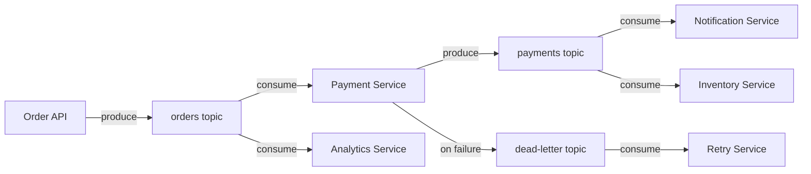

# Apache Kafka — The Distributed Log, Not a Queue

> A project-driven curriculum for backend engineers who already understand Kafka theory but have never used it seriously in code.

## The Project

We build **one system** across all phases: an **Order & Payment Pipeline**.

Orders come in. Payments must be processed. Notifications must go out. Inventory must update. Failures will happen. Things will break. Kafka holds it all together — not because it's magical, but because it's an append-only distributed log that decouples services in time.

By the end, Kafka should feel boring and obvious. That's the goal.

## Who This Is For

- You already know what topics, partitions, brokers, and offsets are
- You have NOT built a real system on Kafka
- You write TypeScript and/or Go
- You prefer terminals over dashboards
- You want to understand Kafka the way production engineers think about it

## Curriculum Phases

| Phase | Title | What You Build |
|-------|-------|----------------|
| [Phase 0](phase-00-pre-kafka/README.md) | The Pre-Kafka Pain | Synchronous order pipeline — and why it breaks |
| [Phase 1](phase-01-log-basics/README.md) | Kafka as a Log | First producer, first consumer, message replay |
| [Phase 2](phase-02-partitions/README.md) | Partitioning & Scale | Key-based routing, parallel consumers |
| [Phase 3](phase-03-consumer-groups/README.md) | Consumer Groups & Coordination | Horizontal scaling, rebalancing, offset commits |
| [Phase 4](phase-04-failure-retries/README.md) | Failure, Retries & Idempotency | Delivery semantics, duplicate handling |
| [Phase 5](phase-05-dead-letter/README.md) | Dead Letters & Poison Messages | Error isolation, operational safety |
| [Phase 6](phase-06-schemas/README.md) | Schema & Evolution | Message contracts, backward compatibility |
| [Phase 7](phase-07-replay/README.md) | Time, Retention & Replay | Kafka as source of truth, reprocessing |
| [Phase 8](phase-08-ops/README.md) | Observability & Ops Thinking | Lag, throughput, failure patterns |

## How to Use This

1. **Read each phase in order.** They build on each other.
2. **Write the code yourself.** Both TS and Go. Don't just read.
3. **Run a local Kafka cluster.** Docker Compose is provided in Phase 1.
4. **Break things intentionally.** Kill brokers. Crash consumers. That's the point.
5. **Read the diagrams carefully.** They encode the architecture decisions.

## Prerequisites

- Docker & Docker Compose
- Node.js 18+ / TypeScript 5+
- Go 1.21+
- A terminal you're comfortable in
- Basic understanding of Kafka vocabulary (topic, partition, broker, offset, consumer group)

## What You Will NOT Find Here

- Kafka Streams or ksqlDB (those are separate ecosystems)
- Confluent Cloud tutorials
- UI dashboards or control centers
- Kafka Connect (out of scope for this curriculum)
- Spring Boot or Java examples

## Project Architecture (Final State)

This is where we end up. We start with none of it.
